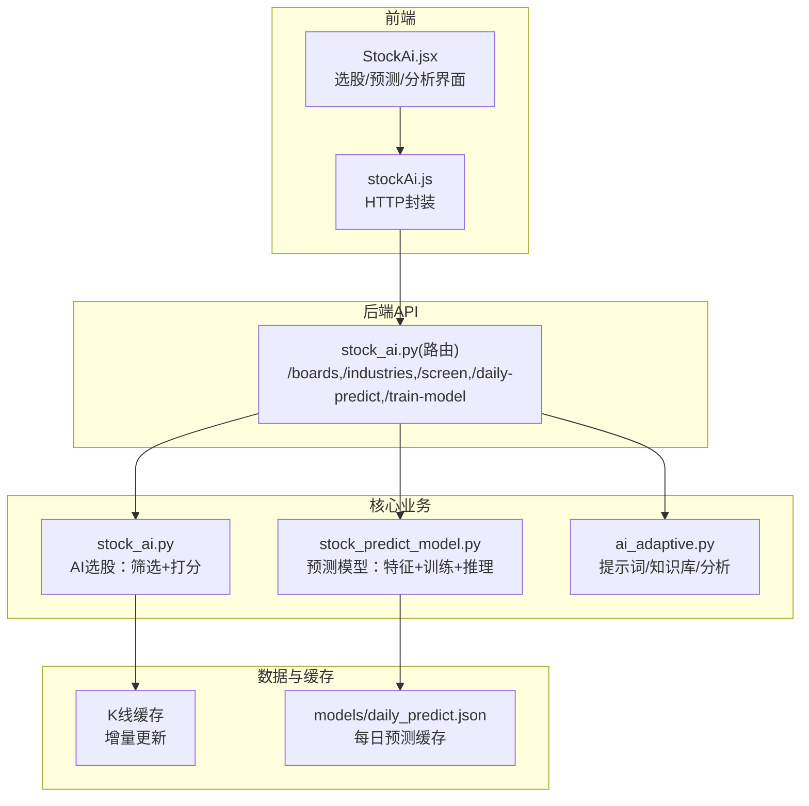
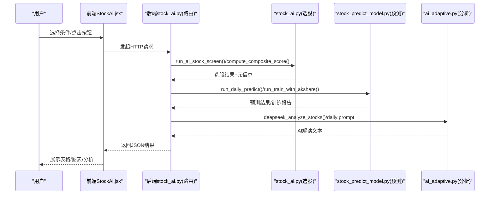
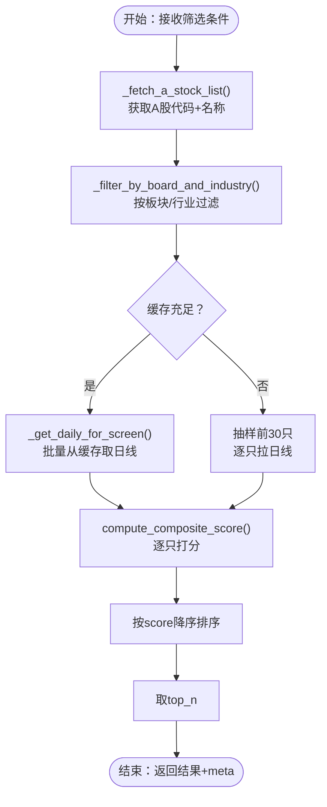
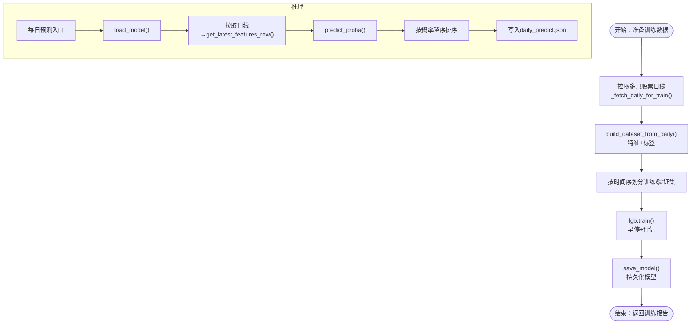
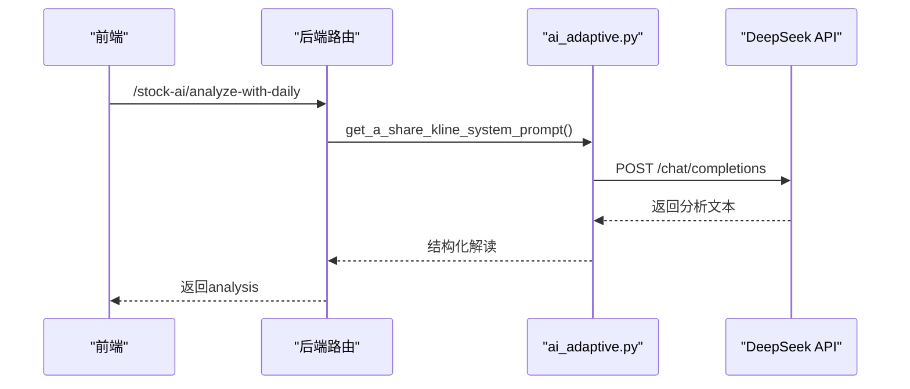
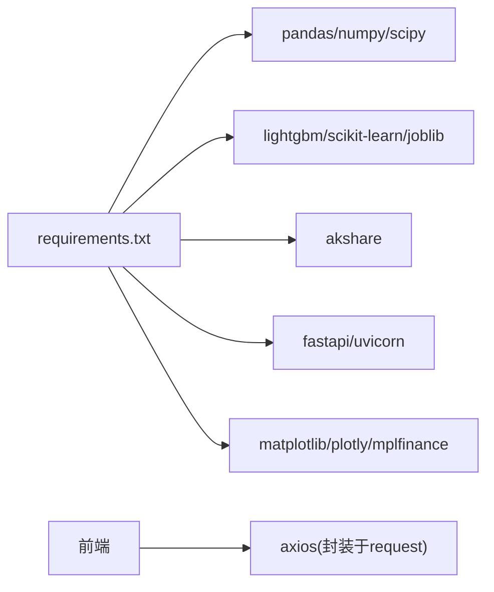

# AI实验功能

<cite>
**本文档引用的文件**
- [stock_ai.py](file://backpack_quant_trading/core/stock_ai.py)
- [stock_predict_model.py](file://backpack_quant_trading/core/stock_predict_model.py)
- [stock_ai.py（API路由器）](file://backpack_quant_trading/api/routers/stock_ai.py)
- [StockAi.jsx（前端视图）](file://backpack_quant_trading/frontend/src/views/StockAi.jsx)
- [stockAi.js（前端API封装）](file://backpack_quant_trading/frontend/src/api/stockAi.js)
- [run_train_stock_model.py（命令行训练脚本）](file://backpack_quant_trading/run_train_stock_model.py)
- [daily_predict.json（每日预测缓存）](file://backpack_quant_trading/models/daily_predict.json)
- [ai_adaptive.py（AI自适应与提示词）](file://backpack_quant_trading/core/ai_adaptive.py)
- [requirements.txt（依赖清单）](file://backpack_quant_trading/requirements.txt)
- [settings.py（配置）](file://backpack_quant_trading/config/settings.py)
</cite>

## 目录
1. [简介](#简介)
2. [项目结构](#项目结构)
3. [核心组件](#核心组件)
4. [架构总览](#架构总览)
5. [详细组件分析](#详细组件分析)
6. [依赖分析](#依赖分析)
7. [性能考虑](#性能考虑)
8. [故障排查指南](#故障排查指南)
9. [结论](#结论)
10. [附录](#附录)

## 简介
本文件面向“AI实验功能”，系统性阐述A股AI选股与3~5日涨跌预测模型的实现原理、训练流程与预测方法。内容涵盖：
- 机器学习模型的特征工程、训练过程与性能评估
- A股AI选股的设计思路与算法实现（板块/行业筛选 + 多指标打分）
- 模型训练数据准备、参数调优与预测结果分析
- 实际使用场景与代码示例路径指引
- 模型局限性与改进方向

## 项目结构
AI实验功能由后端核心模块、API路由、前端视图与API封装、训练脚本与模型缓存组成，形成“数据采集 → 特征工程 → 模型训练 → 预测推理 → 结果展示”的闭环。

图表来源
- [stock_ai.py（API路由器）:1-218](file://backpack_quant_trading/api/routers/stock_ai.py#L1-L218)
- [stock_ai.py:1-1135](file://backpack_quant_trading/core/stock_ai.py#L1-L1135)
- [stock_predict_model.py:1-642](file://backpack_quant_trading/core/stock_predict_model.py#L1-L642)
- [ai_adaptive.py:1-338](file://backpack_quant_trading/core/ai_adaptive.py#L1-L338)
- [daily_predict.json:1-145](file://backpack_quant_trading/models/daily_predict.json#L1-L145)

章节来源
- [stock_ai.py（API路由器）:1-218](file://backpack_quant_trading/api/routers/stock_ai.py#L1-L218)
- [stock_ai.py:1-1135](file://backpack_quant_trading/core/stock_ai.py#L1-L1135)
- [stock_predict_model.py:1-642](file://backpack_quant_trading/core/stock_predict_model.py#L1-L642)
- [ai_adaptive.py:1-338](file://backpack_quant_trading/core/ai_adaptive.py#L1-L338)
- [daily_predict.json:1-145](file://backpack_quant_trading/models/daily_predict.json#L1-L145)

## 核心组件
- A股AI选股服务：板块/行业筛选 + 多指标综合打分（MACD/RSI/KDJ/量比/OBV/均线/主力净流入），支持缓存充足时全量打分与抽样打分两种模式。
- 3~5日涨跌预测模型：基于LightGBM的二分类模型，特征工程来自OHLCV与技术指标，标签为未来N日是否上涨（阈值2%）。
- API与前端：提供板块/行业选项、选股、AI解读、模型训练、每日预测、单股分析等能力。

章节来源
- [stock_ai.py:71-1135](file://backpack_quant_trading/core/stock_ai.py#L71-L1135)
- [stock_predict_model.py:52-642](file://backpack_quant_trading/core/stock_predict_model.py#L52-L642)
- [stock_ai.py（API路由器）:1-218](file://backpack_quant_trading/api/routers/stock_ai.py#L1-L218)
- [StockAi.jsx（前端视图）:1-585](file://backpack_quant_trading/frontend/src/views/StockAi.jsx#L1-L585)
- [stockAi.js（前端API封装）:1-16](file://backpack_quant_trading/frontend/src/api/stockAi.js#L1-L16)

## 架构总览
AI实验功能采用前后端分离架构，后端通过FastAPI提供REST接口，前端React组件负责交互与展示。核心流程如下：

图表来源
- [stock_ai.py（API路由器）:81-217](file://backpack_quant_trading/api/routers/stock_ai.py#L81-L217)
- [stock_ai.py:626-720](file://backpack_quant_trading/core/stock_ai.py#L626-L720)
- [stock_predict_model.py:340-464](file://backpack_quant_trading/core/stock_predict_model.py#L340-L464)
- [ai_adaptive.py:131-171](file://backpack_quant_trading/core/ai_adaptive.py#L131-L171)

## 详细组件分析

### A股AI选股服务
- 设计思路
  - 板块/行业筛选：支持主板、创业板、科创板、北交所；行业来源于akshare，若不可用则回退默认列表。
  - 筛选池构建：优先从本地K线缓存批量拉取，若缓存充足则对全量候选打分；否则抽样前30只以降低接口压力。
  - 多指标打分：MACD柱、RSI、KDJ、量比、OBV、均线多头排列、主力净流入，权重合计归一化至0~100。
- 关键函数与流程
  - 板块/行业选项：get_board_options()/get_industry_options()
  - 股票池构建：_fetch_a_stock_list()、_filter_by_board_and_industry()、_get_industry_constituents()
  - 日线获取：_get_daily_for_screen()、_fetch_daily()（腾讯/新浪/东方财富）
  - 指标计算：_macd_signal()、_rsi()、_kdj()、_volume_ratio()、_obv_score()、_ma_cross_score()、_fund_flow_score()
  - 综合打分：compute_composite_score()，返回score与details
  - 选股入口：run_ai_stock_screen()，返回(top_n结果, meta)

图表来源
- [stock_ai.py:131-166](file://backpack_quant_trading/core/stock_ai.py#L131-L166)
- [stock_ai.py:169-200](file://backpack_quant_trading/core/stock_ai.py#L169-L200)
- [stock_ai.py:285-331](file://backpack_quant_trading/core/stock_ai.py#L285-L331)
- [stock_ai.py:436-520](file://backpack_quant_trading/core/stock_ai.py#L436-L520)
- [stock_ai.py:626-720](file://backpack_quant_trading/core/stock_ai.py#L626-L720)

章节来源
- [stock_ai.py:71-1135](file://backpack_quant_trading/core/stock_ai.py#L71-L1135)

### 3~5日涨跌预测模型
- 特征工程
  - 收益率：ret_1d/ret_5d/ret_20d
  - 波动率：volatility_5d/volatility_20d
  - 技术指标：RSI、MACD（hist/dif/dea）、KDJ（k/d/j）
  - 量价关系：volume_ratio_5、ma5/ma20交叉、close/ma5与close/ma20比率
- 标签构造
  - 未来forward_days日收益率超过阈值threshold（默认2%）标记为正类，否则负类
- 训练流程
  - 时间序划分训练/验证集（8:2），LightGBM二分类，早停防止过拟合
  - 输出验证集准确率与AUC，并打印分类报告
- 推理与缓存
  - 每日预测：对股票池计算最新特征→模型预测→按看涨概率排序
  - 结果缓存到models/daily_predict.json，按日期存储，支持强制刷新与跳过缓存
- 训练入口
  - API：POST /api/stock-ai/train-model
  - 命令行：python run_train_stock_model.py

图表来源
- [stock_predict_model.py:160-198](file://backpack_quant_trading/core/stock_predict_model.py#L160-L198)
- [stock_predict_model.py:201-255](file://backpack_quant_trading/core/stock_predict_model.py#L201-L255)
- [stock_predict_model.py:258-300](file://backpack_quant_trading/core/stock_predict_model.py#L258-L300)
- [stock_predict_model.py:340-464](file://backpack_quant_trading/core/stock_predict_model.py#L340-L464)
- [run_train_stock_model.py:22-55](file://backpack_quant_trading/run_train_stock_model.py#L22-L55)

章节来源
- [stock_predict_model.py:52-642](file://backpack_quant_trading/core/stock_predict_model.py#L52-L642)
- [run_train_stock_model.py:1-55](file://backpack_quant_trading/run_train_stock_model.py#L1-L55)
- [daily_predict.json:1-145](file://backpack_quant_trading/models/daily_predict.json#L1-L145)

### AI解读与分析（DeepSeek）
- 简要解读：对选股结果做综合评分、技术面与买卖建议的简要总结
- 日线技术分析：拉取日线数据，结合知识库与资深A股交易员角色，输出趋势判断、策略建议与交易参数
- 提示词与知识库：ai_adaptive.py提供系统提示词、交易员人设与技术指标知识库

图表来源
- [stock_ai.py（API路由器）:138-144](file://backpack_quant_trading/api/routers/stock_ai.py#L138-L144)
- [ai_adaptive.py:131-171](file://backpack_quant_trading/core/ai_adaptive.py#L131-L171)

章节来源
- [stock_ai.py（API路由器）:129-160](file://backpack_quant_trading/api/routers/stock_ai.py#L129-L160)
- [ai_adaptive.py:1-338](file://backpack_quant_trading/core/ai_adaptive.py#L1-L338)

### 前端交互与使用场景
- 页面组件：StockAi.jsx提供板块/行业筛选、回溯天数、最低得分、返回数量等参数，支持刷新K线缓存、训练模型、获取/强制刷新每日预测、对选股结果预测、单股分析与AI解读。
- API封装：stockAi.js定义了常用请求方法，包含超时控制与默认参数。
- 使用场景示例
  - 场景1：全市场选股并获取AI解读
    - 步骤：选择板块/行业 → 点击“开始选股” → 点击“DeepSeek AI 解读”
    - 参考路径：[StockAi.jsx:244-304](file://backpack_quant_trading/frontend/src/views/StockAi.jsx#L244-L304)、[stock_ai.py（API路由器）:81-122](file://backpack_quant_trading/api/routers/stock_ai.py#L81-L122)
  - 场景2：训练预测模型并每日推送
    - 步骤：点击“训练模型” → 等待训练完成 → 点击“获取今日预测”
    - 参考路径：[StockAi.jsx:191-217](file://backpack_quant_trading/frontend/src/views/StockAi.jsx#L191-L217)、[run_train_stock_model.py:22-55](file://backpack_quant_trading/run_train_stock_model.py#L22-L55)
  - 场景3：对选股结果二次预测
    - 步骤：先选股 → 点击“对选股结果预测”
    - 参考路径：[StockAi.jsx:219-238](file://backpack_quant_trading/frontend/src/views/StockAi.jsx#L219-L238)、[stock_ai.py（API路由器）:202-217](file://backpack_quant_trading/api/routers/stock_ai.py#L202-L217)

章节来源
- [StockAi.jsx（前端视图）:1-585](file://backpack_quant_trading/frontend/src/views/StockAi.jsx#L1-L585)
- [stockAi.js（前端API封装）:1-16](file://backpack_quant_trading/frontend/src/api/stockAi.js#L1-L16)
- [stock_ai.py（API路由器）:173-217](file://backpack_quant_trading/api/routers/stock_ai.py#L173-L217)

## 依赖分析
- Python依赖（核心）
  - 数据与科学计算：pandas、numpy、scipy
  - 机器学习：lightgbm、scikit-learn、joblib
  - 数据源：akshare（A股日线/板块/行业/资金流）
  - Web框架：fastapi、uvicorn
  - 可视化：matplotlib、plotly、mplfinance
  - 其他：requests、websockets、aiohttp、SQLAlchemy、cryptography、loguru
- 前端依赖（与AI实验相关）
  - axios（通过封装的request）发起HTTP请求
  - React组件负责UI与交互

图表来源
- [requirements.txt:1-61](file://backpack_quant_trading/requirements.txt#L1-L61)

章节来源
- [requirements.txt:1-61](file://backpack_quant_trading/requirements.txt#L1-L61)

## 性能考虑
- 并发与超时
  - 选股阶段使用ThreadPoolExecutor并发拉取日线，单只超时8秒，总超时60秒，避免阻塞
  - 预测阶段同样限制单只与总超时，保障接口稳定性
- 缓存与抽样
  - 优先使用K线缓存批量打分，缓存不足时抽样前30只，显著降低接口压力
- 特征与模型
  - 特征列固定且有限，推理时仅取必要列并填充0，提升速度
  - LightGBM模型保存与加载采用临时文件规避Windows路径编码问题
- 前端体验
  - 请求超时延长至数分钟，满足多只股票日线拉取与AI分析的复杂场景

章节来源
- [stock_ai.py:704-720](file://backpack_quant_trading/core/stock_ai.py#L704-L720)
- [stock_predict_model.py:438-464](file://backpack_quant_trading/core/stock_predict_model.py#L438-L464)
- [stock_ai.py（API路由器）:6-11](file://backpack_quant_trading/api/routers/stock_ai.py#L6-L11)

## 故障排查指南
- akshare未安装或接口异常
  - 现象：无法获取板块/行业列表、A股列表或日线数据
  - 处理：安装akshare；检查网络与版本；前端默认列表可用作回退
  - 参考路径：[stock_ai.py:96-112](file://backpack_quant_trading/core/stock_ai.py#L96-L112)
- LightGBM/模型文件缺失
  - 现象：训练/预测时报错或找不到模型文件
  - 处理：安装lightgbm与scikit-learn；先训练模型再进行预测；确认模型保存路径
  - 参考路径：[stock_predict_model.py:210-211](file://backpack_quant_trading/core/stock_predict_model.py#L210-L211)、[run_train_stock_model.py:22-55](file://backpack_quant_trading/run_train_stock_model.py#L22-L55)
- 深度学习接口异常
  - 现象：DEEPSEEK_API_KEY未配置或请求超时
  - 处理：配置DEEPSEEK_API_KEY；检查网络；缩短分析范围（max_items）
  - 参考路径：[stock_ai.py:728-777](file://backpack_quant_trading/core/stock_ai.py#L728-L777)
- 前端登录与权限
  - 现象：401未授权
  - 处理：先登录；确认后端鉴权中间件正常
  - 参考路径：[stock_ai.py（API路由器）:85-94](file://backpack_quant_trading/api/routers/stock_ai.py#L85-L94)

章节来源
- [stock_ai.py:96-112](file://backpack_quant_trading/core/stock_ai.py#L96-L112)
- [stock_predict_model.py:210-211](file://backpack_quant_trading/core/stock_predict_model.py#L210-L211)
- [stock_ai.py（API路由器）:85-94](file://backpack_quant_trading/api/routers/stock_ai.py#L85-L94)

## 结论
本AI实验功能通过“多指标打分 + LightGBM预测”的组合，实现了A股的智能选股与短期涨跌预测。其优势在于：
- 选股流程兼顾缓存与抽样，兼顾准确性与性能
- 特征工程简洁稳健，易于扩展
- 前后端解耦，支持命令行与API双入口
建议后续方向：
- 特征工程：引入更多宏观/消息面特征，尝试时序模型（如Transformer/LSTM）捕捉长期趋势
- 模型优化：网格搜索/贝叶斯优化超参，尝试集成学习与在线学习
- 评测体系：引入滚动回测、夏普率、最大回撤等更全面的指标
- 交互增强：前端可视化K线叠加技术指标，支持用户自定义策略回测

## 附录
- 常用命令与路径
  - 训练模型（命令行）：[run_train_stock_model.py:22-55](file://backpack_quant_trading/run_train_stock_model.py#L22-L55)
  - 训练模型（API）：POST /api/stock-ai/train-model
  - 每日预测（API）：POST /api/stock-ai/daily-predict
  - 选股（API）：POST /api/stock-ai/screen
  - AI解读（API）：POST /api/stock-ai/analyze-with-daily
- 模型与缓存
  - 模型保存路径：models/stock_predict_lgb.txt
  - 每日预测缓存：models/daily_predict.json
- 配置与环境
  - 环境变量：DEEPSEEK_API_KEY（AI解读）、数据库与交易所相关配置见settings.py
  - 依赖安装：requirements.txt

章节来源
- [run_train_stock_model.py:1-55](file://backpack_quant_trading/run_train_stock_model.py#L1-L55)
- [stock_ai.py（API路由器）:173-217](file://backpack_quant_trading/api/routers/stock_ai.py#L173-L217)
- [daily_predict.json:1-145](file://backpack_quant_trading/models/daily_predict.json#L1-L145)
- [settings.py:1-137](file://backpack_quant_trading/config/settings.py#L1-L137)
- [requirements.txt:1-61](file://backpack_quant_trading/requirements.txt#L1-L61)