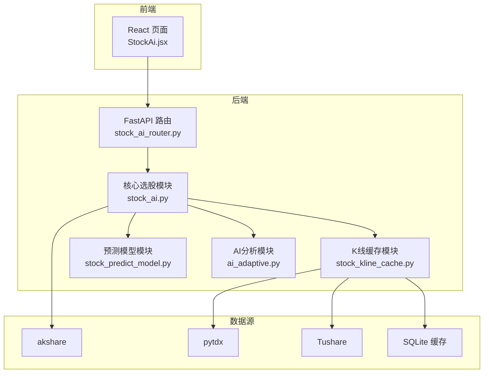
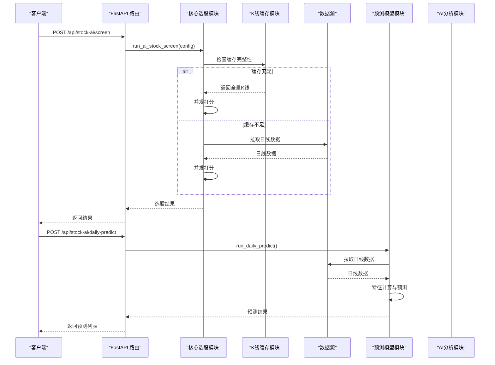
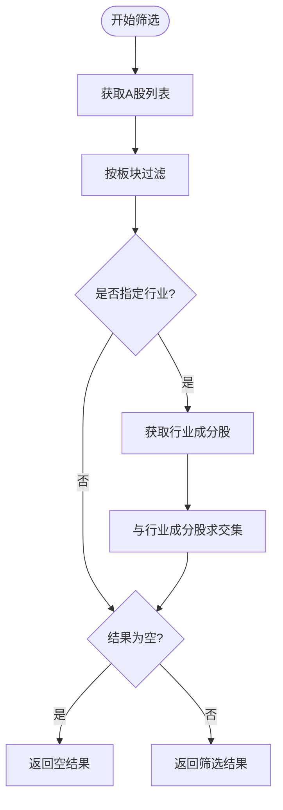
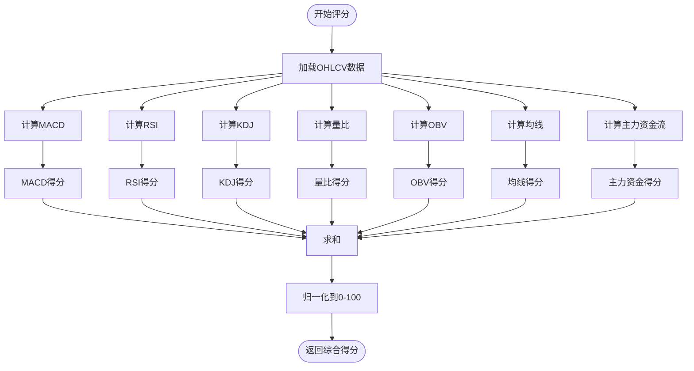
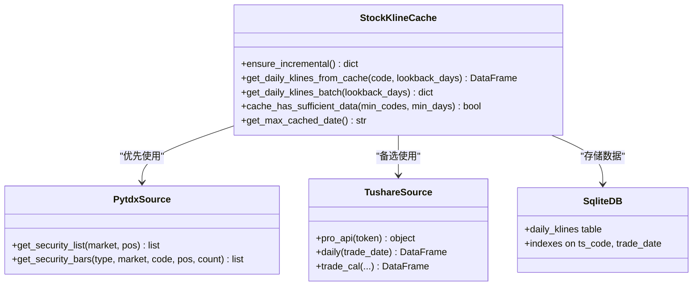
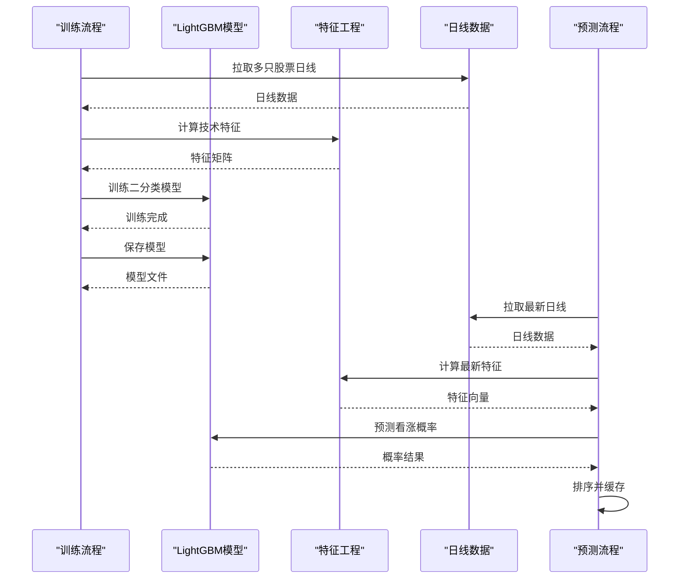
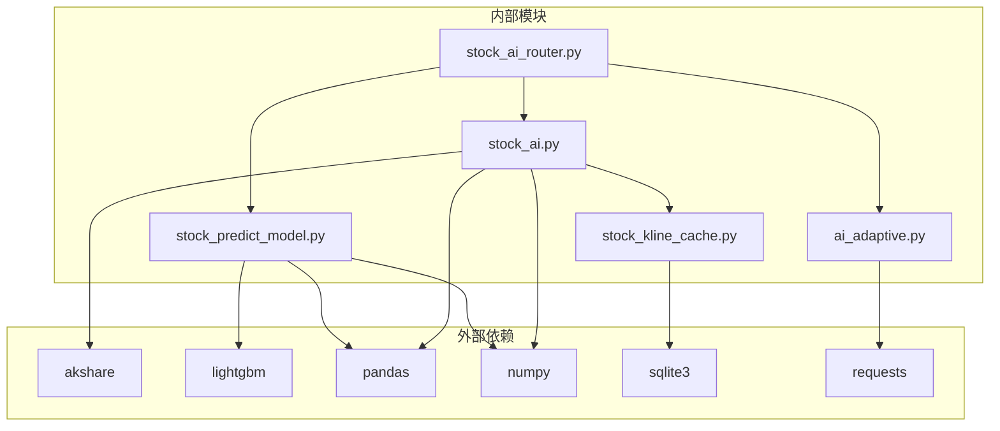

# A股AI选股系统

<cite>
**本文档引用的文件**
- [stock_ai.py](file://backpack_quant_trading/core/stock_ai.py)
- [stock_ai_router.py](file://backpack_quant_trading/api/routers/stock_ai.py)
- [stock_kline_cache.py](file://backpack_quant_trading/core/stock_kline_cache.py)
- [stock_predict_model.py](file://backpack_quant_trading/core/stock_predict_model.py)
- [ai_adaptive.py](file://backpack_quant_trading/core/ai_adaptive.py)
- [settings.py](file://backpack_quant_trading/config/settings.py)
- [StockAi.jsx](file://backpack_quant_trading/frontend/src/views/StockAi.jsx)
- [stock_predict_lgb.txt](file://backpack_quant_trading/models/stock_predict_lgb.txt)
- [logger.py](file://backpack_quant_trading/utils/logger.py)
</cite>

## 目录
1. [简介](#简介)
2. [项目结构](#项目结构)
3. [核心组件](#核心组件)
4. [架构总览](#架构总览)
5. [详细组件分析](#详细组件分析)
6. [依赖关系分析](#依赖关系分析)
7. [性能考虑](#性能考虑)
8. [故障排查指南](#故障排查指南)
9. [结论](#结论)
10. [附录](#附录)

## 简介
本项目为A股AI选股系统，提供板块/行业筛选、多指标综合评分、主力资金流分析、量比计算与主力资金流分析等功能。系统支持全量K线缓存、并发打分、预测模型训练与每日预测，并通过FastAPI提供REST接口，前端React页面提供交互体验。系统采用akshare作为数据源，支持多数据源回退策略，确保在反爬或接口不稳定时仍可正常工作。

## 项目结构
项目采用前后端分离架构，核心业务逻辑位于Python后端，前端使用React构建。核心模块包括：
- 核心选股模块：负责板块/行业筛选、指标计算、综合评分与结果排序
- K线缓存模块：提供SQLite本地缓存与增量更新能力
- 预测模型模块：基于LightGBM的短期涨跌预测
- AI分析模块：集成DeepSeek进行技术面解读
- API路由模块：提供REST接口
- 前端页面：提供可视化筛选与结果展示

**图表来源**
- [stock_ai_router.py:1-218](file://backpack_quant_trading/api/routers/stock_ai.py#L1-L218)
- [stock_ai.py:1-1135](file://backpack_quant_trading/core/stock_ai.py#L1-L1135)
- [stock_kline_cache.py:1-464](file://backpack_quant_trading/core/stock_kline_cache.py#L1-L464)
- [stock_predict_model.py:1-642](file://backpack_quant_trading/core/stock_predict_model.py#L1-L642)
- [ai_adaptive.py:1-338](file://backpack_quant_trading/core/ai_adaptive.py#L1-L338)

**章节来源**
- [stock_ai_router.py:1-218](file://backpack_quant_trading/api/routers/stock_ai.py#L1-L218)
- [stock_ai.py:1-1135](file://backpack_quant_trading/core/stock_ai.py#L1-L1135)
- [stock_kline_cache.py:1-464](file://backpack_quant_trading/core/stock_kline_cache.py#L1-L464)

## 核心组件
本系统的核心组件包括：
- 板块/行业筛选与股票池构建：支持主板、创业板、科创板、北交所板块筛选，以及行业成分股过滤
- 多指标评分体系：包含MACD、RSI、KDJ、OBV、量比、均线交叉、主力资金流等指标
- K线缓存与增量更新：SQLite本地缓存，支持pytdx/Tushare两种数据源
- 预测模型：基于LightGBM的短期涨跌预测模型
- AI分析：集成DeepSeek进行技术面解读与操作建议

**章节来源**
- [stock_ai.py:71-1135](file://backpack_quant_trading/core/stock_ai.py#L71-L1135)
- [stock_kline_cache.py:1-464](file://backpack_quant_trading/core/stock_kline_cache.py#L1-L464)
- [stock_predict_model.py:1-642](file://backpack_quant_trading/core/stock_predict_model.py#L1-L642)
- [ai_adaptive.py:1-338](file://backpack_quant_trading/core/ai_adaptive.py#L1-L338)

## 架构总览
系统采用分层架构，前端通过HTTP请求调用后端API，后端核心模块负责数据获取、指标计算与结果排序，K线缓存模块提供高性能的数据访问，预测模型模块提供短期涨跌预测能力。

**图表来源**
- [stock_ai_router.py:81-122](file://backpack_quant_trading/api/routers/stock_ai.py#L81-L122)
- [stock_ai.py:626-720](file://backpack_quant_trading/core/stock_ai.py#L626-L720)
- [stock_kline_cache.py:418-464](file://backpack_quant_trading/core/stock_kline_cache.py#L418-L464)
- [stock_predict_model.py:340-464](file://backpack_quant_trading/core/stock_predict_model.py#L340-L464)

## 详细组件分析

### 板块筛选与行业过滤
系统支持四大板块筛选：主板（沪市+深市）、创业板、科创板、北交所。每个板块对应不同的股票代码前缀和市场标识。行业过滤通过akshare的行业成分股接口实现，支持从行业名称获取对应的股票代码集合。

**图表来源**
- [stock_ai.py:169-200](file://backpack_quant_trading/core/stock_ai.py#L169-L200)
- [stock_ai.py:643-654](file://backpack_quant_trading/core/stock_ai.py#L643-L654)

**章节来源**
- [stock_ai.py:28-68](file://backpack_quant_trading/core/stock_ai.py#L28-L68)
- [stock_ai.py:81-113](file://backpack_quant_trading/core/stock_ai.py#L81-L113)
- [stock_ai.py:169-200](file://backpack_quant_trading/core/stock_ai.py#L169-L200)

### 多指标评分体系
系统采用综合评分算法，将多个技术指标转换为0-100分的综合得分。各指标的权重分配如下：
- MACD：15分（红柱且DIF>DEA）
- RSI：15分（30-70区间）
- KDJ：15分（K>D且J<80）
- 量比：12分（1.0-2.5倍）
- OBV：10分（量价配合）
- 均线：10分（金叉/多头排列）
- 主力资金流：18分（主力净流入占比）

**图表来源**
- [stock_ai.py:436-521](file://backpack_quant_trading/core/stock_ai.py#L436-L521)

**章节来源**
- [stock_ai.py:334-521](file://backpack_quant_trading/core/stock_ai.py#L334-L521)

### 主力资金流分析
主力资金流通过akshare的个股资金流接口获取，主要指标为主力净流入-净占比。系统将该指标映射到0-1的得分范围，其中-10%到10%映射到0到1之间。

**章节来源**
- [stock_ai.py:408-434](file://backpack_quant_trading/core/stock_ai.py#L408-L434)

### 量比计算
量比定义为当日成交量与过去N日平均成交量的比值。系统默认使用5日作为基准周期，用于衡量当日放量程度。

**章节来源**
- [stock_ai.py:386-395](file://backpack_quant_trading/core/stock_ai.py#L386-L395)

### OBV量价配合
OBV（On-Balance Volume）通过累计成交量与价格变化的关系来判断资金流向。系统计算OBV的趋势与价格趋势的一致性，一致时得1分，不一致时得0分。

**章节来源**
- [stock_ai.py:374-384](file://backpack_quant_trading/core/stock_ai.py#L374-L384)

### 均线交叉评分
系统通过5日和20日均线的相对位置判断多头排列情况，金叉时得1分，死叉时得0分。

**章节来源**
- [stock_ai.py:397-406](file://backpack_quant_trading/core/stock_ai.py#L397-L406)

### K线缓存与增量更新
系统提供SQLite本地缓存，支持pytdx和Tushare两种数据源。缓存包含日线数据的完整字段，支持按日期范围查询和批量读取。

**图表来源**
- [stock_kline_cache.py:82-106](file://backpack_quant_trading/core/stock_kline_cache.py#L82-L106)
- [stock_kline_cache.py:366-404](file://backpack_quant_trading/core/stock_kline_cache.py#L366-L404)
- [stock_kline_cache.py:429-464](file://backpack_quant_trading/core/stock_kline_cache.py#L429-L464)

**章节来源**
- [stock_kline_cache.py:1-464](file://backpack_quant_trading/core/stock_kline_cache.py#L1-L464)

### 预测模型训练与推理
系统基于LightGBM构建短期涨跌预测模型，特征包括收益率、波动率、RSI、MACD、KDJ、量比、均线状态等。模型训练完成后可进行每日预测，返回按看涨概率排序的股票列表。

**图表来源**
- [stock_predict_model.py:521-642](file://backpack_quant_trading/core/stock_predict_model.py#L521-L642)
- [stock_predict_model.py:340-464](file://backpack_quant_trading/core/stock_predict_model.py#L340-L464)

**章节来源**
- [stock_predict_model.py:1-642](file://backpack_quant_trading/core/stock_predict_model.py#L1-L642)
- [stock_predict_lgb.txt:1-213](file://backpack_quant_trading/models/stock_predict_lgb.txt#L1-L213)

### AI分析与解读
系统集成DeepSeek进行技术面解读，提供趋势判断、策略建议和交易参数。AI分析基于系统提示词和知识库，结合技术指标进行综合分析。

**章节来源**
- [ai_adaptive.py:1-338](file://backpack_quant_trading/core/ai_adaptive.py#L1-L338)
- [stock_ai_router.py:129-161](file://backpack_quant_trading/api/routers/stock_ai.py#L129-L161)

## 依赖关系分析

**图表来源**
- [stock_ai.py:1-27](file://backpack_quant_trading/core/stock_ai.py#L1-L27)
- [stock_kline_cache.py:1-24](file://backpack_quant_trading/core/stock_kline_cache.py#L1-L24)
- [stock_predict_model.py:35-47](file://backpack_quant_trading/core/stock_predict_model.py#L35-L47)
- [ai_adaptive.py:11-15](file://backpack_quant_trading/core/ai_adaptive.py#L11-L15)

**章节来源**
- [stock_ai.py:1-27](file://backpack_quant_trading/core/stock_ai.py#L1-L27)
- [stock_kline_cache.py:1-24](file://backpack_quant_trading/core/stock_kline_cache.py#L1-L24)
- [stock_predict_model.py:35-47](file://backpack_quant_trading/core/stock_predict_model.py#L35-L47)
- [ai_adaptive.py:11-15](file://backpack_quant_trading/core/ai_adaptive.py#L11-L15)

## 性能考虑
系统在性能方面采取了多项优化措施：
- K线缓存：通过SQLite本地缓存避免频繁网络请求
- 并发处理：使用ThreadPoolExecutor并行处理多个股票的指标计算
- 数据源回退：优先使用稳定的数据源，失败时自动切换
- 批量处理：全量缓存时使用批量读取和内存映射
- 超时控制：为每个请求设置合理的超时时间

**章节来源**
- [stock_ai.py:704-720](file://backpack_quant_trading/core/stock_ai.py#L704-L720)
- [stock_kline_cache.py:418-464](file://backpack_quant_trading/core/stock_kline_cache.py#L418-L464)

## 故障排查指南
系统提供了完善的错误处理和日志记录机制：

### 常见问题与解决方案
1. **akshare未安装**：系统会优雅降级，返回默认行业列表
2. **网络连接失败**：自动切换到备用数据源或使用缓存数据
3. **接口限流**：通过超时控制和重试机制处理
4. **模型文件缺失**：提示用户先进行模型训练

### 日志记录
系统使用自定义的SafeRotatingFileHandler，确保在Windows环境下日志文件的安全写入。日志分为交易日志、错误日志和常规应用日志。

**章节来源**
- [stock_ai.py:633-640](file://backpack_quant_trading/core/stock_ai.py#L633-L640)
- [logger.py:1-180](file://backpack_quant_trading/utils/logger.py#L1-L180)

## 结论
A股AI选股系统通过模块化设计实现了完整的选股流程，包括板块/行业筛选、多指标评分、K线缓存、预测模型和AI分析。系统具有良好的扩展性和容错能力，能够适应不同的数据源和网络环境。通过合理的性能优化和错误处理，系统能够在生产环境中稳定运行。

## 附录

### API配置参数说明
- **StockAiConfig**：选股请求参数
  - boards: 板块列表（默认为空，表示全部）
  - industries: 行业列表（默认为空，表示全部）
  - top_n: 返回股票数量（默认30）
  - min_score: 最低得分阈值（默认0.0）
  - lookback_days: 指标计算回溯天数（默认120）

- **预测模型训练参数**：
  - stock_codes: 股票代码列表（为空时使用默认池）
  - forward_days: 预测天数（默认5）
  - lookback_days: 回溯天数（默认500）
  - label_threshold: 标签阈值（默认0.02）
  - val_ratio: 验证集比例（默认0.2）

### 代码示例路径
- 配置StockAiConfig参数：[stock_ai_router.py:95-101](file://backpack_quant_trading/api/routers/stock_ai.py#L95-L101)
- 执行选股流程：[stock_ai_router.py:82-112](file://backpack_quant_trading/api/routers/stock_ai.py#L82-L112)
- 解析结果：[stock_ai_router.py:102-111](file://backpack_quant_trading/api/routers/stock_ai.py#L102-L111)
- 前端调用示例：[StockAi.jsx:244-288](file://backpack_quant_trading/frontend/src/views/StockAi.jsx#L244-L288)