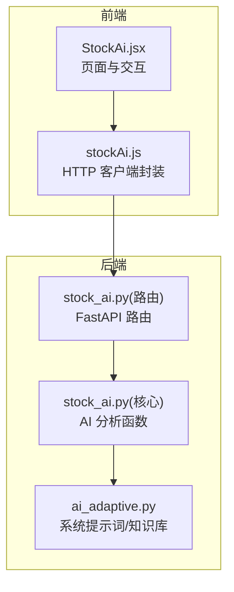
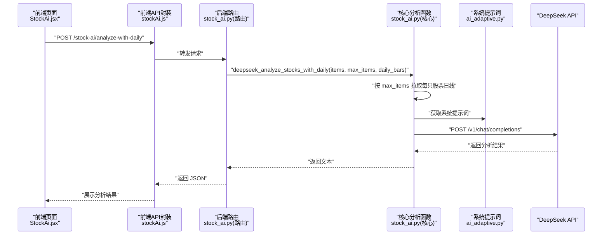
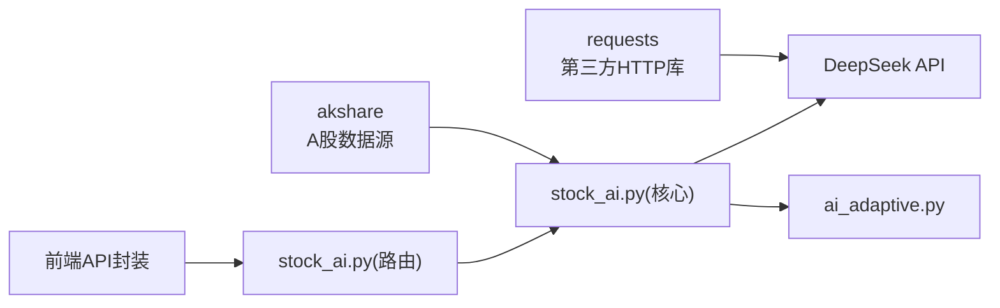

# DeepSeek AI集成

<cite>
**本文档引用的文件**
- [stock_ai.py](file://backpack_quant_trading/core/stock_ai.py)
- [stock_ai.py（路由）](file://backpack_quant_trading/api/routers/stock_ai.py)
- [ai_adaptive.py](file://backpack_quant_trading/core/ai_adaptive.py)
- [settings.py](file://backpack_quant_trading/config/settings.py)
- [StockAi.jsx](file://backpack_quant_trading/frontend/src/views/StockAi.jsx)
- [stockAi.js](file://backpack_quant_trading/frontend/src/api/stockAi.js)
- [requirements.txt](file://backpack_quant_trading/requirements.txt)
</cite>

## 目录
1. [简介](#简介)
2. [项目结构](#项目结构)
3. [核心组件](#核心组件)
4. [架构总览](#架构总览)
5. [详细组件分析](#详细组件分析)
6. [依赖关系分析](#依赖关系分析)
7. [性能考量](#性能考量)
8. [故障排查指南](#故障排查指南)
9. [结论](#结论)
10. [附录](#附录)

## 简介
本文件面向使用 DeepSeek AI 进行 A 股技术分析与解读的开发者与使用者，系统性说明如何配置与调用 DeepSeek API，完成“选股结果简析”和“结合日线的深度技术分析”。文档覆盖以下关键点：
- API 密钥配置与环境变量
- 请求格式与响应处理
- 技术面分析的提示词工程与系统消息设计
- 错误处理、超时管理与 API 限流应对
- 实际调用流程与最佳实践

## 项目结构
本项目采用前后端分离架构，AI 集成位于后端 Python 层，前端通过 REST API 与后端交互。与 DeepSeek 集成相关的核心文件如下：
- 后端核心：stock_ai.py（包含 deepseek_analyze_stocks 与 deepseek_analyze_stocks_with_daily 等函数）
- 后端路由：stock_ai.py（FastAPI 路由，暴露 /stock-ai/analyze 与 /stock-ai/analyze-with-daily 等接口）
- 提示词与知识库：ai_adaptive.py（提供系统提示词与知识库）
- 前端页面与 API 封装：StockAi.jsx 与 stockAi.js
- 依赖声明：requirements.txt（包含 requests、akshare 等）

图表来源
- [stock_ai.py（路由）:129-144](file://backpack_quant_trading/api/routers/stock_ai.py#L129-L144)
- [stock_ai.py（核心）:723-853](file://backpack_quant_trading/core/stock_ai.py#L723-L853)
- [ai_adaptive.py:131-171](file://backpack_quant_trading/core/ai_adaptive.py#L131-L171)
- [StockAi.jsx:290-322](file://backpack_quant_trading/frontend/src/views/StockAi.jsx#L290-L322)
- [stockAi.js:6-15](file://backpack_quant_trading/frontend/src/api/stockAi.js#L6-L15)

章节来源
- [stock_ai.py（路由）:1-218](file://backpack_quant_trading/api/routers/stock_ai.py#L1-L218)
- [stock_ai.py（核心）:723-1135](file://backpack_quant_trading/core/stock_ai.py#L723-L1135)
- [ai_adaptive.py:1-338](file://backpack_quant_trading/core/ai_adaptive.py#L1-L338)
- [StockAi.jsx:1-585](file://backpack_quant_trading/frontend/src/views/StockAi.jsx#L1-L585)
- [stockAi.js:1-16](file://backpack_quant_trading/frontend/src/api/stockAi.js#L1-L16)
- [requirements.txt:1-61](file://backpack_quant_trading/requirements.txt#L1-L61)

## 核心组件
- deepseek_analyze_stocks(items, max_items=15)
  - 输入：选股结果列表（每项包含 code、name、score、details、close、pct_chg 等）
  - 输出：基于多指标的简要解读与操作建议
  - 特点：不拉取日线，仅用指标摘要进行分析
- deepseek_analyze_stocks_with_daily(items, max_items=10, daily_bars=55)
  - 输入：选股结果列表，内部会按 max_items 拉取每只股票的日线（最近 daily_bars 根）
  - 输出：结合日线与知识库的深度技术分析与策略建议
- get_a_share_kline_system_prompt()
  - 返回系统提示词，包含资深交易员人设、技术指标知识库与输出格式约束
- FastAPI 路由
  - /stock-ai/analyze：调用 deepseek_analyze_stocks
  - /stock-ai/analyze-with-daily：调用 deepseek_analyze_stocks_with_daily

章节来源
- [stock_ai.py（核心）:723-853](file://backpack_quant_trading/core/stock_ai.py#L723-L853)
- [stock_ai.py（路由）:129-144](file://backpack_quant_trading/api/routers/stock_ai.py#L129-L144)
- [ai_adaptive.py:131-171](file://backpack_quant_trading/core/ai_adaptive.py#L131-L171)

## 架构总览
下图展示了从前端到后端再到 DeepSeek 的调用链路与数据流。

图表来源
- [stock_ai.py（路由）:138-144](file://backpack_quant_trading/api/routers/stock_ai.py#L138-L144)
- [stock_ai.py（核心）:780-853](file://backpack_quant_trading/core/stock_ai.py#L780-L853)
- [ai_adaptive.py:131-171](file://backpack_quant_trading/core/ai_adaptive.py#L131-L171)
- [stockAi.js:8-15](file://backpack_quant_trading/frontend/src/api/stockAi.js#L8-L15)

## 详细组件分析

### deepseek_analyze_stocks（简要解读）
- 功能概述
  - 将多只股票的指标摘要（综合得分、RSI、MACD、KDJ、量比、主力等）拼接为文本，发送至 DeepSeek，返回简要解读与操作建议。
- 参数
  - items：选股结果列表（每项含 code、name、score、details、close、pct_chg）
  - max_items：最多取前 N 只进行解读
- 请求与响应
  - 请求：POST https://api.deepseek.com/v1/chat/completions
  - 请求头：Authorization: Bearer <DEEPSEEK_API_KEY>, Content-Type: application/json
  - 请求体：{"model":"deepseek-chat","messages":[{"role":"system","content":系统提示词},{"role":"user","content":用户提示词}],"temperature":0.3}
  - 超时：60 秒
  - 响应：返回 choices[0].message.content
- 错误处理
  - 未配置 DEEPSEEK_API_KEY：返回提示信息
  - 无选股结果：返回提示信息
  - 请求超时：返回“请求超时，请稍后重试”
  - API 异常：解析 error.message 并返回
- 最佳实践
  - max_items 控制输入长度，避免超过模型上下文限制
  - 保持 items 字段齐全（score、details、close、pct_chg）

章节来源
- [stock_ai.py（核心）:723-778](file://backpack_quant_trading/core/stock_ai.py#L723-L778)

### deepseek_analyze_stocks_with_daily（日线深度分析）
- 功能概述
  - 对每只股票拉取最近 daily_bars 根日线（OHLCV），拼接为表格文本，结合系统提示词与知识库，输出深度技术分析与策略建议。
- 参数
  - items：选股结果列表
  - max_items：最多取前 N 只
  - daily_bars：每只股票取最近 N 根日线
- 请求与响应
  - 请求：POST https://api.deepseek.com/v1/chat/completions
  - 请求头：Authorization: Bearer <DEEPSEEK_API_KEY>, Content-Type: application/json
  - 请求体：{"model":"deepseek-chat","messages":[{"role":"system","content":系统提示词},{"role":"user","content":用户提示词}],"temperature":0.3}
  - 超时：120 秒
  - 响应：返回 choices[0].message.content
- 错误处理
  - 未配置 DEEPSEEK_API_KEY：返回提示信息
  - 无选股结果：返回提示信息
  - 日线拉取失败或不足：在用户提示中说明并跳过该只
  - 请求超时：返回“请求超时，请稍后重试”
  - API 异常：解析 error.message 并返回
- 最佳实践
  - daily_bars 建议控制在 55 左右，兼顾上下文长度与分析时效
  - 若网络不稳定，可降低 max_items 与 daily_bars

章节来源
- [stock_ai.py（核心）:780-853](file://backpack_quant_trading/core/stock_ai.py#L780-L853)

### 系统提示词与知识库（提示词工程）
- 系统提示词来源
  - get_a_share_kline_system_prompt() 返回包含“资深 A 股交易员”角色、技术指标知识库与输出格式约束的系统提示词
- 知识库要点
  - 移动平均线、布林带、RSI、KDJ、MACD、量价关系、ATR、斐波那契、Ichimoku、K线形态、止损止盈原则等
- 输出格式约束
  - 必须包含“趋势判断”“策略建议”“详细逻辑”“交易参数”，以便前端解析
- 设计原则
  - 强调主次、推理与自然用语，避免机械罗列
  - 明确标注关键支撑/压力位与止损止盈建议

章节来源
- [ai_adaptive.py:131-171](file://backpack_quant_trading/core/ai_adaptive.py#L131-L171)

### 前端调用与交互
- 页面入口
  - StockAi.jsx 提供“DeepSeek AI 解读”按钮，触发 /stock-ai/analyze-with-daily
- API 封装
  - analyzeStocksWithDaily(items) 发送 POST 请求，设置超时 180 秒
- 响应展示
  - 将返回的 analysis 文本渲染在页面卡片中

章节来源
- [StockAi.jsx:290-322](file://backpack_quant_trading/frontend/src/views/StockAi.jsx#L290-L322)
- [stockAi.js:8-15](file://backpack_quant_trading/frontend/src/api/stockAi.js#L8-L15)

## 依赖关系分析
- 外部依赖
  - requests：用于调用 DeepSeek API
  - akshare：用于获取股票列表、日线、新闻、财务摘要等（可选，未安装时部分功能降级）
- 内部依赖
  - ai_adaptive.get_a_share_kline_system_prompt：提供系统提示词
  - stock_ai.deepseek_analyze_stocks / deepseek_analyze_stocks_with_daily：核心分析函数
  - FastAPI 路由：对外暴露 REST 接口

图表来源
- [requirements.txt:4-48](file://backpack_quant_trading/requirements.txt#L4-L48)
- [stock_ai.py（核心）:723-853](file://backpack_quant_trading/core/stock_ai.py#L723-L853)
- [ai_adaptive.py:131-171](file://backpack_quant_trading/core/ai_adaptive.py#L131-L171)
- [stock_ai.py（路由）:129-144](file://backpack_quant_trading/api/routers/stock_ai.py#L129-L144)

章节来源
- [requirements.txt:1-61](file://backpack_quant_trading/requirements.txt#L1-L61)

## 性能考量
- 日线拉取与并发
  - deepseek_analyze_stocks_with_daily 会对每只股票拉取日线，建议控制 max_items 与 daily_bars，避免超时与 API 压力
- 超时与重试
  - deepseek_analyze_stocks_with_daily 超时 120 秒；deepseek_analyze_stocks 超时 60 秒
  - 前端对 /stock-ai/screen 与 /stock-ai/analyze-with-daily 设置了较长超时（300 秒与 180 秒）
- 缓存与回溯天数
  - 通过 lookback_days 控制指标计算回溯范围，避免过长导致性能问题
- 并发与资源
  - 选股阶段使用线程池并发拉取日线，注意服务器资源与网络带宽

章节来源
- [stock_ai.py（核心）:780-853](file://backpack_quant_trading/core/stock_ai.py#L780-L853)
- [stock_ai.py（路由）:81-122](file://backpack_quant_trading/api/routers/stock_ai.py#L81-L122)
- [stockAi.js:6-15](file://backpack_quant_trading/frontend/src/api/stockAi.js#L6-L15)

## 故障排查指南
- 未配置 DEEPSEEK_API_KEY
  - 现象：函数返回“请配置 DEEPSEEK_API_KEY 环境变量后使用 AI 解读/股票分析”
  - 处理：在运行环境中设置 DEEPSEEK_API_KEY
- 无选股结果
  - 现象：返回“暂无选股结果，请先执行选股”
  - 处理：先执行选股，确保 items 非空
- 日线拉取失败或不足
  - 现象：用户提示中说明“日线数据：拉取失败或不足，请略过该只”
  - 处理：检查网络、akshare 数据源可用性；必要时刷新 K 线缓存
- 请求超时
  - 现象：返回“请求超时，请稍后重试”
  - 处理：降低 max_items 与 daily_bars；检查网络与 DeepSeek 服务状态
- API 异常
  - 现象：返回“DeepSeek 接口异常: …”
  - 处理：查看 error.message，确认模型、温度与上下文长度是否合理
- 前端错误
  - 现象：页面弹窗提示“AI 解读失败/股票分析请求失败”
  - 处理：检查后端日志与网络状态，确认路由与权限

章节来源
- [stock_ai.py（核心）:723-853](file://backpack_quant_trading/core/stock_ai.py#L723-L853)
- [stock_ai.py（路由）:129-144](file://backpack_quant_trading/api/routers/stock_ai.py#L129-L144)
- [StockAi.jsx:290-322](file://backpack_quant_trading/frontend/src/views/StockAi.jsx#L290-L322)

## 结论
本项目通过清晰的前后端职责划分与稳健的错误处理机制，实现了基于 DeepSeek 的 A 股技术分析能力。核心在于：
- 使用系统提示词与知识库构建“资深交易员”角色，提升分析质量
- 通过两套分析路径满足不同场景：简要解读与日线深度分析
- 前后端协同实现超时控制与错误反馈，保障用户体验

建议在生产环境中：
- 明确配置 DEEPSEEK_API_KEY 并做好密钥管理
- 合理设置 max_items 与 daily_bars，平衡上下文长度与性能
- 建立监控与告警，及时发现并处理 API 异常与超时

## 附录

### API 密钥设置与环境变量
- 环境变量
  - DEEPSEEK_API_KEY：DeepSeek API 密钥
- 配置方式
  - 在运行环境中设置该变量，或在项目根目录放置 .env 文件（python-dotenv 会加载）
- 相关文件
  - 路由层与核心层均通过 os.getenv("DEEPSEEK_API_KEY") 读取密钥

章节来源
- [stock_ai.py（核心）:728-732](file://backpack_quant_trading/core/stock_ai.py#L728-L732)
- [stock_ai.py（路由）:131-133](file://backpack_quant_trading/api/routers/stock_ai.py#L131-L133)

### 请求格式与响应处理
- 请求格式
  - 方法：POST
  - 地址：https://api.deepseek.com/v1/chat/completions
  - 头部：Authorization: Bearer <DEEPSEEK_API_KEY>, Content-Type: application/json
  - 体：{"model":"deepseek-chat","messages":[{"role":"system","content":系统提示词},{"role":"user","content":用户提示词}],"temperature":0.3}
- 响应处理
  - 成功：返回 choices[0].message.content
  - 超时：返回“请求超时，请稍后重试”
  - 异常：返回“DeepSeek 接口异常: …”

章节来源
- [stock_ai.py（核心）:760-777](file://backpack_quant_trading/core/stock_ai.py#L760-L777)
- [stock_ai.py（核心）:836-853](file://backpack_quant_trading/core/stock_ai.py#L836-L853)

### 技术面分析提示词工程与系统消息设计
- 系统消息包含
  - 资深 A 股交易员角色设定
  - 技术指标知识库（均线、布林带、RSI、KDJ、MACD、量价、ATR、斐波那契、云图、K线形态、止损止盈）
  - 输出格式约束（趋势判断、策略建议、详细逻辑、交易参数）
- 设计目标
  - 强调主次与推理，避免机械罗列
  - 明确标注关键支撑/压力位与止损止盈建议

章节来源
- [ai_adaptive.py:131-171](file://backpack_quant_trading/core/ai_adaptive.py#L131-L171)

### 错误处理、超时管理与 API 限流
- 错误处理
  - 未配置密钥：返回提示
  - 无数据：返回提示
  - 请求异常：解析 error.message
  - 超时：返回“请求超时，请稍后重试”
- 超时管理
  - deepseek_analyze_stocks：60 秒
  - deepseek_analyze_stocks_with_daily：120 秒
  - 前端对 /stock-ai/screen 与 /stock-ai/analyze-with-daily 设置较长超时
- API 限流
  - 建议：控制并发与请求频率，避免短时间内大量请求导致限流
  - 建议：在业务层增加重试与退避策略（当前核心函数未内置重试，可在上层封装）

章节来源
- [stock_ai.py（核心）:773-777](file://backpack_quant_trading/core/stock_ai.py#L773-L777)
- [stock_ai.py（核心）:849-853](file://backpack_quant_trading/core/stock_ai.py#L849-L853)
- [stockAi.js:6-15](file://backpack_quant_trading/frontend/src/api/stockAi.js#L6-L15)

### 实际调用示例与最佳实践
- 调用示例（概念性）
  - 前端：点击“DeepSeek AI 解读”，调用 analyzeStocksWithDaily(items)
  - 后端：deepseek_analyze_stocks_with_daily(items, max_items=10, daily_bars=55)
  - DeepSeek：返回结构化分析文本
- 最佳实践
  - 控制 max_items 与 daily_bars，避免超时
  - 优先使用已有日线缓存，减少实时接口压力
  - 在系统提示词中明确输出格式，便于前端解析

章节来源
- [StockAi.jsx:290-322](file://backpack_quant_trading/frontend/src/views/StockAi.jsx#L290-L322)
- [stock_ai.py（核心）:780-853](file://backpack_quant_trading/core/stock_ai.py#L780-L853)