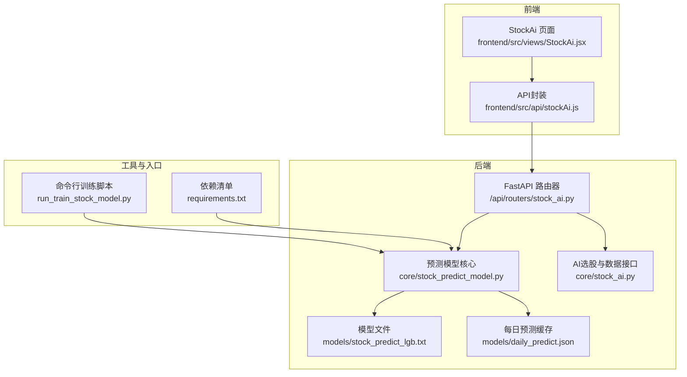
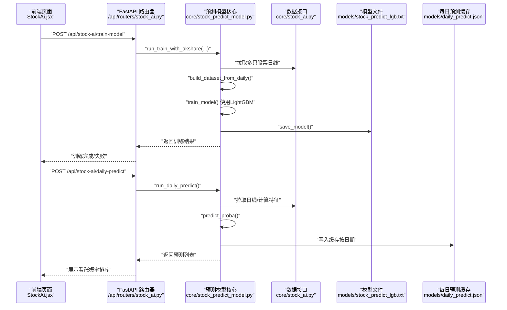
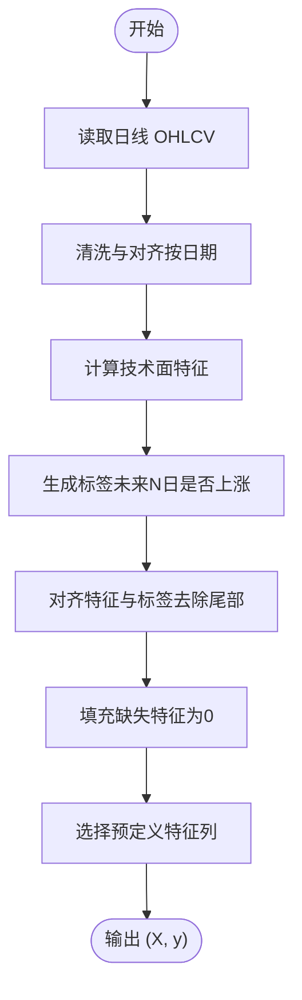
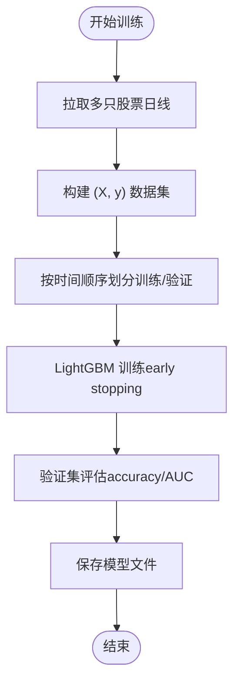
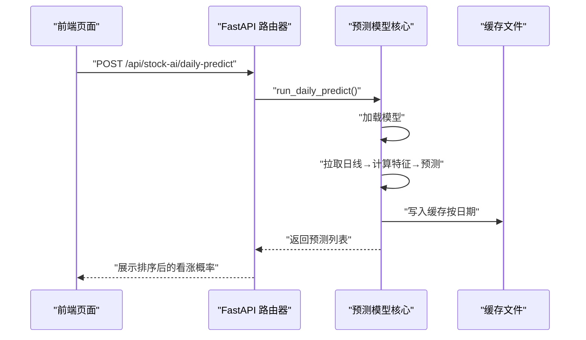
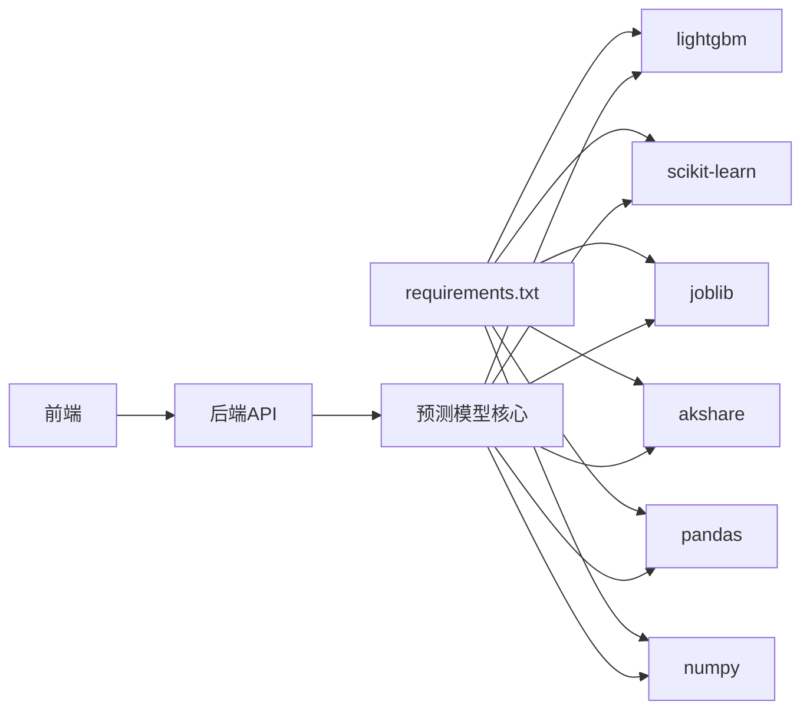

# 股票预测模型

<cite>
**本文引用的文件**
- [stock_predict_model.py](file://backpack_quant_trading/core/stock_predict_model.py)
- [run_train_stock_model.py](file://backpack_quant_trading/run_train_stock_model.py)
- [stock_ai.py](file://backpack_quant_trading/core/stock_ai.py)
- [stock_ai.py（API路由器）](file://backpack_quant_trading/api/routers/stock_ai.py)
- [stock_predict_lgb.txt](file://backpack_quant_trading/models/stock_predict_lgb.txt)
- [daily_predict.json](file://backpack_quant_trading/models/daily_predict.json)
- [requirements.txt](file://backpack_quant_trading/requirements.txt)
- [StockAi.jsx](file://backpack_quant_trading/frontend/src/views/StockAi.jsx)
- [stockAi.js](file://backpack_quant_trading/frontend/src/api/stockAi.js)
</cite>

## 目录
1. [简介](#简介)
2. [项目结构](#项目结构)
3. [核心组件](#核心组件)
4. [架构总览](#架构总览)
5. [详细组件分析](#详细组件分析)
6. [依赖分析](#依赖分析)
7. [性能考量](#性能考量)
8. [故障排查指南](#故障排查指南)
9. [结论](#结论)
10. [附录](#附录)

## 简介
本文件面向“股票预测模型”的技术文档，聚焦于基于LightGBM的A股3~5日涨跌预测模型，涵盖：
- 训练流程与数据准备
- 特征工程方法与标签生成
- 模型评估指标与验证方法
- 模型配置参数与部署
- 预测调用与结果解读
- 性能优化与过拟合处理策略

该模型通过历史日线数据计算技术面特征，构建二分类任务（未来N日是否上涨），并提供每日预测与缓存机制，支持API与命令行两种训练方式。

## 项目结构
该项目采用前后端分离架构，核心预测逻辑位于后端Python模块，前端React页面负责交互与调用后端API。

图表来源
- [stock_ai.py（API路由器）:1-218](file://backpack_quant_trading/api/routers/stock_ai.py#L1-L218)
- [stock_predict_model.py:1-642](file://backpack_quant_trading/core/stock_predict_model.py#L1-L642)
- [stock_ai.py:1-1135](file://backpack_quant_trading/core/stock_ai.py#L1-L1135)
- [stock_predict_lgb.txt:1-213](file://backpack_quant_trading/models/stock_predict_lgb.txt#L1-L213)
- [daily_predict.json:1-145](file://backpack_quant_trading/models/daily_predict.json#L1-L145)
- [run_train_stock_model.py:1-55](file://backpack_quant_trading/run_train_stock_model.py#L1-L55)
- [requirements.txt:1-61](file://backpack_quant_trading/requirements.txt#L1-L61)

章节来源
- [stock_ai.py（API路由器）:1-218](file://backpack_quant_trading/api/routers/stock_ai.py#L1-L218)
- [stock_predict_model.py:1-642](file://backpack_quant_trading/core/stock_predict_model.py#L1-L642)
- [stock_ai.py:1-1135](file://backpack_quant_trading/core/stock_ai.py#L1-L1135)
- [run_train_stock_model.py:1-55](file://backpack_quant_trading/run_train_stock_model.py#L1-L55)
- [requirements.txt:1-61](file://backpack_quant_trading/requirements.txt#L1-L61)

## 核心组件
- 预测模型核心模块：负责特征工程、标签生成、LightGBM训练、模型保存/加载、预测与每日预测。
- 训练入口：命令行脚本与FastAPI路由，支持参数化训练与批量数据拉取。
- 数据接口：统一日线数据清洗与多数据源拉取，保障特征计算稳定性。
- 前端页面：提供训练、预测、缓存刷新等交互入口，调用后端API。

章节来源
- [stock_predict_model.py:1-642](file://backpack_quant_trading/core/stock_predict_model.py#L1-L642)
- [run_train_stock_model.py:1-55](file://backpack_quant_trading/run_train_stock_model.py#L1-L55)
- [stock_ai.py:1-1135](file://backpack_quant_trading/core/stock_ai.py#L1-L1135)
- [StockAi.jsx:1-585](file://backpack_quant_trading/frontend/src/views/StockAi.jsx#L1-L585)
- [stockAi.js:1-16](file://backpack_quant_trading/frontend/src/api/stockAi.js#L1-L16)

## 架构总览
以下序列图展示了从前端到后端的训练与预测调用链路，以及模型文件与缓存的作用。

图表来源
- [stock_ai.py（API路由器）:173-217](file://backpack_quant_trading/api/routers/stock_ai.py#L173-L217)
- [stock_predict_model.py:521-641](file://backpack_quant_trading/core/stock_predict_model.py#L521-L641)
- [stock_ai.py:131-331](file://backpack_quant_trading/core/stock_ai.py#L131-L331)
- [stock_predict_lgb.txt:1-213](file://backpack_quant_trading/models/stock_predict_lgb.txt#L1-L213)
- [daily_predict.json:1-145](file://backpack_quant_trading/models/daily_predict.json#L1-L145)

## 详细组件分析

### 特征工程与标签生成
- 特征来源：日线OHLCV序列，要求按日期排序且无缺失。
- 特征计算：
  - 收益率与波动率：ret_1d/ret_5d/ret_20d、volatility_5d/volatility_20d
  - 技术指标：RSI、MACD（hist/dif/dea）、KDJ（K/D/J）、量比（volume_ratio_5）、均线交叉与比率（ma5_ma20_cross、close_ma5_ratio、close_ma20_ratio）
- 标签生成：未来forward_days日累计收益率超过阈值（默认2%）标记为上涨（1），否则为下跌/平（0）。
- 数据对齐：去除未来收益不可知的尾部，填充缺失特征，仅保留预定义特征列。

图表来源
- [stock_predict_model.py:71-198](file://backpack_quant_trading/core/stock_predict_model.py#L71-L198)

章节来源
- [stock_predict_model.py:71-198](file://backpack_quant_trading/core/stock_predict_model.py#L71-L198)

### 训练流程与模型配置
- 训练方式：
  - 命令行：运行脚本，传入股票池、预测周期、回溯天数、阈值与保存路径。
  - API：POST /api/stock-ai/train-model，支持参数化训练。
- 数据准备：优先使用AI选股同源日线接口，若失败则回退至akshare多数据源拉取。
- 训练策略：
  - 时间顺序划分训练/验证集（按比例切分）
  - LightGBM二分类：objective=“binary”，metric=“auc”，early stopping防止过拟合
  - 参数要点：num_leaves、learning_rate、feature_fraction、bagging_fraction、bagging_freq、n_estimators、early_stopping_rounds
- 评估指标：验证集accuracy与AUC，打印分类报告（支持阈值0.5）

图表来源
- [run_train_stock_model.py:22-51](file://backpack_quant_trading/run_train_stock_model.py#L22-L51)
- [stock_ai.py（API路由器）:173-192](file://backpack_quant_trading/api/routers/stock_ai.py#L173-L192)
- [stock_predict_model.py:201-255](file://backpack_quant_trading/core/stock_predict_model.py#L201-L255)

章节来源
- [run_train_stock_model.py:1-55](file://backpack_quant_trading/run_train_stock_model.py#L1-L55)
- [stock_ai.py（API路由器）:163-192](file://backpack_quant_trading/api/routers/stock_ai.py#L163-L192)
- [stock_predict_model.py:201-255](file://backpack_quant_trading/core/stock_predict_model.py#L201-L255)

### 模型配置参数与验证方法
- 默认参数（节选）：
  - objective: binary
  - metric: auc
  - boosting_type: gbdt
  - num_leaves: 31
  - learning_rate: 0.05
  - feature_fraction: 0.8
  - bagging_fraction: 0.8
  - bagging_freq: 5
  - n_estimators: 200
  - early_stopping_rounds: 20
  - seed: 42
- 验证方法：
  - 时间序列验证（不打乱）
  - accuracy 与 AUC
  - classification_report 输出各类别统计

章节来源
- [stock_predict_model.py:222-255](file://backpack_quant_trading/core/stock_predict_model.py#L222-L255)
- [stock_predict_lgb.txt:88-120](file://backpack_quant_trading/models/stock_predict_lgb.txt#L88-L120)

### 部署与预测调用
- 模型保存与加载：
  - 保存：save_model(model, path)
  - 加载：load_model(path)，Windows下对含非ASCII路径进行临时文件复制规避问题
- 每日预测：
  - API：POST /api/stock-ai/daily-predict
  - 自动缓存：models/daily_predict.json，按日期存储
  - 并发：多线程拉取日线与预测，设置超时与并发上限
- 前端调用：
  - 前端页面提供“获取今日预测”、“强制刷新”、“对选股结果预测”等按钮
  - 训练完成后自动提示模型保存路径与样本规模

图表来源
- [stock_ai.py（API路由器）:202-217](file://backpack_quant_trading/api/routers/stock_ai.py#L202-L217)
- [stock_predict_model.py:340-464](file://backpack_quant_trading/core/stock_predict_model.py#L340-L464)
- [daily_predict.json:1-145](file://backpack_quant_trading/models/daily_predict.json#L1-L145)

章节来源
- [stock_ai.py（API路由器）:195-217](file://backpack_quant_trading/api/routers/stock_ai.py#L195-L217)
- [stock_predict_model.py:281-307](file://backpack_quant_trading/core/stock_predict_model.py#L281-L307)
- [StockAi.jsx:219-238](file://backpack_quant_trading/frontend/src/views/StockAi.jsx#L219-L238)

### 预测结果解读与置信度评估
- 结果字段：code、name、proba_up（看涨概率）、close（最新价）、date（预测日期）
- 置信度评估：
  - 概率越高表示未来N日上涨可能性越大
  - 建议结合技术面指标（如RSI、MACD、KDJ、量比）与基本面信息综合判断
  - 可通过“对选股结果预测”功能，针对高分股票池进行更精准的排序

章节来源
- [stock_predict_model.py:340-464](file://backpack_quant_trading/core/stock_predict_model.py#L340-L464)
- [daily_predict.json:1-145](file://backpack_quant_trading/models/daily_predict.json#L1-L145)

### 性能优化与过拟合处理策略
- 过拟合控制：
  - early stopping：验证集AUC不再提升时停止训练
  - 验证集划分：严格按时间顺序，避免数据泄漏
  - 正则与采样：feature_fraction、bagging_fraction、bagging_freq
- 训练效率：
  - 多线程并发：预测与训练过程中使用ThreadPoolExecutor
  - 数据源回退：akshare多数据源拉取，提升成功率
- 特征稳定性：
  - 固定特征列集合，缺失值填充为0
  - 仅保留预定义特征列，减少噪声

章节来源
- [stock_predict_model.py:201-255](file://backpack_quant_trading/core/stock_predict_model.py#L201-L255)
- [stock_predict_model.py:340-464](file://backpack_quant_trading/core/stock_predict_model.py#L340-L464)

## 依赖分析
- Python依赖：FastAPI、LightGBM、scikit-learn、joblib、akshare、pandas、numpy等
- 前端依赖：React、UI组件、请求封装

图表来源
- [requirements.txt:1-61](file://backpack_quant_trading/requirements.txt#L1-L61)
- [stock_ai.py（API路由器）:1-218](file://backpack_quant_trading/api/routers/stock_ai.py#L1-L218)
- [stock_predict_model.py:1-642](file://backpack_quant_trading/core/stock_predict_model.py#L1-L642)

章节来源
- [requirements.txt:1-61](file://backpack_quant_trading/requirements.txt#L1-L61)

## 性能考量
- 训练样本规模：至少约100条样本，建议增加股票数与回溯天数
- 并发与超时：预测与训练接口设置合理超时，避免长时间阻塞
- 数据质量：确保OHLCV无缺失，特征列齐全，标签生成正确
- 模型参数：num_leaves、learning_rate、n_estimators等需结合数据规模与类别分布调优

## 故障排查指南
- 依赖缺失：安装LightGBM、scikit-learn、joblib、akshare
- akshare接口失败：切换网络或更换数据源，确认版本兼容
- 模型文件路径问题：Windows下含非ASCII字符路径可能导致读写失败，内部已做临时文件复制处理
- 训练样本不足：增加股票池或延长回溯天数
- 预测超时：调整并发数与超时参数，或缩小股票池

章节来源
- [requirements.txt:50-53](file://backpack_quant_trading/requirements.txt#L50-L53)
- [stock_predict_model.py:281-307](file://backpack_quant_trading/core/stock_predict_model.py#L281-L307)
- [stock_ai.py（API路由器）:173-192](file://backpack_quant_trading/api/routers/stock_ai.py#L173-L192)

## 结论
该股票预测模型以LightGBM为核心，结合A股日线技术面特征，实现了对未来3~5日涨跌的二分类预测。通过严格的特征工程、标签生成与时间序列验证，配合早停与参数调优，有效控制过拟合风险。前端提供便捷的训练与预测入口，模型文件与每日预测缓存确保了部署与使用的稳定性。

## 附录
- 模型文件：models/stock_predict_lgb.txt
- 每日预测缓存：models/daily_predict.json
- 命令行训练入口：run_train_stock_model.py
- FastAPI路由：/api/routers/stock_ai.py
- 前端页面与API封装：frontend/src/views/StockAi.jsx、frontend/src/api/stockAi.js