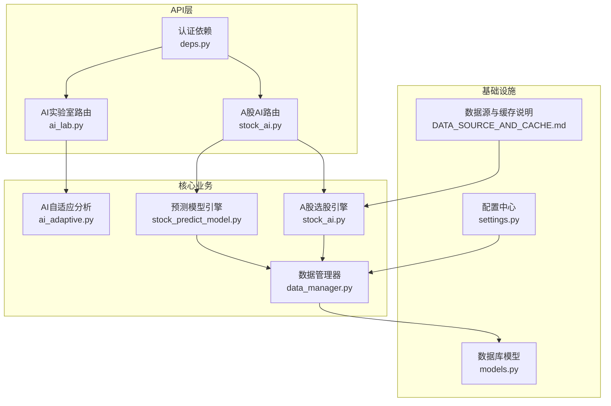
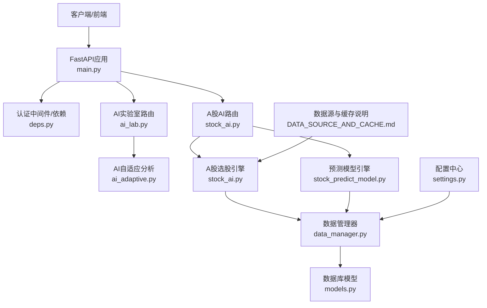
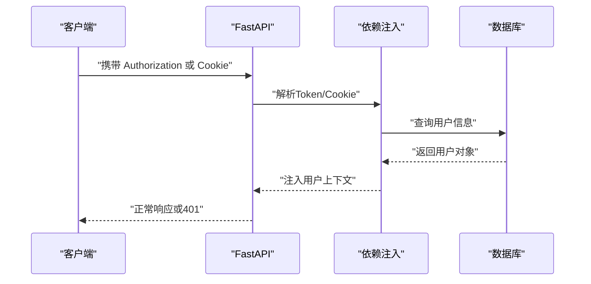
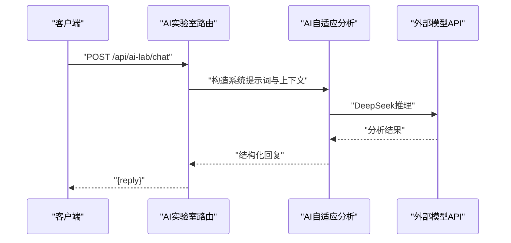
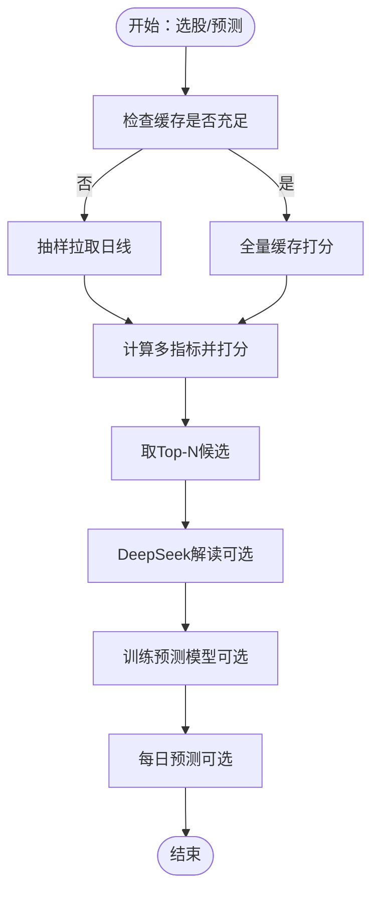
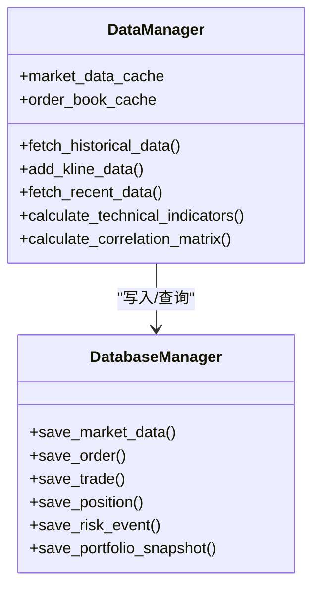
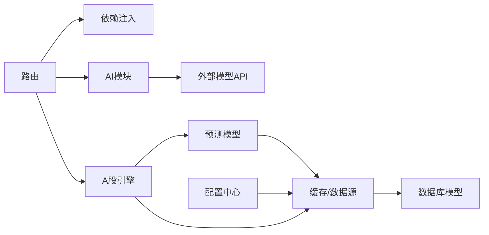

# AI实验室API

<cite>
**本文引用的文件**
- [api/main.py](file://backpack_quant_trading/api/main.py)
- [api/routers/ai_lab.py](file://backpack_quant_trading/api/routers/ai_lab.py)
- [api/routers/stock_ai.py](file://backpack_quant_trading/api/routers/stock_ai.py)
- [api/deps.py](file://backpack_quant_trading/api/deps.py)
- [core/ai_adaptive.py](file://backpack_quant_trading/core/ai_adaptive.py)
- [core/stock_ai.py](file://backpack_quant_trading/core/stock_ai.py)
- [core/stock_predict_model.py](file://backpack_quant_trading/core/stock_predict_model.py)
- [core/data_manager.py](file://backpack_quant_trading/core/data_manager.py)
- [database/models.py](file://backpack_quant_trading/database/models.py)
- [config/settings.py](file://backpack_quant_trading/config/settings.py)
- [docs/DATA_SOURCE_AND_CACHE.md](file://backpack_quant_trading/docs/DATA_SOURCE_AND_CACHE.md)
- [run_train_stock_model.py](file://backpack_quant_trading/run_train_stock_model.py)
</cite>

## 目录
1. [简介](#简介)
2. [项目结构](#项目结构)
3. [核心组件](#核心组件)
4. [架构总览](#架构总览)
5. [详细组件分析](#详细组件分析)
6. [依赖关系分析](#依赖关系分析)
7. [性能考量](#性能考量)
8. [故障排查指南](#故障排查指南)
9. [结论](#结论)
10. [附录](#附录)

## 简介
本文件为“AI实验室API”的完整技术文档，聚焦于A股AI选股、特征工程、模型训练与预测、模型生命周期管理、实验数据与缓存机制、可视化与性能监控等能力。文档面向开发者与数据工程师，提供HTTP接口规范、请求/响应模式、数据格式、参数配置与最佳实践。

## 项目结构
后端采用FastAPI框架，路由按功能模块拆分，核心模块包括：
- 认证与依赖注入：用户鉴权、Token解析、Cookie校验
- AI实验室：K线分析、图像识别、多周期分析
- A股AI选股：板块/行业筛选、多指标打分、DeepSeek解读
- 模型训练与预测：LightGBM特征工程、训练、推理、缓存
- 数据管理：K线缓存、增量更新、技术指标计算
- 数据库：用户、订单、仓位、交易、风控事件、策略性能等

图表来源
- [api/routers/ai_lab.py](file://backpack_quant_trading/api/routers/ai_lab.py)
- [api/routers/stock_ai.py](file://backpack_quant_trading/api/routers/stock_ai.py)
- [api/deps.py](file://backpack_quant_trading/api/deps.py)
- [core/ai_adaptive.py](file://backpack_quant_trading/core/ai_adaptive.py)
- [core/stock_ai.py](file://backpack_quant_trading/core/stock_ai.py)
- [core/stock_predict_model.py](file://backpack_quant_trading/core/stock_predict_model.py)
- [core/data_manager.py](file://backpack_quant_trading/core/data_manager.py)
- [database/models.py](file://backpack_quant_trading/database/models.py)
- [config/settings.py](file://backpack_quant_trading/config/settings.py)
- [docs/DATA_SOURCE_AND_CACHE.md](file://backpack_quant_trading/docs/DATA_SOURCE_AND_CACHE.md)

章节来源
- [api/main.py](file://backpack_quant_trading/api/main.py)
- [api/routers/ai_lab.py](file://backpack_quant_trading/api/routers/ai_lab.py)
- [api/routers/stock_ai.py](file://backpack_quant_trading/api/routers/stock_ai.py)
- [api/deps.py](file://backpack_quant_trading/api/deps.py)
- [core/ai_adaptive.py](file://backpack_quant_trading/core/ai_adaptive.py)
- [core/stock_ai.py](file://backpack_quant_trading/core/stock_ai.py)
- [core/stock_predict_model.py](file://backpack_quant_trading/core/stock_predict_model.py)
- [core/data_manager.py](file://backpack_quant_trading/core/data_manager.py)
- [database/models.py](file://backpack_quant_trading/database/models.py)
- [config/settings.py](file://backpack_quant_trading/config/settings.py)
- [docs/DATA_SOURCE_AND_CACHE.md](file://backpack_quant_trading/docs/DATA_SOURCE_AND_CACHE.md)

## 核心组件
- 认证与依赖注入：提供JWT解码、Cookie校验、用户获取与登录拦截
- AI实验室：K线分析、图像识别、多周期分析、系统提示词与知识库
- A股AI：板块/行业筛选、多指标打分、DeepSeek解读、K线缓存与增量更新
- 预测模型：LightGBM特征工程、训练、推理、模型持久化与缓存
- 数据管理：K线缓存、技术指标计算、多资产相关性、实时数据接入
- 数据库：用户、订单、仓位、交易、风控事件、策略性能等

章节来源
- [api/deps.py](file://backpack_quant_trading/api/deps.py)
- [core/ai_adaptive.py](file://backpack_quant_trading/core/ai_adaptive.py)
- [core/stock_ai.py](file://backpack_quant_trading/core/stock_ai.py)
- [core/stock_predict_model.py](file://backpack_quant_trading/core/stock_predict_model.py)
- [core/data_manager.py](file://backpack_quant_trading/core/data_manager.py)
- [database/models.py](file://backpack_quant_trading/database/models.py)

## 架构总览
后端通过FastAPI注册路由，统一CORS跨域，静态资源挂载前端产物。AI实验室与A股AI模块分别提供K线分析、图像识别、选股、预测等能力；数据管理器负责缓存与增量更新；模型训练与推理通过LightGBM实现；数据库模型承载交易与风控数据。

图表来源
- [api/main.py](file://backpack_quant_trading/api/main.py)
- [api/routers/ai_lab.py](file://backpack_quant_trading/api/routers/ai_lab.py)
- [api/routers/stock_ai.py](file://backpack_quant_trading/api/routers/stock_ai.py)
- [api/deps.py](file://backpack_quant_trading/api/deps.py)
- [core/ai_adaptive.py](file://backpack_quant_trading/core/ai_adaptive.py)
- [core/stock_ai.py](file://backpack_quant_trading/core/stock_ai.py)
- [core/stock_predict_model.py](file://backpack_quant_trading/core/stock_predict_model.py)
- [core/data_manager.py](file://backpack_quant_trading/core/data_manager.py)
- [database/models.py](file://backpack_quant_trading/database/models.py)
- [config/settings.py](file://backpack_quant_trading/config/settings.py)
- [docs/DATA_SOURCE_AND_CACHE.md](file://backpack_quant_trading/docs/DATA_SOURCE_AND_CACHE.md)

## 详细组件分析

### 认证与依赖注入
- 支持Bearer Token与Cookie两种方式获取用户信息
- 登录拦截：未登录访问需登录的接口将返回401
- 用户信息包含id、username、role，用于权限控制

图表来源
- [api/deps.py](file://backpack_quant_trading/api/deps.py)
- [database/models.py](file://backpack_quant_trading/database/models.py)

章节来源
- [api/deps.py](file://backpack_quant_trading/api/deps.py)
- [database/models.py](file://backpack_quant_trading/database/models.py)

### AI实验室API
- K线分析：支持多周期（1m/5m/15m/30m/1h/2h/4h/6h/12h/1d/1w）与币安K线数据抓取
- 图像识别：Gemini视觉模型提取K线形态、指标位置、支撑压力位
- DeepSeek逻辑分析：基于系统提示词与知识库，输出趋势判断、策略建议、交易参数
- 对话分析：自动解析用户意图（如“分析ETH 15m K线趋势”），动态抓取K线并格式化

图表来源
- [api/routers/ai_lab.py](file://backpack_quant_trading/api/routers/ai_lab.py)
- [core/ai_adaptive.py](file://backpack_quant_trading/core/ai_adaptive.py)

章节来源
- [api/routers/ai_lab.py](file://backpack_quant_trading/api/routers/ai_lab.py)
- [core/ai_adaptive.py](file://backpack_quant_trading/core/ai_adaptive.py)

### A股AI选股与预测API
- 板块/行业筛选：支持主板、创业板、科创板、北交所；行业选项动态获取
- 多指标打分：MACD、RSI、KDJ、量比、OBV、均线、主力净流入等
- DeepSeek解读：对选股结果进行简要解读与操作建议
- K线缓存与增量更新：支持pytdx/Tushare/AKShare多数据源，本地SQLite缓存
- 模型训练：LightGBM二分类（N日后是否上涨），支持命令行与API两种入口
- 每日预测：基于训练模型对股票池打分，返回“未来3~5日看涨”概率排序

图表来源
- [core/stock_ai.py](file://backpack_quant_trading/core/stock_ai.py)
- [core/stock_predict_model.py](file://backpack_quant_trading/core/stock_predict_model.py)
- [docs/DATA_SOURCE_AND_CACHE.md](file://backpack_quant_trading/docs/DATA_SOURCE_AND_CACHE.md)

章节来源
- [api/routers/stock_ai.py](file://backpack_quant_trading/api/routers/stock_ai.py)
- [core/stock_ai.py](file://backpack_quant_trading/core/stock_ai.py)
- [core/stock_predict_model.py](file://backpack_quant_trading/core/stock_predict_model.py)
- [docs/DATA_SOURCE_AND_CACHE.md](file://backpack_quant_trading/docs/DATA_SOURCE_AND_CACHE.md)

### 数据管理与缓存
- K线缓存：内存缓存+文件持久化，支持Live数据追加与时间窗口控制
- 技术指标：MA、布林带、RSI、MACD、ATR、波动率等
- 多资产相关性：基于日线收益计算相关矩阵
- 实时数据：支持Backpack格式的实时K线接入与时间戳转换

图表来源
- [core/data_manager.py](file://backpack_quant_trading/core/data_manager.py)
- [database/models.py](file://backpack_quant_trading/database/models.py)

章节来源
- [core/data_manager.py](file://backpack_quant_trading/core/data_manager.py)
- [database/models.py](file://backpack_quant_trading/database/models.py)

## 依赖关系分析
- 路由依赖认证：所有需登录的接口依赖require_user
- AI模块依赖外部模型API（DeepSeek/Gemini），需配置相应API Key
- A股引擎依赖数据源（AKShare/pytdx/Tushare），优先使用本地缓存
- 预测模型依赖LightGBM与joblib，模型文件保存在项目models目录
- 数据管理器依赖配置中心与数据库模型

图表来源
- [api/routers/ai_lab.py](file://backpack_quant_trading/api/routers/ai_lab.py)
- [api/routers/stock_ai.py](file://backpack_quant_trading/api/routers/stock_ai.py)
- [api/deps.py](file://backpack_quant_trading/api/deps.py)
- [core/ai_adaptive.py](file://backpack_quant_trading/core/ai_adaptive.py)
- [core/stock_ai.py](file://backpack_quant_trading/core/stock_ai.py)
- [core/stock_predict_model.py](file://backpack_quant_trading/core/stock_predict_model.py)
- [database/models.py](file://backpack_quant_trading/database/models.py)
- [config/settings.py](file://backpack_quant_trading/config/settings.py)

章节来源
- [api/routers/ai_lab.py](file://backpack_quant_trading/api/routers/ai_lab.py)
- [api/routers/stock_ai.py](file://backpack_quant_trading/api/routers/stock_ai.py)
- [api/deps.py](file://backpack_quant_trading/api/deps.py)
- [core/ai_adaptive.py](file://backpack_quant_trading/core/ai_adaptive.py)
- [core/stock_ai.py](file://backpack_quant_trading/core/stock_ai.py)
- [core/stock_predict_model.py](file://backpack_quant_trading/core/stock_predict_model.py)
- [database/models.py](file://backpack_quant_trading/database/models.py)
- [config/settings.py](file://backpack_quant_trading/config/settings.py)

## 性能考量
- 缓存策略：K线缓存按symbol_interval_live维护，支持最大缓存条数与TTL控制
- 并发与超时：A股引擎与预测接口使用线程池并发，设置单请求与总超时
- 数据源优先级：默认优先pytdx，失败或未安装时回退Tushare/AKShare
- 模型训练：LightGBM参数可调，建议在训练前准备充足的样本与特征

## 故障排查指南
- 认证失败：确认Token/Cookie有效，检查JWT密钥与过期时间
- 外部模型API异常：检查DEEPSEEK_API_KEY/GEMINI_API_KEY配置
- 数据源拉取失败：检查AKShare/pytdx/Tushare配置与网络连通性
- 模型训练失败：确认lightgbm与joblib安装，检查样本数量与标签阈值
- 缓存异常：检查缓存目录权限与磁盘空间

章节来源
- [api/deps.py](file://backpack_quant_trading/api/deps.py)
- [core/ai_adaptive.py](file://backpack_quant_trading/core/ai_adaptive.py)
- [core/stock_ai.py](file://backpack_quant_trading/core/stock_ai.py)
- [core/stock_predict_model.py](file://backpack_quant_trading/core/stock_predict_model.py)
- [core/data_manager.py](file://backpack_quant_trading/core/data_manager.py)

## 结论
AI实验室API提供了从K线分析、图像识别到A股选股与预测的完整能力闭环，结合本地缓存与多数据源策略，具备良好的扩展性与稳定性。建议在生产环境中完善外部模型API密钥管理、缓存监控与模型版本治理。

## 附录

### 接口清单与规范

- 认证与健康检查
  - GET /api/health
    - 响应：{"status":"ok","service":"backpack-quant-api"}

- AI实验室
  - POST /api/ai-lab/chat
    - 请求体：ChatRequest
      - message: string
      - history: List[dict]（可选）
    - 响应：{"reply": string}
  - POST /api/ai-lab/fetch-kline
    - 查询参数：
      - symbol: string（默认ETHUSDT）
      - interval: string（默认15m）
      - limit: int（500~2000，默认1500）
    - 响应：{"data": list|null,"error": string|null}
  - POST /api/ai-lab/analyze
    - 请求体：AnalyzeRequest
      - image_base64: string（可选，png）
      - kline_json: any（可选，OHLC序列）
      - user_query: string（默认分析K线趋势）
      - symbol: string（默认ETHUSDT）
      - interval: string（默认15m）
    - 响应：{"analysis": string,"buy": [float],"sell": [float]}

- A股AI
  - GET /api/stock-ai/boards
    - 响应：{"options": [{"value": string,"label": string}]}
  - GET /api/stock-ai/industries
    - 响应：{"options": [{"value": string,"label": string}]}
  - POST /api/stock-ai/refresh-cache
    - 请求：需登录
    - 响应：{"ok": bool,"message": string,"rows_added": int,"max_date": string|null,"source": string|null}
  - POST /api/stock-ai/screen
    - 请求体：StockAiScreenRequest
      - boards: List[string]
      - industries: List[string]
      - top_n: int（1~100，默认30）
      - min_score: float（≥0，默认0）
      - lookback_days: int（30~250，默认120）
    - 响应：{"list": list,"total": int,"boards": list,"industries": list,"candidates_count": int,"from_full_market": bool,"error": string|null}
  - POST /api/stock-ai/analyze
    - 请求体：StockAiAnalyzeRequest
      - items: List[dict]（选股结果列表）
    - 响应：{"analysis": string}
  - POST /api/stock-ai/analyze-with-daily
    - 请求体：StockAiAnalyzeRequest
      - items: List[dict]
    - 响应：{"analysis": string}
  - POST /api/stock-ai/analyze-single
    - 请求体：StockSingleAnalyzeRequest
      - stock_code: string（6位A股代码）
    - 响应：{"analysis": string}
  - POST /api/stock-ai/train-model
    - 请求体：StockPredictTrainRequest
      - stock_codes: List[string]（可选）
      - end_date: string（YYYY-MM-DD，可选）
      - lookback_days: int（120~1000，默认500）
      - forward_days: int（1~10，默认5）
      - label_threshold: float（≥0，默认0.02）
      - val_ratio: float（0~1，默认0.2）
    - 响应：{"ok": bool,"model_path": string|null,"n_samples": int,"n_stocks": int,"forward_days": int,"label_threshold": float,"error": string|null}
  - POST /api/stock-ai/daily-predict
    - 请求体：DailyPredictRequest
      - top_n: int（5~50，默认20）
      - use_cache: bool（默认true）
      - force_refresh: bool（默认false）
      - stock_codes: List[string]（可选）
    - 响应：{"ok": bool,"list": list,"date": string,"from_cache": bool,"error": string|null}

章节来源
- [api/routers/ai_lab.py](file://backpack_quant_trading/api/routers/ai_lab.py)
- [api/routers/stock_ai.py](file://backpack_quant_trading/api/routers/stock_ai.py)

### 数据格式与参数说明

- 认证
  - Authorization: Bearer <token>
  - Cookie: access_token=<token>

- K线数据（OHLC）
  - 字段：time, open, high, low, close, volume
  - 时间戳：秒或毫秒均可，内部转换为北京时间

- 选股请求参数
  - boards/industries：筛选条件
  - top_n/min_score/lookback_days：打分与排序参数

- 预测训练请求参数
  - stock_codes/end_date/lookback_days/forward_days/label_threshold/val_ratio

- 每日预测请求参数
  - top_n/use_cache/force_refresh/stock_codes

章节来源
- [api/routers/ai_lab.py](file://backpack_quant_trading/api/routers/ai_lab.py)
- [api/routers/stock_ai.py](file://backpack_quant_trading/api/routers/stock_ai.py)
- [core/stock_predict_model.py](file://backpack_quant_trading/core/stock_predict_model.py)

### 模型生命周期管理
- 训练入口
  - 命令行：python run_train_stock_model.py [--codes ...] [--days N] [--lookback D] [--threshold T] [--out PATH]
  - API：POST /api/stock-ai/train-model
- 模型保存路径：项目根目录下的models/stock_predict_lgb.txt
- 推理与缓存
  - run_daily_predict()：按日缓存预测结果至models/daily_predict.json
  - 支持自定义模型路径与股票池

章节来源
- [run_train_stock_model.py](file://backpack_quant_trading/run_train_stock_model.py)
- [core/stock_predict_model.py](file://backpack_quant_trading/core/stock_predict_model.py)

### 特征工程与模型参数
- 特征列（FEATURE_COLS）
  - ret_1d/ret_5d/ret_20d、volatility_5d/20d、RSI、MACD_hist/dif/dea、KDJ_k/d/j、量比、均线交叉、价格与均线比率
- 标签构建
  - forward_days日收益率 > label_threshold 则为1，否则为0
- LightGBM默认参数
  - objective=binary、metric=AUC、boosting_type=gbdt、num_leaves=31、learning_rate=0.05、n_estimators=200、early_stopping_rounds=20
- 训练与验证
  - 按时间顺序划分训练/验证集（val_ratio）

章节来源
- [core/stock_predict_model.py](file://backpack_quant_trading/core/stock_predict_model.py)

### 实验数据管理与可视化
- 数据源与缓存
  - pytdx优先，Tushare可选，AKShare兜底
  - 增量更新：仅写入比缓存新的交易日
- 可视化与监控
  - 每日预测结果缓存，前端“获取今日预测”展示
  - 数据管理器提供技术指标与相关性矩阵计算

章节来源
- [docs/DATA_SOURCE_AND_CACHE.md](file://backpack_quant_trading/docs/DATA_SOURCE_AND_CACHE.md)
- [core/data_manager.py](file://backpack_quant_trading/core/data_manager.py)