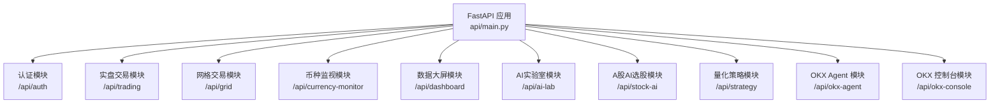
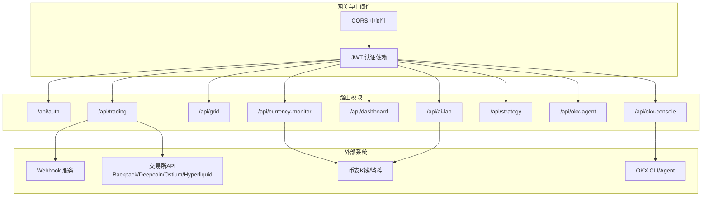
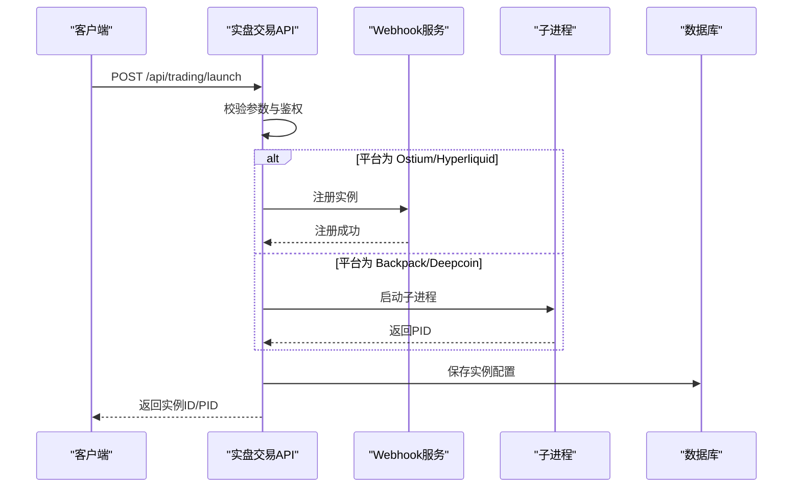
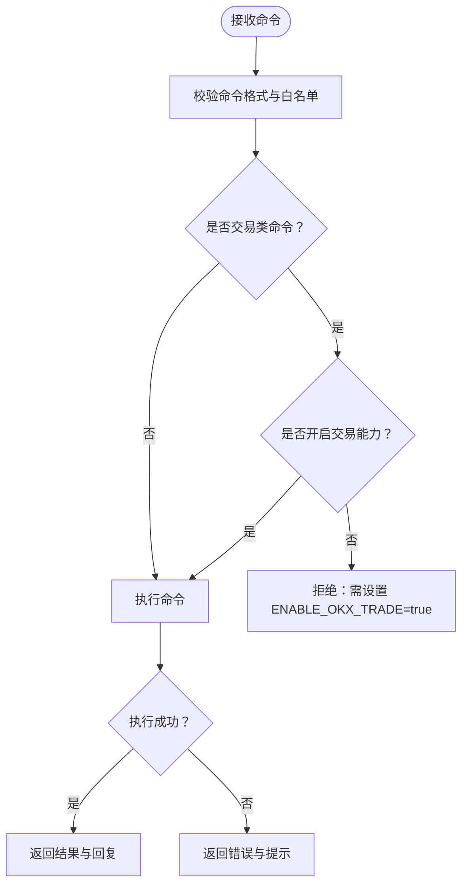
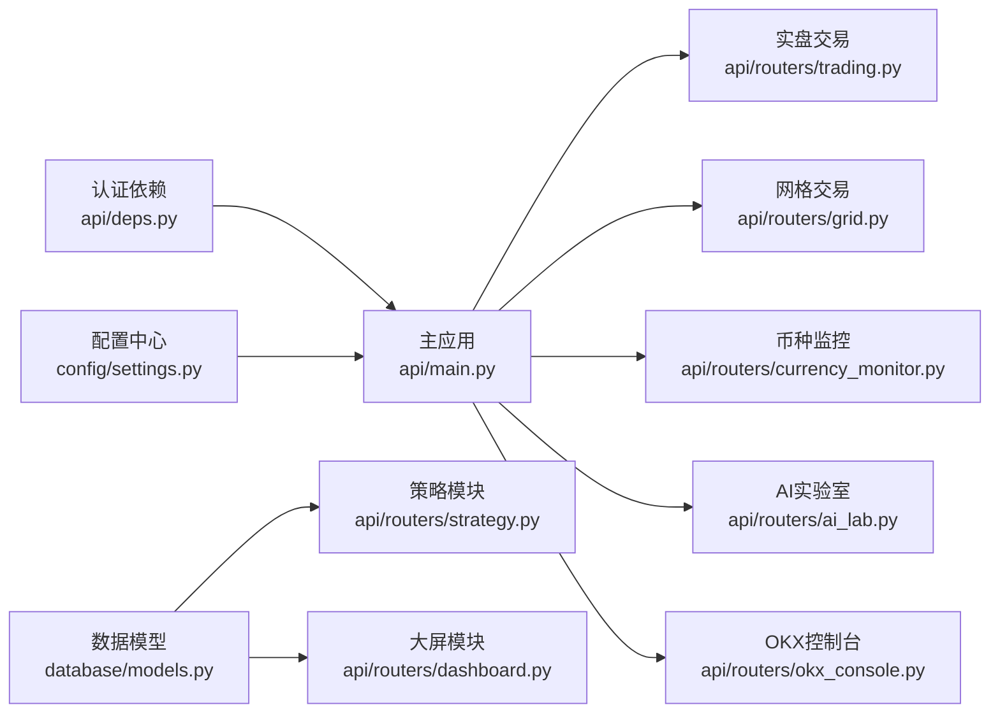

# API接口文档

<cite>
**本文引用的文件**
- [api/main.py](file://backpack_quant_trading/api/main.py)
- [api/deps.py](file://backpack_quant_trading/api/deps.py)
- [config/settings.py](file://backpack_quant_trading/config/settings.py)
- [api/routers/auth.py](file://backpack_quant_trading/api/routers/auth.py)
- [api/routers/trading.py](file://backpack_quant_trading/api/routers/trading.py)
- [api/routers/grid.py](file://backpack_quant_trading/api/routers/grid.py)
- [api/routers/strategy.py](file://backpack_quant_trading/api/routers/strategy.py)
- [api/routers/ai_lab.py](file://backpack_quant_trading/api/routers/ai_lab.py)
- [api/routers/currency_monitor.py](file://backpack_quant_trading/api/routers/currency_monitor.py)
- [api/routers/dashboard.py](file://backpack_quant_trading/api/routers/dashboard.py)
- [api/routers/okx_agent.py](file://backpack_quant_trading/api/routers/okx_agent.py)
- [api/routers/okx_console.py](file://backpack_quant_trading/api/routers/okx_console.py)
- [database/models.py](file://backpack_quant_trading/database/models.py)
</cite>

## 目录
1. [简介](#简介)
2. [项目结构](#项目结构)
3. [核心组件](#核心组件)
4. [架构总览](#架构总览)
5. [详细组件分析](#详细组件分析)
6. [依赖分析](#依赖分析)
7. [性能考虑](#性能考虑)
8. [故障排查指南](#故障排查指南)
9. [结论](#结论)
10. [附录](#附录)

## 简介
本项目为量化交易后端，提供认证、实盘交易、网格交易、策略回测与分析、币种监控、数据大屏、OKX Agent集成与控制台等RESTful API。后端采用FastAPI，内置JWT认证与数据库访问层，支持多交易所（Backpack、Deepcoin、Ostium、Hyperliquid）与多策略引擎。

- 版本：1.0.0
- 健康检查：GET /api/health
- 前端静态资源挂载：/assets 与SPA路由（/、/login、/trading、/dashboard、/ai-lab、/grid-trading、/currency-monitor、/stock-ai、/okx-agent、/okx-console）

## 项目结构
后端通过主应用注册多个路由模块，按功能分组：

图表来源
- [api/main.py:36-48](file://backpack_quant_trading/api/main.py#L36-L48)

章节来源
- [api/main.py:14-53](file://backpack_quant_trading/api/main.py#L14-L53)

## 核心组件
- 认证与鉴权
  - JWT密钥、算法、过期时间配置
  - Bearer Token与Cookie双通道获取用户
  - require_user依赖强制登录
- 配置中心
  - 多交易所API地址、私钥、代理、请求窗口等
  - 数据库连接URL、池大小、溢出
  - 交易风控参数（最大仓位、最大日损、最大回撤、止损止盈、无风险利率、杠杆）
- 数据模型
  - 订单、仓位、成交、账户余额、市场数据、策略性能、风险事件等ORM映射

章节来源
- [api/deps.py:11-73](file://backpack_quant_trading/api/deps.py#L11-L73)
- [config/settings.py:104-137](file://backpack_quant_trading/config/settings.py#L104-L137)
- [database/models.py:14-200](file://backpack_quant_trading/database/models.py#L14-L200)

## 架构总览
后端采用模块化路由组织，统一前缀命名，按功能域划分。认证中间件与CORS允许前端跨域访问。部分模块通过子进程或Webhook服务与外部系统交互。

图表来源
- [api/main.py:20-48](file://backpack_quant_trading/api/main.py#L20-L48)
- [api/routers/trading.py:323-431](file://backpack_quant_trading/api/routers/trading.py#L323-L431)
- [api/routers/currency_monitor.py:8-21](file://backpack_quant_trading/api/routers/currency_monitor.py#L8-L21)
- [api/routers/ai_lab.py:166-181](file://backpack_quant_trading/api/routers/ai_lab.py#L166-L181)
- [api/routers/okx_console.py:63-796](file://backpack_quant_trading/api/routers/okx_console.py#L63-L796)

## 详细组件分析

### 认证API（/api/auth）
- 登录
  - 方法：POST
  - 路径：/api/auth/login
  - 请求体：用户名、密码
  - 响应：access_token、token_type、用户信息
  - 错误：401 用户名或密码错误
- 注册
  - 方法：POST
  - 路径：/api/auth/register
  - 请求体：用户名、密码
  - 响应：access_token、token_type、用户信息
  - 错误：400 用户名已存在或参数非法
- 获取当前用户
  - 方法：GET
  - 路径：/api/auth/me
  - 鉴权：require_user
  - 响应：用户信息
- 登出
  - 方法：POST
  - 路径：/api/auth/logout
  - 响应：{"message": "ok"}

章节来源
- [api/routers/auth.py:33-79](file://backpack_quant_trading/api/routers/auth.py#L33-L79)
- [api/deps.py:69-73](file://backpack_quant_trading/api/deps.py#L69-L73)

### 实盘交易API（/api/trading）
- 策略与交易所清单
  - 方法：GET
  - 路径：/api/trading/strategies
  - 响应：策略列表、交易所列表、HYPE策略
- 实盘实例列表
  - 方法：GET
  - 路径：/api/trading/instances
  - 鉴权：require_user
  - 响应：实例列表（含Webhook运行态、余额、状态）
  - 错误：无实例时返回空列表
- 启动实盘策略
  - 方法：POST
  - 路径：/api/trading/launch
  - 请求体：平台、策略、交易对、仓位、杠杆、止盈、止损、API密钥族、禁止时段
  - 响应：实例ID、PID或消息
  - 说明：Ostium/Hyperliquid通过Webhook服务注册；Backpack/Deepcoin以子进程启动
- 停止实盘实例
  - 方法：DELETE
  - 路径：/api/trading/instances/{instance_id}
  - 鉴权：require_user
  - 响应：{"message": "ok"}
- HYPE自适应做空
  - 启动：POST /api/trading/hype/start
  - 停止：POST /api/trading/hype/stop
  - 状态：GET /api/trading/hype/status
  - 切换：POST /api/trading/hype/toggle
- 日志
  - 方法：GET
  - 路径：/api/trading/logs
  - 响应：最近日志（最多150行）

图表来源
- [api/routers/trading.py:310-431](file://backpack_quant_trading/api/routers/trading.py#L310-L431)

章节来源
- [api/routers/trading.py:89-529](file://backpack_quant_trading/api/routers/trading.py#L89-L529)

### 网格交易API（/api/grid）
- 交易对列表
  - 方法：GET
  - 路径：/api/grid/symbols
  - 响应：["ETH_USDC_PERP","BTC_USDC_PERP",...]
- 网格状态
  - 方法：GET
  - 路径：/api/grid/status
  - 鉴权：require_user
  - 响应：当前用户运行中的网格实例
- 启动网格
  - 方法：POST
  - 路径：/api/grid/start
  - 请求体：交易所、交易对、上下限、网格数、每格投资、杠杆、模式、密钥族
  - 响应：{"ok":true,"instance_id":"..."}
- 停止单个网格
  - 方法：POST
  - 路径：/api/grid/stop/{grid_id}
  - 鉴权：require_user
  - 响应：{"message":"ok"}
- 停止全部网格
  - 方法：POST
  - 路径：/api/grid/stop-all
  - 鉴权：require_user
  - 响应：{"message":"ok"}

章节来源
- [api/routers/grid.py:85-162](file://backpack_quant_trading/api/routers/grid.py#L85-L162)

### 数据监控API（/api/currency-monitor）
- 币安交易对
  - 方法：GET
  - 路径：/api/currency-monitor/symbols
  - 响应：["BTC-USDT","ETH-USDT",...]
- 监视器状态
  - 方法：GET
  - 路径：/api/currency-monitor/status
  - 鉴权：get_current_user
  - 响应：运行状态、监视对、告警对
- 启动监视
  - 方法：POST
  - 路径：/api/currency-monitor/start
  - 请求体：symbols、timeframes、钉钉回调
  - 响应：{"message":"已启动","running":true}
- 停止监视
  - 方法：POST
  - 路径：/api/currency-monitor/stop
  - 鉴权：require_user
  - 响应：{"message":"ok","running":false}
- 移除监视对
  - 方法：POST
  - 路径：/api/currency-monitor/remove-pair
  - 请求体：symbol、timeframe
  - 响应：{"message":"ok"}
- 1分钟预警
  - 状态：GET /api/currency-monitor/minute-alert/status
  - 启动：POST /api/currency-monitor/minute-alert/start
  - 停止：POST /api/currency-monitor/minute-alert/stop

章节来源
- [api/routers/currency_monitor.py:24-243](file://backpack_quant_trading/api/routers/currency_monitor.py#L24-L243)

### 数据大屏API（/api/dashboard）
- 概览
  - 方法：GET
  - 路径：/api/dashboard/summary
  - 查询参数：exchange（默认backpack）
  - 鉴权：require_user
  - 响应：净值、现金、日收益、日回报、净值曲线、持仓、订单、成交、风险事件

章节来源
- [api/routers/dashboard.py:26-131](file://backpack_quant_trading/api/routers/dashboard.py#L26-L131)

### AI实验室API（/api/ai-lab）
- 智能对话
  - 方法：POST
  - 路径：/api/ai-lab/chat
  - 请求体：message、history
  - 响应：reply（来自DeepSeek）
  - 说明：当检测到K线分析意图时，自动抓取币安K线并格式化
- 抓取K线
  - 方法：POST
  - 路径：/api/ai-lab/fetch-kline
  - 查询参数：symbol、interval、limit
  - 响应：data或error
- 综合分析
  - 方法：POST
  - 路径：/api/ai-lab/analyze
  - 请求体：image_base64、kline_json、user_query、symbol、interval
  - 响应：analysis、buy点位数组、sell点位数组

章节来源
- [api/routers/ai_lab.py:183-365](file://backpack_quant_trading/api/routers/ai_lab.py#L183-L365)

### 量化策略API（/api/strategy）
- ETH 2H回测
  - 导入CSV：POST /api/strategy/eth-2h/import-csv
  - 同步K线：POST /api/strategy/eth-2h/sync-klines
  - 获取K线：GET /api/strategy/eth-2h/klines
  - 获取交易明细：GET /api/strategy/eth-2h/trades
  - 总览：GET /api/strategy/eth-2h/overview
- ETH 独立策略（eth-only-2h）
  - 导入CSV：POST /api/strategy/eth-only-2h/import-csv
  - 同步K线：POST /api/strategy/eth-only-2h/sync-klines
  - 获取K线：GET /api/strategy/eth-only-2h/klines
  - 获取交易明细：GET /api/strategy/eth-only-2h/trades
  - 总览：GET /api/strategy/eth-only-2h/overview
- 大宗（黄金）策略 PAXG_2H
  - 导入K线：POST /api/strategy/paxg-2h/import-klines
  - 导入交易：POST /api/strategy/paxg-2h/import-trades

章节来源
- [api/routers/strategy.py:180-800](file://backpack_quant_trading/api/routers/strategy.py#L180-L800)

### OKX Agent API（/api/okx-agent）
- 能力概览
  - 方法：GET
  - 路径：/api/okx-agent/capabilities
  - 响应：模块与工具列表、特性、使用方式、安全说明、链接
- 快速开始
  - 方法：GET
  - 路径：/api/okx-agent/quickstart
  - 响应：OpenClaw/MCP步骤与配置示例
- 常见问题
  - 方法：GET
  - 路径：/api/okx-agent/faq
  - 响应：FAQ摘要

章节来源
- [api/routers/okx_agent.py:29-190](file://backpack_quant_trading/api/routers/okx_agent.py#L29-L190)

### OKX 控制台API（/api/okx-console）
- 快捷命令
  - 方法：GET
  - 路径：/api/okx-console/presets
  - 鉴权：require_user
  - 响应：常用命令预设
- 执行命令
  - 方法：POST
  - 路径：/api/okx-console/run
  - 请求体：command、profile、demo、json
  - 响应：ok、code、stdout、stderr、args
  - 说明：仅允许白名单模块与动作；交易类默认禁用，需环境变量ENABLE_OKX_TRADE=true
- 自然语言执行
  - 方法：POST
  - 路径：/api/okx-console/natural
  - 请求体：text
  - 响应：intent、command、result、message
- LLM Agent
  - 方法：POST
  - 路径：/api/okx-console/agent
  - 请求体：text、auto_execute、confirm、profile、demo、json_out
  - 响应：ok、executed、need_confirm、reply、plan、results

图表来源
- [api/routers/okx_console.py:113-231](file://backpack_quant_trading/api/routers/okx_console.py#L113-L231)

章节来源
- [api/routers/okx_console.py:153-796](file://backpack_quant_trading/api/routers/okx_console.py#L153-L796)

## 依赖分析
- 认证依赖
  - JWT密钥、算法、过期时间
  - Bearer与Cookie双通道解码
  - require_user强制登录
- 配置依赖
  - 多交易所API地址、私钥、请求窗口
  - 数据库连接URL、池大小、溢出
  - 交易风控参数
- 数据模型依赖
  - 订单、仓位、成交、账户余额、市场数据、策略性能、风险事件
- 外部系统依赖
  - Webhook服务（Ostium/Hyperliquid）
  - 交易所API（Backpack/Deepcoin/Ostium/Hyperliquid）
  - 币安K线/监控
  - OKX CLI/Agent

图表来源
- [api/deps.py:11-73](file://backpack_quant_trading/api/deps.py#L11-L73)
- [config/settings.py:104-137](file://backpack_quant_trading/config/settings.py#L104-L137)
- [database/models.py:14-200](file://backpack_quant_trading/database/models.py#L14-L200)
- [api/main.py:36-48](file://backpack_quant_trading/api/main.py#L36-L48)

章节来源
- [api/deps.py:11-73](file://backpack_quant_trading/api/deps.py#L11-L73)
- [config/settings.py:104-137](file://backpack_quant_trading/config/settings.py#L104-L137)
- [database/models.py:14-200](file://backpack_quant_trading/database/models.py#L14-L200)

## 性能考虑
- CORS与静态资源
  - 允许开发与生产多域名跨域访问，静态资源挂载于/assets
- 日志与实时输出
  - 实盘日志聚合最近150行，便于前端实时查看
- 限速与并发
  - 交易所接口限速与请求窗口配置（Backpack/Hyperliquid）
  - 数据库连接池与溢出配置
- Webhook与子进程
  - Ostium/Hyperliquid通过Webhook服务降低耦合
  - Backpack/Deepcoin以子进程隔离，便于独立管理与停止

[本节为通用指导，不直接分析具体文件]

## 故障排查指南
- 认证相关
  - 401 未登录：检查请求头Authorization或Cookie中access_token
  - JWT解码失败：检查密钥与算法配置
- 实盘交易
  - Webhook未启动：检查端口占用与服务启动日志
  - 子进程PID缺失：检查live_pids.json写入
  - 日志查看：GET /api/trading/logs
- 网格交易
  - 交易对解析：确认symbol格式（如ETH_USDC_PERP、ETH-USDT-SWAP）
  - 权限与密钥：确认API Key/Secret/Passphrase/私钥正确
- 币种监控
  - 监视器状态：检查get_monitor_instance与DB配置恢复
  - 1分钟预警：核对阈值与深度配置
- OKX控制台
  - 命令白名单：仅允许market/account等只读模块，交易类需开启ENABLE_OKX_TRADE
  - okx CLI路径：确保PATH包含npm全局安装路径

章节来源
- [api/routers/trading.py:496-529](file://backpack_quant_trading/api/routers/trading.py#L496-L529)
- [api/routers/grid.py:101-162](file://backpack_quant_trading/api/routers/grid.py#L101-L162)
- [api/routers/currency_monitor.py:56-243](file://backpack_quant_trading/api/routers/currency_monitor.py#L56-L243)
- [api/routers/okx_console.py:113-231](file://backpack_quant_trading/api/routers/okx_console.py#L113-L231)

## 结论
本API体系围绕认证、实盘交易、网格交易、策略分析、监控与大屏、OKX集成等模块构建，具备清晰的路由分层与鉴权机制。通过配置中心与数据模型抽象，实现多交易所与多策略的灵活扩展。建议在生产环境强化密钥管理、速率限制与日志审计，并根据业务规模调整数据库连接池与Webhook/子进程并发策略。

[本节为总结性内容，不直接分析具体文件]

## 附录
- API版本：1.0.0
- 健康检查：GET /api/health
- CORS允许域名：开发与生产多域名
- 认证方式：Bearer Token或Cookie（access_token）
- 速率限制：按各模块说明（如币安监控、交易所接口等）
- 安全考虑：JWT密钥、只读默认、交易类命令白名单、环境变量开关

[本节为概览性内容，不直接分析具体文件]