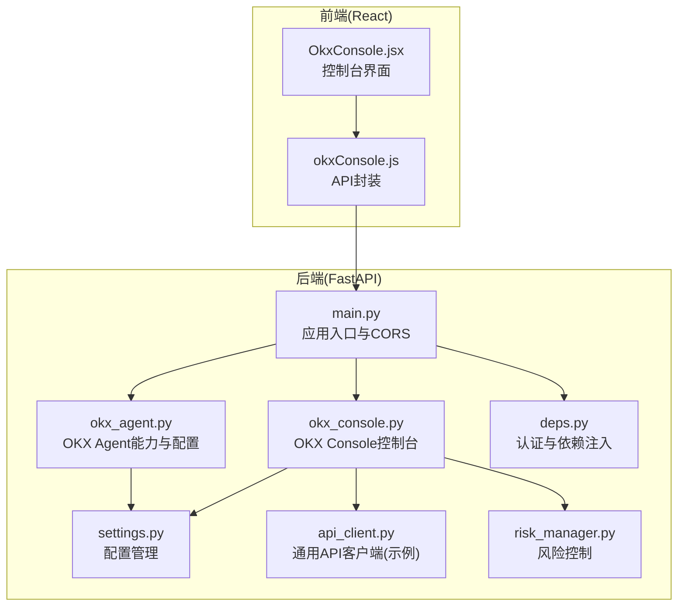
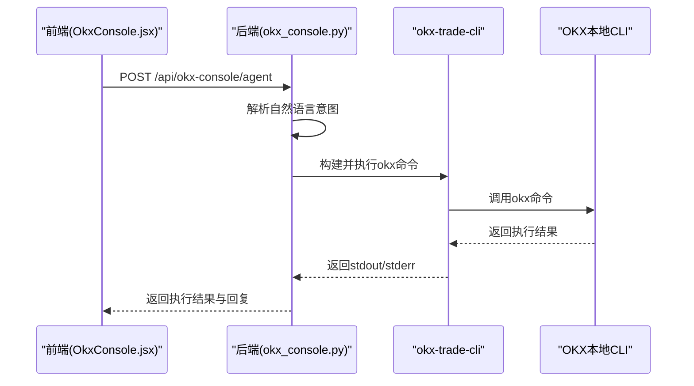
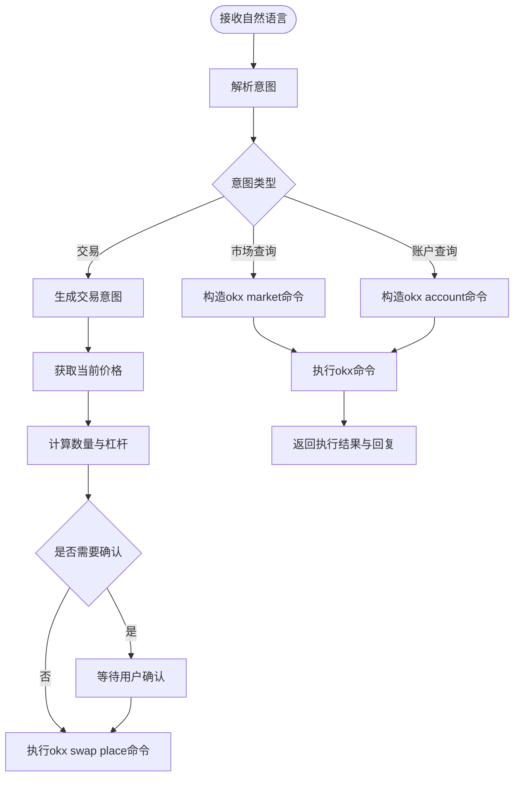
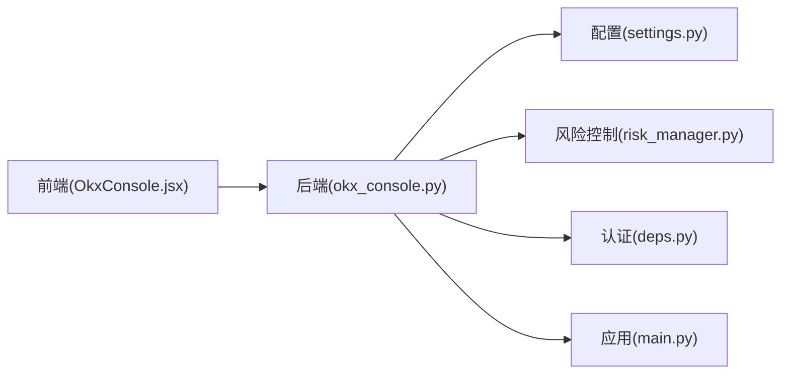

# OKX集成API

<cite>
**本文档引用的文件**
- [okx_agent.py](file://backpack_quant_trading/api/routers/okx_agent.py)
- [okx_console.py](file://backpack_quant_trading/api/routers/okx_console.py)
- [main.py](file://backpack_quant_trading/api/main.py)
- [deps.py](file://backpack_quant_trading/api/deps.py)
- [settings.py](file://backpack_quant_trading/config/settings.py)
- [api_client.py](file://backpack_quant_trading/core/api_client.py)
- [risk_manager.py](file://backpack_quant_trading/core/risk_manager.py)
- [OkxConsole.jsx](file://backpack_quant_trading/frontend/src/views/OkxConsole.jsx)
- [okxConsole.js](file://backpack_quant_trading/frontend/src/api/okxConsole.js)
</cite>

## 目录
1. [简介](#简介)
2. [项目结构](#项目结构)
3. [核心组件](#核心组件)
4. [架构总览](#架构总览)
5. [详细组件分析](#详细组件分析)
6. [依赖关系分析](#依赖关系分析)
7. [性能考虑](#性能考虑)
8. [故障排除指南](#故障排除指南)
9. [结论](#结论)
10. [附录](#附录)

## 简介
本文件为OKX集成API的详细技术文档，面向需要在本项目中接入OKX交易系统的开发者与运维人员。文档覆盖以下主题：
- OKX账户管理、交易接口、资金划转和合约交易接口的HTTP方法、URL模式、请求/响应模式
- OKX特有的交易参数、杠杆设置和保证金管理
- OKX API密钥配置、签名验证和请求限流处理
- 具体的OKX交易请求示例、账户信息查询格式和资金流水记录
- 合约交易参数、持仓管理和平仓策略
- OKX特有的风险控制、强平机制和资金费率计算

本项目通过FastAPI提供后端API，前端通过React组件与后端交互，后端通过okx-trade-cli与OKX本地CLI通信，实现对OKX的自然语言控制与自动化交易。

## 项目结构
后端采用FastAPI框架，路由集中在api/routers目录，核心业务逻辑位于core目录，前端位于frontend目录。OKX集成主要涉及两个路由模块：
- OKX Agent能力与快速开始：提供OKX Agent Trade Kit的能力概览、快速开始步骤与FAQ
- OKX Console控制台：提供自然语言解析、命令执行、交易确认等能力

图表来源
- [main.py:1-98](file://backpack_quant_trading/api/main.py#L1-L98)
- [okx_agent.py:1-190](file://backpack_quant_trading/api/routers/okx_agent.py#L1-L190)
- [okx_console.py:1-796](file://backpack_quant_trading/api/routers/okx_console.py#L1-L796)
- [deps.py:1-73](file://backpack_quant_trading/api/deps.py#L1-L73)
- [settings.py:1-137](file://backpack_quant_trading/config/settings.py#L1-L137)
- [api_client.py:1-800](file://backpack_quant_trading/core/api_client.py#L1-L800)
- [risk_manager.py:1-566](file://backpack_quant_trading/core/risk_manager.py#L1-L566)
- [OkxConsole.jsx:1-191](file://backpack_quant_trading/frontend/src/views/OkxConsole.jsx#L1-L191)
- [okxConsole.js:1-11](file://backpack_quant_trading/frontend/src/api/okxConsole.js#L1-L11)

章节来源
- [main.py:1-98](file://backpack_quant_trading/api/main.py#L1-L98)
- [okx_agent.py:1-190](file://backpack_quant_trading/api/routers/okx_agent.py#L1-L190)
- [okx_console.py:1-796](file://backpack_quant_trading/api/routers/okx_console.py#L1-L796)

## 核心组件
- OKX Agent路由：提供OKX Agent Trade Kit的能力概览、快速开始步骤与FAQ，包含模块与工具清单、使用模式、安全特性与链接。
- OKX Console路由：提供自然语言解析、命令执行、交易确认、白名单限制与环境变量控制等功能。
- 认证与依赖注入：提供JWT与Cookie认证，以及用户上下文获取。
- 配置管理：提供全局配置对象，包含API基础URL、密钥、窗口参数等。
- 风险控制：提供仓位验证、止损止盈计算、VaR与压力测试等风险管理能力。

章节来源
- [okx_agent.py:29-144](file://backpack_quant_trading/api/routers/okx_agent.py#L29-L144)
- [okx_console.py:167-230](file://backpack_quant_trading/api/routers/okx_console.py#L167-L230)
- [deps.py:44-73](file://backpack_quant_trading/api/deps.py#L44-L73)
- [settings.py:104-137](file://backpack_quant_trading/config/settings.py#L104-L137)
- [risk_manager.py:48-229](file://backpack_quant_trading/core/risk_manager.py#L48-L229)

## 架构总览
OKX集成通过后端FastAPI路由与前端React组件协作，后端通过okx-trade-cli与OKX本地CLI通信，实现对OKX的自然语言控制与自动化交易。后端还提供风险控制与配置管理能力。

图表来源
- [OkxConsole.jsx:23-65](file://backpack_quant_trading/frontend/src/views/OkxConsole.jsx#L23-L65)
- [okx_console.py:571-794](file://backpack_quant_trading/api/routers/okx_console.py#L571-L794)

## 详细组件分析

### OKX Agent路由
OKX Agent路由提供OKX Agent Trade Kit的能力概览、快速开始步骤与FAQ，包含模块与工具清单、使用模式、安全特性与链接。

- 能力概览：返回OKX Agent Trade Kit的模块与工具清单，包括行情数据、现货交易、永续合约、期权、账户管理、策略机器人等。
- 快速开始：返回OpenClaw/MCP的快速开始步骤，包含安装、配置与试用示例。
- 常见问题：提供常见问题摘要，解答关于Agent Trade Kit功能、支持的AI客户端、API Key安全性与收费等问题。

章节来源
- [okx_agent.py:29-144](file://backpack_quant_trading/api/routers/okx_agent.py#L29-L144)
- [okx_agent.py:147-176](file://backpack_quant_trading/api/routers/okx_agent.py#L147-L176)
- [okx_agent.py:179-190](file://backpack_quant_trading/api/routers/okx_agent.py#L179-L190)

### OKX Console控制台
OKX Console控制台提供自然语言解析、命令执行、交易确认、白名单限制与环境变量控制等功能。

- 白名单模块与动作：限制可执行的模块与动作，尽量只开放行情与账户只读能力，交易类模块默认由环境变量控制。
- 自然语言解析：解析自然语言为意图，支持开多/开空/查行情/账户余额/持仓等。
- AI自解析：通过DeepSeek API将自然语言转换为okx命令，支持二次确认与风险提示。
- 交易执行：支持模拟盘与实盘，自动获取价格并计算数量，执行下单或查询命令。
- 环境变量控制：通过ENABLE_OKX_TRADE环境变量控制交易类命令的启用，模拟盘默认放行。

图表来源
- [okx_console.py:244-392](file://backpack_quant_trading/api/routers/okx_console.py#L244-L392)
- [okx_console.py:409-563](file://backpack_quant_trading/api/routers/okx_console.py#L409-L563)

章节来源
- [okx_console.py:87-151](file://backpack_quant_trading/api/routers/okx_console.py#L87-L151)
- [okx_console.py:167-230](file://backpack_quant_trading/api/routers/okx_console.py#L167-L230)
- [okx_console.py:244-392](file://backpack_quant_trading/api/routers/okx_console.py#L244-L392)
- [okx_console.py:409-563](file://backpack_quant_trading/api/routers/okx_console.py#L409-L563)

### 认证与依赖注入
认证与依赖注入提供JWT与Cookie认证，以及用户上下文获取。后端路由依赖require_user依赖注入，确保只有已登录用户才能访问特定路由。

- JWT与Cookie认证：支持Bearer Token与Cookie两种认证方式。
- 用户上下文：从Token或Cookie中解析用户信息，提供用户ID、用户名与角色。
- 依赖注入：require_user依赖注入要求已登录，未登录则返回401。

章节来源
- [deps.py:44-73](file://backpack_quant_trading/api/deps.py#L44-L73)

### 配置管理
配置管理提供全局配置对象，包含API基础URL、密钥、窗口参数等。OKX Console控制台通过环境变量控制交易类命令的启用。

- 全局配置：包含Backpack、Hyperliquid、数据库、交易、Ostium、Deepcoin、Webhook等配置。
- OKX Console环境变量：ENABLE_OKX_TRADE控制交易类命令的启用，模拟盘默认放行。

章节来源
- [settings.py:104-137](file://backpack_quant_trading/config/settings.py#L104-L137)
- [okx_console.py:135-141](file://backpack_quant_trading/api/routers/okx_console.py#L135-L141)

### 风险控制
风险控制提供仓位验证、止损止盈计算、VaR与压力测试等风险管理能力。OKX Console控制台在执行交易前进行风险评估与二次确认。

- 仓位验证：基于账户资金与最大仓位比例，验证保证金是否超过限制。
- 止损止盈：根据杠杆与价格变动计算止损与止盈价格。
- VaR与压力测试：提供历史法、参数法与蒙特卡洛法的VaR计算与压力测试结果。

章节来源
- [risk_manager.py:87-229](file://backpack_quant_trading/core/risk_manager.py#L87-L229)
- [risk_manager.py:331-402](file://backpack_quant_trading/core/risk_manager.py#L331-L402)
- [risk_manager.py:418-466](file://backpack_quant_trading/core/risk_manager.py#L418-L466)

## 依赖关系分析
后端路由依赖FastAPI应用入口与CORS配置，OKX Console控制台依赖配置管理与风险控制模块，前端通过API封装与后端交互。

图表来源
- [main.py:36-48](file://backpack_quant_trading/api/main.py#L36-L48)
- [okx_console.py:1-796](file://backpack_quant_trading/api/routers/okx_console.py#L1-L796)
- [settings.py:104-137](file://backpack_quant_trading/config/settings.py#L104-L137)
- [risk_manager.py:1-566](file://backpack_quant_trading/core/risk_manager.py#L1-L566)
- [deps.py:1-73](file://backpack_quant_trading/api/deps.py#L1-L73)

章节来源
- [main.py:36-48](file://backpack_quant_trading/api/main.py#L36-L48)
- [okx_console.py:1-796](file://backpack_quant_trading/api/routers/okx_console.py#L1-L796)

## 性能考虑
- 命令执行超时：OKX Console控制台对okx命令执行设置了超时时间，避免长时间阻塞。
- 环境变量控制：通过ENABLE_OKX_TRADE环境变量控制交易类命令的启用，减少不必要的资源消耗。
- 白名单限制：限制可执行的模块与动作，避免执行危险命令导致性能问题。
- 前端交互：前端通过异步请求与后端交互，避免阻塞UI线程。

[本节为一般性指导，不直接分析具体文件]

## 故障排除指南
- 未找到okx CLI：检查后端进程PATH中是否包含okx，确保已安装okx-trade-cli并重启后端生效。
- 交易类命令默认禁用：设置ENABLE_OKX_TRADE=true后重试，确保已配置~/.okx/config.toml。
- 命令包含不允许的分隔符：检查命令中是否包含危险字符，避免注入攻击。
- 400错误：检查签名、时间戳、请求频率限制与必要参数。
- 401错误：检查登录状态，确保已登录后端。

章节来源
- [okx_console.py:206-220](file://backpack_quant_trading/api/routers/okx_console.py#L206-L220)
- [okx_console.py:173-180](file://backpack_quant_trading/api/routers/okx_console.py#L173-L180)
- [okx_console.py:147-150](file://backpack_quant_trading/api/routers/okx_console.py#L147-L150)
- [api_client.py:254-268](file://backpack_quant_trading/core/api_client.py#L254-L268)

## 结论
本项目通过FastAPI与React实现了对OKX的自然语言控制与自动化交易，提供了完整的OKX Agent能力概览、快速开始与FAQ，以及OKX Console控制台的自然语言解析、命令执行与风险控制。通过环境变量与白名单限制，确保了交易的安全性与可控性。建议在生产环境中严格配置API密钥与环境变量，并结合风险控制模块进行严格的风控管理。

[本节为总结性内容，不直接分析具体文件]

## 附录

### API定义与使用示例

- OKX Agent能力概览
  - 方法：GET
  - 路径：/api/okx-agent/capabilities
  - 请求：无
  - 响应：包含模块与工具清单、使用模式、安全特性与链接
  - 示例：curl -X GET http://localhost:8000/api/okx-agent/capabilities

- OKX Agent快速开始
  - 方法：GET
  - 路径：/api/okx-agent/quickstart
  - 请求：无
  - 响应：包含OpenClaw/MCP的快速开始步骤与配置示例
  - 示例：curl -X GET http://localhost:8000/api/okx-agent/quickstart

- OKX Agent常见问题
  - 方法：GET
  - 路径：/api/okx-agent/faq
  - 请求：无
  - 响应：包含常见问题摘要
  - 示例：curl -X GET http://localhost:8000/api/okx-agent/faq

- OKX Console快捷命令
  - 方法：GET
  - 路径：/api/okx-console/presets
  - 请求：需要登录
  - 响应：包含预设命令列表
  - 示例：curl -X GET http://localhost:8000/api/okx-console/presets -H "Authorization: Bearer <token>"

- OKX Console执行命令
  - 方法：POST
  - 路径：/api/okx-console/run
  - 请求体：包含命令、profile、demo、json参数
  - 响应：包含执行结果与返回码
  - 示例：curl -X POST http://localhost:8000/api/okx-console/run -H "Content-Type: application/json" -d '{"command":"okx market ticker BTC-USDT","profile":null,"demo":false,"json":false}'

- OKX Console自然语言执行
  - 方法：POST
  - 路径：/api/okx-console/natural
  - 请求体：包含自然语言文本
  - 响应：包含意图解析结果与执行命令
  - 示例：curl -X POST http://localhost:8000/api/okx-console/natural -H "Content-Type: application/json" -d '{"text":"查一下 ETH 价格"}'

- OKX Console AI自解析
  - 方法：POST
  - 路径：/api/okx-console/agent
  - 请求体：包含自然语言文本、auto_execute、confirm、profile、demo、json_out参数
  - 响应：包含计划、回复与执行结果
  - 示例：curl -X POST http://localhost:8000/api/okx-console/agent -H "Content-Type: application/json" -d '{"text":"帮我下单","auto_execute":true,"confirm":false,"profile":null,"demo":true,"json_out":false}'

章节来源
- [okx_agent.py:29-144](file://backpack_quant_trading/api/routers/okx_agent.py#L29-L144)
- [okx_agent.py:147-176](file://backpack_quant_trading/api/routers/okx_agent.py#L147-L176)
- [okx_agent.py:179-190](file://backpack_quant_trading/api/routers/okx_agent.py#L179-L190)
- [okx_console.py:153-164](file://backpack_quant_trading/api/routers/okx_console.py#L153-L164)
- [okx_console.py:167-230](file://backpack_quant_trading/api/routers/okx_console.py#L167-L230)
- [okx_console.py:306-392](file://backpack_quant_trading/api/routers/okx_console.py#L306-L392)
- [okx_console.py:571-794](file://backpack_quant_trading/api/routers/okx_console.py#L571-L794)

### OKX交易参数与杠杆设置

- 合约交易参数
  - instId：合约ID，如ETH-USDT-SWAP
  - side：方向，buy/sell
  - ordType：订单类型，market等
  - sz：数量，合约张数或币数量
  - posSide：持仓方向，net
  - tdMode：交易模式，cross等
  - lever：杠杆倍数

- 杠杆设置
  - 默认杠杆：10x
  - 杠杆范围：根据合约规格与交易所设置
  - 杠杆调整：通过合约设置接口调整

- 保证金管理
  - 保证金计算：保证金 = 持仓价值 / 杠杆
  - 最大保证金：基于账户资金的MAX_POSITION_SIZE比例
  - 保证金检查：在执行订单前进行风险评估

章节来源
- [okx_console.py:372-390](file://backpack_quant_trading/api/routers/okx_console.py#L372-L390)
- [okx_console.py:627-754](file://backpack_quant_trading/api/routers/okx_console.py#L627-L754)
- [risk_manager.py:151-179](file://backpack_quant_trading/core/risk_manager.py#L151-L179)

### OKX API密钥配置与签名验证

- API密钥配置
  - 配置文件：~/.okx/config.toml
  - 字段：api_key、secret_key、passphrase
  - 模式：demo/live

- 签名验证
  - 签名算法：ED25519
  - 请求头：X-API-Key、X-Signature、X-Timestamp、X-Window
  - 时间窗口：默认5000ms，最大60000ms

- 请求限流处理
  - 400错误：检查签名、时间戳、请求频率限制与必要参数
  - 429/5xx错误：重试与降级处理

章节来源
- [okx_agent.py:152-154](file://backpack_quant_trading/api/routers/okx_agent.py#L152-L154)
- [api_client.py:158-211](file://backpack_quant_trading/core/api_client.py#L158-L211)
- [api_client.py:254-268](file://backpack_quant_trading/core/api_client.py#L254-L268)

### OKX账户信息查询与资金流水记录

- 账户余额查询
  - 命令：okx account balance
  - 返回：账户余额详情

- 当前持仓查询
  - 命令：okx account positions
  - 返回：当前所有持仓详情

- 账单流水查询
  - 命令：okx account bills
  - 返回：账单流水详情

- 手续费率查询
  - 命令：okx account fees
  - 返回：手续费率详情

章节来源
- [okx_console.py:156-163](file://backpack_quant_trading/api/routers/okx_console.py#L156-L163)
- [okx_console.py:318-330](file://backpack_quant_trading/api/routers/okx_console.py#L318-L330)

### OKX合约交易参数、持仓管理与平仓策略

- 合约交易参数
  - instId：合约ID
  - side：方向
  - ordType：订单类型
  - sz：数量
  - posSide：持仓方向
  - tdMode：交易模式
  - lever：杠杆

- 持仓管理
  - 获取持仓：okx swap positions
  - 设置杠杆：okx swap leverage
  - 一键平仓：okx swap close

- 平仓策略
  - 止损：根据杠杆与价格变动计算止损价格
  - 止盈：根据杠杆与价格变动计算止盈价格
  - 风险控制：基于账户资金与最大仓位比例进行风险评估

章节来源
- [okx_console.py:88-99](file://backpack_quant_trading/api/routers/okx_console.py#L88-L99)
- [okx_console.py:409-563](file://backpack_quant_trading/api/routers/okx_console.py#L409-L563)
- [risk_manager.py:192-229](file://backpack_quant_trading/core/risk_manager.py#L192-L229)

### OKX风险控制、强平机制与资金费率计算

- 风险控制
  - 仓位验证：基于账户资金与最大仓位比例
  - 止损止盈：根据杠杆与价格变动计算
  - VaR与压力测试：提供多种VaR计算方法与压力测试场景

- 强平机制
  - 强平触发：当保证金不足或达到强平阈值时触发
  - 风险提示：在执行交易前进行风险评估与提示

- 资金费率计算
  - 资金费率查询：okx market funding-rate
  - 资金费率影响：影响合约交易成本与收益

章节来源
- [risk_manager.py:87-229](file://backpack_quant_trading/core/risk_manager.py#L87-L229)
- [risk_manager.py:331-402](file://backpack_quant_trading/core/risk_manager.py#L331-L402)
- [okx_console.py:160](file://backpack_quant_trading/api/routers/okx_console.py#L160)