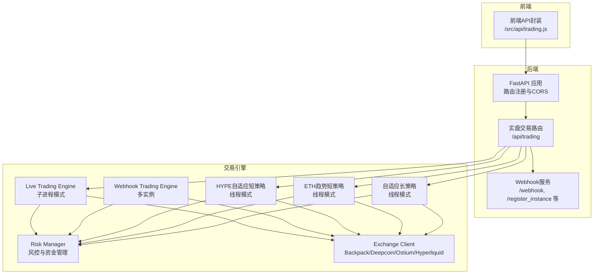
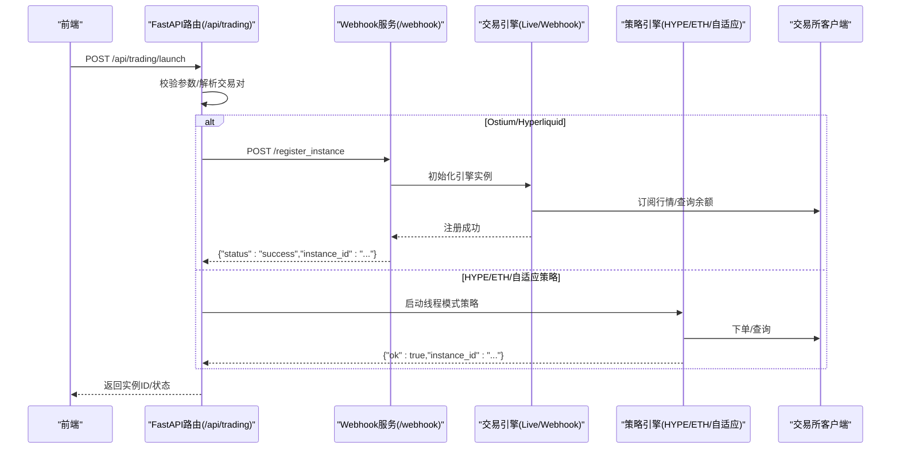
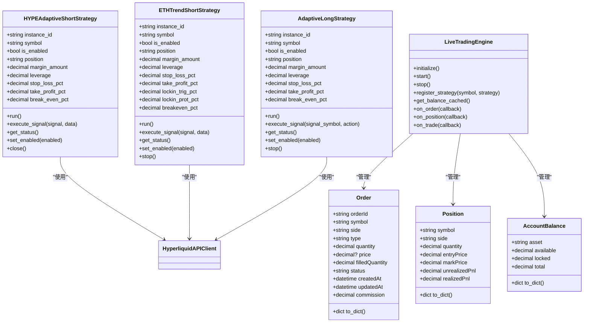
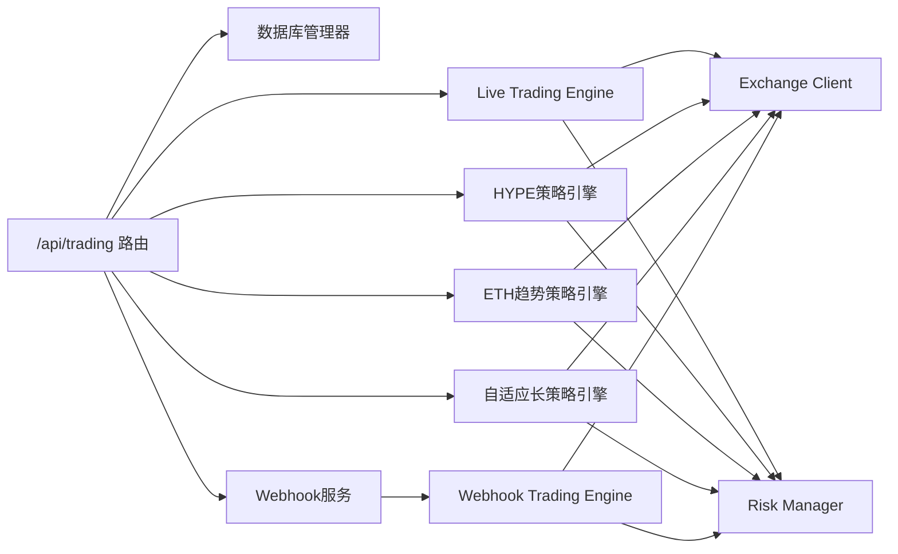

# 实盘交易API

<cite>
**本文引用的文件**
- [api/main.py](file://backpack_quant_trading/api/main.py)
- [api/routers/trading.py](file://backpack_quant_trading/api/routers/trading.py)
- [engine/live_trading.py](file://backpack_quant_trading/engine/live_trading.py)
- [core/risk_manager.py](file://backpack_quant_trading/core/risk_manager.py)
- [webhook_service.py](file://backpack_quant_trading/webhook_service.py)
- [config/settings.py](file://backpack_quant_trading/config/settings.py)
- [frontend/src/api/trading.js](file://backpack_quant_trading/frontend/src/api/trading.js)
- [core/api_client.py](file://backpack_quant_trading/core/api_client.py)
- [engine/webhook_trading.py](file://backpack_trading/engine/webhook_trading.py)
- [strategy/hype_adaptive_short.py](file://backpack_quant_trading/strategy/hype_adaptive_short.py)
- [strategy/eth_trend_short.py](file://backpack_quant_trading/strategy/eth_trend_short.py)
- [strategy/adaptive_long_strategy.py](file://backpack_quant_trading/strategy/adaptive_long_strategy.py)
</cite>

## 目录
1. [简介](#简介)
2. [项目结构](#项目结构)
3. [核心组件](#核心组件)
4. [架构总览](#架构总览)
5. [详细组件分析](#详细组件分析)
6. [依赖分析](#依赖分析)
7. [性能考虑](#性能考虑)
8. [故障排查指南](#故障排查指南)
9. [结论](#结论)
10. [附录](#附录)

## 简介
本文件为实盘交易API的详细技术文档，覆盖交易控制、订单管理、仓位查询与交易状态监控接口。文档同时阐述交易参数配置（交易对选择、下单数量、价格类型、止损止盈设置等）、订单生命周期管理（创建、取消、修改、状态查询）、实时交易状态推送与WebSocket连接管理、风险控制参数与资金管理策略。为便于前后端对接，文档提供了HTTP接口定义、请求/响应模式、错误处理策略与典型调用示例。

**更新** 本版本大幅增强了交易API路由器功能，新增对三种策略类型的支持：HYPE自适应短策略、ETH趋势短策略、自适应长策略，提供统一的API端点和实例管理。

## 项目结构
后端基于FastAPI提供REST接口，前端通过统一的JavaScript封装调用。交易引擎分为两类：
- 子进程模式：Backpack/Deepcoin，由后端启动子进程执行策略。
- Webhook模式：Ostium/Hyperliquid，由独立Webhook服务承载多实例引擎。

**图表来源**
- [api/main.py:36-48](file://backpack_quant_trading/api/main.py#L36-L48)
- [api/routers/trading.py:334-462](file://backpack_quant_trading/api/routers/trading.py#L334-L462)
- [webhook_service.py:83-241](file://backpack_quant_trading/webhook_service.py#L83-L241)

**章节来源**
- [api/main.py:14-98](file://backpack_quant_trading/api/main.py#L14-L98)
- [api/routers/trading.py:23-561](file://backpack_quant_trading/api/routers/trading.py#L23-L561)
- [webhook_service.py:26-598](file://backpack_quant_trading/webhook_service.py#L26-L598)

## 核心组件
- FastAPI应用与路由：负责注册交易相关路由、CORS配置与静态资源挂载。
- 实盘交易路由：提供策略启动/停止、实例管理、日志查询、HYPE策略管理等接口。
- Webhook服务：多实例引擎管理、信号路由、动态配置更新、广播/单实例模式。
- 交易引擎：Live Trading Engine（子进程模式）与Webhook Trading Engine（Webhook模式）。
- 风控与资金管理：Risk Manager统一风控策略与资金限额。
- 交易所客户端：BackpackAPIClient等抽象，适配不同交易所的下单与查询。
- **新增** 三种策略引擎：HYPE自适应短策略、ETH趋势短策略、自适应长策略，均采用线程模式管理。

**章节来源**
- [api/main.py:36-48](file://backpack_quant_trading/api/main.py#L36-L48)
- [api/routers/trading.py:23-561](file://backpack_quant_trading/api/routers/trading.py#L23-L561)
- [webhook_service.py:26-598](file://backpack_quant_trading/webhook_service.py#L26-L598)
- [core/risk_manager.py:48-566](file://backpack_quant_trading/core/risk_manager.py#L48-L566)
- [core/api_client.py:22-86](file://backpack_quant_trading/core/api_client.py#L22-L86)

## 架构总览
实盘交易API采用"后端路由 + 交易引擎 + Webhook服务"的分层架构。后端路由负责参数校验、实例注册与进程/服务管理；交易引擎负责订单执行、仓位管理与风控；Webhook服务负责多实例信号路由与动态配置。

**图表来源**
- [api/routers/trading.py:334-462](file://backpack_quant_trading/api/routers/trading.py#L334-L462)
- [webhook_service.py:83-241](file://backpack_quant_trading/webhook_service.py#L83-L241)

## 详细组件分析

### 实盘交易路由（/api/trading）
- 策略与平台查询：获取可用策略、交易所与HYPE策略列表。
- 实例管理：
  - 启动策略：支持Backpack/Deepcoin子进程模式与Ostium/Hyperliquid Webhook模式。
  - 停止实例：子进程模式通过PID终止，Webhook模式通过注销接口。
  - 实例列表：聚合Webhook运行实例与本地子进程实例。
- **新增** HYPE策略管理：独立线程模式，支持启动、停止、状态查询与启停切换。
- **新增** ETH趋势策略管理：独立线程模式，支持启动、停止、状态查询与Webhook信号处理。
- **新增** 自适应长策略管理：独立线程模式，支持启动、停止、状态查询与Webhook信号处理。
- 日志查询：聚合Webhook、子进程与HYPE策略日志。

**更新** 新增三种策略的统一管理接口，支持线程模式的HYPE、ETH趋势和自适应长策略。

接口定义与示例
- 获取策略与平台
  - 方法：GET
  - 路径：/api/trading/strategies
  - 响应：包含策略列表、交易所列表与HYPE策略列表
- 启动策略
  - 方法：POST
  - 路径：/api/trading/launch
  - 请求体字段（示例）：platform, strategy, symbol, size, leverage, take_profit, stop_loss, api_key, api_secret, passphrase, private_key, forbidden_ranges
  - 响应：返回instance_id与状态
- 停止实例
  - 方法：DELETE
  - 路径：/api/trading/instances/{instance_id}
  - 响应：{"message":"ok"}
- 实例列表
  - 方法：GET
  - 路径：/api/trading/instances
  - 响应：实例数组（含平台、策略名、symbol、balance、status等）
- **新增** HYPE策略管理
  - 启动：POST /api/trading/hype/start
  - 停止：POST /api/trading/hype/stop
  - 状态：GET /api/trading/hype/status
  - 切换：POST /api/trading/hype/toggle
  - Webhook：POST /api/trading/hype/webhook
- **新增** ETH趋势策略管理
  - 启动：POST /api/trading/eth-trend-short/start
  - 停止：POST /api/trading/eth-trend-short/stop
  - 状态：GET /api/trading/eth-trend-short/status
- **新增** 自适应长策略管理
  - 启动：POST /api/trading/adaptive-long/start
  - 停止：POST /api/trading/adaptive-long/stop
  - 状态：GET /api/trading/adaptive-long/status
  - Webhook：POST /api/trading/adaptive-long/webhook
- 日志
  - 方法：GET
  - 路径：/api/trading/logs
  - 响应：最近日志文本

**章节来源**
- [api/routers/trading.py:89-102](file://backpack_quant_trading/api/routers/trading.py#L89-L102)
- [api/routers/trading.py:105-200](file://backpack_quant_trading/api/routers/trading.py#L105-L200)
- [api/routers/trading.py:243-290](file://backpack_quant_trading/api/routers/trading.py#L243-L290)
- [api/routers/trading.py:292-332](file://backpack_quant_trading/api/routers/trading.py#L292-L332)
- [api/routers/trading.py:334-462](file://backpack_quant_trading/api/routers/trading.py#L334-L462)
- [api/routers/trading.py:527-561](file://backpack_quant_trading/api/routers/trading.py#L527-L561)
- [api/routers/trading.py:803-918](file://backpack_quant_trading/api/routers/trading.py#L803-L918)
- [api/routers/trading.py:921-1088](file://backpack_quant_trading/api/routers/trading.py#L921-L1088)

### Webhook服务（/webhook）
- 多实例引擎管理：注册/注销实例、查询实例、余额查询。
- 信号路由：单实例与广播模式，支持按策略名与symbol筛选。
- 动态配置：更新保证金、止盈止损、杠杆与symbol。
- 熔断重置：手动解除熔断锁定。
- 签名校验：可选HMAC签名验证。
- **新增** HYPE策略Webhook路由：支持本地实例处理和代理转发。

**更新** 新增HYPE策略的Webhook路由支持，包括本地实例处理和代理转发机制。

接口定义与示例
- 注册实例
  - 方法：POST
  - 路径：/register_instance
  - 请求体字段：instance_id, private_key, strategy_name, symbol, leverage, margin_amount, stop_loss_ratio, take_profit_ratio, forbidden_hours
  - 响应：{"status":"success","instance_id": "...","exchange":"ostium|hyperliquid"}
- 注销实例
  - 方法：POST
  - 路径：/unregister_instance/{instance_id}
  - 响应：{"status":"success","message":"实例已注销"}
- 实例列表
  - 方法：GET
  - 路径：/instances
  - 响应：实例数组（包含instance_id、symbol、exchange、strategy）
- 余额查询
  - 方法：GET
  - 路径：/balance/{instance_id}
  - 响应：{"balance": ...}
- 信号接口
  - 方法：POST
  - 路径：/webhook 或 /webhook/{instance_id}
  - 请求体：TradingViewSignal（包含signal、symbol、instance_id、strategy_name、price、timestamp等）
  - 响应：{"status":"success","message":"Signal received","instance_id": "..."}
- 广播模式
  - 方法：POST
  - 路径：/webhook
  - 请求体：TradingViewSignal + 可选strategy_name/symbol
  - 响应：{"status":"success","message":"Signal broadcasted to X instances","instances":[],"broadcast_count":X}
- 动态配置更新
  - 方法：POST
  - 路径：/update_config/{instance_id}
  - 请求体：margin_amount、stop_loss_ratio、take_profit_ratio、leverage、symbol
  - 响应：当前配置快照
- 熔断重置
  - 方法：POST
  - 路径：/reset/{instance_id}
  - 响应：{"status":"success","message":"Service reset successful"}
- **新增** HYPE策略Webhook
  - 方法：POST
  - 路径：/hype/webhook
  - 请求体：TradingViewSignal（包含signal、symbol、instance_id、strategy_name、price、timestamp等）
  - 响应：{"status":"ok","signal": "buy/sell","position": "LONG/SHORT/None","source": "local|proxy"}

**章节来源**
- [webhook_service.py:83-241](file://backpack_quant_trading/webhook_service.py#L83-L241)
- [webhook_service.py:246-290](file://backpack_quant_trading/webhook_service.py#L246-L290)
- [webhook_service.py:292-318](file://backpack_quant_trading/webhook_service.py#L292-L318)
- [webhook_service.py:319-444](file://backpack_quant_trading/webhook_service.py#L319-L444)
- [webhook_service.py:445-479](file://backpack_quant_trading/webhook_service.py#L445-L479)
- [webhook_service.py:480-500](file://backpack_quant_trading/webhook_service.py#L480-L500)
- [webhook_service.py:512-588](file://backpack_quant_trading/webhook_service.py#L512-L588)
- [webhook_service.py:590-787](file://backpack_quant_trading/webhook_service.py#L590-L787)

### 交易引擎与订单管理
- Live Trading Engine（子进程模式）
  - 订单/仓位/余额数据结构：Order、Position、AccountBalance。
  - WebSocket订阅：K线频道订阅与消息处理。
  - 订单生命周期：下单、查询、取消、历史查询。
  - 风控：余额缓存、仓位与保证金检查、止盈止损监控。
- Webhook Trading Engine（Webhook模式）
  - 信号解析与执行：根据TradingViewSignal生成下单指令。
  - 仓位计算：基于保证金与杠杆计算下单金额。
  - 休市控制：按北京时间小时列表控制交易时段。
  - 风控：止盈止损比例、熔断与通知。
- **新增** HYPE自适应短策略引擎
  - 线程模式管理，支持独立的HYPE策略实例。
  - Webhook信号处理与本地风控。
  - 支持启停切换与状态查询。
- **新增** ETH趋势短策略引擎
  - 线程模式管理，基于技术指标的信号自驱动策略。
  - WebSocket实时K线订阅与技术指标计算。
  - 支持锁利、保本等高级风控机制。
- **新增** 自适应长策略引擎
  - 线程模式管理，基于TradingView Webhook信号的做多策略。
  - 动态币种识别与Webhook信号处理。
  - 支持本地SL/TP/保本风控。

**图表来源**
- [engine/live_trading.py:50-124](file://backpack_quant_trading/engine/live_trading.py#L50-L124)
- [engine/live_trading.py:347-587](file://backpack_quant_trading/engine/live_trading.py#L347-L587)
- [strategy/hype_adaptive_short.py:1-310](file://backpack_quant_trading/strategy/hype_adaptive_short.py#L1-L310)
- [strategy/eth_trend_short.py:1-534](file://backpack_quant_trading/strategy/eth_trend_short.py#L1-L534)
- [strategy/adaptive_long_strategy.py:1-310](file://backpack_quant_trading/strategy/adaptive_long_strategy.py#L1-L310)

**章节来源**
- [engine/live_trading.py:50-124](file://backpack_quant_trading/engine/live_trading.py#L50-L124)
- [engine/live_trading.py:347-587](file://backpack_quant_trading/engine/live_trading.py#L347-L587)
- [engine/webhook_trading.py:22-84](file://backpack_quant_trading/engine/webhook_trading.py#L22-L84)
- [strategy/hype_adaptive_short.py:1-310](file://backpack_quant_trading/strategy/hype_adaptive_short.py#L1-L310)
- [strategy/eth_trend_short.py:1-534](file://backpack_quant_trading/strategy/eth_trend_short.py#L1-L534)
- [strategy/adaptive_long_strategy.py:1-310](file://backpack_quant_trading/strategy/adaptive_long_strategy.py#L1-L310)

### 风控与资金管理
- 风控参数
  - 最大单笔仓位比例、日度最大亏损、最大回撤、止损/止盈比例、无风险利率、默认杠杆。
- 风控检查
  - 仓位验证：基于总保证金与账户资金估算，防止超过最大仓位比例。
  - 订单风控：计算本次订单所需保证金，结合总保证金与账户资金评估风险。
  - 风险事件记录：拒绝/警告事件持久化。
- 风险报告：VaR、压力测试、风险评分与建议。
- **新增** 三种策略的特定风控参数
  - HYPE策略：支持break_even_pct保本机制
  - ETH趋势策略：支持lockin_trig_pct锁利触发、lockin_prot_pct锁利保护
  - 自适应长策略：支持break_even_pct保本机制

**章节来源**
- [config/settings.py:55-64](file://backpack_quant_trading/config/settings.py#L55-L64)
- [core/risk_manager.py:87-229](file://backpack_quant_trading/core/risk_manager.py#L87-L229)
- [core/risk_manager.py:503-542](file://backpack_quant_trading/core/risk_manager.py#L503-L542)
- [strategy/hype_adaptive_short.py:55-90](file://backpack_quant_trading/strategy/hype_adaptive_short.py#L55-L90)
- [strategy/eth_trend_short.py:150-170](file://backpack_quant_trading/strategy/eth_trend_short.py#L150-L170)
- [strategy/adaptive_long_strategy.py:55-90](file://backpack_quant_trading/strategy/adaptive_long_strategy.py#L55-L90)

### 交易参数配置
- 交易对选择
  - 支持简写与完整格式互转，Backpack/Deepcoin/Hyperliquid/Ostium格式解析。
- 下单数量
  - 子进程模式：--position-size/--take-profit/--stop-loss传参。
  - Webhook模式：通过环境变量或动态配置设置保证金范围。
  - **新增** 线程模式策略：通过启动参数配置保证金与杠杆。
- 价格类型
  - 支持市价单/限价单，限价单需提供price。
- 止损止盈
  - 百分比/杠杆驱动的止盈止损，支持动态更新。
  - **新增** ETH趋势策略支持锁利机制（lockin_trig_pct/lockin_prot_pct）。
- 休市控制
  - Ostium支持按小时禁用交易时段。

**章节来源**
- [api/routers/trading.py:53-86](file://backpack_quant_trading/api/routers/trading.py#L53-L86)
- [api/routers/trading.py:373-392](file://backpack_quant_trading/api/routers/trading.py#L373-L392)
- [webhook_service.py:512-588](file://backpack_quant_trading/webhook_service.py#L512-L588)
- [engine/webhook_trading.py:131-140](file://backpack_quant_trading/engine/webhook_trading.py#L131-L140)
- [strategy/eth_trend_short.py:150-170](file://backpack_quant_trading/strategy/eth_trend_short.py#L150-L170)

### 订单生命周期管理
- 创建：下单接口支持市价/限价单，限价单需提供price。
- 查询：活跃库与历史库双通道查询。
- 修改：Webhook模式支持动态更新止盈止损/杠杆/保证金。
- 取消：单订单与全部订单取消。
- 状态：Pending/Open/Filled/Cancelled/Rejected。
- **新增** 线程模式策略的订单管理
  - HYPE策略：支持手动平仓与强制关闭。
  - ETH趋势策略：支持WebSocket实时风控与自动平仓。
  - 自适应长策略：支持Webhook信号驱动的开平仓。

**章节来源**
- [core/api_client.py:413-545](file://backpack_quant_trading/core/api_client.py#L413-L545)
- [webhook_service.py:512-588](file://backpack_quant_trading/webhook_service.py#L512-L588)
- [strategy/hype_adaptive_short.py:255-286](file://backpack_quant_trading/strategy/hype_adaptive_short.py#L255-L286)
- [strategy/eth_trend_short.py:443-474](file://backpack_quant_trading/strategy/eth_trend_short.py#L443-L474)
- [strategy/adaptive_long_strategy.py:255-286](file://backpack_quant_trading/strategy/adaptive_long_strategy.py#L255-L286)

### 交易状态监控与WebSocket
- WebSocket客户端：连接、订阅、取消订阅、消息接收与重连。
- 订阅频道：kline:1m等（Backpack格式）。
- 状态推送：通过回调通知订单/仓位/成交变更。
- **新增** 线程模式策略的状态监控
  - HYPE策略：实时位置与状态查询。
  - ETH趋势策略：WebSocket实时K线与信号计算。
  - 自适应长策略：Webhook信号处理状态。

**章节来源**
- [engine/live_trading.py:126-345](file://backpack_quant_trading/engine/live_trading.py#L126-L345)
- [strategy/eth_trend_short.py:236-308](file://backpack_quant_trading/strategy/eth_trend_short.py#L236-L308)
- [strategy/adaptive_long_strategy.py:156-217](file://backpack_quant_trading/strategy/adaptive_long_strategy.py#L156-L217)

## 依赖分析
- 组件耦合
  - 实盘交易路由依赖数据库管理器与Webhook服务；交易引擎依赖交易所客户端与风控模块。
  - Webhook服务与交易引擎通过信号模型解耦。
  - **新增** 三种策略引擎相互独立，共享相同的交易所客户端接口。
- 外部依赖
  - FastAPI/Uvicorn、websockets、requests、SQLAlchemy、cryptography等。

**图表来源**
- [api/routers/trading.py:109-200](file://backpack_quant_trading/api/routers/trading.py#L109-L200)
- [webhook_service.py:28-32](file://backpack_quant_trading/webhook_service.py#L28-L32)

**章节来源**
- [api/routers/trading.py:109-200](file://backpack_quant_trading/api/routers/trading.py#L109-L200)
- [webhook_service.py:28-32](file://backpack_quant_trading/webhook_service.py#L28-L32)

## 性能考虑
- 余额缓存：交易引擎对余额调用进行缓存，降低API调用频率。
- 订阅合并：WebSocket连接复用与频道合并，减少连接开销。
- 异步并发：Webhook服务与交易引擎广泛使用异步I/O与并发锁，提升吞吐。
- 日志聚合：后端聚合多源日志，避免频繁磁盘IO。
- **新增** 线程模式优化：三种策略采用独立线程管理，避免阻塞主进程。

**章节来源**
- [engine/live_trading.py:408-442](file://backpack_quant_trading/engine/live_trading.py#L408-L442)
- [webhook_service.py:48-68](file://backpack_quant_trading/webhook_service.py#L48-L68)
- [strategy/hype_adaptive_short.py:92-112](file://backpack_quant_trading/strategy/hype_adaptive_short.py#L92-L112)
- [strategy/eth_trend_short.py:197-222](file://backpack_quant_trading/strategy/eth_trend_short.py#L197-222)
- [strategy/adaptive_long_strategy.py:92-112](file://backpack_quant_trading/strategy/adaptive_long_strategy.py#L92-L112)

## 故障排查指南
- 启动失败
  - 检查Webhook服务端口占用与进程状态；确认私钥与配置正确。
  - **新增** 检查线程模式策略的私钥格式与实例ID冲突。
- 订单失败
  - 核对签名/时间戳/参数完整性；查看交易所返回状态与风控拦截日志。
- WebSocket断连
  - 检查代理设置与网络连通性；关注重连与订阅恢复逻辑。
- 日志定位
  - 通过后端日志接口获取最近日志，定位异常堆栈。
- **新增** 线程模式策略故障排查
  - 检查策略实例状态与事件循环是否正常运行。
  - 验证Webhook信号格式与币种匹配。

**章节来源**
- [api/routers/trading.py:355-369](file://backpack_quant_trading/api/routers/trading.py#L355-L369)
- [engine/live_trading.py:153-236](file://backpack_quant_trading/engine/live_trading.py#L153-L236)
- [api/routers/trading.py:527-561](file://backpack_quant_trading/api/routers/trading.py#L527-L561)
- [strategy/hype_adaptive_short.py:387-404](file://backpack_quant_trading/strategy/hype_adaptive_short.py#L387-L404)
- [strategy/eth_trend_short.py:302-308](file://backpack_quant_trading/strategy/eth_trend_short.py#L302-308)
- [strategy/adaptive_long_strategy.py:163-169](file://backpack_quant_trading/strategy/adaptive_long_strategy.py#L163-169)

## 结论
本实盘交易API通过清晰的路由分层、灵活的引擎模式与完善的风控体系，为多交易所、多策略的实盘交易提供了稳定可靠的基础设施。**更新后的版本大幅增强了对三种策略类型的支持**，包括HYPE自适应短策略、ETH趋势短策略、自适应长策略，提供统一的API端点和实例管理。前端可通过统一封装便捷调用，后端可按需扩展Webhook实例与策略引擎，满足复杂交易场景的需求。

## 附录

### 前端调用封装
- 获取策略与平台：GET /trading/strategies
- 获取实例列表：GET /trading/instances
- 启动策略：POST /trading/launch
- 停止实例：DELETE /trading/instances/:id
- 获取日志：GET /trading/logs
- **新增** HYPE策略：启动/停止/状态/切换/Webhook
- **新增** ETH趋势策略：启动/停止/状态
- **新增** 自适应长策略：启动/停止/状态/Webhook

**章节来源**
- [frontend/src/api/trading.js:1-14](file://backpack_quant_trading/frontend/src/api/trading.js#L1-L14)
- [frontend/src/api/trading.js:25-53](file://backpack_quant_trading/frontend/src/api/trading.js#L25-L53)

### 三种新增策略的详细说明

#### HYPE自适应短策略
- **特点**：基于Webhook信号的自适应做空策略，采用线程模式管理。
- **启动参数**：symbol、private_key、stop_loss_pct、take_profit_pct、break_even_pct、margin_amount、leverage。
- **风控机制**：支持保本机制（break_even_pct），自动追踪止损与止盈。
- **信号处理**：支持TradingView Webhook信号，兼容新旧格式。

#### ETH趋势短策略
- **特点**：基于技术指标的信号自驱动做空策略，采用线程模式管理。
- **技术指标**：使用4H MACD死叉、2H收盘下穿日线WMA15等信号。
- **风控机制**：支持锁利（lockin_trig_pct/lockin_prot_pct）与保本（breakeven_pct）机制。
- **数据源**：WebSocket订阅2H K线，实时计算技术指标。

#### 自适应长策略
- **特点**：基于TradingView Webhook信号的做多策略，采用线程模式管理。
- **信号驱动**：buy信号开多，sell信号平多，币种不匹配时忽略sell信号。
- **风控机制**：支持保本机制（break_even_pct），本地实时价格监控。
- **动态币种**：从Webhook信号中动态获取交易品种，无需预先配置。

**章节来源**
- [strategy/hype_adaptive_short.py:1-310](file://backpack_quant_trading/strategy/hype_adaptive_short.py#L1-L310)
- [strategy/eth_trend_short.py:1-534](file://backpack_quant_trading/strategy/eth_trend_short.py#L1-L534)
- [strategy/adaptive_long_strategy.py:1-310](file://backpack_quant_trading/strategy/adaptive_long_strategy.py#L1-L310)