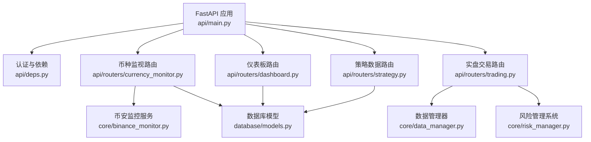
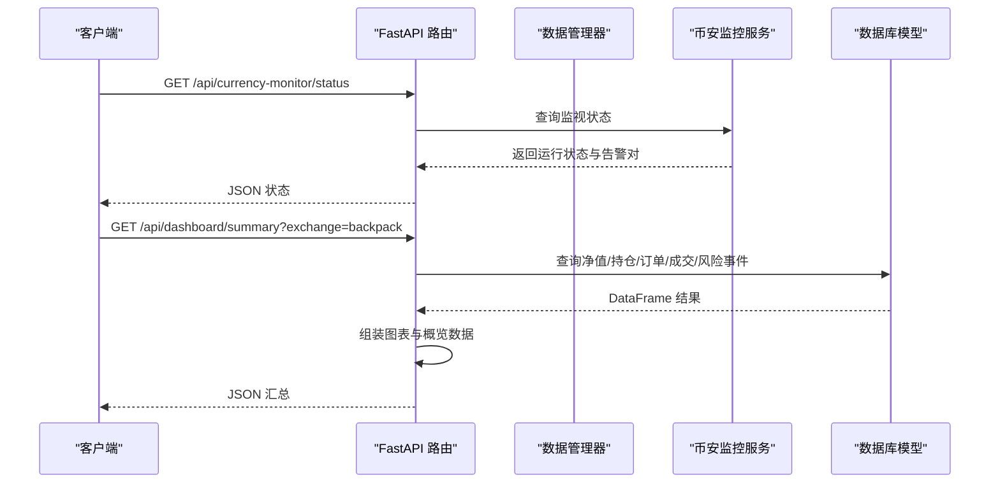
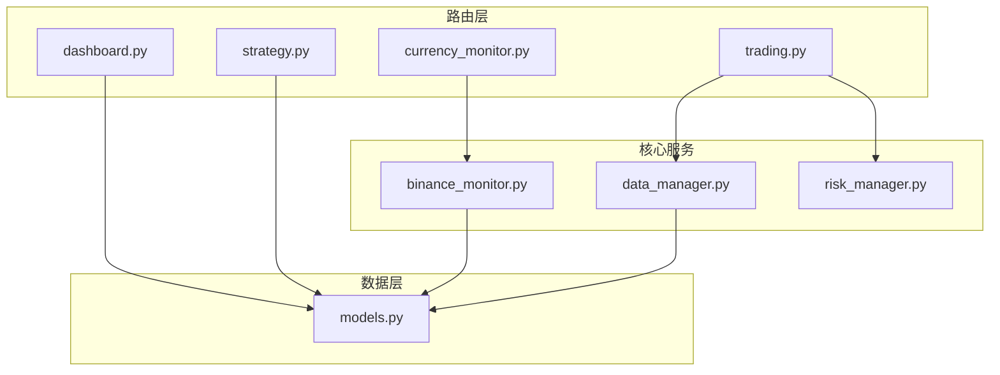

# 数据监控API

<cite>
**本文档引用的文件**
- [api/main.py](file://backpack_quant_trading/api/main.py)
- [api/routers/currency_monitor.py](file://backpack_quant_trading/api/routers/currency_monitor.py)
- [api/routers/dashboard.py](file://backpack_quant_trading/api/routers/dashboard.py)
- [api/routers/trading.py](file://backpack_quant_trading/api/routers/trading.py)
- [api/routers/strategy.py](file://backpack_quant_trading/api/routers/strategy.py)
- [api/deps.py](file://backpack_quant_trading/api/deps.py)
- [core/data_manager.py](file://backpack_quant_trading/core/data_manager.py)
- [core/binance_monitor.py](file://backpack_quant_trading/core/binance_monitor.py)
- [core/risk_manager.py](file://backpack_quant_trading/core/risk_manager.py)
- [database/models.py](file://backpack_quant_trading/database/models.py)
- [docs/DATA_SOURCE_AND_CACHE.md](file://backpack_quant_trading/docs/DATA_SOURCE_AND_CACHE.md)
</cite>

## 目录
1. [简介](#简介)
2. [项目结构](#项目结构)
3. [核心组件](#核心组件)
4. [架构总览](#架构总览)
5. [详细组件分析](#详细组件分析)
6. [依赖关系分析](#依赖关系分析)
7. [性能考虑](#性能考虑)
8. [故障排查指南](#故障排查指南)
9. [结论](#结论)
10. [附录](#附录)

## 简介
本文件为数据监控API的权威文档，覆盖实时数据获取、历史数据查询、图表数据生成、系统状态监控、风险监控与告警机制。文档面向前后端开发者与运维人员，提供HTTP接口定义、数据模型、时间范围与粒度参数、过滤条件、缓存策略、WebSocket连接管理与实时推送、性能指标统计与分页处理等。

## 项目结构
后端采用FastAPI框架，统一在主应用中注册各模块路由，核心监控能力由币安监控服务、数据管理器、风险管理系统与数据库模型支撑。

**图示来源**
- [api/main.py:1-98](file://backpack_quant_trading/api/main.py#L1-L98)
- [api/routers/currency_monitor.py:1-243](file://backpack_quant_trading/api/routers/currency_monitor.py#L1-L243)
- [api/routers/dashboard.py:1-131](file://backpack_quant_trading/api/routers/dashboard.py#L1-L131)
- [api/routers/trading.py:1-561](file://backpack_quant_trading/api/routers/trading.py#L1-L561)
- [api/routers/strategy.py:1-800](file://backpack_quant_trading/api/routers/strategy.py#L1-L800)
- [core/binance_monitor.py:1-817](file://backpack_quant_trading/core/binance_monitor.py#L1-L817)
- [core/data_manager.py:1-518](file://backpack_quant_trading/core/data_manager.py#L1-L518)
- [core/risk_manager.py:1-566](file://backpack_quant_trading/core/risk_manager.py#L1-L566)
- [database/models.py:1-721](file://backpack_quant_trading/database/models.py#L1-L721)

**章节来源**
- [api/main.py:1-98](file://backpack_quant_trading/api/main.py#L1-L98)

## 核心组件
- 币种监视与预警：支持按币种与K线级别组合监控，提供1分钟预警与全局异动告警，具备用户停止标记与DB配置恢复能力。
- 数据管理与缓存：提供历史K线获取、实时K线增量缓存、技术指标计算、多标的关联分析与缓存清理。
- 仪表板与系统状态：聚合组合净值、持仓、订单、成交与风险事件，支持多交易所源切换。
- 风险监控与告警：基于VaR、压力测试与日度指标的综合风险评分，支持数据库持久化风险事件。
- 实盘交易与实例管理：支持多平台实例生命周期管理、Webhook与子进程模式、日志采集与实时状态查询。

**章节来源**
- [core/binance_monitor.py:1-817](file://backpack_quant_trading/core/binance_monitor.py#L1-L817)
- [core/data_manager.py:1-518](file://backpack_quant_trading/core/data_manager.py#L1-L518)
- [api/routers/dashboard.py:1-131](file://backpack_quant_trading/api/routers/dashboard.py#L1-L131)
- [core/risk_manager.py:1-566](file://backpack_quant_trading/core/risk_manager.py#L1-L566)
- [api/routers/trading.py:1-561](file://backpack_quant_trading/api/routers/trading.py#L1-L561)

## 架构总览
数据监控API通过FastAPI统一入口，路由到币种监视、仪表板、交易与策略模块。数据层由币安K线、本地缓存与数据库组成；风险层通过风险管理系统进行VaR与压力测试；实时数据通过WebSocket与REST API双通道保障。

**图示来源**
- [api/routers/currency_monitor.py:56-86](file://backpack_quant_trading/api/routers/currency_monitor.py#L56-L86)
- [api/routers/dashboard.py:26-130](file://backpack_quant_trading/api/routers/dashboard.py#L26-L130)
- [core/binance_monitor.py:658-792](file://backpack_quant_trading/core/binance_monitor.py#L658-L792)

## 详细组件分析

### 币种监视与预警接口
- 接口：GET /api/currency-monitor/status  
  功能：查询全局共享的币种监视状态，支持用户主动停止标记与DB配置恢复。  
  请求参数：无  
  响应字段：running、pairs、alerted（若有）  
  特殊行为：若用户标记停止，返回空对列表且不再从DB恢复。

- 接口：POST /api/currency-monitor/start  
  功能：启动币种监视，合并已有配对，支持多币种与多K线级别组合。  
  请求体字段：symbols（数组）、timeframes（数组，默认["1小时"]）、dingtalk_webhook（可选）  
  响应字段：message、running  

- 接口：POST /api/currency-monitor/stop  
  功能：停止全部监视，清除DB配置与恢复标记。  
  响应字段：message、running  

- 接口：POST /api/currency-monitor/remove-pair  
  功能：移除单个监视对。  
  请求体字段：symbol、timeframe  
  响应字段：message  

- 接口：GET /api/currency-monitor/minute-alert/status  
  功能：查询1分钟预警状态（波动/量能/订单簿墙）。  
  响应字段：running、symbols、interval、阈值参数等  

- 接口：POST /api/currency-monitor/minute-alert/start  
  功能：启动1分钟预警。  
  请求体字段：symbols（数组）、interval、vol_pct_threshold、volume_mult_threshold、ob_notional_threshold、ob_distance_pct、depth_levels、cooldown_sec  
  响应字段：message、running  

- 接口：POST /api/currency-monitor/minute-alert/stop  
  功能：停止1分钟预警。  
  响应字段：message、running  

- 时间范围与粒度
  - 时间范围：通过DB配置恢复，启动时合并当前运行对与请求对，去重后生效。
  - 粒度映射：页面选项映射至币安interval（如"1小时"->"1h"）。
  - 1分钟预警：按interval轮询，支持冷却与订单簿墙即时推送。

- 过滤条件
  - 波动率阈值：vol_pct_threshold（百分比）
  - 成交量倍数：volume_mult_threshold
  - 订单簿大额挂单：ob_notional_threshold、ob_distance_pct、depth_levels
  - 冷却时间：cooldown_sec（避免刷屏）

- 告警机制
  - 全局异动：MACD金叉死叉结合连续阳K与ETH相对强度判定，10分钟内变红提示。
  - 1分钟预警：波动、放量、订单簿墙分别冷却推送，专用Webhook。

**章节来源**
- [api/routers/currency_monitor.py:24-243](file://backpack_quant_trading/api/routers/currency_monitor.py#L24-L243)
- [core/binance_monitor.py:32-57](file://backpack_quant_trading/core/binance_monitor.py#L32-L57)
- [core/binance_monitor.py:231-315](file://backpack_quant_trading/core/binance_monitor.py#L231-L315)
- [core/binance_monitor.py:658-792](file://backpack_quant_trading/core/binance_monitor.py#L658-L792)

### 仪表板与系统状态接口
- 接口：GET /api/dashboard/summary  
  功能：组合概览、净值曲线、持仓、订单、成交、风险事件聚合。  
  请求参数：exchange（默认backpack，可选backpack/deepcoin/ostium等）  
  响应字段：summary（净值、现金、当日盈亏、当日收益）、chart（时间序列净值）、positions、orders、trades、risks  
  数据来源：PortfolioHistory、positions、orders、trades、risk_events表，按source过滤。

- 数据模型要点
  - 组合净值：portfolio_history（timestamp、portfolio_value、cash_balance、position_value、daily_pnl、daily_return）
  - 持仓：positions（symbol、side、quantity、entry_price、current_price、unrealized_pnl等）
  - 订单：orders（order_id、symbol、side、quantity、price、status等）
  - 成交：trades（trade_id、order_id、symbol、side、quantity、price、commission等）
  - 风险事件：risk_events（event_type、severity、description、affected_symbols）

- 分页与排序
  - 最近持仓：按closed_at为空过滤，取最近记录
  - 最近订单/成交：按创建时间倒序，限制数量
  - 风险事件：按创建时间倒序，限制数量

**章节来源**
- [api/routers/dashboard.py:26-130](file://backpack_quant_trading/api/routers/dashboard.py#L26-L130)
- [database/models.py:45-226](file://backpack_quant_trading/database/models.py#L45-L226)

### 实盘交易与实例管理接口
- 接口：GET /api/trading/instances  
  功能：查询当前用户运行中的实盘实例，支持Webhook与子进程两种模式的实例恢复。  
  响应字段：instances（id、pid、platform、strategy_name、symbol、balance、status等）

- 接口：DELETE /api/trading/instances/{instance_id}  
  功能：停止指定实例，Webhook模式注销，子进程模式杀进程并清理余额缓存。

- 接口：GET /api/trading/logs  
  功能：获取实时日志（最近150行），聚合Webhook、实盘与策略日志。

- 实时数据与WebSocket
  - WebSocket优先：网格与实盘引擎均支持WebSocket实时数据流，断线自动重连。
  - REST API备用：2秒轮询，避免429限流。
  - 流订阅：支持私有流与公共流分离，回调异步执行。

- 实例生命周期
  - Webhook模式：通过端口注册/注销实例，支持balance查询同步。
  - 子进程模式：通过live_pids.json与live_balances.json维护PID与余额，停止时清理。

**章节来源**
- [api/routers/trading.py:105-200](file://backpack_quant_trading/api/routers/trading.py#L105-L200)
- [api/routers/trading.py:465-524](file://backpack_quant_trading/api/routers/trading.py#L465-L524)
- [api/routers/trading.py:527-561](file://backpack_quant_trading/api/routers/trading.py#L527-L561)
- [strategy/grid_strategy.py:532-579](file://backpack_quant_trading/strategy/grid_strategy.py#L532-L579)
- [engine/live_trading.py:1579-1600](file://backpack_quant_trading/engine/live_trading.py#L1579-L1600)

### 历史数据查询与图表数据接口
- 接口：GET /api/strategy/eth-2h/klines  
  功能：获取ETH 2H K线（策略专用表），按时间升序返回。  
  响应模型：KlinePoint（timestamp、open、high、low、close、volume）

- 接口：GET /api/strategy/eth-2h/trades  
  功能：获取ETH 2H回测交易明细（策略专用表），按时间与编号升序。  
  响应模型：BacktestTradeOut（trade_no、trade_type、signal、trade_time、price、position_qty、position_value、pnl、pnl_pct、runup、runup_pct、drawdown、drawdown_pct、cum_pnl、cum_pnl_pct）

- 接口：GET /api/strategy/eth-2h/overview  
  功能：计算策略总体表现（总收益、最大回撤、胜率、盈亏比、买入持有收益、年化超额收益等）。  
  响应模型：StrategyOverview（strategy_name、symbol、timeframe、total_return_pct、strategy_profit、max_drawdown_pct、win_rate_pct、profit_factor、buy_hold_return_pct、buy_hold_profit、edge_return_pct、annual_excess_return_pct、total_trades、start_date、end_date）

- 历史数据同步
  - POST /api/strategy/eth-2h/sync-klines：从币安按起始时间增量同步K线，避免重复插入。
  - CSV导入：支持从本地CSV导入回测交易与K线，策略表自动建立。

- 图表数据生成
  - K线：按时间升序排列，用于前端蜡烛图渲染。
  - 回测指标：基于交易明细计算累计P&L、回撤、胜率等，用于折线图与统计卡片。

**章节来源**
- [api/routers/strategy.py:328-489](file://backpack_quant_trading/api/routers/strategy.py#L328-L489)
- [api/routers/strategy.py:582-651](file://backpack_quant_trading/api/routers/strategy.py#L582-L651)
- [api/routers/strategy.py:252-326](file://backpack_quant_trading/api/routers/strategy.py#L252-L326)

### 数据管理与缓存策略
- 历史数据获取
  - fetch_historical_data：支持回测模式与实盘模式，实盘模式通过API客户端获取并缓存。
  - 时间范围校验：开始时间不得晚于结束时间，超过一年范围给出警告。
  - 数据清洗：去重、数值转换、高低价约束、成交量非负过滤。

- 实时数据与缓存
  - add_kline_data：异步接收实时K线，按symbol_interval_live缓存，支持毫秒/秒时间戳与UTC转北京时间。
  - fetch_recent_data：返回最近limit条K线，用于图表实时展示。
  - 缓存配置：最大缓存条数、TTL、最后更新时间，定期清理过期缓存。
  - 文件落盘：live模式下将缓存写入CSV，实现多进程共享。

- 技术指标
  - MA5/20/50、布林带、RSI、MACD、成交量均线、ATR、波动率、ZScore等。

- 数据源与缓存增量方案
  - 文档说明A股K线数据源选型与缓存增量策略，适用于全市场按日打分与TopN筛选场景。

**章节来源**
- [core/data_manager.py:114-167](file://backpack_quant_trading/core/data_manager.py#L114-L167)
- [core/data_manager.py:169-290](file://backpack_quant_trading/core/data_manager.py#L169-L290)
- [core/data_manager.py:302-325](file://backpack_quant_trading/core/data_manager.py#L302-L325)
- [core/data_manager.py:327-351](file://backpack_quant_trading/core/data_manager.py#L327-L351)
- [core/data_manager.py:405-446](file://backpack_quant_trading/core/data_manager.py#L405-L446)
- [docs/DATA_SOURCE_AND_CACHE.md:1-71](file://backpack_quant_trading/docs/DATA_SOURCE_AND_CACHE.md#L1-L71)

### 风险监控与告警
- 风险指标
  - 日度亏损限制、最大回撤限制、当前回撤、日度交易次数与成交量、净/总敞口。
- VaR计算
  - 历史法、参数法、蒙特卡洛三种方法，支持置信度与持有期。
- 压力测试
  - 默认情景：市场崩盘、流动性危机、单币种剧烈波动、监管黑天鹅，输出影响程度与恢复估计。
- 风险报告
  - 综合评分与风险等级，生成风控建议。

- 告警持久化
  - 风险事件入库（event_type、severity、description、affected_symbols），支持高风险事件标记。

**章节来源**
- [core/risk_manager.py:48-330](file://backpack_quant_trading/core/risk_manager.py#L48-L330)
- [core/risk_manager.py:331-416](file://backpack_quant_trading/core/risk_manager.py#L331-L416)
- [core/risk_manager.py:418-466](file://backpack_quant_trading/core/risk_manager.py#L418-L466)
- [core/risk_manager.py:503-562](file://backpack_quant_trading/core/risk_manager.py#L503-L562)
- [database/models.py:192-207](file://backpack_quant_trading/database/models.py#L192-L207)

## 依赖关系分析

**图示来源**
- [api/routers/currency_monitor.py:1-243](file://backpack_quant_trading/api/routers/currency_monitor.py#L1-L243)
- [api/routers/dashboard.py:1-131](file://backpack_quant_trading/api/routers/dashboard.py#L1-L131)
- [api/routers/trading.py:1-561](file://backpack_quant_trading/api/routers/trading.py#L1-L561)
- [api/routers/strategy.py:1-800](file://backpack_quant_trading/api/routers/strategy.py#L1-L800)
- [core/binance_monitor.py:1-817](file://backpack_quant_trading/core/binance_monitor.py#L1-L817)
- [core/data_manager.py:1-518](file://backpack_quant_trading/core/data_manager.py#L1-L518)
- [core/risk_manager.py:1-566](file://backpack_quant_trading/core/risk_manager.py#L1-L566)
- [database/models.py:1-721](file://backpack_quant_trading/database/models.py#L1-L721)

**章节来源**
- [api/main.py:37-48](file://backpack_quant_trading/api/main.py#L37-L48)

## 性能考虑
- 缓存策略
  - 类级缓存共享，TTL与最大容量控制，定期清理过期键。
  - 实时K线按symbol_interval_live命名空间缓存，避免重复请求与数据冗余。
- I/O与并发
  - 异步添加实时K线，避免阻塞主线程。
  - WebSocket优先，REST API轮询作为降级，减少429限流风险。
- 数据库
  - 多索引优化查询（symbol、timestamp、source、status等），批量写入与去重插入。
- 指标计算
  - 滚动窗口与向量化计算，避免逐行遍历；指标计算后统一入库。

[本节为通用指导，无需具体文件引用]

## 故障排查指南
- 认证与依赖
  - 未登录：require_user抛出401，检查Bearer Token或Cookie。
  - JWT解码失败：确认密钥与算法配置正确。
- 币种监视
  - 启动失败：检查symbols与timeframes必填，确认币安API可达。
  - 状态异常：检查用户停止标记与DB配置恢复逻辑。
- 实盘交易
  - Webhook未启动：检查端口占用与进程日志；实例注册失败时查看超时与网络。
  - 子进程实例：检查live_pids.json与live_balances.json，确认PID存在与余额同步。
- 数据与缓存
  - 历史数据为空：检查时间范围与API限流；回测模式下确认模拟数据生成。
  - 实时K线不更新：检查add_kline_data时间戳转换与缓存键命名。
- 风险监控
  - VaR计算不足：确认历史数据长度≥30；压力测试场景缺失时使用默认情景。
  - 风险事件未入库：检查数据库连接与异常捕获。

**章节来源**
- [api/deps.py:69-73](file://backpack_quant_trading/api/deps.py#L69-L73)
- [api/routers/trading.py:355-369](file://backpack_quant_trading/api/routers/trading.py#L355-L369)
- [core/data_manager.py:169-290](file://backpack_quant_trading/core/data_manager.py#L169-L290)
- [core/risk_manager.py:331-416](file://backpack_quant_trading/core/risk_manager.py#L331-L416)

## 结论
本数据监控API以FastAPI为核心，整合币安监控、数据缓存、风险评估与仪表板展示，提供从实时到历史、从指标到告警的全栈能力。通过合理的缓存策略、WebSocket与REST双通道、完善的数据库模型与风险体系，满足高频交易与量化回测场景下的数据需求。

[本节为总结，无需具体文件引用]

## 附录

### 接口一览与请求示例

- 币种监视
  - GET /api/currency-monitor/status  
    示例：curl -H "Authorization: Bearer <token>" http://localhost:8000/api/currency-monitor/status
  - POST /api/currency-monitor/start  
    请求体：{"symbols": ["ETHUSDT","BTCUSDT"],"timeframes": ["1小时","2小时"]}
  - POST /api/currency-monitor/stop  
    请求体：空
  - POST /api/currency-monitor/remove-pair  
    请求体：{"symbol":"ETHUSDT","timeframe":"1小时"}
  - GET /api/currency-monitor/minute-alert/status  
    示例：curl -H "Authorization: Bearer <token>" http://localhost:8000/api/currency-monitor/minute-alert/status
  - POST /api/currency-monitor/minute-alert/start  
    请求体：{"symbols": ["ETHUSDT"],"interval":"1m","vol_pct_threshold":5.0,"volume_mult_threshold":20.0,"ob_notional_threshold":200000.0,"ob_distance_pct":0.003,"depth_levels":50,"cooldown_sec":300}
  - POST /api/currency-monitor/minute-alert/stop  
    请求体：空

- 仪表板
  - GET /api/dashboard/summary?exchange=backpack  
    示例：curl -H "Authorization: Bearer <token>" "http://localhost:8000/api/dashboard/summary?exchange=deepcoin"

- 实盘交易
  - GET /api/trading/instances  
    示例：curl -H "Authorization: Bearer <token>" http://localhost:8000/api/trading/instances
  - DELETE /api/trading/instances/{instance_id}  
    示例：curl -X DELETE -H "Authorization: Bearer <token>" http://localhost:8000/api/trading/instances/hl_123456
  - GET /api/trading/logs  
    示例：curl -H "Authorization: Bearer <token>" http://localhost:8000/api/trading/logs

- 策略数据
  - GET /api/strategy/eth-2h/klines  
    示例：curl -H "Authorization: Bearer <token>" http://localhost:8000/api/strategy/eth-2h/klines
  - GET /api/strategy/eth-2h/trades  
    示例：curl -H "Authorization: Bearer <token>" http://localhost:8000/api/strategy/eth-2h/trades
  - GET /api/strategy/eth-2h/overview  
    示例：curl -H "Authorization: Bearer <token>" http://localhost:8000/api/strategy/eth-2h/overview
  - POST /api/strategy/eth-2h/sync-klines  
    示例：curl -X POST -H "Authorization: Bearer <token>" http://localhost:8000/api/strategy/eth-2h/sync-klines

**章节来源**
- [api/routers/currency_monitor.py:24-243](file://backpack_quant_trading/api/routers/currency_monitor.py#L24-L243)
- [api/routers/dashboard.py:26-130](file://backpack_quant_trading/api/routers/dashboard.py#L26-L130)
- [api/routers/trading.py:105-200](file://backpack_quant_trading/api/routers/trading.py#L105-L200)
- [api/routers/strategy.py:328-489](file://backpack_quant_trading/api/routers/strategy.py#L328-L489)

### 数据模型与字段说明

- 市场数据表（market_data）
  - 字段：symbol、source、timestamp、open、high、low、close、volume、created_at
  - 索引：(symbol, timestamp, source)

- 组合历史净值表（portfolio_history）
  - 字段：timestamp、portfolio_value、cash_balance、position_value、daily_pnl、daily_return
  - 索引：(timestamp, source)

- 持仓表（positions）
  - 字段：symbol、side、quantity、entry_price、current_price、unrealized_pnl、unrealized_pnl_percent、stop_loss、take_profit、opened_at、updated_at、closed_at
  - 索引：(symbol, closed_at, source)

- 订单表（orders）
  - 字段：order_id、client_order_id、source、symbol、side、order_type、quantity、price、status、filled_quantity、filled_price、commission、commission_asset、tx_hash、created_at、updated_at
  - 索引：(symbol, status, source)

- 成交表（trades）
  - 字段：trade_id、order_id、source、symbol、side、quantity、price、commission、commission_asset、is_maker、close_price、pnl_percent、pnl_amount、reason、created_at
  - 索引：(symbol, created_at, source)

- 风险事件表（risk_events）
  - 字段：event_type、severity、description、affected_symbols、created_at
  - 索引：(event_type, source)

**章节来源**
- [database/models.py:45-226](file://backpack_quant_trading/database/models.py#L45-L226)