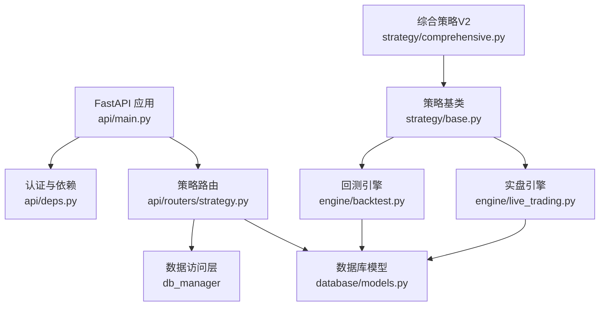
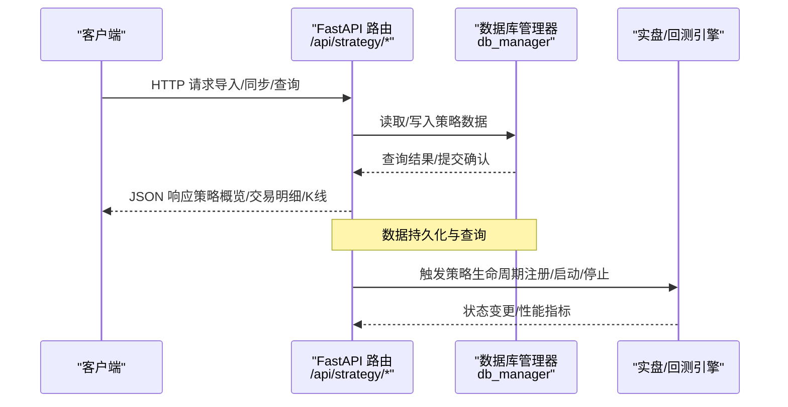
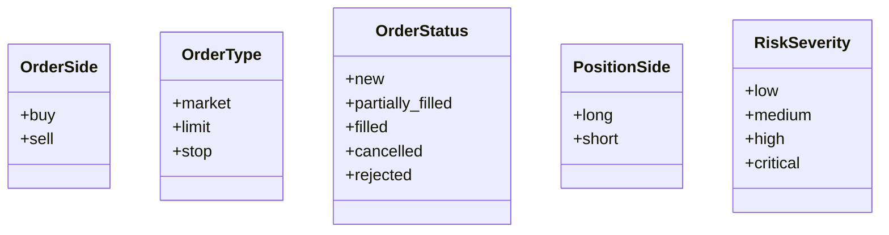
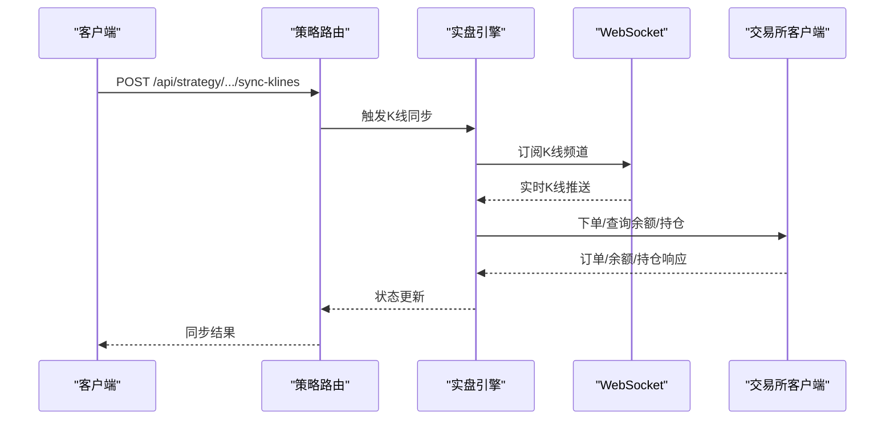
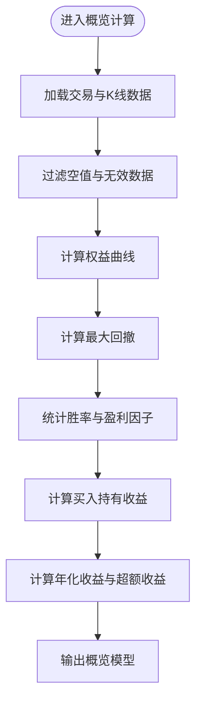
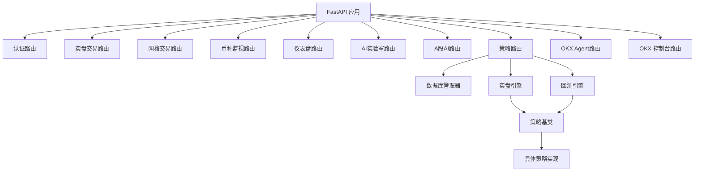

# 策略管理API

<cite>
**本文档引用的文件**
- [api/routers/strategy.py](file://backpack_quant_trading/api/routers/strategy.py)
- [api/main.py](file://backpack_quant_trading/api/main.py)
- [api/deps.py](file://backpack_quant_trading/api/deps.py)
- [database/models.py](file://backpack_quant_trading/database/models.py)
- [engine/live_trading.py](file://backpack_quant_trading/engine/live_trading.py)
- [engine/backtest.py](file://backpack_quant_trading/engine/backtest.py)
- [strategy/base.py](file://backpack_quant_trading/strategy/base.py)
- [strategy/comprehensive.py](file://backpack_quant_trading/strategy/comprehensive.py)
</cite>

## 目录
1. [简介](#简介)
2. [项目结构](#项目结构)
3. [核心组件](#核心组件)
4. [架构总览](#架构总览)
5. [详细组件分析](#详细组件分析)
6. [依赖关系分析](#依赖关系分析)
7. [性能考虑](#性能考虑)
8. [故障排除指南](#故障排除指南)
9. [结论](#结论)

## 简介
本文件为策略管理API的详细技术文档，覆盖策略注册、配置管理、参数调整与性能监控接口的HTTP方法、URL模式、请求/响应模式。文档还阐述策略类型枚举、参数验证规则、配置模板、策略生命周期管理（启用/禁用、参数热更新、状态切换）、异常处理、策略性能指标获取、回测触发与实时监控接口，以及策略间依赖关系管理与冲突解决机制。

## 项目结构
策略管理API位于FastAPI应用中，通过独立路由模块提供策略相关的REST接口。核心模块包括：
- API入口与路由注册：FastAPI应用在主入口中注册策略路由
- 策略路由：提供策略数据导入、同步、查询与概览接口
- 数据库模型：定义策略相关表结构与枚举类型
- 引擎层：实盘交易引擎与回测引擎，承载策略生命周期与性能指标
- 策略基类与具体策略：定义策略抽象接口、信号与参数管理

图表来源
- [api/main.py:36-48](file://backpack_quant_trading/api/main.py#L36-L48)
- [api/routers/strategy.py:22-109](file://backpack_quant_trading/api/routers/strategy.py#L22-L109)
- [database/models.py:267-288](file://backpack_quant_trading/database/models.py#L267-L288)
- [engine/live_trading.py:347-535](file://backpack_quant_trading/engine/live_trading.py#L347-L535)
- [engine/backtest.py:48-66](file://backpack_quant_trading/engine/backtest.py#L48-L66)
- [strategy/base.py:41-91](file://backpack_quant_trading/strategy/base.py#L41-L91)
- [strategy/comprehensive.py:17-91](file://backpack_quant_trading/strategy/comprehensive.py#L17-L91)

章节来源
- [api/main.py:36-48](file://backpack_quant_trading/api/main.py#L36-L48)
- [api/routers/strategy.py:22-109](file://backpack_quant_trading/api/routers/strategy.py#L22-L109)

## 核心组件
- 策略路由模块：提供策略数据导入、K线同步、交易明细与概览查询接口
- 数据库模型：定义策略相关表（策略K线、回测交易、策略性能、用户实例等）与枚举类型（订单方向、类型、状态、仓位方向、风险等级）
- 实盘引擎：负责WebSocket订阅、订单/仓位/余额管理、策略注册与生命周期管理
- 回测引擎：提供回测框架，支持多策略、多标的、多时间周期回测
- 策略基类与具体策略：定义策略抽象接口、信号生成、参数管理与性能指标

章节来源
- [database/models.py:14-43](file://backpack_quant_trading/database/models.py#L14-L43)
- [engine/live_trading.py:23-47](file://backpack_quant_trading/engine/live_trading.py#L23-L47)
- [engine/backtest.py:16-46](file://backpack_quant_trading/engine/backtest.py#L16-L46)
- [strategy/base.py:41-91](file://backpack_quant_trading/strategy/base.py#L41-L91)

## 架构总览
策略管理API采用分层架构：
- 表现层：FastAPI路由，负责HTTP请求解析与响应序列化
- 业务层：策略路由封装业务逻辑，调用数据库管理器进行数据持久化
- 数据访问层：数据库管理器提供统一的ORM接口与事务管理
- 引擎层：实盘与回测引擎负责策略生命周期、信号执行与性能评估
- 策略层：策略基类与具体策略实现交易逻辑与参数管理

图表来源
- [api/routers/strategy.py:180-244](file://backpack_quant_trading/api/routers/strategy.py#L180-L244)
- [database/models.py:267-288](file://backpack_quant_trading/database/models.py#L267-L288)
- [engine/live_trading.py:536-567](file://backpack_quant_trading/engine/live_trading.py#L536-L567)

## 详细组件分析

### 策略路由与接口定义
策略路由模块提供以下接口：
- 导入与同步
  - POST /api/strategy/eth-2h/import-csv：导入ETH 2H回测CSV至数据库
  - POST /api/strategy/eth-2h/import-trades：强制重新导入HYPE交易CSV
  - POST /api/strategy/eth-2h/sync-klines：同步ETH 2H K线至MySQL
  - POST /api/strategy/eth-only-2h/import-csv：导入ETH独立策略回测CSV
  - POST /api/strategy/eth-only-2h/sync-klines：同步ETH独立策略K线
  - POST /api/strategy/paxg-2h/import-klines：导入PAXG 2H K线CSV
  - POST /api/strategy/paxg-2h/import-trades：导入PAXG波动策略回测CSV
  - POST /api/strategy/nas100-2h/import-klines：导入NAS100 2H K线CSV
  - POST /api/strategy/nas100-2h/import-trades：导入NAS100趋势追踪CSV
- 查询
  - GET /api/strategy/eth-2h/klines：获取ETH 2H K线
  - GET /api/strategy/eth-2h/trades：获取ETH 2H回测交易明细
  - GET /api/strategy/eth-2h/overview：获取ETH 2H策略总体表现
  - GET /api/strategy/eth-only-2h/klines：获取ETH独立策略K线
  - GET /api/strategy/eth-only-2h/trades：获取ETH独立策略交易明细
  - GET /api/strategy/eth-only-2h/overview：获取ETH独立策略总体表现
  - GET /api/strategy/paxg-2h/klines：获取PAXG 2H K线
  - GET /api/strategy/paxg-2h/trades：获取PAXG 2H回测交易明细
  - GET /api/strategy/paxg-2h/overview：获取PAXG 2H策略总体表现
  - GET /api/strategy/nas100-2h/klines：获取NAS100 2H K线
  - GET /api/strategy/nas100-2h/trades：获取NAS100 2H回测交易明细
  - GET /api/strategy/nas100-2h/overview：获取NAS100 2H策略总体表现

请求/响应模式
- 导入接口：请求体为空，响应为包含导入记录数的对象
- 同步接口：请求体为空，响应为包含新增条数的对象
- 查询接口：响应为对应的模型列表或概览模型

章节来源
- [api/routers/strategy.py:180-244](file://backpack_quant_trading/api/routers/strategy.py#L180-L244)
- [api/routers/strategy.py:252-325](file://backpack_quant_trading/api/routers/strategy.py#L252-L325)
- [api/routers/strategy.py:328-390](file://backpack_quant_trading/api/routers/strategy.py#L328-L390)
- [api/routers/strategy.py:514-552](file://backpack_quant_trading/api/routers/strategy.py#L514-L552)
- [api/routers/strategy.py:597-651](file://backpack_quant_trading/api/routers/strategy.py#L597-L651)
- [api/routers/strategy.py:722-776](file://backpack_quant_trading/api/routers/strategy.py#L722-L776)
- [api/routers/strategy.py:779-850](file://backpack_quant_trading/api/routers/strategy.py#L779-L850)
- [api/routers/strategy.py:853-919](file://backpack_quant_trading/api/routers/strategy.py#L853-L919)
- [api/routers/strategy.py:1065-1118](file://backpack_quant_trading/api/routers/strategy.py#L1065-L1118)
- [api/routers/strategy.py:1121-1192](file://backpack_quant_trading/api/routers/strategy.py#L1121-L1192)
- [api/routers/strategy.py:1195-1260](file://backpack_quant_trading/api/routers/strategy.py#L1195-L1260)

### 策略类型与枚举
策略类型与相关枚举定义如下：
- 订单方向：buy、sell
- 订单类型：market、limit、stop
- 订单状态：new、partially_filled、filled、cancelled、rejected
- 仓位方向：long、short
- 风险等级：low、medium、high、critical

这些枚举用于实盘与回测引擎中的订单、仓位与风险事件管理。

图表来源
- [database/models.py:14-43](file://backpack_quant_trading/database/models.py#L14-L43)

章节来源
- [database/models.py:14-43](file://backpack_quant_trading/database/models.py#L14-L43)

### 参数验证规则与配置模板
- 参数验证规则
  - 导入CSV接口：校验CSV文件是否存在；对字段进行重命名与类型转换；缺失字段使用默认值或0填充；时间字段支持多种格式解析
  - 同步K线接口：校验最后一条K线时间戳；从最后时间点续拉；避免重复插入；批量写入数据库
  - 查询接口：自动确保数据已导入；按时间顺序排序；缺失字段返回空值或0
- 配置模板
  - 策略配置表（strategy_config）：包含策略名称、模块、类名、默认参数JSON、启用状态
  - 用户实例表（user_instances）：按用户隔离的实盘/网格/币种监视配置，存储非敏感元数据

章节来源
- [api/routers/strategy.py:180-244](file://backpack_quant_trading/api/routers/strategy.py#L180-L244)
- [api/routers/strategy.py:252-325](file://backpack_quant_trading/api/routers/strategy.py#L252-L325)
- [database/models.py:254-266](file://backpack_quant_trading/database/models.py#L254-L266)
- [database/models.py:239-252](file://backpack_quant_trading/database/models.py#L239-L252)

### 策略生命周期管理
- 策略注册
  - 实盘引擎支持注册策略，维护策略字典与交易对列表；建立Backpack与用户格式的symbol映射
- 启动/停止
  - 启动时连接WebSocket订阅K线；启动订单、价格、仓位、快照与心跳循环；停止时取消未完成订单并关闭连接
- 参数热更新
  - 策略基类提供set_parameters方法，支持运行时更新参数并记录日志
- 状态切换
  - 引擎内部维护running标志；通过锁保证并发安全；支持回调通知订单/仓位/成交状态变化

图表来源
- [engine/live_trading.py:536-567](file://backpack_quant_trading/engine/live_trading.py#L536-L567)
- [engine/live_trading.py:126-345](file://backpack_quant_trading/engine/live_trading.py#L126-L345)

章节来源
- [engine/live_trading.py:588-607](file://backpack_quant_trading/engine/live_trading.py#L588-L607)
- [engine/live_trading.py:536-567](file://backpack_quant_trading/engine/live_trading.py#L536-L567)
- [strategy/base.py:170-174](file://backpack_quant_trading/strategy/base.py#L170-L174)

### 异常处理
- HTTP异常：导入/同步接口在文件不存在或数据获取失败时返回404/500
- 数据库异常：导入接口使用事务回滚，确保数据一致性
- 引擎异常：WebSocket连接失败时指数退避重试；连接关闭时触发重连

章节来源
- [api/routers/strategy.py:182-183](file://backpack_quant_trading/api/routers/strategy.py#L182-L183)
- [api/routers/strategy.py:272-273](file://backpack_quant_trading/api/routers/strategy.py#L272-L273)
- [engine/live_trading.py:153-235](file://backpack_quant_trading/engine/live_trading.py#L153-L235)

### 策略性能指标获取
- 概览接口：计算总收益、最大回撤、胜率、盈利因子、买入持有收益、年化超额收益、总交易数、起止时间等
- 通用计算函数：支持不同策略的出场规则（如纳指策略仅依据信号close判定出场）

图表来源
- [api/routers/strategy.py:392-488](file://backpack_quant_trading/api/routers/strategy.py#L392-L488)
- [api/routers/strategy.py:922-1005](file://backpack_quant_trading/api/routers/strategy.py#L922-L1005)

章节来源
- [api/routers/strategy.py:392-488](file://backpack_quant_trading/api/routers/strategy.py#L392-L488)
- [api/routers/strategy.py:1008-1039](file://backpack_quant_trading/api/routers/strategy.py#L1008-L1039)

### 回测触发与实时监控接口
- 回测接口：通过回测引擎运行策略回测，支持多标的、多周期、多时间窗口
- 实时监控：WebSocket订阅K线与成交数据；引擎定期更新订单/仓位/余额；支持回调通知

章节来源
- [engine/backtest.py:65-187](file://backpack_quant_trading/engine/backtest.py#L65-L187)
- [engine/live_trading.py:558-567](file://backpack_quant_trading/engine/live_trading.py#L558-L567)

### 策略间依赖关系管理与冲突解决
- 依赖关系
  - 实盘引擎通过统一的ExchangeClient抽象接入不同交易所，策略通过该客户端执行下单
  - 策略基类提供信号生成与参数管理，具体策略实现各自逻辑
- 冲突解决
  - 实盘引擎在开仓时检查是否已有同向持仓，避免重复开仓
  - 回测引擎在执行交易时遵循冷静期（平仓后N根K线内不开新仓）以降低过度交易

章节来源
- [engine/live_trading.py:588-607](file://backpack_quant_trading/engine/live_trading.py#L588-L607)
- [engine/backtest.py:173-179](file://backpack_quant_trading/engine/backtest.py#L173-L179)

## 依赖关系分析
策略管理API的依赖关系如下：
- FastAPI应用依赖各路由模块（认证、实盘交易、网格、币种监视、仪表盘、AI实验室、A股AI、策略、OKX Agent、OKX控制台）
- 策略路由依赖数据库管理器与数据访问层
- 实盘/回测引擎依赖策略基类与具体策略实现

图表来源
- [api/main.py:36-48](file://backpack_quant_trading/api/main.py#L36-L48)
- [api/routers/strategy.py:22-109](file://backpack_quant_trading/api/routers/strategy.py#L22-L109)
- [engine/live_trading.py:347-535](file://backpack_quant_trading/engine/live_trading.py#L347-L535)
- [engine/backtest.py:48-66](file://backpack_quant_trading/engine/backtest.py#L48-L66)
- [strategy/base.py:41-91](file://backpack_quant_trading/strategy/base.py#L41-L91)

章节来源
- [api/main.py:36-48](file://backpack_quant_trading/api/main.py#L36-L48)
- [api/routers/strategy.py:22-109](file://backpack_quant_trading/api/routers/strategy.py#L22-L109)

## 性能考虑
- 数据库批量写入：导入CSV时批量插入，减少事务开销
- 缓存与去重：余额查询使用缓存；交易ID去重避免重复插入
- WebSocket重连与指数退避：提升网络不稳定场景下的稳定性
- 回测预热期：跳过前100根K线，确保技术指标充分计算

## 故障排除指南
- 导入CSV失败
  - 检查CSV文件是否存在与编码格式
  - 确认字段映射与时间格式解析
- 同步K线失败
  - 检查最后时间戳与续拉逻辑
  - 确认数据源可用性与网络连接
- WebSocket连接异常
  - 查看重连日志与代理设置
  - 确认订阅频道与交易对格式

章节来源
- [api/routers/strategy.py:182-183](file://backpack_quant_trading/api/routers/strategy.py#L182-L183)
- [api/routers/strategy.py:272-273](file://backpack_quant_trading/api/routers/strategy.py#L272-L273)
- [engine/live_trading.py:153-235](file://backpack_quant_trading/engine/live_trading.py#L153-L235)

## 结论
策略管理API提供了完整的策略数据导入、同步、查询与概览能力，并通过实盘与回测引擎支撑策略生命周期管理。结合参数验证、异常处理与性能优化，系统能够稳定地支持多策略、多标的的量化交易需求。建议在生产环境中进一步完善鉴权与审计日志，确保策略配置与参数变更的可追溯性。