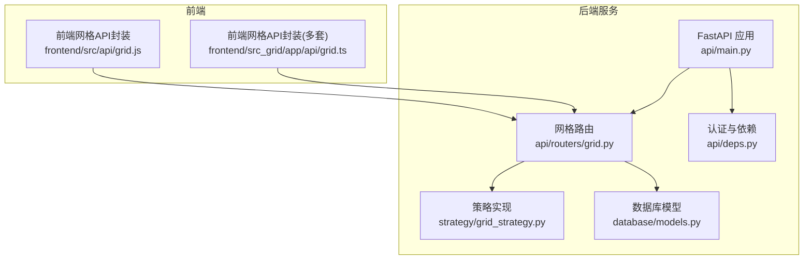
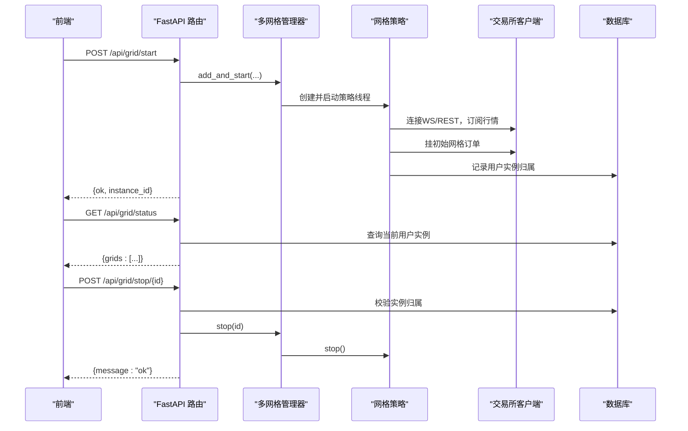
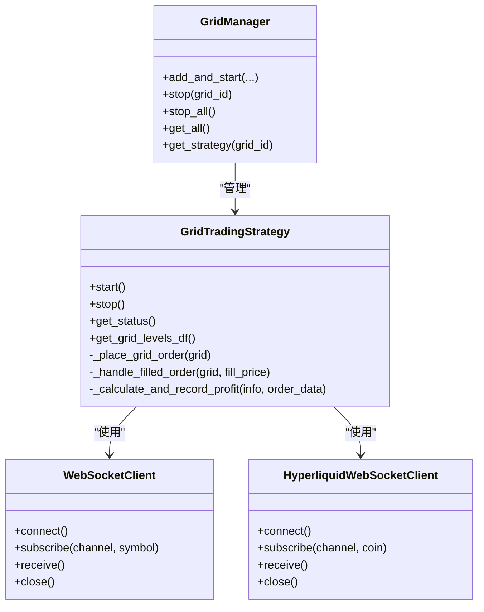

# 网格交易API

<cite>
**本文引用的文件**
- [grid.py](file://backpack_quant_trading/api/routers/grid.py)
- [grid_strategy.py](file://backpack_quant_trading/strategy/grid_strategy.py)
- [main.py](file://backpack_quant_trading/api/main.py)
- [deps.py](file://backpack_quant_trading/api/deps.py)
- [models.py](file://backpack_quant_trading/database/models.py)
- [grid.js](file://backpack_quant_trading/frontend/src/api/grid.js)
- [grid.ts](file://backpack_quant_trading/frontend/src_grid/app/api/grid.ts)
</cite>

## 目录
1. [简介](#简介)
2. [项目结构](#项目结构)
3. [核心组件](#核心组件)
4. [架构总览](#架构总览)
5. [详细组件分析](#详细组件分析)
6. [依赖关系分析](#依赖关系分析)
7. [性能考量](#性能考量)
8. [故障排查指南](#故障排查指南)
9. [结论](#结论)
10. [附录](#附录)

## 简介
本文件为网格交易API的权威技术文档，覆盖网格策略配置、参数调整、订单管理、收益统计、生命周期管理、状态监控、自动再平衡与强制平仓机制，并提供请求/响应模式、参数定义、收益计算方法与性能分析接口说明。目标读者既包括前端/后端开发者，也包括需要理解网格交易工作原理的非技术用户。

## 项目结构
网格交易API位于后端FastAPI应用中，通过路由模块对外暴露HTTP接口；策略核心逻辑在独立的策略模块中实现；数据库模型负责持久化用户实例与订单/成交/持仓等数据；前端提供调用示例与状态展示。

图表来源
- [main.py:14-48](file://backpack_quant_trading/api/main.py#L14-L48)
- [grid.py:39-162](file://backpack_quant_trading/api/routers/grid.py#L39-L162)
- [grid_strategy.py:38-1507](file://backpack_quant_trading/strategy/grid_strategy.py#L38-L1507)
- [models.py:267-721](file://backpack_quant_trading/database/models.py#L267-L721)
- [grid.js:1-8](file://backpack_quant_trading/frontend/src/api/grid.js#L1-L8)
- [grid.ts:1-46](file://backpack_quant_trading/frontend/src_grid/app/api/grid.ts#L1-L46)

章节来源
- [main.py:14-48](file://backpack_quant_trading/api/main.py#L14-L48)
- [grid.py:39-162](file://backpack_quant_trading/api/routers/grid.py#L39-L162)

## 核心组件
- 网格路由与控制器：提供交易对查询、网格状态查询、启动/停止网格等HTTP接口。
- 策略引擎：实现网格生成、订单挂单、成交检测、平仓、统计与风控。
- 多网格管理器：支持同一账户/平台同时运行多个网格实例。
- 数据库模型：持久化用户实例归属、订单、成交、持仓、风险事件与组合净值等。
- 前端API封装：统一调用后端网格接口。

章节来源
- [grid.py:85-162](file://backpack_quant_trading/api/routers/grid.py#L85-L162)
- [grid_strategy.py:38-1507](file://backpack_quant_trading/strategy/grid_strategy.py#L38-L1507)
- [models.py:267-721](file://backpack_quant_trading/database/models.py#L267-L721)

## 架构总览
网格交易API采用“路由层-策略层-数据层”的分层架构。路由层负责HTTP协议与鉴权；策略层负责业务逻辑与风控；数据层负责持久化与查询。

图表来源
- [grid.py:101-161](file://backpack_quant_trading/api/routers/grid.py#L101-L161)
- [grid_strategy.py:1366-1507](file://backpack_quant_trading/strategy/grid_strategy.py#L1366-L1507)
- [models.py:540-566](file://backpack_quant_trading/database/models.py#L540-L566)

## 详细组件分析

### 1) HTTP接口定义与请求/响应模式
- 基础路径：/api/grid
- 鉴权：依赖Bearer Token或Cookie，路由依赖require_user校验登录状态。

接口一览
- GET /symbols
  - 功能：获取可用交易对列表（可扩展）
  - 请求：无
  - 响应：{"symbols": [...]}
  - 示例：GET /api/grid/symbols

- GET /status
  - 功能：返回当前用户运行中的网格实例列表
  - 请求：无（携带认证头）
  - 响应：{"grids": [{"id": "...", "symbol": "...", "grid_mode": "...", "exchange": "...", "running": true/false, "current_price": 0, "total_trades": 0}, ...]}
  - 示例：GET /api/grid/status

- POST /start
  - 功能：启动网格策略
  - 请求体：GridStartRequest（见下节“请求参数定义”）
  - 响应：{"ok": true/false, "instance_id": "..." | "message": "..."}
  - 示例：POST /api/grid/start

- POST /stop/{grid_id}
  - 功能：停止单个网格
  - 请求：无（携带认证头）
  - 响应：{"message":"ok"}
  - 示例：POST /api/grid/stop/inst_1710000000

- POST /stop-all
  - 功能：停止单前用户全部网格
  - 请求：无（携带认证头）
  - 响应：{"message":"ok"}

章节来源
- [grid.py:85-162](file://backpack_quant_trading/api/routers/grid.py#L85-L162)
- [deps.py:69-73](file://backpack_quant_trading/api/deps.py#L69-L73)

### 2) 请求参数定义（POST /start）
- 参数名与含义
  - exchange: 交易所标识，默认"backpack"，支持"backpack"、"deepcoin"、"ostium"、"hyper"、"hip3"、"hip3_testnet"
  - symbol: 交易对，支持简写（如ETH、BTC）或完整格式（如ETH_USDC_PERP、ETH-USDT-SWAP、ETH-PERP）
  - price_lower: 价格下限
  - price_upper: 价格上限
  - grid_count: 网格数量
  - investment_per_grid: 单格投资金额（用于计算每档下单数量）
  - leverage: 杠杆倍数
  - grid_mode: 网格模式，"long_only"（做多网格）、"short_only"（做空网格）、"long_short"（双向网格）
  - api_key/secret_key/passphrase/private_key: 交易所API密钥（可选，若不传则使用配置文件）

- 参数解析与映射
  - 交易对解析：_resolve_symbol函数将简写映射为各交易所标准格式
  - 客户端创建：_create_api_client根据exchange选择对应客户端
  - 实例ID：使用时间戳生成唯一instance_id并持久化到数据库

章节来源
- [grid.py:70-83](file://backpack_quant_trading/api/routers/grid.py#L70-L83)
- [grid.py:11-34](file://backpack_quant_trading/api/routers/grid.py#L11-L34)
- [grid.py:42-67](file://backpack_quant_trading/api/routers/grid.py#L42-L67)
- [grid.py:101-139](file://backpack_quant_trading/api/routers/grid.py#L101-L139)

### 3) 网格策略配置与参数调整
- 网格参数
  - 价格区间：price_upper - price_lower
  - 网格间距：grid_spacing = price_range / grid_count
  - 单档下单数量：quantity = (investment_per_grid * leverage) / price
  - 网格模式：long_only、short_only、long_short
  - 杠杆：leverage影响单档数量与总持仓价值

- 订单管理
  - 初始订单：根据当前价格与模式在区间内挂单
  - 成交检测：轮询或WebSocket订阅行情，检查订单状态
  - 平仓策略：开仓成交后在相邻档挂限价平仓单，平仓成交后补回同价位开仓挂单
  - 撤单：支持取消所有挂单（含平仓单）

- 风险控制
  - 日内最大亏损限制：每日已实现盈亏低于阈值则停止策略
  - 总亏损限制：累计总利润低于投资总额×阈值则停止策略
  - 429限频保护：触发429时熔断等待
  - 冷却期：同一档位短期内避免重复下单

章节来源
- [grid_strategy.py:102-139](file://backpack_quant_trading/strategy/grid_strategy.py#L102-L139)
- [grid_strategy.py:157-177](file://backpack_quant_trading/strategy/grid_strategy.py#L157-L177)
- [grid_strategy.py:374-398](file://backpack_quant_trading/strategy/grid_strategy.py#L374-L398)
- [grid_strategy.py:400-498](file://backpack_quant_trading/strategy/grid_strategy.py#L400-L498)
- [grid_strategy.py:599-754](file://backpack_quant_trading/strategy/grid_strategy.py#L599-L754)
- [grid_strategy.py:755-816](file://backpack_quant_trading/strategy/grid_strategy.py#L755-L816)
- [grid_strategy.py:969-990](file://backpack_quant_trading/strategy/grid_strategy.py#L969-L990)

### 4) 订单执行格式与收益统计
- 订单执行
  - 限价单：LIMIT，价格精度与数量精度按交易所精度动态适配
  - 平仓单：reduce_only=true，挂单在相邻档位
  - 订单ID：优先使用交易所返回的orderId，兼容不同平台字段

- 收益统计
  - 单笔利润：平仓价-开仓价（多单）或开仓价-平仓价（空单）乘以数量
  - 手续费：假设taker费率为0.04%，分别计算开仓/平仓手续费
  - 净利润：毛利-总手续费
  - 累计统计：total_profit、total_fees、peak_profit、max_drawdown、daily_realized_pnl
  - 未实现盈亏：估算值（策略中预留字段）

- 收益计算方法
  - 单格利润（绝对金额）≈ investment_per_grid × leverage × (grid_spacing/price_lower)
  - 单格利润率 ≈ (grid_spacing/price_lower) × leverage - 0.1×leverage（预估双边手续费）

章节来源
- [grid_strategy.py:818-871](file://backpack_quant_trading/strategy/grid_strategy.py#L818-L871)
- [grid_strategy.py:992-1052](file://backpack_quant_trading/strategy/grid_strategy.py#L992-L1052)
- [grid_strategy.py:1054-1080](file://backpack_quant_trading/strategy/grid_strategy.py#L1054-L1080)

### 5) 网格生命周期管理
- 启动流程
  - 解析交易对与客户端
  - 创建策略实例并启动线程
  - 连接WebSocket或降级REST轮询
  - 布置初始网格订单
  - 记录用户实例归属

- 停止流程
  - 取消监控任务
  - 取消所有挂单
  - 平掉所有持仓（若客户端支持）
  - 关闭WebSocket与客户端资源
  - 删除用户实例归属

- 停止策略的触发条件
  - 日内最大亏损限制
  - 总亏损限制
  - 429限频熔断

章节来源
- [grid.py:101-139](file://backpack_quant_trading/api/routers/grid.py#L101-L139)
- [grid_strategy.py:179-280](file://backpack_quant_trading/strategy/grid_strategy.py#L179-L280)
- [grid_strategy.py:282-322](file://backpack_quant_trading/strategy/grid_strategy.py#L282-L322)
- [grid_strategy.py:969-990](file://backpack_quant_trading/strategy/grid_strategy.py#L969-L990)

### 6) 状态监控与自动再平衡
- 状态监控
  - WebSocket优先：实时行情，支持allMids（Hyperliquid）与ticker（Backpack）
  - REST轮询：WebSocket失败时降级
  - 日志输出：每10秒输出最新价格，便于确认连接状态

- 自动再平衡
  - 平仓成交后，自动在同价位补回开仓挂单
  - 对于空档状态的网格档位，按冷却期与当前价格自动补单

- 强制平仓机制
  - 支持按symbol平仓（Hyperliquid）
  - 通过订单缓存pair_id/trade_index进行平仓（Ostium）

章节来源
- [grid_strategy.py:532-597](file://backpack_quant_trading/strategy/grid_strategy.py#L532-L597)
- [grid_strategy.py:324-372](file://backpack_quant_trading/strategy/grid_strategy.py#L324-L372)
- [grid_strategy.py:755-816](file://backpack_quant_trading/strategy/grid_strategy.py#L755-L816)

### 7) 前端调用示例
- JavaScript调用示例（前端封装）
  - getGridSymbols()
  - getGridStatus()
  - startGrid(data)
  - stopGrid(id)
  - stopAllGrids()

- TypeScript调用示例（多套前端）
  - getGridStatus(): Promise<{ grids: GridInstance[] }>
  - StartGridParams：包含exchange、symbol、price_lower、price_upper、grid_count、investment_per_grid、leverage、grid_mode、api_key、secret_key

章节来源
- [grid.js:1-8](file://backpack_quant_trading/frontend/src/api/grid.js#L1-L8)
- [grid.ts:18-29](file://backpack_quant_trading/frontend/src_grid/app/api/grid.ts#L18-L29)
- [grid.ts:33-46](file://backpack_quant_trading/frontend/src_grid/app/api/grid.ts#L33-L46)

### 8) 数据模型与持久化
- 用户实例归属：记录用户与网格实例的绑定关系，用于权限控制与状态查询
- 订单/成交/持仓：保存订单详情、成交记录与持仓状态，支持多平台字段映射
- 风险事件与组合净值：用于风控与业绩归集

章节来源
- [models.py:239-251](file://backpack_quant_trading/database/models.py#L239-L251)
- [models.py:65-151](file://backpack_quant_trading/database/models.py#L65-L151)
- [models.py:498-566](file://backpack_quant_trading/database/models.py#L498-L566)

## 依赖关系分析

图表来源
- [grid_strategy.py:1366-1507](file://backpack_quant_trading/strategy/grid_strategy.py#L1366-L1507)
- [grid_strategy.py:1098-1206](file://backpack_quant_trading/strategy/grid_strategy.py#L1098-L1206)
- [grid_strategy.py:1208-1359](file://backpack_quant_trading/strategy/grid_strategy.py#L1208-L1359)

章节来源
- [grid_strategy.py:1366-1507](file://backpack_quant_trading/strategy/grid_strategy.py#L1366-L1507)

## 性能考量
- WebSocket优先：实时行情降低延迟，提升成交检测效率
- REST轮询降级：网络波动时自动切换，保证稳定性
- 429限频熔断：避免频繁触发限流导致的阻塞
- 线程与事件循环：策略在独立线程中运行，避免阻塞主事件循环
- 精度适配：按交易所精度动态调整价格与数量精度，减少无效订单

[本节为通用指导，无需特定文件来源]

## 故障排查指南
- WebSocket连接失败
  - 现象：日志提示连接失败并降级REST轮询
  - 处理：检查网络代理、防火墙与WS地址；确认交易所WS可用性
- 429限频
  - 现象：下单/撤单/平仓返回429
  - 处理：等待熔断时间（5秒）后重试；适当降低下单频率
- 订单未成交或反复成交
  - 现象：限价单在当前价附近反复成交
  - 处理：确保限价单价格严格高于/低于当前价；检查价格精度
- 平仓失败
  - 现象：平仓单无法成交或无法撤销
  - 处理：使用订单缓存pair_id/trade_index进行平仓；必要时手动清理
- 停止策略后仍有挂单
  - 现象：停止后仍有未成交订单
  - 处理：确认取消逻辑执行；检查客户端是否支持异步撤单

章节来源
- [grid_strategy.py:255-271](file://backpack_quant_trading/strategy/grid_strategy.py#L255-L271)
- [grid_strategy.py:471-497](file://backpack_quant_trading/strategy/grid_strategy.py#L471-L497)
- [grid_strategy.py:925-965](file://backpack_quant_trading/strategy/grid_strategy.py#L925-L965)

## 结论
网格交易API提供了完整的网格策略生命周期管理能力，涵盖参数配置、订单管理、收益统计、风控与状态监控。通过多网格管理器与策略引擎的解耦设计，系统具备良好的扩展性与稳定性。建议在生产环境中结合前端调用示例与数据库模型，完善鉴权、日志与告警体系，确保策略安全稳定运行。

[本节为总结性内容，无需特定文件来源]

## 附录

### A. HTTP接口清单与示例
- GET /api/grid/symbols
  - 响应：{"symbols": ["ETH_USDC_PERP","BTC_USDC_PERP","PAXG_USDC_PERP","SOL_USDC_PERP"]}
- GET /api/grid/status
  - 响应：{"grids": [{"id":"inst_...","symbol":"ETH_USDC_PERP","grid_mode":"long_short","exchange":"backpack","running":true,"current_price":2300.0,"total_trades":120}]}
- POST /api/grid/start
  - 请求体：包含exchange、symbol、price_lower、price_upper、grid_count、investment_per_grid、leverage、grid_mode、api_key、secret_key等
  - 响应：{"ok":true,"instance_id":"inst_1710000000"}
- POST /api/grid/stop/{grid_id}
  - 响应：{"message":"ok"}
- POST /api/grid/stop-all
  - 响应：{"message":"ok"}

章节来源
- [grid.py:85-162](file://backpack_quant_trading/api/routers/grid.py#L85-L162)

### B. 网格参数与收益计算公式
- 网格间距：grid_spacing = (price_upper - price_lower) / grid_count
- 单档下单数量：quantity = (investment_per_grid × leverage) / price
- 单格利润（绝对金额）≈ investment_per_grid × leverage × (grid_spacing/price_lower)
- 单格利润率 ≈ (grid_spacing/price_lower) × leverage - 0.1×leverage（预估双边手续费）

章节来源
- [grid_strategy.py:102-108](file://backpack_quant_trading/strategy/grid_strategy.py#L102-L108)
- [grid_strategy.py:170-175](file://backpack_quant_trading/strategy/grid_strategy.py#L170-L175)
- [grid_strategy.py:992-1052](file://backpack_quant_trading/strategy/grid_strategy.py#L992-L1052)