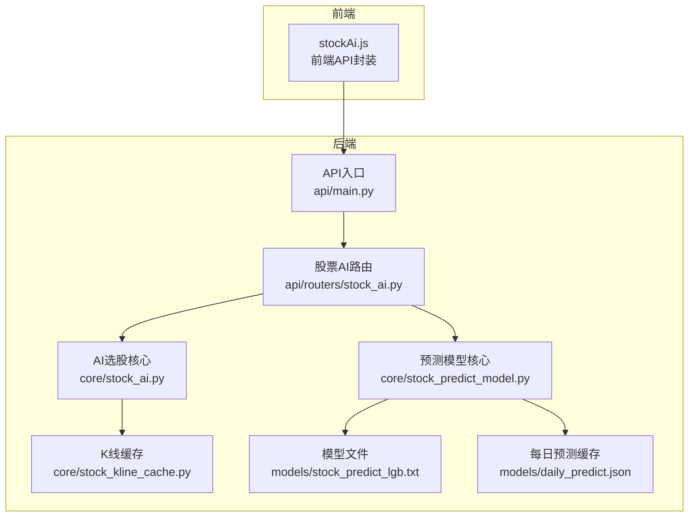
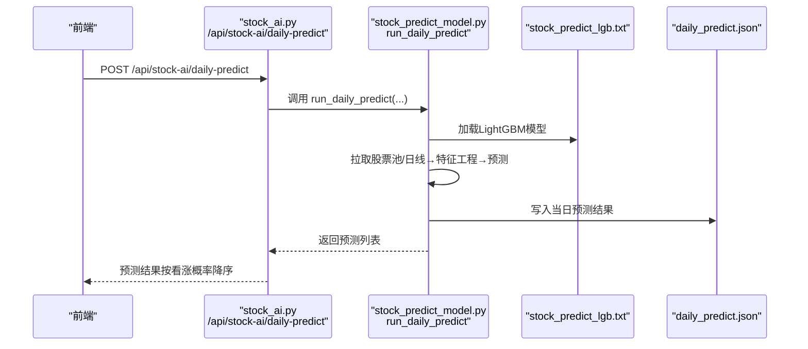
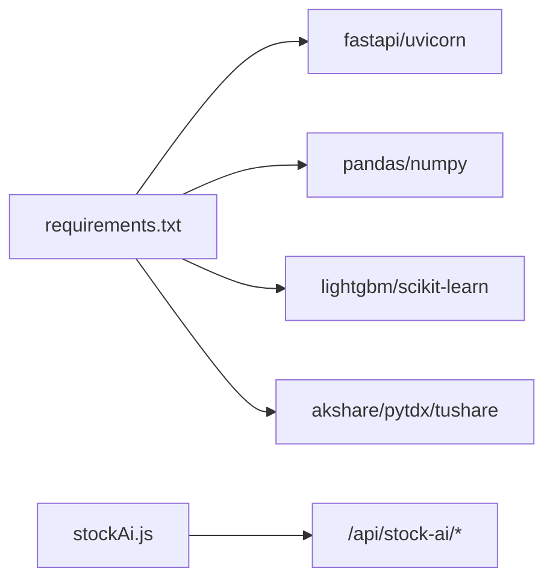

# 股票AI API

<cite>
**本文引用的文件**
- [stock_ai.py](file://backpack_quant_trading/api/routers/stock_ai.py)
- [stock_ai_core.py](file://backpack_quant_trading/core/stock_ai.py)
- [stock_predict_model.py](file://backpack_quant_trading/core/stock_predict_model.py)
- [stock_kline_cache.py](file://backpack_quant_trading/core/stock_kline_cache.py)
- [main.py](file://backpack_quant_trading/api/main.py)
- [stockAi.js](file://backpack_quant_trading/frontend/src/api/stockAi.js)
- [daily_predict.json](file://backpack_quant_trading/models/daily_predict.json)
- [stock_predict_lgb.txt](file://backpack_quant_trading/models/stock_predict_lgb.txt)
- [run_train_stock_model.py](file://backpack_quant_trading/run_train_stock_model.py)
- [requirements.txt](file://backpack_quant_trading/requirements.txt)
</cite>

## 目录
1. [简介](#简介)
2. [项目结构](#项目结构)
3. [核心组件](#核心组件)
4. [架构总览](#架构总览)
5. [详细组件分析](#详细组件分析)
6. [依赖分析](#依赖分析)
7. [性能考量](#性能考量)
8. [故障排查指南](#故障排查指南)
9. [结论](#结论)
10. [附录](#附录)

## 简介
本文件为“股票AI API”的完整技术文档，面向A股市场的AI选股、模型训练、数据预处理与预测结果分析能力，提供HTTP接口定义、请求/响应模式、参数约束与示例，以及特征工程、技术指标计算与结果解释说明。同时覆盖股票池管理、投资组合优化与风险评估的扩展思路，以及数据源接入、模型更新机制与预测准确性监控方案。

## 项目结构
后端基于FastAPI，路由集中在/api/stock-ai命名空间下，核心逻辑位于core目录，前端通过统一的请求封装调用后端接口。

图表来源
- [main.py:36-48](file://backpack_quant_trading/api/main.py#L36-L48)
- [stock_ai.py:22-218](file://backpack_quant_trading/api/routers/stock_ai.py#L22-L218)
- [stock_ai_core.py:626-721](file://backpack_quant_trading/core/stock_ai.py#L626-L721)
- [stock_predict_model.py:340-465](file://backpack_quant_trading/core/stock_predict_model.py#L340-L465)
- [stock_kline_cache.py:82-106](file://backpack_quant_trading/core/stock_kline_cache.py#L82-L106)

章节来源
- [main.py:36-48](file://backpack_quant_trading/api/main.py#L36-L48)
- [stock_ai.py:22-218](file://backpack_quant_trading/api/routers/stock_ai.py#L22-L218)

## 核心组件
- 股票AI路由层：提供板块/行业选项、K线缓存刷新、AI选股、DeepSeek解读、单只股票分析、模型训练与每日预测等接口。
- AI选股核心：实现板块/行业筛选、日线拉取与多指标综合打分、并行评分与缓存感知的全量/抽样打分。
- 预测模型核心：特征工程（收益、波动率、RSI、MACD、KDJ、量比、均线交叉等）、标签构造（N日后是否涨超阈值）、LightGBM训练与推理、每日预测与缓存。
- K线缓存：SQLite本地缓存，支持pytdx/Tushare增量写入，为选股与预测提供高效数据源。
- 前端封装：统一的stockAi.js封装，设置合理超时与默认参数。

章节来源
- [stock_ai.py:22-218](file://backpack_quant_trading/api/routers/stock_ai.py#L22-L218)
- [stock_ai_core.py:626-721](file://backpack_quant_trading/core/stock_ai.py#L626-L721)
- [stock_predict_model.py:340-465](file://backpack_quant_trading/core/stock_predict_model.py#L340-L465)
- [stock_kline_cache.py:82-106](file://backpack_quant_trading/core/stock_kline_cache.py#L82-L106)
- [stockAi.js:1-16](file://backpack_quant_trading/frontend/src/api/stockAi.js#L1-L16)

## 架构总览
以下序列图展示“每日预测”从接口到推理与缓存的关键流程：

图表来源
- [stock_ai.py:202-218](file://backpack_quant_trading/api/routers/stock_ai.py#L202-L218)
- [stock_predict_model.py:340-465](file://backpack_quant_trading/core/stock_predict_model.py#L340-L465)
- [daily_predict.json:1-145](file://backpack_quant_trading/models/daily_predict.json#L1-L145)
- [stock_predict_lgb.txt:1-213](file://backpack_quant_trading/models/stock_predict_lgb.txt#L1-L213)

## 详细组件分析

### 接口总览与规范
- 基础信息
  - 基础URL：/api/stock-ai
  - 鉴权：多数接口需登录（Depends(get_current_user)）
  - 跨域：已在主应用中配置允许前端域名
- 请求/响应模式
  - 成功响应：通常返回JSON对象，包含业务字段与状态标记
  - 异常处理：内部捕获异常并返回200 + error字段，避免5xx
  - 超时控制：前端封装设置了较长超时（毫秒级），适配批量日线拉取场景

章节来源
- [stock_ai.py:34-78](file://backpack_quant_trading/api/routers/stock_ai.py#L34-L78)
- [stock_ai.py:81-122](file://backpack_quant_trading/api/routers/stock_ai.py#L81-L122)
- [stock_ai.py:129-161](file://backpack_quant_trading/api/routers/stock_ai.py#L129-L161)
- [stock_ai.py:173-192](file://backpack_quant_trading/api/routers/stock_ai.py#L173-L192)
- [stock_ai.py:202-218](file://backpack_quant_trading/api/routers/stock_ai.py#L202-L218)
- [stockAi.js:3-16](file://backpack_quant_trading/frontend/src/api/stockAi.js#L3-L16)

### 板块/行业选项接口
- GET /boards
  - 功能：返回板块选项（主板/创业板/科创板/北交所）
  - 响应：{"options": [...]}
  - 失败回退：若数据源不可用，返回默认选项
- GET /industries
  - 功能：返回行业选项（来自akshare行业板块名称）
  - 响应：{"options": [...]}
  - 失败回退：若数据源不可用，返回默认行业列表

章节来源
- [stock_ai.py:34-54](file://backpack_quant_trading/api/routers/stock_ai.py#L34-L54)
- [stock_ai_core.py:81-113](file://backpack_quant_trading/core/stock_ai.py#L81-L113)

### K线缓存刷新接口
- POST /refresh-cache
  - 功能：执行增量更新（优先pytdx，可选Tushare），仅拉取比缓存更新的交易日数据
  - 鉴权：需登录
  - 响应：{"ok": bool, "message": str, "rows_added": int, "max_date": str, "source": "pytdx"|"tushare"}
  - 注意：若未安装pytdx且未配置Tushare Token，返回提示信息

章节来源
- [stock_ai.py:56-78](file://backpack_quant_trading/api/routers/stock_ai.py#L56-L78)
- [stock_kline_cache.py:82-106](file://backpack_quant_trading/core/stock_kline_cache.py#L82-L106)

### AI选股接口
- POST /screen
  - 请求体字段
    - boards: 列表，板块筛选（如"主板"/"创业板"/"科创板"/"北交所"）
    - industries: 列表，行业筛选（如"化学原料"/"电力"/"银行"/"半导体"）
    - top_n: 整数，返回前N只（默认30，限制在1~100）
    - min_score: 浮点数，最小综合得分（默认0.0，限制≥0）
    - lookback_days: 回溯天数（默认120，限制在30~250）
  - 响应字段
    - list: 结果数组，每项含code/name/market/score/details/description/close/pct_chg
    - total: 结果数量
    - boards/industries: 传入的筛选条件
    - candidates_count: 候选池大小（meta）
    - from_full_market: 是否全量打分（meta）
    - error: 错误信息（当存在时）
  - 评分细节
    - 指标：MACD柱、RSI、KDJ、量比、OBV、均线金叉、主力净流入（选股阶段跳过主力接口以提升速度）
    - 综合得分：0~100，按权重汇总并归一化
  - 数据来源
    - 优先从K线缓存读取（满足条件时全量打分），否则抽样拉取日线并并行评分
  - 示例请求（路径）
    - [stock_ai.py:81-122](file://backpack_quant_trading/api/routers/stock_ai.py#L81-L122)

章节来源
- [stock_ai.py:81-122](file://backpack_quant_trading/api/routers/stock_ai.py#L81-L122)
- [stock_ai_core.py:626-721](file://backpack_quant_trading/core/stock_ai.py#L626-L721)
- [stock_ai_core.py:436-521](file://backpack_quant_trading/core/stock_ai.py#L436-L521)

### DeepSeek解读接口
- POST /analyze
  - 功能：对当前选股结果做简要解读（综合得分、技术面、买卖参考）
  - 需配置：DEEPSEEK_API_KEY
  - 请求体：{ items: 列表，每项为选股结果中的条目 }
  - 响应：{"analysis": 文本}
- POST /analyze-with-daily
  - 功能：拉取日线后交给DeepSeek做日线技术分析（趋势/策略/交易参数）
  - 需配置：DEEPSEEK_API_KEY
  - 请求体：{ items: 列表 }
  - 响应：{"analysis": 文本}
- POST /analyze-single
  - 功能：输入单个股票代码，拉取日K后分析
  - 需配置：DEEPSEEK_API_KEY
  - 请求体：{ stock_code: 字符串 }
  - 响应：{"analysis": 文本}

章节来源
- [stock_ai.py:129-161](file://backpack_quant_trading/api/routers/stock_ai.py#L129-L161)
- [stock_ai_core.py:723-778](file://backpack_quant_trading/core/stock_ai.py#L723-L778)
- [stock_ai_core.py:780-840](file://backpack_quant_trading/core/stock_ai.py#L780-L840)

### 模型训练接口
- POST /train-model
  - 功能：用多只股票历史日线训练LightGBM二分类模型（预测N日后是否上涨）
  - 鉴权：需登录
  - 请求体字段
    - stock_codes: 股票代码列表（6位数字，如["000001","600000"]，空则用默认池）
    - end_date: 截止日期（YYYY-MM-DD，默认今天）
    - lookback_days: 历史回溯天数（默认500，限制在120~1000）
    - forward_days: 预测未来N日（默认5，限制在1~10）
    - label_threshold: 标签阈值（默认0.02，即2%）
    - val_ratio: 验证集比例（默认0.2）
  - 响应字段
    - ok: 布尔
    - model_path: 模型保存路径
    - n_samples/n_stocks/forward_days/label_threshold
  - 训练流程
    - 优先复用选股同源日线接口，减少失败率
    - 构建特征与标签，按时间顺序划分训练/验证集，EarlyStopping
    - 保存模型至models/stock_predict_lgb.txt

章节来源
- [stock_ai.py:173-192](file://backpack_quant_trading/api/routers/stock_ai.py#L173-L192)
- [stock_predict_model.py:521-642](file://backpack_quant_trading/core/stock_predict_model.py#L521-L642)
- [run_train_stock_model.py:22-55](file://backpack_quant_trading/run_train_stock_model.py#L22-L55)

### 每日预测接口
- POST /daily-predict
  - 功能：用已训练模型对股票池打分，返回“未来3~5日看涨”概率排序
  - 鉴权：需登录
  - 请求体字段
    - top_n: 返回前N只（默认20，限制在5~50）
    - use_cache: 是否使用缓存（默认true）
    - force_refresh: 强制刷新缓存（默认false）
    - stock_codes: 指定股票池（可选）
  - 响应字段
    - ok: 布尔
    - list: 每项含code/name/proba_up/close/date
    - date: 预测日期
    - from_cache: 是否来自缓存
  - 缓存策略
    - 默认缓存至models/daily_predict.json，按日期存储
    - 若指定stock_codes，则不写入默认缓存，避免覆盖“获取今日预测”
  - 示例响应（路径）
    - [daily_predict.json:1-145](file://backpack_quant_trading/models/daily_predict.json#L1-L145)

章节来源
- [stock_ai.py:195-218](file://backpack_quant_trading/api/routers/stock_ai.py#L195-L218)
- [stock_predict_model.py:340-465](file://backpack_quant_trading/core/stock_predict_model.py#L340-L465)

### 特征工程与技术指标
- 特征列（FEATURE_COLS）
  - 收益率：ret_1d/ret_5d/ret_20d
  - 波动率：volatility_5d/volatility_20d
  - 技术指标：RSI/macd_hist/macd_dif/macd_dea/kdj_k/kdj_d/kdj_j
  - 量比：volume_ratio_5
  - 均线：ma5_ma20_cross/close_ma5_ratio/close_ma20_ratio
- 标签构造
  - 未来forward_days日收益率 > label_threshold 则为1，否则为0
- 计算函数
  - build_features_single：对单只OHLCV序列滚动计算特征
  - build_label_forward：构造未来N日标签
  - get_latest_features_row：取最新交易日特征用于当日预测

章节来源
- [stock_predict_model.py:52-198](file://backpack_quant_trading/core/stock_predict_model.py#L52-L198)
- [stock_predict_model.py:149-157](file://backpack_quant_trading/core/stock_predict_model.py#L149-L157)
- [stock_predict_model.py:310-331](file://backpack_quant_trading/core/stock_predict_model.py#L310-L331)

### 预测概率与置信度
- 输出格式
  - 概率：proba_up（0~1之间，保留4位小数）
  - 说明：按看涨概率降序排列
- 置信度评估
  - 模型内置EarlyStopping与验证集AUC/准确率评估
  - 特征重要性：volatility_20d、kdj_d、ret_1d等为主要特征
- 结果解释
  - 建议结合技术面（RSI/MACD/KDJ/量比/均线）与基本面进行综合判断

章节来源
- [stock_predict_model.py:340-465](file://backpack_quant_trading/core/stock_predict_model.py#L340-L465)
- [stock_predict_model.py:71-87](file://backpack_quant_trading/core/stock_predict_model.py#L71-L87)
- [stock_predict_lgb.txt:71-87](file://backpack_quant_trading/models/stock_predict_lgb.txt#L71-L87)

### 股票池管理与投资组合优化（扩展建议）
- 股票池管理
  - 选股结果作为候选池：/screen接口返回的list可直接作为池
  - 指定池预测：/daily-predict传入stock_codes，不写默认缓存
- 投资组合优化
  - 建议在前端或独立服务层引入目标函数（如最大化预期收益/夏普比率）与约束（权重和、行业暴露、流动性等），结合预测概率与波动率进行优化
- 风险评估
  - 建议加入VaR/Expected Shortfall、最大回撤等指标，结合模型AUC与校准概率进行压力测试

[本节为概念性扩展，不直接分析具体文件]

### 数据源接入与缓存策略
- 数据源
  - akshare：板块/行业、日线、资金流等
  - pytdx：全市场日线（优先），免费
  - Tushare：可选，需配置Token
- 缓存
  - SQLite本地缓存，索引优化
  - 增量写入：仅写入比缓存更新的交易日
  - 全量打分：缓存充足时按代码分组批量读取，避免逐只查库

章节来源
- [stock_kline_cache.py:82-106](file://backpack_quant_trading/core/stock_kline_cache.py#L82-L106)
- [stock_kline_cache.py:366-404](file://backpack_quant_trading/core/stock_kline_cache.py#L366-L404)
- [stock_kline_cache.py:429-464](file://backpack_quant_trading/core/stock_kline_cache.py#L429-L464)

### 模型更新机制与预测准确性监控
- 模型更新
  - 命令行训练：run_train_stock_model.py
  - API训练：/train-model
  - 模型保存：models/stock_predict_lgb.txt
- 准确性监控
  - 验证集AUC/准确率：训练过程输出
  - 缓存命中：/daily-predict返回from_cache
  - 建议：定期对比预测概率分布与实际涨跌，计算校准曲线与LogLoss

章节来源
- [run_train_stock_model.py:22-55](file://backpack_quant_trading/run_train_stock_model.py#L22-L55)
- [stock_ai.py:173-192](file://backpack_quant_trading/api/routers/stock_ai.py#L173-L192)
- [stock_predict_model.py:201-255](file://backpack_quant_trading/core/stock_predict_model.py#L201-L255)
- [stock_predict_model.py:340-465](file://backpack_quant_trading/core/stock_predict_model.py#L340-L465)

## 依赖分析
- Python依赖（关键）
  - fastapi/uvicorn/gunicorn：Web框架与服务
  - pandas/numpy/scipy：数据处理与数值计算
  - lightgbm/scikit-learn/joblib：机器学习与模型持久化
  - akshare：A股数据拉取
  - pytdx/tushare：行情数据（可选）
- 前端依赖
  - axios封装（通过stockAi.js）：统一超时与默认参数

图表来源
- [requirements.txt:1-61](file://backpack_quant_trading/requirements.txt#L1-L61)
- [stockAi.js:1-16](file://backpack_quant_trading/frontend/src/api/stockAi.js#L1-L16)

章节来源
- [requirements.txt:1-61](file://backpack_quant_trading/requirements.txt#L1-L61)

## 性能考量
- 并行与超时
  - 选股阶段使用ThreadPoolExecutor并限制单只超时与总超时，避免阻塞
  - 前端设置较长超时（如300~600秒），适配批量日线拉取
- 缓存与索引
  - SQLite缓存+索引，减少重复IO
  - 全量打分采用批量读取与按代码分组，降低查询成本
- 模型推理
  - LightGBM轻量快速，特征列固定，推理效率高
  - 每日预测结果缓存，避免重复计算

章节来源
- [stock_ai_core.py:703-721](file://backpack_quant_trading/core/stock_ai.py#L703-L721)
- [stock_kline_cache.py:429-464](file://backpack_quant_trading/core/stock_kline_cache.py#L429-L464)
- [stock_predict_model.py:340-465](file://backpack_quant_trading/core/stock_predict_model.py#L340-L465)

## 故障排查指南
- akshare未安装
  - 现象：/screen返回错误提示
  - 处理：pip install akshare
- pytdx未安装或连接失败
  - 现象：/refresh-cache返回提示
  - 处理：pip install pytdx；或配置TUSHARE_TOKEN并设置PREFER_TUSHARE=1
- DeepSeek未配置API Key
  - 现象：/analyze*/返回提示
  - 处理：配置DEEPSEEK_API_KEY
- LightGBM未安装
  - 现象：/train-model或/daily-predict返回错误
  - 处理：pip install lightgbm scikit-learn joblib
- 网络/数据源不稳定
  - 现象：日线拉取失败或样本不足
  - 处理：切换数据源（pytdx↔Tushare），检查代理与防火墙

章节来源
- [stock_ai.py:87-94](file://backpack_quant_trading/api/routers/stock_ai.py#L87-L94)
- [stock_kline_cache.py:88-105](file://backpack_quant_trading/core/stock_kline_cache.py#L88-L105)
- [stock_ai_core.py:723-778](file://backpack_quant_trading/core/stock_ai.py#L723-L778)
- [stock_predict_model.py:534-536](file://backpack_quant_trading/core/stock_predict_model.py#L534-L536)

## 结论
本API围绕A股AI选股与预测构建，提供从数据接入、特征工程、模型训练到推理与缓存的完整链路。通过K线缓存与并行评分提升性能，通过DeepSeek实现解读增强。建议在生产环境中完善模型监控、风险评估与组合优化模块，持续迭代特征与策略。

## 附录

### 接口一览（HTTP方法/URL/鉴权/说明）
- GET /boards（公开）
  - 返回板块选项
- GET /industries（公开）
  - 返回行业选项
- POST /refresh-cache（需登录）
  - 刷新K线缓存（pytdx/Tushare）
- POST /screen（需登录）
  - AI选股：板块/行业筛选 + 多指标打分
- POST /analyze（需登录）
  - DeepSeek解读当前选股结果
- POST /analyze-with-daily（需登录）
  - 拉取日线后做日线技术分析
- POST /analyze-single（需登录）
  - 输入代码分析单只股票
- POST /train-model（需登录）
  - 训练3~5日涨跌预测模型
- POST /daily-predict（需登录）
  - 每日预测：未来3~5日看涨概率排序

章节来源
- [stock_ai.py:34-218](file://backpack_quant_trading/api/routers/stock_ai.py#L34-L218)

### 参数与约束摘要
- 选股
  - top_n: 1~100
  - min_score: ≥0
  - lookback_days: 30~250
- 训练
  - lookback_days: 120~1000
  - forward_days: 1~10
  - label_threshold: 常用0.02
- 每日预测
  - top_n: 5~50
  - use_cache: 默认true
  - force_refresh: 默认false
  - stock_codes: 指定池时强制不写默认缓存

章节来源
- [stock_ai.py:81-122](file://backpack_quant_trading/api/routers/stock_ai.py#L81-L122)
- [stock_ai.py:173-192](file://backpack_quant_trading/api/routers/stock_ai.py#L173-L192)
- [stock_ai.py:195-218](file://backpack_quant_trading/api/routers/stock_ai.py#L195-L218)