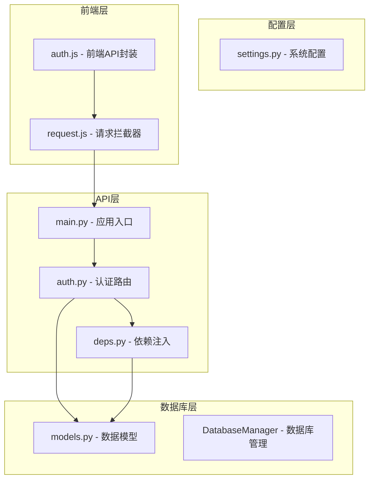
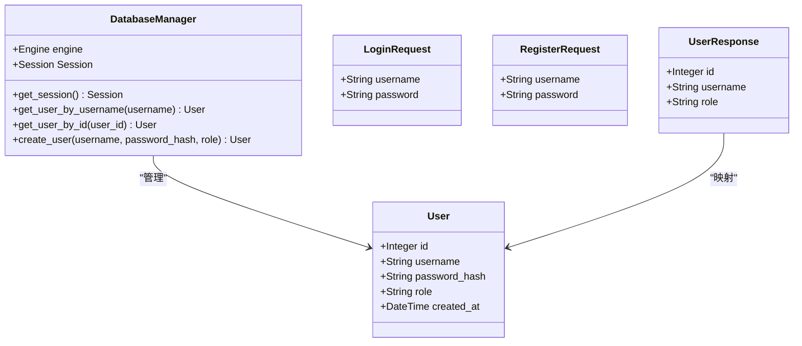
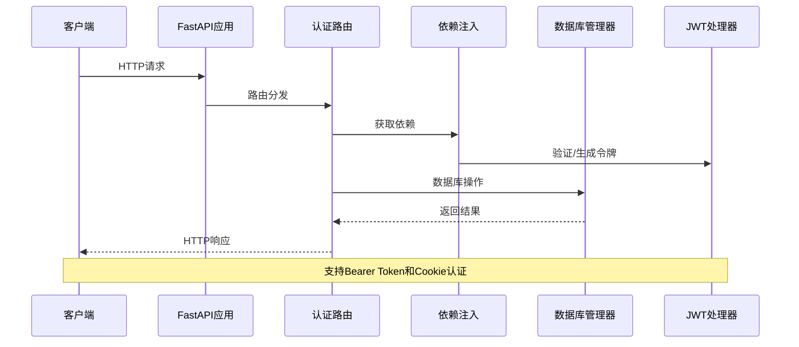
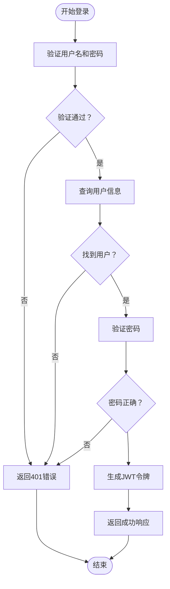
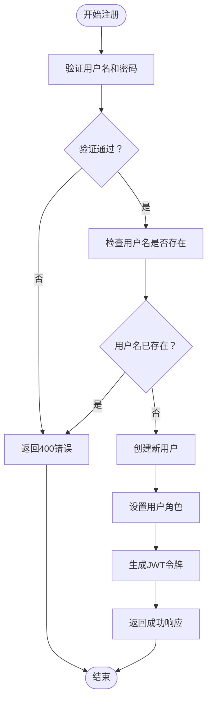
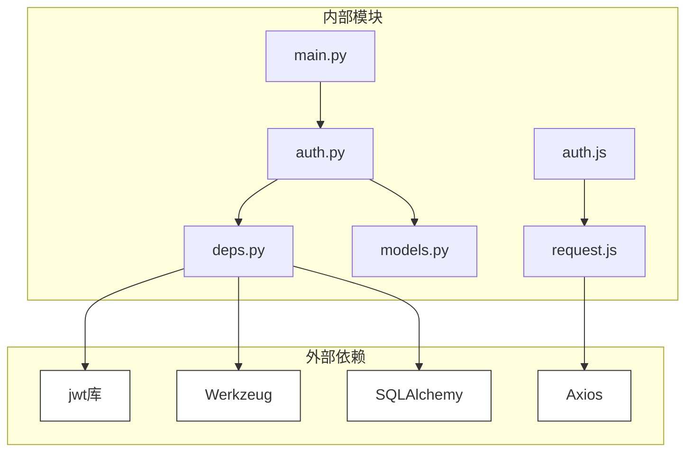

# 认证API

<cite>
**本文档引用的文件**
- [auth.py](file://backpack_quant_trading/api/routers/auth.py)
- [main.py](file://backpack_quant_trading/api/main.py)
- [deps.py](file://backpack_quant_trading/api/deps.py)
- [models.py](file://backpack_quant_trading/database/models.py)
- [auth.js](file://backpack_quant_trading/frontend/src/api/auth.js)
- [request.js](file://backpack_quant_trading/frontend/src/api/request.js)
- [settings.py](file://backpack_quant_trading/config/settings.py)
</cite>

## 目录
1. [简介](#简介)
2. [项目结构](#项目结构)
3. [核心组件](#核心组件)
4. [架构概览](#架构概览)
5. [详细组件分析](#详细组件分析)
6. [依赖关系分析](#依赖关系分析)
7. [性能考虑](#性能考虑)
8. [故障排除指南](#故障排除指南)
9. [结论](#结论)

## 简介

本文件为量化交易平台的认证API提供详细的API文档。该系统基于FastAPI框架构建，采用JWT（JSON Web Token）进行用户身份验证和授权。认证API提供了用户登录、注册、个人信息查询和登出功能，支持基于Bearer Token和Cookie两种认证方式。

系统采用SQLAlchemy ORM进行数据库操作，用户凭据通过Werkzeug的安全哈希算法进行加密存储。JWT令牌具有7天的有效期，并支持自动续期机制。

## 项目结构

认证API位于后端服务的API路由器模块中，采用模块化的架构设计：



**图表来源**
- [auth.py:1-79](file://backpack_quant_trading/api/routers/auth.py#L1-L79)
- [main.py:1-98](file://backpack_quant_trading/api/main.py#L1-L98)
- [deps.py:1-73](file://backpack_quant_trading/api/deps.py#L1-L73)

**章节来源**
- [auth.py:1-79](file://backpack_quant_trading/api/routers/auth.py#L1-L79)
- [main.py:36-49](file://backpack_quant_trading/api/main.py#L36-L49)

## 核心组件

### 认证路由模块

认证API路由模块定义了四个主要端点：
- 登录接口：POST `/api/auth/login`
- 注册接口：POST `/api/auth/register`
- 用户信息接口：GET `/api/auth/me`
- 登出接口：POST `/api/auth/logout`

### 数据模型

系统使用以下核心数据模型：



**图表来源**
- [models.py:228-237](file://backpack_quant_trading/database/models.py#L228-L237)
- [models.py:267-284](file://backpack_quant_trading/database/models.py#L267-L284)
- [auth.py:17-31](file://backpack_quant_trading/api/routers/auth.py#L17-L31)

**章节来源**
- [models.py:228-237](file://backpack_quant_trading/database/models.py#L228-L237)
- [auth.py:17-31](file://backpack_quant_trading/api/routers/auth.py#L17-L31)

## 架构概览

认证系统的整体架构采用分层设计，确保了良好的可维护性和安全性：



**图表来源**
- [auth.py:33-78](file://backpack_quant_trading/api/routers/auth.py#L33-L78)
- [deps.py:44-73](file://backpack_quant_trading/api/deps.py#L44-L73)

## 详细组件分析

### 登录接口

#### 接口定义
- **HTTP方法**：POST
- **URL模式**：`/api/auth/login`
- **请求体**：LoginRequest对象
- **响应体**：包含access_token、token_type和用户信息的对象

#### 请求数据模型

```mermaid
classDiagram
class LoginRequest {
+String username
+String password
}
note for LoginRequest : "用户名和密码字段<br/>无长度限制<br/>必须非空"
```

**图表来源**
- [auth.py:17-19](file://backpack_quant_trading/api/routers/auth.py#L17-L19)

#### 处理流程



**图表来源**
- [auth.py:33-44](file://backpack_quant_trading/api/routers/auth.py#L33-L44)
- [deps.py:28-33](file://backpack_quant_trading/api/deps.py#L28-L33)

#### 成功响应格式
```json
{
  "access_token": "eyJhbGciOiJIUzI1NiIsInR5cCI6IkpXVCJ9...",
  "token_type": "bearer",
  "user": {
    "id": 1,
    "username": "admin",
    "role": "superuser"
  }
}
```

#### 错误处理
- **400错误**：用户名或密码为空
- **401错误**：用户名或密码错误

**章节来源**
- [auth.py:33-44](file://backpack_quant_trading/api/routers/auth.py#L33-L44)

### 注册接口

#### 接口定义
- **HTTP方法**：POST
- **URL模式**：`/api/auth/register`
- **请求体**：RegisterRequest对象
- **响应体**：包含access_token、token_type和用户信息的对象

#### 请求数据模型

```mermaid
classDiagram
class RegisterRequest {
+String username
+String password
}
note for RegisterRequest : "用户名和密码字段<br/>无长度限制<br/>必须非空"
```

**图表来源**
- [auth.py:22-24](file://backpack_quant_trading/api/routers/auth.py#L22-L24)

#### 处理流程



**图表来源**
- [auth.py:47-68](file://backpack_quant_trading/api/routers/auth.py#L47-L68)

#### 角色分配策略
- 如果数据库中没有用户，则新用户被赋予"superuser"角色
- 否则新用户被赋予"default"角色

#### 成功响应格式
```json
{
  "access_token": "eyJhbGciOiJIUzI1NiIsInR5cCI6IkpXVCJ9...",
  "token_type": "bearer",
  "user": {
    "id": 2,
    "username": "newuser",
    "role": "user"
  }
}
```

**章节来源**
- [auth.py:47-68](file://backpack_quant_trading/api/routers/auth.py#L47-L68)

### 个人信息查询接口

#### 接口定义
- **HTTP方法**：GET
- **URL模式**：`/api/auth/me`
- **认证要求**：需要有效的认证令牌
- **响应体**：UserResponse对象

#### 响应数据模型

```mermaid
classDiagram
class UserResponse {
+Integer id
+String username
+String role
}
note for UserResponse : "用户信息响应模型<br/>包含用户标识、用户名和角色"
```

**图表来源**
- [auth.py:27-31](file://backpack_quant_trading/api/routers/auth.py#L27-L31)

#### 认证中间件
该接口使用`require_user`中间件进行认证：
- 自动从Authorization头或Cookie中提取令牌
- 验证JWT令牌的有效性
- 返回当前用户信息

**章节来源**
- [auth.py:71-73](file://backpack_quant_trading/api/routers/auth.py#L71-L73)
- [deps.py:69-73](file://backpack_quant_trading/api/deps.py#L69-L73)

### 登出接口

#### 接口定义
- **HTTP方法**：POST
- **URL模式**：`/api/auth/logout`
- **认证要求**：需要有效的认证令牌
- **响应体**：简单的确认消息

#### 设计说明
登出接口目前返回简单的确认消息，实际的令牌失效机制依赖于JWT的过期时间。这种设计简化了服务器端的状态管理。

**章节来源**
- [auth.py:76-78](file://backpack_quant_trading/api/routers/auth.py#L76-L78)

## 依赖关系分析

### 认证系统依赖图



**图表来源**
- [auth.py:1-14](file://backpack_quant_trading/api/routers/auth.py#L1-L14)
- [deps.py:1-17](file://backpack_quant_trading/api/deps.py#L1-L17)
- [request.js:1](file://backpack_quant_trading/frontend/src/api/request.js#L1)

### 关键依赖关系

1. **JWT处理**：使用PyJWT库进行令牌的编码和解码
2. **密码安全**：使用Werkzeug的generate_password_hash和check_password_hash
3. **数据库访问**：通过SQLAlchemy ORM进行用户数据的持久化
4. **HTTP客户端**：前端使用Axios进行API请求

**章节来源**
- [deps.py:6-25](file://backpack_quant_trading/api/deps.py#L6-L25)
- [models.py:1-11](file://backpack_quant_trading/database/models.py#L1-L11)

## 性能考虑

### JWT令牌性能特性
- **令牌大小**：JWT令牌相对较小，传输开销低
- **验证速度**：本地验证，无需数据库查询
- **过期时间**：7天有效期，平衡了安全性与用户体验

### 数据库优化
- **用户查询**：用户名字段建立唯一索引，查询效率高
- **会话管理**：使用scoped_session确保线程安全
- **连接池**：配置合理的连接池大小和溢出限制

### 前端性能优化
- **请求缓存**：前端请求拦截器减少重复的认证头部设置
- **错误处理**：统一的401错误处理，避免重复的认证检查

## 故障排除指南

### 常见错误及解决方案

#### 400错误：用户名或密码为空
**症状**：注册接口返回400错误
**原因**：请求体中的用户名或密码字段为空
**解决方案**：确保请求体包含有效的用户名和密码

#### 400错误：用户名已存在
**症状**：注册接口返回400错误
**原因**：用户名已被其他用户使用
**解决方案**：选择唯一的用户名或联系管理员

#### 401错误：用户名或密码错误
**症状**：登录接口返回401错误
**原因**：提供的凭据无效
**解决方案**：检查用户名和密码的正确性

#### 401错误：请先登录
**症状**：受保护的接口返回401错误
**原因**：缺少有效的认证令牌
**解决方案**：重新登录获取新的令牌

### 认证中间件调试

#### 令牌验证流程
1. 检查Authorization头或Cookie中是否存在令牌
2. 使用JWT库解码令牌
3. 验证令牌的签名和过期时间
4. 从数据库中查找对应的用户信息

#### 前端认证状态管理
- **令牌存储**：localStorage中存储JWT令牌
- **自动添加**：请求拦截器自动为每个请求添加Authorization头
- **自动登出**：401错误时自动清除本地存储并重定向到登录页

**章节来源**
- [request.js:20-30](file://backpack_quant_trading/frontend/src/api/request.js#L20-L30)
- [deps.py:44-73](file://backpack_quant_trading/api/deps.py#L44-L73)

## 结论

本认证API系统提供了完整且安全的用户身份验证解决方案。系统采用现代的JWT技术，结合SQLAlchemy ORM和FastAPI框架，实现了高性能、易维护的认证服务。

### 主要优势
1. **安全性**：使用标准的JWT协议和强密码哈希算法
2. **易用性**：支持多种认证方式，包括Bearer Token和Cookie
3. **可扩展性**：模块化设计便于功能扩展和维护
4. **性能**：本地令牌验证，减少数据库查询压力

### 安全建议
1. 在生产环境中设置安全的JWT密钥
2. 考虑实现令牌刷新机制
3. 添加IP白名单和频率限制
4. 定期轮换JWT密钥

该系统为量化交易平台提供了坚实的身份认证基础，支持多用户场景下的安全访问控制。