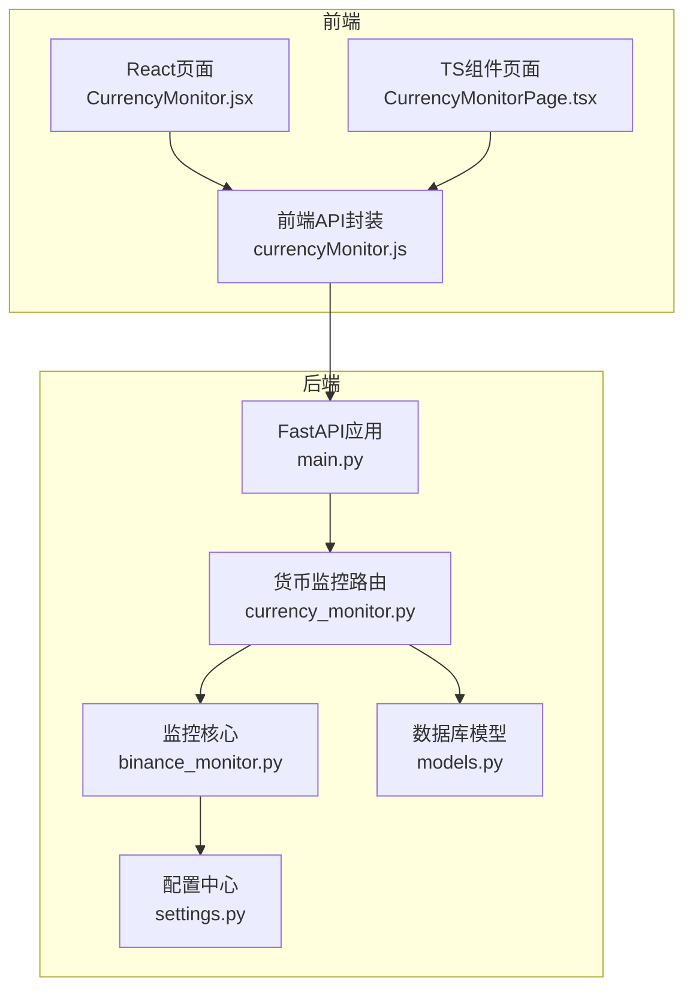
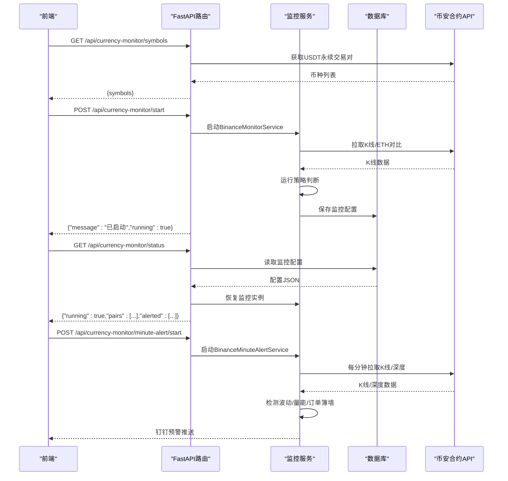
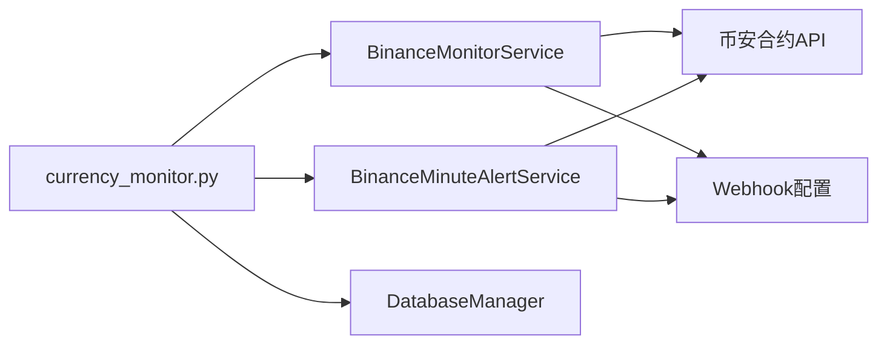

# 货币监控API

<cite>
**本文引用的文件**
- [currency_monitor.py](file://backpack_quant_trading/api/routers/currency_monitor.py)
- [binance_monitor.py](file://backpack_quant_trading/core/binance_monitor.py)
- [models.py](file://backpack_quant_trading/database/models.py)
- [main.py](file://backpack_quant_trading/api/main.py)
- [settings.py](file://backpack_quant_trading/config/settings.py)
- [currencyMonitor.js](file://backpack_quant_trading/frontend/src/api/currencyMonitor.js)
- [CurrencyMonitor.jsx](file://backpack_quant_trading/frontend/src/views/CurrencyMonitor.jsx)
- [CurrencyMonitorPage.tsx](file://backpack_quant_trading/frontend/src_a/app/components/CurrencyMonitorPage.tsx)
- [CurrencyMonitorPage.tsx](file://backpack_quant_trading/frontend/src_mon/app/components/CurrencyMonitorPage.tsx)
- [symbols_cache.json](file://backpack_quant_trading/data/symbols_cache.json)
</cite>

## 目录
1. [简介](#简介)
2. [项目结构](#项目结构)
3. [核心组件](#核心组件)
4. [架构总览](#架构总览)
5. [详细组件分析](#详细组件分析)
6. [依赖关系分析](#依赖关系分析)
7. [性能考量](#性能考量)
8. [故障排查指南](#故障排查指南)
9. [结论](#结论)
10. [附录](#附录)

## 简介
本文件为“货币监控API”的完整技术文档，覆盖以下能力：
- 汇率监控与价格异动检测
- 价格预警（波动/量能/订单簿墙）
- 币安K线数据获取与缓存
- 实时监控与历史数据查询
- 趋势分析与多币种监控
- 监控策略配置、通知渠道管理与告警历史记录

该API基于FastAPI提供REST接口，前端通过React/Vue集成，后端通过币安合约API拉取K线与订单簿数据，结合自定义策略触发钉钉预警。

## 项目结构
货币监控API位于后端路由层，前端提供多套实现（React/Vue），数据库负责持久化监控配置。

图表来源
- [main.py:37-48](file://backpack_quant_trading/api/main.py#L37-L48)
- [currency_monitor.py:1-243](file://backpack_quant_trading/api/routers/currency_monitor.py#L1-L243)
- [binance_monitor.py:1-817](file://backpack_quant_trading/core/binance_monitor.py#L1-L817)
- [models.py:267-721](file://backpack_quant_trading/database/models.py#L267-L721)
- [settings.py:104-137](file://backpack_quant_trading/config/settings.py#L104-L137)

章节来源
- [main.py:36-48](file://backpack_quant_trading/api/main.py#L36-L48)
- [currency_monitor.py:21-21](file://backpack_quant_trading/api/routers/currency_monitor.py#L21-L21)

## 核心组件
- 路由器：提供货币监控相关HTTP接口（币种列表、启动/停止监控、移除监控对、分钟预警等）
- 监控服务：BinanceMonitorService（定时轮询K线，运行策略，触发钉钉预警）、BinanceMinuteAlertService（每分钟检测波动/量能/订单簿墙）
- 数据库：UserInstance表用于持久化全局监控配置（币种监视、分钟预警）
- 配置：Webhook配置（DINGTALK_TOKEN/DINGTALK_SECRET）用于钉钉预警
- 前端：提供币种选择、时间级别选择、启动/停止、移除监控对、查看监控/预警中的币种列表

章节来源
- [currency_monitor.py:24-243](file://backpack_quant_trading/api/routers/currency_monitor.py#L24-L243)
- [binance_monitor.py:658-792](file://backpack_quant_trading/core/binance_monitor.py#L658-L792)
- [models.py:586-669](file://backpack_quant_trading/database/models.py#L586-L669)
- [settings.py:78-89](file://backpack_quant_trading/config/settings.py#L78-L89)

## 架构总览
货币监控API采用“路由层-服务层-数据层”三层架构：
- 路由层：接收HTTP请求，校验用户身份，调用服务层执行业务逻辑
- 服务层：封装币安K线/深度数据获取、策略判断、预警推送
- 数据层：持久化监控配置，支持全局共享与用户隔离

图表来源
- [currency_monitor.py:24-126](file://backpack_quant_trading/api/routers/currency_monitor.py#L24-L126)
- [currency_monitor.py:158-242](file://backpack_quant_trading/api/routers/currency_monitor.py#L158-L242)
- [binance_monitor.py:658-792](file://backpack_quant_trading/core/binance_monitor.py#L658-L792)
- [binance_monitor.py:318-440](file://backpack_quant_trading/core/binance_monitor.py#L318-L440)
- [models.py:586-669](file://backpack_quant_trading/database/models.py#L586-L669)

## 详细组件分析

### 路由与接口定义
- 币种列表
  - 方法：GET
  - URL：/api/currency-monitor/symbols
  - 功能：返回币安USDT永续合约交易对列表（带缓存）
  - 响应：包含symbols数组，若失败返回空数组与错误信息
- 监控状态
  - 方法：GET
  - URL：/api/currency-monitor/status
  - 功能：返回全局监控运行状态、监控对列表、触发过的对（10分钟内）
  - 响应：running、pairs、alerted
- 启动监控
  - 方法：POST
  - URL：/api/currency-monitor/start
  - 请求体：symbols（币种列表）、timeframes（时间级别列表）、dingtalk_webhook（可选）
  - 功能：合并已有配对，启动全局共享监控，保存配置至数据库
  - 响应：message、running
- 停止监控
  - 方法：POST
  - URL：/api/currency-monitor/stop
  - 功能：停止全局监控，清除配置
  - 响应：message、running
- 移除监控对
  - 方法：POST
  - URL：/api/currency-monitor/remove-pair
  - 请求体：symbol、timeframe
  - 功能：移除单个监控对，若无剩余对则停止服务
  - 响应：message
- 分钟预警状态
  - 方法：GET
  - URL：/api/currency-monitor/minute-alert/status
  - 功能：返回分钟预警运行状态与参数
  - 响应：running、symbols、interval、阈值参数、restored（恢复标记）
- 启动分钟预警
  - 方法：POST
  - URL：/api/currency-monitor/minute-alert/start
  - 请求体：symbols、interval、vol_pct_threshold、volume_mult_threshold、ob_notional_threshold、ob_distance_pct、depth_levels、cooldown_sec
  - 功能：启动分钟预警服务，保存配置
  - 响应：message、running
- 停止分钟预警
  - 方法：POST
  - URL：/api/currency-monitor/minute-alert/stop
  - 功能：停止分钟预警，清除配置
  - 响应：message、running

章节来源
- [currency_monitor.py:24-243](file://backpack_quant_trading/api/routers/currency_monitor.py#L24-L243)

### 监控服务与策略
- BinanceMonitorService
  - 定时轮询（每30分钟）各监控对的K线与ETH对比，运行特殊K倍数策略，满足条件时触发钉钉预警
  - 支持移除监控对、获取10分钟内触发的对集合
- BinanceMinuteAlertService
  - 每分钟拉取K线与订单簿，检测波动阈值、量能倍数、订单簿大单（近盘口墙），按原因冷却推送
  - 使用独立钉钉Webhook，避免影响全局配置

章节来源
- [binance_monitor.py:658-792](file://backpack_quant_trading/core/binance_monitor.py#L658-L792)
- [binance_monitor.py:318-440](file://backpack_quant_trading/core/binance_monitor.py#L318-L440)

### 数据持久化与配置
- UserInstance表用于保存全局监控配置（instance_type='currency_monitor'/'minute_alert'，instance_id='singleton'）
- DatabaseManager提供获取/保存/删除配置的方法，支持全局共享与用户隔离

章节来源
- [models.py:586-669](file://backpack_quant_trading/database/models.py#L586-L669)

### 前端集成
- 前端提供React/Vue组件，调用上述API完成币种选择、时间级别选择、启动/停止、移除监控对、查看监控/预警中的币种列表
- 自动轮询状态，支持分钟预警参数展示与恢复

章节来源
- [currencyMonitor.js:1-13](file://backpack_quant_trading/frontend/src/api/currencyMonitor.js#L1-L13)
- [CurrencyMonitor.jsx:1-466](file://backpack_quant_trading/frontend/src/views/CurrencyMonitor.jsx#L1-L466)
- [CurrencyMonitorPage.tsx:1-515](file://backpack_quant_trading/frontend/src_a/app/components/CurrencyMonitorPage.tsx#L1-L515)
- [CurrencyMonitorPage.tsx:1-515](file://backpack_quant_trading/frontend/src_mon/app/components/CurrencyMonitorPage.tsx#L1-L515)

## 依赖关系分析
- 路由依赖服务层（BinanceMonitorService/BinanceMinuteAlertService）
- 服务层依赖币安合约API（K线/深度/交易对）
- 服务层依赖配置中心（钉钉Webhook）
- 路由依赖数据库（持久化监控配置）

图表来源
- [currency_monitor.py:9-19](file://backpack_quant_trading/api/routers/currency_monitor.py#L9-L19)
- [binance_monitor.py:20-25](file://backpack_quant_trading/core/binance_monitor.py#L20-L25)
- [settings.py:78-89](file://backpack_quant_trading/config/settings.py#L78-L89)
- [models.py:267-721](file://backpack_quant_trading/database/models.py#L267-L721)

## 性能考量
- 币安K线分批拉取，限制请求频率，避免限流
- 币种列表缓存（symbols_cache.json），24小时TTL，减少API调用
- 监控轮询间隔较长（30分钟），降低CPU占用
- 分钟预警按原因冷却，避免刷屏
- 前端轮询状态（5秒），保持界面实时性

章节来源
- [binance_monitor.py:60-166](file://backpack_quant_trading/core/binance_monitor.py#L60-L166)
- [binance_monitor.py:442-513](file://backpack_quant_trading/core/binance_monitor.py#L442-L513)
- [CurrencyMonitor.jsx:162-180](file://backpack_quant_trading/frontend/src/views/CurrencyMonitor.jsx#L162-L180)

## 故障排查指南
- 钉钉预警未推送
  - 检查Webhook配置（DINGTALK_TOKEN/DINGTALK_SECRET）是否正确
  - 分钟预警使用独立Webhook，确认MINUTE_ALERT_WEBHOOK是否配置
- 监控未恢复
  - 用户主动停止后不会从DB恢复，需重新启动
  - 检查DB中currency_monitor配置是否存在
- 币种列表为空
  - 检查币安API可达性与symbols_cache.json缓存文件
- 接口报错
  - 查看后端日志，定位具体异常（网络、解析、限流等）

章节来源
- [currency_monitor.py:56-86](file://backpack_quant_trading/api/routers/currency_monitor.py#L56-L86)
- [binance_monitor.py:605-656](file://backpack_quant_trading/core/binance_monitor.py#L605-L656)
- [binance_monitor.py:24-25](file://backpack_quant_trading/core/binance_monitor.py#L24-L25)
- [models.py:586-669](file://backpack_quant_trading/database/models.py#L586-L669)

## 结论
货币监控API提供了完整的多币种、多时间级别的实时监控与预警能力，具备良好的扩展性与稳定性。通过币安合约API与自定义策略，能够及时发现市场异动并以钉钉方式进行通知。建议在生产环境中合理配置阈值与冷却时间，结合前端可视化界面提升监控效率。

## 附录

### API清单与请求/响应模式

- GET /api/currency-monitor/symbols
  - 请求：无
  - 响应：包含币种列表的JSON对象
- GET /api/currency-monitor/status
  - 请求：无
  - 响应：running、pairs、alerted
- POST /api/currency-monitor/start
  - 请求体：symbols、timeframes、dingtalk_webhook（可选）
  - 响应：message、running
- POST /api/currency-monitor/stop
  - 请求：无
  - 响应：message、running
- POST /api/currency-monitor/remove-pair
  - 请求体：symbol、timeframe
  - 响应：message
- GET /api/currency-monitor/minute-alert/status
  - 请求：无
  - 响应：running、symbols、interval、阈值参数、restored
- POST /api/currency-monitor/minute-alert/start
  - 请求体：symbols、interval、vol_pct_threshold、volume_mult_threshold、ob_notional_threshold、ob_distance_pct、depth_levels、cooldown_sec
  - 响应：message、running
- POST /api/currency-monitor/minute-alert/stop
  - 请求：无
  - 响应：message、running

章节来源
- [currency_monitor.py:24-243](file://backpack_quant_trading/api/routers/currency_monitor.py#L24-L243)

### 监控配置请求示例
- 启动监控（示例）
  - POST /api/currency-monitor/start
  - 请求体示例：{"symbols": ["BTCUSDT","ETHUSDT"],"timeframes": ["1小时","4小时"]}
- 启动分钟预警（示例）
  - POST /api/currency-monitor/minute-alert/start
  - 请求体示例：{"symbols": ["BTCUSDT"],"interval": "1m","vol_pct_threshold": 5.0,"volume_mult_threshold": 20.0,"ob_notional_threshold": 200000.0,"ob_distance_pct": 0.003,"depth_levels": 50,"cooldown_sec": 300}

章节来源
- [currency_monitor.py:89-125](file://backpack_quant_trading/api/routers/currency_monitor.py#L89-L125)
- [currency_monitor.py:202-232](file://backpack_quant_trading/api/routers/currency_monitor.py#L202-L232)

### 预警触发格式
- 钉钉文本消息包含：币种、时间级别、触发时间、触发原因列表
- 分钟预警使用独立Webhook，避免影响全局配置

章节来源
- [binance_monitor.py:605-656](file://backpack_quant_trading/core/binance_monitor.py#L605-L656)
- [binance_monitor.py:636-655](file://backpack_quant_trading/core/binance_monitor.py#L636-L655)

### 数据统计与历史查询
- 历史K线获取：通过币安合约API按symbol、interval、limit获取K线数据
- 币种列表缓存：symbols_cache.json，包含大量USDT永续交易对，24小时TTL
- 前端可视化：支持按时间区间展示K线与交易点位

章节来源
- [binance_monitor.py:168-197](file://backpack_quant_trading/core/binance_monitor.py#L168-L197)
- [binance_monitor.py:479-513](file://backpack_quant_trading/core/binance_monitor.py#L479-L513)
- [CurrencyMonitor.jsx:498-528](file://backpack_quant_trading/frontend/src/views/CurrencyMonitor.jsx#L498-L528)

### 通知渠道管理
- 全局钉钉Webhook：DINGTALK_TOKEN/DINGTALK_SECRET
- 分钟预警专用Webhook：MINUTE_ALERT_WEBHOOK
- 建议：为不同监控场景配置独立Webhook，便于区分与管理

章节来源
- [settings.py:78-89](file://backpack_quant_trading/config/settings.py#L78-L89)
- [binance_monitor.py:24-25](file://backpack_quant_trading/core/binance_monitor.py#L24-L25)