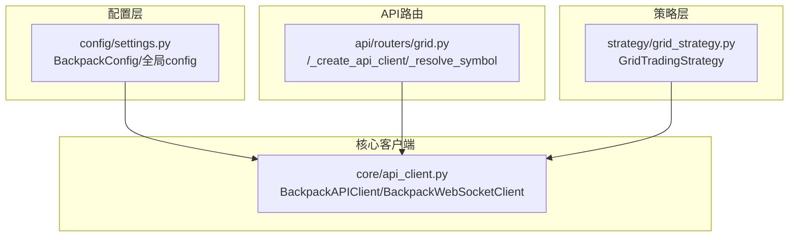
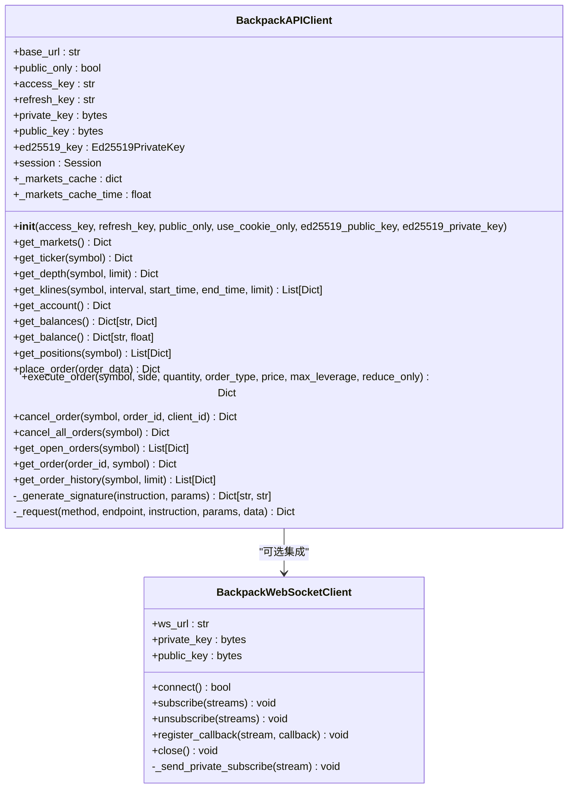
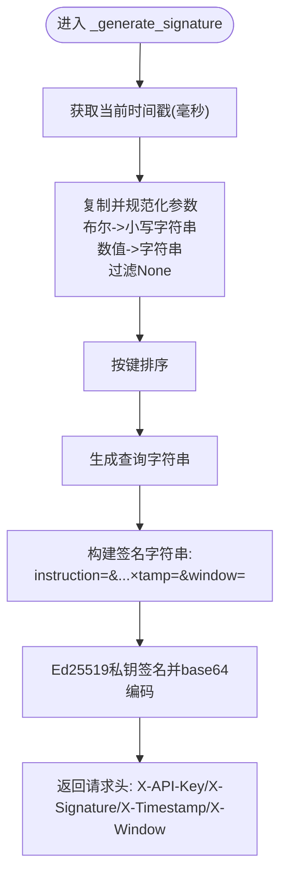
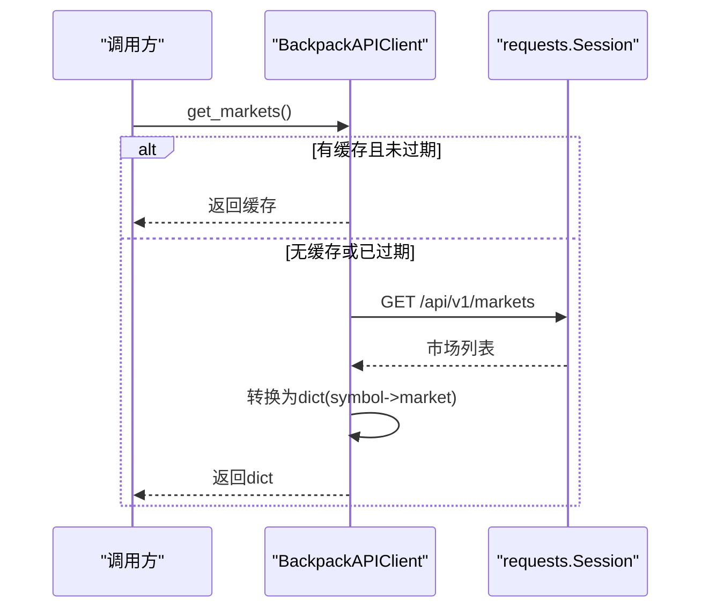
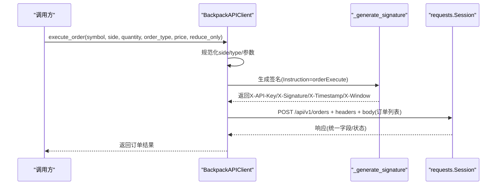
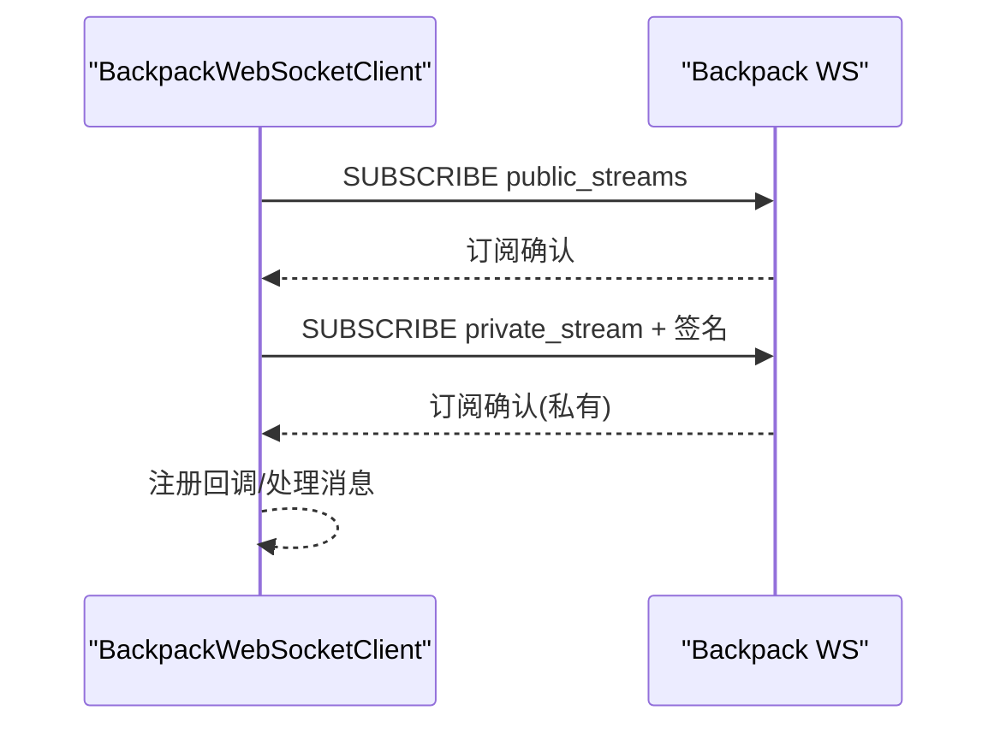
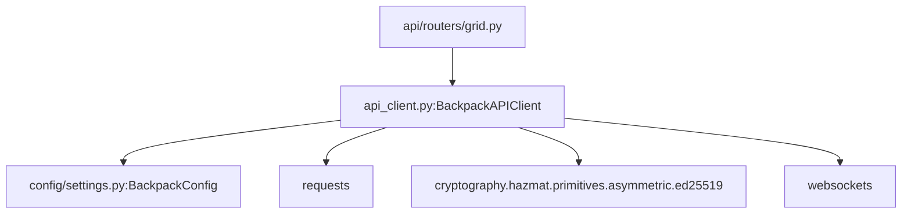

# Backpack交易所集成

<cite>
**本文引用的文件**
- [api_client.py](file://backpack_quant_trading/core/api_client.py)
- [settings.py](file://backpack_quant_trading/config/settings.py)
- [grid.py](file://backpack_quant_trading/api/routers/grid.py)
- [grid_strategy.py](file://backpack_quant_trading/strategy/grid_strategy.py)
</cite>

## 目录
1. [简介](#简介)
2. [项目结构](#项目结构)
3. [核心组件](#核心组件)
4. [架构总览](#架构总览)
5. [详细组件分析](#详细组件分析)
6. [依赖分析](#依赖分析)
7. [性能考虑](#性能考虑)
8. [故障排查指南](#故障排查指南)
9. [结论](#结论)
10. [附录](#附录)

## 简介
本文件面向Backpack交易所的集成与使用，重点围绕BackpackAPIClient类展开，系统性说明以下内容：
- ED25519签名认证机制与Cookie认证方式
- 双重认证优先级与配置流程
- API密钥配置、签名生成算法与时间戳处理
- 市场数据获取、账户信息查询、订单执行与取消等核心功能
- 提供初始化客户端、配置认证参数与调用API接口的参考路径
- 常见问题解决方案与性能优化建议

## 项目结构
Backpack集成位于backpack_quant_trading/core目录下的api_client.py，配置位于config/settings.py，API路由在api/routers/grid.py中用于启动网格策略并创建BackpackAPIClient实例，策略层在strategy/grid_strategy.py中消费API。

**图表来源**
- [settings.py:104-132](file://backpack_quant_trading/config/settings.py#L104-L132)
- [api_client.py:87-146](file://backpack_quant_trading/core/api_client.py#L87-L146)
- [grid.py:42-67](file://backpack_quant_trading/api/routers/grid.py#L42-L67)
- [grid_strategy.py:38-100](file://backpack_quant_trading/strategy/grid_strategy.py#L38-L100)

**章节来源**
- [settings.py:104-132](file://backpack_quant_trading/config/settings.py#L104-L132)
- [api_client.py:87-146](file://backpack_quant_trading/core/api_client.py#L87-L146)
- [grid.py:42-67](file://backpack_quant_trading/api/routers/grid.py#L42-L67)
- [grid_strategy.py:38-100](file://backpack_quant_trading/strategy/grid_strategy.py#L38-L100)

## 核心组件
- BackpackAPIClient：Backpack REST API客户端，支持ED25519签名认证与Cookie认证，封装市场数据、账户、订单等接口。
- BackpackWebSocketClient：Backpack WebSocket客户端，支持公共流与私有流订阅，私有流需ED25519签名。
- 配置系统：BackpackConfig提供API_BASE_URL、ACCESS_KEY/REFRESH_KEY、ED25519公私钥、默认时间窗等配置项。
- API路由与策略：grid.py负责创建BackpackAPIClient并启动网格策略；grid_strategy.py实现网格交易逻辑并调用API。

**章节来源**
- [api_client.py:87-146](file://backpack_quant_trading/core/api_client.py#L87-L146)
- [api_client.py:599-944](file://backpack_quant_trading/core/api_client.py#L599-L944)
- [settings.py:13-32](file://backpack_quant_trading/config/settings.py#L13-L32)
- [grid.py:42-67](file://backpack_quant_trading/api/routers/grid.py#L42-L67)
- [grid_strategy.py:38-100](file://backpack_quant_trading/strategy/grid_strategy.py#L38-L100)

## 架构总览
BackpackAPIClient在初始化时根据参数与配置决定认证方式：
- public_only=True：仅用于公共接口，不加载任何认证信息。
- use_cookie_only=True：强制使用Cookie认证（accessKey/refreshKey）。
- 否则：优先使用页面传入的ED25519公私钥（base64），若失败则回退到系统配置；若仍未配置，则使用Cookie认证。

**图表来源**
- [api_client.py:87-146](file://backpack_quant_trading/core/api_client.py#L87-L146)
- [api_client.py:599-944](file://backpack_quant_trading/core/api_client.py#L599-L944)

## 详细组件分析

### BackpackAPIClient认证与签名机制
- 认证优先级
  - public_only=True：不加载任何认证信息，仅调用公开接口。
  - use_cookie_only=True：仅使用Cookie（accessKey/refreshKey）。
  - 否则：优先使用页面传入的ED25519公私钥（base64），失败则回退系统配置；若仍不可用则使用Cookie认证。
- 签名生成算法
  - 时间戳：毫秒级，来自系统时间。
  - 时间窗：默认5000ms，可通过配置调整。
  - 参数处理：将布尔值转为小写字符串，数值转为字符串，过滤None值；按键排序后拼接为查询串。
  - 签名字符串格式：instruction=<指令>&<参数串>&timestamp=<时间戳>&window=<时间窗>。
  - 使用Ed25519私钥对签名字符串进行签名，返回base64编码的签名。
  - 请求头包含：X-API-Key（base64公钥）、X-Signature、X-Timestamp、X-Window。
- Cookie认证
  - 若存在accessKey与refreshKey，构造Cookie头：accessKey=...; refreshKey=...。

**图表来源**
- [api_client.py:158-211](file://backpack_quant_trading/core/api_client.py#L158-L211)

**章节来源**
- [api_client.py:90-141](file://backpack_quant_trading/core/api_client.py#L90-L141)
- [api_client.py:158-211](file://backpack_quant_trading/core/api_client.py#L158-L211)
- [api_client.py:213-269](file://backpack_quant_trading/core/api_client.py#L213-L269)

### API密钥配置流程
- 系统配置（环境变量）
  - BACKPACK_API_KEY / BACKPACK_PUBLIC_KEY：ED25519公钥（base64）
  - BACKPACK_API_SECRET / BACKPACK_PRIVATE_KEY：ED25519私钥（base64）
  - BACKPACK_ACCESS_KEY / BACKPACK_REFRESH_KEY：Cookie认证用
  - DEFAULT_WINDOW：默认时间窗（毫秒）
- 初始化优先级
  - 页面参数优先：ed25519_public_key / ed25519_private_key
  - 其次系统配置：PRIVATE_KEY / PUBLIC_KEY
  - 最后Cookie：ACCESS_KEY / REFRESH_KEY
- 示例路径
  - 初始化客户端并传入页面参数：[grid.py:48-54](file://backpack_quant_trading/api/routers/grid.py#L48-L54)
  - 系统配置读取：[settings.py:19-31](file://backpack_quant_trading/config/settings.py#L19-L31)

**章节来源**
- [settings.py:19-31](file://backpack_quant_trading/config/settings.py#L19-L31)
- [grid.py:48-54](file://backpack_quant_trading/api/routers/grid.py#L48-L54)

### 市场数据获取
- get_markets：返回以symbol为键的市场字典，内部缓存1小时。
- get_ticker / get_depth / get_klines：分别获取ticker、深度与K线数据。
- K线时间戳处理：若传入13位毫秒时间戳，自动转为秒级。

**图表来源**
- [api_client.py:295-310](file://backpack_quant_trading/core/api_client.py#L295-L310)

**章节来源**
- [api_client.py:295-340](file://backpack_quant_trading/core/api_client.py#L295-L340)

### 账户信息查询
- get_account：账户信息（需签名）。
- get_balances：余额（兼容多种返回格式）。
- get_balance：汇总可用/锁定/借出/限仓等字段为统一余额。
- get_positions：仓位查询（需签名）。

**章节来源**
- [api_client.py:342-411](file://backpack_quant_trading/core/api_client.py#L342-L411)

### 订单执行与取消
- execute_order：标准化买卖方向与订单类型，构建订单列表，支持仅减少持仓（reduceOnly）。
- place_order：提交订单（POST /api/v1/orders）。
- cancel_order / cancel_all_orders：按订单ID或全部取消。
- get_open_orders / get_order / get_order_history：查询未成交、单个与历史订单。

**图表来源**
- [api_client.py:418-477](file://backpack_quant_trading/core/api_client.py#L418-L477)
- [api_client.py:158-211](file://backpack_quant_trading/core/api_client.py#L158-L211)

**章节来源**
- [api_client.py:418-546](file://backpack_quant_trading/core/api_client.py#L418-L546)

### WebSocket集成
- 公共流：无需签名，直接订阅。
- 私有流：需ED25519签名，包含时间戳与时间窗。
- 订阅流程：分离私有/公共流，先订阅公共流，再延迟订阅私有流。

**图表来源**
- [api_client.py:821-861](file://backpack_quant_trading/core/api_client.py#L821-L861)

**章节来源**
- [api_client.py:599-944](file://backpack_quant_trading/core/api_client.py#L599-L944)

### 网格策略集成示例
- API路由创建BackpackAPIClient并注入策略：[grid.py:106-126](file://backpack_quant_trading/api/routers/grid.py#L106-L126)
- 策略层使用ExchangeClient接口与API交互：[grid_strategy.py:83-84](file://backpack_quant_trading/strategy/grid_strategy.py#L83-L84)

**章节来源**
- [grid.py:106-126](file://backpack_quant_trading/api/routers/grid.py#L106-L126)
- [grid_strategy.py:83-84](file://backpack_quant_trading/strategy/grid_strategy.py#L83-L84)

## 依赖分析
- 外部依赖
  - cryptography.hazmat.primitives.asymmetric.ed25519：Ed25519签名
  - requests：HTTP请求
  - websockets：WebSocket客户端
  - base64/time/json/urlencode：签名与序列化
- 内部依赖
  - config.settings.config：读取BackpackConfig
  - FastAPI路由grid.py：创建BackpackAPIClient并启动策略

**图表来源**
- [api_client.py:13-14](file://backpack_quant_trading/core/api_client.py#L13-L14)
- [settings.py:104-132](file://backpack_quant_trading/config/settings.py#L104-L132)
- [grid.py:47-54](file://backpack_quant_trading/api/routers/grid.py#L47-L54)

**章节来源**
- [api_client.py:13-14](file://backpack_quant_trading/core/api_client.py#L13-L14)
- [settings.py:104-132](file://backpack_quant_trading/config/settings.py#L104-L132)
- [grid.py:47-54](file://backpack_quant_trading/api/routers/grid.py#L47-L54)

## 性能考虑
- 市场数据缓存：get_markets缓存1小时，减少重复请求。
- 异步包装：HTTP请求通过asyncio.to_thread在同步Session上异步调用，降低阻塞。
- WebSocket私有流订阅：先公共后私有，避免频繁重连。
- K线时间戳转换：自动将13位毫秒时间戳转为秒，避免参数错误导致的重试。
- 429保护：策略层内置冷却与限流，避免触发API限频。

**章节来源**
- [api_client.py:295-310](file://backpack_quant_trading/core/api_client.py#L295-L310)
- [api_client.py:322-339](file://backpack_quant_trading/core/api_client.py#L322-L339)
- [grid_strategy.py:119-120](file://backpack_quant_trading/strategy/grid_strategy.py#L119-L120)

## 故障排查指南
- 400错误（签名相关）
  - 检查instruction参数是否正确
  - 核对系统时间与时钟偏移
  - 确认参数编码与空值处理
  - 查看响应状态码、内容与请求URL/头
- 认证失败
  - 确认ED25519公私钥base64格式正确
  - 检查use_cookie_only/public_only参数是否符合预期
  - 验证ACCESS_KEY/REFRESH_KEY是否有效
- WebSocket连接问题
  - 检查代理设置（HTTPS_PROXY/http_proxy/HTTP_PROXY）
  - 心跳超时会触发重连，关注last_pong与reconnect_attempts
- 订单执行异常
  - reduceOnly与订单类型需匹配
  - 确保价格/数量精度与交易所要求一致

**章节来源**
- [api_client.py:254-268](file://backpack_quant_trading/core/api_client.py#L254-L268)
- [api_client.py:705-724](file://backpack_quant_trading/core/api_client.py#L705-L724)
- [api_client.py:886-892](file://backpack_quant_trading/core/api_client.py#L886-L892)

## 结论
BackpackAPIClient提供了完善的Backpack交易所集成能力，支持ED25519签名与Cookie双认证，具备市场数据、账户查询与订单全链路功能。通过明确的配置优先级与健壮的错误处理，可在生产环境中稳定运行。结合WebSocket实时流与网格策略，可快速搭建自动化交易系统。

## 附录

### 初始化与调用示例（参考路径）
- 初始化BackpackAPIClient（页面参数优先）：[grid.py:48-54](file://backpack_quant_trading/api/routers/grid.py#L48-L54)
- 获取市场与ticker：[api_client.py:295-315](file://backpack_quant_trading/core/api_client.py#L295-L315)
- 查询账户与余额：[api_client.py:342-411](file://backpack_quant_trading/core/api_client.py#L342-L411)
- 下单与取消：[api_client.py:418-496](file://backpack_quant_trading/core/api_client.py#L418-L496)
- WebSocket订阅（公共/私有）：[api_client.py:821-861](file://backpack_quant_trading/core/api_client.py#L821-L861)