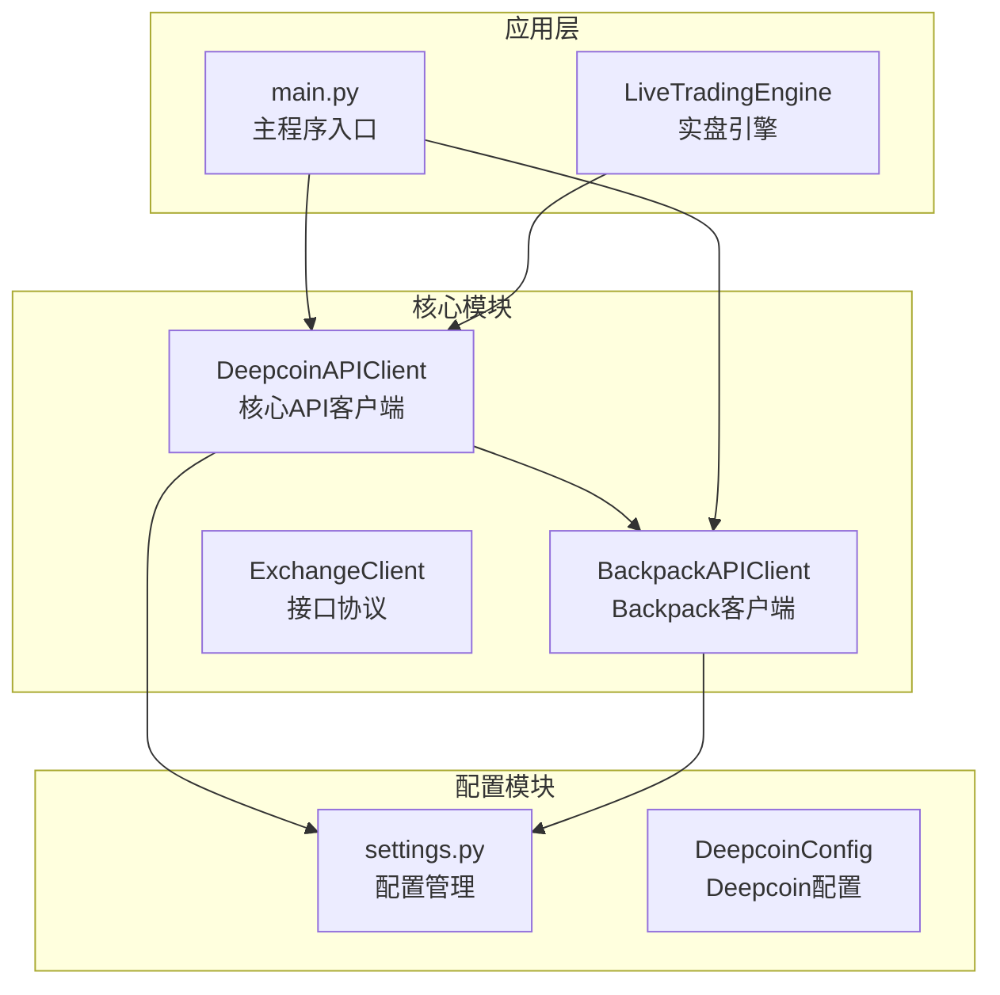
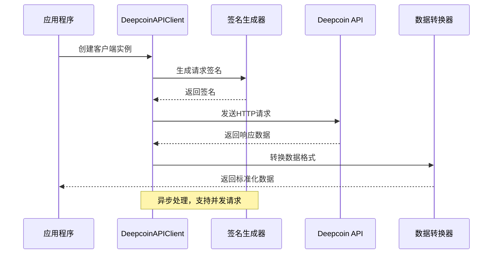
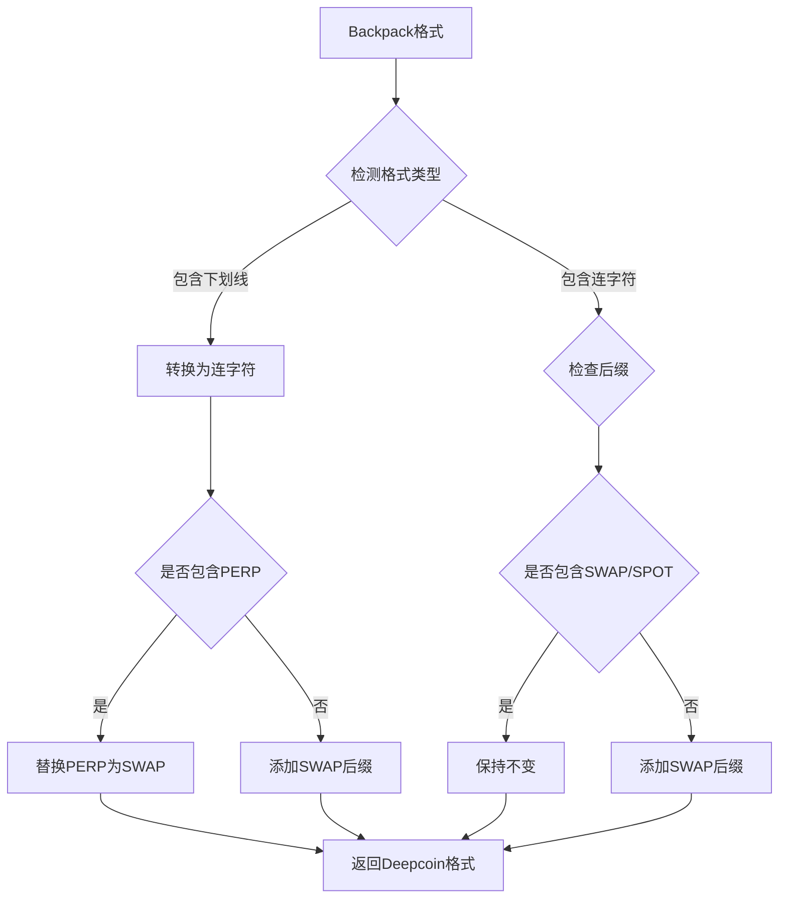
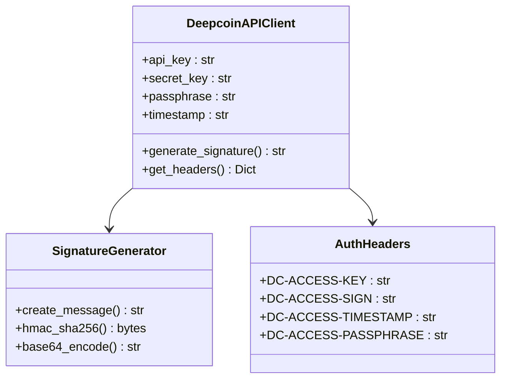
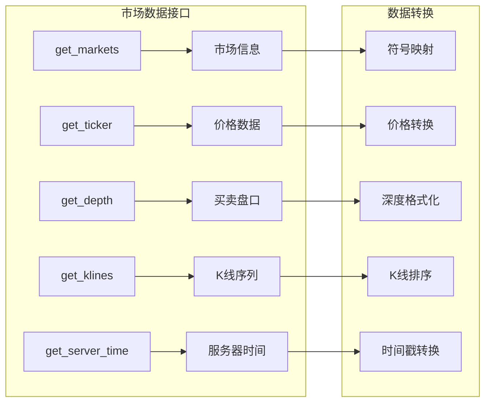
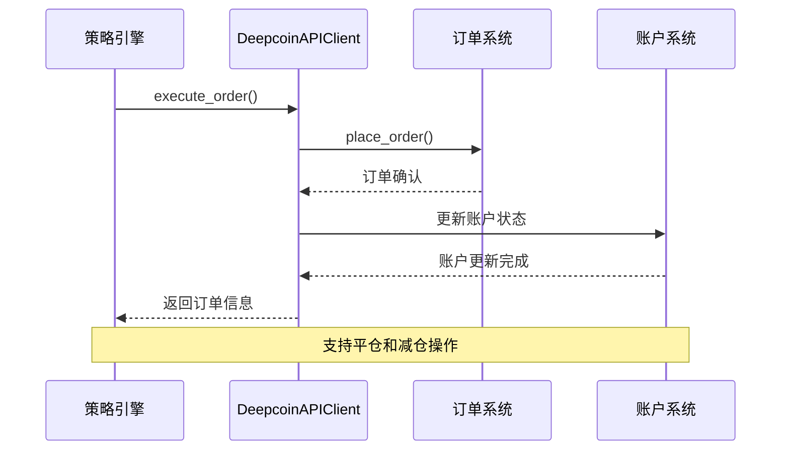
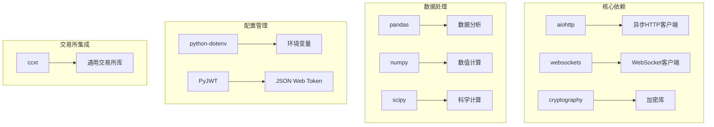
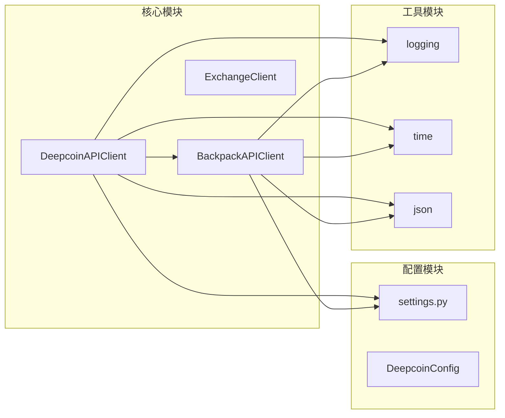
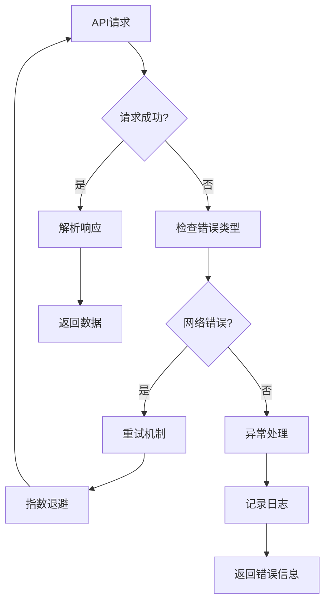

# Deepcoin交易所集成

<cite>
**本文档引用的文件**
- [deepcoin_client.py](file://backpack_quant_trading/core/deepcoin_client.py)
- [api_client.py](file://backpack_quant_trading/core/api_client.py)
- [settings.py](file://backpack_quant_trading/config/settings.py)
- [main.py](file://backpack_quant_trading/main.py)
- [requirements.txt](file://backpack_quant_trading/requirements.txt)
</cite>

## 目录
1. [简介](#简介)
2. [项目结构](#项目结构)
3. [核心组件](#核心组件)
4. [架构概览](#架构概览)
5. [详细组件分析](#详细组件分析)
6. [依赖关系分析](#依赖关系分析)
7. [性能考虑](#性能考虑)
8. [故障排除指南](#故障排除指南)
9. [结论](#结论)
10. [附录](#附录)

## 简介

Deepcoin交易所集成为Backpack量化交易系统的重要组成部分，提供了对Deepcoin加密货币衍生品交易所的完整API集成。该集成实现了ExchangeClient协议，支持市场数据获取、账户管理、交易执行等核心功能。

Deepcoin作为新兴的加密货币衍生品交易所，具有以下特点：
- 支持永续合约交易
- 提供高性能的API接口
- 实现了严格的风控机制
- 支持多种订单类型和交易模式

## 项目结构

项目采用模块化架构设计，核心文件组织如下：

**图表来源**
- [deepcoin_client.py:18-31](file://backpack_quant_trading/core/deepcoin_client.py#L18-L31)
- [api_client.py:22-85](file://backpack_quant_trading/core/api_client.py#L22-L85)
- [settings.py:92-102](file://backpack_quant_trading/config/settings.py#L92-L102)

**章节来源**
- [main.py:49-55](file://backpack_quant_trading/main.py#L49-L55)
- [settings.py:104-113](file://backpack_quant_trading/config/settings.py#L104-L113)

## 核心组件

### DeepcoinAPIClient类

DeepcoinAPIClient是整个集成的核心类，实现了ExchangeClient协议，提供以下主要功能：

#### 主要特性
- **异步HTTP客户端**：基于aiohttp实现高性能异步请求
- **签名认证**：实现Deepcoin特有的HMAC-SHA256签名机制
- **符号映射**：自动转换Backpack和Deepcoin之间的交易对格式
- **错误处理**：完善的异常捕获和错误恢复机制
- **会话管理**：智能的HTTP会话生命周期管理

#### 认证机制
Deepcoin采用独特的四要素认证体系：
- **API Key**：访问令牌
- **Secret Key**：密钥材料
- **Passphrase**：访问口令
- **Timestamp**：时间戳验证

**章节来源**
- [deepcoin_client.py:21-27](file://backpack_quant_trading/core/deepcoin_client.py#L21-L27)
- [deepcoin_client.py:42-66](file://backpack_quant_trading/core/deepcoin_client.py#L42-L66)

## 架构概览

Deepcoin集成采用了分层架构设计，确保了系统的可扩展性和可维护性：

**图表来源**
- [deepcoin_client.py:110-171](file://backpack_quant_trading/core/deepcoin_client.py#L110-L171)
- [deepcoin_client.py:42-66](file://backpack_quant_trading/core/deepcoin_client.py#L42-L66)

## 详细组件分析

### 1. 符号映射系统

Deepcoin和Backpack使用不同的交易对命名规范，系统实现了自动转换机制：

#### 格式转换规则
- **Backpack格式**：`ETH_USDC_PERP`
- **Deepcoin格式**：`ETH-USDC-SWAP`

**图表来源**
- [deepcoin_client.py:68-108](file://backpack_quant_trading/core/deepcoin_client.py#L68-L108)

**章节来源**
- [deepcoin_client.py:68-108](file://backpack_quant_trading/core/deepcoin_client.py#L68-L108)

### 2. 认证与签名机制

Deepcoin实现了严格的安全认证机制，确保交易安全：

#### 签名流程
1. **时间戳生成**：UTC时间格式化为ISO8601标准
2. **消息构建**：拼接时间戳、HTTP方法、请求路径和请求体
3. **HMAC计算**：使用SHA256算法和密钥进行哈希
4. **Base64编码**：将二进制签名转换为Base64字符串
5. **请求头设置**：包含所有认证信息的头部

**图表来源**
- [deepcoin_client.py:42-66](file://backpack_quant_trading/core/deepcoin_client.py#L42-L66)

**章节来源**
- [deepcoin_client.py:42-66](file://backpack_quant_trading/core/deepcoin_client.py#L42-L66)

### 3. 市场数据接口

系统提供了完整的市场数据获取能力：

#### 支持的数据类型
- **市场列表**：获取所有可用交易对信息
- **实时报价**：获取最新价格数据
- **深度数据**：获取买卖盘口数据
- **K线数据**：获取历史价格序列
- **服务器时间**：获取交易所时间

**图表来源**
- [deepcoin_client.py:174-265](file://backpack_quant_trading/core/deepcoin_client.py#L174-L265)

**章节来源**
- [deepcoin_client.py:174-265](file://backpack_quant_trading/core/deepcoin_client.py#L174-L265)

### 4. 账户与交易接口

系统实现了完整的交易功能：

#### 账户管理
- **账户信息**：获取用户基本信息
- **余额查询**：获取各币种可用余额
- **持仓管理**：获取当前持仓情况

#### 交易功能
- **下单执行**：支持市价单和限价单
- **订单管理**：查询、取消订单
- **历史记录**：获取交易历史

**图表来源**
- [deepcoin_client.py:344-486](file://backpack_quant_trading/core/deepcoin_client.py#L344-L486)

**章节来源**
- [deepcoin_client.py:344-486](file://backpack_quant_trading/core/deepcoin_client.py#L344-L486)

## 依赖关系分析

### 外部依赖

项目依赖以下关键库：

**图表来源**
- [requirements.txt:1-61](file://backpack_quant_trading/requirements.txt#L1-L61)

### 内部依赖关系

**图表来源**
- [deepcoin_client.py:13-16](file://backpack_quant_trading/core/deepcoin_client.py#L13-L16)
- [api_client.py:17-19](file://backpack_quant_trading/core/api_client.py#L17-L19)

**章节来源**
- [requirements.txt:1-61](file://backpack_quant_trading/requirements.txt#L1-L61)
- [deepcoin_client.py:13-16](file://backpack_quant_trading/core/deepcoin_client.py#L13-L16)

## 性能考虑

### 异步处理优势

Deepcoin集成充分利用了异步编程的优势：

- **并发请求**：支持同时处理多个API请求
- **资源优化**：减少线程切换开销
- **响应速度**：提高API调用效率

### 缓存策略

系统实现了多层次的缓存机制：

- **市场数据缓存**：1小时有效期
- **会话管理**：智能连接池管理
- **配置缓存**：避免重复读取配置

### 错误处理机制

**图表来源**
- [deepcoin_client.py:136-171](file://backpack_quant_trading/core/deepcoin_client.py#L136-L171)

## 故障排除指南

### 常见问题及解决方案

#### 1. 认证失败
**症状**：返回401或签名错误
**解决方案**：
- 检查API Key、Secret Key、Passphrase配置
- 验证系统时间同步
- 确认签名生成过程正确

#### 2. 请求超时
**症状**：连接超时或响应缓慢
**解决方案**：
- 检查网络连接稳定性
- 调整超时参数
- 实施重试机制

#### 3. 数据格式不匹配
**症状**：解析数据时报错
**解决方案**：
- 检查符号映射转换
- 验证数据格式一致性
- 实施数据验证机制

#### 4. 速率限制
**症状**：频繁收到429错误
**解决方案**：
- 实施请求节流
- 增加重试延迟
- 优化请求频率

**章节来源**
- [deepcoin_client.py:150-152](file://backpack_quant_trading/core/deepcoin_client.py#L150-L152)
- [deepcoin_client.py:164-166](file://backpack_quant_trading/core/deepcoin_client.py#L164-L166)

## 结论

Deepcoin交易所集成为Backpack量化交易系统提供了完整的加密货币衍生品交易能力。通过实现ExchangeClient协议，系统能够无缝集成Deepcoin的API接口，为用户提供：

- **完整的交易功能**：支持多种订单类型和交易模式
- **严格的安全保障**：基于HMAC-SHA256的签名认证
- **高效的性能表现**：异步处理和智能缓存机制
- **灵活的配置选项**：支持多种交易参数和风控设置

该集成不仅满足了当前的功能需求，还为未来的扩展和优化奠定了坚实基础。

## 附录

### 配置参数说明

| 参数名称 | 类型 | 描述 | 默认值 |
|---------|------|------|--------|
| DEEPCOIN_API_BASE_URL | str | API基础URL | https://api.deepcoin.com |
| DEEPCOIN_API_KEY | str | API密钥 | 空字符串 |
| DEEPCOIN_SECRET_KEY | str | 秘密密钥 | 空字符串 |
| DEEPCOIN_PASSPHRASE | str | 访问口令 | 空字符串 |
| DEEPCOIN_MARGIN_MODE | str | 保证金模式 | isolated |
| DEEPCOIN_MERGE_POSITION | str | 持仓合并模式 | split |
| DEEPCOIN_LEVERAGE | int | 默认杠杆倍数 | 5 |

### API端点映射

| 功能类别 | Deepcoin端点 | 参数 | 返回数据 |
|---------|-------------|------|----------|
| 市场数据 | /deepcoin/market/instruments | instType=SWAP | 交易对列表 |
| 实时报价 | /deepcoin/market/tickers | instType=SWAP, instId | 价格数据 |
| 深度数据 | /deepcoin/market/books | instId, sz | 买卖盘口 |
| K线数据 | /deepcoin/market/candles | instId, bar, limit | K线序列 |
| 账户信息 | /deepcoin/account/account-info | 无 | 账户详情 |
| 余额查询 | /deepcoin/account/balances | instType=SWAP, ccy | 余额信息 |
| 持仓管理 | /deepcoin/account/positions | instType=SWAP, instId | 持仓详情 |
| 下单执行 | /deepcoin/trade/order | 订单参数 | 订单确认 |
| 订单取消 | /deepcoin/trade/cancel-order | instId, ordId | 取消结果 |
| 未成交订单 | /deepcoin/trade/v2/orders-pending | limit, index | 订单列表 |
| 订单历史 | /deepcoin/trade/fills | limit, instId | 历史记录 |