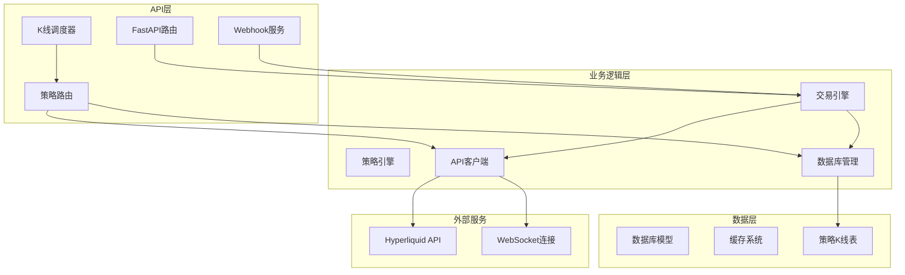
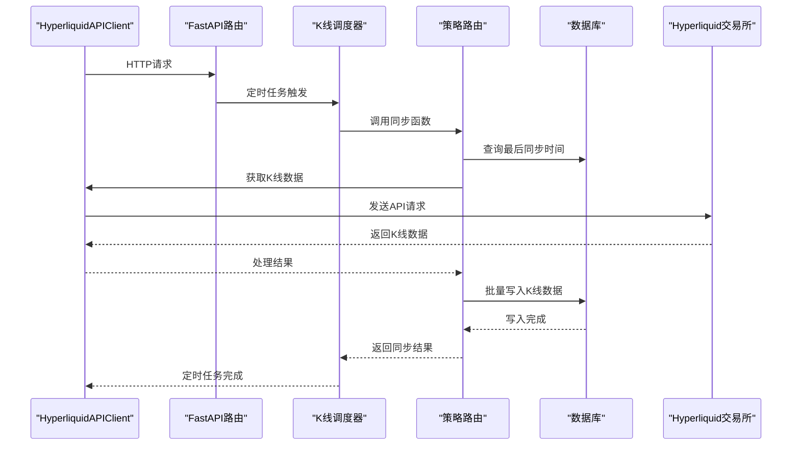
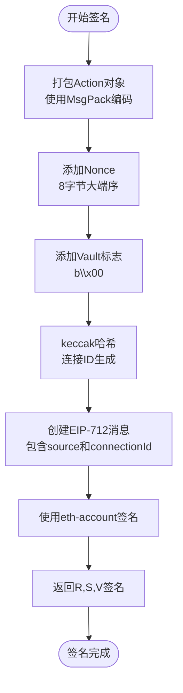
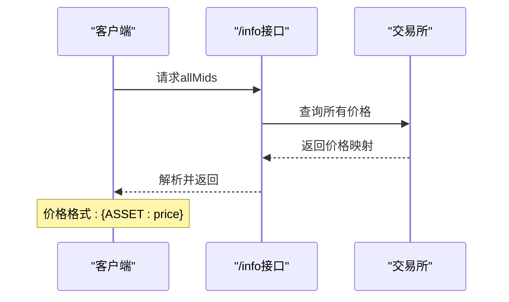
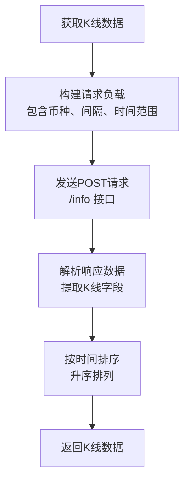
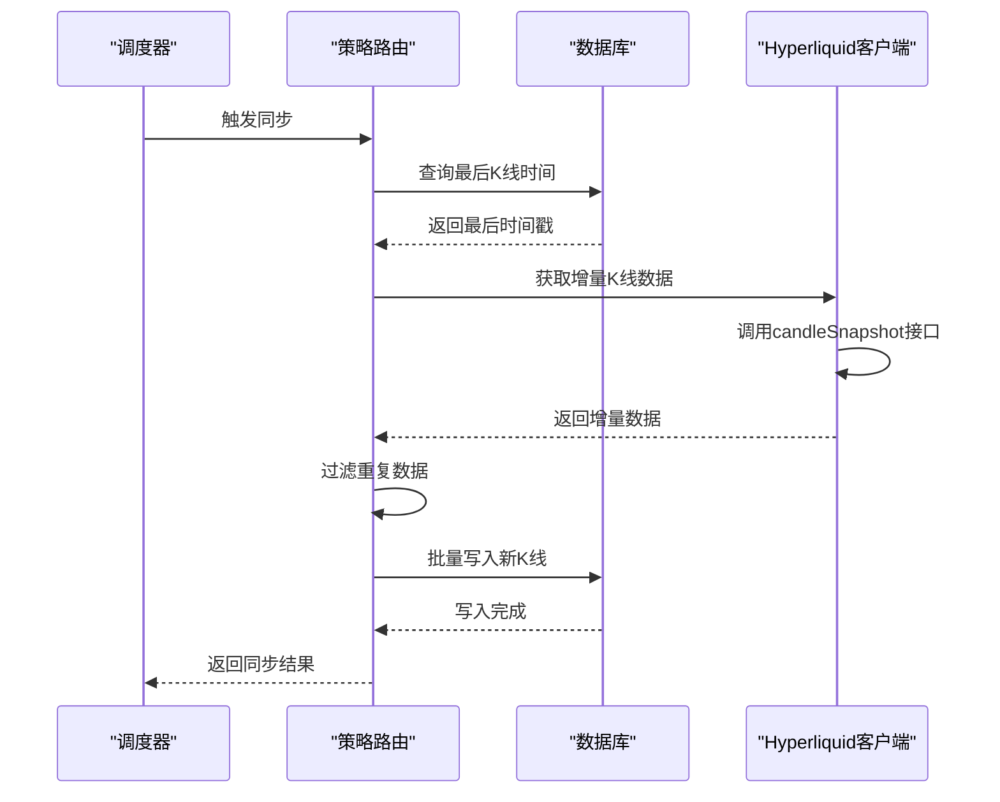
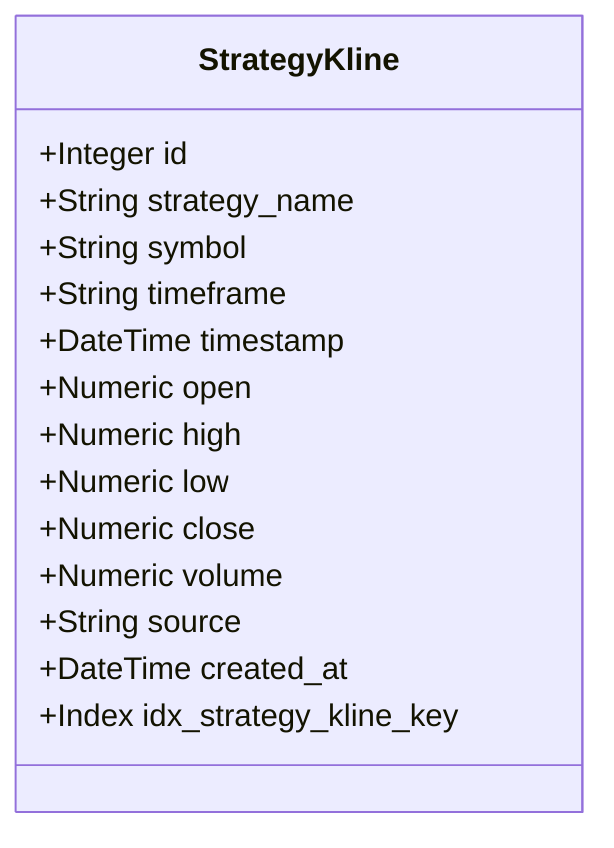
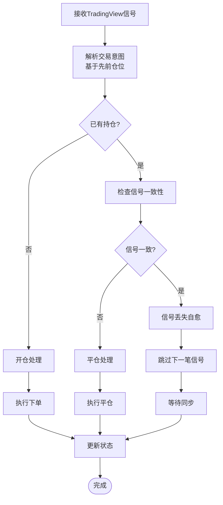
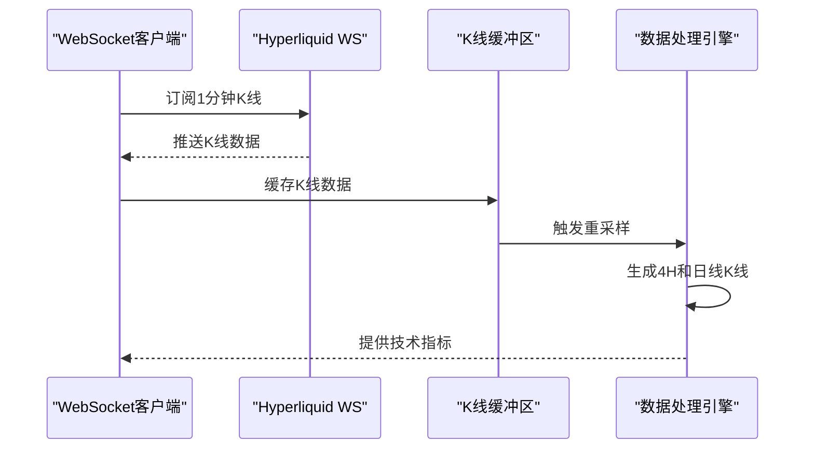
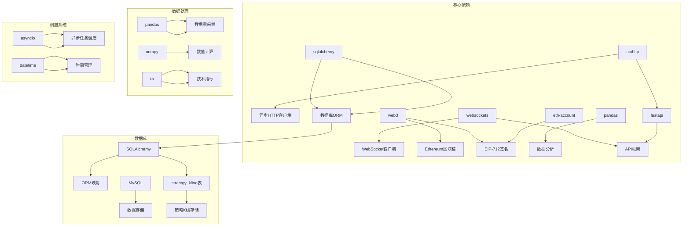

# Hyperliquid交易所集成

<cite>
**本文档引用的文件**
- [hyperliquid_client.py](file://backpack_quant_trading/core/hyperliquid_client.py)
- [hyperliquid_trading.py](file://backpack_quant_trading/engine/hyperliquid_trading.py)
- [trading.py](file://backpack_quant_trading/api/routers/trading.py)
- [strategy.py](file://backpack_quant_trading/api/routers/strategy.py)
- [main.py](file://backpack_quant_trading/api/main.py)
- [settings.py](file://backpack_quant_trading/config/settings.py)
- [webhook_service.py](file://backpack_quant_trading/webhook_service.py)
- [hype_adaptive_short.py](file://backpack_quant_trading/strategy/hype_adaptive_short.py)
- [models.py](file://backpack_quant_trading/database/models.py)
- [requirements.txt](file://backpack_quant_trading/requirements.txt)
</cite>

## 更新摘要
**变更内容**
- 新增策略路由对Hyperliquid市场数据的增量同步支持
- 添加定时任务自动同步K线数据功能
- 增强K线数据获取和存储机制
- 新增手动触发K线同步的API端点

## 目录
1. [简介](#简介)
2. [项目结构](#项目结构)
3. [核心组件](#核心组件)
4. [架构概览](#架构概览)
5. [详细组件分析](#详细组件分析)
6. [依赖关系分析](#依赖关系分析)
7. [性能考虑](#性能考虑)
8. [故障排除指南](#故障排除指南)
9. [结论](#结论)
10. [附录](#附录)

## 简介

本项目是一个完整的Hyperliquid去中心化交易所集成方案，提供了从API客户端到交易引擎的全套实现。Hyperliquid是一个基于以太坊的高性能衍生品交易所，支持永续合约交易、闪电贷和流动性挖矿等DeFi特性。

该集成方案包含了：
- HyperliquidAPIClient类的完整实现
- Webhook交易引擎
- WebSocket实时数据订阅
- HYPE自适应做空策略
- **新增**：策略路由对Hyperliquid市场数据的增量同步功能
- **新增**：定时任务自动同步K线数据
- **新增**：手动触发K线同步的API端点
- 完整的错误处理和日志系统
- RESTful API接口

## 项目结构

项目采用模块化的架构设计，主要分为以下几个层次：



**图表来源**
- [hyperliquid_client.py:18-763](file://backpack_quant_trading/core/hyperliquid_client.py#L18-L763)
- [hyperliquid_trading.py:27-240](file://backpack_quant_trading/engine/hyperliquid_trading.py#L27-L240)
- [strategy.py:35-1619](file://backpack_quant_trading/api/routers/strategy.py#L35-L1619)
- [main.py:66-94](file://backpack_quant_trading/api/main.py#L66-L94)

**章节来源**
- [hyperliquid_client.py:1-763](file://backpack_quant_trading/core/hyperliquid_client.py#L1-L763)
- [hyperliquid_trading.py:1-240](file://backpack_quant_trading/engine/hyperliquid_trading.py#L1-L240)
- [strategy.py:1-1619](file://backpack_quant_trading/api/routers/strategy.py#L1-L1619)
- [main.py:1-221](file://backpack_quant_trading/api/main.py#L1-L221)

## 核心组件

### HyperliquidAPIClient类

HyperliquidAPIClient是整个系统的核心，负责与Hyperliquid交易所进行所有交互。它实现了完整的API协议，包括：

- **身份验证**：支持私钥签名和EIP-712标准
- **市场数据获取**：实时价格、深度图、交易对信息
- **交易执行**：下单、撤单、平仓
- **账户管理**：余额查询、持仓管理
- **协议适配**：严格遵循Hyperliquid的MsgPack和JSON协议
- **K线数据获取**：支持历史K线数据的批量获取

### 增量K线同步系统

**新增功能**：策略路由集成了完整的K线增量同步系统，包括：

- **定时同步**：每天凌晨2:00自动从Hyperliquid同步K线数据
- **手动同步**：提供API端点手动触发K线同步
- **数据库存储**：将K线数据存储到专门的策略K线表中
- **增量更新**：只同步最新的K线数据，避免重复写入

### 交易引擎

HyperliquidTradingEngine提供了完整的交易执行逻辑，包括：

- **信号处理**：接收并解析TradingView信号
- **风险管理**：止损、止盈、仓位控制
- **状态同步**：与交易所保持实时同步
- **自愈机制**：信号丢失检测和自动恢复

### WebSocket集成

系统支持WebSocket实时数据订阅，包括：

- **K线数据**：1分钟K线实时推送
- **价格更新**：实时价格变动通知
- **深度图**：订单簿变更推送
- **事件订阅**：账户状态变化通知

**章节来源**
- [hyperliquid_client.py:18-763](file://backpack_quant_trading/core/hyperliquid_client.py#L18-L763)
- [hyperliquid_trading.py:27-240](file://backpack_quant_trading/engine/hyperliquid_trading.py#L27-L240)
- [strategy.py:35-1619](file://backpack_quant_trading/api/routers/strategy.py#L35-L1619)
- [hype_adaptive_short.py:197-800](file://backpack_quant_trading/strategy/hype_adaptive_short.py#L197-L800)

## 架构概览

系统采用分层架构设计，确保了良好的可维护性和扩展性：



**图表来源**
- [main.py:71-94](file://backpack_quant_trading/api/main.py#L71-L94)
- [strategy.py:78-159](file://backpack_quant_trading/api/routers/strategy.py#L78-L159)

## 详细组件分析

### HyperliquidAPIClient实现详解

#### EIP-712签名机制

HyperliquidAPIClient实现了严格的EIP-712签名机制：



**图表来源**
- [hyperliquid_client.py:483-533](file://backpack_quant_trading/core/hyperliquid_client.py#L483-L533)

#### 交易对配置和精度处理

系统支持多种交易对格式，并提供精确的价格和数量处理：

| 交易对格式 | 示例 | 用途 |
|-----------|------|------|
| 基础币种 | ETH, BTC | 标准交易对 |
| USDC永续 | ETH_USDC_PERP | 稳定币计价 |
| USDT永续 | ETH-USDT-SWAP | 美元计价 |
| PERP合约 | ETH-PERP | 合约交易 |

#### 市场数据获取流程



**图表来源**
- [hyperliquid_client.py:81-86](file://backpack_quant_trading/core/hyperliquid_client.py#L81-L86)

**章节来源**
- [hyperliquid_client.py:18-763](file://backpack_quant_trading/core/hyperliquid_client.py#L18-L763)

### 增量K线同步系统

**新增功能**：完整的K线增量同步系统

#### K线数据获取函数



**图表来源**
- [strategy.py:35-60](file://backpack_quant_trading/api/routers/strategy.py#L35-L60)

#### 增量同步流程



**图表来源**
- [strategy.py:78-159](file://backpack_quant_trading/api/routers/strategy.py#L78-L159)

#### 数据库模型

系统使用专门的StrategyKline模型存储策略相关的K线数据：



**图表来源**
- [strategy.py:195-216](file://backpack_quant_trading/api/routers/strategy.py#L195-L216)

**章节来源**
- [strategy.py:35-1619](file://backpack_quant_trading/api/routers/strategy.py#L35-L1619)

### 交易引擎工作流程

#### 信号处理和意图解析

交易引擎实现了复杂的信号处理逻辑：



**图表来源**
- [hyperliquid_trading.py:79-161](file://backpack_quant_trading/engine/hyperliquid_trading.py#L79-L161)

#### 风险管理机制

系统内置了多重风险控制机制：

- **止损控制**：基于百分比的自动止损
- **止盈控制**：固定止盈点位
- **仓位管理**：最大仓位比例控制
- **熔断保护**：信号丢失检测和自愈

**章节来源**
- [hyperliquid_trading.py:27-240](file://backpack_quant_trading/engine/hyperliquid_trading.py#L27-L240)

### WebSocket实时数据集成

#### K线数据处理

系统支持WebSocket实时K线数据订阅：



**图表来源**
- [hype_adaptive_short.py:426-506](file://backpack_quant_trading/strategy/hype_adaptive_short.py#L426-L506)

#### 实时价格监控

系统提供实时价格监控功能：

- **价格订阅**：订阅allMids实时价格
- **价格缓存**：本地价格缓存和更新
- **异常检测**：价格异常波动检测
- **延迟监控**：WebSocket连接延迟监控

**章节来源**
- [hype_adaptive_short.py:375-564](file://backpack_quant_trading/strategy/hype_adaptive_short.py#L375-L564)

## 依赖关系分析

系统的关键依赖关系如下：



**图表来源**
- [requirements.txt:1-61](file://backpack_quant_trading/requirements.txt#L1-L61)

**章节来源**
- [requirements.txt:1-61](file://backpack_quant_trading/requirements.txt#L1-L61)

## 性能考虑

### 并发处理优化

系统采用了多种并发优化策略：

- **异步I/O**：使用aiohttp和websockets实现非阻塞I/O
- **连接池管理**：复用HTTP和WebSocket连接
- **批量请求**：合并多个API请求减少网络开销
- **缓存机制**：本地缓存常用数据减少API调用
- **异步调度**：使用asyncio进行任务调度，避免阻塞

### 内存管理

- **K线数据缓存**：使用deque限制内存使用
- **事件循环管理**：合理管理异步任务生命周期
- **资源清理**：确保连接和文件句柄正确关闭
- **数据库连接池**：复用数据库连接减少开销

### 网络优化

- **连接复用**：WebSocket连接复用多个订阅
- **心跳机制**：定期发送ping保持连接活跃
- **重连策略**：自动重连和退避算法
- **批量写入**：使用SQLAlchemy Core进行批量数据写入

### 增量同步优化

- **时间窗口**：只获取必要的时间范围数据
- **去重处理**：过滤重复的K线数据
- **批量写入**：使用原生SQL插入避免ORM开销
- **索引优化**：为查询字段建立适当的数据库索引

**章节来源**
- [strategy.py:63-76](file://backpack_quant_trading/api/routers/strategy.py#L63-L76)

## 故障排除指南

### 常见问题及解决方案

#### 私钥相关问题

**问题**：私钥格式错误
**症状**：初始化时抛出ValueError
**解决方案**：
1. 确保私钥为64位十六进制字符串
2. 私钥不要包含0x前缀
3. 验证私钥有效性

#### API调用失败

**问题**：HTTP 401或403错误
**症状**：签名验证失败
**解决方案**：
1. 检查私钥是否正确
2. 验证时间戳是否过期
3. 确认网络连接正常

#### WebSocket连接问题

**问题**：WebSocket连接中断
**症状**：K线数据停止更新
**解决方案**：
1. 检查网络连接
2. 验证代理设置
3. 实现自动重连机制

#### 交易执行失败

**问题**：订单无法执行
**症状**：下单返回错误
**解决方案**：
1. 检查账户余额
2. 验证杠杆设置
3. 确认价格精度要求

#### K线同步失败

**问题**：K线数据同步失败
**症状**：定时任务或手动同步失败
**解决方案**：
1. 检查Hyperliquid API连接
2. 验证数据库连接
3. 查看日志获取详细错误信息
4. 确认时间范围参数正确

**章节来源**
- [hyperliquid_client.py:316-318](file://backpack_quant_trading/core/hyperliquid_client.py#L316-L318)
- [webhook_service.py:34-45](file://backpack_quant_trading/webhook_service.py#L34-L45)

### 日志分析

系统提供了详细的日志记录：

- **调试日志**：详细的操作步骤和参数
- **错误日志**：异常信息和堆栈跟踪
- **性能日志**：API调用时间和成功率
- **交易日志**：订单执行和状态变化
- **K线同步日志**：定时任务和手动同步的状态信息

**章节来源**
- [webhook_service.py:14-24](file://backpack_quant_trading/webhook_service.py#L14-L24)

## 结论

本Hyperliquid交易所集成为去中心化金融交易提供了完整的解决方案。系统具有以下特点：

- **完整性**：涵盖了从API集成到交易执行的所有环节
- **可靠性**：完善的错误处理和自愈机制
- **可扩展性**：模块化设计支持功能扩展
- **性能优化**：异步处理和缓存机制提升效率
- **智能化**：新增的K线增量同步和定时任务功能
- **自动化**：支持自动化的数据同步和策略执行

该集成方案为开发者提供了清晰的实现参考，可以作为其他去中心化交易所集成的基础模板。新增的K线同步功能特别适合需要历史数据回测和实时监控的量化交易场景。

## 附录

### 配置参数说明

| 参数名称 | 类型 | 默认值 | 描述 |
|---------|------|--------|------|
| HYPERLIQUID_PRIVATE_KEY | string | "" | Hyperliquid账户私钥 |
| HYPERLIQUID_AGENT_ADDRESS | string | "" | 代理地址（可选） |
| WEBHOOK_SECRET | string | "your-secret-key-here" | Webhook签名密钥 |
| WEBHOOK_PORT | int | 8005 | Webhook服务端口 |
| DATABASE_URL | string | "mysql://..." | 数据库连接URL |

### API端点说明

#### K线同步相关端点

| 端点 | 方法 | 功能描述 |
|------|------|----------|
| /api/strategy/hype-4h/sync-klines | POST | 从Hyperliquid增量同步HYPE 4H K线 |
| /api/strategy/eth-only-2h/sync-klines | POST | 从Hyperliquid增量同步ETH 2H K线 |
| /api/strategy/sync-all-klines | POST | 手动触发HYPE+ETH K线同步 |
| /api/strategy/hype-4h/klines | GET | 获取HYPE 4H K线数据 |
| /api/strategy/eth-only-2h/klines | GET | 获取ETH 2H K线数据 |

#### 定时任务配置

系统会在每天凌晨2:00自动执行K线同步任务，无需额外配置。

### 集成示例

#### 基本配置

```python
# 配置Hyperliquid私钥
os.environ["HYPERLIQUID_PRIVATE_KEY"] = "your_private_key_here"

# 启动Webhook服务
uvicorn.run(webhook_app, host="0.0.0.0", port=8005)
```

#### 策略启动

```python
# 启动HYPE自适应做空策略
response = requests.post(
    "http://localhost:8005/trading/hype/start",
    json={
        "symbol": "ETH",
        "private_key": "your_private_key"
    }
)
```

#### 手动同步K线数据

```python
# 同步HYPE 4H K线
response = requests.post(
    "http://localhost:8005/api/strategy/hype-4h/sync-klines"
)

# 同步ETH 2H K线
response = requests.post(
    "http://localhost:8005/api/strategy/eth-only-2h/sync-klines"
)

# 同时同步两种K线
response = requests.post(
    "http://localhost:8005/api/strategy/sync-all-klines"
)
```

#### 获取K线数据

```python
# 获取HYPE 4H K线
response = requests.get(
    "http://localhost:8005/api/strategy/hype-4h/klines"
)

# 获取ETH 2H K线
response = requests.get(
    "http://localhost:8005/api/strategy/eth-only-2h/klines"
)
```