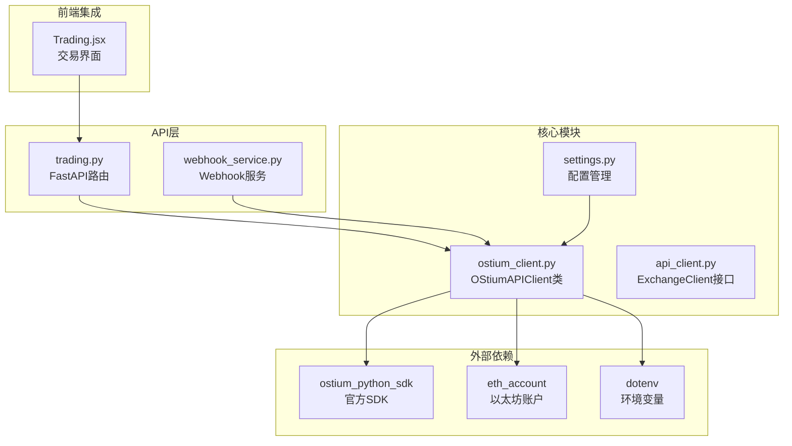
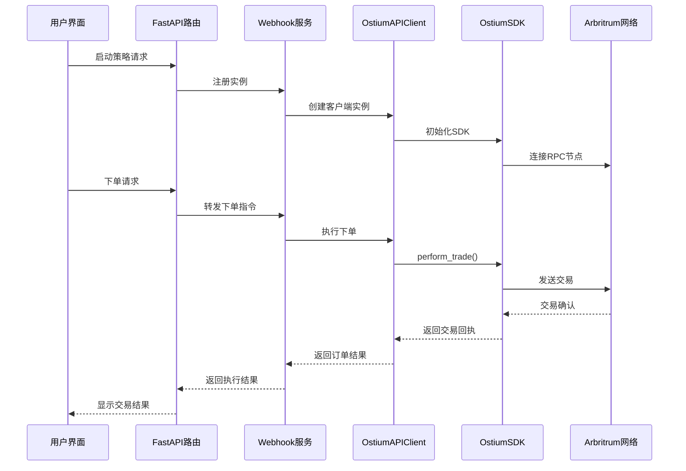
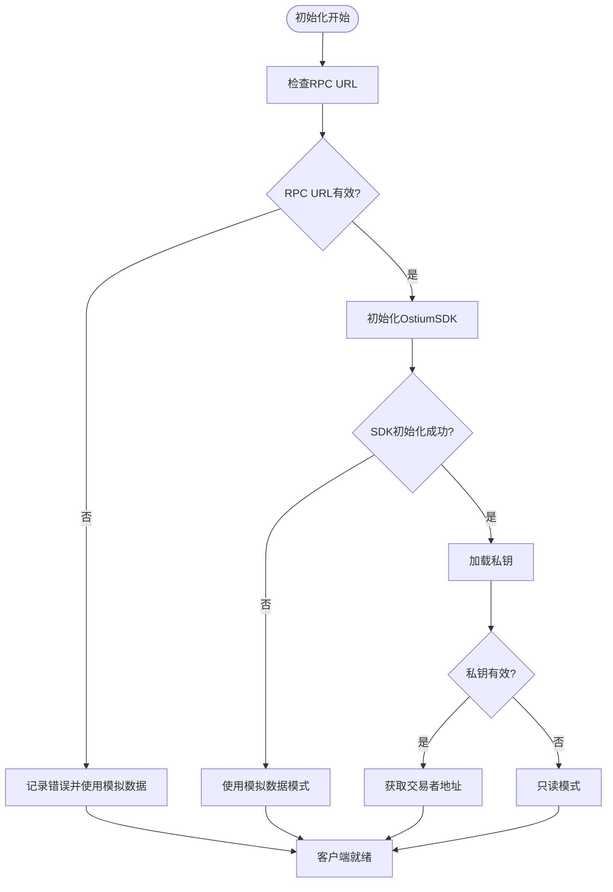
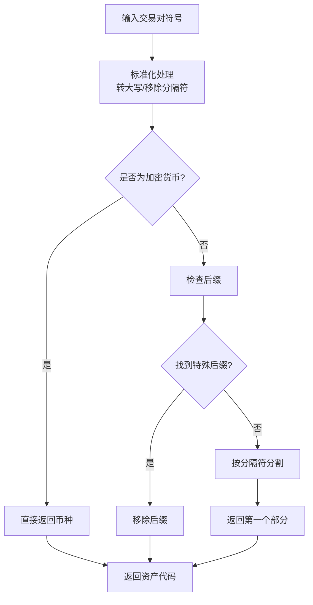
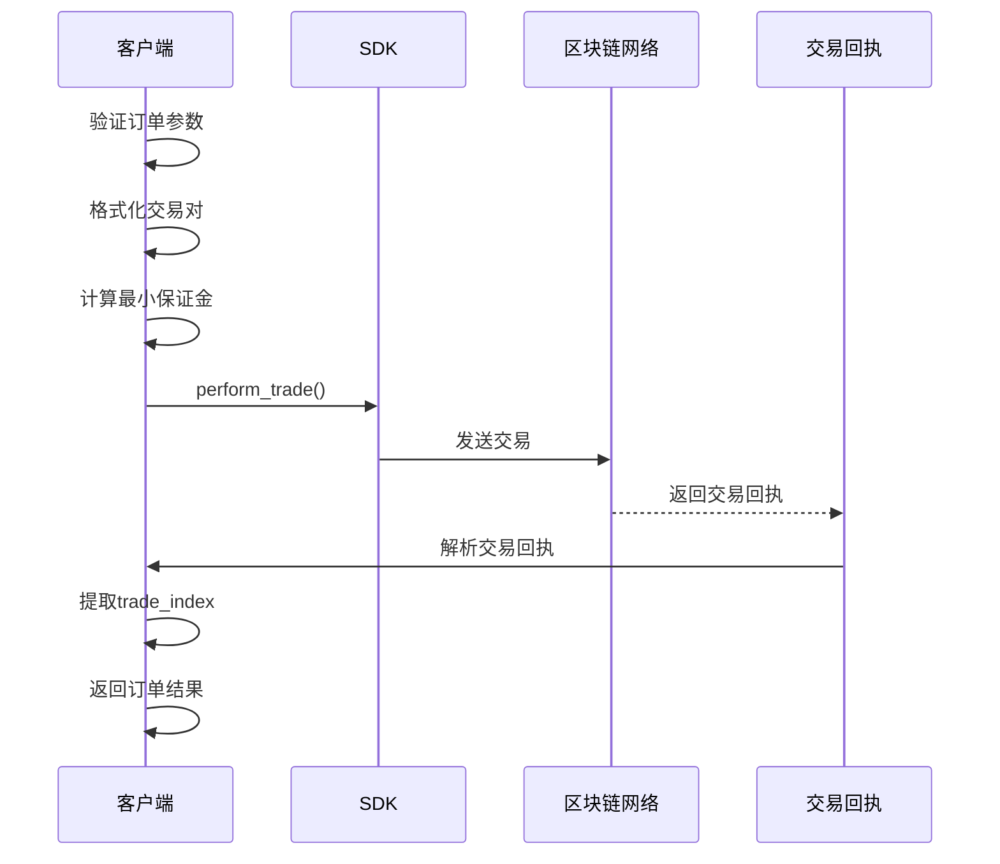
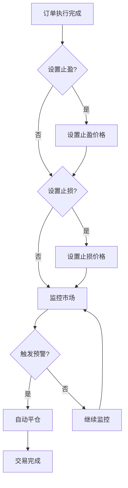
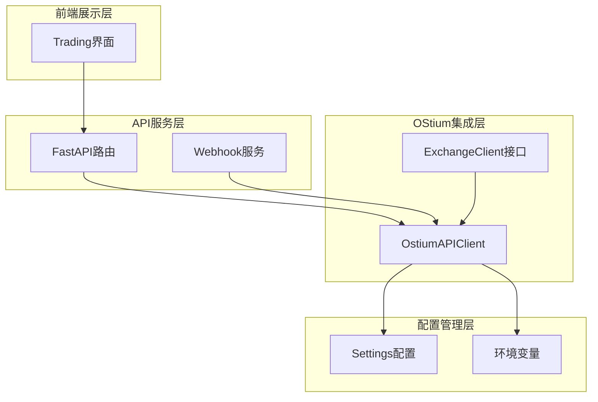

# OStium交易所集成

<cite>
**本文档引用的文件**
- [ostium_client.py](file://backpack_quant_trading/core/ostium_client.py)
- [settings.py](file://backpack_quant_trading/config/settings.py)
- [api_client.py](file://backpack_quant_trading/core/api_client.py)
- [trading.py](file://backpack_quant_trading/api/routers/trading.py)
- [webhook_service.py](file://backpack_quant_trading/webhook_service.py)
- [Trading.jsx](file://backpack_quant_trading/frontend/src/views/Trading.jsx)
- [.env](file://backpack_quant_trading/.env)
</cite>

## 目录
1. [简介](#简介)
2. [项目结构](#项目结构)
3. [核心组件](#核心组件)
4. [架构概览](#架构概览)
5. [详细组件分析](#详细组件分析)
6. [依赖关系分析](#依赖关系分析)
7. [性能考虑](#性能考虑)
8. [故障排除指南](#故障排除指南)
9. [结论](#结论)
10. [附录](#附录)

## 简介

OStium交易所集成是Backpack量化交易系统中的重要组成部分，负责与OStium去中心化衍生品交易所进行交互。OStium是一个基于Arbitrum网络的高性能去中心化衍生品交易平台，支持多种资产类别，包括加密货币、外汇和股指期货。

本集成文档详细介绍了OStiumAPIClient类的实现原理、API接口设计、认证机制和数据传输格式，涵盖了市场数据、交易功能和账户管理的完整实现。同时提供了OStium特有的功能介绍和使用指南，以及实际的代码示例和集成最佳实践。

## 项目结构

OStium集成在项目中的组织结构如下：

**图表来源**
- [ostium_client.py:1-18](file://backpack_quant_trading/core/ostium_client.py#L1-L18)
- [settings.py:68-75](file://backpack_quant_trading/config/settings.py#L68-L75)

**章节来源**
- [ostium_client.py:1-1235](file://backpack_quant_trading/core/ostium_client.py#L1-L1235)
- [settings.py:104-132](file://backpack_quant_trading/config/settings.py#L104-L132)

## 核心组件

### OstiumAPIClient类

OStiumAPIClient是整个集成的核心类，负责与OStium交易所的所有交互。该类实现了完整的交易生命周期管理，包括市场数据获取、订单执行、账户管理和风险管理等功能。

#### 主要特性

1. **多网络支持**：支持主网(mainnet)和测试网(testnet)两种网络环境
2. **链上交易**：通过以太坊私钥进行链上签名和交易执行
3. **智能SDK初始化**：具备SDK初始化失败时的降级处理机制
4. **多格式交易对支持**：支持多种交易对格式的解析和转换

#### 关键方法概览

- `get_markets()`: 获取可用交易对列表
- `get_price()`: 获取指定交易对的实时价格
- `place_order()`: 执行下单操作
- `get_positions()`: 获取当前持仓信息
- `execute_order()`: 执行订单（适配ExchangeClient接口）

**章节来源**
- [ostium_client.py:19-736](file://backpack_quant_trading/core/ostium_client.py#L19-L736)

## 架构概览

OStium集成采用分层架构设计，确保了系统的可扩展性和可维护性：

**图表来源**
- [trading.py:350-412](file://backpack_quant_trading/api/routers/trading.py#L350-L412)
- [webhook_service.py:193-210](file://backpack_quant_trading/webhook_service.py#L193-L210)

## 详细组件分析

### 1. SDK初始化机制

OStiumAPIClient采用智能的SDK初始化策略，确保在各种环境下都能正常工作：

**图表来源**
- [ostium_client.py:52-78](file://backpack_quant_trading/core/ostium_client.py#L52-L78)
- [ostium_client.py:42-51](file://backpack_quant_trading/core/ostium_client.py#L42-L51)

**章节来源**
- [ostium_client.py:52-78](file://backpack_quant_trading/core/ostium_client.py#L52-L78)

### 2. 交易对解析系统

OStium支持多种交易对格式，系统内置了强大的解析机制：

#### 支持的交易对格式

| 格式示例 | 描述 | 解析规则 |
|---------|------|----------|
| ETH-USD | 标准格式 | 直接提取ETH |
| ETH-USDT-SWAP | 合约格式 | 移除-SWAP后缀 |
| ETH_USDC_PERP | 永续合约 | 移除_PERP后缀 |
| BTC-USD | 传统货币 | 直接提取BTC |
| EUR-USD | 欧元对 | 直接提取EUR |

#### 解析算法流程

**图表来源**
- [ostium_client.py:193-225](file://backpack_quant_trading/core/ostium_client.py#L193-L225)

**章节来源**
- [ostium_client.py:193-225](file://backpack_quant_trading/core/ostium_client.py#L193-L225)

### 3. 订单执行系统

订单执行系统是OStium集成的核心功能，支持多种订单类型和复杂的风控机制：

#### 订单类型支持

| 订单类型 | 描述 | 适用场景 |
|---------|------|----------|
| MARKET | 市价单 | 快速入场/出场 |
| LIMIT | 限价单 | 精确价格执行 |
| STOP | 止损单 | 风险控制 |

#### 订单执行流程

**图表来源**
- [ostium_client.py:452-624](file://backpack_quant_trading/core/ostium_client.py#L452-L624)

**章节来源**
- [ostium_client.py:452-624](file://backpack_quant_trading/core/ostium_client.py#L452-L624)

### 4. 风险管理系统

OStium集成了完善的风险管理系统，包括止损和止盈功能：

#### 止损止盈实现

**图表来源**
- [ostium_client.py:1128-1147](file://backpack_quant_trading/core/ostium_client.py#L1128-L1147)

**章节来源**
- [ostium_client.py:1128-1147](file://backpack_quant_trading/core/ostium_client.py#L1128-L1147)

## 依赖关系分析

### 外部依赖

OStium集成依赖以下关键外部库：

| 依赖库 | 版本 | 用途 |
|--------|------|------|
| ostium_python_sdk | 最新版本 | 官方SDK，提供核心API接口 |
| eth_account | 最新版本 | 以太坊账户管理和私钥处理 |
| web3 | 最新版本 | 与以太坊网络交互 |
| dotenv | 最新版本 | 环境变量管理 |

### 内部依赖关系

**图表来源**
- [ostium_client.py:13-14](file://backpack_quant_trading/core/ostium_client.py#L13-L14)
- [settings.py:104-113](file://backpack_quant_trading/config/settings.py#L104-L113)

**章节来源**
- [ostium_client.py:13-14](file://backpack_quant_trading/core/ostium_client.py#L13-L14)
- [settings.py:104-113](file://backpack_quant_trading/config/settings.py#L104-L113)

## 性能考虑

### 1. 异步处理优化

系统采用异步编程模型，充分利用异步I/O提高性能：

- **并发请求**：多个API请求可以并行执行
- **事件循环**：使用asyncio事件循环管理异步任务
- **超时控制**：为所有网络请求设置合理的超时时间

### 2. 缓存策略

- **市场数据缓存**：交易对信息缓存1小时
- **错误重试**：网络请求失败时自动重试
- **降级处理**：SDK初始化失败时使用模拟数据

### 3. 内存管理

- **对象池**：复用常用对象减少内存分配
- **及时清理**：定期清理不再使用的资源
- **监控告警**：监控内存使用情况

## 故障排除指南

### 常见问题及解决方案

#### 1. SDK初始化失败

**症状**：日志显示"Ostium SDK初始化失败"

**解决方案**：
- 检查RPC URL配置是否正确
- 验证网络连接状态
- 确认私钥格式正确
- 查看网络状态和API限制

#### 2. 交易执行错误

**症状**：下单失败，返回错误信息

**解决方案**：
- 检查最小保证金要求
- 验证私钥余额充足
- 确认网络费用预算
- 查看交易对手状态

#### 3. 价格获取异常

**症状**：无法获取实时价格

**解决方案**：
- 检查交易对格式是否正确
- 验证SDK版本兼容性
- 确认网络连接稳定
- 查看交易所API状态

**章节来源**
- [ostium_client.py:74-78](file://backpack_quant_trading/core/ostium_client.py#L74-L78)
- [ostium_client.py:456-462](file://backpack_quant_trading/core/ostium_client.py#L456-L462)

## 结论

OStium交易所集成为Backpack量化交易系统提供了完整的去中心化衍生品交易能力。通过精心设计的架构和完善的错误处理机制，系统能够在各种复杂环境下稳定运行。

主要优势包括：
- **完整的功能覆盖**：从市场数据到订单执行的全流程支持
- **灵活的配置管理**：支持多网络和多环境配置
- **强大的错误处理**：具备完善的降级和恢复机制
- **优秀的性能表现**：采用异步编程和缓存策略

未来改进方向：
- 增强实时数据获取能力
- 优化用户体验界面
- 扩展更多交易对支持
- 加强安全防护措施

## 附录

### 配置参数说明

| 参数名 | 类型 | 默认值 | 说明 |
|--------|------|--------|------|
| OSTIUM_RPC_URL | string | Arbitrum主网RPC | RPC节点URL |
| OSTIUM_PRIVATE_KEY | string | 空 | 以太坊私钥 |
| OSTIUM_NETWORK | string | mainnet | 网络类型(testnet/mainnet) |
| OSTIUM_SYMBOL | string | NDX-USD | 默认交易对 |
| OSTIUM_LEVERAGE | int | 5 | 默认杠杆倍数 |

### API接口规范

#### 基础接口

| 接口 | 方法 | 参数 | 返回值 | 说明 |
|------|------|------|--------|------|
| /api/v1/markets | GET | 无 | List[Market] | 获取市场列表 |
| /api/v1/ticker | GET | symbol | Ticker | 获取价格信息 |
| /api/v1/orders | POST | Order | Order | 下单 |
| /api/v1/positions | GET | symbol | List[Position] | 获取持仓 |

### 集成最佳实践

1. **配置管理**：使用环境变量管理敏感信息
2. **错误处理**：实现完善的异常捕获和处理机制
3. **性能优化**：合理使用异步编程和缓存策略
4. **安全考虑**：保护私钥和API密钥安全
5. **监控告警**：建立完善的日志和监控体系