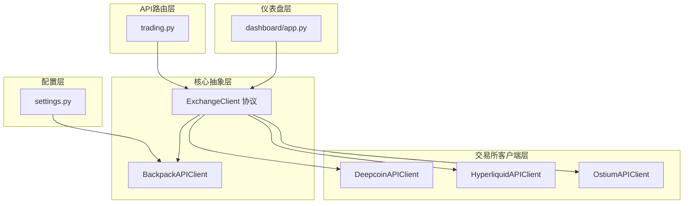
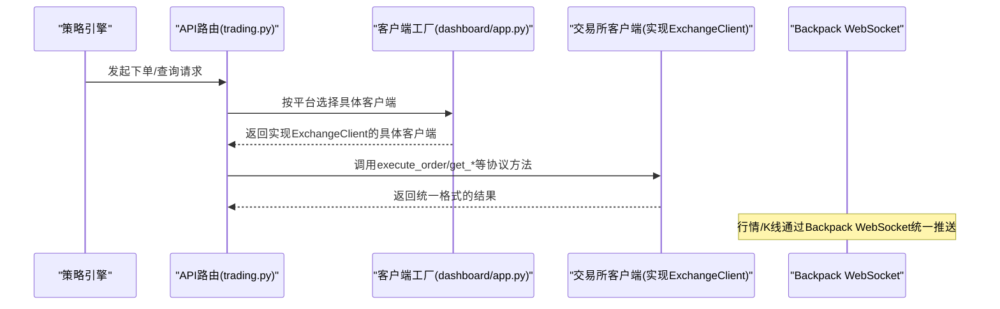
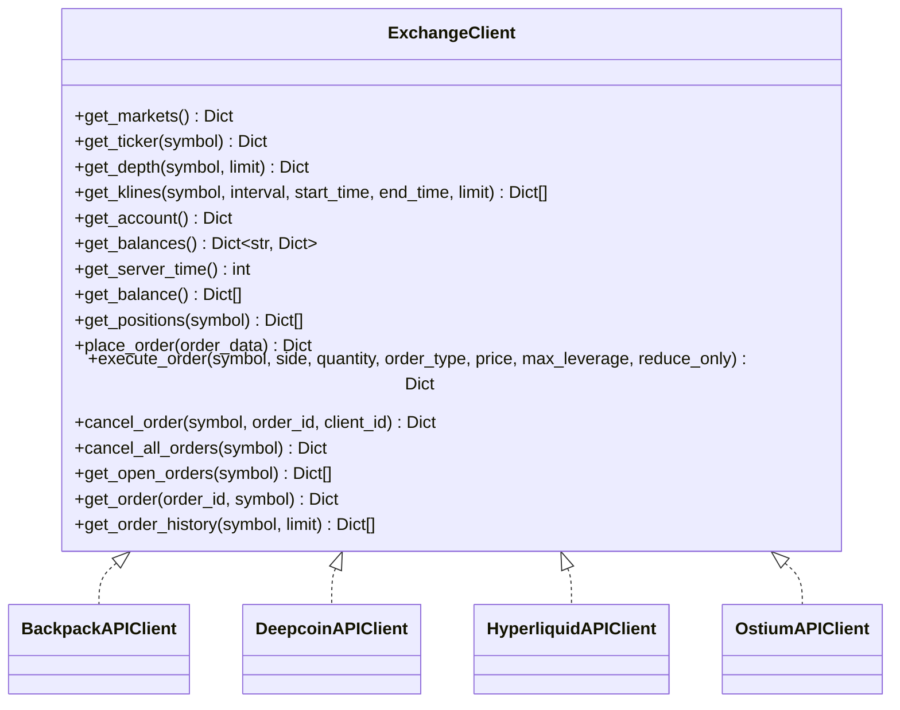
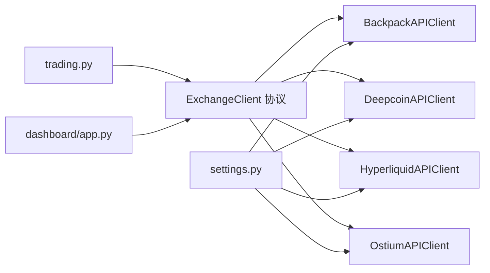

# 交易所客户端抽象设计

<cite>
**本文档引用的文件**
- [api_client.py](file://backpack_quant_trading/core/api_client.py)
- [deepcoin_client.py](file://backpack_quant_trading/core/deepcoin_client.py)
- [hyperliquid_client.py](file://backpack_quant_trading/core/hyperliquid_client.py)
- [ostium_client.py](file://backpack_quant_trading/core/ostium_client.py)
- [settings.py](file://backpack_quant_trading/config/settings.py)
- [trading.py](file://backpack_quant_trading/api/routers/trading.py)
- [app.py](file://backpack_quant_trading/dashboard/app.py)
</cite>

## 目录
1. [简介](#简介)
2. [项目结构](#项目结构)
3. [核心组件](#核心组件)
4. [架构总览](#架构总览)
5. [详细组件分析](#详细组件分析)
6. [依赖关系分析](#依赖关系分析)
7. [性能考量](#性能考量)
8. [故障排除指南](#故障排除指南)
9. [结论](#结论)
10. [附录](#附录)

## 简介
本文件系统性阐述交易所客户端抽象设计，围绕 ExchangeClient 协议的设计理念、接口规范与实现原理展开，解释统一接口封装带来的优势，并对比 Backpack、Deepcoin、Hyperliquid、Ostium 等多家交易所客户端的共同特性与差异，给出新交易所集成的开发指南与最佳实践，以及扩展性与维护策略。

## 项目结构
该项目采用分层架构，核心抽象位于 core 层，配置集中于 config 层，API 路由与业务逻辑在 api 层，仪表盘在 dashboard 层。交易所客户端抽象位于 core/api_client.py，具体交易所客户端分别在 core/ 下的独立文件中实现。

**图表来源**
- [api_client.py:22-85](file://backpack_quant_trading/core/api_client.py#L22-L85)
- [deepcoin_client.py:18-488](file://backpack_quant_trading/core/deepcoin_client.py#L18-L488)
- [hyperliquid_client.py:18-546](file://backpack_quant_trading/core/hyperliquid_client.py#L18-L546)
- [ostium_client.py:19-800](file://backpack_quant_trading/core/ostium_client.py#L19-L800)
- [settings.py:104-137](file://backpack_quant_trading/config/settings.py#L104-L137)
- [trading.py:334-462](file://backpack_quant_trading/api/routers/trading.py#L334-L462)
- [app.py:3585-3595](file://backpack_quant_trading/dashboard/app.py#L3585-L3595)

**章节来源**
- [api_client.py:1-1302](file://backpack_quant_trading/core/api_client.py#L1-L1302)
- [settings.py:1-137](file://backpack_quant_trading/config/settings.py#L1-L137)

## 核心组件
- ExchangeClient 协议：定义统一的交易所接口规范，覆盖市场、行情、账户、订单等核心能力，确保策略与交易引擎可无缝切换不同交易所。
- 具体交易所客户端：BackpackAPIClient、DeepcoinAPIClient、HyperliquidAPIClient、OstiumAPIClient，均实现 ExchangeClient 协议，提供各自交易所的差异化适配。
- 配置中心：settings.py 提供各交易所的 API 基础地址、密钥与参数配置，支持环境变量注入与默认值。
- API 路由与仪表盘：trading.py 与 dashboard/app.py 通过工厂模式按平台选择具体客户端，支撑实盘启动与可视化。

**章节来源**
- [api_client.py:22-85](file://backpack_quant_trading/core/api_client.py#L22-L85)
- [deepcoin_client.py:18-488](file://backpack_quant_trading/core/deepcoin_client.py#L18-L488)
- [hyperliquid_client.py:18-546](file://backpack_quant_trading/core/hyperliquid_client.py#L18-L546)
- [ostium_client.py:19-800](file://backpack_quant_trading/core/ostium_client.py#L19-L800)
- [settings.py:104-137](file://backpack_quant_trading/config/settings.py#L104-L137)
- [trading.py:334-462](file://backpack_quant_trading/api/routers/trading.py#L334-L462)
- [app.py:3585-3595](file://backpack_quant_trading/dashboard/app.py#L3585-L3595)

## 架构总览
统一接口封装的核心思想是：行情与K线（无需认证）统一走 Backpack WebSocket，下单与账户等需要认证的能力通过 ExchangeClient 协议抽象，策略与引擎仅依赖协议，不关心具体交易所实现细节。

**图表来源**
- [api_client.py:22-85](file://backpack_quant_trading/core/api_client.py#L22-L85)
- [trading.py:334-462](file://backpack_quant_trading/api/routers/trading.py#L334-L462)
- [app.py:3585-3595](file://backpack_quant_trading/dashboard/app.py#L3585-L3595)

## 详细组件分析

### ExchangeClient 协议设计
- 设计理念：通过协议抽象下单与账户相关能力，使策略与引擎与交易所实现解耦；行情/K线统一经 Backpack WebSocket，避免重复适配。
- 接口规范：包含 get_markets、get_ticker、get_depth、get_klines、get_account、get_balances、get_server_time、get_balance、get_positions、place_order、execute_order、cancel_order、cancel_all_orders、get_open_orders、get_order、get_order_history 等方法，参数与返回值统一格式，便于策略兼容。
- 优势：降低多交易所切换成本，提升可测试性与可维护性；便于扩展新交易所与统一风控、日志与监控。

**图表来源**
- [api_client.py:22-85](file://backpack_quant_trading/core/api_client.py#L22-L85)
- [deepcoin_client.py:18-488](file://backpack_quant_trading/core/deepcoin_client.py#L18-L488)
- [hyperliquid_client.py:18-546](file://backpack_quant_trading/core/hyperliquid_client.py#L18-L546)
- [ostium_client.py:19-800](file://backpack_quant_trading/core/ostium_client.py#L19-L800)

**章节来源**
- [api_client.py:22-85](file://backpack_quant_trading/core/api_client.py#L22-L85)

### BackpackAPIClient 实现
- 认证机制：支持 ED25519 密钥认证与 Cookie 认证，优先级可配置；签名参数处理、时间戳与窗口校验。
- 数据精度：提供 get_quantity_precision、get_price_precision，兼容 Backpack 返回字段。
- 市场与账户：get_markets、get_account、get_balances、get_positions、get_server_time 等。
- 订单执行：place_order、execute_order（统一字段映射与状态归一化）、cancel_order、cancel_all_orders、get_open_orders、get_order、get_order_history。
- WebSocket：BackpackWebSocketClient 提供统一行情订阅与回调处理，支持私有流与心跳重连。

**章节来源**
- [api_client.py:87-546](file://backpack_quant_trading/core/api_client.py#L87-L546)
- [api_client.py:549-1302](file://backpack_quant_trading/core/api_client.py#L549-L1302)

### DeepcoinAPIClient 实现
- 协议适配：实现 ExchangeClient 协议，内部使用 aiohttp 异步请求；与 Backpack 数据客户端分离，行情仍走 Backpack。
- 符号映射：提供 _map_symbol/_unmap_symbol，将 Backpack 格式与 Deepcoin 格式互转。
- 接口实现：get_markets、get_ticker、get_depth、get_klines、get_server_time、get_account、get_balances、get_balance、get_positions、place_order、execute_order、cancel_order、cancel_all_orders、get_open_orders、get_order、get_order_history。
- 特殊处理：处理 429 限流、JSON 解析异常、状态码非 0 的错误返回。

**章节来源**
- [deepcoin_client.py:18-488](file://backpack_quant_trading/core/deepcoin_client.py#L18-L488)

### HyperliquidAPIClient 实现
- 链上签名：使用 EIP-712 签名，严格遵循字段顺序与 MsgPack 规范；支持主网/测试网区分。
- 资产与杠杆：通过 get_meta 获取资产 ID 与精度；下单前设置杠杆；平仓使用 reduce_only。
- 接口实现：get_balance、get_positions、place_order、execute_order、get_open_orders、get_order、close_position、cancel_order_async 等。
- 价格与滑点：市价单自动加减滑点，确保成交；限价单可传入 price 或使用当前价。

**章节来源**
- [hyperliquid_client.py:18-546](file://backpack_quant_trading/core/hyperliquid_client.py#L18-L546)

### OstiumAPIClient 实现
- SDK 集成：使用 ostium_python_sdk，支持 mainnet/testnet；可降级为模拟数据。
- 价格与 K 线：get_price 支持 USDJPY 等特殊处理；get_klines 通过 subgraph 获取历史数据，若不可用返回空列表。
- 资金费率：get_funding_rate 从子图获取；下单时检查最小抵押要求。
- 接口实现：get_markets、get_price、get_klines、get_funding_rate、place_order、execute_order、get_order 等。

**章节来源**
- [ostium_client.py:19-800](file://backpack_quant_trading/core/ostium_client.py#L19-L800)

### 配置中心与工厂模式
- 配置中心：settings.py 提供各交易所的 API 基础地址、密钥与参数，支持环境变量注入。
- 工厂模式：dashboard/app.py 根据 exchange 参数动态导入并实例化对应客户端；trading.py 提供统一的实盘启动接口，按平台选择客户端。

**章节来源**
- [settings.py:104-137](file://backpack_quant_trading/config/settings.py#L104-L137)
- [app.py:3585-3595](file://backpack_quant_trading/dashboard/app.py#L3585-L3595)
- [trading.py:334-462](file://backpack_quant_trading/api/routers/trading.py#L334-L462)

## 依赖关系分析
- 协议到实现：ExchangeClient 为抽象契约，Backpack、Deepcoin、Hyperliquid、Ostium 均实现该协议。
- 外部依赖：Backpack 使用 requests/websockets；Deepcoin 使用 aiohttp；Hyperliquid 使用 eth_account、web3、msgpack；Ostium 使用 ostium_python_sdk。
- 配置依赖：各客户端读取 settings.py 中对应配置，支持环境变量覆盖。
- 路由与仪表盘：trading.py 与 dashboard/app.py 通过工厂模式选择客户端，实现运行时切换。

**图表来源**
- [api_client.py:22-85](file://backpack_quant_trading/core/api_client.py#L22-L85)
- [deepcoin_client.py:18-488](file://backpack_quant_trading/core/deepcoin_client.py#L18-L488)
- [hyperliquid_client.py:18-546](file://backpack_quant_trading/core/hyperliquid_client.py#L18-L546)
- [ostium_client.py:19-800](file://backpack_quant_trading/core/ostium_client.py#L19-L800)
- [settings.py:104-137](file://backpack_quant_trading/config/settings.py#L104-L137)
- [trading.py:334-462](file://backpack_quant_trading/api/routers/trading.py#L334-L462)
- [app.py:3585-3595](file://backpack_quant_trading/dashboard/app.py#L3585-L3595)

**章节来源**
- [api_client.py:22-85](file://backpack_quant_trading/core/api_client.py#L22-L85)
- [settings.py:104-137](file://backpack_quant_trading/config/settings.py#L104-L137)
- [trading.py:334-462](file://backpack_quant_trading/api/routers/trading.py#L334-L462)
- [app.py:3585-3595](file://backpack_quant_trading/dashboard/app.py#L3585-L3595)

## 性能考量
- 异步化：Deepcoin 使用 aiohttp，Hyperliquid 使用 aiohttp，提升并发与吞吐；Backpack 使用 asyncio.to_thread 包装同步请求，保持接口一致性。
- 缓存与降级：BackpackAPIClient 对 get_markets 做缓存；OstiumAPIClient 在 SDK 不可用时提供模拟数据；Hyperliquid 对 meta 做缓存。
- 签名与序列化：Hyperliquid 严格遵循字段顺序与 MsgPack 规范，避免签名不一致；Deepcoin 对签名字符串与 JSON 严格控制，确保一致性。
- 限流与错误处理：Deepcoin 对 429 限流与 JSON 解析异常进行处理；Backpack 对 400 错误进行详细日志提示。

[本节为通用指导，无需列出具体文件来源]

## 故障排除指南
- 认证失败（Backpack）：检查 ED25519 密钥与 Cookie 配置，确认时间戳与窗口参数；关注 400 错误原因（签名、参数、频率限制）。
- 签名异常（Hyperliquid）：确认私钥格式正确（64 位十六进制，不含 0x 前缀）；检查签名字段顺序与 chainId；主网/测试网 source 值。
- 限流与解析错误（Deepcoin）：关注 429 限流；确保 JSON 严格序列化；检查返回码与错误信息。
- SDK 不可用（Ostium）：确认 RPC URL、私钥与网络配置；若 SDK 不可用，使用模拟数据进行降级。

**章节来源**
- [api_client.py:213-269](file://backpack_quant_trading/core/api_client.py#L213-L269)
- [hyperliquid_client.py:483-533](file://backpack_quant_trading/core/hyperliquid_client.py#L483-L533)
- [deepcoin_client.py:149-171](file://backpack_quant_trading/core/deepcoin_client.py#L149-L171)
- [ostium_client.py:52-78](file://backpack_quant_trading/core/ostium_client.py#L52-L78)

## 结论
通过 ExchangeClient 协议抽象，项目实现了跨交易所的一致接口与统一的下单/账户能力，配合 Backpack WebSocket 的行情/K线推送，形成“协议抽象 + 统一行情”的架构。各交易所客户端在保持协议一致的前提下，针对自身差异进行适配，既保证了策略的可移植性，也为未来扩展新交易所提供了清晰的路径与最佳实践。

[本节为总结性内容，无需列出具体文件来源]

## 附录

### 新交易所集成开发指南
- 实现 ExchangeClient 协议：对照协议方法清单，补齐 get_*、place_order、execute_order、cancel_*、get_order* 等方法。
- 适配认证与签名：根据交易所 API 文档实现签名/鉴权流程，确保参数序列化与字段顺序一致。
- 处理差异化字段：如价格/数量精度、订单类型映射、状态码转换等，统一返回格式。
- 配置与工厂：在 settings.py 中添加配置项，在 dashboard/app.py 或 trading.py 中通过工厂模式注册。
- 测试与验证：编写单元测试与集成测试，覆盖下单、撤单、查询等关键路径。

**章节来源**
- [api_client.py:22-85](file://backpack_quant_trading/core/api_client.py#L22-L85)
- [settings.py:104-137](file://backpack_quant_trading/config/settings.py#L104-L137)
- [app.py:3585-3595](file://backpack_quant_trading/dashboard/app.py#L3585-L3595)

### 统一接口封装的优势
- 降低切换成本：策略与引擎仅依赖协议，更换交易所只需替换客户端实现。
- 提升可测试性：可通过 mock 实现 ExchangeClient 进行单元测试。
- 统一风控与监控：在协议层统一接入风控、日志与监控，避免重复适配。

**章节来源**
- [api_client.py:22-85](file://backpack_quant_trading/core/api_client.py#L22-L85)

### 各交易所客户端的共同特性与差异
- 共同特性：均实现 ExchangeClient 协议；提供 get_markets、get_ticker、get_depth、get_klines、get_account、get_balances、get_positions、place_order、execute_order、cancel_order、get_open_orders、get_order、get_order_history 等方法。
- 差异点：认证方式（ED25519/Cookie/链上签名/SKD）、签名参数与序列化规范、订单类型与状态映射、精度处理、限流与错误处理策略等。

**章节来源**
- [api_client.py:22-85](file://backpack_quant_trading/core/api_client.py#L22-L85)
- [deepcoin_client.py:18-488](file://backpack_quant_trading/core/deepcoin_client.py#L18-L488)
- [hyperliquid_client.py:18-546](file://backpack_quant_trading/core/hyperliquid_client.py#L18-L546)
- [ostium_client.py:19-800](file://backpack_quant_trading/core/ostium_client.py#L19-L800)