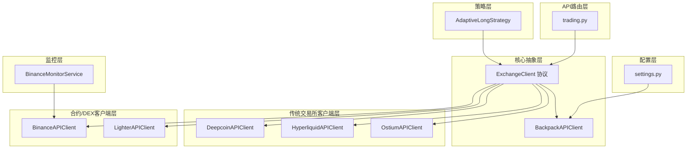
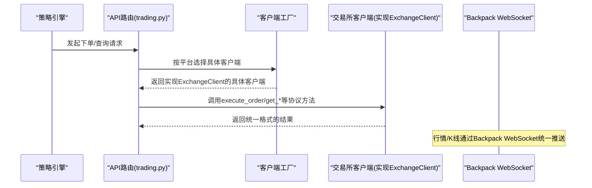
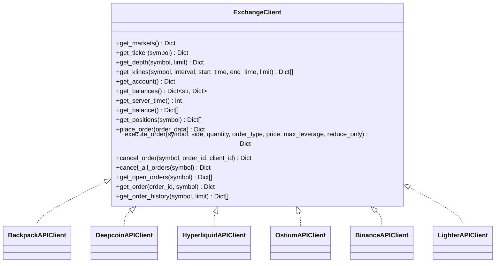
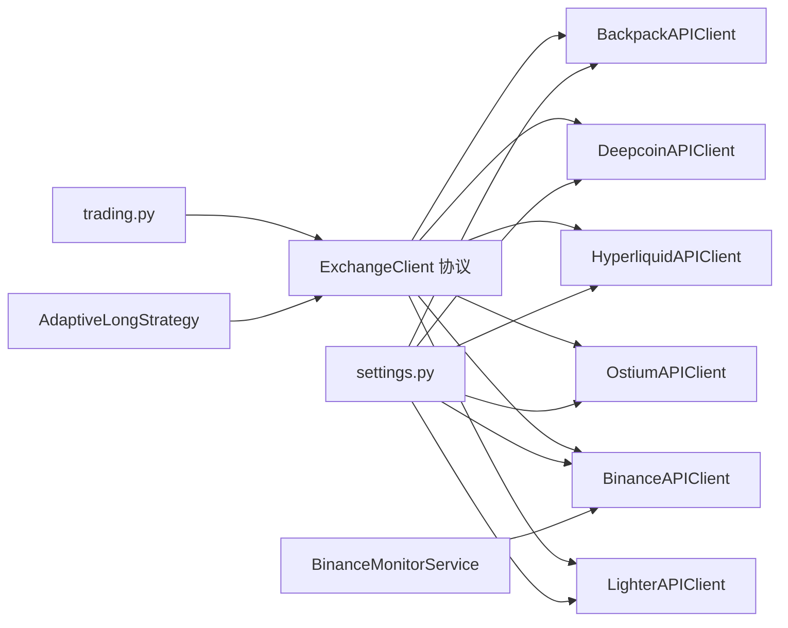

# 交易所客户端抽象设计

<cite>
**本文档引用的文件**
- [api_client.py](file://backpack_quant_trading/core/api_client.py)
- [deepcoin_client.py](file://backpack_quant_trading/core/deepcoin_client.py)
- [hyperliquid_client.py](file://backpack_quant_trading/core/hyperliquid_client.py)
- [ostium_client.py](file://backpack_quant_trading/core/ostium_client.py)
- [binance_client.py](file://backpack_quant_trading/core/binance_client.py)
- [lighter_client.py](file://backpack_quant_trading/core/lighter_client.py)
- [binance_monitor.py](file://backpack_quant_trading/core/binance_monitor.py)
- [settings.py](file://backpack_quant_trading/config/settings.py)
- [trading.py](file://backpack_quant_trading/api/routers/trading.py)
- [adaptive_long_strategy.py](file://backpack_quant_trading/strategy/adaptive_long_strategy.py)
</cite>

## 更新摘要
**变更内容**
- 新增Binance USDT-margined futures客户端实现，支持合约交易和保证金管理
- 新增Lighter DEX客户端实现，支持zkLighter去中心化交易所
- 扩展了交易所客户端抽象层，支持更多交易场景
- 增强了自适应做多策略对多平台的支持
- 新增币安监控模块，提供K线数据获取和预警功能

## 目录
1. [简介](#简介)
2. [项目结构](#项目结构)
3. [核心组件](#核心组件)
4. [架构总览](#架构总览)
5. [详细组件分析](#详细组件分析)
6. [依赖关系分析](#依赖关系分析)
7. [性能考量](#性能考量)
8. [故障排除指南](#故障排除指南)
9. [结论](#结论)
10. [附录](#附录)

## 简介
本文件系统性阐述交易所客户端抽象设计，围绕 ExchangeClient 协议的设计理念、接口规范与实现原理展开，解释统一接口封装带来的优势，并对比 Backpack、Deepcoin、Hyperliquid、Ostium、Binance、Lighter 等多家交易所客户端的共同特性与差异，给出新交易所集成的开发指南与最佳实践，以及扩展性与维护策略。

## 项目结构
该项目采用分层架构，核心抽象位于 core 层，配置集中于 config 层，API 路由与业务逻辑在 api 层，策略在 strategy 层，仪表盘在 dashboard 层。交易所客户端抽象位于 core/api_client.py，具体交易所客户端分别在 core/ 下的独立文件中实现，新增的 Binance 和 Lighter 客户端扩展了合约交易和去中心化交易所支持。

**图表来源**
- [api_client.py:22-85](file://backpack_quant_trading/core/api_client.py#L22-L85)
- [binance_client.py:72-607](file://backpack_quant_trading/core/binance_client.py#L72-L607)
- [lighter_client.py:27-707](file://backpack_quant_trading/core/lighter_client.py#L27-L707)
- [settings.py:92-100](file://backpack_quant_trading/config/settings.py#L92-L100)
- [trading.py:182-189](file://backpack_quant_trading/api/routers/trading.py#L182-L189)
- [adaptive_long_strategy.py:74-85](file://backpack_quant_trading/strategy/adaptive_long_strategy.py#L74-L85)

**章节来源**
- [api_client.py:1-1302](file://backpack_quant_trading/core/api_client.py#L1-L1302)
- [settings.py:1-149](file://backpack_quant_trading/config/settings.py#L1-L149)

## 核心组件
- **ExchangeClient 协议**：定义统一的交易所接口规范，覆盖市场、行情、账户、订单等核心能力，确保策略与交易引擎可无缝切换不同交易所。
- **传统交易所客户端**：BackpackAPIClient、DeepcoinAPIClient、HyperliquidAPIClient、OstiumAPIClient，均实现 ExchangeClient 协议，提供各自交易所的差异化适配。
- **合约/DEX客户端**：BinanceAPIClient（USDT-margined futures）、LighterAPIClient（zkLighter DEX），扩展了合约交易和去中心化交易所支持。
- **配置中心**：settings.py 提供各交易所的 API 基础地址、密钥与参数配置，支持环境变量注入与默认值。
- **API 路由与策略**：trading.py 与 AdaptiveLongStrategy 通过工厂模式按平台选择具体客户端，支撑实盘启动与可视化。
- **监控模块**：BinanceMonitorService 提供币安合约交易对监控和预警功能。

**章节来源**
- [api_client.py:22-85](file://backpack_quant_trading/core/api_client.py#L22-L85)
- [binance_client.py:72-607](file://backpack_quant_trading/core/binance_client.py#L72-L607)
- [lighter_client.py:27-707](file://backpack_quant_trading/core/lighter_client.py#L27-L707)
- [settings.py:92-100](file://backpack_quant_trading/config/settings.py#L92-L100)
- [trading.py:182-189](file://backpack_quant_trading/api/routers/trading.py#L182-L189)
- [adaptive_long_strategy.py:74-85](file://backpack_quant_trading/strategy/adaptive_long_strategy.py#L74-L85)

## 架构总览
统一接口封装的核心思想是：行情与K线（无需认证）统一走 Backpack WebSocket，下单与账户等需要认证的能力通过 ExchangeClient 协议抽象，策略与引擎仅依赖协议，不关心具体交易所实现细节。新增的 Binance 和 Lighter 客户端进一步扩展了合约交易和去中心化交易所支持。

**图表来源**
- [api_client.py:22-85](file://backpack_quant_trading/core/api_client.py#L22-L85)
- [trading.py:182-189](file://backpack_quant_trading/api/routers/trading.py#L182-L189)
- [adaptive_long_strategy.py:74-85](file://backpack_quant_trading/strategy/adaptive_long_strategy.py#L74-L85)

## 详细组件分析

### ExchangeClient 协议设计
- **设计理念**：通过协议抽象下单与账户相关能力，使策略与引擎与交易所实现解耦；行情/K线统一经 Backpack WebSocket，避免重复适配。
- **接口规范**：包含 get_markets、get_ticker、get_depth、get_klines、get_account、get_balances、get_server_time、get_balance、get_positions、place_order、execute_order、cancel_order、cancel_all_orders、get_open_orders、get_order、get_order_history 等方法，参数与返回值统一格式，便于策略兼容。
- **优势**：降低多交易所切换成本，提升可测试性与可维护性；便于扩展新交易所与统一风控、日志与监控。

**图表来源**
- [api_client.py:22-85](file://backpack_quant_trading/core/api_client.py#L22-L85)
- [binance_client.py:72-607](file://backpack_quant_trading/core/binance_client.py#L72-L607)
- [lighter_client.py:27-707](file://backpack_quant_trading/core/lighter_client.py#L27-L707)

**章节来源**
- [api_client.py:22-85](file://backpack_quant_trading/core/api_client.py#L22-L85)

### BinanceAPIClient 实现
- **合约交易支持**：专为币安 USD-M 合约（USDT-M Futures）设计，支持合约交易对、保证金管理和杠杆设置。
- **符号转换**：提供 _to_binance_symbol 和 _from_binance_symbol 函数，支持多种输入格式到币安合约格式的转换。
- **认证机制**：使用 HMAC-SHA256 签名认证，支持 API Key/Secret 配置和代理支持。
- **HTTP封装**：提供 _get、_post、_post_papi、_delete 方法，支持 REST API 调用和错误处理。
- **市场与账户**：get_markets、get_account、get_balances、get_positions、get_server_time 等合约专用接口。
- **订单执行**：place_order、execute_order（支持杠杆设置）、close_position、cancel_order、cancel_all_orders、get_open_orders、get_order、get_order_history。
- **高级功能**：set_leverage、set_margin_type、place_tpsl_order（止损/止盈单挂单）等合约交易特有功能。

**章节来源**
- [binance_client.py:72-607](file://backpack_quant_trading/core/binance_client.py#L72-L607)

### LighterAPIClient 实现
- **DEX集成**：专为 zkLighter 去中心化交易所设计，使用 lighter SDK 进行认证和交易。
- **智能密钥管理**：支持 ETH 私钥自动转换为 Lighter API 密钥，提供密钥缓存机制。
- **市场精度处理**：自动加载市场精度信息，支持价格和数量的小数位转换。
- **账户管理**：get_balance、get_positions 等 DEX 专用接口，支持账户索引自动识别。
- **订单执行**：place_order、place_tpsl_order（止盈/止损单）、cancel_order_async 等 DEX 交易功能。
- **兼容性**：提供与 HyperliquidAPIClient 对齐的接口，便于策略统一调用。

**章节来源**
- [lighter_client.py:27-707](file://backpack_quant_trading/core/lighter_client.py#L27-L707)

### 传统交易所客户端实现
- **BackpackAPIClient**：支持 ED25519 密钥认证与 Cookie 认证，提供统一行情订阅与回调处理。
- **DeepcoinAPIClient**：实现 ExchangeClient 协议，内部使用 aiohttp 异步请求，提供符号映射适配。
- **HyperliquidAPIClient**：使用 EIP-712 签名，支持链上交易和资产 ID 管理。
- **OstiumAPIClient**：使用 ostium_python_sdk，支持资金费率和最小抵押要求检查。

**章节来源**
- [api_client.py:87-546](file://backpack_quant_trading/core/api_client.py#L87-L546)
- [deepcoin_client.py:18-488](file://backpack_quant_trading/core/deepcoin_client.py#L18-L488)
- [hyperliquid_client.py:18-546](file://backpack_quant_trading/core/hyperliquid_client.py#L18-L546)
- [ostium_client.py:19-800](file://backpack_quant_trading/core/ostium_client.py#L19-L800)

### 配置中心与工厂模式
- **配置中心**：settings.py 提供各交易所的 API 基础地址、密钥与参数，支持环境变量注入。
- **工厂模式**：trading.py 提供统一的实盘启动接口，按平台选择客户端；AdaptiveLongStrategy 支持多平台客户端选择。
- **新增平台支持**：在 trading.py 中新增 "binance" 和 "lighter" 平台选项。

**章节来源**
- [settings.py:92-100](file://backpack_quant_trading/config/settings.py#L92-L100)
- [trading.py:182-189](file://backpack_quant_trading/api/routers/trading.py#L182-L189)
- [adaptive_long_strategy.py:74-85](file://backpack_quant_trading/strategy/adaptive_long_strategy.py#L74-L85)

### 币安监控模块
- **K线数据获取**：提供 fetch_binance_klines、fetch_binance_klines_batch、fetch_binance_klines_from_start 等函数。
- **订单簿监控**：支持获取合约订单簿深度数据。
- **预警功能**：实现 detect_minute_alerts 函数，检测短周期波动、成交量异常和订单簿大额挂单。
- **服务化监控**：BinanceMonitorService 提供后台轮询监控，支持多币种多时间框架监控。
- **缓存机制**：实现币种列表缓存，避免频繁请求交易所 API。

**章节来源**
- [binance_monitor.py:60-817](file://backpack_quant_trading/core/binance_monitor.py#L60-L817)

## 依赖关系分析
- **协议到实现**：ExchangeClient 为抽象契约，Backpack、Deepcoin、Hyperliquid、Ostium、Binance、Lighter 均实现该协议。
- **外部依赖**：Backpack 使用 requests/websockets；Deepcoin 使用 aiohttp；Hyperliquid 使用 eth_account、web3、msgpack；Ostium 使用 ostium_python_sdk；Binance 使用 aiohttp；Lighter 使用 lighter SDK。
- **配置依赖**：各客户端读取 settings.py 中对应配置，支持环境变量覆盖。
- **路由与策略**：trading.py 与 AdaptiveLongStrategy 通过工厂模式选择客户端，实现运行时切换。

**图表来源**
- [api_client.py:22-85](file://backpack_quant_trading/core/api_client.py#L22-L85)
- [binance_client.py:72-607](file://backpack_quant_trading/core/binance_client.py#L72-L607)
- [lighter_client.py:27-707](file://backpack_quant_trading/core/lighter_client.py#L27-L707)
- [settings.py:92-100](file://backpack_quant_trading/config/settings.py#L92-L100)
- [trading.py:182-189](file://backpack_quant_trading/api/routers/trading.py#L182-L189)
- [adaptive_long_strategy.py:74-85](file://backpack_quant_trading/strategy/adaptive_long_strategy.py#L74-L85)

**章节来源**
- [api_client.py:22-85](file://backpack_quant_trading/core/api_client.py#L22-L85)
- [settings.py:92-100](file://backpack_quant_trading/config/settings.py#L92-L100)
- [trading.py:182-189](file://backpack_quant_trading/api/routers/trading.py#L182-L189)
- [adaptive_long_strategy.py:74-85](file://backpack_quant_trading/strategy/adaptive_long_strategy.py#L74-L85)

## 性能考量
- **异步化**：Deepcoin 使用 aiohttp，Hyperliquid 使用 aiohttp，Binance 使用 aiohttp，Lighter 使用 aiohttp，提升并发与吞吐。
- **缓存与降级**：BackpackAPIClient 对 get_markets 做缓存；OstiumAPIClient 在 SDK 不可用时提供模拟数据；Hyperliquid 对 meta 做缓存；BinanceMonitorService 对币种列表做缓存。
- **签名与序列化**：Hyperliquid 严格遵循字段顺序与 MsgPack 规范；Deepcoin 对签名字符串与 JSON 严格控制；Lighter 使用 SDK 进行签名处理。
- **限流与错误处理**：Deepcoin 对 429 限流与 JSON 解析异常进行处理；Backpack 对 400 错误进行详细日志提示；Binance 使用代理支持和限流处理。
- **DEX优化**：LighterAPIClient 对市场精度信息做缓存，减少重复查询。

## 故障排除指南
- **认证失败（Backpack）**：检查 ED25519 密钥与 Cookie 配置，确认时间戳与窗口参数。
- **签名异常（Hyperliquid）**：确认私钥格式正确（64 位十六进制，不含 0x 前缀）；检查签名字段顺序与 chainId。
- **限流与解析错误（Deepcoin）**：关注 429 限流；确保 JSON 严格序列化；检查返回码与错误信息。
- **SDK 不可用（Ostium）**：确认 RPC URL、私钥与网络配置；若 SDK 不可用，使用模拟数据进行降级。
- **Binance 认证失败**：检查 API Key/Secret 配置；确认代理设置；验证 HMAC-SHA256 签名。
- **Lighter 密钥问题**：确认 ETH 私钥格式；检查 API Key 缓存；验证 lighter SDK 安装。
- **合约交易异常**：检查杠杆设置；确认保证金模式；验证合约交易对格式。

**章节来源**
- [api_client.py:213-269](file://backpack_quant_trading/core/api_client.py#L213-L269)
- [hyperliquid_client.py:483-533](file://backpack_quant_trading/core/hyperliquid_client.py#L483-L533)
- [deepcoin_client.py:149-171](file://backpack_quant_trading/core/deepcoin_client.py#L149-L171)
- [ostium_client.py:52-78](file://backpack_quant_trading/core/ostium_client.py#L52-L78)
- [binance_client.py:120-141](file://backpack_quant_trading/core/binance_client.py#L120-L141)
- [lighter_client.py:71-90](file://backpack_quant_trading/core/lighter_client.py#L71-L90)

## 结论
通过 ExchangeClient 协议抽象，项目实现了跨交易所的一致接口与统一的下单/账户能力，配合 Backpack WebSocket 的行情/K线推送，形成"协议抽象 + 统一行情"的架构。新增的 BinanceAPIClient 和 LighterAPIClient 进进一步扩展了合约交易和去中心化交易所支持，使得项目能够覆盖更广泛的交易场景。各交易所客户端在保持协议一致的前提下，针对自身差异进行适配，既保证了策略的可移植性，也为未来扩展新交易所提供了清晰的路径与最佳实践。

## 附录

### 新交易所集成开发指南
- **实现 ExchangeClient 协议**：对照协议方法清单，补齐 get_*、place_order、execute_order、cancel_*、get_order* 等方法。
- **适配认证与签名**：根据交易所 API 文档实现签名/鉴权流程，确保参数序列化与字段顺序一致。
- **处理差异化字段**：如价格/数量精度、订单类型映射、状态码转换等，统一返回格式。
- **配置与工厂**：在 settings.py 中添加配置项，在 trading.py 或 AdaptiveLongStrategy 中通过工厂模式注册。
- **测试与验证**：编写单元测试与集成测试，覆盖下单、撤单、查询等关键路径。
- **监控集成**：如需监控功能，参考 BinanceMonitorService 实现相应的数据获取和预警逻辑。

**章节来源**
- [api_client.py:22-85](file://backpack_quant_trading/core/api_client.py#L22-L85)
- [settings.py:92-100](file://backpack_quant_trading/config/settings.py#L92-L100)
- [trading.py:182-189](file://backpack_quant_trading/api/routers/trading.py#L182-L189)
- [adaptive_long_strategy.py:74-85](file://backpack_quant_trading/strategy/adaptive_long_strategy.py#L74-L85)

### 统一接口封装的优势
- **降低切换成本**：策略与引擎仅依赖协议，更换交易所只需替换客户端实现。
- **提升可测试性**：可通过 mock 实现 ExchangeClient 进行单元测试。
- **统一风控与监控**：在协议层统一接入风控、日志与监控，避免重复适配。
- **扩展性增强**：新增平台无需修改策略代码，只需实现协议接口。

**章节来源**
- [api_client.py:22-85](file://backpack_quant_trading/core/api_client.py#L22-L85)

### 各交易所客户端的共同特性与差异
- **共同特性**：均实现 ExchangeClient 协议；提供 get_markets、get_ticker、get_depth、get_klines、get_account、get_balances、get_positions、place_order、execute_order、cancel_order、get_open_orders、get_order、get_order_history 等方法。
- **差异点**：
  - **认证方式**：ED25519/Cookie/链上签名/SKD/HMAC-SHA256/lighter SDK
  - **交易类型**：Spot/Perpetual/DEX/合约交易
  - **签名参数与序列化规范**：严格遵循各交易所规范
  - **订单类型与状态映射**：不同交易所的差异化处理
  - **精度处理**：合约交易的杠杆和保证金管理
  - **限流与错误处理策略**：各交易所的差异化实现

**章节来源**
- [api_client.py:22-85](file://backpack_quant_trading/core/api_client.py#L22-L85)
- [binance_client.py:72-607](file://backpack_quant_trading/core/binance_client.py#L72-L607)
- [lighter_client.py:27-707](file://backpack_quant_trading/core/lighter_client.py#L27-L707)
- [deepcoin_client.py:18-488](file://backpack_quant_trading/core/deepcoin_client.py#L18-L488)
- [hyperliquid_client.py:18-546](file://backpack_quant_trading/core/hyperliquid_client.py#L18-L546)
- [ostium_client.py:19-800](file://backpack_quant_trading/core/ostium_client.py#L19-L800)