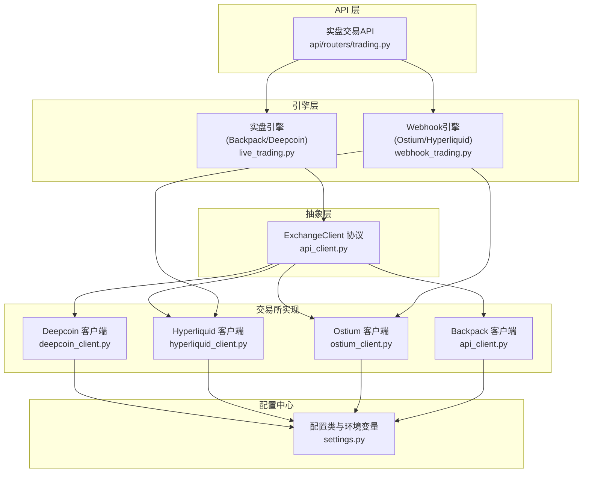
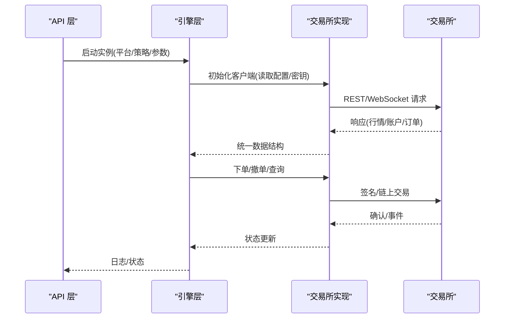
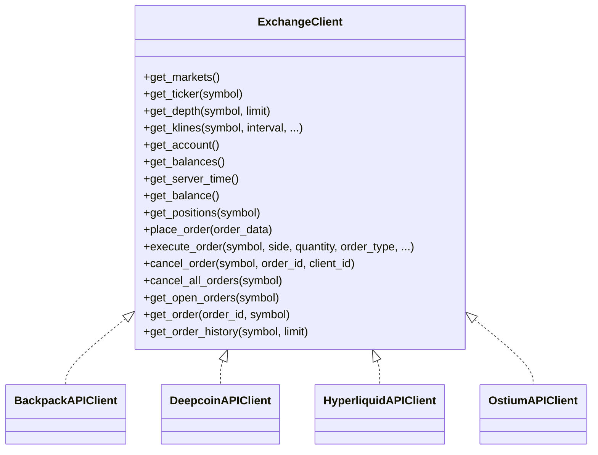
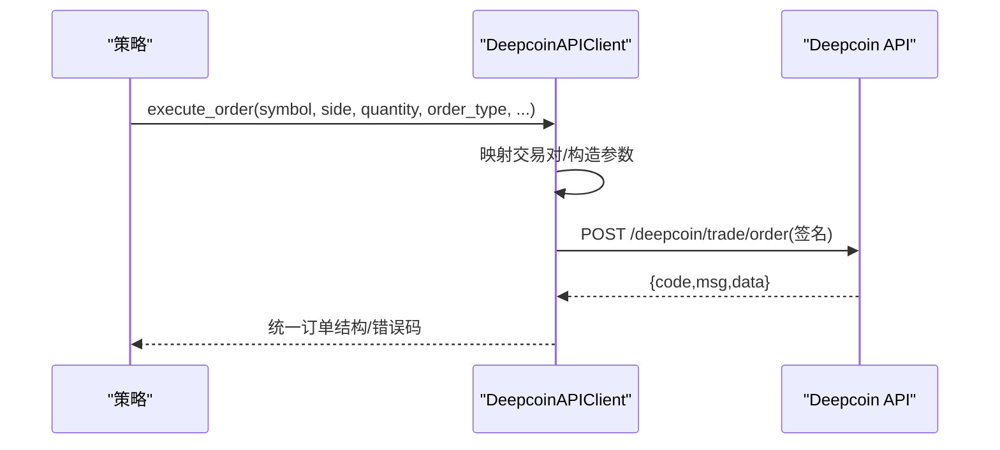
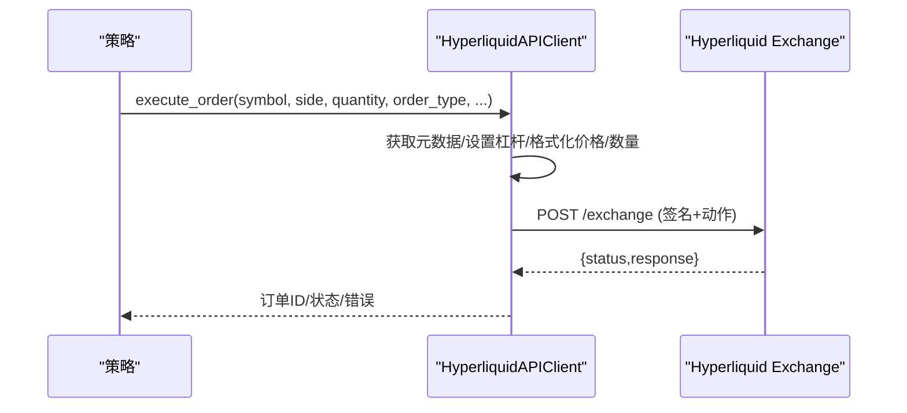
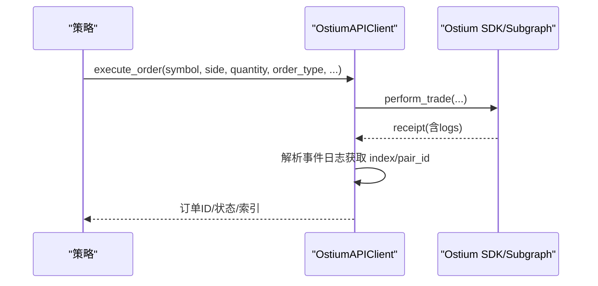
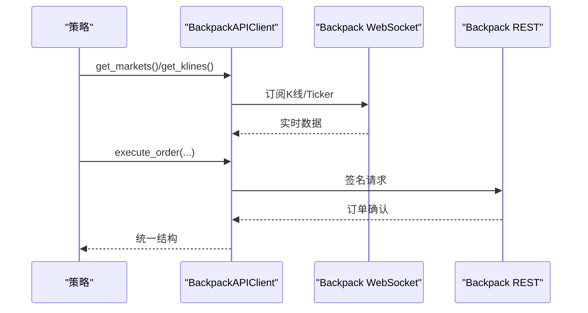
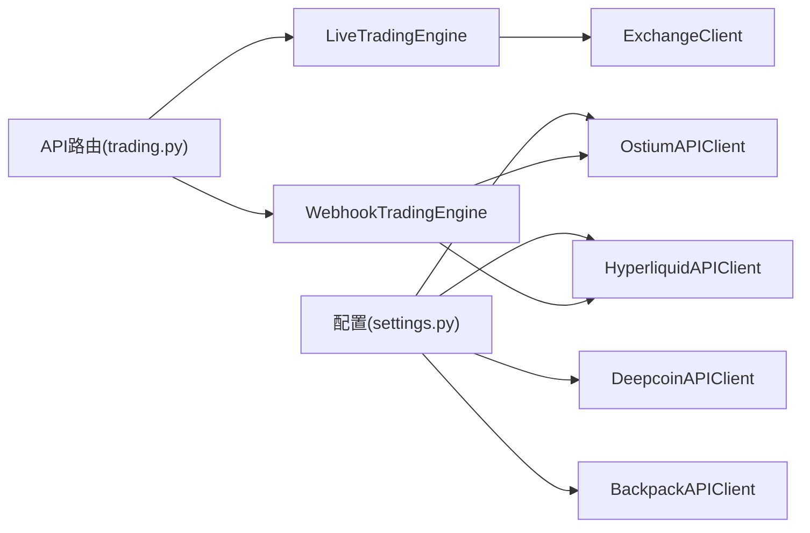

# 交易所集成

<cite>
**本文引用的文件**   
- [api_client.py](file://backpack_quant_trading/core/api_client.py)
- [deepcoin_client.py](file://backpack_quant_trading/core/deepcoin_client.py)
- [hyperliquid_client.py](file://backpack_quant_trading/core/hyperliquid_client.py)
- [ostium_client.py](file://backpack_quant_trading/core/ostium_client.py)
- [settings.py](file://backpack_quant_trading/config/settings.py)
- [live_trading.py](file://backpack_quant_trading/engine/live_trading.py)
- [webhook_trading.py](file://backpack_quant_trading/engine/webhook_trading.py)
- [trading.py](file://backpack_quant_trading/api/routers/trading.py)
</cite>

## 目录
1. [简介](#简介)
2. [项目结构](#项目结构)
3. [核心组件](#核心组件)
4. [架构总览](#架构总览)
5. [详细组件分析](#详细组件分析)
6. [依赖分析](#依赖分析)
7. [性能考虑](#性能考虑)
8. [故障排除指南](#故障排除指南)
9. [结论](#结论)
10. [附录](#附录)

## 简介
本文件面向交易所集成功能，系统性说明 Backpack、Deepcoin、Hyperliquid、Ostium 四家交易所的 API 集成方式与实现细节。重点涵盖：
- 交易所客户端抽象设计与统一接口封装
- 错误处理机制与网络连接管理
- API 密钥配置与请求限流处理
- 各交易所的特色功能与使用注意事项
- 实际集成示例与故障排除指南

目标是帮助开发者快速理解并正确接入各交易所，同时在统一抽象下实现跨平台无缝切换。

## 项目结构
围绕“统一接口 + 多交易所实现”的设计，核心文件分布如下：
- 抽象层：ExchangeClient 协议定义于 api_client.py
- 交易所实现：deepcoin_client.py、hyperliquid_client.py、ostium_client.py
- 配置中心：settings.py
- 引擎层：live_trading.py（Backpack/Deepcoin）、webhook_trading.py（Ostium/Hyperliquid）
- API 层：trading.py（对外提供启动/停止实例与日志查看）

**图表来源**
- [api_client.py:22-85](file://backpack_quant_trading/core/api_client.py#L22-L85)
- [deepcoin_client.py:18-488](file://backpack_quant_trading/core/deepcoin_client.py#L18-L488)
- [hyperliquid_client.py:18-532](file://backpack_quant_trading/core/hyperliquid_client.py#L18-L532)
- [ostium_client.py:19-800](file://backpack_quant_trading/core/ostium_client.py#L19-L800)
- [settings.py:104-137](file://backpack_quant_trading/config/settings.py#L104-L137)
- [live_trading.py:347-800](file://backpack_quant_trading/engine/live_trading.py#L347-L800)
- [webhook_trading.py:40-684](file://backpack_quant_trading/engine/webhook_trading.py#L40-L684)
- [trading.py:1-529](file://backpack_quant_trading/api/routers/trading.py#L1-L529)

**章节来源**
- [api_client.py:22-85](file://backpack_quant_trading/core/api_client.py#L22-L85)
- [settings.py:104-137](file://backpack_quant_trading/config/settings.py#L104-L137)
- [live_trading.py:347-800](file://backpack_quant_trading/engine/live_trading.py#L347-L800)
- [webhook_trading.py:40-684](file://backpack_quant_trading/engine/webhook_trading.py#L40-L684)
- [trading.py:1-529](file://backpack_quant_trading/api/routers/trading.py#L1-L529)

## 核心组件
- ExchangeClient 协议：定义统一的市场数据、账户、订单接口，便于在不同交易所间无缝切换。
- 各交易所客户端：
  - Deepcoin：基于 REST API，支持签名、映射交易对格式、账户/持仓/订单查询与下单。
  - Hyperliquid：基于 REST API + EIP-712 签名，支持链上订单与杠杆设置，具备严格的字段顺序与签名规范。
  - Ostium：基于区块链 SDK，支持链上下单、事件解析、链上状态查询与休市控制。
  - Backpack：提供 REST/WebSocket 接口，支持 ED25519 签名与 WebSocket 订阅。
- 配置中心：集中管理各交易所的 API 地址、密钥、默认参数等。
- 引擎层：LiveTradingEngine（Backpack/Deepcoin）与 WebhookTradingEngine（Ostium/Hyperliquid）负责策略调度、风控与订单执行。
- API 层：提供启动/停止实例、查询日志等接口，支持多实例管理。

**章节来源**
- [api_client.py:22-85](file://backpack_quant_trading/core/api_client.py#L22-L85)
- [deepcoin_client.py:18-488](file://backpack_quant_trading/core/deepcoin_client.py#L18-L488)
- [hyperliquid_client.py:18-532](file://backpack_quant_trading/core/hyperliquid_client.py#L18-L532)
- [ostium_client.py:19-800](file://backpack_quant_trading/core/ostium_client.py#L19-L800)
- [settings.py:104-137](file://backpack_quant_trading/config/settings.py#L104-L137)
- [live_trading.py:347-800](file://backpack_quant_trading/engine/live_trading.py#L347-L800)
- [webhook_trading.py:40-684](file://backpack_quant_trading/engine/webhook_trading.py#L40-L684)
- [trading.py:1-529](file://backpack_quant_trading/api/routers/trading.py#L1-L529)

## 架构总览
统一抽象 + 多实现 + 配置驱动 + 引擎调度的整体架构如下：

**图表来源**
- [api_client.py:22-85](file://backpack_quant_trading/core/api_client.py#L22-L85)
- [live_trading.py:347-800](file://backpack_quant_trading/engine/live_trading.py#L347-L800)
- [webhook_trading.py:40-684](file://backpack_quant_trading/engine/webhook_trading.py#L40-L684)
- [trading.py:1-529](file://backpack_quant_trading/api/routers/trading.py#L1-L529)

## 详细组件分析

### 交易所客户端抽象设计
- ExchangeClient 协议定义了统一的接口族，包括市场数据、账户、订单等方法，确保策略层无需关心具体交易所差异。
- BackpackAPIClient 实现了 Backpack 的 REST/WebSocket 接口，支持 ED25519 签名与 WebSocket 订阅。
- DeepcoinAPIClient、HyperliquidAPIClient、OstiumAPIClient 分别实现各自交易所的 REST/链上接口，提供统一的 execute_order/place_order/cancel_order 等方法。

**图表来源**
- [api_client.py:22-85](file://backpack_quant_trading/core/api_client.py#L22-L85)
- [api_client.py:87-547](file://backpack_quant_trading/core/api_client.py#L87-L547)
- [deepcoin_client.py:18-488](file://backpack_quant_trading/core/deepcoin_client.py#L18-L488)
- [hyperliquid_client.py:18-532](file://backpack_quant_trading/core/hyperliquid_client.py#L18-L532)
- [ostium_client.py:19-800](file://backpack_quant_trading/core/ostium_client.py#L19-L800)

**章节来源**
- [api_client.py:22-85](file://backpack_quant_trading/core/api_client.py#L22-L85)
- [api_client.py:87-547](file://backpack_quant_trading/core/api_client.py#L87-L547)

### Deepcoin 集成
- 认证与签名：使用 HMAC-SHA256 生成签名，头部包含时间戳、API Key、Passphrase 等。
- 交易对映射：提供双向映射函数，将 Backpack 格式与 Deepcoin 格式互转。
- 接口覆盖：市场、行情、深度、K线、账户、余额、持仓、下单、撤单、历史等。
- 限流处理：对 429 响应进行捕获并返回统一结构，便于上层策略处理。

**图表来源**
- [deepcoin_client.py:18-488](file://backpack_quant_trading/core/deepcoin_client.py#L18-L488)

**章节来源**
- [deepcoin_client.py:18-488](file://backpack_quant_trading/core/deepcoin_client.py#L18-L488)

### Hyperliquid 集成
- 认证与签名：采用 EIP-712 规范，使用 TypedData 签名，严格遵循字段顺序与 MsgPack 编码。
- 交易流程：下单前设置杠杆，构建订单对象与动作序列，签名后通过 REST 提交。
- 状态查询：支持挂单查询、订单状态查询、链上事件解析等。
- 特色功能：严格的地址大小写处理、滑点处理、平仓逻辑与风控提示。

**图表来源**
- [hyperliquid_client.py:18-532](file://backpack_quant_trading/core/hyperliquid_client.py#L18-L532)

**章节来源**
- [hyperliquid_client.py:18-532](file://backpack_quant_trading/core/hyperliquid_client.py#L18-L532)

### Ostium 集成
- 链上交易：通过 SDK 进行链上下单、查询链上状态、解析事件日志。
- 事件解析：从 TradeOpened/限价单事件日志中解析 trade_index/pair_id，用于后续平仓。
- 休市控制：基于北京时间的休市时段判断，避免在休市期间下单。
- 风控：内置止损监控与熔断逻辑（可配置禁用）。

**图表来源**
- [ostium_client.py:19-800](file://backpack_quant_trading/core/ostium_client.py#L19-L800)

**章节来源**
- [ostium_client.py:19-800](file://backpack_quant_trading/core/ostium_client.py#L19-L800)

### Backpack 集成
- 认证：支持 Cookie 认证与 ED25519 签名两种方式；签名时对参数排序与编码有严格要求。
- 数据流：行情与 K 线通过 WebSocket 推送，订单执行通过 REST 完成。
- 接口覆盖：市场、Ticker、Depth、K线、账户、余额、持仓、订单等。

**图表来源**
- [api_client.py:87-547](file://backpack_quant_trading/core/api_client.py#L87-L547)

**章节来源**
- [api_client.py:87-547](file://backpack_quant_trading/core/api_client.py#L87-L547)

## 依赖分析
- 配置依赖：各交易所客户端从配置中心读取 API 地址、密钥、默认参数等。
- 引擎依赖：LiveTradingEngine 通过 ExchangeClient 抽象接入任意交易所；WebhookTradingEngine 专用于 Ostium/Hyperliquid。
- API 依赖：API 层负责实例生命周期管理与日志输出，屏蔽底层实现差异。

**图表来源**
- [settings.py:104-137](file://backpack_quant_trading/config/settings.py#L104-L137)
- [live_trading.py:347-800](file://backpack_quant_trading/engine/live_trading.py#L347-L800)
- [webhook_trading.py:40-684](file://backpack_quant_trading/engine/webhook_trading.py#L40-L684)
- [trading.py:1-529](file://backpack_quant_trading/api/routers/trading.py#L1-L529)

**章节来源**
- [settings.py:104-137](file://backpack_quant_trading/config/settings.py#L104-L137)
- [live_trading.py:347-800](file://backpack_quant_trading/engine/live_trading.py#L347-L800)
- [webhook_trading.py:40-684](file://backpack_quant_trading/engine/webhook_trading.py#L40-L684)
- [trading.py:1-529](file://backpack_quant_trading/api/routers/trading.py#L1-L529)

## 性能考虑
- 会话管理：各客户端均提供 get_session/close_session，避免重复创建连接；WebSocket 客户端支持指数退避与心跳保活。
- 缓存策略：LiveTradingEngine 对余额进行缓存，降低 API 调用频率。
- 请求限流：Deepcoin 对 429 进行捕获并返回统一结构，便于上层策略降速或重试。
- 数据一致性：WebSocket 订阅与 REST 接口分离，确保实时行情与订单执行解耦。

[本节为通用指导，不涉及具体文件分析]

## 故障排除指南
- 认证失败
  - Backpack：检查 ED25519 公私钥、时间戳与签名参数；确认请求头字段齐全。
  - Deepcoin：核对 API Key/Secret/Passphrase，确保签名字符串与参数排序一致。
  - Hyperliquid：确认私钥、地址大小写、签名域与字段顺序；检查链上账户是否已初始化。
  - Ostium：确认 RPC URL、私钥与网络配置；检查 SDK 初始化与链上事件解析。
- WebSocket 连接问题
  - 检查代理设置与库版本；LiveTradingEngine/WebSocketClient 提供指数退避与心跳保活。
- 限流与错误码
  - Deepcoin：遇到 429 时记录并降速；统一返回结构便于策略处理。
- 事件解析失败
  - Ostium：从 TradeOpened/限价单事件日志解析 index/pair_id，若失败可回查 Subgraph。
- 日志与实例管理
  - 通过 API 层查看日志与实例状态，定位启动/停止过程中的异常。

**章节来源**
- [api_client.py:260-268](file://backpack_quant_trading/core/api_client.py#L260-L268)
- [deepcoin_client.py:150-171](file://backpack_quant_trading/core/deepcoin_client.py#L150-L171)
- [webhook_trading.py:627-684](file://backpack_quant_trading/engine/webhook_trading.py#L627-L684)
- [trading.py:496-529](file://backpack_quant_trading/api/routers/trading.py#L496-L529)

## 结论
通过 ExchangeClient 抽象与多实现设计，系统实现了对 Backpack、Deepcoin、Hyperliquid、Ostium 的统一接入。结合配置中心、引擎层与 API 层，开发者可在不改动策略层的前提下切换交易所，提升可维护性与扩展性。针对各交易所的认证方式、签名规范与链上特性，代码层面提供了完善的实现与健壮的错误处理机制。

[本节为总结性内容，不涉及具体文件分析]

## 附录

### API 密钥配置与网络连接管理
- 配置项
  - Backpack：API_BASE_URL、ACCESS_KEY、REFRESH_KEY、PRIVATE_KEY、PUBLIC_KEY、DEFAULT_WINDOW
  - Deepcoin：API_BASE_URL、API_KEY、SECRET_KEY、PASSPHRASE、DEFAULT_MARGIN_MODE、DEFAULT_MERGE_POSITION、LEVERAGE
  - Hyperliquid：API_BASE_URL、PRIVATE_KEY、AGENT_ADDRESS
  - Ostium：RPC_URL、PRIVATE_KEY、NETWORK、SYMBOL、LEVERAGE
- 网络连接
  - 支持代理（环境变量 HTTPS_PROXY/http_proxy/HTTP_PROXY）
  - WebSocket 客户端指数退避与心跳保活

**章节来源**
- [settings.py:13-137](file://backpack_quant_trading/config/settings.py#L13-L137)
- [api_client.py:648-746](file://backpack_quant_trading/core/api_client.py#L648-L746)
- [live_trading.py:153-236](file://backpack_quant_trading/engine/live_trading.py#L153-L236)

### 请求限流处理
- Deepcoin：对 429 进行捕获并返回统一结构
- Backpack：对 400 错误进行日志提示（签名/参数/频率限制等）
- 建议：上层策略根据返回码进行降速或重试

**章节来源**
- [deepcoin_client.py:150-152](file://backpack_quant_trading/core/deepcoin_client.py#L150-L152)
- [api_client.py:260-268](file://backpack_quant_trading/core/api_client.py#L260-L268)

### 各交易所特色功能与注意事项
- Deepcoin
  - 交易对格式映射（Backpack <-> Deepcoin）
  - 支持账户/余额/持仓/订单等全量接口
  - 注意：429 限流处理
- Hyperliquid
  - EIP-712 签名与字段顺序严格校验
  - 杠杆设置与滑点处理
  - 地址大小写敏感
- Ostium
  - 链上事件解析（TradeOpened/限价单事件）
  - 休市时段控制
  - 风险监控与熔断（可配置禁用）
- Backpack
  - ED25519 签名与 WebSocket 实时数据
  - 参数排序与编码要求严格

**章节来源**
- [deepcoin_client.py:68-109](file://backpack_quant_trading/core/deepcoin_client.py#L68-L109)
- [hyperliquid_client.py:470-520](file://backpack_quant_trading/core/hyperliquid_client.py#L470-L520)
- [ostium_client.py:193-252](file://backpack_quant_trading/core/ostium_client.py#L193-L252)
- [api_client.py:158-212](file://backpack_quant_trading/core/api_client.py#L158-L212)

### 实际集成示例与使用步骤
- 通过 API 层启动实例
  - 选择平台（backpack/deepcoin/ostium/hyperliquid）
  - 提供策略、交易对、杠杆、止盈止损等参数
  - Webhook 模式自动启动服务并注册实例；子进程模式启动独立进程
- 引擎层初始化
  - LiveTradingEngine：通过 ExchangeClient 抽象接入交易所，WebSocket 订阅行情
  - WebhookTradingEngine：Ostium/Hyperliquid 的链上交易与风控
- 日志与状态
  - 通过 API 层查看日志与实例状态，定位问题

**章节来源**
- [trading.py:310-431](file://backpack_quant_trading/api/routers/trading.py#L310-L431)
- [live_trading.py:443-535](file://backpack_quant_trading/engine/live_trading.py#L443-L535)
- [webhook_trading.py:85-131](file://backpack_quant_trading/engine/webhook_trading.py#L85-L131)