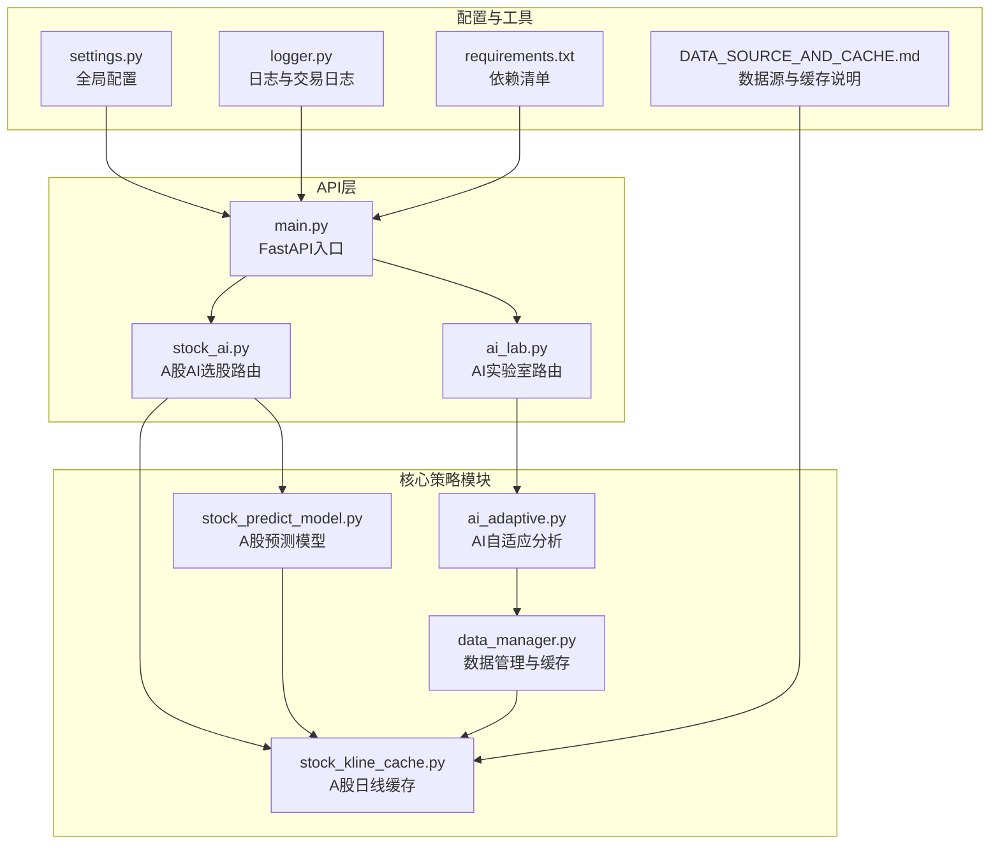
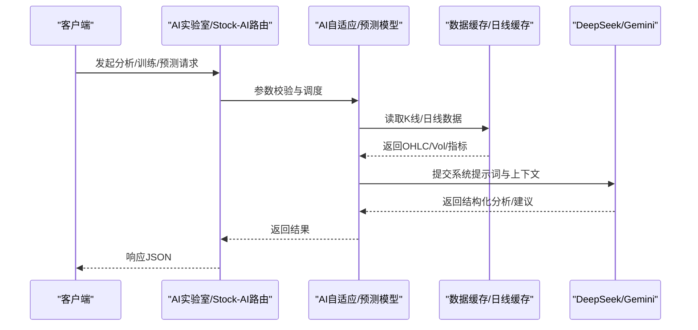
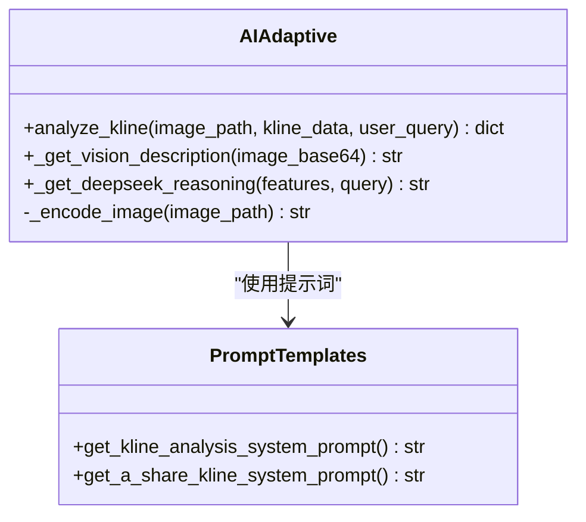
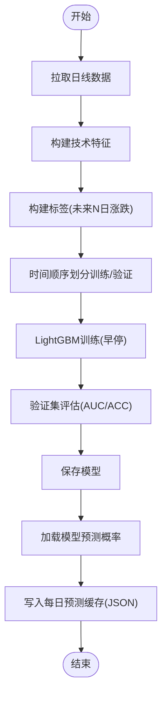
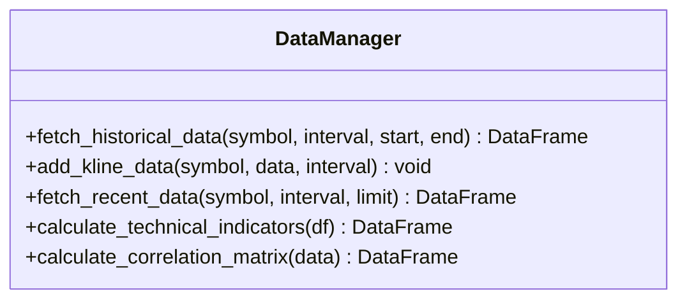
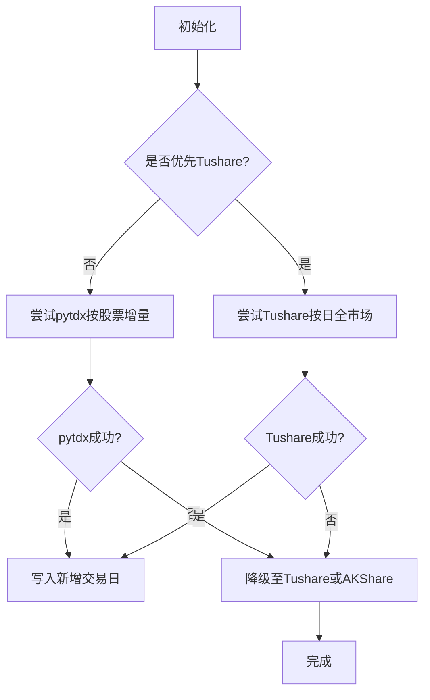
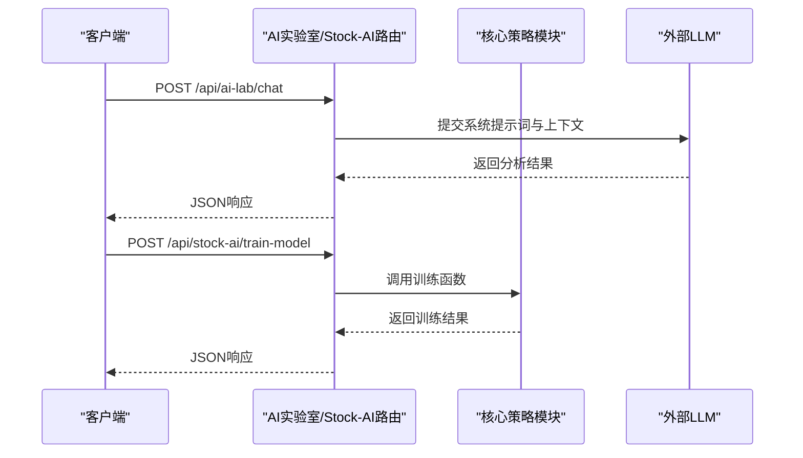
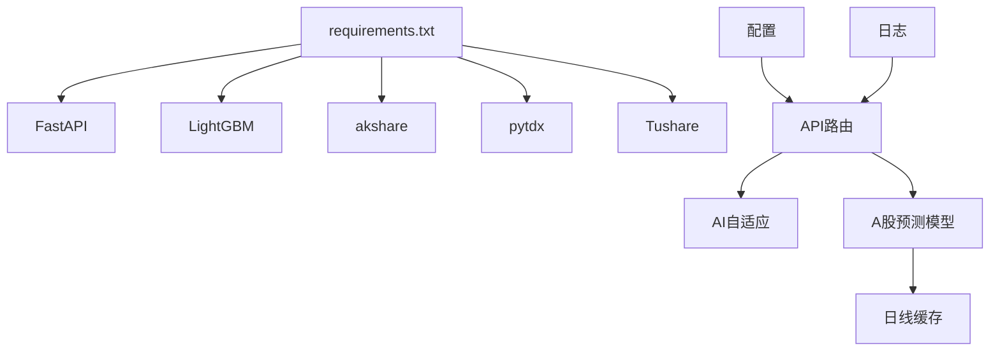

# AI自适应策略

<cite>
**本文引用的文件**
- [ai_adaptive.py](file://backpack_quant_trading/core/ai_adaptive.py)
- [stock_predict_model.py](file://backpack_quant_trading/core/stock_predict_model.py)
- [data_manager.py](file://backpack_quant_trading/core/data_manager.py)
- [ai_lab.py](file://backpack_quant_trading/api/routers/ai_lab.py)
- [stock_ai.py](file://backpack_quant_trading/api/routers/stock_ai.py)
- [stock_kline_cache.py](file://backpack_quant_trading/core/stock_kline_cache.py)
- [run_train_stock_model.py](file://backpack_quant_trading/run_train_stock_model.py)
- [main.py](file://backpack_quant_trading/api/main.py)
- [settings.py](file://backpack_quant_trading/config/settings.py)
- [logger.py](file://backpack_quant_trading/utils/logger.py)
- [DATA_SOURCE_AND_CACHE.md](file://backpack_quant_trading/docs/DATA_SOURCE_AND_CACHE.md)
- [requirements.txt](file://backpack_quant_trading/requirements.txt)
</cite>

## 目录
1. [简介](#简介)
2. [项目结构](#项目结构)
3. [核心组件](#核心组件)
4. [架构总览](#架构总览)
5. [组件详解](#组件详解)
6. [依赖关系分析](#依赖关系分析)
7. [性能考量](#性能考量)
8. [故障排查指南](#故障排查指南)
9. [结论](#结论)
10. [附录](#附录)

## 简介
本文件面向“AI自适应策略”项目，系统化阐述机器学习模型在策略中的应用、自适应机制与智能决策过程。内容涵盖特征工程、模型训练流程、预测准确性评估、参数配置、训练数据准备与部署实施，并提供实际代码示例路径、模型性能分析与策略优化建议。项目同时融合技术分析知识库与LLM推理，形成“数据驱动 + 知识库 + 大模型”的复合智能体系，适用于加密货币与A股市场的策略分析与辅助决策。

## 项目结构
项目采用“后端API + 核心策略模块 + 数据与缓存 + 配置与日志”的分层组织：
- API层：FastAPI路由，提供AI实验室与A股AI选股接口
- 核心策略模块：AI自适应分析、A股预测模型、数据管理与缓存
- 数据与缓存：A股日线缓存与增量更新、实时K线缓存
- 配置与日志：统一配置、日志与交易日志
- 文档与依赖：数据源与缓存说明、依赖清单

**图表来源**
- [main.py:14-48](file://backpack_quant_trading/api/main.py#L14-L48)
- [ai_lab.py:13-365](file://backpack_quant_trading/api/routers/ai_lab.py#L13-L365)
- [stock_ai.py:22-218](file://backpack_quant_trading/api/routers/stock_ai.py#L22-L218)
- [ai_adaptive.py:237-338](file://backpack_quant_trading/core/ai_adaptive.py#L237-L338)
- [stock_predict_model.py:1-642](file://backpack_quant_trading/core/stock_predict_model.py#L1-L642)
- [data_manager.py:18-518](file://backpack_quant_trading/core/data_manager.py#L18-L518)
- [stock_kline_cache.py:1-200](file://backpack_quant_trading/core/stock_kline_cache.py#L1-L200)
- [settings.py:104-137](file://backpack_quant_trading/config/settings.py#L104-L137)
- [logger.py:57-125](file://backpack_quant_trading/utils/logger.py#L57-L125)
- [DATA_SOURCE_AND_CACHE.md:1-71](file://backpack_quant_trading/docs/DATA_SOURCE_AND_CACHE.md#L1-L71)
- [requirements.txt:1-61](file://backpack_quant_trading/requirements.txt#L1-L61)

**章节来源**
- [main.py:14-48](file://backpack_quant_trading/api/main.py#L14-L48)
- [requirements.txt:1-61](file://backpack_quant_trading/requirements.txt#L1-L61)

## 核心组件
- AI自适应分析模块：封装提示词系统、知识库、视觉与推理接口，支持K线数据分析与买卖点标注
- A股预测模型：LightGBM二分类模型，预测未来N日涨跌，支持训练与每日预测
- 数据管理与缓存：历史与实时K线缓存、技术指标计算、多资产相关性
- A股日线缓存：pytdx/Tushare/AKShare多数据源可插拔，支持增量更新
- API路由：AI实验室与A股AI选股接口，统一鉴权与参数校验
- 配置与日志：统一配置、交易日志与通用日志

**章节来源**
- [ai_adaptive.py:237-338](file://backpack_quant_trading/core/ai_adaptive.py#L237-L338)
- [stock_predict_model.py:201-256](file://backpack_quant_trading/core/stock_predict_model.py#L201-L256)
- [data_manager.py:18-518](file://backpack_quant_trading/core/data_manager.py#L18-L518)
- [stock_kline_cache.py:82-105](file://backpack_quant_trading/core/stock_kline_cache.py#L82-L105)
- [ai_lab.py:13-365](file://backpack_quant_trading/api/routers/ai_lab.py#L13-L365)
- [stock_ai.py:22-218](file://backpack_quant_trading/api/routers/stock_ai.py#L22-L218)
- [settings.py:104-137](file://backpack_quant_trading/config/settings.py#L104-L137)
- [logger.py:128-180](file://backpack_quant_trading/utils/logger.py#L128-L180)

## 架构总览
AI自适应策略通过“数据采集与缓存 -> 特征工程 -> 模型推理 -> 策略决策 -> API对外服务”的闭环实现。加密货币与A股分别采用独立的分析与预测路径，统一由FastAPI路由对外提供服务。

**图表来源**
- [ai_lab.py:183-262](file://backpack_quant_trading/api/routers/ai_lab.py#L183-L262)
- [stock_ai.py:173-192](file://backpack_quant_trading/api/routers/stock_ai.py#L173-L192)
- [ai_adaptive.py:252-338](file://backpack_quant_trading/core/ai_adaptive.py#L252-L338)
- [stock_predict_model.py:521-642](file://backpack_quant_trading/core/stock_predict_model.py#L521-L642)
- [data_manager.py:114-167](file://backpack_quant_trading/core/data_manager.py#L114-L167)
- [stock_kline_cache.py:82-105](file://backpack_quant_trading/core/stock_kline_cache.py#L82-L105)

## 组件详解

### AI自适应分析模块（AIAdaptive）
- 系统提示词与知识库：内置技术分析知识库与角色设定，统一输出格式，支持加密货币与A股日线分析
- 视觉与推理：Gemini用于图像特征提取，DeepSeek用于逻辑推演与结构化输出
- 数据驱动分析：支持原始K线数据与图片输入，自动标注买卖点与交易参数

**图表来源**
- [ai_adaptive.py:237-338](file://backpack_quant_trading/core/ai_adaptive.py#L237-L338)
- [ai_adaptive.py:131-171](file://backpack_quant_trading/core/ai_adaptive.py#L131-L171)
- [ai_adaptive.py:183-234](file://backpack_quant_trading/core/ai_adaptive.py#L183-L234)

**章节来源**
- [ai_adaptive.py:237-338](file://backpack_quant_trading/core/ai_adaptive.py#L237-L338)
- [ai_adaptive.py:131-234](file://backpack_quant_trading/core/ai_adaptive.py#L131-L234)

### A股预测模型（LightGBM）
- 特征工程：基于OHLCV滚动计算RSI、MACD、KDJ、量比、均线交叉等特征
- 标签构建：未来N日涨跌幅阈值二分类
- 训练流程：时间顺序划分训练/验证集，EarlyStopping与AUC/ACC评估
- 推理与缓存：加载模型预测概率，支持每日预测缓存

**图表来源**
- [stock_predict_model.py:71-146](file://backpack_quant_trading/core/stock_predict_model.py#L71-L146)
- [stock_predict_model.py:149-157](file://backpack_quant_trading/core/stock_predict_model.py#L149-L157)
- [stock_predict_model.py:201-256](file://backpack_quant_trading/core/stock_predict_model.py#L201-L256)
- [stock_predict_model.py:340-464](file://backpack_quant_trading/core/stock_predict_model.py#L340-L464)

**章节来源**
- [stock_predict_model.py:71-198](file://backpack_quant_trading/core/stock_predict_model.py#L71-L198)
- [stock_predict_model.py:201-256](file://backpack_quant_trading/core/stock_predict_model.py#L201-L256)
- [stock_predict_model.py:340-464](file://backpack_quant_trading/core/stock_predict_model.py#L340-L464)
- [run_train_stock_model.py:22-55](file://backpack_quant_trading/run_train_stock_model.py#L22-L55)

### 数据管理与缓存（DataManager）
- 历史与实时K线：支持回测模式生成模拟数据与实盘模式从API获取
- 技术指标：内置MA、布林带、RSI、MACD、ATR、波动率等指标计算
- 缓存策略：类级缓存+TTL，支持多周期与多标的批量获取

**图表来源**
- [data_manager.py:18-518](file://backpack_quant_trading/core/data_manager.py#L18-L518)

**章节来源**
- [data_manager.py:18-518](file://backpack_quant_trading/core/data_manager.py#L18-L518)

### A股日线缓存与增量更新
- 多数据源可插拔：优先pytdx，失败则Tushare，再兜底AKShare
- 增量策略：仅写入比缓存新的交易日，首次运行写入最近800条
- 全市场缓存：按股票批量拉取，支持“全量打分取Top N”

**图表来源**
- [stock_kline_cache.py:82-105](file://backpack_quant_trading/core/stock_kline_cache.py#L82-L105)
- [stock_kline_cache.py:108-200](file://backpack_quant_trading/core/stock_kline_cache.py#L108-L200)
- [DATA_SOURCE_AND_CACHE.md:1-71](file://backpack_quant_trading/docs/DATA_SOURCE_AND_CACHE.md#L1-L71)

**章节来源**
- [stock_kline_cache.py:82-105](file://backpack_quant_trading/core/stock_kline_cache.py#L82-L105)
- [stock_kline_cache.py:108-200](file://backpack_quant_trading/core/stock_kline_cache.py#L108-L200)
- [DATA_SOURCE_AND_CACHE.md:1-71](file://backpack_quant_trading/docs/DATA_SOURCE_AND_CACHE.md#L1-L71)

### API路由与对外服务
- AI实验室：支持K线分析、聊天对话、K线抓取与综合分析
- A股AI选股：板块/行业筛选、多指标打分、模型训练与每日预测
- 统一鉴权与参数校验，保障安全性与稳定性

**图表来源**
- [ai_lab.py:183-262](file://backpack_quant_trading/api/routers/ai_lab.py#L183-L262)
- [stock_ai.py:173-192](file://backpack_quant_trading/api/routers/stock_ai.py#L173-L192)

**章节来源**
- [ai_lab.py:13-365](file://backpack_quant_trading/api/routers/ai_lab.py#L13-L365)
- [stock_ai.py:22-218](file://backpack_quant_trading/api/routers/stock_ai.py#L22-L218)
- [main.py:36-48](file://backpack_quant_trading/api/main.py#L36-L48)

## 依赖关系分析
- 外部依赖：FastAPI、LightGBM、akshare、pytdx、Tushare等
- 内部耦合：AI自适应模块依赖提示词模板；预测模型依赖日线缓存；API路由依赖核心策略模块
- 配置与日志：统一配置贯穿全局，日志模块提供交易与通用日志

**图表来源**
- [requirements.txt:1-61](file://backpack_quant_trading/requirements.txt#L1-L61)
- [main.py:36-48](file://backpack_quant_trading/api/main.py#L36-L48)
- [settings.py:104-137](file://backpack_quant_trading/config/settings.py#L104-L137)
- [logger.py:128-180](file://backpack_quant_trading/utils/logger.py#L128-L180)

**章节来源**
- [requirements.txt:1-61](file://backpack_quant_trading/requirements.txt#L1-L61)
- [settings.py:104-137](file://backpack_quant_trading/config/settings.py#L104-L137)
- [logger.py:128-180](file://backpack_quant_trading/utils/logger.py#L128-L180)

## 性能考量
- 并发与超时：预测与选股使用线程池并发，设置单请求与总超时，避免阻塞
- 缓存与增量：A股日线缓存与增量更新显著降低实时接口压力，提升全量打分效率
- 指标计算：技术指标在内存中批量计算，避免重复IO
- 模型保存：针对Windows路径含非ASCII字符的兼容处理，避免C++端写入失败

**章节来源**
- [stock_predict_model.py:438-464](file://backpack_quant_trading/core/stock_predict_model.py#L438-L464)
- [stock_kline_cache.py:82-105](file://backpack_quant_trading/core/stock_kline_cache.py#L82-L105)
- [data_manager.py:405-446](file://backpack_quant_trading/core/data_manager.py#L405-L446)
- [stock_predict_model.py:258-279](file://backpack_quant_trading/core/stock_predict_model.py#L258-L279)

## 故障排查指南
- 环境变量与依赖：确认DEEPSEEK_API_KEY、GEMINI_API_KEY、pytdx、Tushare Token等配置正确
- 数据源问题：优先pytdx失败时检查Tushare Token；无Token时使用AKShare兜底
- 训练失败：检查样本数、阈值与回溯天数；确认模型保存路径可写
- 日志定位：查看通用日志与交易日志，定位网络、解析与模型加载异常

**章节来源**
- [ai_lab.py:183-262](file://backpack_quant_trading/api/routers/ai_lab.py#L183-L262)
- [stock_ai.py:173-192](file://backpack_quant_trading/api/routers/stock_ai.py#L173-L192)
- [stock_kline_cache.py:82-105](file://backpack_quant_trading/core/stock_kline_cache.py#L82-L105)
- [logger.py:137-180](file://backpack_quant_trading/utils/logger.py#L137-L180)

## 结论
AI自适应策略通过“知识库 + 大模型 + 机器学习”的组合，实现了对K线与日线数据的智能分析与预测。加密货币与A股分别采用独立的分析与预测路径，统一由API对外提供服务。项目在数据缓存、并发控制与模型训练方面具备良好工程实践，适合在实盘与回测场景中部署与迭代。

## 附录

### 模型参数配置与训练流程
- 训练参数：objective、metric、boosting_type、num_leaves、learning_rate、feature_fraction、bagging_fraction、bagging_freq、verbose、seed、n_estimators、early_stopping_rounds
- 训练入口：命令行脚本与API接口两种方式
- 评估指标：验证集Accuracy与AUC

**章节来源**
- [stock_predict_model.py:222-247](file://backpack_quant_trading/core/stock_predict_model.py#L222-L247)
- [run_train_stock_model.py:22-55](file://backpack_quant_trading/run_train_stock_model.py#L22-L55)
- [stock_ai.py:173-192](file://backpack_quant_trading/api/routers/stock_ai.py#L173-L192)

### 部署实施指南
- 安装依赖：pip install -r requirements.txt
- 配置环境变量：DEEPSEEK_API_KEY、GEMINI_API_KEY、TUSHARE_TOKEN（可选）
- 启动API：uvicorn api.main:app --host 0.0.0.0 --port 8000
- 刷新A股缓存：POST /api/stock-ai/refresh-cache
- 训练模型：POST /api/stock-ai/train-model 或命令行运行训练脚本

**章节来源**
- [requirements.txt:1-61](file://backpack_quant_trading/requirements.txt#L1-L61)
- [main.py:51-98](file://backpack_quant_trading/api/main.py#L51-L98)
- [stock_ai.py:56-78](file://backpack_quant_trading/api/routers/stock_ai.py#L56-L78)
- [run_train_stock_model.py:22-55](file://backpack_quant_trading/run_train_stock_model.py#L22-L55)

### 策略优势、风险与适用场景
- 优势：统一提示词与知识库、结构化输出、缓存与并发优化、多数据源容灾
- 风险：外部API依赖、模型过拟合、阈值敏感、数据质量与完整性
- 适用场景：高频K线趋势识别、日线技术分析、A股选股与预测、回测与实盘辅助

**章节来源**
- [ai_adaptive.py:1-10](file://backpack_quant_trading/core/ai_adaptive.py#L1-L10)
- [stock_predict_model.py:1-18](file://backpack_quant_trading/core/stock_predict_model.py#L1-L18)
- [DATA_SOURCE_AND_CACHE.md:1-71](file://backpack_quant_trading/docs/DATA_SOURCE_AND_CACHE.md#L1-L71)