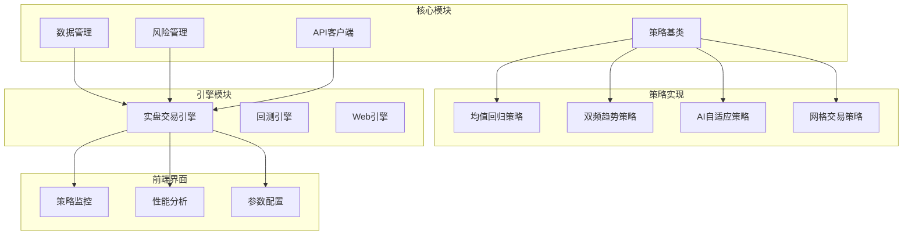
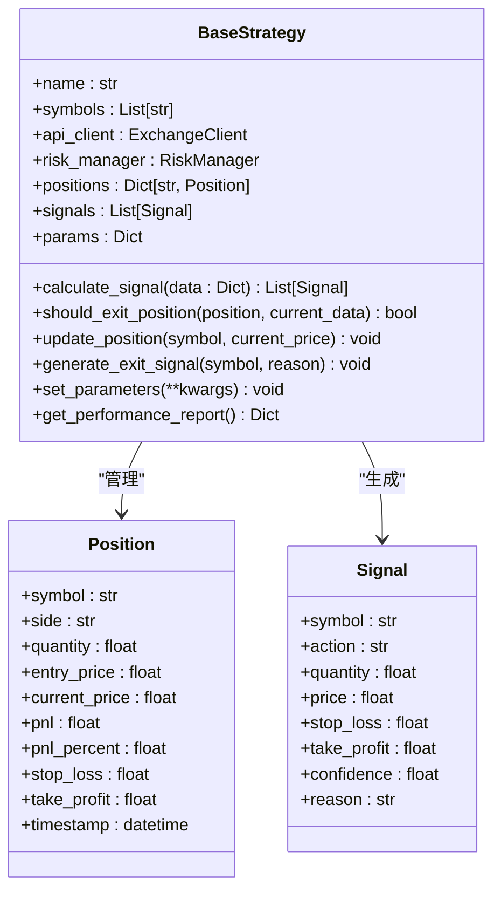
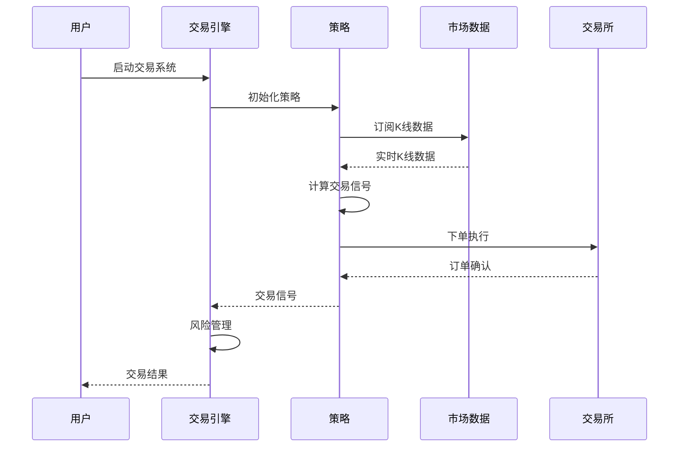
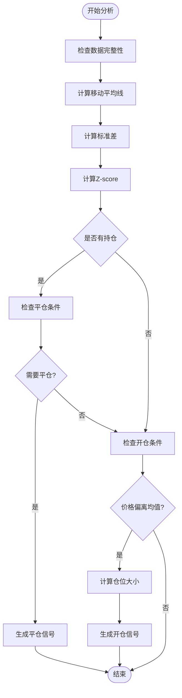
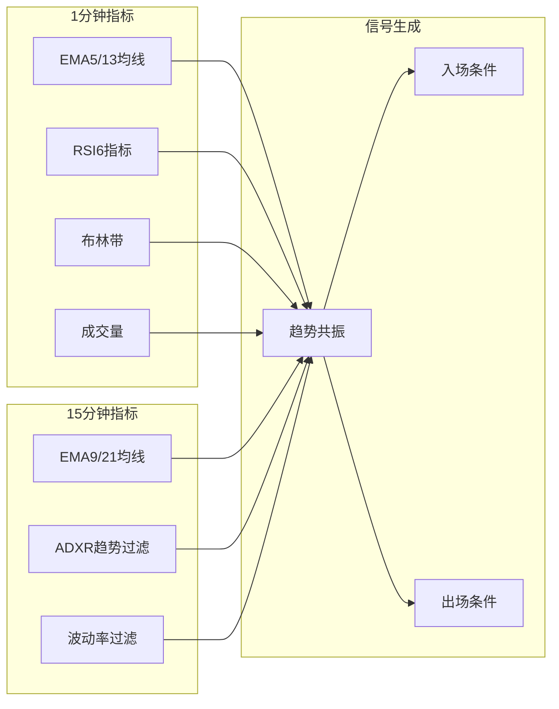
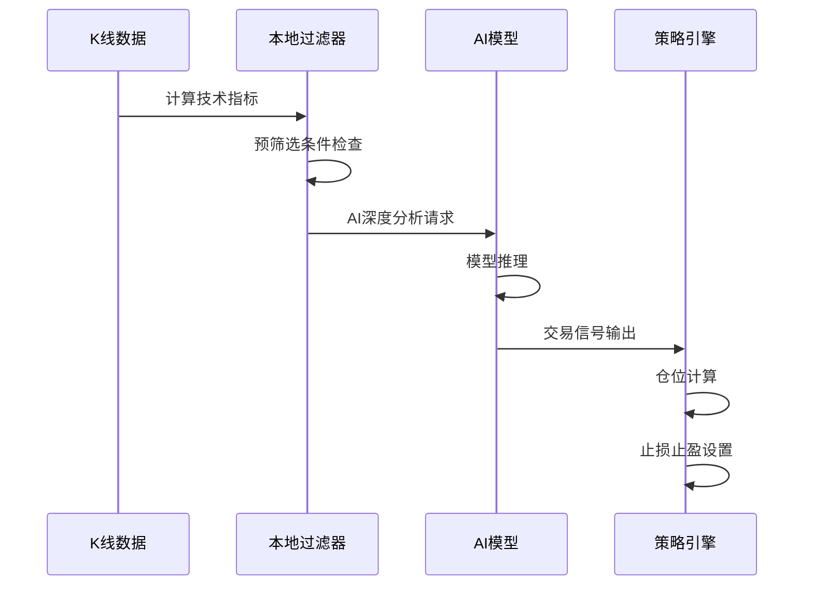
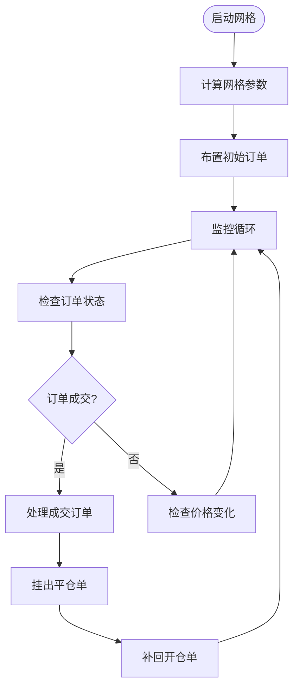
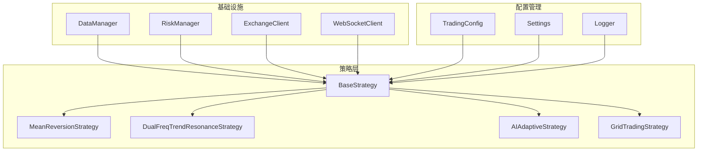

# 交易策略系统

<cite>
**本文档引用的文件**
- [main.py](file://main.py)
- [base.py](file://backpack_quant_trading/strategy/base.py)
- [mean_reversion.py](file://backpack_quant_trading/strategy/mean_reversion.py)
- [dual_freq_trend.py](file://backpack_quant_trading/strategy/dual_freq_trend.py)
- [grid_strategy.py](file://backpack_quant_trading/strategy/grid_strategy.py)
- [ai_adaptive.py](file://backpack_quant_trading/strategy/ai_adaptive.py)
- [live_trading.py](file://backpack_quant_trading/engine/live_trading.py)
- [StrategyDetail.jsx](file://backpack_quant_trading/frontend/src/views/StrategyDetail.jsx)
</cite>

## 目录
1. [简介](#简介)
2. [项目结构](#项目结构)
3. [核心组件](#核心组件)
4. [架构概览](#架构概览)
5. [详细组件分析](#详细组件分析)
6. [依赖分析](#依赖分析)
7. [性能考虑](#性能考虑)
8. [故障排除指南](#故障排除指南)
9. [结论](#结论)
10. [附录](#附录)

## 简介

交易策略系统是一个基于Python开发的量化交易框架，集成了多种交易策略和实盘交易引擎。该系统提供了完整的策略开发、回测、实盘交易和可视化监控功能。

### 系统特性

- **多策略支持**：支持均值回归、双频趋势共振、AI自适应、网格交易等多种策略
- **实盘交易**：通过抽象的交易所客户端接口支持多家交易所
- **可视化监控**：提供Web前端界面进行策略监控和性能分析
- **风险管理**：内置风险控制机制和止损止盈管理
- **回测功能**：支持历史数据回测和策略性能评估

## 项目结构

**图表来源**
- [main.py:31-55](file://main.py#L31-L55)
- [base.py:41-70](file://backpack_quant_trading/strategy/base.py#L41-L70)

**章节来源**
- [main.py:31-55](file://main.py#L31-L55)
- [base.py:1-50](file://backpack_quant_trading/strategy/base.py#L1-L50)

## 核心组件

### BaseStrategy 抽象基类

BaseStrategy是所有交易策略的抽象基类，定义了策略的标准接口和通用功能：

**图表来源**
- [base.py:16-41](file://backpack_quant_trading/strategy/base.py#L16-L41)
- [base.py:114-175](file://backpack_quant_trading/strategy/base.py#L114-L175)

### 策略注册表

系统通过策略注册表统一管理所有可用的交易策略：

**章节来源**
- [main.py:32-47](file://main.py#L32-L47)

## 架构概览

**图表来源**
- [live_trading.py:536-567](file://backpack_quant_trading/engine/live_trading.py#L536-L567)
- [main.py:197-286](file://main.py#L197-L286)

## 详细组件分析

### 均值回归策略

均值回归策略基于统计学原理，假设价格会在均值附近回归，当价格偏离均值过多时进行反向交易。

#### 核心算法

**图表来源**
- [mean_reversion.py:31-117](file://backpack_quant_trading/strategy/mean_reversion.py#L31-L117)

#### 参数配置

| 参数名称 | 默认值 | 说明 | 调优建议 |
|---------|--------|------|----------|
| lookback_period | 5 | 回看周期 | 5-20天，根据市场波动性调整 |
| zscore_threshold | 1.0 | Z-score阈值 | 0.8-1.5，高波动市场可适当提高 |
| position_size | 0.03 | 仓位大小比例 | 0.01-0.1，结合风险预算 |
| stop_loss_percent | 0.02 | 止损百分比 | 0.01-0.05，控制单笔损失 |
| take_profit_percent | 0.03 | 止盈百分比 | 0.02-0.08，追求合理收益 |

**章节来源**
- [mean_reversion.py:13-21](file://backpack_quant_trading/strategy/mean_reversion.py#L13-L21)
- [mean_reversion.py:31-117](file://backpack_quant_trading/strategy/mean_reversion.py#L31-L117)

### 双频趋势共振策略

双频趋势共振策略结合1分钟和15分钟两个时间框架，通过趋势共振提高交易信号的可靠性。

#### 技术指标体系

**图表来源**
- [dual_freq_trend.py:18-85](file://backpack_quant_trading/strategy/dual_freq_trend.py#L18-L85)

#### 核心参数

| 参数类别 | 参数名称 | 默认值 | 说明 |
|---------|----------|--------|------|
| 时间框架 | 1分钟周期 | 1m | 精细入场时机 |
| 15分钟趋势 | EMA9/21周期 | 9/21 | 趋势判断主周期 |
| 1分钟入场 | EMA5/13周期 | 5/13 | 入场确认指标 |
| RSI参数 | RSI周期 | 6 | 超买超卖判断 |
| 布林参数 | 周期/标准差 | 20/2 | 波动率过滤 |
| 止损止盈 | 保证金收益% | 50%/150% | 与杠杆联动 |

**章节来源**
- [dual_freq_trend.py:18-168](file://backpack_quant_trading/strategy/dual_freq_trend.py#L18-L168)

### AI自适应策略

AI自适应策略利用深度学习模型进行智能交易决策，通过本地指标预筛选降低AI调用频率。

#### AI分析流程

**图表来源**
- [ai_adaptive.py:266-332](file://backpack_quant_trading/strategy/ai_adaptive.py#L266-L332)

#### 性能优化

| 优化措施 | 效果 | 实现方式 |
|---------|------|----------|
| 本地指标预筛选 | 降低85%AI调用 | RSI/MACD/布林带 |
| 缓存机制 | 减少API调用 | 余额缓存10分钟 |
| 多策略并行 | 提高响应速度 | 异步处理 |
| 数据预加载 | 确保策略启动数据 | 启动时预加载 |

**章节来源**
- [ai_adaptive.py:80-164](file://backpack_quant_trading/strategy/ai_adaptive.py#L80-L164)
- [ai_adaptive.py:266-332](file://backpack_quant_trading/strategy/ai_adaptive.py#L266-L332)

### 网格交易策略

网格交易策略通过在价格区间内设置多个买卖挂单，实现自动高抛低吸的交易模式。

#### 网格算法

**图表来源**
- [grid_strategy.py:532-597](file://backpack_quant_trading/strategy/grid_strategy.py#L532-L597)

#### 风险控制

| 风险控制项 | 实现方式 | 阈值设置 |
|-----------|----------|----------|
| 日内最大亏损 | 30%网格投资总额 | 自动停止 |
| 总亏损限制 | 50%初始资金 | 立即停止 |
| 持仓价值限制 | 账户余额20% | 实时监控 |
| 冷却时间 | 5秒订单间隔 | 防止429限频 |
| 边界保护 | 价格方向拦截 | 取消用户要求 |

**章节来源**
- [grid_strategy.py:132-140](file://backpack_quant_trading/strategy/grid_strategy.py#L132-L140)
- [grid_strategy.py:599-753](file://backpack_quant_trading/strategy/grid_strategy.py#L599-L753)

## 依赖分析

### 策略依赖关系

**图表来源**
- [base.py:41-70](file://backpack_quant_trading/strategy/base.py#L41-L70)
- [live_trading.py:347-402](file://backpack_quant_trading/engine/live_trading.py#L347-L402)

### 外部依赖

系统主要依赖以下外部库：

- **pandas/numpy**：数据处理和科学计算
- **websockets**：WebSocket通信
- **loguru**：日志管理
- **asyncio**：异步编程
- **echarts**：前端可视化

**章节来源**
- [dual_freq_trend.py:8-15](file://backpack_quant_trading/strategy/dual_freq_trend.py#L8-L15)
- [ai_adaptive.py:1-8](file://backpack_quant_trading/strategy/ai_adaptive.py#L1-L8)

## 性能考虑

### 策略性能指标

| 指标类型 | 计算方法 | 目标值 | 评估标准 |
|---------|----------|--------|----------|
| 收益率 | (最终资产/初始资产-1)×100% | >0% | 年化收益率>10% |
| 夏普比率 | (收益率-无风险利率)/收益率标准差 | >0.5 | 风险调整后收益 |
| 最大回撤 | (峰值-谷值)/峰值×100% | <20% | 风险控制水平 |
| 胜率 | 盈利交易数/总交易数 | >50% | 策略稳定性 |
| 盈亏比 | 平均盈利/平均亏损 | >1.5 | 盈利效率 |

### 性能优化策略

1. **数据预处理优化**
   - 使用缓存机制减少重复计算
   - 异步数据加载避免阻塞
   - 批量数据处理提高效率

2. **算法优化**
   - 向量化计算替代循环
   - 使用高效的数据结构
   - 减少不必要的数据复制

3. **内存管理**
   - 及时清理历史数据
   - 控制数据缓存大小
   - 使用生成器处理大数据集

## 故障排除指南

### 常见问题及解决方案

#### 1. WebSocket连接问题

**症状**：无法接收实时数据或连接频繁断开

**解决方案**：
- 检查网络连接和防火墙设置
- 配置代理服务器（如需要）
- 实现自动重连机制
- 设置合理的超时时间

#### 2. 订单执行失败

**症状**：订单提交后状态异常或无法成交

**解决方案**：
- 检查账户余额和保证金
- 验证交易对有效性
- 确认价格精度和数量精度
- 检查交易所API限制

#### 3. 策略参数调优问题

**症状**：策略表现不佳或频繁止损

**解决方案**：
- 从小参数范围开始逐步调整
- 使用回测验证参数效果
- 考虑市场环境变化
- 实施参数自适应机制

**章节来源**
- [live_trading.py:153-235](file://backpack_quant_trading/engine/live_trading.py#L153-L235)
- [grid_strategy.py:400-498](file://backpack_quant_trading/strategy/grid_strategy.py#L400-L498)

## 结论

交易策略系统提供了一个完整、灵活且高性能的量化交易框架。通过抽象基类设计和策略注册机制，系统支持多种交易策略的快速开发和部署。

### 系统优势

1. **模块化设计**：清晰的组件分离便于维护和扩展
2. **多策略支持**：涵盖不同交易风格和市场环境
3. **实盘友好**：完善的风控机制和风险管理
4. **可视化监控**：直观的前端界面进行策略监控
5. **性能优化**：高效的算法实现和资源管理

### 未来发展

1. **AI策略增强**：集成更多机器学习模型
2. **多市场支持**：扩展到更多交易所和市场
3. **自动化优化**：实现参数自动调优
4. **策略组合**：支持多策略混合交易

## 附录

### 策略选择指南

| 策略类型 | 适用市场 | 交易频率 | 风险等级 | 选择建议 |
|---------|----------|----------|----------|----------|
| 均值回归 | 横盘市场 | 低-中 | 低-中 | 适合震荡市场 |
| 双频趋势 | 趋势市场 | 中 | 中 | 适合趋势跟踪 |
| AI自适应 | 所有市场 | 高 | 中 | 适合复杂市场环境 |
| 网格交易 | 横盘市场 | 高 | 低 | 适合震荡市场 |

### 参数调优流程

1. **确定目标**：明确收益目标和风险承受能力
2. **选择策略**：根据市场特征选择合适策略
3. **初步设置**：使用默认参数进行测试
4. **回测验证**：使用历史数据验证策略效果
5. **参数优化**：逐步调整参数寻找最优解
6. **实盘验证**：小资金实盘验证策略稳定性
7. **持续监控**：定期评估和调整策略参数