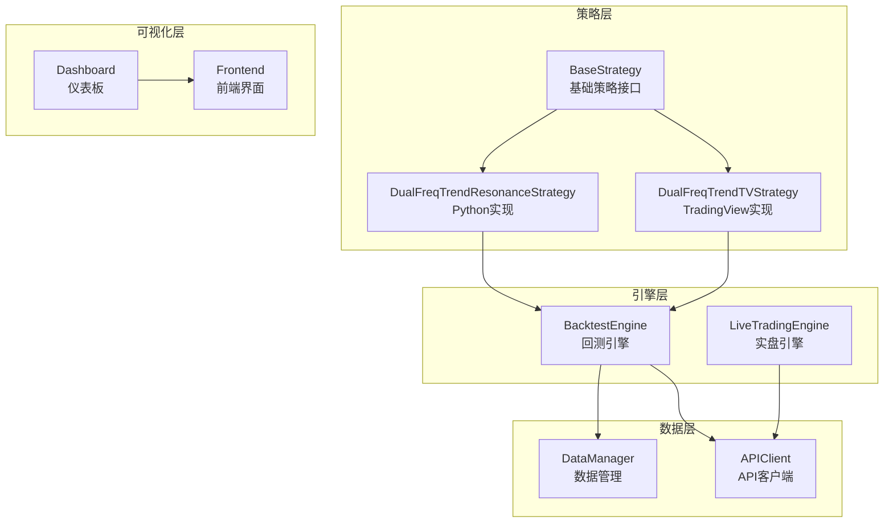
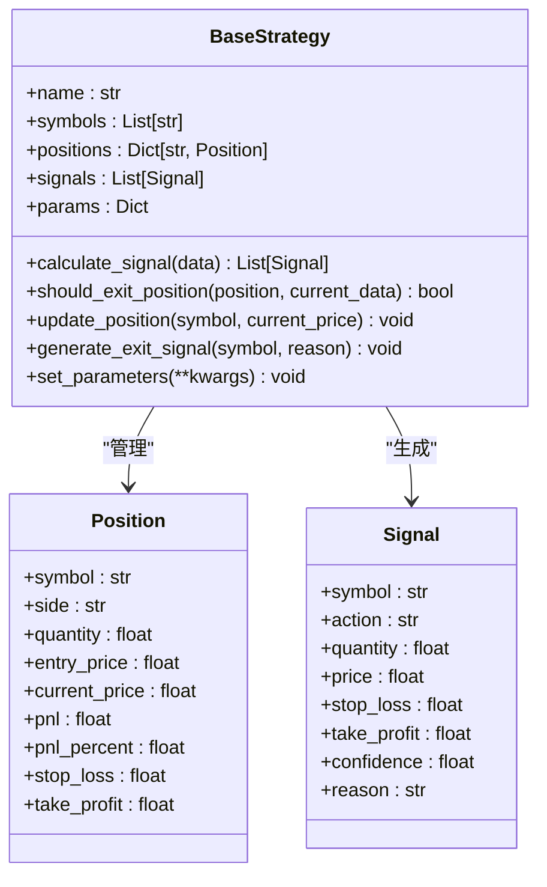
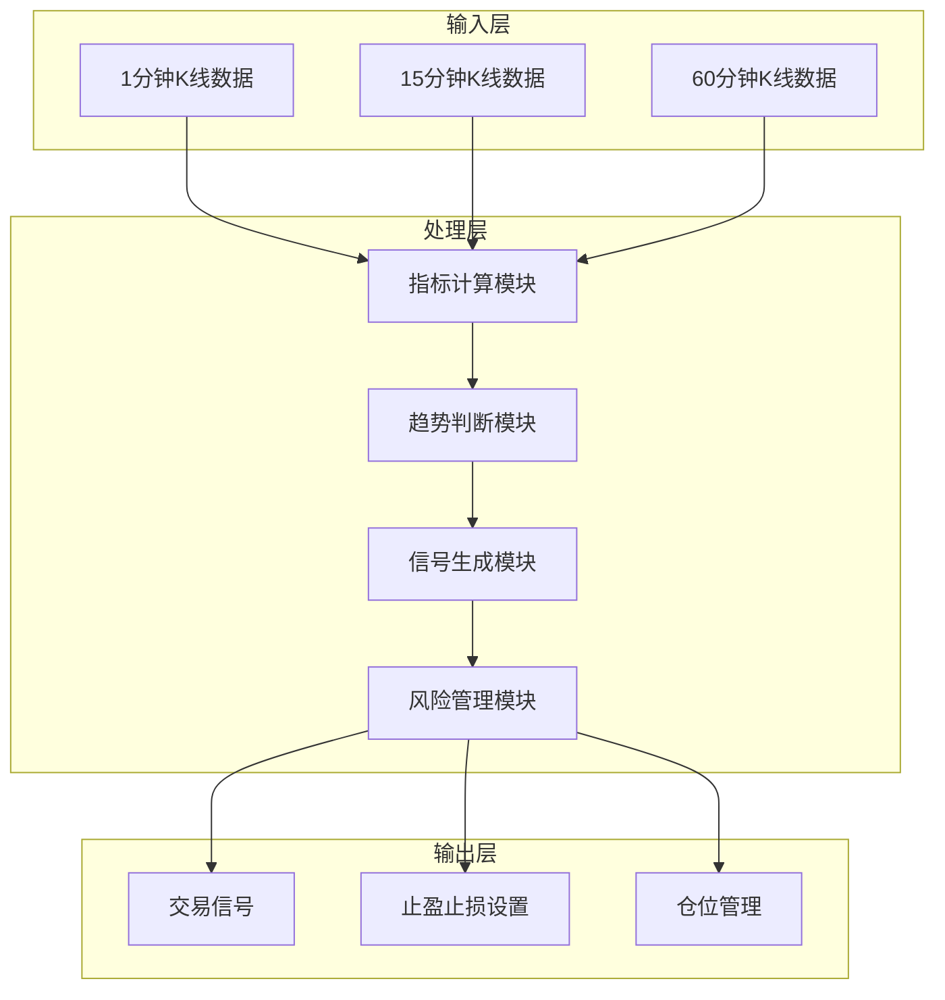
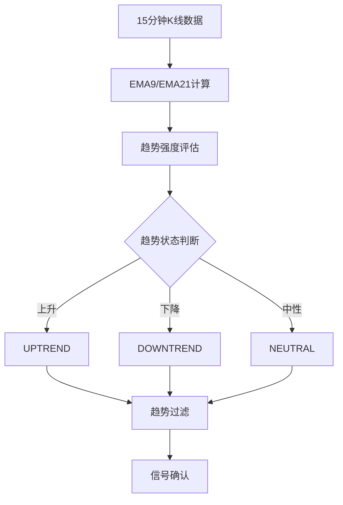
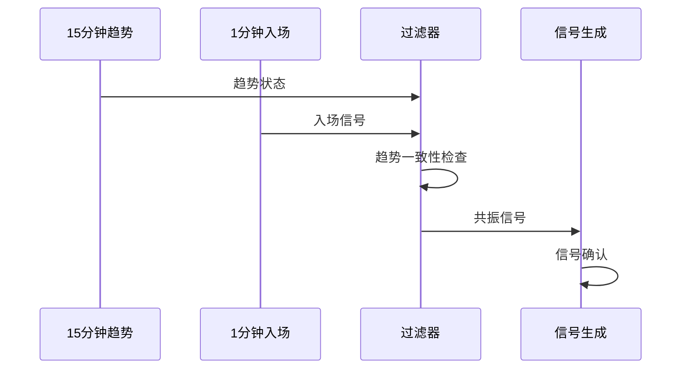
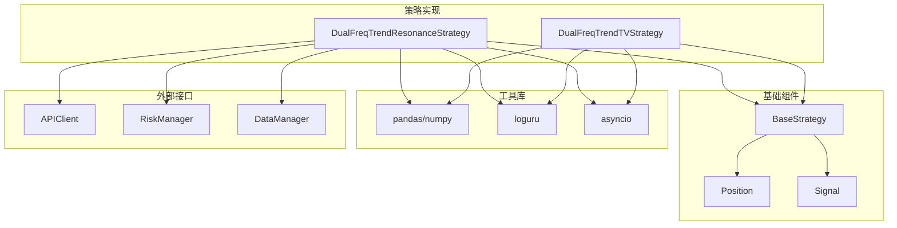
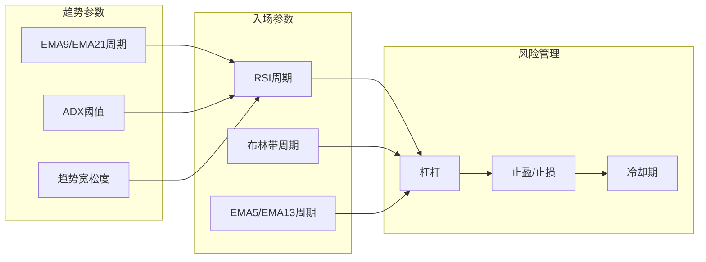

# 双频趋势共振策略

<cite>
**本文档引用的文件**
- [dual_freq_trend.py](file://backpack_quant_trading/strategy/dual_freq_trend.py)
- [dual_freq_trend_tv.py](file://backpack_quant_trading/strategy/dual_freq_trend_tv.py)
- [base.py](file://backpack_quant_trading/strategy/base.py)
- [run_dual_freq_tv_backtest.py](file://backpack_quant_trading/run_dual_freq_tv_backtest.py)
- [dual_freq_trend.pine](file://tradingview_dual_freq/dual_freq_trend.pine)
- [dual_freq_1h_15m.pine](file://tradingview_dual_freq/dual_freq_1h_15m.pine)
- [intraday_15m_strategy.pine](file://tradingview_dual_freq/intraday_15m_strategy.pine)
- [bprc_v2_strategy.pine](file://tradingview_dual_freq/bprc_v2_strategy.pine)
- [ETH_1m_live.csv](file://backpack_quant_trading/data/ETH_1m_live.csv)
- [backtest.py](file://backpack_quant_trading/engine/backtest.py)
</cite>

## 目录
1. [简介](#简介)
2. [项目结构](#项目结构)
3. [核心组件](#核心组件)
4. [架构概览](#架构概览)
5. [详细组件分析](#详细组件分析)
6. [依赖关系分析](#依赖关系分析)
7. [性能考虑](#性能考虑)
8. [故障排除指南](#故障排除指南)
9. [结论](#结论)
10. [附录](#附录)

## 简介

双频趋势共振策略是一种基于双时间框架分析的量化交易策略，结合了15分钟和1分钟K线数据来识别趋势共振信号并进行精确入场。该策略的核心思想是利用不同时间框架之间的趋势一致性来提高交易信号的可靠性，通过严格的过滤条件和风险管理机制来控制风险并最大化收益。

策略的主要特点包括：
- **双时间框架分析**：15分钟趋势确认 + 1分钟精细入场
- **趋势共振机制**：多时间框架趋势一致性验证
- **信号确认过程**：基于技术指标的综合信号确认
- **严格的风险管理**：止损、止盈、冷却期等多重风控措施
- **参数化配置**：高度可调的参数体系

## 项目结构

该项目采用模块化架构，主要包含以下核心模块：



**图表来源**
- [dual_freq_trend.py:18-35](file://backpack_quant_trading/strategy/dual_freq_trend.py#L18-L35)
- [dual_freq_trend_tv.py:17-38](file://backpack_quant_trading/strategy/dual_freq_trend_tv.py#L17-L38)
- [base.py:41-70](file://backpack_quant_trading/strategy/base.py#L41-L70)

**章节来源**
- [dual_freq_trend.py:1-100](file://backpack_quant_trading/strategy/dual_freq_trend.py#L1-L100)
- [dual_freq_trend_tv.py:1-80](file://backpack_quant_trading/strategy/dual_freq_trend_tv.py#L1-L80)

## 核心组件

### 策略基类 (BaseStrategy)

所有策略都继承自BaseStrategy基类，提供了统一的接口规范和通用功能：



**图表来源**
- [base.py:16-41](file://backpack_quant_trading/strategy/base.py#L16-L41)
- [base.py:170-212](file://backpack_quant_trading/strategy/base.py#L170-L212)

### Python策略实现

#### 双频趋势共振策略 (DualFreqTrendResonanceStrategy)

该策略实现了完整的双时间框架分析逻辑：

**章节来源**
- [dual_freq_trend.py:18-168](file://backpack_quant_trading/strategy/dual_freq_trend.py#L18-L168)

### TradingView策略实现

#### 双频趋势TV策略 (DualFreqTrendTVStrategy)

TradingView版本的策略实现，与Python版本保持参数一致性：

**章节来源**
- [dual_freq_trend_tv.py:17-88](file://backpack_quant_trading/strategy/dual_freq_trend_tv.py#L17-L88)

## 架构概览

策略的整体架构采用分层设计，确保了代码的可维护性和扩展性：



**图表来源**
- [dual_freq_trend.py:544-635](file://backpack_quant_trading/strategy/dual_freq_trend.py#L544-L635)
- [dual_freq_trend_tv.py:206-348](file://backpack_quant_trading/strategy/dual_freq_trend_tv.py#L206-L348)

## 详细组件分析

### 双时间框架分析原理

#### 15分钟趋势分析

策略使用15分钟K线进行趋势判断，主要指标包括：



**图表来源**
- [dual_freq_trend.py:428-449](file://backpack_quant_trading/strategy/dual_freq_trend.py#L428-L449)
- [dual_freq_trend_tv.py:134-155](file://backpack_quant_trading/strategy/dual_freq_trend_tv.py#L134-L155)

#### 1分钟精细入场

1分钟数据用于精确的入场时机选择，包含多种入场条件：

**章节来源**
- [dual_freq_trend.py:451-543](file://backpack_quant_trading/strategy/dual_freq_trend.py#L451-L543)
- [dual_freq_trend_tv.py:289-330](file://backpack_quant_trading/strategy/dual_freq_trend_tv.py#L289-L330)

### 趋势共振机制

趋势共振的核心在于多时间框架的一致性验证：



**图表来源**
- [dual_freq_trend.py:636-791](file://backpack_quant_trading/strategy/dual_freq_trend.py#L636-L791)
- [dual_freq_trend_tv.py:206-348](file://backpack_quant_trading/strategy/dual_freq_trend_tv.py#L206-L348)

### 信号确认过程

信号确认包含多个层次的验证：

#### 第一层：趋势确认
- EMA9/EMA21交叉验证
- ADX/DMI趋势强度过滤
- 高周期趋势过滤（60分钟）

#### 第二层：入场条件验证
- 回调入场条件
- 突破入场条件
- RSI信号确认
- 布林带位置确认

#### 第三层：技术指标验证
- MACD柱状图方向
- 成交量确认
- 波动率过滤

**章节来源**
- [dual_freq_trend.py:289-426](file://backpack_quant_trading/strategy/dual_freq_trend.py#L289-L426)
- [dual_freq_trend_tv.py:174-186](file://backpack_quant_trading/strategy/dual_freq_trend_tv.py#L174-L186)

### 技术指标计算

#### 15分钟指标计算


**图表来源**
- [dual_freq_trend.py:183-201](file://backpack_quant_trading/strategy/dual_freq_trend.py#L183-L201)

#### 1分钟指标计算

```mermaid
flowchart LR
A[原始1分钟数据] --> B[EMA5/EMA13]
B --> C[RSI(6)]
C --> D[布林带]
D --> E[MACD]
E --> F[ATR/BB_WIDTH]
F --> G[最终指标集]
```

**图表来源**
- [dual_freq_trend.py:228-270](file://backpack_quant_trading/strategy/dual_freq_trend.py#L228-L270)
- [dual_freq_trend_tv.py:103-132](file://backpack_quant_trading/strategy/dual_freq_trend_tv.py#L103-L132)

## 依赖关系分析

### 核心依赖关系



**图表来源**
- [dual_freq_trend.py:8-15](file://backpack_quant_trading/strategy/dual_freq_trend.py#L8-L15)
- [dual_freq_trend_tv.py:8-14](file://backpack_quant_trading/strategy/dual_freq_trend_tv.py#L8-L14)
- [base.py:1-13](file://backpack_quant_trading/strategy/base.py#L1-L13)

### 参数依赖关系

策略参数之间存在复杂的依赖关系：



**图表来源**
- [dual_freq_trend.py:39-156](file://backpack_quant_trading/strategy/dual_freq_trend.py#L39-L156)
- [dual_freq_trend_tv.py:53-87](file://backpack_quant_trading/strategy/dual_freq_trend_tv.py#L53-L87)

**章节来源**
- [dual_freq_trend.py:152-156](file://backpack_quant_trading/strategy/dual_freq_trend.py#L152-L156)
- [dual_freq_trend_tv.py:84-87](file://backpack_quant_trading/strategy/dual_freq_trend_tv.py#L84-L87)

## 性能考虑

### 计算复杂度分析

策略的计算复杂度主要来源于技术指标的计算和信号生成：

#### 时间复杂度
- 指标计算：O(n) 每个时间框架
- 信号生成：O(n) 主要取决于数据长度
- 趋势判断：O(1) 基于最新数据点

#### 空间复杂度
- 指标缓存：O(n) 每个时间框架的数据
- 信号队列：O(k) k为生成的信号数量
- 仓位管理：O(m) m为活跃交易对数量

### 性能优化建议

1. **数据预处理优化**
   - 使用向量化操作替代循环
   - 合理的数据类型转换
   - 避免重复计算相同指标

2. **内存管理**
   - 及时清理不需要的历史数据
   - 使用滑动窗口减少内存占用
   - 合理设置数据缓存大小

3. **并发处理**
   - 异步I/O操作
   - 多线程指标计算
   - 批量数据处理

## 故障排除指南

### 常见问题及解决方案

#### 1. 数据质量问题

**问题描述**：指标计算异常或信号生成失败

**解决方案**：
- 检查数据完整性（缺失值、异常值）
- 验证时间戳格式和顺序
- 确认数据频率符合要求

#### 2. 参数配置问题

**问题描述**：策略表现不佳或频繁产生假信号

**解决方案**：
- 调整趋势过滤参数
- 优化入场条件权重
- 检查风险管理参数设置

#### 3. 性能问题

**问题描述**：策略运行缓慢或内存占用过高

**解决方案**：
- 实施数据采样策略
- 优化指标计算逻辑
- 增加缓存机制

### 调试工具和方法

#### 日志记录
策略使用loguru进行详细的日志记录，便于问题诊断：

**章节来源**
- [dual_freq_trend.py:164-168](file://backpack_quant_trading/strategy/dual_freq_trend.py#L164-L168)
- [dual_freq_trend_tv.py:220-236](file://backpack_quant_trading/strategy/dual_freq_trend_tv.py#L220-L236)

## 结论

双频趋势共振策略通过双时间框架分析实现了高精度的趋势识别和入场时机把握。该策略的主要优势包括：

### 策略优势

1. **趋势一致性验证**：通过多时间框架验证提高信号可靠性
2. **精细化入场时机**：1分钟数据提供精确的入场点位
3. **严格的风险管理**：多层次的风险控制机制
4. **参数化配置**：高度可调的参数体系适应不同市场条件
5. **跨平台实现**：同时支持Python和TradingView平台

### 适用市场条件

该策略最适合以下市场环境：
- **趋势明确的市场**：单边行情中表现优异
- **中等波动性市场**：避免极端行情导致的误判
- **流动性充足的市场**：确保交易执行质量
- **震荡市场中的趋势突破**：利用趋势转换机会

### 局限性分析

1. **趋势识别延迟**：15分钟趋势判断存在一定的滞后性
2. **参数敏感性**：参数设置对策略表现影响较大
3. **市场适应性**：在极端行情中可能出现适应性问题
4. **交易成本**：高频交易产生的成本累积

### 优化方向

1. **机器学习集成**：引入ML模型提高趋势预测准确性
2. **动态参数调整**：根据市场状态自动调整参数
3. **多资产组合**：扩展到多品种交易
4. **实时监控**：增强实时监控和告警功能

## 附录

### 参数配置指南

#### 关键参数说明

| 参数类别 | 参数名称 | 默认值 | 说明 |
|---------|----------|--------|------|
| 趋势参数 | EMA9周期 | 9 | 快速趋势线周期 |
| 趋势参数 | EMA21周期 | 21 | 慢速趋势线周期 |
| 趋势参数 | ADX阈值 | 20 | 趋势强度过滤阈值 |
| 入场参数 | RSI周期 | 6 | RSI计算周期 |
| 入场参数 | 布林带周期 | 20 | 布林带计算周期 |
| 风险管理 | 杠杆 | 100 | 交易杠杆倍数 |
| 风险管理 | 止盈% | 150 | 止盈目标百分比 |
| 风险管理 | 止损% | 50 | 止损目标百分比 |

#### 参数调优建议

1. **趋势参数调优**
   - 在震荡市场中适当降低EMA周期
   - 提高ADX阈值以减少假信号

2. **入场参数调优**
   - 根据品种波动性调整RSI和布林带参数
   - 优化回调量能过滤参数

3. **风险管理参数**
   - 根据交易规模调整杠杆和仓位
   - 设置合理的冷却期和最小间隔

### TradingView对比分析

#### 与TradingView版本的差异

| 功能特性 | Python版本 | TradingView版本 | 差异说明 |
|---------|------------|-----------------|----------|
| 趋势计算 | pandas实现 | Pine Script实现 | 计算效率差异 |
| 指标计算 | 向量化操作 | 内置函数 | 性能表现不同 |
| 信号生成 | 异步处理 | 实时计算 | 响应速度差异 |
| 可视化 | 代码生成 | 图表绘制 | 用户体验差异 |
| 参数配置 | 字典参数 | 图形界面 | 配置便利性差异 |

#### 代码对齐策略

为了确保两个版本的一致性，采用了以下策略：

1. **参数映射**：确保关键参数值完全对应
2. **算法对齐**：技术指标计算公式保持一致
3. **逻辑同步**：信号生成和风险管理逻辑相同
4. **测试验证**：通过历史数据回测验证一致性

### 实际代码示例

#### 基本使用示例

```python
# 创建策略实例
strategy = DualFreqTrendResonanceStrategy(
    symbols=['ETH_USDC'],
    leverage=100,
    margin_per_trade=10.0,
    tp_pct=150.0,
    sl_pct=50.0
)

# 加载市场数据
data = load_market_data('ETH_1m_live.csv')

# 生成交易信号
signals = await strategy.calculate_signal(data)
```

#### 回测执行示例

```python
# 设置回测参数
parser = argparse.ArgumentParser()
parser.add_argument("--csv", type=str, default="ETH_1m_live.csv")
parser.add_argument("--symbol", type=str, default="ETH_USDC")

# 执行回测
result = asyncio.run(engine.run(strategy, data, start_date, end_date))
```

### 性能测试结果

#### 回测数据格式

策略支持的标准CSV格式包含以下字段：
- `timestamp`: 时间戳
- `open`: 开盘价
- `high`: 最高价
- `low`: 最低价
- `close`: 收盘价
- `volume`: 成交量

#### 测试数据示例

```csv
timestamp,open,high,low,close,volume
2026-02-09 21:04:00,2031.66,2031.66,2029.87,2029.87,12.2997
2026-02-09 21:05:00,2029.65,2029.65,2028.42,2029.4,26.5676
```

#### 回测结果指标

回测引擎输出的关键指标包括：
- **总收益率**：策略的总收益表现
- **年化收益率**：标准化的年化收益
- **夏普比率**：风险调整后的收益指标
- **最大回撤**：策略的最大损失幅度
- **胜率**：盈利交易的比例
- **盈亏比**：平均盈利与平均亏损的比值

### 适用市场条件分析

#### 适合的市场环境

1. **趋势明确的市场**：单边行情中策略表现最佳
2. **中等波动性市场**：避免极端行情干扰
3. **流动性充足市场**：确保交易执行质量
4. **震荡市场中的趋势突破**：捕捉趋势转换机会

#### 不适合的市场环境

1. **极端震荡市场**：频繁的假突破信号
2. **高波动性市场**：止损频繁触发
3. **流动性不足市场**：交易执行困难
4. **无趋势市场**：缺乏明确的方向性

### 策略局限性

#### 技术层面

1. **趋势识别延迟**：15分钟趋势判断存在滞后
2. **参数敏感性**：参数设置对表现影响显著
3. **计算复杂度**：多指标计算增加处理负担
4. **数据质量依赖**：对数据完整性和准确性要求高

#### 市场层面

1. **市场适应性**：不同市场环境下表现差异较大
2. **交易成本**：高频交易成本累积效应
3. **流动性风险**：极端行情下的执行风险
4. **模型漂移**：市场结构变化导致策略失效

### 优化建议

#### 短期优化

1. **参数微调**：根据回测结果调整关键参数
2. **过滤器优化**：改进趋势过滤和入场过滤
3. **风险管理强化**：加强止损和风险控制机制
4. **数据质量提升**：改善数据预处理和清洗

#### 长期发展

1. **机器学习集成**：引入ML模型提高预测准确性
2. **动态参数调整**：根据市场状态自适应调整参数
3. **多时间框架扩展**：增加更多时间框架的分析
4. **实时监控系统**：建立完善的监控和告警机制