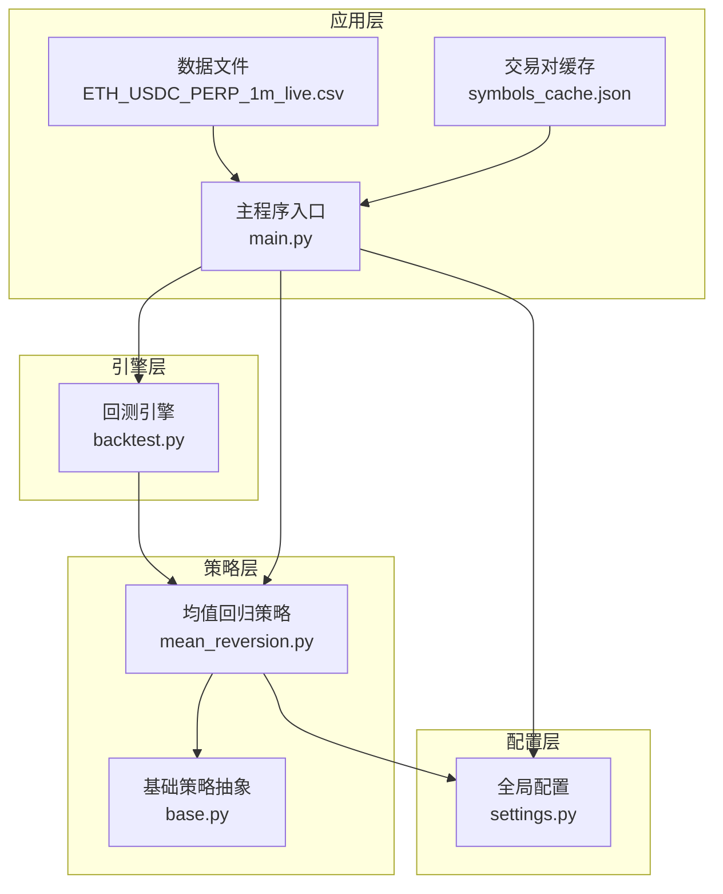
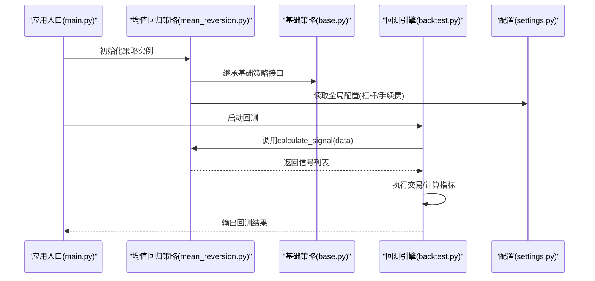
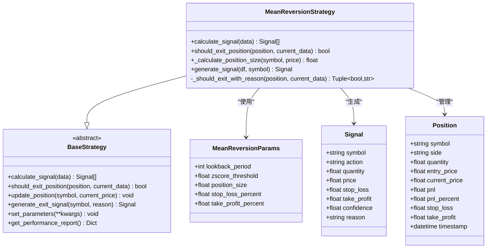
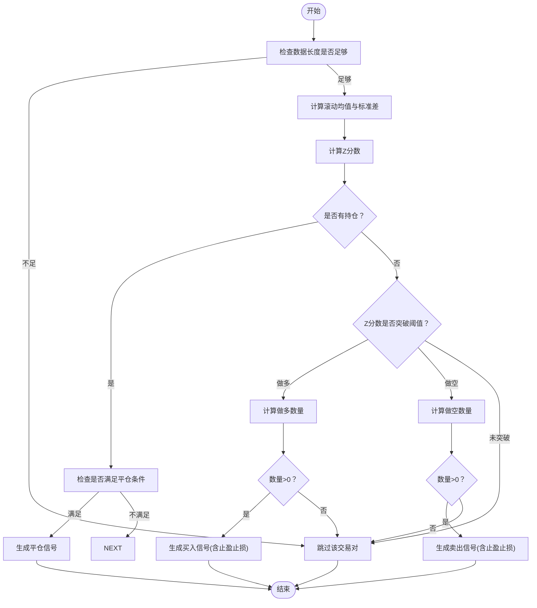
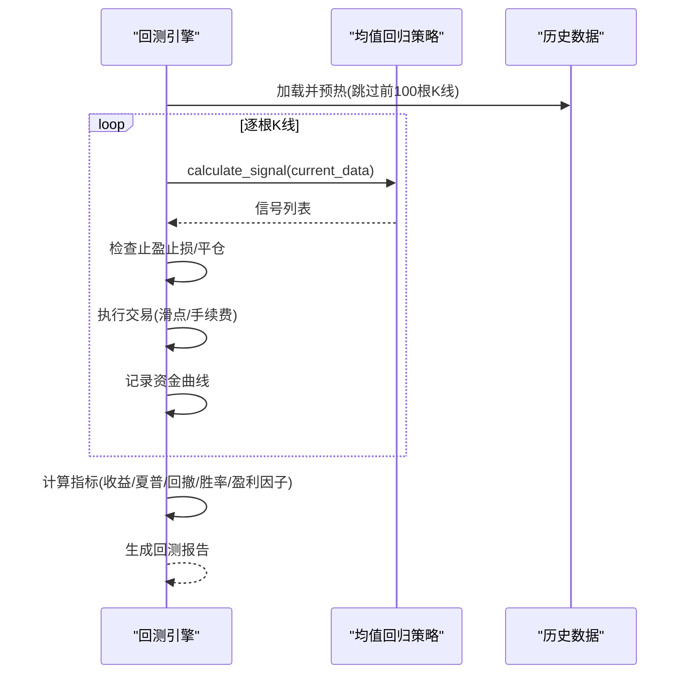
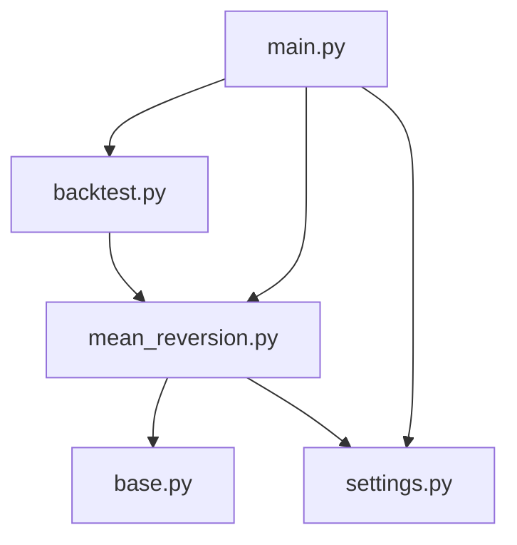

# 均值回归策略

<cite>
**本文档引用的文件**
- [mean_reversion.py](file://backpack_quant_trading/strategy/mean_reversion.py)
- [base.py](file://backpack_quant_trading/strategy/base.py)
- [backtest.py](file://backpack_quant_trading/engine/backtest.py)
- [settings.py](file://backpack_quant_trading/config/settings.py)
- [main.py](file://backpack_quant_trading/main.py)
- [ETH_USDC_PERP_1m_live.csv](file://backpack_quant_trading/data/ETH_USDC_PERP_1m_live.csv)
- [symbols_cache.json](file://backpack_quant_trading/data/symbols_cache.json)
</cite>

## 目录
1. [简介](#简介)
2. [项目结构](#项目结构)
3. [核心组件](#核心组件)
4. [架构概览](#架构概览)
5. [详细组件分析](#详细组件分析)
6. [依赖关系分析](#依赖关系分析)
7. [性能考量](#性能考量)
8. [故障排除指南](#故障排除指南)
9. [结论](#结论)
10. [附录](#附录)

## 简介
本文件为均值回归策略的完整实现文档，涵盖理论基础、布林带原理与参数配置、信号生成机制、风险管理、参数调优指南、适用市场环境分析以及性能评估方法。文档面向不同技术背景的读者，既提供深入的技术细节，也包含易于理解的概念解释和实用的操作指南。

## 项目结构
均值回归策略位于策略层，与回测引擎、配置系统和基础策略框架紧密集成。核心文件包括策略实现、基础策略抽象、回测引擎、配置管理和主程序入口。

**图表来源**
- [mean_reversion.py:1-263](file://backpack_quant_trading/strategy/mean_reversion.py#L1-L263)
- [base.py:1-212](file://backpack_quant_trading/strategy/base.py#L1-L212)
- [backtest.py:1-404](file://backpack_quant_trading/engine/backtest.py#L1-L404)
- [settings.py:1-137](file://backpack_quant_trading/config/settings.py#L1-L137)
- [main.py:1-344](file://backpack_quant_trading/main.py#L1-L344)
- [ETH_USDC_PERP_1m_live.csv:1-200](file://backpack_quant_trading/data/ETH_USDC_PERP_1m_live.csv#L1-L200)
- [symbols_cache.json:1-543](file://backpack_quant_trading/data/symbols_cache.json#L1-L543)

**章节来源**
- [mean_reversion.py:1-263](file://backpack_quant_trading/strategy/mean_reversion.py#L1-L263)
- [base.py:1-212](file://backpack_quant_trading/strategy/base.py#L1-L212)
- [backtest.py:1-404](file://backpack_quant_trading/engine/backtest.py#L1-L404)
- [settings.py:1-137](file://backpack_quant_trading/config/settings.py#L1-L137)
- [main.py:1-344](file://backpack_quant_trading/main.py#L1-L344)
- [ETH_USDC_PERP_1m_live.csv:1-200](file://backpack_quant_trading/data/ETH_USDC_PERP_1m_live.csv#L1-L200)
- [symbols_cache.json:1-543](file://backpack_quant_trading/data/symbols_cache.json#L1-L543)

## 核心组件
- 均值回归策略类：负责计算Z分数、生成买卖信号、管理止盈止损和平仓逻辑。
- 基础策略抽象：定义统一的策略接口、信号结构、仓位管理和性能指标。
- 回测引擎：提供历史数据回测、交易执行、费用与滑点模拟、指标计算与评估。
- 配置系统：集中管理交易配置、杠杆、手续费、滑点等全局参数。
- 主程序入口：策略注册、参数解析、回测/实盘运行流程编排。

**章节来源**
- [mean_reversion.py:23-117](file://backpack_quant_trading/strategy/mean_reversion.py#L23-L117)
- [base.py:41-112](file://backpack_quant_trading/strategy/base.py#L41-L112)
- [backtest.py:48-187](file://backpack_quant_trading/engine/backtest.py#L48-L187)
- [settings.py:55-64](file://backpack_quant_trading/config/settings.py#L55-L64)
- [main.py:31-47](file://backpack_quant_trading/main.py#L31-L47)

## 架构概览
均值回归策略采用“策略-引擎-配置-应用”的分层架构。策略层基于基础抽象实现具体逻辑；引擎层负责回测与实盘执行；配置层提供全局参数；应用层协调各组件并处理用户交互。

**图表来源**
- [main.py:160-195](file://backpack_quant_trading/main.py#L160-L195)
- [mean_reversion.py:31-117](file://backpack_quant_trading/strategy/mean_reversion.py#L31-L117)
- [base.py:71-112](file://backpack_quant_trading/strategy/base.py#L71-L112)
- [backtest.py:65-187](file://backpack_quant_trading/engine/backtest.py#L65-L187)
- [settings.py:55-64](file://backpack_quant_trading/config/settings.py#L55-L64)

## 详细组件分析

### 均值回归策略类
- 参数配置：包含回看周期、Z分数阈值、仓位大小、止损与止盈百分比。
- 信号生成：基于滚动均值与标准差计算Z分数，当Z分数低于负阈值做多，高于正阈值做空。
- 止损止盈：根据入场价格和设定百分比动态生成止盈止损价格。
- 平仓逻辑：当触及止损/止盈或Z分数接近均值时平仓。
- 仓位计算：结合账户余额、保证金、杠杆与风控校验，计算可下单数量。

**图表来源**
- [mean_reversion.py:13-21](file://backpack_quant_trading/strategy/mean_reversion.py#L13-L21)
- [mean_reversion.py:23-263](file://backpack_quant_trading/strategy/mean_reversion.py#L23-L263)
- [base.py:16-30](file://backpack_quant_trading/strategy/base.py#L16-L30)
- [base.py:31-41](file://backpack_quant_trading/strategy/base.py#L31-L41)
- [base.py:41-112](file://backpack_quant_trading/strategy/base.py#L41-L112)

**章节来源**
- [mean_reversion.py:13-21](file://backpack_quant_trading/strategy/mean_reversion.py#L13-L21)
- [mean_reversion.py:23-117](file://backpack_quant_trading/strategy/mean_reversion.py#L23-L117)
- [mean_reversion.py:119-149](file://backpack_quant_trading/strategy/mean_reversion.py#L119-L149)
- [mean_reversion.py:151-246](file://backpack_quant_trading/strategy/mean_reversion.py#L151-L246)
- [base.py:16-30](file://backpack_quant_trading/strategy/base.py#L16-L30)
- [base.py:31-41](file://backpack_quant_trading/strategy/base.py#L31-L41)
- [base.py:41-112](file://backpack_quant_trading/strategy/base.py#L41-L112)

### 信号生成与平仓逻辑
- 信号生成：当Z分数低于负阈值生成做多信号，高于正阈值生成做空信号；信号包含止盈止损价格与置信度。
- 平仓条件：止损/止盈触发或Z分数接近均值时平仓；支持多空双向持仓管理。
- 仓位计算：优先使用USDT/USDC余额，考虑最小交易单位与风控校验，动态计算下单数量。

**图表来源**
- [mean_reversion.py:31-117](file://backpack_quant_trading/strategy/mean_reversion.py#L31-L117)
- [mean_reversion.py:119-149](file://backpack_quant_trading/strategy/mean_reversion.py#L119-L149)
- [mean_reversion.py:151-246](file://backpack_quant_trading/strategy/mean_reversion.py#L151-L246)

**章节来源**
- [mean_reversion.py:31-117](file://backpack_quant_trading/strategy/mean_reversion.py#L31-L117)
- [mean_reversion.py:119-149](file://backpack_quant_trading/strategy/mean_reversion.py#L119-L149)
- [mean_reversion.py:151-246](file://backpack_quant_trading/strategy/mean_reversion.py#L151-L246)

### 回测引擎与性能评估
- 回测流程：逐根K线推进，先检查止盈止损，再生成信号，支持冷静期与滑点/手续费模拟。
- 交易执行：支持多空双向持仓，避免重复开仓；记录每笔交易的入场/出场、盈亏与手续费。
- 指标计算：总收益、年化收益、夏普比率、最大回撤、胜率、盈利因子等。

**图表来源**
- [backtest.py:65-187](file://backpack_quant_trading/engine/backtest.py#L65-L187)
- [backtest.py:189-383](file://backpack_quant_trading/engine/backtest.py#L189-L383)

**章节来源**
- [backtest.py:48-187](file://backpack_quant_trading/engine/backtest.py#L48-L187)
- [backtest.py:189-383](file://backpack_quant_trading/engine/backtest.py#L189-L383)

### 配置系统与参数覆盖
- 全局配置：包含交易配置、杠杆、手续费、滑点等；可通过命令行参数覆盖。
- 策略参数：均值回归策略的参数可在主程序中动态设置，支持命令行传参。

**章节来源**
- [settings.py:55-64](file://backpack_quant_trading/config/settings.py#L55-L64)
- [main.py:254-276](file://backpack_quant_trading/main.py#L254-L276)

## 依赖关系分析
- 均值回归策略依赖基础策略抽象，实现统一的信号生成与平仓接口。
- 回测引擎依赖策略接口，通过异步调用策略生成信号并执行交易。
- 配置系统为策略与引擎提供全局参数，主程序负责参数注入与覆盖。

**图表来源**
- [mean_reversion.py:7-8](file://backpack_quant_trading/strategy/mean_reversion.py#L7-L8)
- [base.py:9-11](file://backpack_quant_trading/strategy/base.py#L9-L11)
- [backtest.py:8-11](file://backpack_quant_trading/engine/backtest.py#L8-L11)
- [main.py:11-23](file://backpack_quant_trading/main.py#L11-L23)

**章节来源**
- [mean_reversion.py:7-8](file://backpack_quant_trading/strategy/mean_reversion.py#L7-L8)
- [base.py:9-11](file://backpack_quant_trading/strategy/base.py#L9-L11)
- [backtest.py:8-11](file://backpack_quant_trading/engine/backtest.py#L8-L11)
- [main.py:11-23](file://backpack_quant_trading/main.py#L11-L23)

## 性能考量
- 计算复杂度：滚动均值与标准差的时间复杂度为O(n)，其中n为回看周期；整体复杂度与数据长度线性相关。
- 内存占用：保存历史K线与技术指标，建议在大数据集上进行分批处理或增量计算。
- 指标稳定性：Z分数在数据量不足时可能不稳定，建议增加预热期或提高回看周期。
- 交易成本：滑点与手续费会侵蚀收益，需在参数调优时综合考虑。

[本节为通用性能讨论，无需特定文件来源]

## 故障排除指南
- 数据不足：当历史数据少于回看周期时，策略会跳过该交易对。请确保数据完整性与长度。
- Z分数为NaN：当标准差为0时，Z分数为NaN，策略会跳过该周期。检查数据质量与周期设置。
- 仓位为0：当账户余额不足、风控拦截或最小交易单位限制导致数量小于最小值时，策略不会生成信号。检查余额与参数设置。
- 平仓延迟：止盈止损可能在K线内未触发，需等待收盘价确认。可在回测中模拟K线内检查以提升准确性。

**章节来源**
- [mean_reversion.py:38-58](file://backpack_quant_trading/strategy/mean_reversion.py#L38-L58)
- [mean_reversion.py:207-246](file://backpack_quant_trading/strategy/mean_reversion.py#L207-L246)
- [backtest.py:123-168](file://backpack_quant_trading/engine/backtest.py#L123-L168)

## 结论
均值回归策略通过Z分数捕捉价格偏离均值的回归机会，结合动态止盈止损与风控校验，形成稳健的信号生成与风险管理机制。配合回测引擎与配置系统，可实现从参数调优到性能评估的全流程自动化。建议在震荡市场中优先使用，并结合交易成本与滑点进行参数优化。

[本节为总结性内容，无需特定文件来源]

## 附录

### 理论基础与布林带原理
- 均值回归理论：假设价格围绕均值波动，偏离后将回归均值，通过统计指标识别超买/超卖区间。
- Z分数：标准化后的价格偏离程度，用于衡量当前价格相对于历史均值的标准差倍数。
- 布林带原理：中轨为移动平均，上下轨为中轨±N倍标准差；价格触及上轨/下轨视为超买/超卖，带宽变化反映趋势强度。

[本节为概念性说明，无需特定文件来源]

### 参数配置示例
- 回看周期：建议5-20根K线，平衡响应速度与稳定性。
- Z分数阈值：常见范围1.0-2.0，越小越敏感，越大越稳健。
- 仓位大小：建议0.01-0.1之间，结合账户余额与杠杆。
- 止损/止盈：建议止损0.01-0.05，止盈0.02-0.08，兼顾风险与收益。
- 杠杆：根据风险偏好设置，注意最大回撤与风控限制。

[本节为参数建议，无需特定文件来源]

### 使用场景与适用市场环境
- 适用：震荡/横盘市场，价格在均值附近反复波动。
- 不适用：单边趋势强劲的市场，可能导致频繁逆势交易与亏损。
- 与其他策略对比：
  - 与趋势策略相比，均值回归更关注短期反转而非趋势延续。
  - 与网格策略相比，均值回归信号更明确，网格策略更注重波段套利。

[本节为概念性说明，无需特定文件来源]

### 性能评估方法
- 收益指标：总收益、年化收益、超额收益。
- 风险指标：最大回撤、夏普比率、胜率、盈利因子。
- 回测验证：使用历史数据进行多时间尺度验证，观察参数敏感性与稳定性。

[本节为通用评估方法，无需特定文件来源]

### 实际代码示例与路径
- 均值回归策略实现：[mean_reversion.py:1-263](file://backpack_quant_trading/strategy/mean_reversion.py#L1-L263)
- 基础策略接口：[base.py:1-212](file://backpack_quant_trading/strategy/base.py#L1-L212)
- 回测引擎：[backtest.py:1-404](file://backpack_quant_trading/engine/backtest.py#L1-L404)
- 配置系统：[settings.py:1-137](file://backpack_quant_trading/config/settings.py#L1-L137)
- 主程序入口：[main.py:1-344](file://backpack_quant_trading/main.py#L1-L344)
- 示例数据文件：[ETH_USDC_PERP_1m_live.csv:1-200](file://backpack_quant_trading/data/ETH_USDC_PERP_1m_live.csv#L1-L200)
- 交易对缓存：[symbols_cache.json:1-543](file://backpack_quant_trading/data/symbols_cache.json#L1-L543)

[本节为示例路径说明，无需特定文件来源]