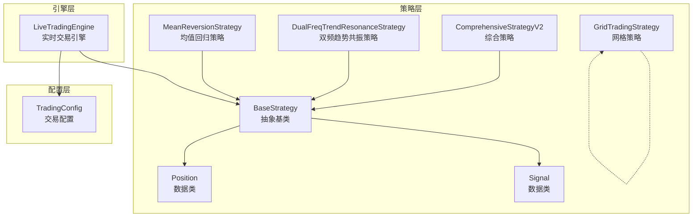
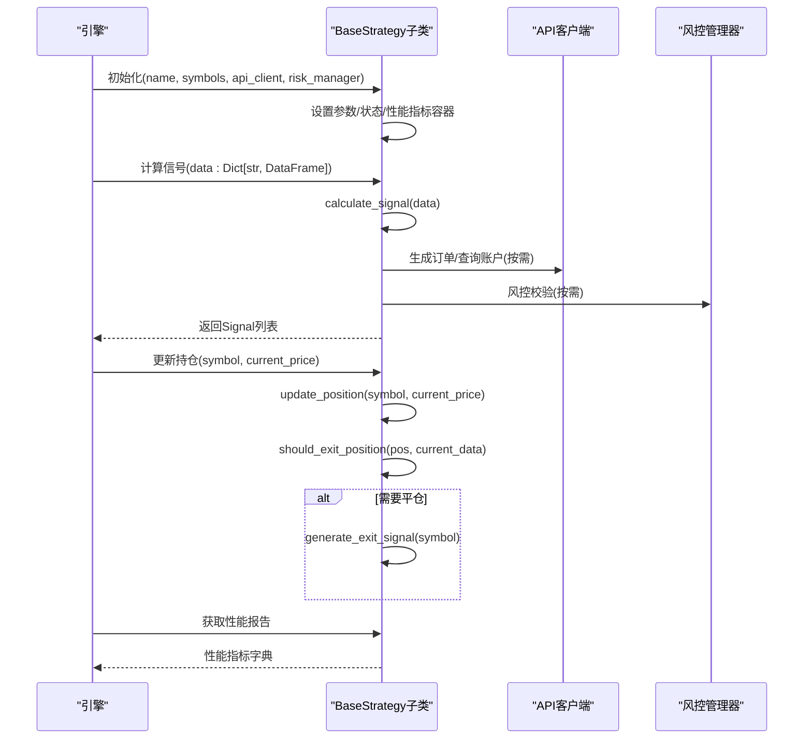
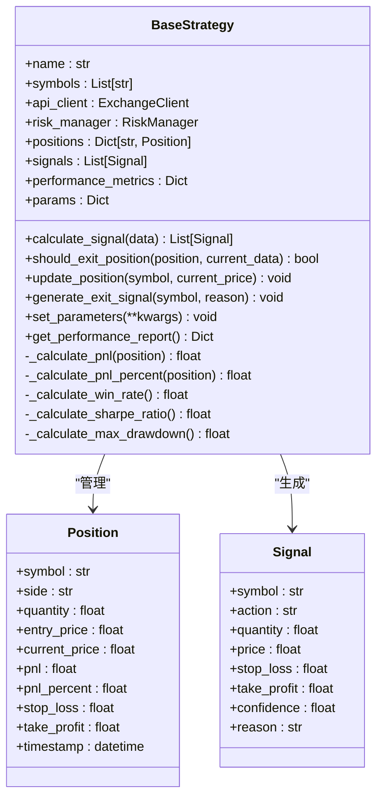
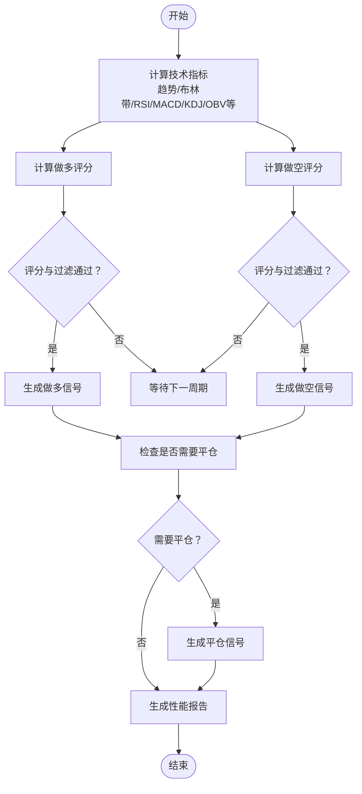
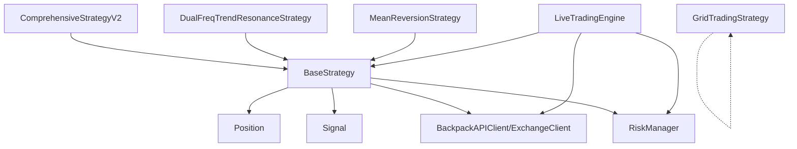

# 策略基类设计

<cite>
**本文引用的文件**
- [strategy/base.py](file://backpack_quant_trading/strategy/base.py)
- [strategy/comprehensive.py](file://backpack_quant_trading/strategy/comprehensive.py)
- [strategy/dual_freq_trend.py](file://backpack_quant_trading/strategy/dual_freq_trend.py)
- [strategy/mean_reversion.py](file://backpack_quant_trading/strategy/mean_reversion.py)
- [strategy/grid_strategy.py](file://backpack_quant_trading/strategy/grid_strategy.py)
- [engine/live_trading.py](file://backpack_quant_trading/engine/live_trading.py)
- [config/settings.py](file://backpack_quant_trading/config/settings.py)
</cite>

## 目录
1. [引言](#引言)
2. [项目结构](#项目结构)
3. [核心组件](#核心组件)
4. [架构概览](#架构概览)
5. [详细组件分析](#详细组件分析)
6. [依赖分析](#依赖分析)
7. [性能考虑](#性能考虑)
8. [故障排除指南](#故障排除指南)
9. [结论](#结论)
10. [附录](#附录)

## 引言
本文件围绕策略基类设计展开，重点阐述 BaseStrategy 抽象基类的设计理念、模板方法模式的应用、Position 与 Signal 数据类的设计目的与字段语义，并结合具体策略实现（如综合策略、双频趋势共振策略、均值回归策略）说明策略生命周期管理、参数配置机制、性能指标计算等关键功能。同时提供策略扩展的最佳实践与实现指南，帮助开发者快速构建符合统一接口与生命周期约束的交易策略。

## 项目结构
策略相关代码主要位于 backpack_quant_trading/strategy 目录，核心基类与数据类定义在 base.py 中，具体策略在该目录下的多个文件中实现。运行时引擎与配置分别位于 engine 与 config 目录，为策略提供数据接入、风控、账户与订单管理等基础设施。

**图表来源**
- [strategy/base.py:16-212](file://backpack_quant_trading/strategy/base.py#L16-L212)
- [strategy/comprehensive.py:17-91](file://backpack_quant_trading/strategy/comprehensive.py#L17-L91)
- [strategy/dual_freq_trend.py:18-168](file://backpack_quant_trading/strategy/dual_freq_trend.py#L18-L168)
- [strategy/mean_reversion.py:23-30](file://backpack_quant_trading/strategy/mean_reversion.py#L23-L30)
- [strategy/grid_strategy.py:38-150](file://backpack_quant_trading/strategy/grid_strategy.py#L38-L150)
- [engine/live_trading.py:14-21](file://backpack_quant_trading/engine/live_trading.py#L14-L21)
- [config/settings.py:55-65](file://backpack_quant_trading/config/settings.py#L55-L65)

**章节来源**
- [strategy/base.py:16-212](file://backpack_quant_trading/strategy/base.py#L16-L212)
- [engine/live_trading.py:14-21](file://backpack_quant_trading/engine/live_trading.py#L14-L21)
- [config/settings.py:55-65](file://backpack_quant_trading/config/settings.py#L55-L65)

## 核心组件
- BaseStrategy 抽象基类：定义策略的统一接口与生命周期管理，强制子类实现信号计算与平仓判断，并提供通用的状态维护、参数管理与性能指标框架。
- Position 数据类：封装单个交易对的持仓信息，包括方向、数量、入场/当前价格、止盈止损、盈亏与时间戳等。
- Signal 数据类：封装交易信号，包含目标方向、数量、目标价格、止盈止损、置信度与原因等。
- 具体策略实现：如 ComprehensiveStrategyV2、DualFreqTrendResonanceStrategy、MeanReversionStrategy 等，均继承 BaseStrategy 并实现其抽象方法。

**章节来源**
- [strategy/base.py:16-212](file://backpack_quant_trading/strategy/base.py#L16-L212)
- [strategy/comprehensive.py:17-91](file://backpack_quant_trading/strategy/comprehensive.py#L17-L91)
- [strategy/dual_freq_trend.py:18-168](file://backpack_quant_trading/strategy/dual_freq_trend.py#L18-L168)
- [strategy/mean_reversion.py:23-30](file://backpack_quant_trading/strategy/mean_reversion.py#L23-L30)

## 架构概览
BaseStrategy 采用模板方法模式，将策略执行流程标准化：初始化参数与状态 → 计算信号 → 更新持仓 → 平仓判断 → 生成平仓信号 → 记录性能指标。子类只需专注于信号计算与平仓逻辑的具体实现，从而保证策略的一致性与可维护性。

**图表来源**
- [strategy/base.py:46-212](file://backpack_quant_trading/strategy/base.py#L46-L212)
- [engine/live_trading.py:14-21](file://backpack_quant_trading/engine/live_trading.py#L14-L21)

**章节来源**
- [strategy/base.py:46-212](file://backpack_quant_trading/strategy/base.py#L46-L212)
- [engine/live_trading.py:14-21](file://backpack_quant_trading/engine/live_trading.py#L14-L21)

## 详细组件分析

### BaseStrategy 抽象基类
- 设计理念与模板方法模式
  - BaseStrategy 通过抽象方法 calculate_signal 与 should_exit_position 强制子类实现核心逻辑，同时提供 update_position、generate_exit_signal、set_parameters、get_performance_report 等通用能力，形成“骨架算法”。
  - 生命周期管理：策略状态（positions、signals、performance_metrics、params）集中管理，便于统一维护与观测。
- 关键方法与职责
  - calculate_signal：接收多交易对的 OHLCV 数据，返回 Signal 列表。
  - should_exit_position：基于当前持仓与最新数据判断是否平仓。
  - update_position：定期更新持仓的当前价格与盈亏，并触发平仓判断。
  - generate_exit_signal：生成平仓 Signal 并加入队列。
  - set_parameters：动态更新策略参数。
  - get_performance_report：汇总策略表现（总持仓、开仓数、总盈亏、胜率、夏普比率、最大回撤等）。
- 盈亏计算
  - _calculate_pnl 与 _calculate_pnl_percent：分别计算金额盈亏与百分比盈亏，处理多头/空头场景并进行边界防护。
- 性能指标框架
  - _calculate_win_rate、_calculate_sharpe_ratio、_calculate_max_drawdown：预留实现接口，子类可按需补充净值曲线与统计逻辑。

**图表来源**
- [strategy/base.py:16-212](file://backpack_quant_trading/strategy/base.py#L16-L212)

**章节来源**
- [strategy/base.py:46-212](file://backpack_quant_trading/strategy/base.py#L46-L212)

### Position 数据类
- 设计目的：统一描述单个交易对的持仓状态，便于策略与引擎共享与传递。
- 字段含义：
  - symbol：交易对符号。
  - side：多头/空头。
  - quantity：持仓数量。
  - entry_price/current_price：入场与当前价格。
  - pnl/pnl_percent：金额与百分比盈亏。
  - stop_loss/take_profit：止损/止盈价格。
  - timestamp：创建时间戳。

**章节来源**
- [strategy/base.py:16-30](file://backpack_quant_trading/strategy/base.py#L16-L30)

### Signal 数据类
- 设计目的：标准化交易信号，便于引擎统一执行与风控。
- 字段含义：
  - symbol/action/quantity：目标交易对、方向与数量。
  - price：目标价格（为空时使用市价单）。
  - stop_loss/take_profit：止损/止盈价格。
  - confidence/reason：信号置信度与产生原因。

**章节来源**
- [strategy/base.py:31-41](file://backpack_quant_trading/strategy/base.py#L31-L41)

### 具体策略实现与最佳实践

#### 综合策略（ComprehensiveStrategyV2）
- 设计要点
  - 多指标评分体系：趋势、价格位置、RSI、K线形态、成交量、KDJ、OBV、均线交叉、MACD 等，加权汇总形成开仓评分。
  - 动态止盈止损：基于 ATR 与固定百分比组合，支持阶梯式保证金分配。
  - 趋势过滤与波动率过滤：仅在明确趋势与一定波动环境下开仓，提升胜率。
- 生命周期与参数配置
  - 通过 __init__ 设置初始资本、杠杆、阈值与权重等参数，并支持外部 params 覆盖。
  - 使用 set_parameters 动态更新策略参数。
- 信号生成与平仓
  - calculate_signal 返回 Signal 列表；should_exit_position 结合止损止盈与技术信号进行判断。
- 性能指标
  - get_performance_report 汇总总持仓、开仓数、总盈亏、胜率、夏普比率、最大回撤等。

**图表来源**
- [strategy/comprehensive.py:17-91](file://backpack_quant_trading/strategy/comprehensive.py#L17-L91)
- [strategy/comprehensive.py:224-405](file://backpack_quant_trading/strategy/comprehensive.py#L224-L405)

**章节来源**
- [strategy/comprehensive.py:17-91](file://backpack_quant_trading/strategy/comprehensive.py#L17-L91)
- [strategy/comprehensive.py:224-405](file://backpack_quant_trading/strategy/comprehensive.py#L224-L405)

#### 双频趋势共振策略（DualFreqTrendResonanceStrategy）
- 设计要点
  - 双频共振：15 分钟趋势判定（EMA9/21+成交量）与 1 分钟精细入场（回调/突破+RSI6+布林带+EMA5/13）。
  - 止盈止损：以“保证金收益%”定义，按杠杆换算为价格波动。
  - 评分与分挡位保证金：按加权评分命中不同保证金档位，提升风险调整收益。
- 生命周期与参数配置
  - 通过构造函数注入 symbols、api_client、risk_manager，并支持 margin、leverage、stop_loss_ratio、take_profit_ratio、params 等参数覆盖。
  - 使用 set_parameters 动态更新策略参数。
- 信号生成与平仓
  - calculate_signal 返回 Signal 列表；should_exit_position 结合时间止损、追踪止损与技术信号进行判断。

**章节来源**
- [strategy/dual_freq_trend.py:18-168](file://backpack_quant_trading/strategy/dual_freq_trend.py#L18-L168)

#### 均值回归策略（MeanReversionStrategy）
- 设计要点
  - 基于 Z-Score 的均值回归：当价格偏离均值超过阈值时生成反向信号，接近均值时平仓。
  - 止损止盈：基于当前价格的比例设定。
  - 仓位计算：根据账户余额与风控参数动态计算下单数量。
- 生命周期与参数配置
  - 通过 params 定义回看周期、阈值、仓位大小、止损止盈比例等。
- 信号生成与平仓
  - calculate_signal 依据 Z-Score 生成买卖信号；should_exit_position 结合止损止盈与 Z-Score 回归判断。

**章节来源**
- [strategy/mean_reversion.py:23-30](file://backpack_quant_trading/strategy/mean_reversion.py#L23-L30)
- [strategy/mean_reversion.py:31-117](file://backpack_quant_trading/strategy/mean_reversion.py#L31-L117)
- [strategy/mean_reversion.py:119-149](file://backpack_quant_trading/strategy/mean_reversion.py#L119-L149)

#### 网格策略（GridTradingStrategy）
- 设计要点
  - 合约网格：在价格区间内高抛低吸，支持双向/做多/做空网格模式。
  - 订单管理：开仓单成交后挂平仓单，平仓后再补回同价位开仓单。
  - 边界保护：总亏损/日亏损限制、最大持仓价值限制、429 频率限制保护等。
- 生命周期与参数配置
  - 通过构造函数注入 symbol、价格区间、网格数量、单格投资、杠杆等参数，并支持 instance_id 区分多实例。
- 信号生成与平仓
  - 该策略为独立的订单执行与监控类，不直接继承 BaseStrategy，但遵循统一的订单/持仓管理与风控原则。

**章节来源**
- [strategy/grid_strategy.py:38-150](file://backpack_quant_trading/strategy/grid_strategy.py#L38-L150)
- [strategy/grid_strategy.py:179-280](file://backpack_quant_trading/strategy/grid_strategy.py#L179-L280)
- [strategy/grid_strategy.py:374-598](file://backpack_quant_trading/strategy/grid_strategy.py#L374-L598)

### 参数配置机制
- BaseStrategy.set_parameters：统一更新策略参数，便于在线调整策略行为。
- 具体策略：通过构造函数与 params 字典实现参数注入，支持运行时覆盖。
- 配置层：config/settings.py 提供 TradingConfig 等全局配置，策略可读取默认参数并按需覆盖。

**章节来源**
- [strategy/base.py:170-174](file://backpack_quant_trading/strategy/base.py#L170-L174)
- [strategy/comprehensive.py:82-87](file://backpack_quant_trading/strategy/comprehensive.py#L82-L87)
- [strategy/dual_freq_trend.py:152-156](file://backpack_quant_trading/strategy/dual_freq_trend.py#L152-L156)
- [config/settings.py:55-65](file://backpack_quant_trading/config/settings.py#L55-L65)

### 性能指标计算
- BaseStrategy.get_performance_report：提供策略表现汇总，包括总持仓、开仓数、总盈亏、胜率、夏普比率、最大回撤等。
- 具体策略：可在子类中实现 _calculate_win_rate、_calculate_sharpe_ratio、_calculate_max_drawdown 等方法，结合净值曲线与风控参数完善评估。

**章节来源**
- [strategy/base.py:175-207](file://backpack_quant_trading/strategy/base.py#L175-L207)

## 依赖分析
- BaseStrategy 依赖
  - 数据类：Position、Signal。
  - 外部组件：BackpackAPIClient、ExchangeClient、RiskManager、日志工具。
- 具体策略依赖
  - ComprehensiveStrategyV2：依赖 TradingConfig。
  - DualFreqTrendResonanceStrategy：依赖 TradingConfig 与 pandas/numpy。
  - MeanReversionStrategy：依赖 pandas/numpy、账户余额查询。
  - GridTradingStrategy：独立的订单执行与监控类，不依赖 BaseStrategy。
- 引擎层依赖
  - LiveTradingEngine：依赖 DataManager、RiskManager、BaseStrategy 与配置。

**图表来源**
- [strategy/base.py:9-13](file://backpack_quant_trading/strategy/base.py#L9-L13)
- [strategy/comprehensive.py:13-14](file://backpack_quant_trading/strategy/comprehensive.py#L13-L14)
- [strategy/dual_freq_trend.py:15-16](file://backpack_quant_trading/strategy/dual_freq_trend.py#L15-L16)
- [strategy/mean_reversion.py:7-8](file://backpack_quant_trading/strategy/mean_reversion.py#L7-L8)
- [engine/live_trading.py:14-18](file://backpack_quant_trading/engine/live_trading.py#L14-L18)

**章节来源**
- [strategy/base.py:9-13](file://backpack_quant_trading/strategy/base.py#L9-L13)
- [engine/live_trading.py:14-18](file://backpack_quant_trading/engine/live_trading.py#L14-L18)

## 性能考虑
- 计算复杂度
  - 技术指标计算：多周期滚动/指数加权平均，时间复杂度与数据长度线性相关；建议按需裁剪数据长度或使用高效库（如 numba）加速。
  - 评分与过滤：多指标评分与阈值判断，注意避免重复计算，可缓存中间结果。
- I/O 与网络
  - API 调用与 WebSocket 订阅：合理设置重试与熔断（如 429 保护），避免频繁重试导致资源浪费。
  - 数据拉取：批量拉取与增量更新相结合，减少不必要的请求。
- 内存与状态
  - positions、signals、performance_metrics 等状态容器随时间增长，建议定期清理历史数据或限制容量。
- 并发与稳定性
  - 使用 asyncio 与锁（Lock）保护共享状态，避免竞态条件。
  - 对外设异常（网络中断、API 限流）进行健壮处理，确保策略稳定运行。

[本节为通用指导，无需特定文件来源]

## 故障排除指南
- 常见问题
  - 信号未生成：检查 calculate_signal 输入数据长度与字段完整性，确认参数阈值是否合理。
  - 平仓不生效：核对 should_exit_position 的判断条件与止损止盈设置，确保 update_position 定期调用。
  - 盈亏计算异常：检查 _calculate_pnl/_calculate_pnl_percent 的输入参数与边界条件（入场价值为零）。
  - API 限流：遇到 429 时进行熔断与退避重试，必要时降低请求频率。
- 日志与调试
  - 使用 get_logger 输出关键路径日志，定位问题发生阶段。
  - 在策略构造与参数更新处输出关键配置，便于复现问题。

**章节来源**
- [strategy/base.py:132-152](file://backpack_quant_trading/strategy/base.py#L132-L152)
- [strategy/grid_strategy.py:471-497](file://backpack_quant_trading/strategy/grid_strategy.py#L471-L497)

## 结论
BaseStrategy 通过模板方法模式将策略生命周期标准化，结合 Position 与 Signal 数据类实现了清晰的状态与信号表达。具体策略在保持统一接口的前提下，灵活运用多指标评分、趋势过滤与风控参数，形成可扩展、可维护的策略体系。建议在扩展新策略时遵循以下原则：明确抽象方法职责、合理组织参数与状态、完善性能指标与日志、重视边界条件与异常处理。

[本节为总结性内容，无需特定文件来源]

## 附录

### 策略扩展最佳实践
- 继承与实现
  - 继承 BaseStrategy，实现 calculate_signal 与 should_exit_position。
  - 在 __init__ 中完成参数注入与默认值设置，支持外部 params 覆盖。
- 数据与风控
  - 在 calculate_signal 中仅关注信号生成逻辑，避免直接执行订单；通过 Signal 传递执行意图。
  - 使用 risk_manager 进行风控校验，确保订单合规。
- 生命周期管理
  - 定期调用 update_position 更新持仓与盈亏，必要时触发平仓。
  - 使用 set_parameters 动态调整策略参数，结合日志记录变更。
- 性能与可观测性
  - 在 get_performance_report 中补充关键指标，便于回测与实盘评估。
  - 输出关键路径日志，便于问题定位与审计。

**章节来源**
- [strategy/base.py:46-212](file://backpack_quant_trading/strategy/base.py#L46-L212)
- [strategy/comprehensive.py:82-87](file://backpack_quant_trading/strategy/comprehensive.py#L82-L87)
- [strategy/dual_freq_trend.py:152-156](file://backpack_quant_trading/strategy/dual_freq_trend.py#L152-L156)