# 综合策略系统

<cite>
**本文档引用的文件**
- [main.py](file://backpack_quant_trading/main.py)
- [comprehensive.py](file://backpack_quant_trading/strategy/comprehensive.py)
- [base.py](file://backpack_quant_trading/strategy/base.py)
- [risk_manager.py](file://backpack_quant_trading/core/risk_manager.py)
- [live_trading.py](file://backpack_quant_trading/engine/live_trading.py)
- [settings.py](file://backpack_quant_trading/config/settings.py)
- [dual_freq_trend.py](file://backpack_quant_trading/strategy/dual_freq_trend.py)
- [ai_adaptive.py](file://backpack_quant_trading/strategy/ai_adaptive.py)
- [backtest.py](file://backpack_quant_trading/engine/backtest.py)
- [api/main.py](file://backpack_quant_trading/api/main.py)
</cite>

## 目录
1. [简介](#简介)
2. [项目结构](#项目结构)
3. [核心组件](#核心组件)
4. [架构概览](#架构概览)
5. [详细组件分析](#详细组件分析)
6. [依赖关系分析](#依赖关系分析)
7. [性能考虑](#性能考虑)
8. [故障排除指南](#故障排除指南)
9. [结论](#结论)

## 简介

综合策略系统是一个基于Python开发的量化交易框架，集成了多种交易策略和风险管理机制。该系统支持多策略组合管理、动态权重分配和风险平衡，能够实现策略间的协同效应和互补性。

系统的核心优势包括：
- **多策略组合管理**：支持均值回归、AI自适应、双频趋势共振等多种策略
- **动态权重分配**：基于技术指标评分的动态权重系统
- **风险平衡机制**：多层次的风险控制和资金管理
- **策略协同效应**：通过组合优化实现策略间的互补和冲突处理

## 项目结构

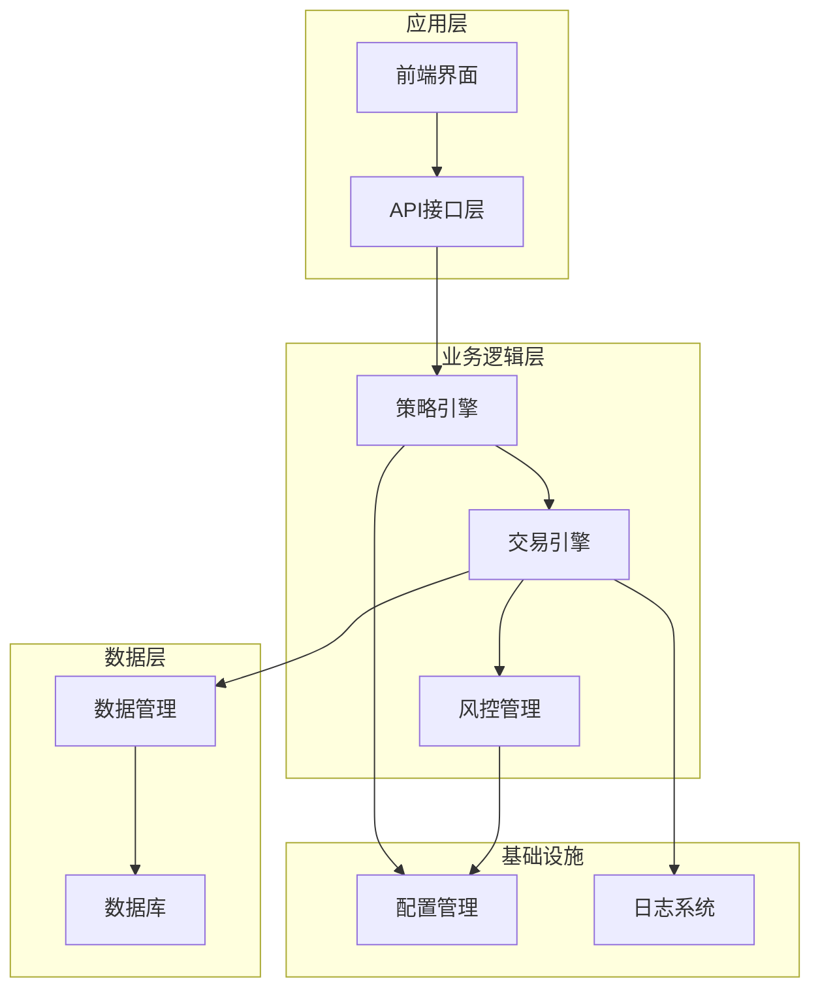

**图表来源**
- [main.py:1-344](file://backpack_quant_trading/main.py#L1-L344)
- [api/main.py:1-98](file://backpack_quant_trading/api/main.py#L1-L98)

**章节来源**
- [main.py:1-344](file://backpack_quant_trading/main.py#L1-L344)
- [api/main.py:1-98](file://backpack_quant_trading/api/main.py#L1-L98)

## 核心组件

### 策略基类系统

系统采用策略基类设计模式，所有具体策略都继承自BaseStrategy基类：

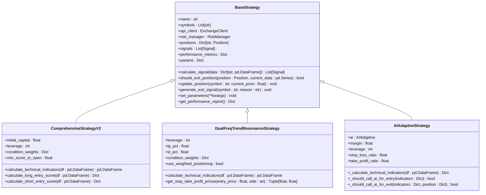

**图表来源**
- [base.py:41-212](file://backpack_quant_trading/strategy/base.py#L41-L212)
- [comprehensive.py:17-91](file://backpack_quant_trading/strategy/comprehensive.py#L17-L91)
- [dual_freq_trend.py:18-168](file://backpack_quant_trading/strategy/dual_freq_trend.py#L18-L168)
- [ai_adaptive.py:12-55](file://backpack_quant_trading/strategy/ai_adaptive.py#L12-L55)

### 交易引擎架构

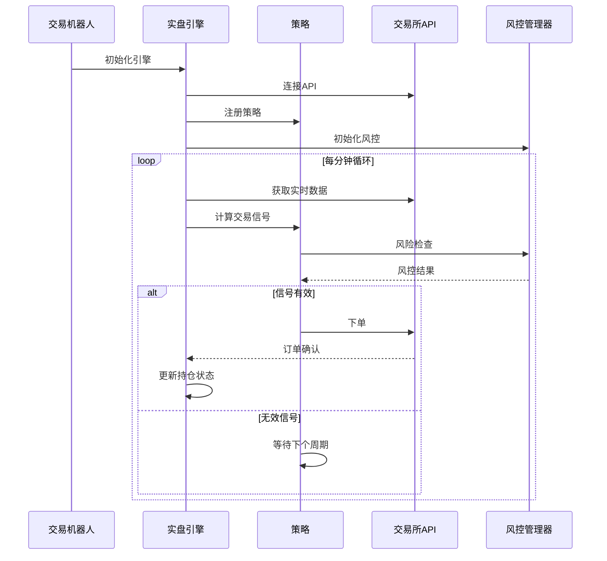

**图表来源**
- [live_trading.py:536-567](file://backpack_quant_trading/engine/live_trading.py#L536-L567)
- [main.py:116-149](file://backpack_quant_trading/main.py#L116-L149)

**章节来源**
- [base.py:41-212](file://backpack_quant_trading/strategy/base.py#L41-L212)
- [live_trading.py:347-567](file://backpack_quant_trading/engine/live_trading.py#L347-L567)
- [main.py:58-149](file://backpack_quant_trading/main.py#L58-L149)

## 架构概览

综合策略系统采用分层架构设计，各层职责清晰分离：

### 数据流架构

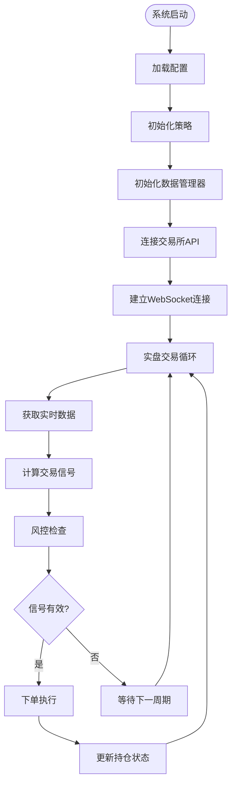

**图表来源**
- [live_trading.py:536-567](file://backpack_quant_trading/engine/live_trading.py#L536-L567)
- [main.py:116-149](file://backpack_quant_trading/main.py#L116-L149)

### 策略组合管理架构

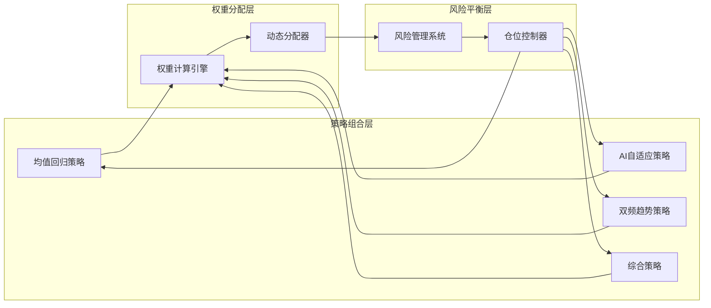

**图表来源**
- [comprehensive.py:46-78](file://backpack_quant_trading/strategy/comprehensive.py#L46-L78)
- [dual_freq_trend.py:103-123](file://backpack_quant_trading/strategy/dual_freq_trend.py#L103-L123)

## 详细组件分析

### 综合策略V2

综合策略V2是系统中最复杂的策略，采用了多指标评分系统：

#### 核心特性

1. **阶梯式保证金分配**：根据指标数量动态调整保证金
2. **动态止盈止损**：基于ATR指标的自适应止损系统
3. **多指标权重系统**：为不同技术指标分配不同权重
4. **趋势过滤机制**：确保只在有利趋势中交易

#### 技术指标体系

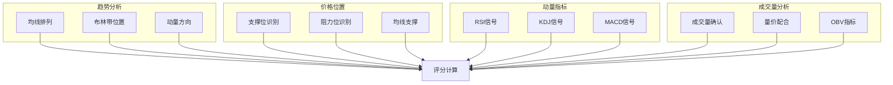

**图表来源**
- [comprehensive.py:92-168](file://backpack_quant_trading/strategy/comprehensive.py#L92-L168)
- [comprehensive.py:224-405](file://backpack_quant_trading/strategy/comprehensive.py#L224-L405)

#### 评分算法流程

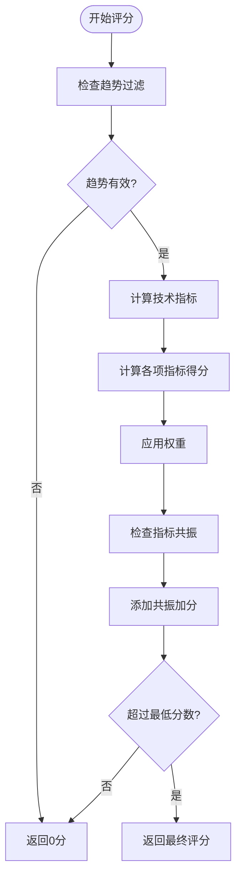

**图表来源**
- [comprehensive.py:224-313](file://backpack_quant_trading/strategy/comprehensive.py#L224-L313)
- [comprehensive.py:731-780](file://backpack_quant_trading/strategy/comprehensive.py#L731-L780)

**章节来源**
- [comprehensive.py:17-1084](file://backpack_quant_trading/strategy/comprehensive.py#L17-L1084)

### 双频趋势共振策略

双频趋势共振策略结合了15分钟趋势判断和1分钟精细入场的双重优势：

#### 核心机制

1. **多时间框架分析**：15分钟确定趋势方向，1分钟精确入场
2. **Pine指标对齐**：与TradingView Pine脚本保持一致的计算逻辑
3. **加权评分系统**：基于评分的分档保证金管理
4. **严格的风险控制**：基于保证金收益百分比的止盈止损

#### 时间框架协调

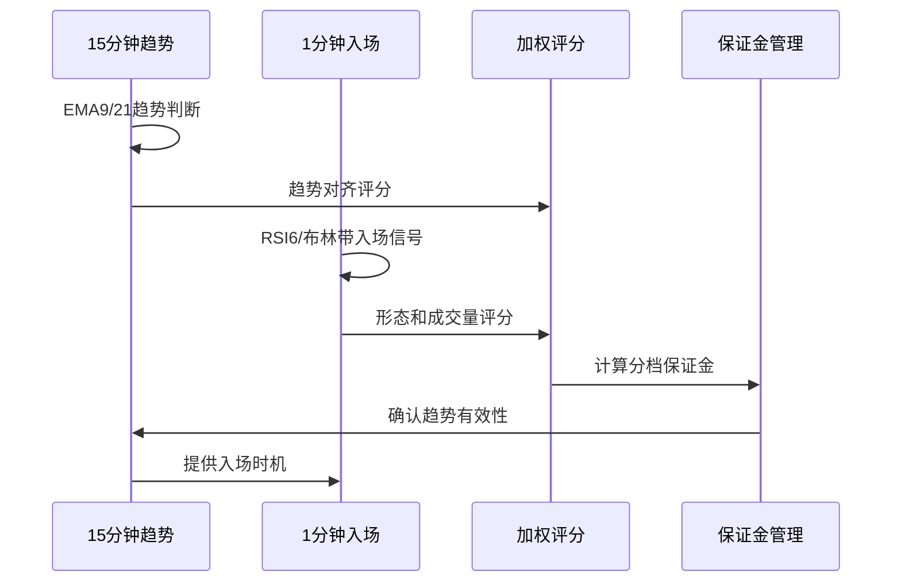

**图表来源**
- [dual_freq_trend.py:170-201](file://backpack_quant_trading/strategy/dual_freq_trend.py#L170-L201)
- [dual_freq_trend.py:289-426](file://backpack_quant_trading/strategy/dual_freq_trend.py#L289-L426)

**章节来源**
- [dual_freq_trend.py:18-931](file://backpack_quant_trading/strategy/dual_freq_trend.py#L18-L931)

### AI自适应策略

AI自适应策略利用深度学习模型进行智能交易决策：

#### 本地预筛选优化

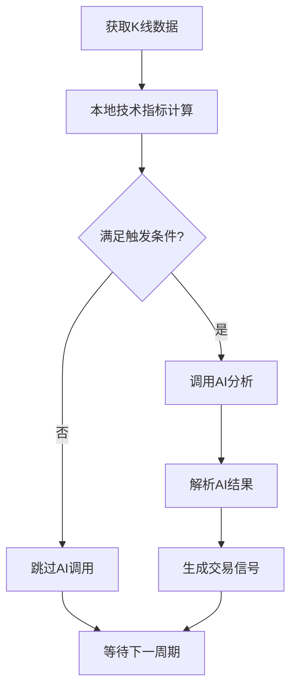

**图表来源**
- [ai_adaptive.py:166-218](file://backpack_quant_trading/strategy/ai_adaptive.py#L166-L218)
- [ai_adaptive.py:266-670](file://backpack_quant_trading/strategy/ai_adaptive.py#L266-L670)

#### 成本优化机制

AI自适应策略实现了显著的成本优化：
- **本地预筛选**：通过RSI、MACD、布林带等指标减少AI调用频率
- **深度分析切换**：根据市场条件动态选择分析模式
- **缓存机制**：重用历史数据减少API调用

**章节来源**
- [ai_adaptive.py:12-881](file://backpack_quant_trading/strategy/ai_adaptive.py#L12-L881)

### 风控管理系统

风控管理系统提供了多层次的风险控制机制：

#### 风险检查流程

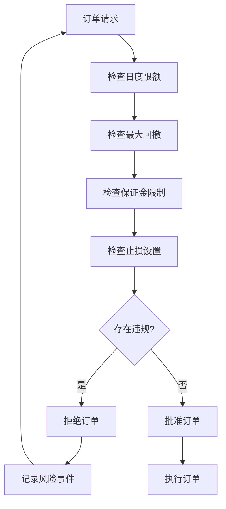

**图表来源**
- [risk_manager.py:132-229](file://backpack_quant_trading/core/risk_manager.py#L132-L229)

#### 风险指标监控

风控系统监控以下关键指标：
- **日度亏损限制**：防止单日过度亏损
- **最大回撤控制**：保护账户免受大幅回撤影响
- **保证金使用率**：确保合理的资金使用效率
- **风险评分系统**：量化评估交易风险

**章节来源**
- [risk_manager.py:48-566](file://backpack_quant_trading/core/risk_manager.py#L48-L566)

## 依赖关系分析

### 组件耦合分析

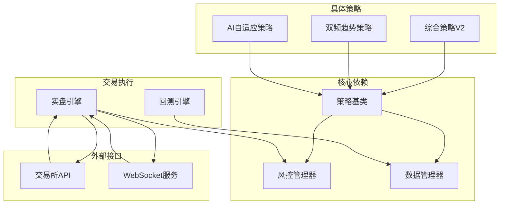

**图表来源**
- [base.py:46-69](file://backpack_quant_trading/strategy/base.py#L46-L69)
- [live_trading.py:353-370](file://backpack_quant_trading/engine/live_trading.py#L353-L370)

### 循环依赖检测

系统设计避免了循环依赖：
- 策略基类不依赖具体策略实现
- 风控管理器独立于策略实现
- 交易引擎通过抽象接口与策略交互
- 数据管理器提供统一的数据访问接口

**章节来源**
- [base.py:1-212](file://backpack_quant_trading/strategy/base.py#L1-L212)
- [live_trading.py:347-402](file://backpack_quant_trading/engine/live_trading.py#L347-L402)

## 性能考虑

### 策略性能优化

1. **缓存机制**：策略结果和中间计算结果的缓存
2. **批量处理**：多交易对数据的批量处理优化
3. **异步操作**：使用异步编程提高并发性能
4. **内存管理**：及时清理不需要的数据和对象

### 系统性能监控

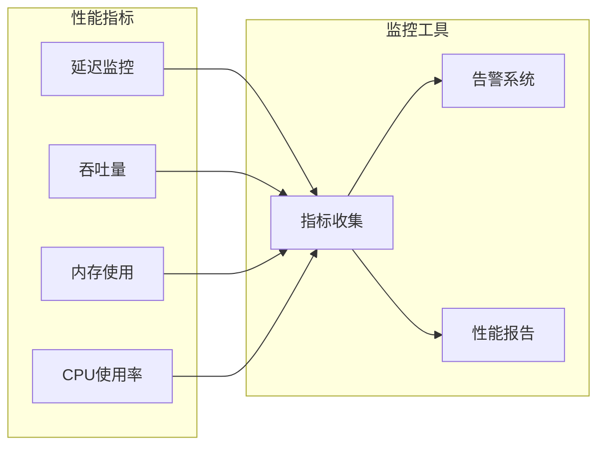

### 优化建议

1. **算法优化**：对计算密集型指标进行优化
2. **数据库优化**：索引优化和查询优化
3. **网络优化**：连接池管理和请求合并
4. **资源管理**：合理配置系统资源

## 故障排除指南

### 常见问题诊断

#### 策略执行问题

1. **信号生成异常**
   - 检查技术指标计算是否正确
   - 验证参数配置的有效性
   - 确认数据完整性

2. **订单执行失败**
   - 检查风控检查结果
   - 验证账户余额和保证金
   - 确认交易所API连接状态

#### 性能问题

1. **响应延迟**
   - 检查系统资源使用情况
   - 优化数据库查询
   - 减少不必要的API调用

2. **内存泄漏**
   - 检查对象生命周期管理
   - 确认资源正确释放
   - 监控内存使用趋势

### 调试工具

系统提供了完善的调试和监控功能：
- **日志系统**：详细的日志记录和分类
- **性能监控**：实时性能指标监控
- **错误追踪**：异常信息追踪和报告
- **状态检查**：系统状态实时检查

**章节来源**
- [risk_manager.py:302-330](file://backpack_quant_trading/core/risk_manager.py#L302-L330)
- [live_trading.py:126-240](file://backpack_quant_trading/engine/live_trading.py#L126-L240)

## 结论

综合策略系统通过模块化设计和分层架构，实现了策略间的有效组合和协同。系统的主要优势包括：

1. **灵活的策略架构**：支持多种策略的组合和动态权重分配
2. **强大的风控能力**：多层次的风险控制确保系统稳定性
3. **高效的执行机制**：优化的交易执行和监控系统
4. **完善的监控体系**：全面的性能监控和故障诊断能力

系统的实施要点包括：
- 合理配置策略参数和权重
- 建立完善的风险控制机制
- 持续监控系统性能和稳定性
- 定期评估和优化策略表现

通过综合策略系统，用户可以实现更加稳健和高效的量化交易，充分利用多策略组合的优势，实现风险平衡和收益最大化的目标。