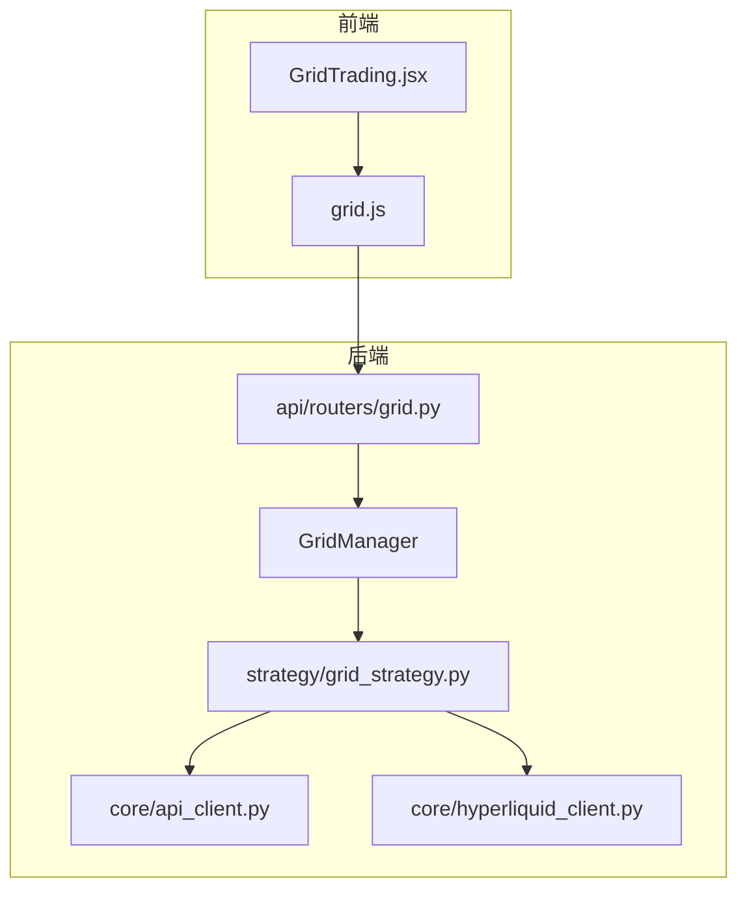
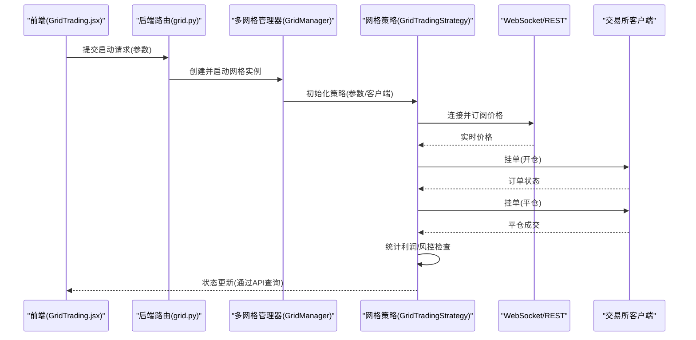
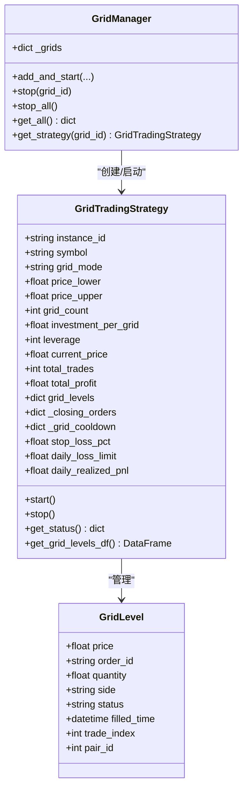
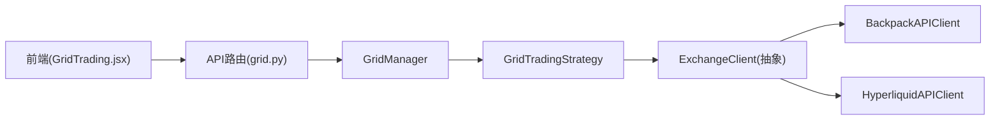

# 网格交易策略

<cite>
**本文引用的文件**
- [grid_strategy.py](file://backpack_quant_trading/strategy/grid_strategy.py)
- [grid.py](file://backpack_quant_trading/api/routers/grid.py)
- [GridTrading.jsx](file://backpack_quant_trading/frontend/src/views/GridTrading.jsx)
- [grid.js](file://backpack_quant_trading/frontend/src/api/grid.js)
- [base.py](file://backpack_quant_trading/strategy/base.py)
- [api_client.py](file://backpack_quant_trading/core/api_client.py)
- [hyperliquid_client.py](file://backpack_quant_trading/core/hyperliquid_client.py)
</cite>

## 目录
1. [简介](#简介)
2. [项目结构](#项目结构)
3. [核心组件](#核心组件)
4. [架构概览](#架构概览)
5. [详细组件分析](#详细组件分析)
6. [依赖关系分析](#依赖关系分析)
7. [性能考量](#性能考量)
8. [故障排除指南](#故障排除指南)
9. [结论](#结论)
10. [附录](#附录)

## 简介
本文件为网格交易策略的详细实现文档，面向希望理解并部署网格交易系统的工程师与量化研究人员。文档围绕以下主题展开：
- 网格交易原理与工作机制
- 支撑阻力位设置与资金分配
- 网格间距计算与买卖挂单管理
- 风险控制与边界保护
- 参数配置指南与资金利用率分析
- 收益预期计算与优化案例
- 适用市场环境与注意事项

## 项目结构
该项目采用前后端分离架构，核心策略位于 Python 后端，前端提供可视化配置与状态展示。网格交易策略主要分布在以下模块：
- 策略层：网格交易策略实现与多网格管理
- API 层：FastAPI 路由，负责参数校验、客户端创建与实例生命周期管理
- 前端层：React 组件，提供参数配置、实时状态展示与操作入口
- 交易客户端：抽象化的交易所客户端，适配 Backpack、Hyperliquid 等多家交易所

图表来源
- [grid.py:1-162](file://backpack_quant_trading/api/routers/grid.py#L1-162)
- [grid_strategy.py:1366-1508](file://backpack_quant_trading/strategy/grid_strategy.py#L1366-L1508)
- [GridTrading.jsx:1-335](file://backpack_quant_trading/frontend/src/views/GridTrading.jsx#L1-L335)
- [grid.js:1-8](file://backpack_quant_trading/frontend/src/api/grid.js#L1-L8)
- [api_client.py:22-86](file://backpack_quant_trading/core/api_client.py#L22-L86)
- [hyperliquid_client.py:18-546](file://backpack_quant_trading/core/hyperliquid_client.py#L18-L546)

章节来源
- [grid.py:1-162](file://backpack_quant_trading/api/routers/grid.py#L1-162)
- [grid_strategy.py:1366-1508](file://backpack_quant_trading/strategy/grid_strategy.py#L1366-L1508)
- [GridTrading.jsx:1-335](file://backpack_quant_trading/frontend/src/views/GridTrading.jsx#L1-L335)
- [grid.js:1-8](file://backpack_quant_trading/frontend/src/api/grid.js#L1-L8)
- [api_client.py:22-86](file://backpack_quant_trading/core/api_client.py#L22-L86)
- [hyperliquid_client.py:18-546](file://backpack_quant_trading/core/hyperliquid_client.py#L18-L546)

## 核心组件
- 网格交易策略类：负责网格层级生成、订单挂单与成交处理、平仓单管理、统计与风险控制
- 多网格管理器：支持多实例并行运行，提供统一的启动/停止与状态查询接口
- 交易所客户端：抽象接口与具体实现，适配 Backpack、Hyperliquid 等
- FastAPI 路由：参数解析、客户端创建、实例注册与状态查询
- 前端组件：参数配置、实时状态展示与操作按钮

章节来源
- [grid_strategy.py:38-201](file://backpack_quant_trading/strategy/grid_strategy.py#L38-L201)
- [grid_strategy.py:1366-1508](file://backpack_quant_trading/strategy/grid_strategy.py#L1366-L1508)
- [api_client.py:22-86](file://backpack_quant_trading/core/api_client.py#L22-L86)
- [hyperliquid_client.py:18-546](file://backpack_quant_trading/core/hyperliquid_client.py#L18-L546)
- [grid.py:1-162](file://backpack_quant_trading/api/routers/grid.py#L1-162)
- [GridTrading.jsx:1-335](file://backpack_quant_trading/frontend/src/views/GridTrading.jsx#L1-L335)

## 架构概览
网格交易策略的运行流程如下：
- 前端提交参数，后端路由解析并创建交易所客户端
- 多网格管理器创建策略实例并启动异步监控循环
- 策略根据 WebSocket 或 REST API 获取实时价格
- 策略在网格区间内挂单，成交后按相邻档位挂平仓单
- 平仓完成后统计利润并补回同价位开仓单
- 风险控制模块在每日/总亏损阈值触发时停止策略

图表来源
- [grid.py:101-139](file://backpack_quant_trading/api/routers/grid.py#L101-L139)
- [grid_strategy.py:179-280](file://backpack_quant_trading/strategy/grid_strategy.py#L179-L280)
- [grid_strategy.py:532-597](file://backpack_quant_trading/strategy/grid_strategy.py#L532-L597)
- [grid_strategy.py:612-754](file://backpack_quant_trading/strategy/grid_strategy.py#L612-L754)
- [grid_strategy.py:818-871](file://backpack_quant_trading/strategy/grid_strategy.py#L818-L871)

## 详细组件分析

### 网格交易策略类
- 网格层级生成：根据价格区间、网格数量与杠杆计算每档价格与数量
- 订单管理：支持双向/做多/做空三种模式，避免可成交限价单导致的快速成交
- 平仓管理：成交后在相邻档位挂限价平仓单，平仓完成后补回同价位开仓单
- 风险控制：每日/总亏损阈值保护，429限频熔断，冷却机制
- 统计与日志：累计交易次数、总利润、手续费、峰值与最大回撤等

图表来源
- [grid_strategy.py:24-36](file://backpack_quant_trading/strategy/grid_strategy.py#L24-L36)
- [grid_strategy.py:38-201](file://backpack_quant_trading/strategy/grid_strategy.py#L38-L201)
- [grid_strategy.py:1366-1508](file://backpack_quant_trading/strategy/grid_strategy.py#L1366-L1508)

章节来源
- [grid_strategy.py:24-36](file://backpack_quant_trading/strategy/grid_strategy.py#L24-L36)
- [grid_strategy.py:38-201](file://backpack_quant_trading/strategy/grid_strategy.py#L38-L201)
- [grid_strategy.py:1366-1508](file://backpack_quant_trading/strategy/grid_strategy.py#L1366-L1508)

### 多网格管理器
- 支持多实例并行运行，键值唯一标识每个实例
- 异步事件循环封装，保证策略生命周期管理
- 提供统一的状态查询接口，便于前端展示

章节来源
- [grid_strategy.py:1366-1508](file://backpack_quant_trading/strategy/grid_strategy.py#L1366-L1508)

### 交易所客户端
- 抽象接口：统一市场数据、账户、订单、撤单等能力
- 具体实现：Backpack 与 Hyperliquid 客户端，支持 ED25519 签名与 EIP-712 签名
- 网格适配：提供获取精度、下单、查询订单、撤单等方法

章节来源
- [api_client.py:22-86](file://backpack_quant_trading/core/api_client.py#L22-L86)
- [hyperliquid_client.py:18-546](file://backpack_quant_trading/core/hyperliquid_client.py#L18-L546)

### API 路由与前端交互
- 路由层：参数解析、客户端创建、实例注册与状态查询
- 前端层：参数表单、实时状态展示、启动/停止操作

章节来源
- [grid.py:1-162](file://backpack_quant_trading/api/routers/grid.py#L1-162)
- [GridTrading.jsx:1-335](file://backpack_quant_trading/frontend/src/views/GridTrading.jsx#L1-L335)
- [grid.js:1-8](file://backpack_quant_trading/frontend/src/api/grid.js#L1-L8)

## 依赖关系分析
- 策略依赖抽象客户端接口，便于扩展新的交易所
- 管理器负责策略生命周期，避免直接耦合
- 前端通过 API 路由与管理器交互，降低复杂度

图表来源
- [grid.py:101-139](file://backpack_quant_trading/api/routers/grid.py#L101-L139)
- [grid_strategy.py:1366-1508](file://backpack_quant_trading/strategy/grid_strategy.py#L1366-L1508)
- [api_client.py:22-86](file://backpack_quant_trading/core/api_client.py#L22-L86)
- [hyperliquid_client.py:18-546](file://backpack_quant_trading/core/hyperliquid_client.py#L18-L546)

章节来源
- [grid.py:1-162](file://backpack_quant_trading/api/routers/grid.py#L1-162)
- [grid_strategy.py:1366-1508](file://backpack_quant_trading/strategy/grid_strategy.py#L1366-L1508)
- [api_client.py:22-86](file://backpack_quant_trading/core/api_client.py#L22-L86)
- [hyperliquid_client.py:18-546](file://backpack_quant_trading/core/hyperliquid_client.py#L18-L546)

## 性能考量
- WebSocket 优先：优先使用 WebSocket 获取实时价格，降低轮询成本
- 限频保护：对 429 限频进行熔断与重试，避免阻塞策略
- 冷却机制：对同一档位设置冷却时间，避免频繁重复挂单
- 异步并发：使用 asyncio 与线程隔离策略生命周期，提升吞吐

章节来源
- [grid_strategy.py:532-597](file://backpack_quant_trading/strategy/grid_strategy.py#L532-L597)
- [grid_strategy.py:612-754](file://backpack_quant_trading/strategy/grid_strategy.py#L612-L754)
- [grid_strategy.py:967-995](file://backpack_quant_trading/strategy/grid_strategy.py#L967-L995)

## 故障排除指南
- WebSocket 连接失败：自动降级到 REST API 轮询，等待首条价格数据
- 订单状态异常：通过活跃库与历史库双重查询，兼容不同交易所差异
- 429 限频：触发熔断等待，避免进一步触发限频
- 停止策略：先取消监控任务，再关闭 WebSocket 与客户端，确保资源释放

章节来源
- [grid_strategy.py:233-272](file://backpack_quant_trading/strategy/grid_strategy.py#L233-L272)
- [grid_strategy.py:509-531](file://backpack_quant_trading/strategy/grid_strategy.py#L509-L531)
- [grid_strategy.py:600-754](file://backpack_quant_trading/strategy/grid_strategy.py#L600-L754)
- [grid_strategy.py:925-966](file://backpack_quant_trading/strategy/grid_strategy.py#L925-L966)

## 结论
本网格交易策略通过清晰的职责划分与完善的风控机制，实现了在多交易所环境下的稳定运行。其核心优势包括：
- 灵活的网格模式与资金分配
- 强健的风险控制与限频保护
- 可视化的参数配置与状态展示
- 易扩展的客户端抽象与多实例管理

## 附录

### 网格交易原理与支撑阻力位设置
- 网格间距计算：网格间距 = (价格上限 - 价格下限) / 网格数量
- 支撑阻力位：每档价格即为支撑/阻力位，做多网格在下档挂买单，做空网格在上档挂卖单
- 资金分配：单格投资 × 网格数量 = 总投资；实际持仓价值 = 总投资 × 杠杆

章节来源
- [grid_strategy.py:102-108](file://backpack_quant_trading/strategy/grid_strategy.py#L102-L108)
- [GridTrading.jsx:49-71](file://backpack_quant_trading/frontend/src/views/GridTrading.jsx#L49-L71)

### 买卖挂单管理与平仓流程
- 开仓挂单：根据当前价格与网格模式在合适档位挂单
- 成交处理：成交后在相邻档位挂限价平仓单
- 平仓补单：平仓完成后补回同价位开仓挂单，维持网格完整性

章节来源
- [grid_strategy.py:374-398](file://backpack_quant_trading/strategy/grid_strategy.py#L374-L398)
- [grid_strategy.py:400-498](file://backpack_quant_trading/strategy/grid_strategy.py#L400-L498)
- [grid_strategy.py:818-871](file://backpack_quant_trading/strategy/grid_strategy.py#L818-L871)

### 风险控制与边界保护
- 日内亏损限制：每日已实现盈亏低于阈值时停止策略
- 总亏损限制：累计总利润低于阈值时停止策略
- 429 限频熔断：触发限频后等待一段时间再继续

章节来源
- [grid_strategy.py:967-995](file://backpack_quant_trading/strategy/grid_strategy.py#L967-L995)
- [grid_strategy.py:400-498](file://backpack_quant_trading/strategy/grid_strategy.py#L400-L498)

### 参数配置指南
- 交易所选择：Backpack、Deepcoin、Hyperliquid、Ostium 等
- 交易对格式：支持简写与完整格式，自动解析为交易所标准格式
- 网格参数：价格区间、网格数量、单格投资、杠杆倍数、网格类型
- API 密钥：Backpack 使用 ED25519 密钥，Hyperliquid 使用私钥

章节来源
- [grid.py:11-37](file://backpack_quant_trading/api/routers/grid.py#L11-L37)
- [grid.py:42-67](file://backpack_quant_trading/api/routers/grid.py#L42-L67)
- [GridTrading.jsx:24-48](file://backpack_quant_trading/frontend/src/views/GridTrading.jsx#L24-L48)

### 资金利用率分析与收益预期
- 资金利用率：总投资 / 实际持仓价值 = 1 / 杠杆
- 收益预期：单格收益率 ≈ 网格间距百分比 × 杠杆 − 双边手续费率 × 杠杆
- 强平价估算：基于杠杆与平均价估算强平价，辅助风控

章节来源
- [GridTrading.jsx:49-71](file://backpack_quant_trading/frontend/src/views/GridTrading.jsx#L49-L71)

### 参数优化案例
- 网格数量：在波动较小市场适当增加网格数量以提高成交频率
- 网格间距：根据波动率调整，避免过窄导致频繁成交或过宽导致收益不足
- 杠杆倍数：结合账户风险承受能力与市场波动率设定，避免过度杠杆化

章节来源
- [GridTrading.jsx:49-71](file://backpack_quant_trading/frontend/src/views/GridTrading.jsx#L49-L71)

### 适用市场环境与注意事项
- 适用环境：震荡/横盘市场，价格在设定区间内反复波动
- 注意事项：避免在单边趋势过强市场长期运行，需配合趋势过滤或切换策略
- 风险提示：网格策略在极端行情下可能面临较大回撤，应谨慎使用

章节来源
- [grid_strategy.py:132-140](file://backpack_quant_trading/strategy/grid_strategy.py#L132-L140)