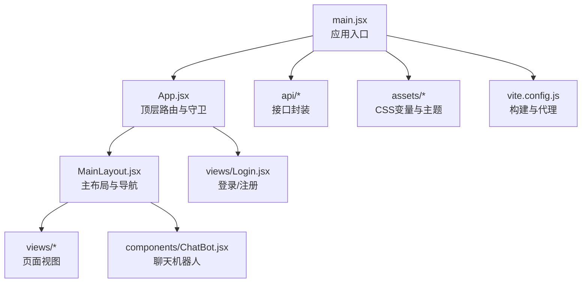
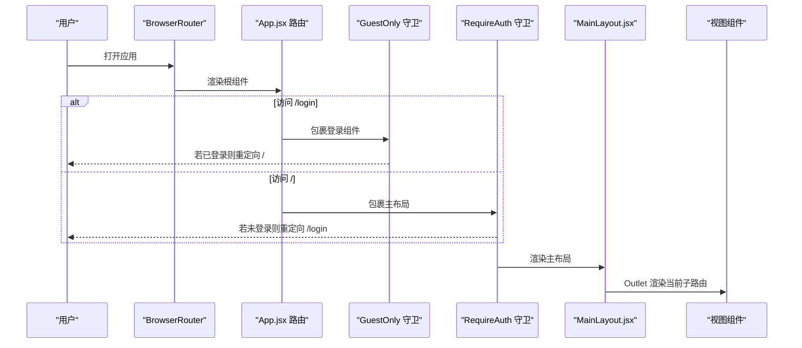
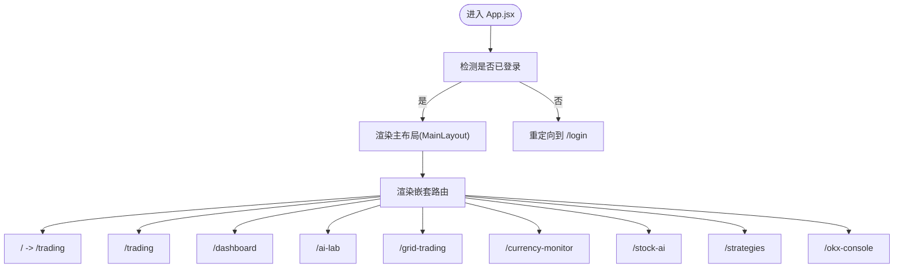
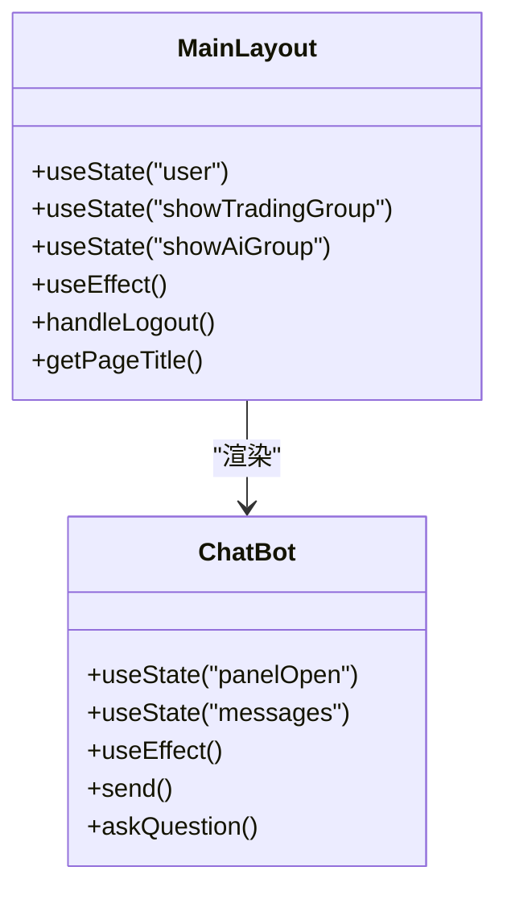
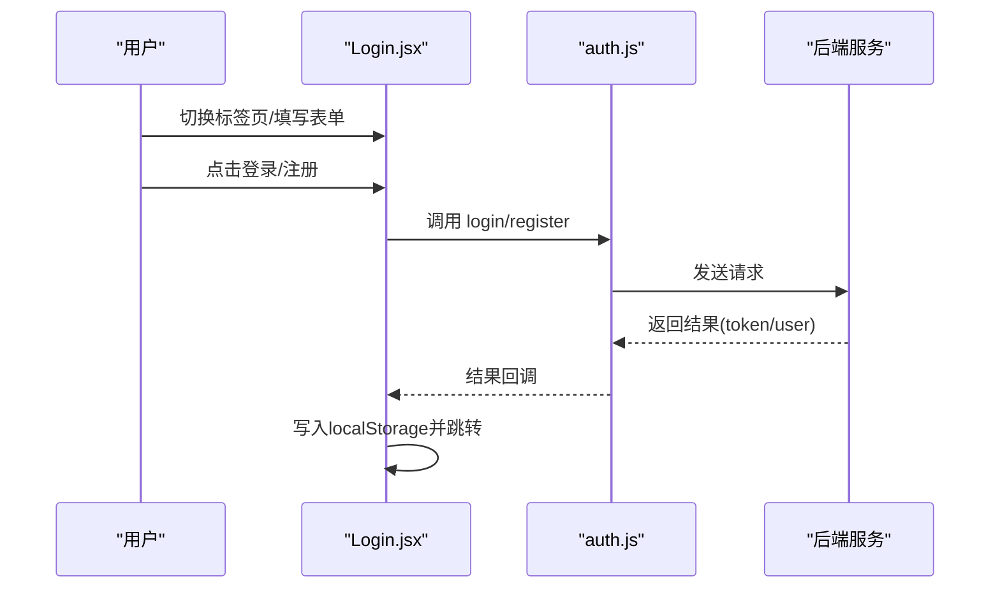
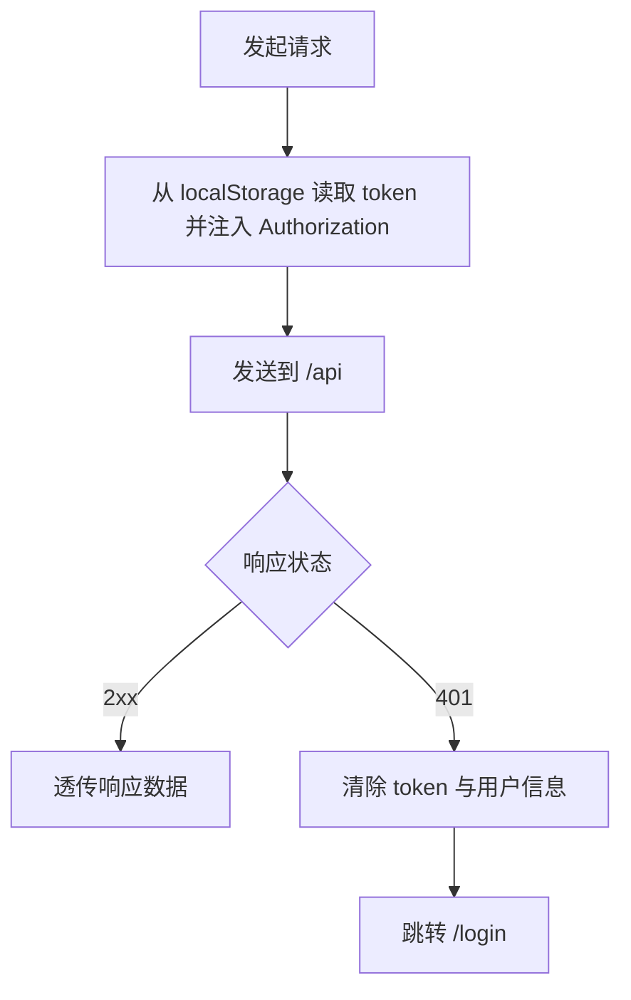
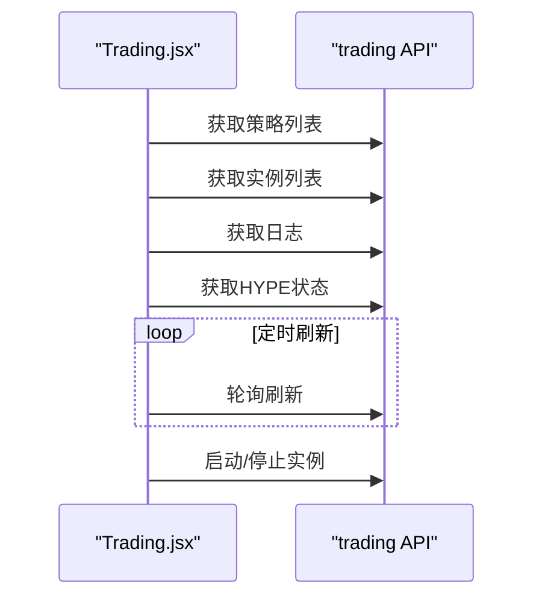
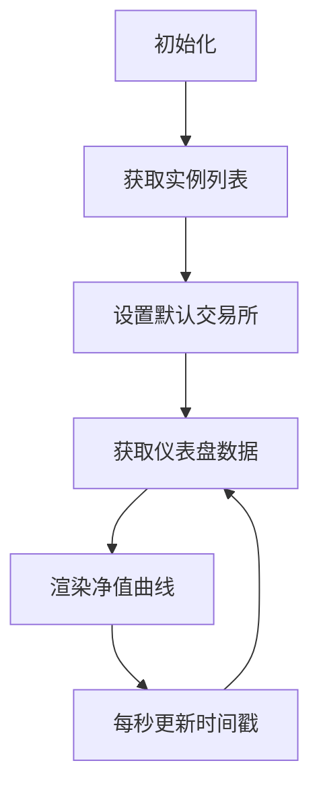
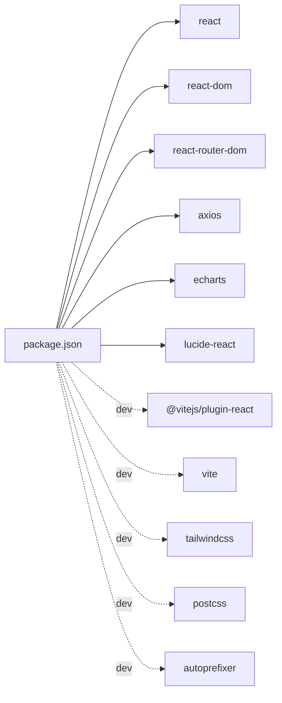

# React应用结构

<cite>
**本文引用的文件**
- [App.jsx](file://backpack_quant_trading/frontend/src/App.jsx)
- [main.jsx](file://backpack_quant_trading/frontend/src/main.jsx)
- [MainLayout.jsx](file://backpack_quant_trading/frontend/src/layouts/MainLayout.jsx)
- [Login.jsx](file://backpack_quant_trading/frontend/src/views/Login.jsx)
- [Dashboard.jsx](file://backpack_quant_trading/frontend/src/views/Dashboard.jsx)
- [Trading.jsx](file://backpack_quant_trading/frontend/src/views/Trading.jsx)
- [auth.js](file://backpack_quant_trading/frontend/src/api/auth.js)
- [request.js](file://backpack_quant_trading/frontend/src/api/request.js)
- [ChatBot.jsx](file://backpack_quant_trading/frontend/src/components/ChatBot.jsx)
- [variables.css](file://backpack_quant_trading/frontend/src/assets/variables.css)
- [theme.css](file://backpack_quant_trading/frontend/src/assets/theme.css)
- [package.json](file://backpack_quant_trading/frontend/package.json)
- [vite.config.js](file://backpack_quant_trading/frontend/vite.config.js)
</cite>

## 目录
1. [简介](#简介)
2. [项目结构](#项目结构)
3. [核心组件](#核心组件)
4. [架构总览](#架构总览)
5. [详细组件分析](#详细组件分析)
6. [依赖分析](#依赖分析)
7. [性能考虑](#性能考虑)
8. [故障排查指南](#故障排查指南)
9. [结论](#结论)
10. [附录](#附录)

## 简介
本文件面向React前端应用，系统性梳理其根组件架构、组件层次结构与模块组织方式；重点解释App.jsx中的路由配置、权限控制机制与页面布局设计；涵盖组件导入管理、路由嵌套结构与导航流程；阐述认证守卫(RequireAuth/GuestOnly)的实现原理与使用场景；并提供组件生命周期管理、错误边界处理与性能优化策略，包括代码分割、懒加载与构建优化的最佳实践。

## 项目结构
前端采用Vite构建，React 18 + react-router-dom 6作为核心路由库。入口在main.jsx中通过BrowserRouter包裹App根组件，App.jsx定义顶层路由与权限守卫，MainLayout提供全局侧边栏与头部导航，各功能页面以视图组件形式组织于views目录，API封装位于api目录，UI组件位于components目录，样式通过CSS变量与主题覆盖实现。

图表来源
- [main.jsx:1-17](file://backpack_quant_trading/frontend/src/main.jsx#L1-L17)
- [App.jsx:1-76](file://backpack_quant_trading/frontend/src/App.jsx#L1-L76)
- [MainLayout.jsx:1-222](file://backpack_quant_trading/frontend/src/layouts/MainLayout.jsx#L1-L222)
- [Login.jsx:1-253](file://backpack_quant_trading/frontend/src/views/Login.jsx#L1-L253)
- [ChatBot.jsx:1-250](file://backpack_quant_trading/frontend/src/components/ChatBot.jsx#L1-L250)
- [request.js:1-33](file://backpack_quant_trading/frontend/src/api/request.js#L1-L33)
- [variables.css:1-27](file://backpack_quant_trading/frontend/src/assets/variables.css#L1-L27)
- [theme.css:1-112](file://backpack_quant_trading/frontend/src/assets/theme.css#L1-L112)
- [vite.config.js:1-30](file://backpack_quant_trading/frontend/vite.config.js#L1-L30)

章节来源
- [main.jsx:1-17](file://backpack_quant_trading/frontend/src/main.jsx#L1-L17)
- [package.json:1-27](file://backpack_quant_trading/frontend/package.json#L1-L27)

## 核心组件
- 应用入口与路由初始化：main.jsx负责创建根节点、启用StrictMode、包裹BrowserRouter，并渲染App根组件。
- 根路由与权限守卫：App.jsx定义顶层路由，包含登录页与受保护的主布局路由；通过RequireAuth与GuestOnly实现访问控制。
- 主布局与导航：MainLayout.jsx提供侧边栏导航、头部信息、页面内容区域与聊天机器人组件。
- 登录与注册：Login.jsx提供双标签页登录/注册表单，调用auth.js封装的登录/注册接口。
- API层：request.js基于axios创建带基础配置的实例，注入Authorization头并在401时清理本地存储并跳转登录。
- 视图组件：Dashboard.jsx与Trading.jsx分别承担仪表盘与交易控制台功能，均通过API封装进行数据拉取与交互。
- 组件层：ChatBot.jsx提供可拖拽、可收起的AI问答面板，集成聊天接口。

章节来源
- [main.jsx:1-17](file://backpack_quant_trading/frontend/src/main.jsx#L1-L17)
- [App.jsx:18-32](file://backpack_quant_trading/frontend/src/App.jsx#L18-L32)
- [MainLayout.jsx:18-63](file://backpack_quant_trading/frontend/src/layouts/MainLayout.jsx#L18-L63)
- [Login.jsx:1-253](file://backpack_quant_trading/frontend/src/views/Login.jsx#L1-L253)
- [auth.js:1-7](file://backpack_quant_trading/frontend/src/api/auth.js#L1-L7)
- [request.js:1-33](file://backpack_quant_trading/frontend/src/api/request.js#L1-L33)
- [Dashboard.jsx:1-200](file://backpack_quant_trading/frontend/src/views/Dashboard.jsx#L1-L200)
- [Trading.jsx:1-200](file://backpack_quant_trading/frontend/src/views/Trading.jsx#L1-L200)
- [ChatBot.jsx:1-250](file://backpack_quant_trading/frontend/src/components/ChatBot.jsx#L1-L250)

## 架构总览
应用采用“入口 → 根路由 → 布局 → 页面”的分层架构。路由采用嵌套路由模式：根路径“/”受RequireAuth保护，内部嵌套多个业务页面；登录页“/login”受GuestOnly保护，仅未登录用户可见。API层统一拦截请求与响应，实现鉴权与错误处理。

图表来源
- [App.jsx:34-72](file://backpack_quant_trading/frontend/src/App.jsx#L34-L72)
- [MainLayout.jsx:65-218](file://backpack_quant_trading/frontend/src/layouts/MainLayout.jsx#L65-L218)

## 详细组件分析

### 根组件与路由配置(App.jsx)
- 顶层路由定义：登录页与受保护的主布局路由；主布局路由内嵌多个业务页面。
- 权限守卫：
  - RequireAuth：读取localStorage中的token，若不存在则重定向至登录页。
  - GuestOnly：若存在token则重定向至首页，确保未登录用户才能访问登录页。
- 嵌套路由：主布局内index重定向至“/trading”，其余路径映射到具体视图组件。

图表来源
- [App.jsx:34-72](file://backpack_quant_trading/frontend/src/App.jsx#L34-L72)

章节来源
- [App.jsx:18-32](file://backpack_quant_trading/frontend/src/App.jsx#L18-L32)
- [App.jsx:34-72](file://backpack_quant_trading/frontend/src/App.jsx#L34-L72)

### 主布局与导航(MainLayout.jsx)
- 导航配置：支持“父菜单 + 子菜单”结构，统一标题计算逻辑，适配策略矩阵等多级页面。
- 用户状态：从localStorage恢复用户信息，提供登出逻辑。
- 内容区：通过Outlet渲染当前子路由页面。
- 附加组件：在布局末尾渲染ChatBot，提供AI问答能力。

图表来源
- [MainLayout.jsx:65-218](file://backpack_quant_trading/frontend/src/layouts/MainLayout.jsx#L65-L218)
- [ChatBot.jsx:20-142](file://backpack_quant_trading/frontend/src/components/ChatBot.jsx#L20-L142)

章节来源
- [MainLayout.jsx:18-63](file://backpack_quant_trading/frontend/src/layouts/MainLayout.jsx#L18-L63)
- [MainLayout.jsx:65-218](file://backpack_quant_trading/frontend/src/layouts/MainLayout.jsx#L65-L218)
- [ChatBot.jsx:1-250](file://backpack_quant_trading/frontend/src/components/ChatBot.jsx#L1-L250)

### 登录与注册(Login.jsx)
- 双标签页：登录与注册，表单字段包含用户名、密码、邮箱、确认密码与记住我。
- 提交流程：校验必填项，调用auth.js的login/register，成功后写入token与用户信息并跳转首页。
- 错误提示：根据后端返回的错误信息展示成功/失败消息。

图表来源
- [Login.jsx:25-69](file://backpack_quant_trading/frontend/src/views/Login.jsx#L25-L69)
- [auth.js:1-7](file://backpack_quant_trading/frontend/src/api/auth.js#L1-L7)

章节来源
- [Login.jsx:1-253](file://backpack_quant_trading/frontend/src/views/Login.jsx#L1-L253)
- [auth.js:1-7](file://backpack_quant_trading/frontend/src/api/auth.js#L1-L7)

### API层与鉴权(request.js)
- 基础配置：baseURL指向“/api”，超时30秒，允许携带凭证。
- 请求拦截：从localStorage读取token并注入Authorization头。
- 响应拦截：401时清理token与用户信息并跳转登录页。

图表来源
- [request.js:9-30](file://backpack_quant_trading/frontend/src/api/request.js#L9-L30)

章节来源
- [request.js:1-33](file://backpack_quant_trading/frontend/src/api/request.js#L1-L33)

### 视图组件示例

#### 交易控制台(Trading.jsx)
- 功能概览：策略列表、实例管理、日志查看、HYPE策略开关与启动。
- 生命周期：首次加载获取策略与实例，定时刷新数据；卸载时清理定时器。
- 交互逻辑：根据平台与策略类型校验参数，调用对应API启动/停止实例。

图表来源
- [Trading.jsx:60-101](file://backpack_quant_trading/frontend/src/views/Trading.jsx#L60-L101)
- [Trading.jsx:103-172](file://backpack_quant_trading/frontend/src/views/Trading.jsx#L103-L172)

章节来源
- [Trading.jsx:1-200](file://backpack_quant_trading/frontend/src/views/Trading.jsx#L1-L200)

#### 数据仪表盘(Dashboard.jsx)
- 功能概览：资产汇总、净值曲线、活动仓位与订单表格。
- 图表渲染：使用ECharts初始化并按数据更新配置。
- 生命周期：初始化获取实例列表并设置默认交易所，随后轮询刷新数据与时间戳。

图表来源
- [Dashboard.jsx:64-81](file://backpack_quant_trading/frontend/src/views/Dashboard.jsx#L64-L81)
- [Dashboard.jsx:42-58](file://backpack_quant_trading/frontend/src/views/Dashboard.jsx#L42-L58)

章节来源
- [Dashboard.jsx:1-200](file://backpack_quant_trading/frontend/src/views/Dashboard.jsx#L1-L200)

## 依赖分析
- 运行时依赖：react、react-dom、react-router-dom、axios、echarts、lucide-react。
- 开发依赖：@vitejs/plugin-react、vite、tailwindcss、postcss、autoprefixer。
- 构建优化：手动分包将echarts独立拆分，避免主包过大；chunkSizeWarningLimit提升告警阈值。

图表来源
- [package.json:11-25](file://backpack_quant_trading/frontend/package.json#L11-L25)

章节来源
- [package.json:1-27](file://backpack_quant_trading/frontend/package.json#L1-L27)
- [vite.config.js:10-19](file://backpack_quant_trading/frontend/vite.config.js#L10-L19)

## 性能考虑
- 代码分割与懒加载
  - 使用动态import进行页面级懒加载，减少首屏体积与初次渲染时间。
  - 示例：将大型图表库(如echarts)单独分包，避免与业务代码混合导致缓存失效。
- 构建优化
  - 通过manualChunks将echarts独立打包，提升缓存命中率。
  - 提升chunkSizeWarningLimit，避免因第三方库体积较大产生告警。
- 运行时优化
  - 在视图组件中合理使用useMemo/useCallback，减少不必要的重渲染。
  - 对长列表与图表渲染采用虚拟化或节流策略（如滚动监听、定时器管理）。
- 网络与缓存
  - API层统一注入Authorization头，避免重复请求；401自动登出，防止无效请求堆积。
  - 后端接口代理至本地API服务，开发环境降低跨域与调试复杂度。

章节来源
- [vite.config.js:14-18](file://backpack_quant_trading/frontend/vite.config.js#L14-L18)
- [request.js:9-30](file://backpack_quant_trading/frontend/src/api/request.js#L9-L30)

## 故障排查指南
- 登录后仍被重定向到登录页
  - 检查localStorage中是否存在token与user；确认后端返回的token有效且未过期。
  - 排查API拦截器是否正确注入Authorization头。
- 401未授权频繁出现
  - 确认请求头中Authorization是否包含Bearer token。
  - 检查后端会话有效期与刷新策略。
- 页面空白或路由不生效
  - 确认BrowserRouter已包裹App根组件。
  - 检查路由层级与嵌套路径是否匹配。
- 图表不显示或渲染异常
  - 确保容器元素有明确宽高，图表初始化时机正确。
  - 检查数据格式与ECharts配置项。
- 聊天机器人无法拖拽或收起
  - 检查鼠标事件绑定与拖拽状态管理逻辑。
  - 确认DOM引用与位置计算逻辑。

章节来源
- [request.js:20-30](file://backpack_quant_trading/frontend/src/api/request.js#L20-L30)
- [main.jsx:9-15](file://backpack_quant_trading/frontend/src/main.jsx#L9-L15)
- [ChatBot.jsx:45-102](file://backpack_quant_trading/frontend/src/components/ChatBot.jsx#L45-L102)

## 结论
该React应用采用清晰的分层架构：入口负责初始化，根路由负责权限守卫与嵌套路由，布局负责导航与内容区，视图负责业务逻辑，API层负责统一鉴权与错误处理。配合Vite的代码分割与构建优化策略，整体具备良好的可维护性与性能表现。建议后续引入错误边界组件、路由级懒加载与更细粒度的状态管理，进一步提升稳定性与用户体验。

## 附录
- 样式体系
  - CSS变量：集中定义颜色、阴影、圆角与字体族，便于主题统一。
  - 主题覆盖：针对常用UI组件库的样式覆盖，保证视觉一致性。
- 开发与部署
  - 本地开发：通过Vite代理转发至后端API，端口可在配置中调整。
  - 生产构建：使用Vite构建产物，静态资源按需加载，提升首屏性能。

章节来源
- [variables.css:1-27](file://backpack_quant_trading/frontend/src/assets/variables.css#L1-L27)
- [theme.css:1-112](file://backpack_quant_trading/frontend/src/assets/theme.css#L1-L112)
- [vite.config.js:20-29](file://backpack_quant_trading/frontend/vite.config.js#L20-L29)