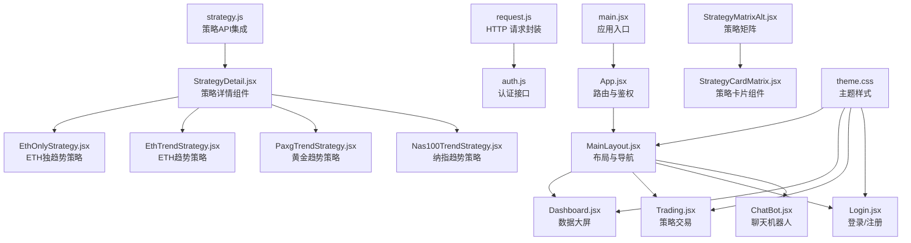
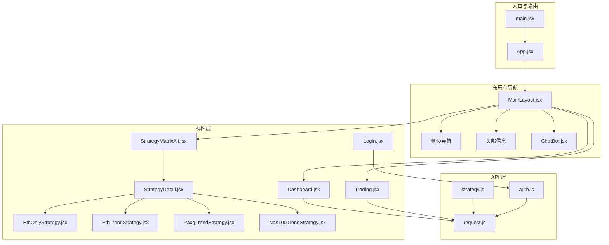
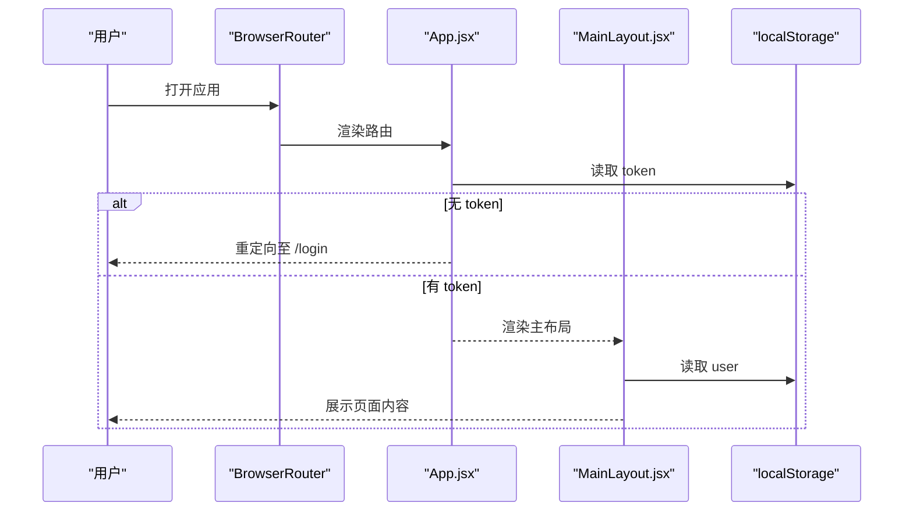
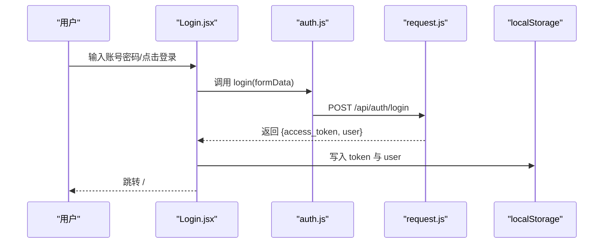
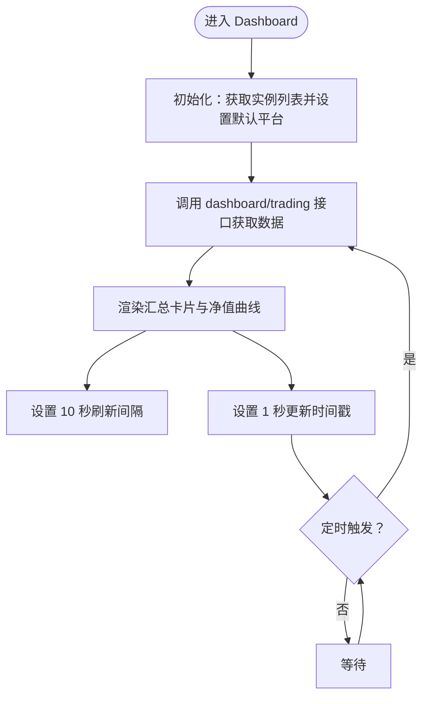
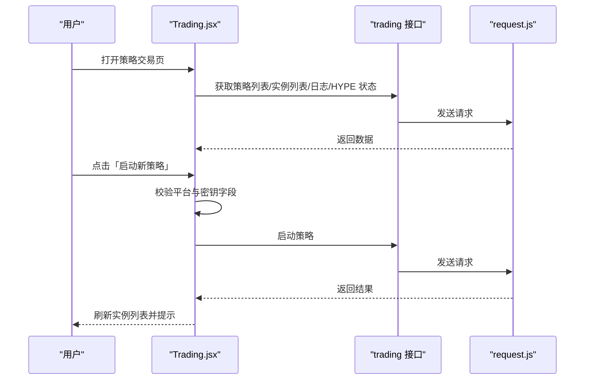
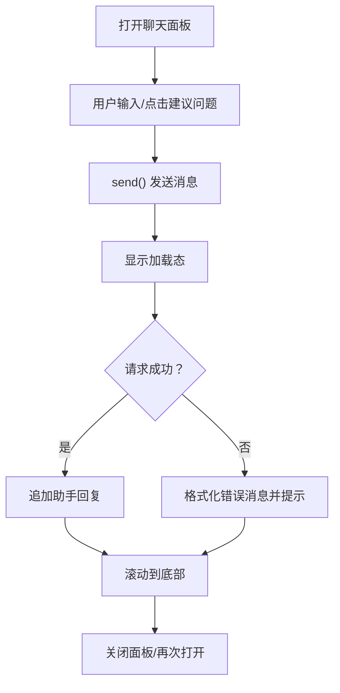
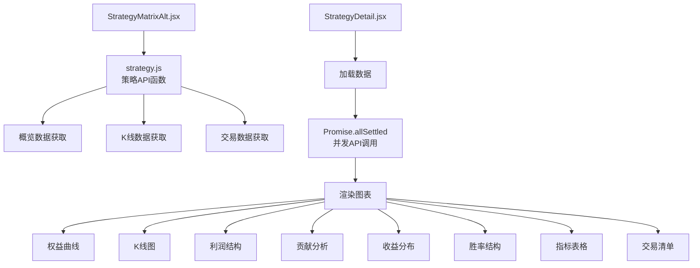
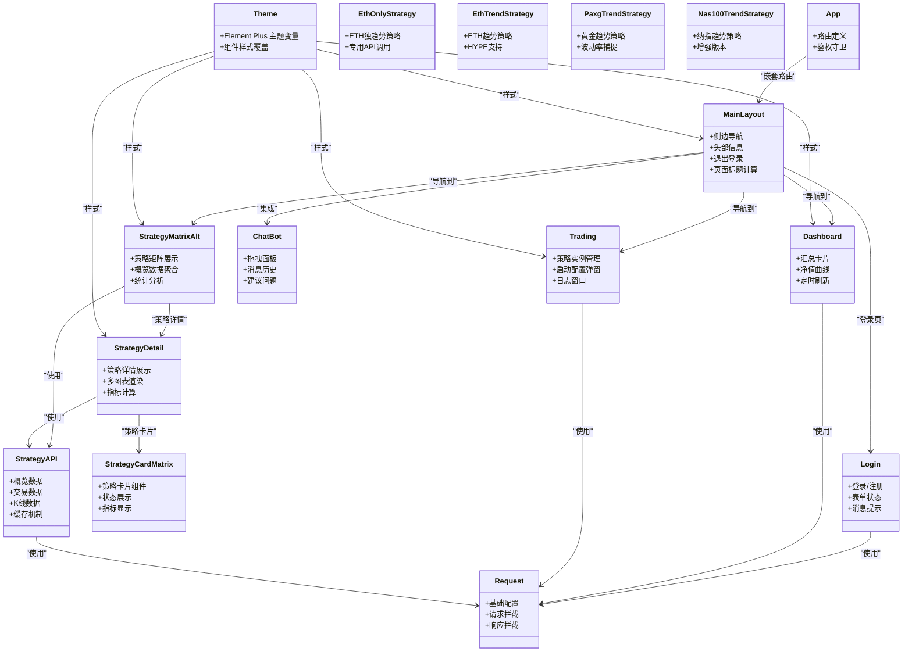
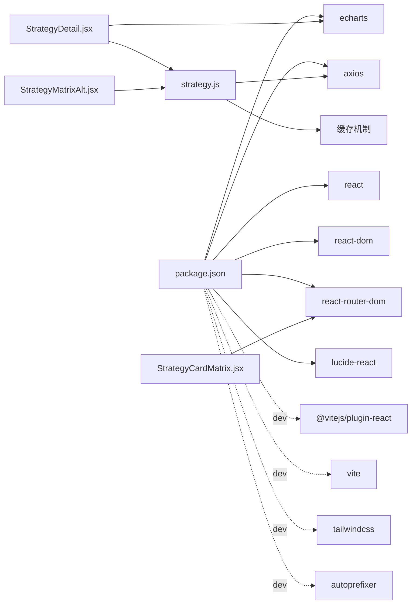

# 前端应用架构

<cite>
**本文档引用的文件**
- [main.jsx](file://backpack_quant_trading/frontend/src/main.jsx)
- [App.jsx](file://backpack_quant_trading/frontend/src/App.jsx)
- [MainLayout.jsx](file://backpack_quant_trading/frontend/src/layouts/MainLayout.jsx)
- [Login.jsx](file://backpack_quant_trading/frontend/src/views/Login.jsx)
- [Dashboard.jsx](file://backpack_quant_trading/frontend/src/views/Dashboard.jsx)
- [Trading.jsx](file://backpack_quant_trading/frontend/src/views/Trading.jsx)
- [ChatBot.jsx](file://backpack_quant_trading/frontend/src/components/ChatBot.jsx)
- [theme.css](file://backpack_quant_trading/frontend/src/assets/theme.css)
- [request.js](file://backpack_quant_trading/frontend/src/api/request.js)
- [auth.js](file://backpack_quant_trading/frontend/src/api/auth.js)
- [strategy.js](file://backpack_quant_trading/frontend/src/api/strategy.js)
- [StatCard.jsx](file://backpack_quant_trading/frontend/src/components/StatCard.jsx)
- [StrategyCardMatrix.jsx](file://backpack_quant_trading/frontend/src/components/StrategyCardMatrix.jsx)
- [StrategyDetail.jsx](file://backpack_quant_trading/frontend/src/views/StrategyDetail.jsx)
- [EthOnlyStrategy.jsx](file://backpack_quant_trading/frontend/src/views/EthOnlyStrategy.jsx)
- [EthTrendStrategy.jsx](file://backpack_quant_trading/frontend/src/views/EthTrendStrategy.jsx)
- [PaxgTrendStrategy.jsx](file://backpack_quant_trading/frontend/src/views/PaxgTrendStrategy.jsx)
- [Nas100TrendStrategy.jsx](file://backpack_quant_trading/frontend/src/views/Nas100TrendStrategy.jsx)
- [StrategyMatrixAlt.jsx](file://backpack_quant_trading/frontend/src/views/StrategyMatrixAlt.jsx)
- [package.json](file://backpack_quant_trading/frontend/package.json)
</cite>

## 目录
1. [简介](#简介)
2. [项目结构](#项目结构)
3. [核心组件](#核心组件)
4. [架构总览](#架构总览)
5. [详细组件分析](#详细组件分析)
6. [依赖关系分析](#依赖关系分析)
7. [性能考量](#性能考量)
8. [故障排查指南](#故障排查指南)
9. [结论](#结论)
10. [附录](#附录)

## 简介
本项目是一个基于 React 的量化交易前端应用，采用 Vite 构建工具，集成了路由、状态管理、图表展示与实时数据更新能力。应用通过 Axios 封装的请求模块与后端 API 交互，提供登录认证、仪表盘、策略交易、网格交易、AI 实验室、币种监视等核心功能模块。整体设计强调清晰的组件分层、可维护的状态流与良好的用户体验。

**更新** 新增了专门的ETH独趋势策略组件、增强的策略矩阵功能和完整的多策略API支持。

## 项目结构
前端代码位于 backpack_quant_trading/frontend/src 目录，主要由以下层次构成：
- 入口与路由：main.jsx 负责应用挂载与路由容器；App.jsx 定义全局路由与鉴权守卫。
- 布局与导航：MainLayout.jsx 提供侧边栏导航、头部信息与聊天机器人集成。
- 视图页面：各功能页面如 Dashboard、Trading、Login、策略详情页面等按功能划分。
- 组件库：通用 UI 组件如 StatCard、ChatBot、StrategyCardMatrix 等。
- API 层：request.js 统一封装请求与拦截器，auth.js 提供认证相关接口，strategy.js 提供策略相关的API集成。
- 样式与主题：theme.css 定义 Element Plus 主题变量与样式覆盖。

**图表来源**
- [main.jsx:1-17](file://backpack_quant_trading/frontend/src/main.jsx#L1-L17)
- [App.jsx:1-76](file://backpack_quant_trading/frontend/src/App.jsx#L1-L76)
- [MainLayout.jsx:1-245](file://backpack_quant_trading/frontend/src/layouts/MainLayout.jsx#L1-L245)
- [Dashboard.jsx:1-311](file://backpack_quant_trading/frontend/src/views/Dashboard.jsx#L1-L311)
- [Trading.jsx:1-474](file://backpack_quant_trading/frontend/src/views/Trading.jsx#L1-L474)
- [Login.jsx:1-253](file://backpack_quant_trading/frontend/src/views/Login.jsx#L1-L253)
- [ChatBot.jsx:1-250](file://backpack_quant_trading/frontend/src/components/ChatBot.jsx#L1-L250)
- [request.js:1-33](file://backpack_quant_trading/frontend/src/api/request.js#L1-L33)
- [auth.js:1-7](file://backpack_quant_trading/frontend/src/api/auth.js#L1-L7)
- [strategy.js:1-101](file://backpack_quant_trading/frontend/src/api/strategy.js#L1-L101)
- [StrategyDetail.jsx:1-1273](file://backpack_quant_trading/frontend/src/views/StrategyDetail.jsx#L1-L1273)
- [EthOnlyStrategy.jsx:1-24](file://backpack_quant_trading/frontend/src/views/EthOnlyStrategy.jsx#L1-L24)
- [EthTrendStrategy.jsx:1-24](file://backpack_quant_trading/frontend/src/views/EthTrendStrategy.jsx#L1-L24)
- [PaxgTrendStrategy.jsx:1-24](file://backpack_quant_trading/frontend/src/views/PaxgTrendStrategy.jsx#L1-L24)
- [Nas100TrendStrategy.jsx:1-23](file://backpack_quant_trading/frontend/src/views/Nas100TrendStrategy.jsx#L1-L23)
- [StrategyMatrixAlt.jsx:1-268](file://backpack_quant_trading/frontend/src/views/StrategyMatrixAlt.jsx#L1-L268)
- [StrategyCardMatrix.jsx:1-126](file://backpack_quant_trading/frontend/src/components/StrategyCardMatrix.jsx#L1-L126)
- [theme.css:1-112](file://backpack_quant_trading/frontend/src/assets/theme.css#L1-L112)

**章节来源**
- [main.jsx:1-17](file://backpack_quant_trading/frontend/src/main.jsx#L1-L17)
- [App.jsx:1-76](file://backpack_quant_trading/frontend/src/App.jsx#L1-L76)
- [package.json:1-27](file://backpack_quant_trading/frontend/package.json#L1-L27)

## 核心组件
- 应用入口与路由
  - main.jsx 使用 React.StrictMode 包裹，并在 BrowserRouter 中渲染 App，完成根节点挂载。
  - App.jsx 定义全局路由规则，包含登录页与受保护的主布局路由，内部嵌套多级视图，新增了策略矩阵和多个策略详情页面。
- 布局与导航
  - MainLayout.jsx 提供侧边栏导航、头部用户信息与状态栏，支持父菜单展开/收起与子菜单高亮，新增了AI策略矩阵导航项。
- 认证与登录
  - Login.jsx 支持登录/注册双标签页，使用 auth.js 接口与本地存储令牌，处理错误消息与加载状态。
- 数据大屏
  - Dashboard.jsx 通过 dashboard 与 trading 接口获取汇总数据、净值曲线、持仓、订单、成交与风险事件，并定时刷新。
- 策略交易
  - Trading.jsx 管理策略实例列表、日志窗口与启动配置弹窗，支持多平台参数适配与 HYPE 策略开关控制。
- 聊天机器人
  - ChatBot.jsx 提供拖拽定位、消息滚动、建议问题与流式错误提示的浮动聊天面板。
- 主题与样式
  - theme.css 定义 Element Plus 主题变量与常用组件样式覆盖，统一视觉风格。

**更新** 新增了完整的策略体系组件，包括策略矩阵、策略详情组件和多个具体的策略实现。

**章节来源**
- [main.jsx:1-17](file://backpack_quant_trading/frontend/src/main.jsx#L1-L17)
- [App.jsx:18-72](file://backpack_quant_trading/frontend/src/App.jsx#L18-L72)
- [MainLayout.jsx:18-245](file://backpack_quant_trading/frontend/src/layouts/MainLayout.jsx#L18-L245)
- [Login.jsx:1-253](file://backpack_quant_trading/frontend/src/views/Login.jsx#L1-L253)
- [Dashboard.jsx:14-81](file://backpack_quant_trading/frontend/src/views/Dashboard.jsx#L14-L81)
- [Trading.jsx:20-100](file://backpack_quant_trading/frontend/src/views/Trading.jsx#L20-L100)
- [ChatBot.jsx:20-142](file://backpack_quant_trading/frontend/src/components/ChatBot.jsx#L20-L142)
- [theme.css:1-112](file://backpack_quant_trading/frontend/src/assets/theme.css#L1-L112)

## 架构总览
应用采用"入口 -> 路由 -> 布局 -> 视图"的分层架构，配合 API 层进行数据交互与状态更新。路由守卫通过本地存储令牌控制访问权限，布局组件负责全局导航与用户状态展示，视图组件聚焦具体业务场景的数据获取与渲染。

**更新** 新增了策略矩阵和策略详情的完整架构，形成了多层次的策略展示体系。

**图表来源**
- [main.jsx:9-15](file://backpack_quant_trading/frontend/src/main.jsx#L9-L15)
- [App.jsx:34-72](file://backpack_quant_trading/frontend/src/App.jsx#L34-L72)
- [MainLayout.jsx:65-245](file://backpack_quant_trading/frontend/src/layouts/MainLayout.jsx#L65-L245)
- [Login.jsx:3-69](file://backpack_quant_trading/frontend/src/views/Login.jsx#L3-L69)
- [Dashboard.jsx:4-40](file://backpack_quant_trading/frontend/src/views/Dashboard.jsx#L4-L40)
- [Trading.jsx:10-89](file://backpack_quant_trading/frontend/src/views/Trading.jsx#L10-L89)
- [StrategyMatrixAlt.jsx:89-108](file://backpack_quant_trading/frontend/src/views/StrategyMatrixAlt.jsx#L89-L108)
- [StrategyDetail.jsx:87-439](file://backpack_quant_trading/frontend/src/views/StrategyDetail.jsx#L87-L439)
- [EthOnlyStrategy.jsx:9-23](file://backpack_quant_trading/frontend/src/views/EthOnlyStrategy.jsx#L9-L23)
- [EthTrendStrategy.jsx:9-23](file://backpack_quant_trading/frontend/src/views/EthTrendStrategy.jsx#L9-L23)
- [PaxgTrendStrategy.jsx:9-23](file://backpack_quant_trading/frontend/src/views/PaxgTrendStrategy.jsx#L9-L23)
- [Nas100TrendStrategy.jsx:9-22](file://backpack_quant_trading/frontend/src/views/Nas100TrendStrategy.jsx#L9-L22)
- [request.js:3-32](file://backpack_quant_trading/frontend/src/api/request.js#L3-L32)
- [auth.js:3-6](file://backpack_quant_trading/frontend/src/api/auth.js#L3-L6)
- [strategy.js:27-100](file://backpack_quant_trading/frontend/src/api/strategy.js#L27-L100)

## 详细组件分析

### 路由与鉴权流程
应用通过 App.jsx 定义路由与鉴权守卫，登录页仅对未登录用户开放，主布局路由对已登录用户开放。MainLayout.jsx 内部根据路径动态设置页面标题与导航高亮。

**图表来源**
- [App.jsx:18-32](file://backpack_quant_trading/frontend/src/App.jsx#L18-L32)
- [App.jsx:34-72](file://backpack_quant_trading/frontend/src/App.jsx#L34-L72)
- [MainLayout.jsx:66-82](file://backpack_quant_trading/frontend/src/layouts/MainLayout.jsx#L66-L82)

**章节来源**
- [App.jsx:18-32](file://backpack_quant_trading/frontend/src/App.jsx#L18-L32)
- [MainLayout.jsx:65-90](file://backpack_quant_trading/frontend/src/layouts/MainLayout.jsx#L65-L90)

### 登录与认证流程
Login.jsx 通过 auth.js 调用后端登录/注册接口，成功后写入 token 与用户信息并跳转首页；request.js 在请求头注入 Authorization，并在 401 时清除本地存储并跳转登录页。

**图表来源**
- [Login.jsx:25-46](file://backpack_quant_trading/frontend/src/views/Login.jsx#L25-L46)
- [auth.js:3](file://backpack_quant_trading/frontend/src/api/auth.js#L3)
- [request.js:9-18](file://backpack_quant_trading/frontend/src/api/request.js#L9-L18)

**章节来源**
- [Login.jsx:1-253](file://backpack_quant_trading/frontend/src/views/Login.jsx#L1-L253)
- [auth.js:1-7](file://backpack_quant_trading/frontend/src/api/auth.js#L1-L7)
- [request.js:20-30](file://backpack_quant_trading/frontend/src/api/request.js#L20-L30)

### 数据大屏与实时刷新
Dashboard.jsx 通过 dashboard 与 trading 接口获取数据，ECharts 初始化并渲染净值曲线，同时使用定时器每 10 秒刷新一次，顶部时间戳每秒更新。

**图表来源**
- [Dashboard.jsx:30-81](file://backpack_quant_trading/frontend/src/views/Dashboard.jsx#L30-L81)
- [Dashboard.jsx:42-58](file://backpack_quant_trading/frontend/src/views/Dashboard.jsx#L42-L58)

**章节来源**
- [Dashboard.jsx:14-81](file://backpack_quant_trading/frontend/src/views/Dashboard.jsx#L14-L81)

### 策略交易与实例管理
Trading.jsx 获取策略列表与实例列表，支持启动新策略的弹窗配置，按平台差异校验密钥字段，启动后刷新实例列表；日志区域与 HYPE 状态独立定时刷新。

**图表来源**
- [Trading.jsx:59-100](file://backpack_quant_trading/frontend/src/views/Trading.jsx#L59-L100)
- [Trading.jsx:102-137](file://backpack_quant_trading/frontend/src/views/Trading.jsx#L102-L137)
- [request.js:3-7](file://backpack_quant_trading/frontend/src/api/request.js#L3-L7)

**章节来源**
- [Trading.jsx:10-100](file://backpack_quant_trading/frontend/src/views/Trading.jsx#L10-L100)
- [Trading.jsx:139-165](file://backpack_quant_trading/frontend/src/views/Trading.jsx#L139-L165)

### 聊天机器人交互
ChatBot.jsx 支持拖拽移动、建议问题、消息滚动与流式错误提示，发送时携带历史消息并处理异常返回。

**图表来源**
- [ChatBot.jsx:109-142](file://backpack_quant_trading/frontend/src/components/ChatBot.jsx#L109-L142)
- [ChatBot.jsx:53-63](file://backpack_quant_trading/frontend/src/components/ChatBot.jsx#L53-L63)

**章节来源**
- [ChatBot.jsx:1-250](file://backpack_quant_trading/frontend/src/components/ChatBot.jsx#L1-L250)

### 策略矩阵与策略详情系统
**更新** 新增了完整的策略矩阵和策略详情系统，提供多策略的统一管理和可视化展示。

StrategyMatrixAlt.jsx 提供策略矩阵视图，支持多种策略的批量展示和管理：
- 动态获取多个策略的概览数据
- 实时统计分析（运行中策略数量、平均胜率、累计收益）
- 策略卡片组件化展示，支持搜索、筛选和视图切换
- 集成缓存机制优化API调用

StrategyDetail.jsx 作为策略详情的核心组件，提供完整的策略分析功能：
- 多图表展示：K线图、权益曲线、利润结构、贡献分析、收益分布、胜率结构
- 详细指标表格：基础指标和详细信息
- 日期范围筛选和快捷操作
- 交易清单分页展示
- 自适应图表布局和响应式设计

各个具体策略组件（EthOnlyStrategy、EthTrendStrategy、PaxgTrendStrategy、Nas100TrendStrategy）都基于StrategyDetail.jsx构建，通过不同的API函数和配置参数实现特定策略的展示。

**图表来源**
- [StrategyMatrixAlt.jsx:93-108](file://backpack_quant_trading/frontend/src/views/StrategyMatrixAlt.jsx#L93-L108)
- [StrategyMatrixAlt.jsx:110-173](file://backpack_quant_trading/frontend/src/views/StrategyMatrixAlt.jsx#L110-L173)
- [strategy.js:27-100](file://backpack_quant_trading/frontend/src/api/strategy.js#L27-L100)
- [StrategyDetail.jsx:412-439](file://backpack_quant_trading/frontend/src/views/StrategyDetail.jsx#L412-L439)
- [StrategyDetail.jsx:441-907](file://backpack_quant_trading/frontend/src/views/StrategyDetail.jsx#L441-L907)

**章节来源**
- [StrategyMatrixAlt.jsx:1-268](file://backpack_quant_trading/frontend/src/views/StrategyMatrixAlt.jsx#L1-L268)
- [strategy.js:1-101](file://backpack_quant_trading/frontend/src/api/strategy.js#L1-L101)
- [StrategyDetail.jsx:1-1273](file://backpack_quant_trading/frontend/src/views/StrategyDetail.jsx#L1-L1273)

### 组件类图（代码级）
**更新** 新增了策略矩阵和策略详情相关的组件类图。

**图表来源**
- [App.jsx:34-72](file://backpack_quant_trading/frontend/src/App.jsx#L34-L72)
- [MainLayout.jsx:65-245](file://backpack_quant_trading/frontend/src/layouts/MainLayout.jsx#L65-L245)
- [Login.jsx:6-69](file://backpack_quant_trading/frontend/src/views/Login.jsx#L6-L69)
- [Dashboard.jsx:14-81](file://backpack_quant_trading/frontend/src/views/Dashboard.jsx#L14-L81)
- [Trading.jsx:20-100](file://backpack_quant_trading/frontend/src/views/Trading.jsx#L20-L100)
- [ChatBot.jsx:20-142](file://backpack_quant_trading/frontend/src/components/ChatBot.jsx#L20-L142)
- [StrategyMatrixAlt.jsx:89-173](file://backpack_quant_trading/frontend/src/views/StrategyMatrixAlt.jsx#L89-L173)
- [StrategyDetail.jsx:87-439](file://backpack_quant_trading/frontend/src/views/StrategyDetail.jsx#L87-L439)
- [StrategyCardMatrix.jsx:25-125](file://backpack_quant_trading/frontend/src/components/StrategyCardMatrix.jsx#L25-L125)
- [EthOnlyStrategy.jsx:9-23](file://backpack_quant_trading/frontend/src/views/EthOnlyStrategy.jsx#L9-L23)
- [EthTrendStrategy.jsx:9-23](file://backpack_quant_trading/frontend/src/views/EthTrendStrategy.jsx#L9-L23)
- [PaxgTrendStrategy.jsx:9-23](file://backpack_quant_trading/frontend/src/views/PaxgTrendStrategy.jsx#L9-L23)
- [Nas100TrendStrategy.jsx:9-22](file://backpack_quant_trading/frontend/src/views/Nas100TrendStrategy.jsx#L9-L22)
- [strategy.js:6-24](file://backpack_quant_trading/frontend/src/api/strategy.js#L6-L24)
- [request.js:3-32](file://backpack_quant_trading/frontend/src/api/request.js#L3-L32)
- [theme.css:1-112](file://backpack_quant_trading/frontend/src/assets/theme.css#L1-L112)

## 依赖关系分析
- 运行时依赖
  - react、react-dom、react-router-dom：提供组件框架与路由能力。
  - axios：HTTP 客户端，用于 API 请求。
  - echarts：图表渲染。
  - lucide-react：图标库。
- 构建依赖
  - @vitejs/plugin-react、vite、tailwindcss、postcss：构建与样式工具链。
- 项目内依赖
  - request.js 作为统一请求封装，auth.js 作为认证接口集合，strategy.js 作为策略API集合，Login.jsx 与各视图组件通过这些模块与后端交互。

**更新** 新增了策略API的依赖关系，形成了完整的策略数据获取体系。

**图表来源**
- [package.json:11-25](file://backpack_quant_trading/frontend/package.json#L11-L25)
- [strategy.js:3-15](file://backpack_quant_trading/frontend/src/api/strategy.js#L3-L15)
- [StrategyDetail.jsx:1-10](file://backpack_quant_trading/frontend/src/views/StrategyDetail.jsx#L1-L10)
- [StrategyMatrixAlt.jsx:6](file://backpack_quant_trading/frontend/src/views/StrategyMatrixAlt.jsx#L6)

**章节来源**
- [package.json:1-27](file://backpack_quant_trading/frontend/package.json#L1-L27)

## 性能考量
- 资源加载
  - 使用 Vite 进行快速开发与生产构建，减少打包体积与冷启动时间。
- 图表性能
  - ECharts 在 Dashboard 中按需初始化，避免不必要的重复渲染。
  - 策略详情组件中使用了多个图表，通过懒加载和resize事件处理优化性能。
- 状态与副作用
  - 合理使用 useEffect 与定时器，确保组件卸载时清理定时器，防止内存泄漏。
- 请求拦截
  - request.js 统一注入 Token 并处理 401，减少重复逻辑与网络错误。
- 样式覆盖
  - theme.css 通过 CSS 变量与组件选择器提升主题一致性，降低样式冲突。
- 策略数据缓存
  - strategy.js 实现了24小时缓存机制，减少重复API调用，提高响应速度。

**更新** 新增了策略数据缓存机制的性能考量。

[本节为通用指导，无需特定文件引用]

## 故障排查指南
- 登录失败
  - 检查 Login.jsx 的表单校验与错误消息设置，确认后端返回的 detail 字段是否正确。
  - 查看 request.js 的响应拦截器是否触发 401 处理逻辑。
- 无数据或刷新异常
  - 检查 Dashboard.jsx 与 Trading.jsx 的定时刷新逻辑与接口调用是否抛错。
  - 确认后端接口返回结构与字段名称是否匹配。
- 聊天机器人无法发送
  - 检查 ChatBot.jsx 的 send() 流程与错误格式化逻辑，确认历史消息数组构造是否正确。
- 策略数据加载失败
  - 检查 strategy.js 的API调用和缓存机制，确认网络请求是否成功。
  - 验证策略详情组件的图表渲染逻辑，确保数据格式正确。
- 样式不生效
  - 确认 theme.css 是否被正确引入，且 CSS 优先级未被覆盖。

**更新** 新增了策略相关故障排查指南。

**章节来源**
- [Login.jsx:25-69](file://backpack_quant_trading/frontend/src/views/Login.jsx#L25-L69)
- [request.js:20-30](file://backpack_quant_trading/frontend/src/api/request.js#L20-L30)
- [Dashboard.jsx:30-81](file://backpack_quant_trading/frontend/src/views/Dashboard.jsx#L30-L81)
- [Trading.jsx:59-100](file://backpack_quant_trading/frontend/src/views/Trading.jsx#L59-L100)
- [ChatBot.jsx:114-142](file://backpack_quant_trading/frontend/src/components/ChatBot.jsx#L114-L142)
- [strategy.js:6-24](file://backpack_quant_trading/frontend/src/api/strategy.js#L6-L24)
- [StrategyDetail.jsx:412-439](file://backpack_quant_trading/frontend/src/views/StrategyDetail.jsx#L412-L439)
- [theme.css:1-112](file://backpack_quant_trading/frontend/src/assets/theme.css#L1-L112)

## 结论
该前端应用以清晰的分层架构与模块化设计实现了量化交易的核心功能，结合路由守卫、统一请求封装与主题样式，提供了良好的可维护性与用户体验。**更新** 新增的策略矩阵和策略详情系统进一步完善了应用的功能完整性，形成了从策略发现到深度分析的完整解决方案。后续可在状态管理、缓存策略与国际化方面进一步完善，以支撑更复杂的业务场景。

[本节为总结性内容，无需特定文件引用]

## 附录
- 组件开发指南
  - 新增视图组件时，遵循现有命名规范与目录结构，优先使用受保护路由并在 MainLayout 下组织导航。
  - 使用 request.js 进行 API 调用，确保错误处理与加载状态的一致性。
  - 策略组件开发时，优先复用 StrategyDetail.jsx 的通用功能，通过API函数和配置参数实现差异化。
- 样式定制与主题配置
  - 通过 theme.css 覆盖 Element Plus 主题变量，保持品牌色与组件风格统一。
  - 策略卡片组件使用渐变背景和状态颜色，确保视觉层次清晰。
- 性能优化与兼容性
  - 使用 Vite 与现代浏览器特性，注意在旧环境下的 polyfill 与降级方案。
  - 策略数据采用缓存机制，图表使用懒加载和resize事件处理，提升用户体验。

**更新** 新增了策略组件开发指南和性能优化建议。

[本节为通用指导，无需特定文件引用]