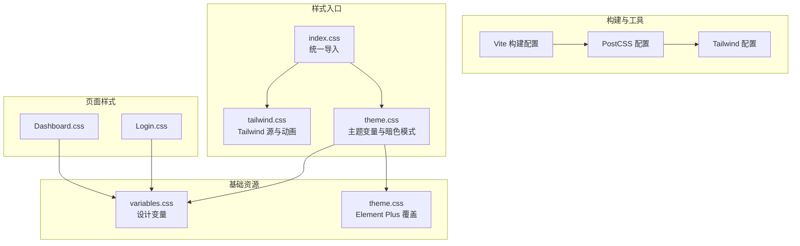
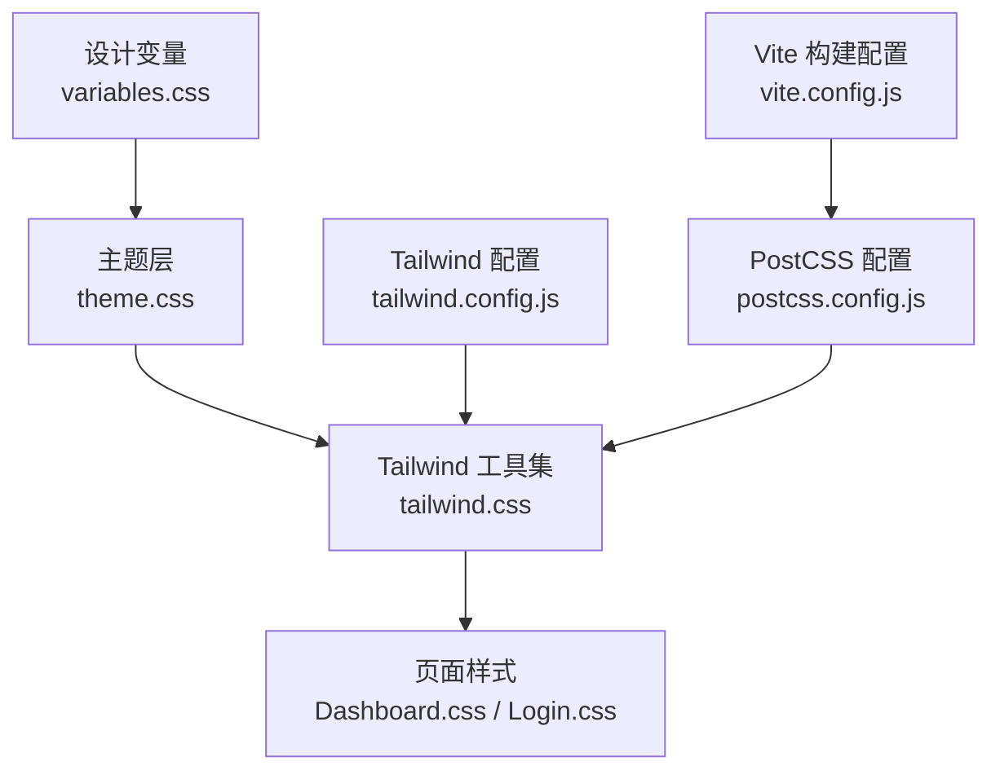
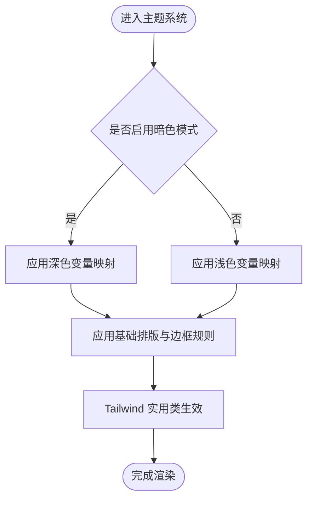
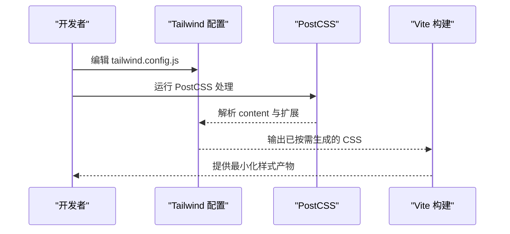
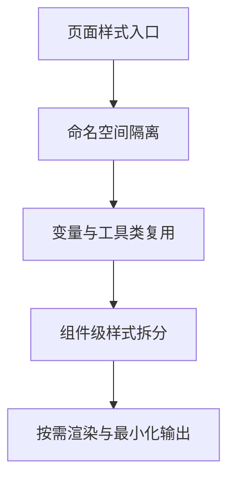
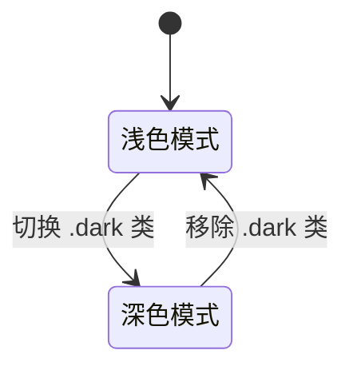
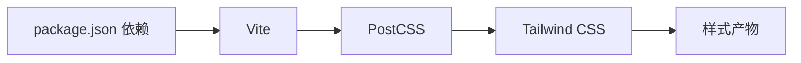

# 样式与主题

<cite>
**本文引用的文件**
- [package.json](file://backpack_quant_trading/frontend/package.json)
- [tailwind.config.js](file://backpack_quant_trading/frontend/tailwind.config.js)
- [postcss.config.js](file://backpack_quant_trading/frontend/postcss.config.js)
- [vite.config.js](file://backpack_quant_trading/frontend/vite.config.js)
- [theme.css](file://backpack_quant_trading/frontend/src/assets/theme.css)
- [variables.css](file://backpack_quant_trading/frontend/src/assets/variables.css)
- [index.css](file://backpack_quant_trading/frontend/src_a/styles/index.css)
- [tailwind.css](file://backpack_quant_trading/frontend/src_a/styles/tailwind.css)
- [theme.css](file://backpack_quant_trading/frontend/src_a/styles/theme.css)
- [Dashboard.css](file://backpack_quant_trading/frontend/src/views/Dashboard.css)
- [Login.css](file://backpack_quant_trading/frontend/src/views/Login.css)
</cite>

## 目录
1. [简介](#简介)
2. [项目结构](#项目结构)
3. [核心组件](#核心组件)
4. [架构总览](#架构总览)
5. [详细组件分析](#详细组件分析)
6. [依赖关系分析](#依赖关系分析)
7. [性能考虑](#性能考虑)
8. [故障排查指南](#故障排查指南)
9. [结论](#结论)
10. [附录](#附录)

## 简介
本文件系统性梳理前端样式与主题体系，涵盖 CSS 架构设计、样式组织与主题定制机制；详解 Tailwind CSS 的配置与使用（含自定义断点、颜色变量与组件样式），并提供主题切换、暗色模式与响应式设计的实现方案。同时总结样式模块化、CSS-in-JS 与样式隔离策略，给出组件样式复用、动画与过渡实现指南，以及样式性能优化、打包压缩与浏览器兼容性处理建议，并提供调试工具、设计系统规范与视觉一致性保障方法。

## 项目结构
前端样式采用多入口分层组织：基础变量与主题在 assets 中集中管理；各子应用通过 styles 统一引入 Tailwind 与主题；页面级样式以模块化 CSS 文件组织，按功能视图拆分，便于维护与复用。

**图表来源**
- [index.css:1-4](file://backpack_quant_trading/frontend/src_a/styles/index.css#L1-L4)
- [tailwind.css:1-5](file://backpack_quant_trading/frontend/src_a/styles/tailwind.css#L1-L5)
- [theme.css:1-181](file://backpack_quant_trading/frontend/src_a/styles/theme.css#L1-L181)
- [variables.css:1-27](file://backpack_quant_trading/frontend/src/assets/variables.css#L1-L27)
- [theme.css:1-112](file://backpack_quant_trading/frontend/src/assets/theme.css#L1-L112)
- [Dashboard.css:1-344](file://backpack_quant_trading/frontend/src/views/Dashboard.css#L1-L344)
- [Login.css:1-211](file://backpack_quant_trading/frontend/src/views/Login.css#L1-L211)

**章节来源**
- [package.json:1-27](file://backpack_quant_trading/frontend/package.json#L1-L27)
- [tailwind.config.js:1-9](file://backpack_quant_trading/frontend/tailwind.config.js#L1-L9)
- [postcss.config.js:1-7](file://backpack_quant_trading/frontend/postcss.config.js#L1-L7)
- [vite.config.js:1-30](file://backpack_quant_trading/frontend/vite.config.js#L1-L30)

## 核心组件
- 设计变量与主题
  - 设计变量集中于 variables.css，定义背景、文本、边框、阴影、圆角与字体族等基础变量，供全局与组件样式引用，确保视觉一致性。
  - 主题文件 theme.css 提供浅色/深色两套变量映射与暗色模式适配，结合自定义变体实现主题切换。
- Tailwind 集成
  - 通过 tailwind.css 导入 Tailwind 源码与 tw-animate-css 动画扩展，content 指向源码路径，确保按需生成类。
  - tailwind.config.js 默认内容扫描范围覆盖 index.html 与 src 下各类源文件，可扩展断点、颜色与组件定制。
- 页面级样式
  - Dashboard.css 与 Login.css 采用模块化命名空间，避免冲突，提升复用性与可维护性。
- Element Plus 覆盖
  - theme.css 对 Element Plus 组件进行渐变、阴影、圆角与交互态的高级定制，统一科技感风格。

**章节来源**
- [variables.css:1-27](file://backpack_quant_trading/frontend/src/assets/variables.css#L1-L27)
- [theme.css:1-181](file://backpack_quant_trading/frontend/src_a/styles/theme.css#L1-L181)
- [tailwind.css:1-5](file://backpack_quant_trading/frontend/src_a/styles/tailwind.css#L1-L5)
- [tailwind.config.js:1-9](file://backpack_quant_trading/frontend/tailwind.config.js#L1-L9)
- [Dashboard.css:1-344](file://backpack_quant_trading/frontend/src/views/Dashboard.css#L1-L344)
- [Login.css:1-211](file://backpack_quant_trading/frontend/src/views/Login.css#L1-L211)
- [theme.css:1-112](file://backpack_quant_trading/frontend/src/assets/theme.css#L1-L112)

## 架构总览
样式架构围绕“变量—主题—工具—页面”四层展开：设计变量提供原子能力；主题层负责明暗与品牌色；Tailwind 提供实用工具集；页面样式完成布局与业务态。整体通过 PostCSS 与 Vite 驱动，实现按需生成与高效构建。

**图表来源**
- [variables.css:1-27](file://backpack_quant_trading/frontend/src/assets/variables.css#L1-L27)
- [theme.css:1-181](file://backpack_quant_trading/frontend/src_a/styles/theme.css#L1-L181)
- [tailwind.css:1-5](file://backpack_quant_trading/frontend/src_a/styles/tailwind.css#L1-L5)
- [Dashboard.css:1-344](file://backpack_quant_trading/frontend/src/views/Dashboard.css#L1-L344)
- [Login.css:1-211](file://backpack_quant_trading/frontend/src/views/Login.css#L1-L211)
- [tailwind.config.js:1-9](file://backpack_quant_trading/frontend/tailwind.config.js#L1-L9)
- [postcss.config.js:1-7](file://backpack_quant_trading/frontend/postcss.config.js#L1-L7)
- [vite.config.js:1-30](file://backpack_quant_trading/frontend/vite.config.js#L1-L30)

## 详细组件分析

### 设计变量与主题系统
- 变量体系
  - 背景、卡片、弹出层、主色、次色、强调色、破坏性、边框、输入、开关、权重、环形光晕、图表色板、侧边栏等变量集中定义，支持跨组件共享。
- 明暗主题
  - 使用自定义变体 dark 包裹选择器，根元素或父容器添加 .dark 类即可切换。
  - 深色模式下重新映射所有颜色变量，保持对比度与可读性。
- 字体与排版
  - 在 base 层设置 html 字号与各级标题、标签、按钮、输入的基础排版，Tailwind 实用类可覆盖。

**图表来源**
- [theme.css:1-181](file://backpack_quant_trading/frontend/src_a/styles/theme.css#L1-L181)

**章节来源**
- [theme.css:1-181](file://backpack_quant_trading/frontend/src_a/styles/theme.css#L1-L181)
- [variables.css:1-27](file://backpack_quant_trading/frontend/src/assets/variables.css#L1-L27)

### Tailwind CSS 配置与使用
- 内容扫描
  - content 指向 index.html 与 src 下源文件，确保仅生成实际使用的类，减少体积。
- 自定义断点
  - 在 tailwind.config.js 的 theme.extend.screens 中新增断点，如移动端、平板、桌面等，配合响应式修饰符使用。
- 颜色变量
  - 通过 theme.extend.colors 定义品牌色与语义色，与主题变量联动，实现动态切换。
- 组件样式
  - 在 components 或 utilities 层扩展常用组件类，如按钮、卡片、表格等，统一风格。
- 动画扩展
  - 引入 tw-animate-css，结合 animate-* 实用类实现过渡与入场动画。

**图表来源**
- [tailwind.config.js:1-9](file://backpack_quant_trading/frontend/tailwind.config.js#L1-L9)
- [postcss.config.js:1-7](file://backpack_quant_trading/frontend/postcss.config.js#L1-L7)
- [tailwind.css:1-5](file://backpack_quant_trading/frontend/src_a/styles/tailwind.css#L1-L5)
- [vite.config.js:1-30](file://backpack_quant_trading/frontend/vite.config.js#L1-L30)

**章节来源**
- [tailwind.config.js:1-9](file://backpack_quant_trading/frontend/tailwind.config.js#L1-L9)
- [tailwind.css:1-5](file://backpack_quant_trading/frontend/src_a/styles/tailwind.css#L1-L5)

### 页面样式模块化与复用
- Dashboard.css
  - 采用 .dashboard-page 命名空间，网格布局、卡片、表格、标签等均以局部作用域类组织，避免全局污染。
  - 使用变量引用实现颜色与圆角的一致性。
- Login.css
  - 登录页采用卡片容器与渐变背景，输入框聚焦态与按钮状态通过变量与伪类实现统一交互。
- 复用策略
  - 将通用布局与组件样式抽离至公共 CSS 模块，页面样式仅保留业务态差异，降低重复与维护成本。

**图表来源**
- [Dashboard.css:1-344](file://backpack_quant_trading/frontend/src/views/Dashboard.css#L1-L344)
- [Login.css:1-211](file://backpack_quant_trading/frontend/src/views/Login.css#L1-L211)
- [variables.css:1-27](file://backpack_quant_trading/frontend/src/assets/variables.css#L1-L27)

**章节来源**
- [Dashboard.css:1-344](file://backpack_quant_trading/frontend/src/views/Dashboard.css#L1-L344)
- [Login.css:1-211](file://backpack_quant_trading/frontend/src/views/Login.css#L1-L211)

### 主题切换、暗色模式与响应式设计
- 主题切换
  - 在根元素或布局容器上切换 .dark 类，自动触发主题变量映射与组件样式更新。
- 暗色模式
  - 深色变量集合确保在低光环境下具备足够对比度与可读性。
- 响应式设计
  - 结合 Tailwind 断点与媒体查询，针对不同屏幕尺寸调整布局与字号；页面样式中亦有局部响应式片段。

**图表来源**
- [theme.css:44-79](file://backpack_quant_trading/frontend/src_a/styles/theme.css#L44-L79)

**章节来源**
- [theme.css:1-181](file://backpack_quant_trading/frontend/src_a/styles/theme.css#L1-L181)

### 动画效果与过渡动画
- 动画扩展
  - 引入 tw-animate-css，结合 animate-* 实用类实现常见入场、出场与提示动画。
- 组件交互
  - 按钮悬停、输入框聚焦、卡片阴影等交互态通过过渡属性与变量实现平滑反馈。

**章节来源**
- [tailwind.css:1-5](file://backpack_quant_trading/frontend/src_a/styles/tailwind.css#L1-L5)

### 样式隔离策略
- 命名空间
  - 页面样式采用层级前缀（如 .dashboard-page）限定作用域，避免类名冲突。
- CSS Modules（建议）
  - 对复杂组件可引入 CSS Modules，通过模块导出类名实现本地化作用域。
- 组件库覆盖
  - Element Plus 样式通过具体选择器与变量覆盖，避免全局污染。

**章节来源**
- [Dashboard.css:1-344](file://backpack_quant_trading/frontend/src/views/Dashboard.css#L1-L344)
- [Login.css:1-211](file://backpack_quant_trading/frontend/src/views/Login.css#L1-L211)
- [theme.css:1-112](file://backpack_quant_trading/frontend/src/assets/theme.css#L1-L112)

### CSS-in-JS（可选实践）
- 适用场景
  - 动态主题、运行时样式计算、细粒度组件样式控制。
- 实施建议
  - 使用 styled-components 或类似方案，结合主题变量与媒体查询，实现样式与逻辑解耦。
- 注意事项
  - 控制注入样式数量，避免重复与内存泄漏；与 Tailwind 并存时注意优先级与覆盖关系。

[本节为概念性指导，不直接分析具体文件]

## 依赖关系分析
- 构建链路
  - Vite 作为开发服务器与打包器，加载 React 插件与代理配置。
  - PostCSS 顺序执行 Tailwind 与 Autoprefixer，确保样式生成与兼容性。
  - Tailwind 依据配置扫描源文件，按需生成类。
- 外部依赖
  - React 生态与路由用于页面组织；Axios、ECharts 用于数据与可视化，间接影响样式需求（图表容器、主题适配）。

**图表来源**
- [package.json:1-27](file://backpack_quant_trading/frontend/package.json#L1-L27)
- [postcss.config.js:1-7](file://backpack_quant_trading/frontend/postcss.config.js#L1-L7)
- [tailwind.config.js:1-9](file://backpack_quant_trading/frontend/tailwind.config.js#L1-L9)
- [vite.config.js:1-30](file://backpack_quant_trading/frontend/vite.config.js#L1-L30)

**章节来源**
- [package.json:1-27](file://backpack_quant_trading/frontend/package.json#L1-L27)
- [postcss.config.js:1-7](file://backpack_quant_trading/frontend/postcss.config.js#L1-L7)
- [tailwind.config.js:1-9](file://backpack_quant_trading/frontend/tailwind.config.js#L1-L9)
- [vite.config.js:1-30](file://backpack_quant_trading/frontend/vite.config.js#L1-L30)

## 性能考虑
- 按需生成
  - Tailwind content 精准扫描，避免无用类进入产物。
- 分包与缓存
  - Vite Rollup 手动分包策略将大体积依赖（如 ECharts）独立打包，提升缓存命中率。
- 构建警告阈值
  - 合理设置 chunkSizeWarningLimit，及时发现体积异常。
- 压缩与兼容
  - PostCSS 与 Autoprefixer 自动处理兼容性与压缩，减少手写冗余。

**章节来源**
- [tailwind.config.js:1-9](file://backpack_quant_trading/frontend/tailwind.config.js#L1-L9)
- [vite.config.js:10-19](file://backpack_quant_trading/frontend/vite.config.js#L10-L19)
- [postcss.config.js:1-7](file://backpack_quant_trading/frontend/postcss.config.js#L1-L7)

## 故障排查指南
- Tailwind 类未生效
  - 检查 tailwind.config.js 的 content 路径是否包含当前文件。
  - 确认 PostCSS 配置已启用 tailwindcss 插件。
- 暗色模式无效
  - 确认根元素或布局容器存在 .dark 类；检查 theme.css 中暗色变量映射是否完整。
- 样式冲突
  - 使用命名空间限定作用域；对第三方组件（如 Element Plus）采用具体选择器覆盖。
- 构建体积过大
  - 查看 chunkSizeWarningLimit 触发原因；评估是否需要进一步拆分或移除未使用依赖。

**章节来源**
- [tailwind.config.js:1-9](file://backpack_quant_trading/frontend/tailwind.config.js#L1-L9)
- [postcss.config.js:1-7](file://backpack_quant_trading/frontend/postcss.config.js#L1-L7)
- [theme.css:44-79](file://backpack_quant_trading/frontend/src_a/styles/theme.css#L44-L79)
- [vite.config.js:10-19](file://backpack_quant_trading/frontend/vite.config.js#L10-L19)

## 结论
该样式与主题系统以变量与主题为核心，结合 Tailwind 的实用工具集与按需生成能力，实现了高一致性、强复用与良好性能的前端样式架构。通过命名空间与组件库覆盖策略，有效避免了样式冲突；借助暗色模式与响应式设计，提升了用户体验与可访问性。建议在后续迭代中完善 CSS-in-JS 场景下的隔离与优先级管理，并持续监控构建体积与兼容性表现。

## 附录
- 设计系统规范
  - 颜色：主色、强调色、语义色（成功/警告/危险）、边框与输入背景。
  - 字体：无衬线与等宽字体族，字号与字重规范。
  - 圆角与阴影：统一半径与层级阴影，确保深度与对比。
  - 交互态：聚焦、悬停、禁用等状态的明确反馈。
- 视觉一致性保障
  - 统一使用变量与主题映射，避免硬编码颜色与尺寸。
  - 页面样式遵循命名空间与模块化原则，减少全局副作用。
  - 对第三方组件进行选择器覆盖，保持整体风格一致。

[本节为规范性总结，不直接分析具体文件]