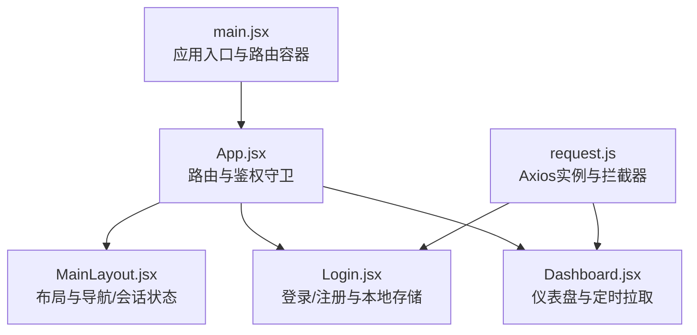
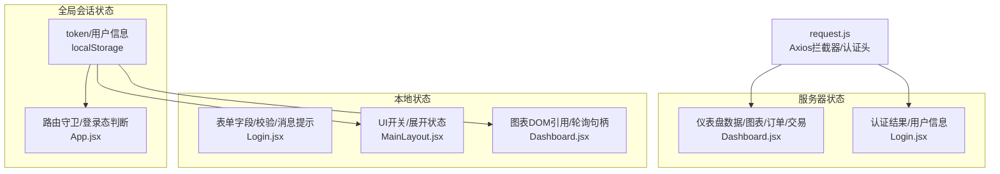
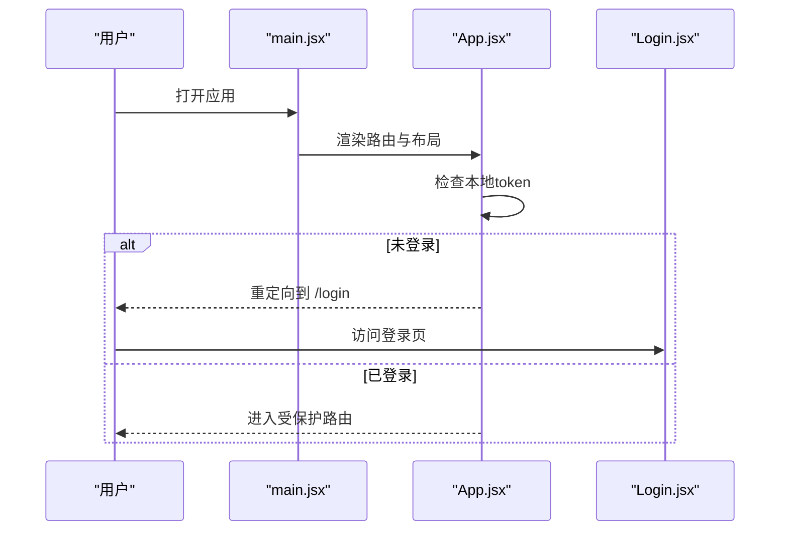
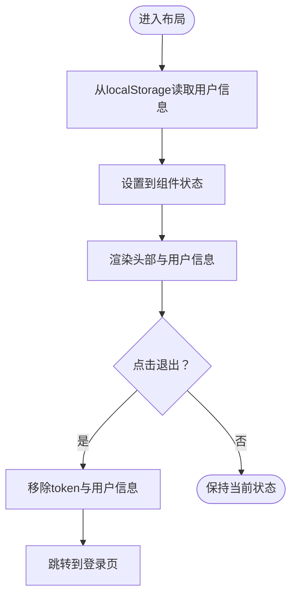
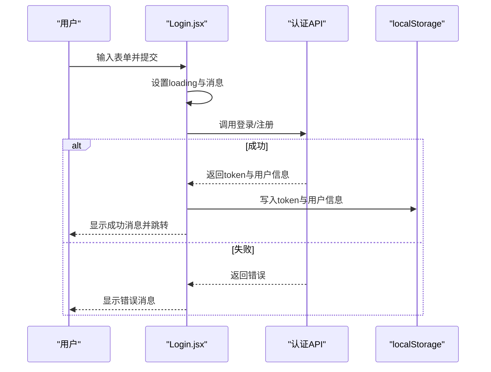
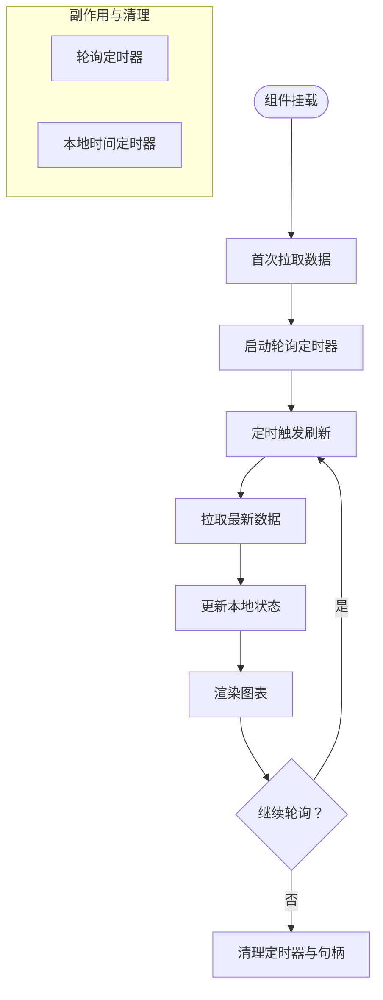
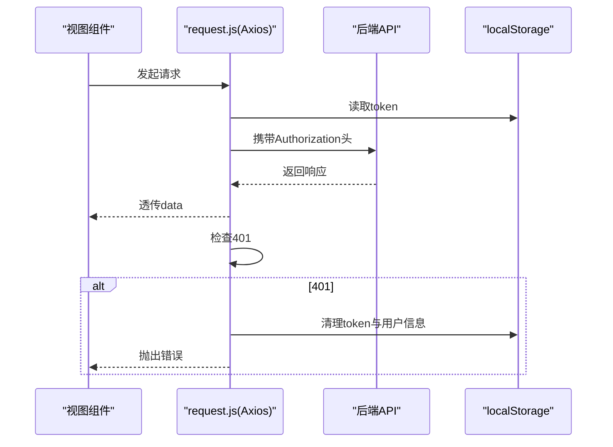
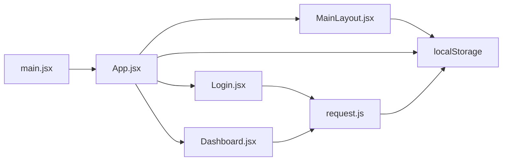

# 状态管理

<cite>
**本文引用的文件**
- [main.jsx](file://backpack_quant_trading/frontend/src/main.jsx)
- [App.jsx](file://backpack_quant_trading/frontend/src/App.jsx)
- [MainLayout.jsx](file://backpack_quant_trading/frontend/src/layouts/MainLayout.jsx)
- [Login.jsx](file://backpack_quant_trading/frontend/src/views/Login.jsx)
- [Dashboard.jsx](file://backpack_quant_trading/frontend/src/views/Dashboard.jsx)
- [request.js](file://backpack_quant_trading/frontend/src/api/request.js)
</cite>

## 目录
1. [引言](#引言)
2. [项目结构](#项目结构)
3. [核心组件](#核心组件)
4. [架构总览](#架构总览)
5. [详细组件分析](#详细组件分析)
6. [依赖关系分析](#依赖关系分析)
7. [性能考量](#性能考量)
8. [故障排查指南](#故障排查指南)
9. [结论](#结论)
10. [附录](#附录)

## 引言
本文件面向状态管理系统，聚焦前端状态管理架构与实践，覆盖本地状态、全局状态与服务器状态的协同策略；解释API请求封装、数据获取与缓存机制；阐述状态更新模式、副作用处理与异步操作管理；给出状态持久化、本地存储与会话管理的实现方案；说明错误状态处理、加载状态管理与用户反馈机制；并提供状态调试工具、性能监控与内存泄漏防护建议，以及状态管理最佳实践与团队开发规范。

## 项目结构
前端采用 React + Vite 架构，路由基于 react-router-dom，状态以 React Hooks 为主，配合本地存储实现会话与轻量持久化。核心入口负责应用初始化与路由挂载，页面视图负责业务状态与副作用管理，API 层通过 axios 封装统一请求与拦截器。

图表来源
- [main.jsx:1-17](file://backpack_quant_trading/frontend/src/main.jsx#L1-L17)
- [App.jsx:1-76](file://backpack_quant_trading/frontend/src/App.jsx#L1-L76)
- [MainLayout.jsx:1-222](file://backpack_quant_trading/frontend/src/layouts/MainLayout.jsx#L1-L222)
- [Login.jsx:1-253](file://backpack_quant_trading/frontend/src/views/Login.jsx#L1-L253)
- [Dashboard.jsx:1-311](file://backpack_quant_trading/frontend/src/views/Dashboard.jsx#L1-L311)
- [request.js:1-33](file://backpack_quant_trading/frontend/src/api/request.js#L1-L33)

章节来源
- [main.jsx:1-17](file://backpack_quant_trading/frontend/src/main.jsx#L1-L17)
- [App.jsx:1-76](file://backpack_quant_trading/frontend/src/App.jsx#L1-L76)

## 核心组件
- 应用入口与路由容器：负责初始化 React 与 BrowserRouter，承载顶层路由与布局。
- 路由与鉴权守卫：在进入受保护路由前校验本地 token，未登录重定向至登录页。
- 布局与会话状态：侧边栏与头部信息展示用户信息，使用本地存储恢复用户状态；提供登出清理逻辑。
- 登录/注册视图：表单本地状态驱动输入，调用认证 API 后写入 token 与用户信息，处理加载态与错误反馈。
- 仪表盘视图：聚合多个业务数据源，定时轮询刷新，渲染图表与表格，具备清理副作用的生命周期。
- API 请求封装：统一 axios 实例，注入 Authorization 头，处理 401 自动登出，透传响应数据。

章节来源
- [MainLayout.jsx:65-88](file://backpack_quant_trading/frontend/src/layouts/MainLayout.jsx#L65-L88)
- [Login.jsx:25-69](file://backpack_quant_trading/frontend/src/views/Login.jsx#L25-L69)
- [Dashboard.jsx:30-81](file://backpack_quant_trading/frontend/src/views/Dashboard.jsx#L30-L81)
- [request.js:3-30](file://backpack_quant_trading/frontend/src/api/request.js#L3-L30)

## 架构总览
前端状态管理采用“本地状态 + 全局会话状态 + 服务器状态”的分层策略：
- 本地状态：页面级表单、UI 状态、列表项选择等，使用 useState/useEffect 管理。
- 全局会话状态：用户信息与登录态，通过本地存储持久化并在应用启动时恢复。
- 服务器状态：通过 API 获取的业务数据，如仪表盘汇总、图表、订单与交易等，采用定时轮询或按需请求。

图表来源
- [Login.jsx:12-18](file://backpack_quant_trading/frontend/src/views/Login.jsx#L12-L18)
- [MainLayout.jsx:66-69](file://backpack_quant_trading/frontend/src/layouts/MainLayout.jsx#L66-L69)
- [Dashboard.jsx:14-24](file://backpack_quant_trading/frontend/src/views/Dashboard.jsx#L14-L24)
- [request.js:9-30](file://backpack_quant_trading/frontend/src/api/request.js#L9-L30)

## 详细组件分析

### 组件一：应用入口与路由容器
- 初始化 React 与 BrowserRouter，确保路由能力可用。
- 顶层路由定义与嵌套路由，承载主布局与各业务页面。
- 鉴权守卫：RequireAuth/GuestOnly 基于本地存储 token 判断访问权限，未登录重定向到登录页。

图表来源
- [main.jsx:9-15](file://backpack_quant_trading/frontend/src/main.jsx#L9-L15)
- [App.jsx:18-32](file://backpack_quant_trading/frontend/src/App.jsx#L18-L32)

章节来源
- [main.jsx:1-17](file://backpack_quant_trading/frontend/src/main.jsx#L1-L17)
- [App.jsx:18-32](file://backpack_quant_trading/frontend/src/App.jsx#L18-L32)

### 组件二：布局与会话状态
- 用户信息恢复：启动时从本地存储读取用户信息并设置到组件状态，用于头部显示与菜单控制。
- 会话清理：登出时移除 token 与用户信息，跳转登录页。
- 导航与页面标题：根据当前路径动态设置页面标题，支持父子菜单分组。

图表来源
- [MainLayout.jsx:66-88](file://backpack_quant_trading/frontend/src/layouts/MainLayout.jsx#L66-L88)

章节来源
- [MainLayout.jsx:65-88](file://backpack_quant_trading/frontend/src/layouts/MainLayout.jsx#L65-L88)

### 组件三：登录/注册与本地存储
- 表单本地状态：用户名、密码、邮箱、确认密码、记住我等字段由 useState 管理。
- 加载与反馈：登录/注册期间设置 loading，捕获异常并设置消息类型与内容。
- 本地存储：成功后写入 token 与用户信息；错误时保留用户输入以便再次尝试。
- 认证 API：调用认证接口，成功后跳转首页。

图表来源
- [Login.jsx:25-69](file://backpack_quant_trading/frontend/src/views/Login.jsx#L25-L69)

章节来源
- [Login.jsx:12-18](file://backpack_quant_trading/frontend/src/views/Login.jsx#L12-L18)
- [Login.jsx:25-69](file://backpack_quant_trading/frontend/src/views/Login.jsx#L25-L69)

### 组件四：仪表盘与服务器状态
- 数据聚合：一次性拉取仪表盘汇总、图表、持仓、订单、交易与风险事件。
- 定时轮询：初始化时拉取一次，随后每间隔固定时间轮询刷新；同时每秒更新本地时间显示。
- 图表渲染：使用 ECharts 初始化并按数据更新配置。
- 副作用清理：组件卸载时清除轮询与定时器，避免内存泄漏与重复订阅。

图表来源
- [Dashboard.jsx:30-81](file://backpack_quant_trading/frontend/src/views/Dashboard.jsx#L30-L81)

章节来源
- [Dashboard.jsx:14-24](file://backpack_quant_trading/frontend/src/views/Dashboard.jsx#L14-L24)
- [Dashboard.jsx:30-81](file://backpack_quant_trading/frontend/src/views/Dashboard.jsx#L30-L81)

### 组件五：API 请求封装与拦截器
- Axios 实例：统一 baseURL、超时与凭证配置。
- 请求拦截：从本地存储读取 token 并注入 Authorization 头。
- 响应拦截：透传响应数据；处理 401 自动登出并跳转登录页。
- 与业务协作：登录/注册与仪表盘均通过该实例发起请求。

图表来源
- [request.js:9-30](file://backpack_quant_trading/frontend/src/api/request.js#L9-L30)

章节来源
- [request.js:3-30](file://backpack_quant_trading/frontend/src/api/request.js#L3-L30)

## 依赖关系分析
- 入口依赖路由与布局，布局依赖本地存储与导航；登录视图依赖认证 API 与本地存储；仪表盘依赖图表库与 API；API 依赖本地存储与路由守卫共同保障会话一致性。
- 关键耦合点：路由守卫依赖本地存储；API 拦截器依赖本地存储；布局依赖本地存储；仪表盘依赖 API 与定时器。

图表来源
- [main.jsx:1-17](file://backpack_quant_trading/frontend/src/main.jsx#L1-L17)
- [App.jsx:18-32](file://backpack_quant_trading/frontend/src/App.jsx#L18-L32)
- [Login.jsx:3](file://backpack_quant_trading/frontend/src/views/Login.jsx#L3)
- [Dashboard.jsx:4-5](file://backpack_quant_trading/frontend/src/views/Dashboard.jsx#L4-L5)
- [MainLayout.jsx:66-69](file://backpack_quant_trading/frontend/src/layouts/MainLayout.jsx#L66-L69)
- [request.js:11-14](file://backpack_quant_trading/frontend/src/api/request.js#L11-L14)

章节来源
- [App.jsx:18-32](file://backpack_quant_trading/frontend/src/App.jsx#L18-L32)
- [request.js:11-14](file://backpack_quant_trading/frontend/src/api/request.js#L11-L14)

## 性能考量
- 轮询频率与资源占用：仪表盘采用定时轮询，建议根据数据变化频率与服务端压力调整周期，避免频繁请求导致带宽与 CPU 占用上升。
- 图表渲染优化：仅在数据变更时更新 ECharts 配置，避免不必要的重绘；在组件卸载时销毁实例。
- 本地存储读写：在布局与登录组件中尽量减少对本地存储的频繁读写，可在必要时合并更新。
- 资源释放：确保所有定时器与订阅在组件卸载时清理，防止内存泄漏与后台任务持续执行。

## 故障排查指南
- 登录/注册失败
  - 现象：提交后出现错误消息。
  - 排查：检查网络请求是否返回 401；确认本地存储是否正确写入 token 与用户信息；查看拦截器是否注入 Authorization 头。
- 401 自动登出
  - 现象：访问受保护路由或调用 API 后被重定向到登录页。
  - 排查：确认 token 是否过期或被删除；检查拦截器响应处理逻辑；验证后端认证机制。
- 仪表盘不刷新
  - 现象：数据长时间未更新。
  - 排查：确认轮询定时器是否启动；检查 API 返回数据结构；验证组件卸载清理逻辑。
- 内存泄漏
  - 现象：切换页面后 CPU 占用升高或页面卡顿。
  - 排查：确认定时器与订阅是否在 useEffect cleanup 中清理；ECharts 实例是否销毁。

章节来源
- [request.js:20-30](file://backpack_quant_trading/frontend/src/api/request.js#L20-L30)
- [Dashboard.jsx:77-81](file://backpack_quant_trading/frontend/src/views/Dashboard.jsx#L77-L81)

## 结论
本前端状态管理以 React Hooks 为核心，结合本地存储与 axios 拦截器，实现了本地状态、全局会话状态与服务器状态的清晰分层。通过路由守卫与登录流程保证会话安全，通过定时轮询与图表渲染提升用户体验。建议在现有基础上引入更完善的缓存策略与状态调试工具，进一步增强可维护性与可观测性。

## 附录
- 状态持久化与会话管理
  - 使用 localStorage 存储 token 与用户信息，启动时恢复用户状态，登出时清理。
  - 路由守卫基于本地 token 控制访问权限。
- 错误状态处理与用户反馈
  - 登录/注册阶段设置 loading 与消息类型，捕获异常并提示用户。
  - API 层统一处理 401，自动清理会话并跳转登录页。
- 异步操作与副作用管理
  - 仪表盘使用定时器与轮询，组件卸载时统一清理。
- 最佳实践与团队规范
  - 统一使用 axios 实例与拦截器，避免分散的认证逻辑。
  - 在组件内集中管理副作用，遵循“谁创建谁清理”的原则。
  - 对高频轮询与图表渲染进行节流与防抖优化，降低资源消耗。