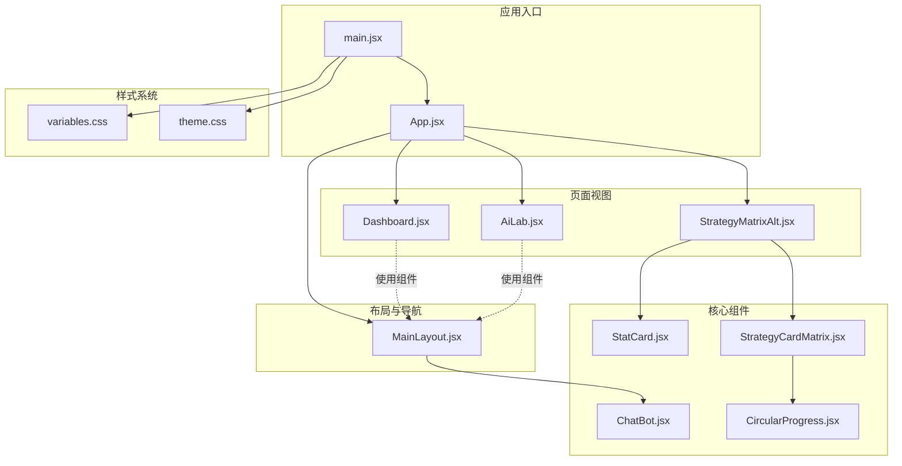
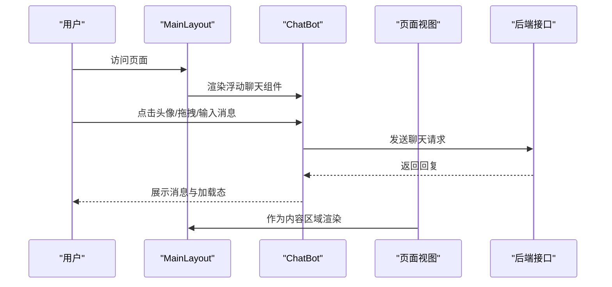
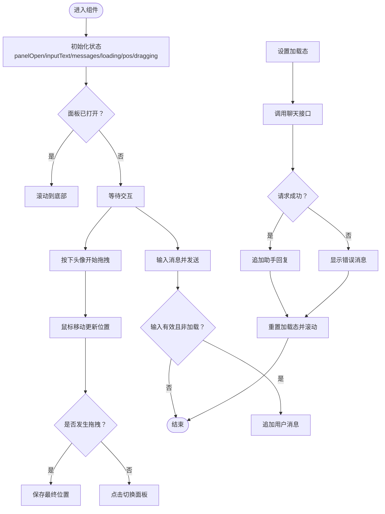
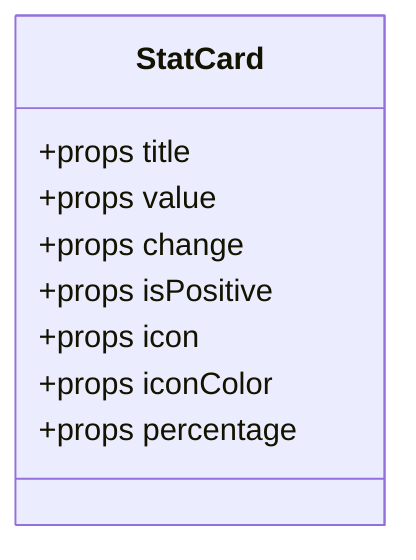
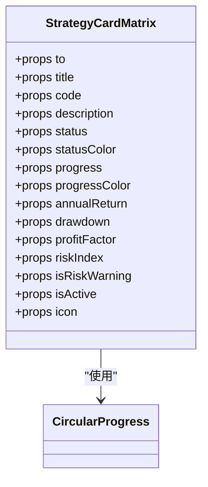
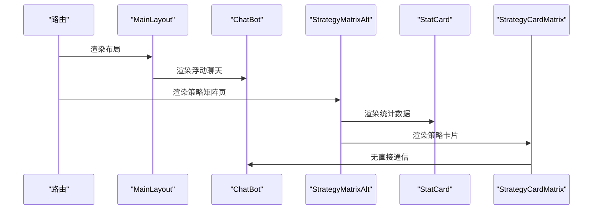
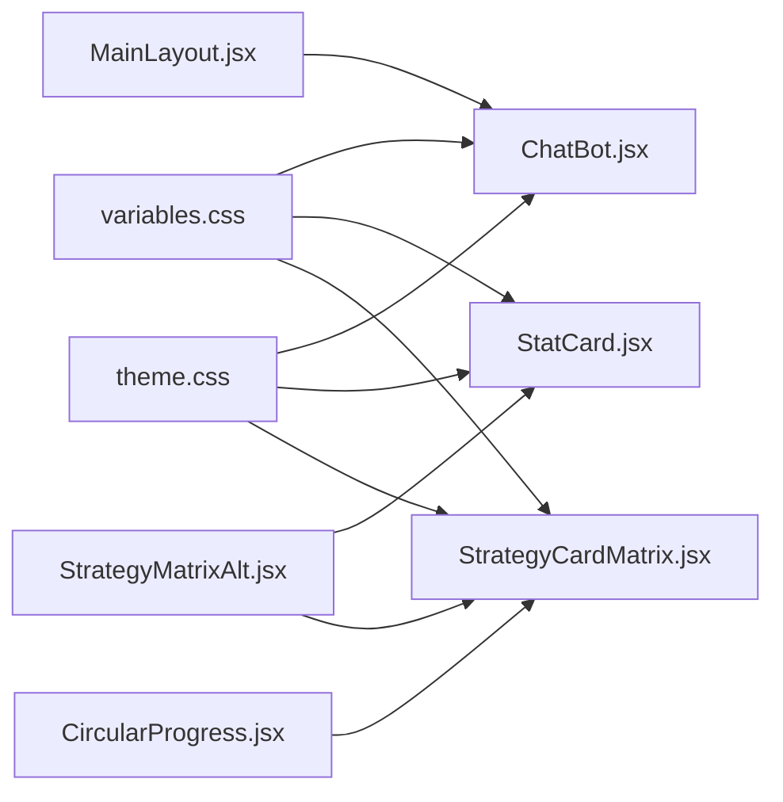

# 组件设计系统

<cite>
**本文档引用的文件**
- [ChatBot.jsx](file://backpack_quant_trading/frontend/src/components/ChatBot.jsx)
- [ChatBot.css](file://backpack_quant_trading/frontend/src/components/ChatBot.css)
- [StatCard.jsx](file://backpack_quant_trading/frontend/src/components/StatCard.jsx)
- [StatCard.css](file://backpack_quant_trading/frontend/src/components/StatCard.css)
- [StrategyCardMatrix.jsx](file://backpack_quant_trading/frontend/src/components/StrategyCardMatrix.jsx)
- [CircularProgress.jsx](file://backpack_quant_trading/frontend/src/components/CircularProgress.jsx)
- [MainLayout.jsx](file://backpack_quant_trading/frontend/src/layouts/MainLayout.jsx)
- [StrategyMatrixAlt.jsx](file://backpack_quant_trading/frontend/src/views/StrategyMatrixAlt.jsx)
- [Dashboard.jsx](file://backpack_quant_trading/frontend/src/views/Dashboard.jsx)
- [AiLab.jsx](file://backpack_quant_trading/frontend/src/views/AiLab.jsx)
- [App.jsx](file://backpack_quant_trading/frontend/src/App.jsx)
- [main.jsx](file://backpack_quant_trading/frontend/src/main.jsx)
- [theme.css](file://backpack_quant_trading/frontend/src/assets/theme.css)
- [variables.css](file://backpack_quant_trading/frontend/src/assets/variables.css)
</cite>

## 目录
1. [简介](#简介)
2. [项目结构](#项目结构)
3. [核心组件](#核心组件)
4. [架构总览](#架构总览)
5. [组件详解](#组件详解)
6. [依赖关系分析](#依赖关系分析)
7. [性能考量](#性能考量)
8. [故障排查指南](#故障排查指南)
9. [结论](#结论)
10. [附录](#附录)

## 简介
本组件设计系统面向量化交易前端，提供可复用、可定制的UI组件与页面布局。重点组件包括浮动聊天机器人、统计卡片与策略矩阵卡片，配合主题变量与样式体系，形成统一的视觉与交互体验。本文档从设计原则、命名规范、复用策略、实现细节、样式定制、主题配置、响应式设计、组件通信、状态管理、测试策略、可访问性与兼容性等方面进行全面阐述。

## 项目结构
前端采用模块化组织，按功能域划分组件、视图与布局；样式通过CSS变量与主题覆盖实现统一风格；路由在应用入口集中配置，页面通过布局容器统一承载。

**图表来源**
- [main.jsx:1-17](file://backpack_quant_trading/frontend/src/main.jsx#L1-L17)
- [App.jsx:1-76](file://backpack_quant_trading/frontend/src/App.jsx#L1-L76)
- [MainLayout.jsx:1-222](file://backpack_quant_trading/frontend/src/layouts/MainLayout.jsx#L1-L222)
- [ChatBot.jsx:1-250](file://backpack_quant_trading/frontend/src/components/ChatBot.jsx#L1-L250)
- [StatCard.jsx:1-32](file://backpack_quant_trading/frontend/src/components/StatCard.jsx#L1-L32)
- [StrategyCardMatrix.jsx:1-126](file://backpack_quant_trading/frontend/src/components/StrategyCardMatrix.jsx#L1-L126)
- [CircularProgress.jsx:1-34](file://backpack_quant_trading/frontend/src/components/CircularProgress.jsx#L1-L34)
- [Dashboard.jsx:1-311](file://backpack_quant_trading/frontend/src/views/Dashboard.jsx#L1-L311)
- [AiLab.jsx:1-299](file://backpack_quant_trading/frontend/src/views/AiLab.jsx#L1-L299)
- [StrategyMatrixAlt.jsx:1-268](file://backpack_quant_trading/frontend/src/views/StrategyMatrixAlt.jsx#L1-L268)
- [variables.css:1-27](file://backpack_quant_trading/frontend/src/assets/variables.css#L1-L27)
- [theme.css:1-112](file://backpack_quant_trading/frontend/src/assets/theme.css#L1-L112)

**章节来源**
- [main.jsx:1-17](file://backpack_quant_trading/frontend/src/main.jsx#L1-L17)
- [App.jsx:1-76](file://backpack_quant_trading/frontend/src/App.jsx#L1-L76)
- [MainLayout.jsx:1-222](file://backpack_quant_trading/frontend/src/layouts/MainLayout.jsx#L1-L222)

## 核心组件
- ChatBot：浮动聊天机器人，支持拖拽定位、建议问题、消息流与加载态。
- StatCard：统计卡片，用于展示数值、百分比与变化趋势。
- StrategyCardMatrix：策略卡片矩阵，展示策略概览、进度、关键指标与状态。
- CircularProgress：圆形进度指示器，用于策略执行进度可视化。

**章节来源**
- [ChatBot.jsx:1-250](file://backpack_quant_trading/frontend/src/components/ChatBot.jsx#L1-L250)
- [StatCard.jsx:1-32](file://backpack_quant_trading/frontend/src/components/StatCard.jsx#L1-L32)
- [StrategyCardMatrix.jsx:1-126](file://backpack_quant_trading/frontend/src/components/StrategyCardMatrix.jsx#L1-L126)
- [CircularProgress.jsx:1-34](file://backpack_quant_trading/frontend/src/components/CircularProgress.jsx#L1-L34)

## 架构总览
组件间通信以props为主，通过路由参数与状态管理实现页面级联动；样式通过CSS变量与主题覆盖统一风格；布局容器承载全局导航与聊天组件。

**图表来源**
- [MainLayout.jsx:1-222](file://backpack_quant_trading/frontend/src/layouts/MainLayout.jsx#L1-L222)
- [ChatBot.jsx:1-250](file://backpack_quant_trading/frontend/src/components/ChatBot.jsx#L1-L250)
- [App.jsx:1-76](file://backpack_quant_trading/frontend/src/App.jsx#L1-L76)

## 组件详解

### ChatBot 组件
- 设计原则
  - 浮动交互：固定定位，支持拖拽移动与点击展开。
  - 可访问性：提供aria-label与键盘事件（回车发送）。
  - 错误处理：捕获网络异常，显示友好提示。
- 命名规范
  - 状态类：panelOpen、loading、dragging、didDrag。
  - 位置类：pos、dragStart。
  - 数据类：messages、inputText。
- 复用策略
  - 作为布局子组件被全局引入，减少重复实现。
  - 通过props传入建议问题与API方法，便于扩展。
- 属性定义
  - 无外部props，内部通过状态管理UI行为。
- 事件处理
  - 鼠标拖拽：onMouseDown/onMouseMove/onMouseUp。
  - 输入提交：onChange/onKeyDown/onClick。
- 状态管理
  - useState管理面板开关、输入文本、消息列表、加载状态与拖拽状态。
  - useEffect在面板打开时滚动到底部。
  - useMemo计算面板位置与左右布局。
- 样式定制
  - 支持通过CSS变量覆盖颜色、阴影与圆角。
  - 提供“拖拽中”与“展开中”的视觉反馈。
- 主题配置
  - 使用variables.css中的颜色变量与阴影变量。
- 响应式设计
  - 固定定位适配移动端，面板宽度与最大高度限制。
- 组件通信
  - 通过API模块发送消息，接收后更新消息列表。
- 可访问性
  - 提供aria-label与键盘交互。
- 兼容性
  - 使用标准DOM事件与CSS动画，兼容现代浏览器。

**图表来源**
- [ChatBot.jsx:114-142](file://backpack_quant_trading/frontend/src/components/ChatBot.jsx#L114-L142)
- [ChatBot.jsx:59-63](file://backpack_quant_trading/frontend/src/components/ChatBot.jsx#L59-L63)
- [ChatBot.jsx:45-51](file://backpack_quant_trading/frontend/src/components/ChatBot.jsx#L45-L51)

**章节来源**
- [ChatBot.jsx:1-250](file://backpack_quant_trading/frontend/src/components/ChatBot.jsx#L1-L250)
- [ChatBot.css:1-300](file://backpack_quant_trading/frontend/src/components/ChatBot.css#L1-L300)

### StatCard 组件
- 设计原则
  - 简洁信息密度：标题、数值、百分比与变化趋势清晰呈现。
  - 视觉层次：图标背景与数值对比突出。
- 命名规范
  - props：title/value/change/isPositive/icon/iconColor/percentage。
- 复用策略
  - 在多个页面中统一展示统计数据，保持一致的视觉与交互。
- 属性定义
  - title：标签文本。
  - value：主要数值。
  - change：变化量或变化率。
  - isPositive：变化正负性，影响颜色。
  - icon：图标组件。
  - iconColor：图标背景色。
  - percentage：百分比展示。
- 事件处理
  - 无交互事件，纯展示组件。
- 状态管理
  - 无内部状态，完全受控。
- 样式定制
  - 通过iconColor与percentage条件渲染实现差异化展示。
- 主题配置
  - 使用variables.css中的颜色变量。
- 响应式设计
  - 采用flex布局，自适应容器宽度。
- 组件通信
  - 作为子组件被页面视图调用，传递数据props。
- 可访问性
  - 文本语义明确，适合屏幕阅读器。
- 兼容性
  - 使用基础CSS与内联样式，兼容性良好。

**图表来源**
- [StatCard.jsx:4-31](file://backpack_quant_trading/frontend/src/components/StatCard.jsx#L4-L31)

**章节来源**
- [StatCard.jsx:1-32](file://backpack_quant_trading/frontend/src/components/StatCard.jsx#L1-L32)
- [StatCard.css:1-103](file://backpack_quant_trading/frontend/src/components/StatCard.css#L1-L103)

### StrategyCardMatrix 组件
- 设计原则
  - 信息密度高：状态、进度、关键指标四象限。
  - 视觉引导：进度条与状态色提供即时反馈。
  - 交互明确：支持链接跳转与悬停效果。
- 命名规范
  - props：to/title/code/description/status/statusColor/progress/progressColor/annualReturn/drawdown/profitFactor/riskIndex/isRiskWarning/isActive/icon。
- 复用策略
  - 作为策略列表项统一模板，便于批量渲染与交互。
- 属性定义
  - to：可选链接目标。
  - title/code/description：策略基本信息。
  - status/statusColor：状态与颜色。
  - progress/progressColor：执行进度与颜色。
  - annualReturn/drawdown/profitFactor/riskIndex：关键指标。
  - isRiskWarning/isActive/icon：风险提示与激活态。
- 事件处理
  - 无交互事件，纯展示组件。
- 状态管理
  - 无内部状态，完全受控。
- 样式定制
  - 通过状态与进度派生颜色，支持自定义颜色覆盖。
- 主题配置
  - 使用variables.css与组件内联颜色。
- 响应式设计
  - 使用栅格布局，支持两列自适应。
- 组件通信
  - 作为子组件被页面视图调用，传递数据props。
- 可访问性
  - 提供链接语义与按钮语义，支持键盘导航。
- 兼容性
  - 使用SVG与CSS动画，兼容现代浏览器。

**图表来源**
- [StrategyCardMatrix.jsx:25-125](file://backpack_quant_trading/frontend/src/components/StrategyCardMatrix.jsx#L25-L125)
- [CircularProgress.jsx:3-33](file://backpack_quant_trading/frontend/src/components/CircularProgress.jsx#L3-L33)

**章节来源**
- [StrategyCardMatrix.jsx:1-126](file://backpack_quant_trading/frontend/src/components/StrategyCardMatrix.jsx#L1-L126)
- [CircularProgress.jsx:1-34](file://backpack_quant_trading/frontend/src/components/CircularProgress.jsx#L1-L34)

### 页面集成与布局
- MainLayout
  - 负责侧边导航、头部信息与内容区Outlet。
  - 将ChatBot作为全局浮动组件渲染。
- StrategyMatrixAlt
  - 使用StatCard与StrategyCardMatrix构建策略矩阵页。
  - 通过API获取概览数据并动态计算统计。
- Dashboard与AiLab
  - 展示数据与图表，复用组件提升一致性。

**图表来源**
- [MainLayout.jsx:216-216](file://backpack_quant_trading/frontend/src/layouts/MainLayout.jsx#L216-L216)
- [StrategyMatrixAlt.jsx:179-263](file://backpack_quant_trading/frontend/src/views/StrategyMatrixAlt.jsx#L179-L263)
- [StatCard.jsx:4-31](file://backpack_quant_trading/frontend/src/components/StatCard.jsx#L4-L31)
- [StrategyCardMatrix.jsx:25-125](file://backpack_quant_trading/frontend/src/components/StrategyCardMatrix.jsx#L25-L125)

**章节来源**
- [MainLayout.jsx:1-222](file://backpack_quant_trading/frontend/src/layouts/MainLayout.jsx#L1-L222)
- [StrategyMatrixAlt.jsx:1-268](file://backpack_quant_trading/frontend/src/views/StrategyMatrixAlt.jsx#L1-L268)
- [Dashboard.jsx:1-311](file://backpack_quant_trading/frontend/src/views/Dashboard.jsx#L1-L311)
- [AiLab.jsx:1-299](file://backpack_quant_trading/frontend/src/views/AiLab.jsx#L1-L299)

## 依赖关系分析
- 组件依赖
  - StrategyCardMatrix 依赖 CircularProgress。
  - MainLayout 依赖 ChatBot。
  - StrategyMatrixAlt 依赖 StatCard 与 StrategyCardMatrix。
- 样式依赖
  - 所有组件共享 variables.css 的设计变量与 theme.css 的主题覆盖。
- 路由依赖
  - App.jsx 统一注册路由，页面通过布局容器承载。

**图表来源**
- [variables.css:1-27](file://backpack_quant_trading/frontend/src/assets/variables.css#L1-L27)
- [theme.css:1-112](file://backpack_quant_trading/frontend/src/assets/theme.css#L1-L112)
- [ChatBot.jsx:1-250](file://backpack_quant_trading/frontend/src/components/ChatBot.jsx#L1-L250)
- [StatCard.jsx:1-32](file://backpack_quant_trading/frontend/src/components/StatCard.jsx#L1-L32)
- [StrategyCardMatrix.jsx:1-126](file://backpack_quant_trading/frontend/src/components/StrategyCardMatrix.jsx#L1-L126)
- [CircularProgress.jsx:1-34](file://backpack_quant_trading/frontend/src/components/CircularProgress.jsx#L1-L34)
- [MainLayout.jsx:1-222](file://backpack_quant_trading/frontend/src/layouts/MainLayout.jsx#L1-L222)
- [StrategyMatrixAlt.jsx:1-268](file://backpack_quant_trading/frontend/src/views/StrategyMatrixAlt.jsx#L1-L268)

**章节来源**
- [App.jsx:1-76](file://backpack_quant_trading/frontend/src/App.jsx#L1-L76)
- [main.jsx:1-17](file://backpack_quant_trading/frontend/src/main.jsx#L1-L17)

## 性能考量
- 组件渲染
  - ChatBot 使用useMemo优化面板位置与布局判断，避免不必要重排。
  - StrategyCardMatrix 与 StatCard 为纯展示组件，渲染开销低。
- 事件处理
  - ChatBot 使用useCallback绑定拖拽与鼠标事件，减少闭包重建。
- 网络请求
  - ChatBot 在发送请求前后设置loading状态，避免并发请求。
- 图表与大数据
  - Dashboard与AiLab使用ECharts，注意数据量与缩放配置，避免卡顿。
- 样式与动画
  - 使用CSS变量与过渡动画，减少JS动画开销。

[本节为通用性能指导，无需特定文件来源]

## 故障排查指南
- 聊天组件无法拖拽
  - 检查鼠标事件绑定与dragging状态切换逻辑。
  - 确认ensurePosition正确获取元素位置。
- 聊天消息不显示
  - 检查消息数组更新与滚动逻辑。
  - 确认API返回格式与错误分支处理。
- 进度条不更新
  - 检查progress与progressColor派生逻辑。
  - 确认CircularProgress的百分比与颜色传参。
- 样式不生效
  - 检查CSS变量覆盖顺序与主题文件引入顺序。
  - 确认组件样式文件是否正确导入。

**章节来源**
- [ChatBot.jsx:65-87](file://backpack_quant_trading/frontend/src/components/ChatBot.jsx#L65-L87)
- [ChatBot.jsx:114-142](file://backpack_quant_trading/frontend/src/components/ChatBot.jsx#L114-L142)
- [StrategyCardMatrix.jsx:42-54](file://backpack_quant_trading/frontend/src/components/StrategyCardMatrix.jsx#L42-L54)
- [CircularProgress.jsx:3-33](file://backpack_quant_trading/frontend/src/components/CircularProgress.jsx#L3-L33)
- [variables.css:1-27](file://backpack_quant_trading/frontend/src/assets/variables.css#L1-L27)
- [theme.css:1-112](file://backpack_quant_trading/frontend/src/assets/theme.css#L1-L112)

## 结论
该组件设计系统通过统一的主题变量、清晰的组件职责与简洁的props接口，实现了高复用与强一致性的前端界面。ChatBot提供智能交互入口，StatCard与StrategyCardMatrix承担数据与策略信息展示，配合布局与页面视图形成完整的用户体验闭环。建议在后续迭代中进一步完善测试与可访问性覆盖，持续优化性能与主题扩展能力。

[本节为总结性内容，无需特定文件来源]

## 附录

### 设计原则与命名规范
- 设计原则
  - 一致性：统一的颜色、字体与间距。
  - 可访问性：提供语义化标签与键盘导航。
  - 响应式：适配不同屏幕尺寸。
  - 可复用：组件职责单一，接口稳定。
- 命名规范
  - 状态变量：panelOpen、loading、dragging等。
  - 位置变量：pos、dragStart。
  - 数据变量：messages、inputText、overviews等。
  - 属性命名：驼峰命名，语义明确。

[本节为通用规范说明，无需特定文件来源]

### 样式定制与主题配置
- CSS变量
  - 使用variables.css定义颜色、阴影与圆角等基础变量。
- 主题覆盖
  - 使用theme.css覆盖Element Plus等第三方组件库样式。
- 组件样式
  - 各组件独立CSS文件，通过类名隔离作用域。

**章节来源**
- [variables.css:1-27](file://backpack_quant_trading/frontend/src/assets/variables.css#L1-L27)
- [theme.css:1-112](file://backpack_quant_trading/frontend/src/assets/theme.css#L1-L112)
- [ChatBot.css:1-300](file://backpack_quant_trading/frontend/src/components/ChatBot.css#L1-L300)
- [StatCard.css:1-103](file://backpack_quant_trading/frontend/src/components/StatCard.css#L1-L103)

### 组件间通信与props传递
- 父子通信
  - 通过props向下传递数据与回调。
- 路由通信
  - 通过路由参数与状态管理实现页面级联动。
- 事件设计
  - 组件内部通过事件回调向外暴露交互意图。

**章节来源**
- [StrategyMatrixAlt.jsx:244-261](file://backpack_quant_trading/frontend/src/views/StrategyMatrixAlt.jsx#L244-L261)
- [MainLayout.jsx:112-163](file://backpack_quant_trading/frontend/src/layouts/MainLayout.jsx#L112-L163)

### 测试策略与可访问性
- 测试策略
  - 单元测试：针对组件渲染与状态变更。
  - 集成测试：验证组件在页面中的协作。
  - 可访问性测试：确保键盘导航与屏幕阅读器支持。
- 可访问性
  - 提供aria-label与语义化HTML结构。
  - 关注焦点管理与键盘操作。

[本节为通用指导，无需特定文件来源]

### 浏览器兼容性
- 现代浏览器：支持Flex布局、CSS变量与ES6语法。
- 旧版浏览器：需引入polyfill与降级方案（如需要）。

[本节为通用指导，无需特定文件来源]