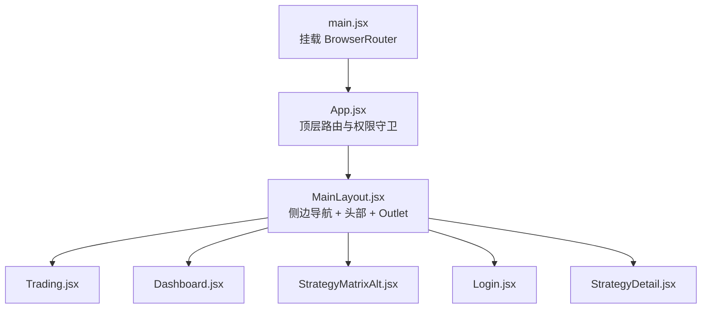
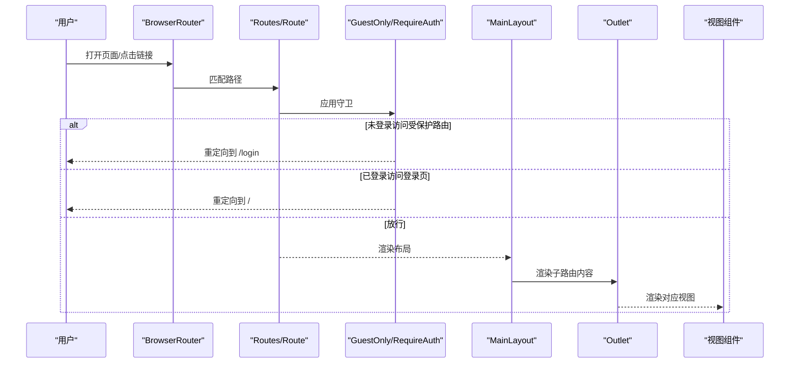
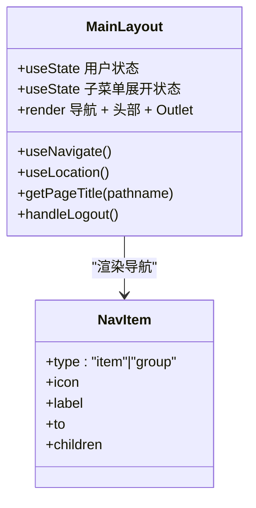
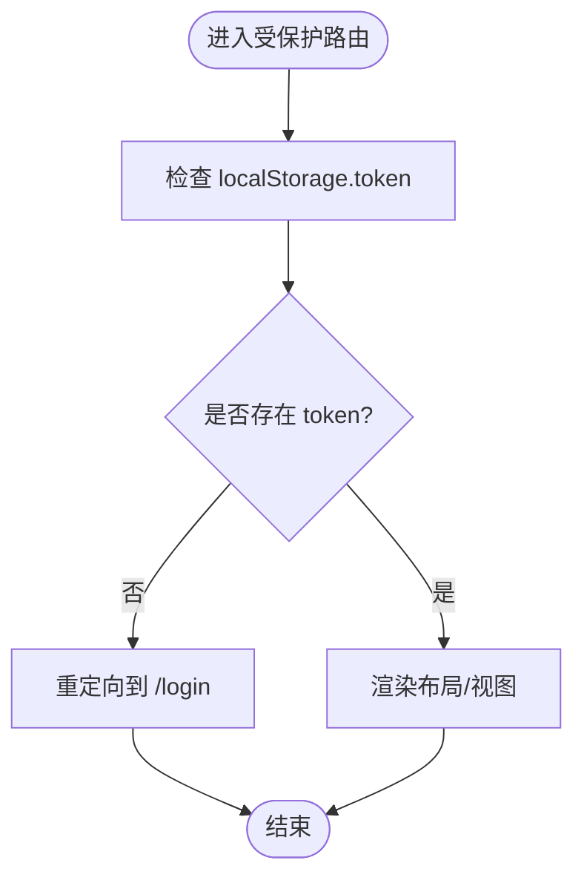
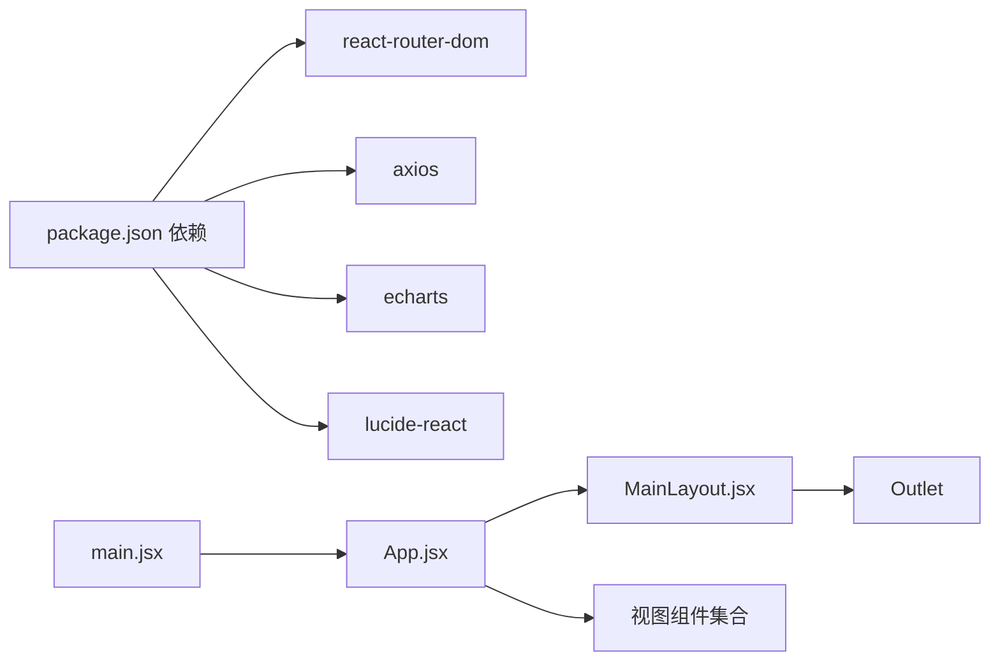

# 路由与导航

<cite>
**本文引用的文件**
- [main.jsx](file://backpack_quant_trading/frontend/src/main.jsx)
- [App.jsx](file://backpack_quant_trading/frontend/src/App.jsx)
- [MainLayout.jsx](file://backpack_quant_trading/frontend/src/layouts/MainLayout.jsx)
- [MainLayout.css](file://backpack_quant_trading/frontend/src/layouts/MainLayout.css)
- [Login.jsx](file://backpack_quant_trading/frontend/src/views/Login.jsx)
- [Trading.jsx](file://backpack_quant_trading/frontend/src/views/Trading.jsx)
- [Dashboard.jsx](file://backpack_quant_trading/frontend/src/views/Dashboard.jsx)
- [StrategyMatrixAlt.jsx](file://backpack_quant_trading/frontend/src/views/StrategyMatrixAlt.jsx)
- [StrategyDetail.jsx](file://backpack_quant_trading/frontend/src/views/StrategyDetail.jsx)
- [auth.js](file://backpack_quant_trading/frontend/src/api/auth.js)
- [trading.js](file://backpack_quant_trading/frontend/src/api/trading.js)
- [package.json](file://backpack_quant_trading/frontend/package.json)
</cite>

## 目录
1. [简介](#简介)
2. [项目结构](#项目结构)
3. [核心组件](#核心组件)
4. [架构总览](#架构总览)
5. [详细组件分析](#详细组件分析)
6. [依赖关系分析](#依赖关系分析)
7. [性能考虑](#性能考虑)
8. [故障排查指南](#故障排查指南)
9. [结论](#结论)
10. [附录](#附录)

## 简介
本文件面向量化交易前端的路由与导航系统，基于 React Router v6 的配置与使用，覆盖嵌套路由、动态路由与参数传递、权限守卫、布局组件 MainLayout 的职责与实现、导航菜单与面包屑设计、页面跳转最佳实践、路由状态与历史记录处理、以及调试与常见问题解决方案。文档同时给出与实际源码映射的架构图与流程图，帮助读者快速理解与落地。

## 项目结构
前端采用 Vite 构建，入口在 main.jsx 中挂载 BrowserRouter，并在 App.jsx 中定义顶层路由与权限守卫。布局组件 MainLayout 提供侧边导航、头部信息与 Outlet 内容区，各业务视图组件按需渲染。

**图表来源**
- [main.jsx:1-17](file://backpack_quant_trading/frontend/src/main.jsx#L1-L17)
- [App.jsx:1-76](file://backpack_quant_trading/frontend/src/App.jsx#L1-L76)
- [MainLayout.jsx:1-222](file://backpack_quant_trading/frontend/src/layouts/MainLayout.jsx#L1-L222)
- [Trading.jsx:1-499](file://backpack_quant_trading/frontend/src/views/Trading.jsx#L1-L499)
- [Dashboard.jsx:1-311](file://backpack_quant_trading/frontend/src/views/Dashboard.jsx#L1-L311)
- [StrategyMatrixAlt.jsx:1-268](file://backpack_quant_trading/frontend/src/views/StrategyMatrixAlt.jsx#L1-L268)
- [Login.jsx:1-253](file://backpack_quant_trading/frontend/src/views/Login.jsx#L1-L253)
- [StrategyDetail.jsx:1-800](file://backpack_quant_trading/frontend/src/views/StrategyDetail.jsx#L1-L800)

**章节来源**
- [main.jsx:1-17](file://backpack_quant_trading/frontend/src/main.jsx#L1-L17)
- [App.jsx:1-76](file://backpack_quant_trading/frontend/src/App.jsx#L1-L76)

## 核心组件
- 路由入口与容器
  - main.jsx 使用 BrowserRouter 包裹应用根节点，确保全站路由能力。
  - App.jsx 定义顶层 Routes，包含登录页与受保护的主布局嵌套路由。
- 权限守卫
  - RequireAuth：检测本地存储 token，未登录则重定向至登录页。
  - GuestOnly：检测已登录状态，已登录则重定向至首页。
- 布局组件 MainLayout
  - 统一侧边导航、头部用户信息与内容区 Outlet。
  - 通过 useLocation/useNavigate 管理页面标题、激活态与退出登录。
- 视图组件
  - Trading、Dashboard、StrategyMatrixAlt、Login、StrategyDetail 等按路径渲染。

**章节来源**
- [App.jsx:18-32](file://backpack_quant_trading/frontend/src/App.jsx#L18-L32)
- [MainLayout.jsx:65-222](file://backpack_quant_trading/frontend/src/layouts/MainLayout.jsx#L65-L222)
- [Login.jsx:1-253](file://backpack_quant_trading/frontend/src/views/Login.jsx#L1-L253)

## 架构总览
下图展示路由与导航的整体交互：浏览器地址变化触发路由匹配，权限守卫决定是否放行，MainLayout 渲染侧边导航与内容区，视图组件负责具体业务。

**图表来源**
- [App.jsx:34-72](file://backpack_quant_trading/frontend/src/App.jsx#L34-L72)
- [MainLayout.jsx:90-218](file://backpack_quant_trading/frontend/src/layouts/MainLayout.jsx#L90-L218)

## 详细组件分析

### 嵌套路由与路径设计
- 顶层路由
  - /login：GuestOnly 包裹，仅访客可见。
  - /：RequireAuth 包裹，进入主布局。
- 主布局嵌套路由
  - /trading、/dashboard、/ai-lab、/grid-trading、/currency-monitor、/stock-ai、/strategies、/strategies/eth-trend、/strategies/eth-only、/strategies/paxg-trend、/strategies/nas100-trend、/okx-console。
- 默认子路由
  - 在根路径下 index 跳转到 /trading。

这些设计将页面划分为“登录页”和“主布局内的多视图”，通过嵌套路由实现清晰的层级与权限控制。

**章节来源**
- [App.jsx:37-68](file://backpack_quant_trading/frontend/src/App.jsx#L37-L68)

### 动态路由与路由参数传递
- 当前实现
  - 项目未使用 React Router 的动态段（如 :id）或查询参数解析逻辑。
  - 视图内部通过 useNavigate/useLocation 进行页面跳转与状态读取。
- 示例
  - 登录成功后，Login.jsx 使用 navigate('/') 返回主页面。
  - StrategyMatrixAlt.jsx 使用 useLocation().pathname 判断当前激活项。
  - StrategyDetail.jsx 接收外部传入的配置函数（getOverview/getTrades/getKlines），用于按需加载数据，体现“参数化”的数据加载策略。

建议
- 若未来需要动态段，可在 Route path 中使用冒号语法，并通过 useParams 获取参数。
- 对于复杂参数，可结合 useSearchParams 或自定义 hook 解析查询字符串。

**章节来源**
- [Login.jsx:34-62](file://backpack_quant_trading/frontend/src/views/Login.jsx#L34-L62)
- [StrategyMatrixAlt.jsx:90-108](file://backpack_quant_trading/frontend/src/views/StrategyMatrixAlt.jsx#L90-L108)
- [StrategyDetail.jsx:87-439](file://backpack_quant_trading/frontend/src/views/StrategyDetail.jsx#L87-L439)

### MainLayout 布局组件
- 职责
  - 提供全局侧边导航（含父子菜单）、头部用户信息与操作区、内容区 Outlet。
  - 维护用户状态（localStorage），处理退出登录并重定向。
- 导航与激活态
  - navItems 定义导航项，支持 group 类型的父子菜单。
  - 通过 useLocation 判断当前激活项，支持策略矩阵类路径的“父级激活”效果。
- 页面标题
  - getPageTitle 根据路径返回不同标题，统一“实盘交易/AI 实验室”等父级标题。
- 样式
  - MainLayout.css 提供完整的布局样式，包括侧边栏宽度、头部布局、用户信息与按钮等。

**图表来源**
- [MainLayout.jsx:18-63](file://backpack_quant_trading/frontend/src/layouts/MainLayout.jsx#L18-L63)
- [MainLayout.jsx:112-163](file://backpack_quant_trading/frontend/src/layouts/MainLayout.jsx#L112-L163)
- [MainLayout.jsx:90-218](file://backpack_quant_trading/frontend/src/layouts/MainLayout.jsx#L90-L218)

**章节来源**
- [MainLayout.jsx:18-63](file://backpack_quant_trading/frontend/src/layouts/MainLayout.jsx#L18-L63)
- [MainLayout.jsx:112-163](file://backpack_quant_trading/frontend/src/layouts/MainLayout.jsx#L112-L163)
- [MainLayout.jsx:90-218](file://backpack_quant_trading/frontend/src/layouts/MainLayout.jsx#L90-L218)
- [MainLayout.css:1-301](file://backpack_quant_trading/frontend/src/layouts/MainLayout.css#L1-L301)

### 权限控制路由（RequireAuth 与 GuestOnly）
- RequireAuth
  - 读取 localStorage 中 token，不存在则使用 <Navigate to="/login" replace /> 强制跳转。
- GuestOnly
  - 读取 localStorage 中 token，存在则跳转到 "/"，防止已登录用户访问登录页。
- 应用位置
  - 登录页使用 GuestOnly 包裹，主布局使用 RequireAuth 包裹。

**图表来源**
- [App.jsx:18-32](file://backpack_quant_trading/frontend/src/App.jsx#L18-L32)

**章节来源**
- [App.jsx:18-32](file://backpack_quant_trading/frontend/src/App.jsx#L18-L32)

### 导航菜单设计与面包屑导航
- 导航菜单
  - MainLayout 的 navItems 定义了“实盘交易/AI 实验室”等分组菜单，每个分组包含若干子项。
  - 通过 NavLink 的 isActive 属性高亮当前激活项；父子菜单展开/收起由 useState 控制。
- 面包屑
  - 当前实现未显式引入面包屑组件，但可通过 useLocation().pathname 与 navItems 映射生成面包屑路径。
  - 建议：根据当前路径与 navItems 的 to/label 构造面包屑数组，渲染为可点击的导航链路。

**章节来源**
- [MainLayout.jsx:18-63](file://backpack_quant_trading/frontend/src/layouts/MainLayout.jsx#L18-L63)
- [MainLayout.jsx:112-163](file://backpack_quant_trading/frontend/src/layouts/MainLayout.jsx#L112-L163)

### 页面跳转最佳实践
- 使用 useNavigate 进行编程式导航，避免硬编码路径。
- 登录成功后统一跳转到根路径 '/'，由 RequireAuth 决定后续布局。
- 策略矩阵页面通过 NavLink 的 to 属性实现声明式跳转，保持与路由表一致。

**章节来源**
- [Login.jsx:34-62](file://backpack_quant_trading/frontend/src/views/Login.jsx#L34-L62)
- [StrategyMatrixAlt.jsx:244-261](file://backpack_quant_trading/frontend/src/views/StrategyMatrixAlt.jsx#L244-L261)

### 路由状态管理、历史记录与前进后退
- 路由状态
  - 使用 useLocation 获取当前路径与状态，用于标题计算与激活态判断。
- 历史记录
  - 浏览器历史栈由 React Router 管理，无需额外持久化。
  - 前进/后退由浏览器原生行为完成，无需特殊处理。
- 与布局联动
  - MainLayout 通过 useLocation 监听路径变化，动态更新页面标题与侧边导航激活态。

**章节来源**
- [MainLayout.jsx:74-90](file://backpack_quant_trading/frontend/src/layouts/MainLayout.jsx#L74-L90)
- [StrategyMatrixAlt.jsx:90-108](file://backpack_quant_trading/frontend/src/views/StrategyMatrixAlt.jsx#L90-L108)

### 路由懒加载、代码分割与性能优化
- 当前状态
  - 项目未启用 React.lazy 与 Suspense 的懒加载模式，所有视图在打包时被静态导入。
- 优化建议
  - 将大型视图（如 Trading、Dashboard、StrategyDetail）拆分为异步组件，配合 React.lazy 与 Suspense 实现按需加载。
  - 使用 React Router 的 lazy 函数与动态 import，减少首屏体积。
  - 结合路由级别的代码分割，仅加载当前页面所需模块，提升首屏性能与交互流畅度。

[本节为通用优化建议，不直接分析具体文件，故无“章节来源”]

### API 与路由参数的关系
- 登录与认证
  - auth.js 暴露 login/register/getMe/logout 等接口，Login.jsx 调用登录接口并写入 token 与用户信息。
- 实盘交易
  - trading.js 暴露策略查询、实例管理、日志、HYPE 状态等接口，Trading.jsx 调用这些接口进行数据拉取与交互。
- 数据加载与参数化
  - StrategyDetail.jsx 通过外部注入的 getOverview/getTrades/getKlines 等函数按需加载数据，体现“参数化”的数据加载策略。

**章节来源**
- [auth.js:1-7](file://backpack_quant_trading/frontend/src/api/auth.js#L1-L7)
- [trading.js:1-14](file://backpack_quant_trading/frontend/src/api/trading.js#L1-L14)
- [Login.jsx:25-69](file://backpack_quant_trading/frontend/src/views/Login.jsx#L25-L69)
- [Trading.jsx:81-101](file://backpack_quant_trading/frontend/src/views/Trading.jsx#L81-L101)
- [StrategyDetail.jsx:412-439](file://backpack_quant_trading/frontend/src/views/StrategyDetail.jsx#L412-L439)

## 依赖关系分析
- React Router
  - react-router-dom 提供 BrowserRouter、Routes、Route、Navigate、NavLink、Outlet、useNavigate、useLocation 等核心能力。
- 项目依赖
  - package.json 显示 react、react-dom、react-router-dom、axios、echarts、lucide-react 等依赖。
- 关键导入与导出
  - main.jsx 导出 App 并包裹在 BrowserRouter 中。
  - App.jsx 导出顶层路由与权限守卫。
  - MainLayout.jsx 导出布局组件，内部使用 Outlet 渲染子路由。

**图表来源**
- [package.json:11-26](file://backpack_quant_trading/frontend/package.json#L11-L26)
- [main.jsx:1-17](file://backpack_quant_trading/frontend/src/main.jsx#L1-L17)
- [App.jsx:1-17](file://backpack_quant_trading/frontend/src/App.jsx#L1-L17)
- [MainLayout.jsx:1-16](file://backpack_quant_trading/frontend/src/layouts/MainLayout.jsx#L1-L16)

**章节来源**
- [package.json:11-26](file://backpack_quant_trading/frontend/package.json#L11-L26)
- [main.jsx:1-17](file://backpack_quant_trading/frontend/src/main.jsx#L1-L17)
- [App.jsx:1-17](file://backpack_quant_trading/frontend/src/App.jsx#L1-L17)

## 性能考虑
- 代码分割
  - 将大型视图组件拆分为异步模块，减少首屏加载体积。
- 路由懒加载
  - 使用 React.lazy 与 Suspense，结合 React Router 的 lazy 与动态 import。
- 图表与数据
  - ECharts 初始化应避免重复创建实例，复用或在卸载时销毁实例，降低内存占用。
- 定时任务
  - Trading.jsx 中使用 setInterval 定时刷新数据，组件卸载时需清理定时器，避免内存泄漏。

**章节来源**
- [Trading.jsx:81-101](file://backpack_quant_trading/frontend/src/views/Trading.jsx#L81-L101)
- [Trading.jsx:96-101](file://backpack_quant_trading/frontend/src/views/Trading.jsx#L96-L101)

## 故障排查指南
- 登录后无法进入主页面
  - 检查 localStorage 中 token 是否正确写入，确认 RequireAuth 逻辑生效。
  - 确认登录成功后的 navigate('/') 是否执行。
- 已登录仍被重定向到登录页
  - 检查 GuestOnly 包裹是否误用在受保护路由上。
- 侧边导航不显示或激活态异常
  - 检查 navItems 的 to 与当前路径是否一致，确认 useLocation 的 pathname 是否正确。
- 页面标题不正确
  - 检查 getPageTitle 的路径映射逻辑，确认 /strategies 父级路径的统一处理。
- 前进/后退无效
  - 确保使用 React Router 的导航方式（useNavigate/NavLink），避免手动修改 window.location。

**章节来源**
- [App.jsx:18-32](file://backpack_quant_trading/frontend/src/App.jsx#L18-L32)
- [Login.jsx:34-62](file://backpack_quant_trading/frontend/src/views/Login.jsx#L34-L62)
- [MainLayout.jsx:56-63](file://backpack_quant_trading/frontend/src/layouts/MainLayout.jsx#L56-L63)
- [MainLayout.jsx:112-163](file://backpack_quant_trading/frontend/src/layouts/MainLayout.jsx#L112-L163)

## 结论
本项目基于 React Router v6 构建了清晰的路由与导航体系：通过顶层路由与权限守卫实现安全访问，通过 MainLayout 提供统一布局与导航，通过视图组件承载具体业务。当前未启用懒加载与动态段，建议在后续迭代中引入代码分割与动态路由，进一步优化性能与用户体验。同时，建议补充面包屑导航与更完善的路由状态管理，提升可维护性与可扩展性。

## 附录
- 最佳实践清单
  - 使用 useNavigate 进行编程式导航，避免硬编码路径。
  - 在布局组件中集中处理页面标题与激活态，保持一致性。
  - 对大型视图启用懒加载与代码分割，优化首屏性能。
  - 清理定时器与图表实例，避免内存泄漏。
  - 为策略矩阵等列表页提供面包屑导航，提升可发现性。