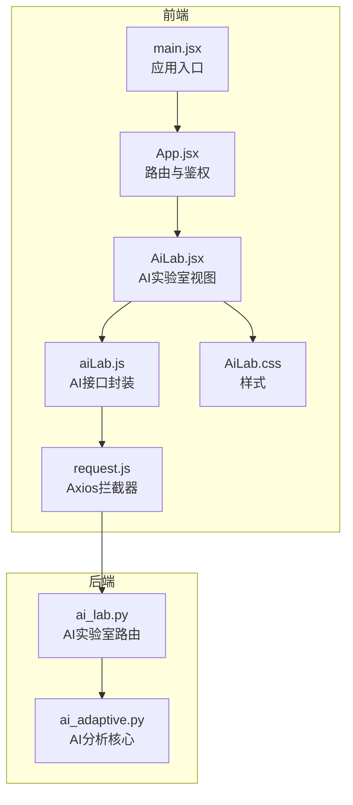
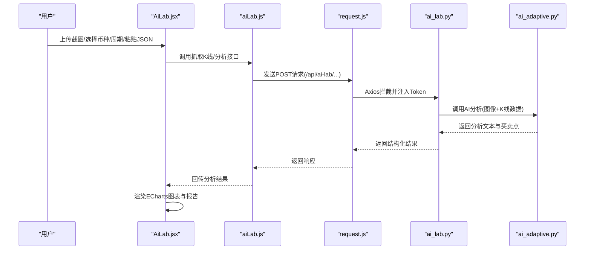
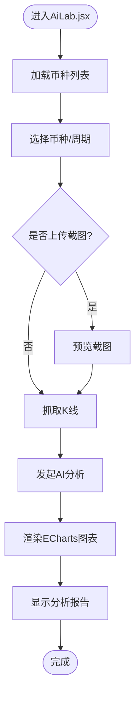
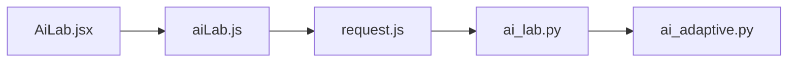

# AI实验室界面

<cite>
**本文引用的文件**
- [AiLab.jsx](file://backpack_quant_trading/frontend/src/views/AiLab.jsx)
- [AiLab.css](file://backpack_quant_trading/frontend/src/views/AiLab.css)
- [aiLab.js](file://backpack_quant_trading/frontend/src/api/aiLab.js)
- [request.js](file://backpack_quant_trading/frontend/src/api/request.js)
- [App.jsx](file://backpack_quant_trading/frontend/src/App.jsx)
- [main.jsx](file://backpack_quant_trading/frontend/src/main.jsx)
- [ai_lab.py](file://backpack_quant_trading/api/routers/ai_lab.py)
- [ai_adaptive.py](file://backpack_quant_trading/core/ai_adaptive.py)
- [FRONTEND_README.md](file://backpack_quant_trading/Frontend_readme.md)
</cite>

## 目录
1. [简介](#简介)
2. [项目结构](#项目结构)
3. [核心组件](#核心组件)
4. [架构总览](#架构总览)
5. [详细组件分析](#详细组件分析)
6. [依赖关系分析](#依赖关系分析)
7. [性能考虑](#性能考虑)
8. [故障排查指南](#故障排查指南)
9. [结论](#结论)
10. [附录](#附录)

## 简介
AI实验室界面是一个面向量化交易的数据驱动型分析平台，围绕“K线数据 + 图像识别”的双通道输入，通过后端AI模块进行综合分析，输出趋势判断、策略建议与交易参数，并以ECharts可视化展示买卖点标注。界面采用卡片式布局，支持：
- 输入数据：K线截图上传、币种与周期选择、原始OHLC JSON抓取、用户查询指令
- 分析流程：异步抓取K线、AI综合分析、可视化图表渲染
- 结果展示：K线图叠加买卖点标记、策略分析报告

## 项目结构
前端采用React + ECharts + Axios，路由通过React Router管理；后端采用FastAPI，AI分析由自研模块与外部大模型服务协同完成。

**图表来源**
- [main.jsx:1-17](file://backpack_quant_trading/frontend/src/main.jsx#L1-L17)
- [App.jsx:1-76](file://backpack_quant_trading/frontend/src/App.jsx#L1-L76)
- [AiLab.jsx:1-299](file://backpack_quant_trading/frontend/src/views/AiLab.jsx#L1-L299)
- [aiLab.js:1-7](file://backpack_quant_trading/frontend/src/api/aiLab.js#L1-L7)
- [request.js:1-33](file://backpack_quant_trading/frontend/src/api/request.js#L1-L33)
- [ai_lab.py:1-365](file://backpack_quant_trading/api/routers/ai_lab.py#L1-L365)
- [ai_adaptive.py:1-338](file://backpack_quant_trading/core/ai_adaptive.py#L1-L338)

**章节来源**
- [FRONTEND_README.md:1-78](file://backpack_quant_trading/Frontend_readme.md#L1-L78)
- [main.jsx:1-17](file://backpack_quant_trading/frontend/src/main.jsx#L1-L17)
- [App.jsx:1-76](file://backpack_quant_trading/frontend/src/App.jsx#L1-L76)

## 核心组件
- 视图组件：AiLab.jsx负责输入、抓取、分析与可视化
- API封装：aiLab.js提供抓取K线与AI分析的HTTP接口
- 请求拦截：request.js统一注入Token与401处理
- 后端路由：ai_lab.py提供抓取K线、AI分析与聊天接口
- AI核心：ai_adaptive.py封装提示词系统、视觉识别与推理调用

**章节来源**
- [AiLab.jsx:1-299](file://backpack_quant_trading/frontend/src/views/AiLab.jsx#L1-L299)
- [aiLab.js:1-7](file://backpack_quant_trading/frontend/src/api/aiLab.js#L1-L7)
- [request.js:1-33](file://backpack_quant_trading/frontend/src/api/request.js#L1-L33)
- [ai_lab.py:264-365](file://backpack_quant_trading/api/routers/ai_lab.py#L264-L365)
- [ai_adaptive.py:237-338](file://backpack_quant_trading/core/ai_adaptive.py#L237-L338)

## 架构总览
AI实验室的端到端流程如下：
- 前端输入：用户上传K线截图、选择币种与周期、手动粘贴OHLC JSON或抓取最新K线
- 异步请求：通过Axios封装发送POST请求到后端
- 后端处理：解析输入，调用AI分析模块，提取买卖点并返回结构化结果
- 可视化：前端使用ECharts渲染K线图，并在图上标注买卖点

**图表来源**
- [AiLab.jsx:68-120](file://backpack_quant_trading/frontend/src/views/AiLab.jsx#L68-L120)
- [aiLab.js:3-7](file://backpack_quant_trading/frontend/src/api/aiLab.js#L3-L7)
- [request.js:9-30](file://backpack_quant_trading/frontend/src/api/request.js#L9-L30)
- [ai_lab.py:289-365](file://backpack_quant_trading/api/routers/ai_lab.py#L289-L365)
- [ai_adaptive.py:252-338](file://backpack_quant_trading/core/ai_adaptive.py#L252-L338)

## 详细组件分析

### 视图组件：AiLab.jsx
- 输入区
  - 截图上传：FileReader读取Base64并预览
  - 币种与周期：币种列表动态加载，周期选项固定
  - K线抓取：调用后端接口获取最新K线数据
  - 用户查询：可编辑的分析指令
- 分析区
  - 异步分析：调用后端分析接口，解析返回的买卖点
  - 结果展示：策略分析报告文本
- 可视化区
  - ECharts渲染K线蜡烛图
  - 数据缩放：内置缩放与滑动缩放
  - 买卖点标注：根据分析结果在K线上标记

**图表来源**
- [AiLab.jsx:36-120](file://backpack_quant_trading/frontend/src/views/AiLab.jsx#L36-L120)
- [AiLab.jsx:122-208](file://backpack_quant_trading/frontend/src/views/AiLab.jsx#L122-L208)

**章节来源**
- [AiLab.jsx:1-299](file://backpack_quant_trading/frontend/src/views/AiLab.jsx#L1-L299)
- [AiLab.css:1-233](file://backpack_quant_trading/frontend/src/views/AiLab.css#L1-L233)

### API封装：aiLab.js
- 提供两个方法
  - 抓取K线：/ai-lab/fetch-kline
  - AI分析：/ai-lab/analyze（设置较长超时）
- 使用Axios封装，统一注入基础路径与超时

**章节来源**
- [aiLab.js:1-7](file://backpack_quant_trading/frontend/src/api/aiLab.js#L1-L7)
- [request.js:1-33](file://backpack_quant_trading/frontend/src/api/request.js#L1-L33)

### 后端路由：ai_lab.py
- /ai-lab/fetch-kline
  - 参数：symbol、interval、limit
  - 从币安批量抓取K线并返回
- /ai-lab/analyze
  - 参数：image_base64、kline_json、user_query、symbol、interval
  - 调用AI分析模块，解析买卖点并返回
- /ai-lab/chat
  - 支持自然语言K线分析，自动解析币种与周期

**章节来源**
- [ai_lab.py:264-365](file://backpack_quant_trading/api/routers/ai_lab.py#L264-L365)

### AI分析核心：ai_adaptive.py
- 提示词系统
  - 知识库：均线、布林带、RSI、KDJ、MACD、量价、ATR、斐波那契、云图、K线形态等
  - 交易员人设：强调主次、推理与自然语言
- 视觉识别
  - 使用Gemini 1.5 Flash识别K线图形特征
- 推理分析
  - 使用DeepSeek V3进行逻辑推演，输出标准化格式
- 输出结构
  - 分析文本、买卖点数组（用于前端图表标注）

**章节来源**
- [ai_adaptive.py:1-338](file://backpack_quant_trading/core/ai_adaptive.py#L1-L338)

### 路由与鉴权：App.jsx、main.jsx
- main.jsx：应用入口，包裹BrowserRouter
- App.jsx：定义路由与鉴权守卫，/ai-lab受登录保护

**章节来源**
- [main.jsx:1-17](file://backpack_quant_trading/frontend/src/main.jsx#L1-L17)
- [App.jsx:1-76](file://backpack_quant_trading/frontend/src/App.jsx#L1-L76)

## 依赖关系分析
- 前端依赖
  - React：组件化UI
  - ECharts：K线可视化
  - Axios：HTTP请求与拦截
  - 路由：React Router
- 后端依赖
  - FastAPI：路由与依赖注入
  - requests：调用外部大模型服务
  - 内部模块：币安K线抓取、AI分析核心

**图表来源**
- [AiLab.jsx:1-299](file://backpack_quant_trading/frontend/src/views/AiLab.jsx#L1-L299)
- [aiLab.js:1-7](file://backpack_quant_trading/frontend/src/api/aiLab.js#L1-L7)
- [request.js:1-33](file://backpack_quant_trading/frontend/src/api/request.js#L1-L33)
- [ai_lab.py:1-365](file://backpack_quant_trading/api/routers/ai_lab.py#L1-L365)
- [ai_adaptive.py:1-338](file://backpack_quant_trading/core/ai_adaptive.py#L1-L338)

**章节来源**
- [FRONTEND_README.md:1-78](file://backpack_quant_trading/Frontend_readme.md#L1-L78)

## 性能考虑
- 前端
  - ECharts渲染：仅在数据变化时更新，避免重复初始化
  - 数据缩放：限制可视窗口大小，提升交互性能
  - 超时设置：AI分析接口设置较长超时，避免误判
- 后端
  - 分批抓取K线：降低单次请求压力
  - 外部接口超时控制：防止阻塞
  - 日志记录：便于定位性能瓶颈

[本节为通用指导，无需特定文件引用]

## 故障排查指南
- 401未授权
  - 现象：跳转登录页
  - 原因：后端拦截器检测到无效Token
  - 处理：重新登录获取Token
- 抓取失败
  - 现象：弹窗提示错误
  - 原因：网络异常或币安API无数据
  - 处理：检查网络与参数，重试
- 分析失败
  - 现象：弹窗提示分析失败
  - 原因：外部模型接口异常或提示词解析失败
  - 处理：检查DEEPSEEK_API_KEY/GEMINI_API_KEY配置
- 图表空白
  - 现象：K线图占位
  - 原因：未抓取K线或数据为空
  - 处理：先抓取K线，再发起分析

**章节来源**
- [request.js:20-30](file://backpack_quant_trading/frontend/src/api/request.js#L20-L30)
- [ai_lab.py:289-365](file://backpack_quant_trading/api/routers/ai_lab.py#L289-L365)
- [ai_adaptive.py:276-338](file://backpack_quant_trading/core/ai_adaptive.py#L276-L338)

## 结论
AI实验室界面通过“图像识别 + 数据驱动”的双通道分析，结合ECharts可视化与标准化输出，形成从输入到可视化的完整闭环。前端以卡片化布局提升可用性，后端以模块化设计保证扩展性。建议后续在前端增加参数调优界面与实验结果对比图表，进一步完善实验管理能力。

[本节为总结性内容，无需特定文件引用]

## 附录
- 启动方式与开发模式参见前端说明文档
- 主要页面包括：/ai-lab、/trading、/dashboard等

**章节来源**
- [FRONTEND_README.md:26-78](file://backpack_quant_trading/Frontend_readme.md#L26-L78)