# 交易控制界面

<cite>
**本文档引用的文件**
- [Trading.jsx](file://backpack_quant_trading/frontend/src/views/Trading.jsx)
- [Trading.css](file://backpack_quant_trading/frontend/src/views/Trading.css)
- [TradingPage.tsx](file://backpack_quant_trading/frontend/src_trading/app/components/TradingPage.tsx)
- [TradingViewWidget.jsx](file://backpack_quant_trading/frontend/src/components/TradingViewWidget.jsx)
- [trading.js](file://backpack_quant_trading/frontend/src/api/trading.js)
- [trading.ts](file://backpack_quant_trading/frontend/src_trading/app/api/trading.ts)
- [request.js](file://backpack_quant_trading/frontend/src/api/request.js)
- [trading.py](file://backpack_quant_trading/api/routers/trading.py)
- [webhook_service.py](file://backpack_quant_trading/webhook_service.py)
- [strategy.py](file://backpack_quant_trading/api/routers/strategy.py)
- [StrategyDetail.jsx](file://backpack_quant_trading/frontend/src/views/StrategyDetail.jsx)
- [StrategyMatrixAlt.jsx](file://backpack_quant_trading/frontend/src/views/StrategyMatrixAlt.jsx)
- [strategy.js](file://backpack_quant_trading/frontend/src/api/strategy.js)
- [StrategyDetail.css](file://backpack_quant_trading/frontend/src/views/StrategyDetail.css)
- [StrategyCardMatrix.jsx](file://backpack_quant_trading/frontend/src/components/StrategyCardMatrix.jsx)
- [EthOnlyStrategy.jsx](file://backpack_quant_trading/frontend/src/views/EthOnlyStrategy.jsx)
- [Nas100TrendStrategy.jsx](file://backpack_quant_trading/frontend/src/views/Nas100TrendStrategy.jsx)
- [PaxgTrendStrategy.jsx](file://backpack_quant_trading/frontend/src/views/PaxgTrendStrategy.jsx)
</cite>

## 更新摘要
**所做更改**
- 新增 TradingView 图表组件集成章节
- 更新交易界面布局设计，增加图表可视化功能
- 添加嵌入式图表组件的技术实现细节
- 扩展实时监控功能，包含图表数据更新机制

## 目录
1. [简介](#简介)
2. [项目结构](#项目结构)
3. [核心组件](#核心组件)
4. [架构概览](#架构概览)
5. [详细组件分析](#详细组件分析)
6. [TradingView 图表组件集成](#tradingview-图表组件集成)
7. [策略管理功能](#策略管理功能)
8. [依赖关系分析](#依赖关系分析)
9. [性能考虑](#性能考虑)
10. [故障排除指南](#故障排除指南)
11. [结论](#结论)

## 简介

交易控制界面是量化交易系统的核心用户界面，提供了完整的交易生命周期管理功能。该界面支持多平台交易（Backpack、Deepcoin、Ostium、Hyperliquid），集成了实时监控、风险控制和交易确认等关键功能。**更新** 新增了 TradingView 图表组件，提供嵌入式图表可视化功能，增强了交易决策支持和市场分析能力。

## 项目结构

交易控制界面采用前后端分离架构，主要包含以下组件：

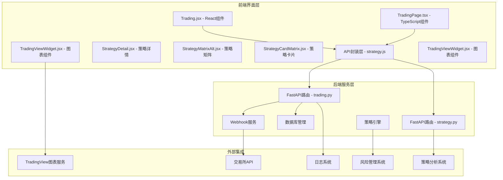

**图表来源**
- [Trading.jsx:1-499](file://backpack_quant_trading/frontend/src/views/Trading.jsx#L1-L499)
- [TradingPage.tsx:1-766](file://backpack_quant_trading/frontend/src_trading/app/components/TradingPage.tsx#L1-L766)
- [TradingViewWidget.jsx:1-44](file://backpack_quant_trading/frontend/src/components/TradingViewWidget.jsx#L1-L44)
- [strategy.py:1-549](file://backpack_quant_trading/api/routers/strategy.py#L1-L549)

**章节来源**
- [Trading.jsx:1-499](file://backpack_quant_trading/frontend/src/views/Trading.jsx#L1-L499)
- [TradingPage.tsx:1-766](file://backpack_quant_trading/frontend/src_trading/app/components/TradingPage.tsx#L1-L766)
- [TradingViewWidget.jsx:1-44](file://backpack_quant_trading/frontend/src/components/TradingViewWidget.jsx#L1-L44)
- [strategy.py:1-549](file://backpack_quant_trading/api/routers/strategy.py#L1-L549)

## 核心组件

### 1. 交易界面布局设计

交易界面采用响应式设计，包含五个主要区域：

- **统计卡片区**：显示运行中策略数量、总资产、累计收益和胜率
- **图表可视化区**：集成 TradingView 高级图表，提供实时市场数据可视化
- **策略实例管理区**：展示和管理所有运行中的量化交易策略
- **系统日志区**：实时显示系统运行日志
- **配置弹窗**：启动新策略时的参数配置界面

### 2. 交易对选择机制

系统支持多种交易对格式解析：
- 简写格式：ETH、BTC、SOL
- 完整格式：ETH_USDC_PERP、ETH-USDT-SWAP、ETH/USDC
- 平台特定格式转换

### 3. 下单操作流程

下单操作包含完整的验证和确认流程：
- 平台和策略验证
- API密钥或私钥验证
- 交易参数验证
- 实时确认对话框
- 异步启动执行

**章节来源**
- [Trading.jsx:14-43](file://backpack_quant_trading/frontend/src/views/Trading.jsx#L14-L43)
- [Trading.jsx:103-162](file://backpack_quant_trading/frontend/src/views/Trading.jsx#L103-L162)
- [trading.py:53-86](file://backpack_quant_trading/api/routers/trading.py#L53-L86)

## 架构概览

交易控制界面采用分层架构设计，确保了良好的可维护性和扩展性：

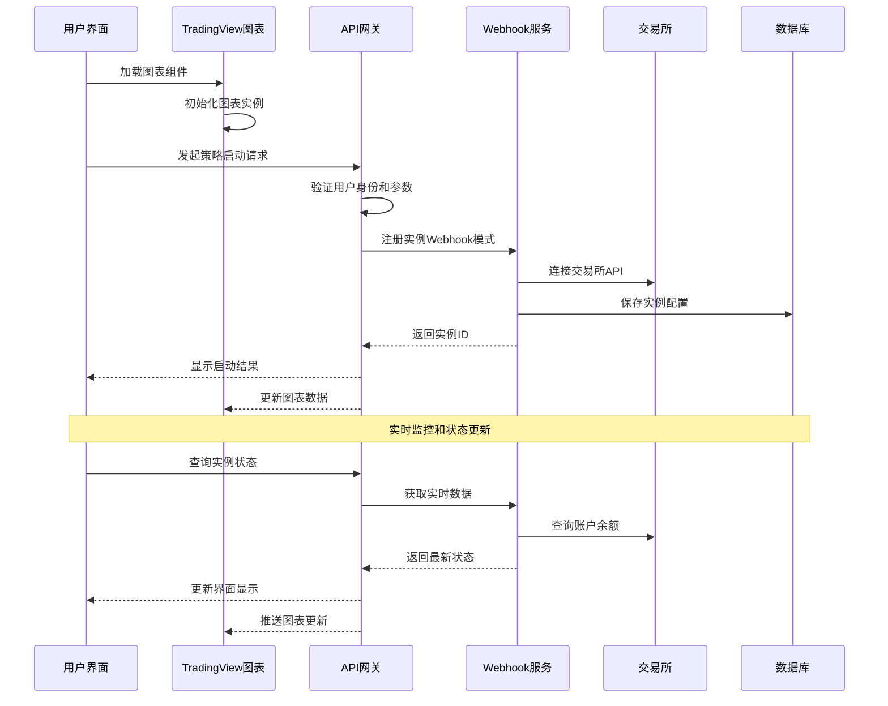

**图表来源**
- [TradingViewWidget.jsx:1-44](file://backpack_quant_trading/frontend/src/components/TradingViewWidget.jsx#L1-L44)
- [trading.js:1-14](file://backpack_quant_trading/frontend/src/api/trading.js#L1-L14)
- [trading.py:322-450](file://backpack_quant_trading/api/routers/trading.py#L322-L450)
- [webhook_service.py:83-200](file://backpack_quant_trading/webhook_service.py#L83-L200)

## 详细组件分析

### 1. 交易参数配置组件

#### 平台选择组件
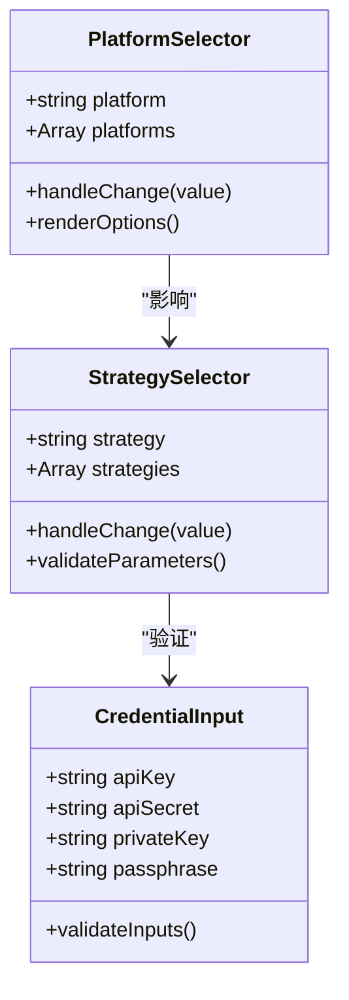

**图表来源**
- [Trading.jsx:31-43](file://backpack_quant_trading/frontend/src/views/Trading.jsx#L31-L43)
- [Trading.jsx:47-58](file://backpack_quant_trading/frontend/src/views/Trading.jsx#L47-L58)

#### 交易参数输入组件
- **交易对输入**：支持多种格式自动转换
- **保证金输入**：数值验证和范围限制
- **杠杆倍数**：1-100的数值范围
- **止盈止损**：根据策略类型动态调整

**章节来源**
- [Trading.jsx:422-481](file://backpack_quant_trading/frontend/src/views/Trading.jsx#L422-L481)
- [TradingPage.tsx:610-676](file://backpack_quant_trading/frontend/src_trading/app/components/TradingPage.tsx#L610-L676)

### 2. 实时监控组件

#### 策略实例卡片组件
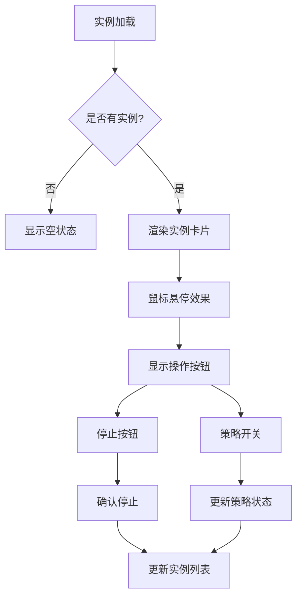

**图表来源**
- [Trading.jsx:266-302](file://backpack_quant_trading/frontend/src/views/Trading.jsx#L266-L302)
- [TradingPage.tsx:384-461](file://backpack_quant_trading/frontend/src_trading/app/components/TradingPage.tsx#L384-L461)

#### 日志监控组件
- **实时日志流**：每10秒刷新一次
- **多源日志聚合**：Webhook、实时交易、策略日志
- **时间戳排序**：按时间顺序显示最新日志
- **滚动显示**：支持垂直滚动查看历史

**章节来源**
- [Trading.jsx:67-72](file://backpack_quant_trading/frontend/src/views/Trading.jsx#L67-L72)
- [TradingPage.tsx:466-490](file://backpack_quant_trading/frontend/src_trading/app/components/TradingPage.tsx#L466-L490)

### 3. 交易确认流程

#### 启动确认流程
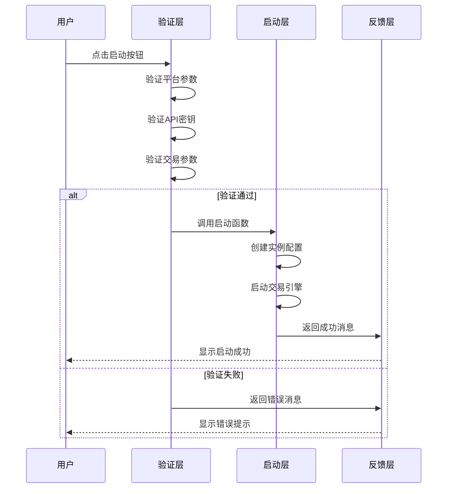

**图表来源**
- [Trading.jsx:103-162](file://backpack_quant_trading/frontend/src/views/Trading.jsx#L103-L162)
- [trading.js:3-7](file://backpack_quant_trading/frontend/src/api/trading.js#L3-L7)

#### 停止确认流程
- **单实例停止**：直接调用停止接口
- **批量停止**：支持多个实例同时停止
- **状态确认**：停止后立即刷新实例列表

**章节来源**
- [Trading.jsx:164-172](file://backpack_quant_trading/frontend/src/views/Trading.jsx#L164-L172)
- [trading.js:6](file://backpack_quant_trading/frontend/src/api/trading.js#L6)

### 4. 数据展示组件

#### 统计卡片组件
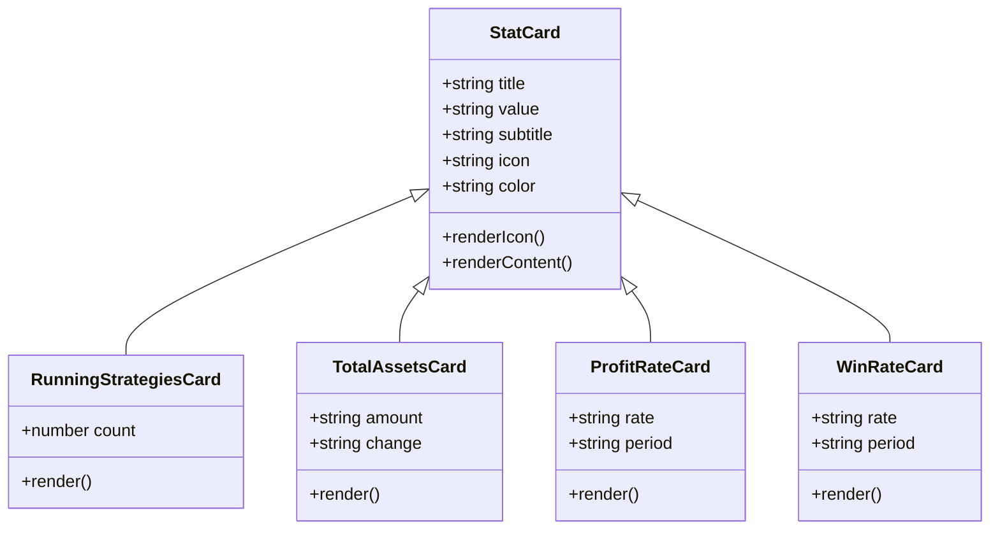

**图表来源**
- [Trading.jsx:195-228](file://backpack_quant_trading/frontend/src/views/Trading.jsx#L195-L228)
- [TradingPage.tsx:701-736](file://backpack_quant_trading/frontend/src_trading/app/components/TradingPage.tsx#L701-L736)

#### 实时价格更新机制
- **轮询更新**：实例列表每5秒刷新一次
- **日志更新**：日志每10秒刷新一次
- **状态同步**：WebSocket连接保持实时状态同步
- **错误重试**：网络异常时自动重试机制

**章节来源**
- [Trading.jsx:81-101](file://backpack_quant_trading/frontend/src/views/Trading.jsx#L81-L101)
- [TradingPage.tsx:113-130](file://backpack_quant_trading/frontend/src_trading/app/components/TradingPage.tsx#L113-L130)

## TradingView 图表组件集成

### 1. TradingView 图表组件概述

新增的 TradingView 图表组件为交易控制界面提供了强大的可视化分析能力：

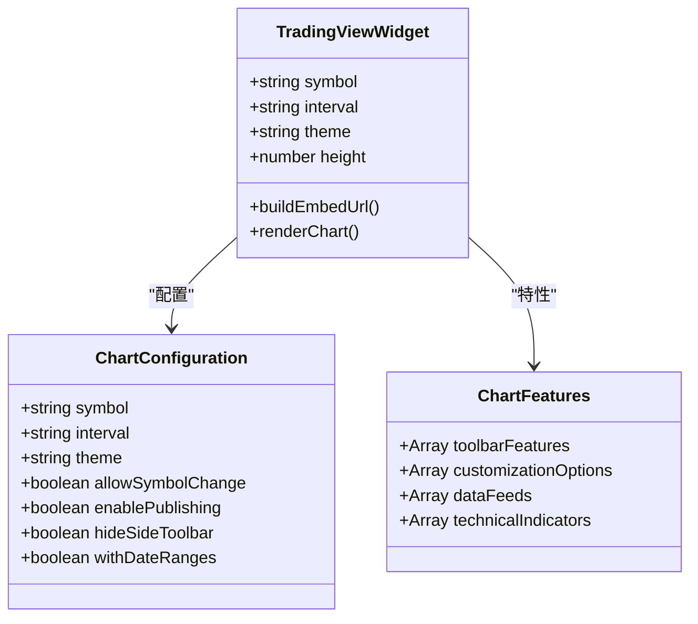

**图表来源**
- [TradingViewWidget.jsx:1-44](file://backpack_quant_trading/frontend/src/components/TradingViewWidget.jsx#L1-L44)

### 2. 图表组件技术实现

#### 嵌入式图表架构
- **iframe 嵌入**：使用 `https://www.tradingview.com/widgetembed/` 主域名
- **参数化配置**：支持符号、时间框架、主题等动态参数
- **响应式设计**：自适应容器宽度，固定高度配置
- **跨域支持**：直接访问 TradingView CDN，无需代理

#### 图表配置选项
- **交易对支持**：支持 NASDAQ:CRCL 等美国股票代码
- **时间框架**：日线、周线、月线等多种时间维度
- **主题模式**：明亮和深色主题切换
- **功能定制**：工具栏、日期范围、导出功能

**章节来源**
- [TradingViewWidget.jsx:7-41](file://backpack_quant_trading/frontend/src/components/TradingViewWidget.jsx#L7-L41)

### 3. 图表集成架构

#### 前端集成模式
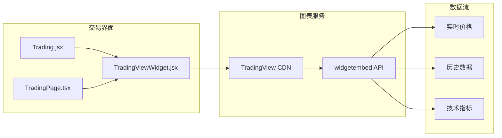

**图表来源**
- [Trading.jsx:297-772](file://backpack_quant_trading/frontend/src/views/Trading.jsx#L297-L772)
- [TradingPage.tsx:63-699](file://backpack_quant_trading/frontend/src_trading/app/components/TradingPage.tsx#L63-L699)
- [TradingViewWidget.jsx:13-39](file://backpack_quant_trading/frontend/src/components/TradingViewWidget.jsx#L13-L39)

#### 图表更新机制
- **实时数据推送**：通过 WebSocket 实时更新图表数据
- **定时刷新**：每5秒自动刷新图表显示
- **用户交互响应**：支持用户手动切换交易对和时间框架
- **错误处理**：网络异常时的降级显示和重试机制

**章节来源**
- [Trading.jsx:116-136](file://backpack_quant_trading/frontend/src/views/Trading.jsx#L116-L136)
- [TradingPage.tsx:113-130](file://backpack_quant_trading/frontend/src_trading/app/components/TradingPage.tsx#L113-L130)

## 策略管理功能

### 1. 策略矩阵展示

新增的策略矩阵功能提供了全面的策略概览和性能指标展示：

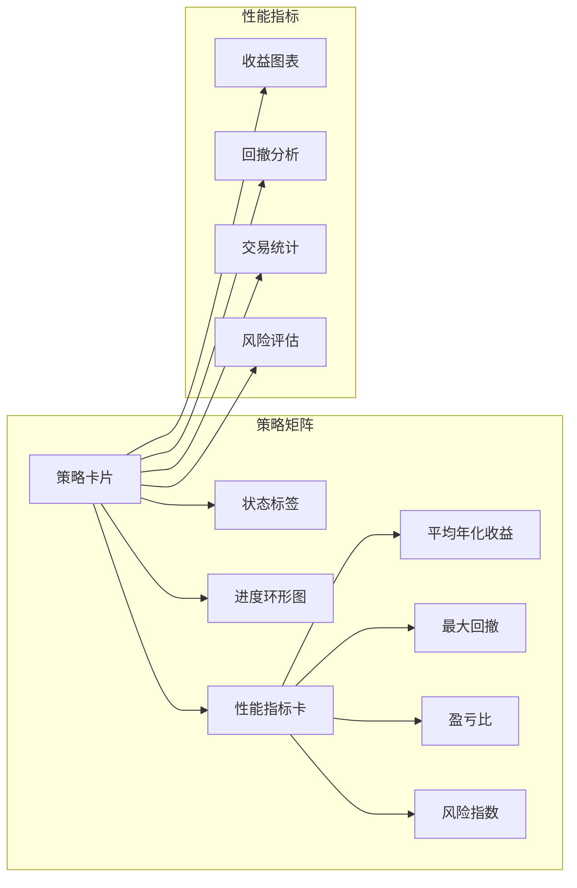

**图表来源**
- [StrategyMatrixAlt.jsx:1-268](file://backpack_quant_trading/frontend/src/views/StrategyMatrixAlt.jsx#L1-L268)
- [StrategyCardMatrix.jsx:1-126](file://backpack_quant_trading/frontend/src/components/StrategyCardMatrix.jsx#L1-L126)

### 2. 策略详情分析

每个策略都提供详细的历史表现分析：

- **收益曲线分析**：展示策略的累计收益和基准对比
- **K线图表**：显示策略交易点位和市场走势
- **交易明细**：详细的入场出场记录和收益分析
- **统计指标**：胜率、盈亏比、最大回撤等关键指标

**章节来源**
- [StrategyDetail.jsx:1-800](file://backpack_quant_trading/frontend/src/views/StrategyDetail.jsx#L1-L800)
- [StrategyDetail.css:1-416](file://backpack_quant_trading/frontend/src/views/StrategyDetail.css#L1-L416)

### 3. 实时策略状态监控

系统支持对运行中策略的实时监控和手动控制：

- **状态实时更新**：策略运行状态、账户余额、收益情况
- **手动控制**：支持暂停、重启、停止等操作
- **性能指标**：实时显示关键风险指标和收益指标
- **告警机制**：异常情况及时通知和处理

**章节来源**
- [Trading.jsx:85-90](file://backpack_quant_trading/frontend/src/views/Trading.jsx#L85-L90)
- [strategy.js:1-101](file://backpack_quant_trading/frontend/src/api/strategy.js#L1-L101)

### 4. 多策略支持

系统支持多种类型的量化策略：

- **加密货币趋势策略**：ETH、HYPE等主流加密货币
- **大宗商品波动策略**：黄金（PAXG）波动率捕捉
- **股指趋势策略**：纳指等主要股指趋势跟踪
- **自适应策略**：根据市场条件自动调整参数

**章节来源**
- [EthOnlyStrategy.jsx:1-24](file://backpack_quant_trading/frontend/src/views/EthOnlyStrategy.jsx#L1-L24)
- [PaxgTrendStrategy.jsx:1-24](file://backpack_quant_trading/frontend/src/views/PaxgTrendStrategy.jsx#L1-L24)
- [Nas100TrendStrategy.jsx:1-23](file://backpack_quant_trading/frontend/src/views/Nas100TrendStrategy.jsx#L1-L23)

## 依赖关系分析

### 1. 前端依赖关系

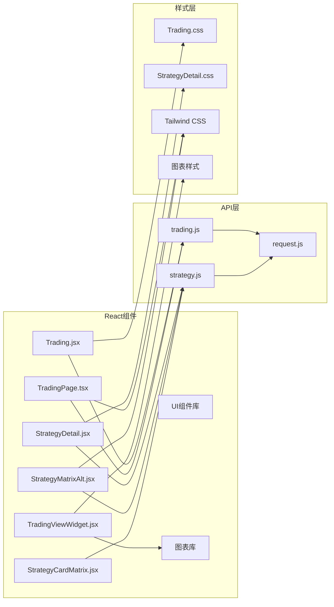

**图表来源**
- [Trading.jsx:1-12](file://backpack_quant_trading/frontend/src/views/Trading.jsx#L1-L12)
- [TradingPage.tsx:1-10](file://backpack_quant_trading/frontend/src_trading/app/components/TradingPage.tsx#L1-L10)
- [TradingViewWidget.jsx:1-44](file://backpack_quant_trading/frontend/src/components/TradingViewWidget.jsx#L1-L44)

### 2. 后端依赖关系

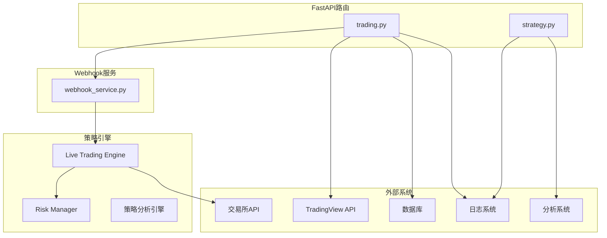

**图表来源**
- [trading.py:15-23](file://backpack_quant_trading/api/routers/trading.py#L15-L23)
- [webhook_service.py:26-32](file://backpack_quant_trading/webhook_service.py#L26-L32)

**章节来源**
- [trading.js:1-14](file://backpack_quant_trading/frontend/src/api/trading.js#L1-L14)
- [request.js:1-33](file://backpack_quant_trading/frontend/src/api/request.js#L1-L33)

## 性能考虑

### 1. 前端性能优化

- **虚拟滚动**：大量实例时使用虚拟滚动技术
- **懒加载**：弹窗内容按需加载
- **防抖处理**：输入验证使用防抖机制
- **缓存策略**：API响应结果缓存
- **图表优化**：ECharts图表按需渲染
- **组件记忆化**：使用 memo 优化渲染性能

### 2. 后端性能优化

- **异步处理**：Webhook服务使用异步事件循环
- **连接池**：交易所API连接复用
- **内存管理**：引擎实例生命周期管理
- **并发控制**：多实例并发执行限制
- **数据库优化**：策略数据查询优化

### 3. 网络性能优化

- **长连接**：WebSocket保持实时通信
- **压缩传输**：HTTP响应压缩
- **CDN加速**：静态资源CDN分发
- **缓存策略**：API接口缓存
- **图表CDN**：TradingView 图表通过官方CDN加速

## 故障排除指南

### 1. 常见问题及解决方案

#### 登录认证问题
- **症状**：页面重定向到登录页
- **原因**：Token过期或无效
- **解决**：重新登录获取新Token

#### API调用失败
- **症状**：启动失败或停止失败
- **原因**：网络连接或权限问题
- **解决**：检查网络连接和API密钥

#### 实时数据延迟
- **症状**：实例状态更新延迟
- **原因**：轮询间隔设置
- **解决**：调整轮询频率或使用WebSocket

#### 交易对解析错误
- **症状**：交易对格式不被识别
- **原因**：格式不符合规范
- **解决**：使用标准格式或平台特定格式

#### 策略数据加载失败
- **症状**：策略详情无法显示
- **原因**：数据库连接或数据格式问题
- **解决**：检查数据库连接和数据完整性

#### TradingView 图表加载失败
- **症状**：图表无法显示或加载缓慢
- **原因**：网络连接或CDN访问问题
- **解决**：检查网络连接，尝试刷新页面

**章节来源**
- [request.js:20-29](file://backpack_quant_trading/frontend/src/api/request.js#L20-L29)
- [trading.js:10-13](file://backpack_quant_trading/frontend/src/api/trading.js#L10-L13)
- [TradingViewWidget.jsx:15-29](file://backpack_quant_trading/frontend/src/components/TradingViewWidget.jsx#L15-L29)

### 2. 错误处理机制

#### 前端错误处理
- **全局拦截器**：统一处理HTTP错误
- **用户友好提示**：友好的错误消息显示
- **自动重试**：网络错误自动重试
- **状态恢复**：错误后的状态恢复
- **图表降级**：TradingView 加载失败时的降级显示

#### 后端错误处理
- **异常捕获**：全面的异常捕获机制
- **日志记录**：详细的错误日志
- **优雅降级**：部分功能降级处理
- **健康检查**：服务状态监控

**章节来源**
- [Trading.jsx:157-161](file://backpack_quant_trading/frontend/src/views/Trading.jsx#L157-L161)
- [trading.py:111-114](file://backpack_quant_trading/api/routers/trading.py#L111-L114)

## 结论

交易控制界面是一个功能完整、设计合理的量化交易管理系统。**更新** 新增的 TradingView 图表组件显著增强了系统的可视化分析能力，为用户提供了一站式的交易决策支持。

该界面不仅支持传统的交易控制功能，还提供了丰富的策略分析工具、实时监控能力和手动控制机制。通过模块化的架构设计和清晰的组件分离，系统具有良好的可维护性和扩展性。

新增的 TradingView 图表组件通过 iframe 嵌入方式实现了与 TradingView 服务的无缝集成，支持多种交易对、时间框架和主题配置。图表组件的实时数据更新机制与现有的策略监控系统完美融合，为用户提供了全面的市场洞察和交易辅助。

通过持续的优化和改进，该界面将继续为量化交易提供可靠的技术支撑，帮助用户在复杂的市场环境中做出更明智的交易决策。