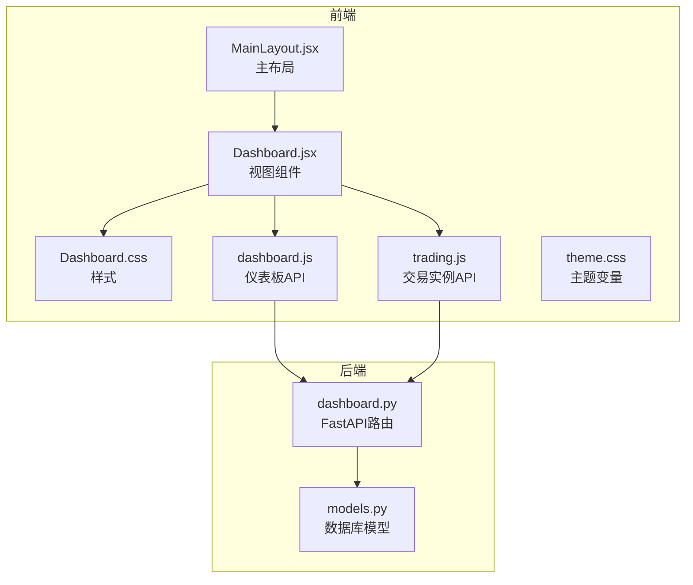
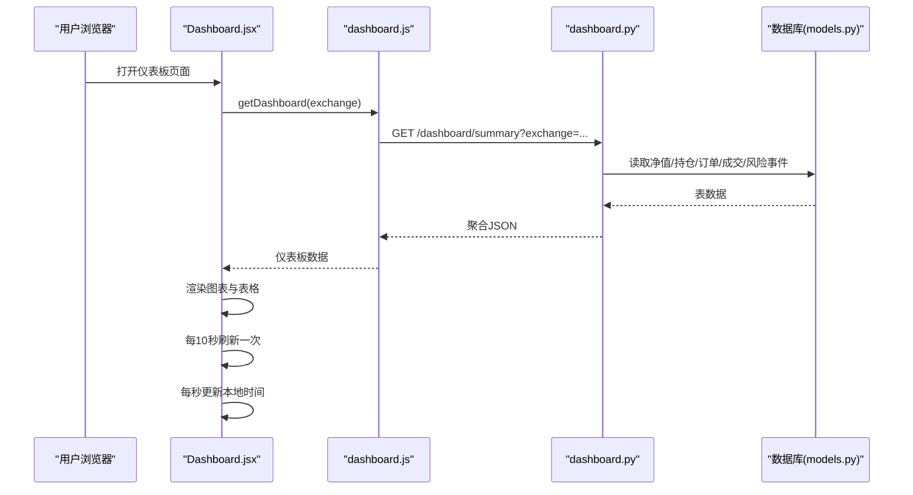
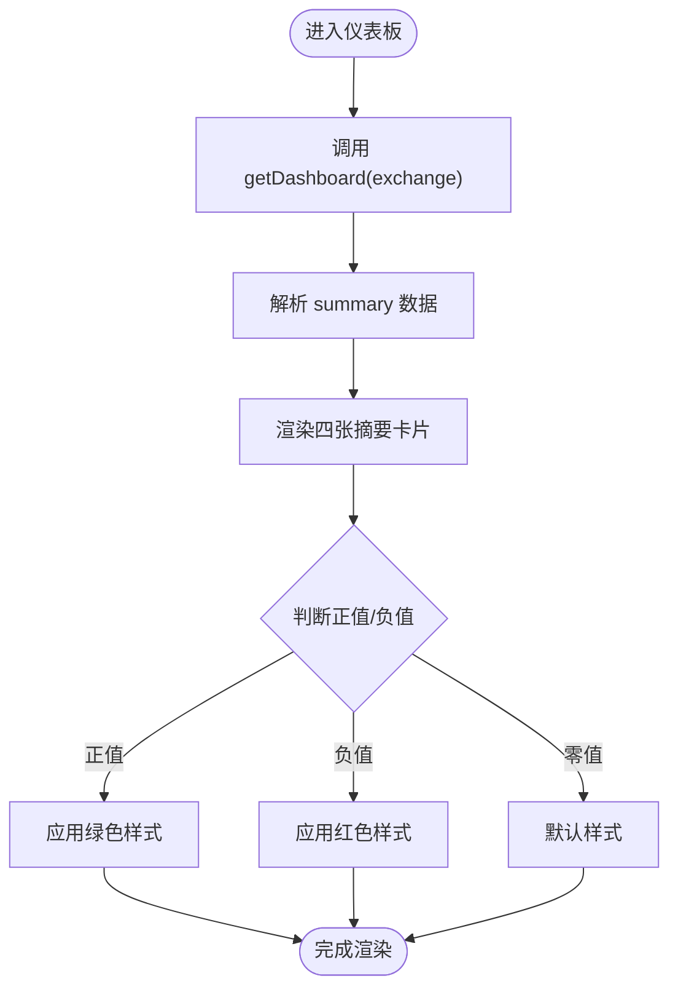
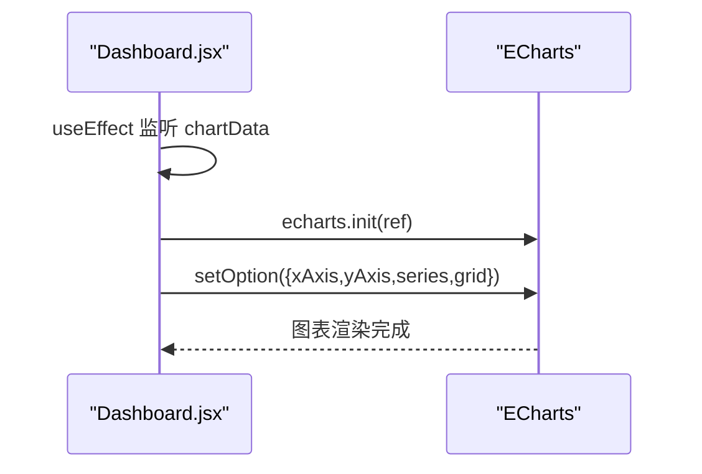
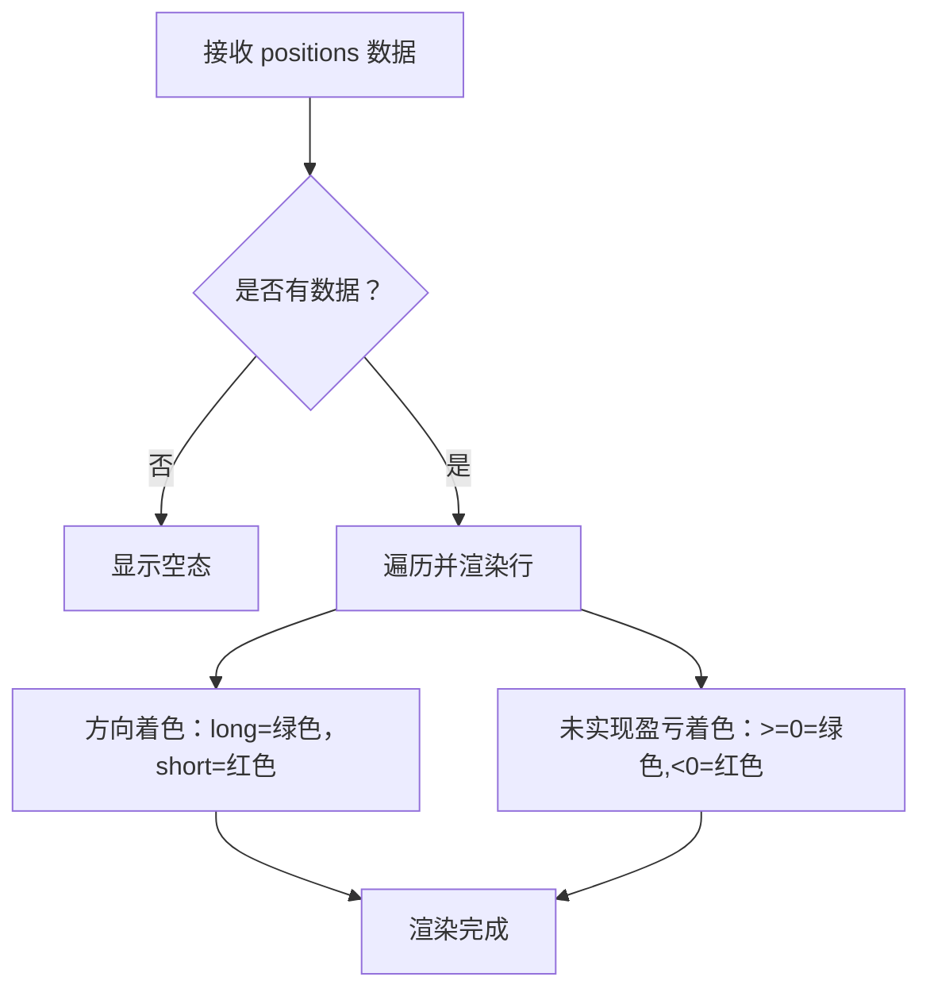
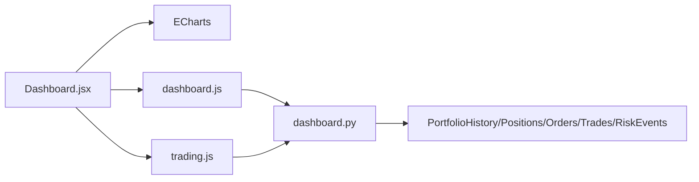

# 仪表板界面

<cite>
**本文档引用的文件**
- [Dashboard.jsx](file://backpack_quant_trading/frontend/src/views/Dashboard.jsx)
- [Dashboard.css](file://backpack_quant_trading/frontend/src/views/Dashboard.css)
- [dashboard.js](file://backpack_quant_trading/frontend/src/api/dashboard.js)
- [trading.js](file://backpack_quant_trading/frontend/src/api/trading.js)
- [dashboard.py](file://backpack_quant_trading/api/routers/dashboard.py)
- [models.py](file://backpack_quant_trading/database/models.py)
- [App.jsx](file://backpack_quant_trading/frontend/src/App.jsx)
- [MainLayout.jsx](file://backpack_quant_trading/frontend/src/layouts/MainLayout.jsx)
- [theme.css](file://backpack_quant_trading/frontend/src/assets/theme.css)
</cite>

## 目录
1. [简介](#简介)
2. [项目结构](#项目结构)
3. [核心组件](#核心组件)
4. [架构总览](#架构总览)
5. [详细组件分析](#详细组件分析)
6. [依赖关系分析](#依赖关系分析)
7. [性能考虑](#性能考虑)
8. [故障排除指南](#故障排除指南)
9. [结论](#结论)

## 简介
本文件面向量化交易系统的仪表板界面，提供从布局设计、关键指标展示、实时图表到数据表格的完整说明。重点涵盖：
- 总资产价值、可用现金、当日盈亏、当日收益率等核心指标的显示逻辑与样式设计
- ECharts 图表组件的初始化、配置与数据渲染流程
- 活动仓位、活动订单、成交历史、风险事件等数据表格的结构与样式
- 实时数据刷新机制、颜色编码规则与状态指示器
- 组件状态管理、生命周期钩子与错误处理实现细节

## 项目结构
仪表板位于前端 React 应用中，采用模块化组织：
- 视图层：Dashboard.jsx 负责整体布局与数据展示
- 样式层：Dashboard.css 提供卡片、表格、颜色编码等样式
- API 层：dashboard.js、trading.js 封装请求接口
- 后端路由：dashboard.py 提供仪表板聚合数据接口
- 数据模型：models.py 定义数据库表结构与枚举类型

**图表来源**
- [Dashboard.jsx:1-311](file://backpack_quant_trading/frontend/src/views/Dashboard.jsx#L1-L311)
- [Dashboard.css:1-397](file://backpack_quant_trading/frontend/src/views/Dashboard.css#L1-L397)
- [dashboard.js:1-5](file://backpack_quant_trading/frontend/src/api/dashboard.js#L1-L5)
- [trading.js:1-24](file://backpack_quant_trading/frontend/src/api/trading.js#L1-L24)
- [dashboard.py:1-131](file://backpack_quant_trading/api/routers/dashboard.py#L1-L131)
- [models.py:1-200](file://backpack_quant_trading/database/models.py#L1-L200)
- [MainLayout.jsx:1-245](file://backpack_quant_trading/frontend/src/layouts/MainLayout.jsx#L1-L245)
- [theme.css:1-112](file://backpack_quant_trading/frontend/src/assets/theme.css#L1-L112)

**章节来源**
- [Dashboard.jsx:1-311](file://backpack_quant_trading/frontend/src/views/Dashboard.jsx#L1-L311)
- [Dashboard.css:1-397](file://backpack_quant_trading/frontend/src/views/Dashboard.css#L1-L397)
- [MainLayout.jsx:1-245](file://backpack_quant_trading/frontend/src/layouts/MainLayout.jsx#L1-L245)

## 核心组件
仪表板由以下核心组件构成：
- 摘要卡片网格：展示总资产价值、可用现金、当日盈亏、当日收益率四类关键指标
- 组合净值曲线图：基于 ECharts 的折线图，展示净值随时间变化
- 数据表格区：活动仓位、活动订单、成交历史、风险事件四个表格

关键特性：
- 实时刷新：每 10 秒轮询后端接口获取最新数据
- 时间显示：右上角显示本地时间，每秒更新
- 颜色编码：正负收益分别以绿色/红色标识，状态标签体现运行状态
- 响应式布局：卡片网格与表格自适应不同屏幕尺寸

**章节来源**
- [Dashboard.jsx:14-311](file://backpack_quant_trading/frontend/src/views/Dashboard.jsx#L14-L311)
- [Dashboard.css:68-397](file://backpack_quant_trading/frontend/src/views/Dashboard.css#L68-L397)

## 架构总览
仪表板采用前后端分离架构，数据流如下：
- 前端通过 dashboard.js 请求 /dashboard/summary 接口
- 后端 dashboard.py 从数据库读取 portfolio_history、positions、orders、trades、risk_events 表
- 返回聚合数据给前端，前端在 useEffect 中渲染图表与表格
- 前端每 10 秒执行一次刷新，同时每秒更新本地时间

**图表来源**
- [Dashboard.jsx:30-81](file://backpack_quant_trading/frontend/src/views/Dashboard.jsx#L30-L81)
- [dashboard.js:1-5](file://backpack_quant_trading/frontend/src/api/dashboard.js#L1-L5)
- [dashboard.py:26-131](file://backpack_quant_trading/api/routers/dashboard.py#L26-L131)
- [models.py:65-200](file://backpack_quant_trading/database/models.py#L65-L200)

**章节来源**
- [App.jsx:34-76](file://backpack_quant_trading/frontend/src/App.jsx#L34-L76)
- [MainLayout.jsx:47-65](file://backpack_quant_trading/frontend/src/layouts/MainLayout.jsx#L47-L65)

## 详细组件分析

### 摘要卡片网格（总资产、可用现金、当日盈亏、当日收益率）
- 数据来源：后端返回 summary 对象中的 portfolio_value、cash_balance、daily_pnl、daily_return
- 显示逻辑：
  - 总资产价值：美元前缀 + 数字格式化（千分位），主标题加粗
  - 可用现金：CASH 前缀 + 数字格式化
  - 当日盈亏：P&L 前缀 + 正负号 + 数字格式化；正数绿色，负数红色
  - 当日收益率：RETURN 前缀 + 百分比格式化；正数绿色，负数红色
- 样式设计：主卡突出边框与阴影，普通卡统一圆角与边框；数值字体采用等宽字体增强可读性

**图表来源**
- [Dashboard.jsx:16-28](file://backpack_quant_trading/frontend/src/views/Dashboard.jsx#L16-L28)
- [Dashboard.jsx:83-125](file://backpack_quant_trading/frontend/src/views/Dashboard.jsx#L83-L125)
- [Dashboard.css:115-121](file://backpack_quant_trading/frontend/src/views/Dashboard.css#L115-L121)

**章节来源**
- [Dashboard.jsx:83-125](file://backpack_quant_trading/frontend/src/views/Dashboard.jsx#L83-L125)
- [Dashboard.css:75-127](file://backpack_quant_trading/frontend/src/views/Dashboard.css#L75-L127)

### ECharts 组合净值曲线图
- 初始化：在 useEffect 中监听 chartData 变化，当有数据时初始化 ECharts 实例
- 配置要点：
  - X 轴：类别轴，数据来自 timestamp（截取到分钟）
  - Y 轴：数值轴，净值序列
  - 折线：宽度 3，颜色为黄色系；填充区域半透明
  - 内边距：左 50，右 20，上 20，下 30
- 数据渲染：将后端返回的 chart 数组映射为时间戳与净值数组

**图表来源**
- [Dashboard.jsx:42-62](file://backpack_quant_trading/frontend/src/views/Dashboard.jsx#L42-L62)
- [Dashboard.jsx:45-57](file://backpack_quant_trading/frontend/src/views/Dashboard.jsx#L45-L57)

**章节来源**
- [Dashboard.jsx:42-62](file://backpack_quant_trading/frontend/src/views/Dashboard.jsx#L42-L62)
- [Dashboard.css:129-183](file://backpack_quant_trading/frontend/src/views/Dashboard.css#L129-L183)

### 数据表格区

#### 活动仓位表
- 表头：交易对、方向、数量、入场价、当前价、未实现盈亏
- 渲染逻辑：遍历 positions 列表，方向以 long/short 分别着色；未实现盈亏按正负着色
- 空态：无活跃仓位时显示"无活跃持仓"

**图表来源**
- [Dashboard.jsx:147-182](file://backpack_quant_trading/frontend/src/views/Dashboard.jsx#L147-L182)
- [Dashboard.jsx:160-177](file://backpack_quant_trading/frontend/src/views/Dashboard.jsx#L160-L177)

**章节来源**
- [Dashboard.jsx:141-182](file://backpack_quant_trading/frontend/src/views/Dashboard.jsx#L141-L182)
- [Dashboard.css:219-247](file://backpack_quant_trading/frontend/src/views/Dashboard.css#L219-L247)

#### 活动订单表
- 表头：交易对、类型、方向、价格、数量、状态
- 渲染逻辑：遍历 orders 列表；市价单特殊处理显示"市价"；方向与状态分别着色
- 空态：无活跃订单时显示"无活跃订单"

**章节来源**
- [Dashboard.jsx:185-228](file://backpack_quant_trading/frontend/src/views/Dashboard.jsx#L185-L228)
- [Dashboard.css:219-247](file://backpack_quant_trading/frontend/src/views/Dashboard.css#L219-L247)

#### 成交历史表
- 表头：时间、交易对、方向、价格、成交额、盈亏
- 渲染逻辑：遍历 trades 列表；时间格式化为 HH:MM:SS；方向以 long/buy 统一为绿色，short 为红色；盈亏按正负着色
- 空态：暂无成交历史时显示"暂无成交历史"

**章节来源**
- [Dashboard.jsx:231-281](file://backpack_quant_trading/frontend/src/views/Dashboard.jsx#L231-L281)
- [Dashboard.css:219-247](file://backpack_quant_trading/frontend/src/views/Dashboard.css#L219-L247)

#### 风险事件列表
- 结构：事件类型（高/低）、时间、描述
- 渲染逻辑：遍历 risks 列表；高风险事件类型以危险色显示，低风险以警告色显示；时间右对齐
- 空态：系统运行正常时显示"系统运行正常"

**章节来源**
- [Dashboard.jsx:283-304](file://backpack_quant_trading/frontend/src/views/Dashboard.jsx#L283-L304)
- [Dashboard.css:271-304](file://backpack_quant_trading/frontend/src/views/Dashboard.css#L271-L304)

## 依赖关系分析
- 前端依赖：
  - ECharts：用于净值曲线渲染
  - React Hooks：useState/useEffect/useRef 管理状态与生命周期
  - FastAPI 后端：提供 /dashboard/summary 与 /trading/instances 接口
- 后端依赖：
  - SQLAlchemy：连接数据库，查询各业务表
  - Pandas：数据整理与序列化
  - Pydantic：数据模型校验

**图表来源**
- [Dashboard.jsx:1-6](file://backpack_quant_trading/frontend/src/views/Dashboard.jsx#L1-L6)
- [dashboard.js:1-5](file://backpack_quant_trading/frontend/src/api/dashboard.js#L1-L5)
- [trading.js:1-24](file://backpack_quant_trading/frontend/src/api/trading.js#L1-L24)
- [dashboard.py:22-23](file://backpack_quant_trading/api/routers/dashboard.py#L22-L23)
- [models.py:65-200](file://backpack_quant_trading/database/models.py#L65-L200)

**章节来源**
- [dashboard.py:22-23](file://backpack_quant_trading/api/routers/dashboard.py#L22-L23)
- [models.py:65-200](file://backpack_quant_trading/database/models.py#L65-L200)

## 性能考虑
- 数据刷新频率：每 10 秒一次，避免频繁请求导致服务器压力
- 数据量限制：后端对订单、成交、风险事件限制返回条数，减少传输体积
- 图表渲染：仅在 chartData 变化时重新初始化 ECharts，避免重复初始化
- 样式优化：统一使用 CSS 变量与类名，减少内联样式的计算成本
- 响应式布局：网格与表格自适应不同屏幕尺寸，提升移动端体验

## 故障排除指南
- 仪表板空白或数据缺失
  - 检查 /dashboard/summary 是否返回数据
  - 确认数据库中 portfolio_history、positions、orders、trades、risk_events 表是否存在且有数据
- 图表不显示
  - 确认 chartRef 是否正确绑定，chartData 是否非空
  - 检查 ECharts 初始化是否成功
- 实时刷新异常
  - 检查定时器是否被清理，确保在组件卸载时清除 interval
  - 确认 getDashboard/exchange 参数传递正确
- 颜色编码不生效
  - 检查 CSS 类名是否正确匹配（profit/loss/long/short）
  - 确认数值比较逻辑（正负判断）

**章节来源**
- [Dashboard.jsx:60-81](file://backpack_quant_trading/frontend/src/views/Dashboard.jsx#L60-L81)
- [Dashboard.jsx:42-62](file://backpack_quant_trading/frontend/src/views/Dashboard.jsx#L42-L62)
- [Dashboard.css:253-269](file://backpack_quant_trading/frontend/src/views/Dashboard.css#L253-L269)

## 结论
仪表板界面通过清晰的布局与丰富的可视化组件，实现了对交易组合的全面监控。核心指标卡片直观展示关键财务数据，ECharts 曲线反映净值走势，多表格汇总了实时交易状态与风险信息。配合定时刷新与颜色编码，用户可以快速掌握市场动态与策略表现。建议后续可扩展更多指标卡片与交互功能，进一步提升用户体验。