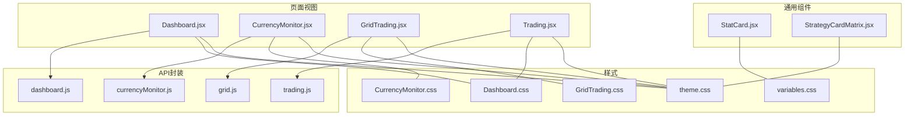
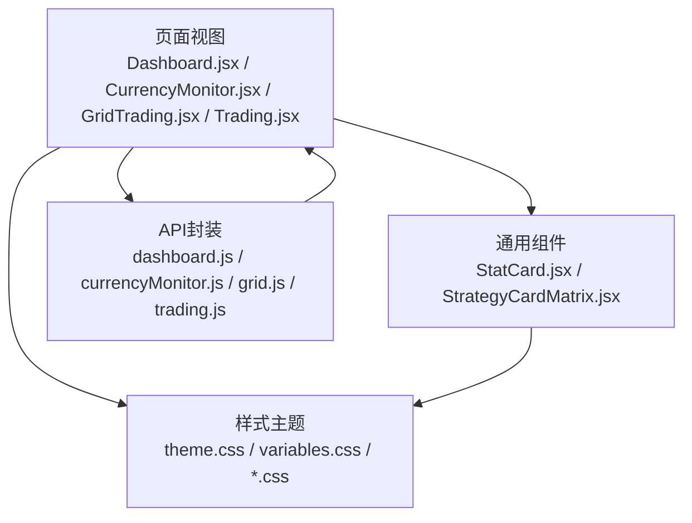
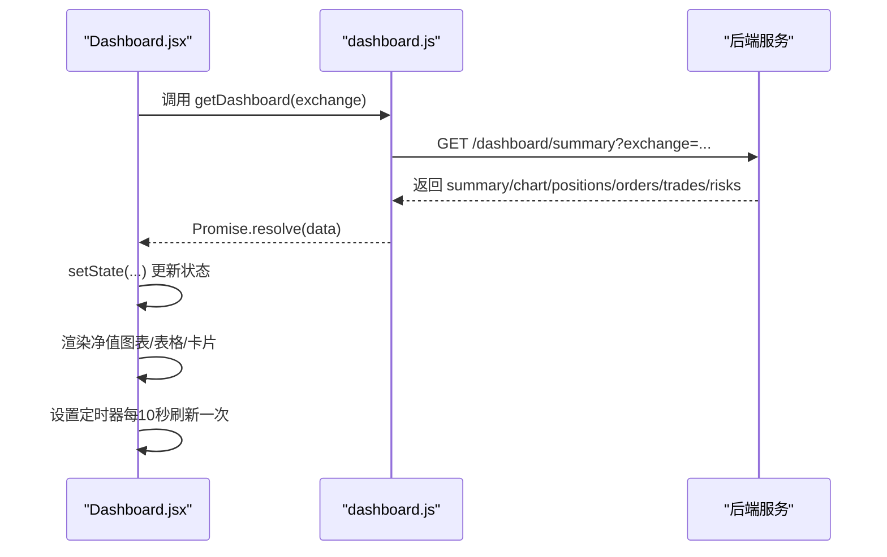
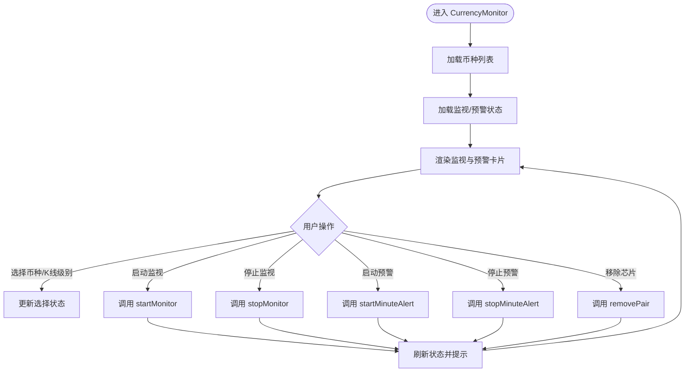
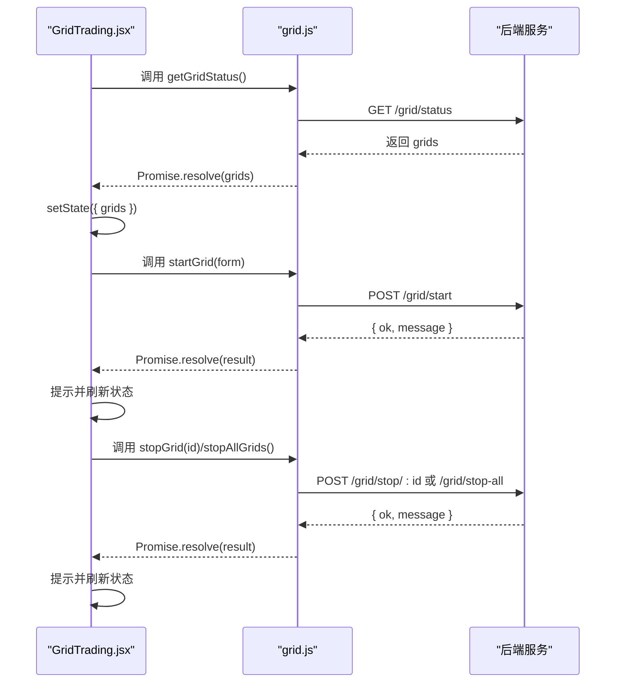
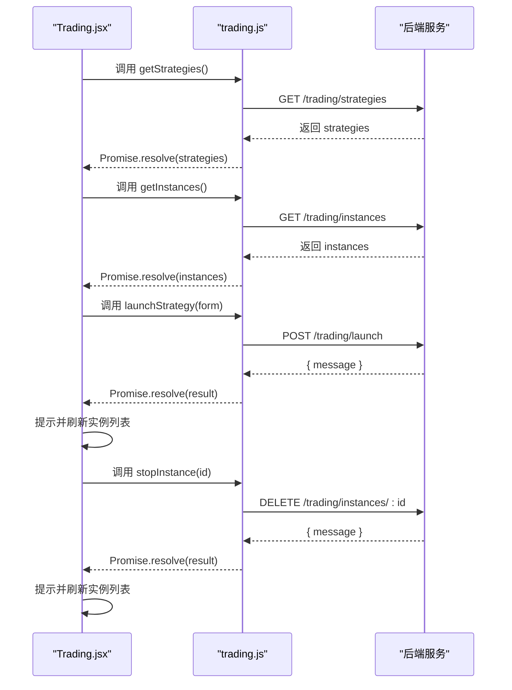
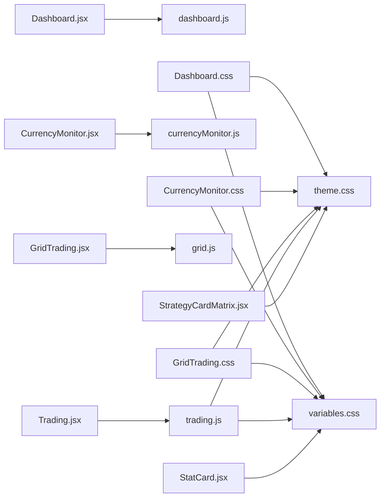

# 可视化界面

<cite>
**本文引用的文件**
- [Dashboard.jsx](file://backpack_quant_trading/frontend/src/views/Dashboard.jsx)
- [Dashboard.css](file://backpack_quant_trading/frontend/src/views/Dashboard.css)
- [CurrencyMonitor.jsx](file://backpack_quant_trading/frontend/src/views/CurrencyMonitor.jsx)
- [CurrencyMonitor.css](file://backpack_quant_trading/frontend/src/views/CurrencyMonitor.css)
- [GridTrading.jsx](file://backpack_quant_trading/frontend/src/views/GridTrading.jsx)
- [GridTrading.css](file://backpack_quant_trading/frontend/src/views/GridTrading.css)
- [Trading.jsx](file://backpack_quant_trading/frontend/src/views/Trading.jsx)
- [StatCard.jsx](file://backpack_quant_trading/frontend/src/components/StatCard.jsx)
- [StrategyCardMatrix.jsx](file://backpack_quant_trading/frontend/src/components/StrategyCardMatrix.jsx)
- [theme.css](file://backpack_quant_trading/frontend/src/assets/theme.css)
- [variables.css](file://backpack_quant_trading/frontend/src/assets/variables.css)
- [dashboard.js](file://backpack_quant_trading/frontend/src/api/dashboard.js)
- [currencyMonitor.js](file://backpack_quant_trading/frontend/src/api/currencyMonitor.js)
- [grid.js](file://backpack_quant_trading/frontend/src/api/grid.js)
- [trading.js](file://backpack_quant_trading/frontend/src/api/trading.js)
</cite>

## 目录
1. [简介](#简介)
2. [项目结构](#项目结构)
3. [核心组件](#核心组件)
4. [架构总览](#架构总览)
5. [详细组件分析](#详细组件分析)
6. [依赖关系分析](#依赖关系分析)
7. [性能考量](#性能考量)
8. [故障排查指南](#故障排查指南)
9. [结论](#结论)
10. [附录](#附录)

## 简介
本文件面向量化交易系统的前端可视化界面，聚焦四大核心页面：仪表板、实时监控、策略管理与交易控制。文档从视觉外观、行为与交互模式入手，系统阐述组件属性、事件、插槽与自定义选项，并提供使用示例、代码片段路径与实时演示思路。同时给出响应式设计与无障碍访问合规性建议、组件状态与动画过渡、样式自定义与主题支持、以及跨浏览器兼容与性能优化要点。

## 项目结构
前端采用模块化组织，页面视图位于 views，通用组件位于 components，样式位于 assets，API 封装位于 api。页面通过 API 模块与后端交互，ECharts 图表用于仪表板净值曲线展示，多页面协同实现从概览到细节的完整可视化体验。

**图表来源**
- [Dashboard.jsx:1-311](file://backpack_quant_trading/frontend/src/views/Dashboard.jsx#L1-L311)
- [CurrencyMonitor.jsx:1-466](file://backpack_quant_trading/frontend/src/views/CurrencyMonitor.jsx#L1-L466)
- [GridTrading.jsx:1-335](file://backpack_quant_trading/frontend/src/views/GridTrading.jsx#L1-L335)
- [Trading.jsx:1-474](file://backpack_quant_trading/frontend/src/views/Trading.jsx#L1-L474)
- [StatCard.jsx:1-32](file://backpack_quant_trading/frontend/src/components/StatCard.jsx#L1-L32)
- [StrategyCardMatrix.jsx:1-126](file://backpack_quant_trading/frontend/src/components/StrategyCardMatrix.jsx#L1-L126)
- [Dashboard.css:1-344](file://backpack_quant_trading/frontend/src/views/Dashboard.css#L1-L344)
- [CurrencyMonitor.css:1-480](file://backpack_quant_trading/frontend/src/views/CurrencyMonitor.css#L1-L480)
- [GridTrading.css:1-331](file://backpack_quant_trading/frontend/src/views/GridTrading.css#L1-L331)
- [theme.css:1-112](file://backpack_quant_trading/frontend/src/assets/theme.css#L1-L112)
- [variables.css:1-27](file://backpack_quant_trading/frontend/src/assets/variables.css#L1-L27)
- [dashboard.js:1-5](file://backpack_quant_trading/frontend/src/api/dashboard.js#L1-L5)
- [currencyMonitor.js:1-13](file://backpack_quant_trading/frontend/src/api/currencyMonitor.js#L1-L13)
- [grid.js:1-8](file://backpack_quant_trading/frontend/src/api/grid.js#L1-L8)
- [trading.js:1-14](file://backpack_quant_trading/frontend/src/api/trading.js#L1-L14)

**章节来源**
- [Dashboard.jsx:1-311](file://backpack_quant_trading/frontend/src/views/Dashboard.jsx#L1-L311)
- [CurrencyMonitor.jsx:1-466](file://backpack_quant_trading/frontend/src/views/CurrencyMonitor.jsx#L1-L466)
- [GridTrading.jsx:1-335](file://backpack_quant_trading/frontend/src/views/GridTrading.jsx#L1-L335)
- [Trading.jsx:1-474](file://backpack_quant_trading/frontend/src/views/Trading.jsx#L1-L474)

## 核心组件
- 统计卡片组件 StatCard：用于展示指标标题、数值、变化与百分比，支持正负状态与图标颜色。
- 策略矩阵卡片 StrategyCardMatrix：用于展示策略卡片，包含状态徽标、进度条、指标卡与链接跳转。
- 页面视图组件：Dashboard（仪表板）、CurrencyMonitor（实时监控）、GridTrading（网格交易）、Trading（策略交易）。

这些组件通过 props 接收数据与行为回调，结合 CSS 变量与主题样式，形成统一的视觉语言与交互体验。

**章节来源**
- [StatCard.jsx:1-32](file://backpack_quant_trading/frontend/src/components/StatCard.jsx#L1-L32)
- [StrategyCardMatrix.jsx:1-126](file://backpack_quant_trading/frontend/src/components/StrategyCardMatrix.jsx#L1-L126)

## 架构总览
前端采用“页面视图 + 通用组件 + 样式主题 + API 封装”的分层架构。页面视图负责业务编排与状态管理，通用组件负责可复用的 UI 元素，样式主题提供统一的设计变量与主题覆盖，API 封装负责与后端通信。

**图表来源**
- [Dashboard.jsx:1-311](file://backpack_quant_trading/frontend/src/views/Dashboard.jsx#L1-L311)
- [CurrencyMonitor.jsx:1-466](file://backpack_quant_trading/frontend/src/views/CurrencyMonitor.jsx#L1-L466)
- [GridTrading.jsx:1-335](file://backpack_quant_trading/frontend/src/views/GridTrading.jsx#L1-L335)
- [Trading.jsx:1-474](file://backpack_quant_trading/frontend/src/views/Trading.jsx#L1-L474)
- [StatCard.jsx:1-32](file://backpack_quant_trading/frontend/src/components/StatCard.jsx#L1-L32)
- [StrategyCardMatrix.jsx:1-126](file://backpack_quant_trading/frontend/src/components/StrategyCardMatrix.jsx#L1-L126)
- [theme.css:1-112](file://backpack_quant_trading/frontend/src/assets/theme.css#L1-L112)
- [variables.css:1-27](file://backpack_quant_trading/frontend/src/assets/variables.css#L1-L27)
- [dashboard.js:1-5](file://backpack_quant_trading/frontend/src/api/dashboard.js#L1-L5)
- [currencyMonitor.js:1-13](file://backpack_quant_trading/frontend/src/api/currencyMonitor.js#L1-L13)
- [grid.js:1-8](file://backpack_quant_trading/frontend/src/api/grid.js#L1-L8)
- [trading.js:1-14](file://backpack_quant_trading/frontend/src/api/trading.js#L1-L14)

## 详细组件分析

### 仪表板（Dashboard）
- 视觉外观
  - 概览网格：资产总值、可用现金、当日盈亏、当日收益率四块卡片，支持正负态样式。
  - 净值曲线：基于 ECharts 的折线图，带面积填充与自动刷新标签。
  - 数据表格：当前活动仓位、活动订单、成交历史、风险事件列表。
- 行为与交互
  - 定时刷新：仪表板摘要、净值曲线、仓位/订单/成交/风险等数据定时轮询。
  - 实时时间显示：本地每秒更新当前时间字符串。
  - 交易所切换：根据实例列表动态选择默认平台。
- 用户交互模式
  - 卡片点击展开/折叠（如需要），表格滚动查看。
  - 风险事件高亮提示，异常状态带闪烁动画。
- 组件属性与事件
  - 属性：summary、chartData、positions、orders、trades、risks、exchange、now。
  - 事件：无显式事件，通过内部状态与定时器驱动更新。
- 插槽与自定义
  - 通过 CSS 类名与颜色类（profit/loss/long/short）实现状态化渲染。
- 使用示例与代码片段
  - 获取仪表板摘要与实例列表：[dashboard.js:1-5](file://backpack_quant_trading/frontend/src/api/dashboard.js#L1-L5)
  - 仪表板页面渲染与定时刷新：[Dashboard.jsx:30-81](file://backpack_quant_trading/frontend/src/views/Dashboard.jsx#L30-L81)
  - 净值曲线初始化与更新：[Dashboard.jsx:42-62](file://backpack_quant_trading/frontend/src/views/Dashboard.jsx#L42-L62)
- 动画与过渡
  - 风险项告警闪烁（pulse）；卡片 hover 投影增强。
- 样式自定义与主题
  - 使用 variables.css 中的颜色变量与圆角阴影；主题覆盖在 theme.css 中体现。
- 响应式与无障碍
  - 网格布局与表格自适应；文本语义清晰，颜色对比满足可读性要求。

**图表来源**
- [Dashboard.jsx:30-81](file://backpack_quant_trading/frontend/src/views/Dashboard.jsx#L30-L81)
- [dashboard.js:1-5](file://backpack_quant_trading/frontend/src/api/dashboard.js#L1-L5)

**章节来源**
- [Dashboard.jsx:1-311](file://backpack_quant_trading/frontend/src/views/Dashboard.jsx#L1-L311)
- [Dashboard.css:1-344](file://backpack_quant_trading/frontend/src/views/Dashboard.css#L1-L344)
- [theme.css:1-112](file://backpack_quant_trading/frontend/src/assets/theme.css#L1-L112)
- [variables.css:1-27](file://backpack_quant_trading/frontend/src/assets/variables.css#L1-L27)

### 实时监控（CurrencyMonitor）
- 视觉外观
  - 监视配置卡片：币种多选、K线级别多选、启动/停止按钮。
  - 分钟预警配置卡片：币种多选、级别选择、阈值参数输入、运行状态展示与启动/停止。
  - 监视/预警中的币种：芯片列表，异常项带告警样式与闪烁。
- 行为与交互
  - 多选下拉：支持搜索、标签展示、移除标签、展开/收起。
  - 定时刷新：监视状态与分钟预警状态分别轮询。
  - 启动/停止：校验必填项，调用对应 API 并提示结果。
- 用户交互模式
  - 多选下拉支持键盘与鼠标操作；芯片项可一键移除。
- 组件属性与事件
  - 属性：symbolList、selectedSymbols、selectedTimeframes、status、minuteStatus、alertedPairs。
  - 事件：onChange 回调用于多选下拉；点击 × 移除芯片项。
- 插槽与自定义
  - MultiSelectDropdown 作为独立组件，可复用到其他页面。
- 使用示例与代码片段
  - 获取币种列表、状态与启动/停止接口：[currencyMonitor.js:1-13](file://backpack_quant_trading/frontend/src/api/currencyMonitor.js#L1-L13)
  - 多选下拉组件实现：[CurrencyMonitor.jsx:14-87](file://backpack_quant_trading/frontend/src/views/CurrencyMonitor.jsx#L14-L87)
  - 监控卡片与芯片渲染：[CurrencyMonitor.jsx:264-462](file://backpack_quant_trading/frontend/src/views/CurrencyMonitor.jsx#L264-L462)
- 动画与过渡
  - 芯片告警与状态徽标使用脉冲动画；下拉展开有阴影与层级提升。
- 样式自定义与主题
  - 使用 orange 系列强调预警卡片；chip/alert 样式区分正常与异常。

**图表来源**
- [CurrencyMonitor.jsx:132-256](file://backpack_quant_trading/frontend/src/views/CurrencyMonitor.jsx#L132-L256)
- [currencyMonitor.js:1-13](file://backpack_quant_trading/frontend/src/api/currencyMonitor.js#L1-L13)

**章节来源**
- [CurrencyMonitor.jsx:1-466](file://backpack_quant_trading/frontend/src/views/CurrencyMonitor.jsx#L1-L466)
- [CurrencyMonitor.css:1-480](file://backpack_quant_trading/frontend/src/views/CurrencyMonitor.css#L1-L480)
- [currencyMonitor.js:1-13](file://backpack_quant_trading/frontend/src/api/currencyMonitor.js#L1-L13)

### 策略管理（GridTrading）
- 视觉外观
  - 参数配置区：交易所、交易对、价格上下限、网格数量、单格投资、杠杆、网格类型、API 密钥。
  - 参数预览：网格间距、总投资、持仓价值、单网格收益率、建议网格数、预估强平价。
  - 运行中的网格实例：卡片列表，含状态与操作按钮。
  - 日志区域：深色背景的等宽字体日志输出。
- 行为与交互
  - 参数校验：价格范围、网格数量、单格投资、杠杆等。
  - 预览计算：根据输入参数即时计算网格相关指标。
  - 启动/停止：调用网格 API，提示结果并刷新状态。
- 用户交互模式
  - 输入框联动与禁用；预览卡片随输入变化而更新。
- 组件属性与事件
  - 属性：grids、form、previewValid、gridPreview。
  - 事件：表单字段 onChange、启动/停止按钮 onClick。
- 插槽与自定义
  - 通过 CSS 类名与颜色类实现状态化展示。
- 使用示例与代码片段
  - 获取/启动/停止网格接口：[grid.js:1-8](file://backpack_quant_trading/frontend/src/api/grid.js#L1-L8)
  - 参数预览计算逻辑：[GridTrading.jsx:49-71](file://backpack_quant_trading/frontend/src/views/GridTrading.jsx#L49-L71)
  - 启动/停止流程：[GridTrading.jsx:88-134](file://backpack_quant_trading/frontend/src/views/GridTrading.jsx#L88-L134)
- 动画与过渡
  - 卡片 hover 投影增强；强平价以危险色突出。
- 样式自定义与主题
  - 使用 variables.css 中的颜色变量与圆角阴影；预览卡片带渐变背景。

**图表来源**
- [GridTrading.jsx:73-134](file://backpack_quant_trading/frontend/src/views/GridTrading.jsx#L73-L134)
- [grid.js:1-8](file://backpack_quant_trading/frontend/src/api/grid.js#L1-L8)

**章节来源**
- [GridTrading.jsx:1-335](file://backpack_quant_trading/frontend/src/views/GridTrading.jsx#L1-L335)
- [GridTrading.css:1-331](file://backpack_quant_trading/frontend/src/views/GridTrading.css#L1-L331)
- [grid.js:1-8](file://backpack_quant_trading/frontend/src/api/grid.js#L1-L8)

### 交易控制（Trading）
- 视觉外观
  - 顶部统计卡片：运行中策略数量、总资产、累计收益、胜率。
  - 策略实例管理：卡片网格展示实例信息与操作按钮。
  - 系统日志：可折叠窗口，实时滚动日志内容。
  - 配置弹窗：平台、策略、API/私钥、交易参数等。
- 行为与交互
  - 策略列表与日志定时刷新。
  - 启动策略：校验平台密钥/私钥，提交参数并提示结果。
  - 停止策略：按实例 ID 删除。
  - HYPE 策略开关：启用/禁用指定实例。
- 用户交互模式
  - 弹窗表单分段展示，平台切换时动态调整密钥输入项。
  - 实例卡片支持展开/折叠与操作按钮。
- 组件属性与事件
  - 属性：instances、logs、strategies、hypeStatus、form。
  - 事件：表单字段 onChange、启动/停止按钮 onClick、HYPE 切换 onClick。
- 插槽与自定义
  - 通过 CSS 类名与颜色类实现状态化展示。
- 使用示例与代码片段
  - 获取策略、实例、日志与 HYPE 状态接口：[trading.js:1-14](file://backpack_quant_trading/frontend/src/api/trading.js#L1-L14)
  - 启动/停止策略流程：[Trading.jsx:102-147](file://backpack_quant_trading/frontend/src/views/Trading.jsx#L102-L147)
  - HYPE 切换流程：[Trading.jsx:154-165](file://backpack_quant_trading/frontend/src/views/Trading.jsx#L154-L165)
- 动画与过渡
  - 卡片 hover 投影增强；日志窗口带彩色指示点。
- 样式自定义与主题
  - 使用 variables.css 中的颜色变量与圆角阴影；统计卡片带主题色。

**图表来源**
- [Trading.jsx:59-147](file://backpack_quant_trading/frontend/src/views/Trading.jsx#L59-L147)
- [trading.js:1-14](file://backpack_quant_trading/frontend/src/api/trading.js#L1-L14)

**章节来源**
- [Trading.jsx:1-474](file://backpack_quant_trading/frontend/src/views/Trading.jsx#L1-L474)
- [trading.js:1-14](file://backpack_quant_trading/frontend/src/api/trading.js#L1-L14)

## 依赖关系分析
- 页面视图依赖 API 封装与样式主题，实现数据获取与外观呈现。
- 通用组件依赖样式变量与主题，保证跨页面一致性。
- 多选下拉组件作为可复用 UI，被监控页面广泛使用。

**图表来源**
- [Dashboard.jsx:1-311](file://backpack_quant_trading/frontend/src/views/Dashboard.jsx#L1-L311)
- [Dashboard.css:1-344](file://backpack_quant_trading/frontend/src/views/Dashboard.css#L1-L344)
- [CurrencyMonitor.jsx:1-466](file://backpack_quant_trading/frontend/src/views/CurrencyMonitor.jsx#L1-L466)
- [CurrencyMonitor.css:1-480](file://backpack_quant_trading/frontend/src/views/CurrencyMonitor.css#L1-L480)
- [GridTrading.jsx:1-335](file://backpack_quant_trading/frontend/src/views/GridTrading.jsx#L1-L335)
- [GridTrading.css:1-331](file://backpack_quant_trading/frontend/src/views/GridTrading.css#L1-L331)
- [Trading.jsx:1-474](file://backpack_quant_trading/frontend/src/views/Trading.jsx#L1-L474)
- [StatCard.jsx:1-32](file://backpack_quant_trading/frontend/src/components/StatCard.jsx#L1-L32)
- [StrategyCardMatrix.jsx:1-126](file://backpack_quant_trading/frontend/src/components/StrategyCardMatrix.jsx#L1-L126)
- [theme.css:1-112](file://backpack_quant_trading/frontend/src/assets/theme.css#L1-L112)
- [variables.css:1-27](file://backpack_quant_trading/frontend/src/assets/variables.css#L1-L27)
- [dashboard.js:1-5](file://backpack_quant_trading/frontend/src/api/dashboard.js#L1-L5)
- [currencyMonitor.js:1-13](file://backpack_quant_trading/frontend/src/api/currencyMonitor.js#L1-L13)
- [grid.js:1-8](file://backpack_quant_trading/frontend/src/api/grid.js#L1-L8)
- [trading.js:1-14](file://backpack_quant_trading/frontend/src/api/trading.js#L1-L14)

**章节来源**
- [Dashboard.jsx:1-311](file://backpack_quant_trading/frontend/src/views/Dashboard.jsx#L1-L311)
- [CurrencyMonitor.jsx:1-466](file://backpack_quant_trading/frontend/src/views/CurrencyMonitor.jsx#L1-L466)
- [GridTrading.jsx:1-335](file://backpack_quant_trading/frontend/src/views/GridTrading.jsx#L1-L335)
- [Trading.jsx:1-474](file://backpack_quant_trading/frontend/src/views/Trading.jsx#L1-L474)

## 性能考量
- 数据轮询节流：仪表板与监控页面均采用定时器轮询，建议根据网络与设备性能调整间隔，避免频繁请求。
- 图表渲染：ECharts 初始化与 setOption 应在数据就绪后触发，避免重复渲染。
- 列表渲染：长列表使用虚拟滚动或分页，减少 DOM 节点数量。
- 样式缓存：CSS 变量与主题样式集中管理，避免重复计算与重绘。
- 资源压缩：构建阶段启用压缩与 Tree Shaking，减少包体积。
- 首屏优化：关键路径样式内联，非关键资源异步加载。

## 故障排查指南
- 仪表板无数据
  - 检查定时器是否启动与清除：[Dashboard.jsx:64-81](file://backpack_quant_trading/frontend/src/views/Dashboard.jsx#L64-L81)
  - 核对 API 返回结构与字段映射：[dashboard.js:1-5](file://backpack_quant_trading/frontend/src/api/dashboard.js#L1-L5)
- 实时监控异常
  - 多选下拉展开/收起与外部点击关闭：[CurrencyMonitor.jsx:20-26](file://backpack_quant_trading/frontend/src/views/CurrencyMonitor.jsx#L20-L26)
  - 监控状态与预警状态定时刷新：[CurrencyMonitor.jsx:163-180](file://backpack_quant_trading/frontend/src/views/CurrencyMonitor.jsx#L163-L180)
- 策略管理启动失败
  - 校验表单字段与 API 返回：[GridTrading.jsx:88-111](file://backpack_quant_trading/frontend/src/views/GridTrading.jsx#L88-L111)
  - 查看日志区域输出：[GridTrading.jsx:326-330](file://backpack_quant_trading/frontend/src/views/GridTrading.jsx#L326-L330)
- 交易控制操作失败
  - 校验平台密钥/私钥与参数：[Trading.jsx:102-137](file://backpack_quant_trading/frontend/src/views/Trading.jsx#L102-L137)
  - HYPE 策略开关状态同步：[Trading.jsx:154-165](file://backpack_quant_trading/frontend/src/views/Trading.jsx#L154-L165)

**章节来源**
- [Dashboard.jsx:64-81](file://backpack_quant_trading/frontend/src/views/Dashboard.jsx#L64-L81)
- [CurrencyMonitor.jsx:20-26](file://backpack_quant_trading/frontend/src/views/CurrencyMonitor.jsx#L20-L26)
- [GridTrading.jsx:88-111](file://backpack_quant_trading/frontend/src/views/GridTrading.jsx#L88-L111)
- [Trading.jsx:102-137](file://backpack_quant_trading/frontend/src/views/Trading.jsx#L102-L137)

## 结论
本可视化界面以统一的主题与样式变量为基础，通过页面视图与通用组件的协作，实现了从概览到细节的完整交易可视化体验。仪表板提供关键指标与净值曲线，实时监控支持币种与预警配置，策略管理与交易控制覆盖参数配置、实例管理与日志输出。配合合理的性能优化与故障排查机制，能够满足复杂量化交易场景下的可视化需求。

## 附录
- 响应式设计与无障碍访问
  - 使用语义化 HTML 与清晰的文本层次；颜色对比满足 WCAG 对比度要求。
  - 表格与卡片在小屏设备上保持可读性，必要时提供横向滚动。
- 样式自定义与主题支持
  - 通过 variables.css 定义全局设计变量，theme.css 提供主题覆盖，实现品牌色与组件样式的统一。
- 跨浏览器兼容性
  - 使用现代 CSS Grid 与 Flexbox，针对旧版本浏览器提供降级方案与 polyfill。
- 实时演示建议
  - 在开发环境启动后，通过路由导航至各页面，观察定时刷新与交互反馈；结合浏览器开发者工具 Network 面板验证 API 请求与响应。