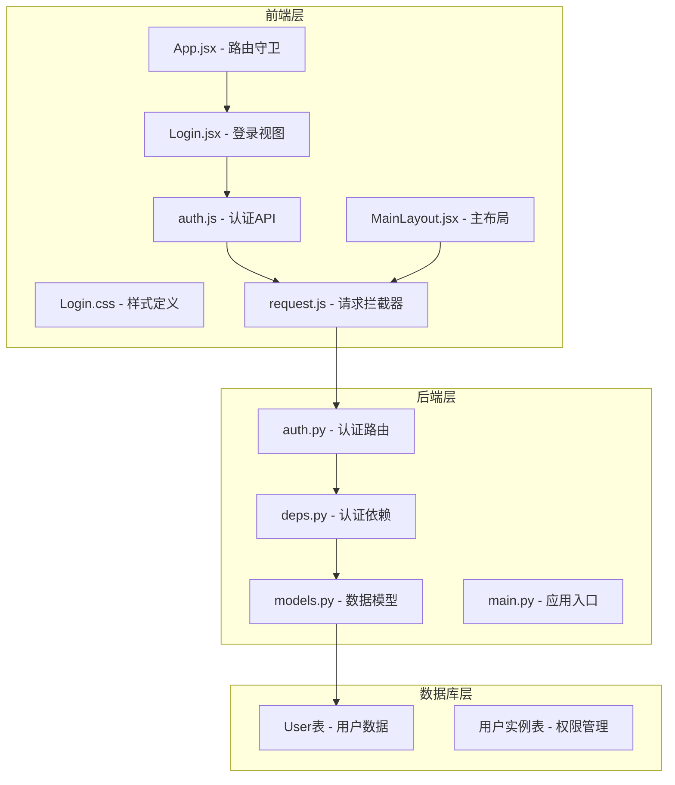
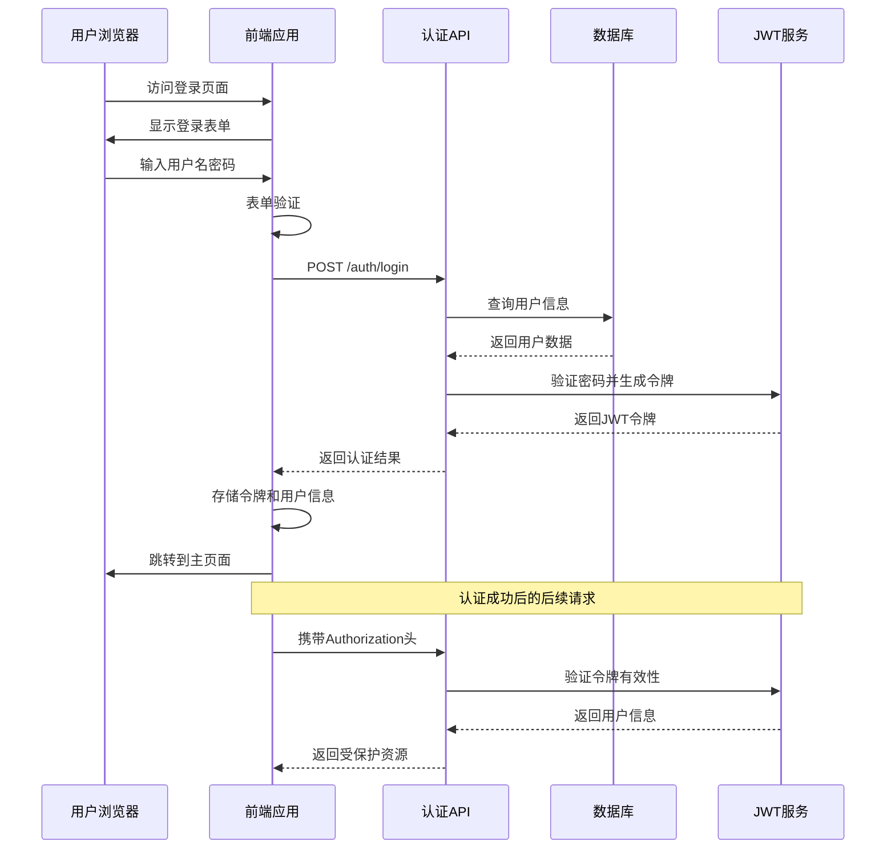
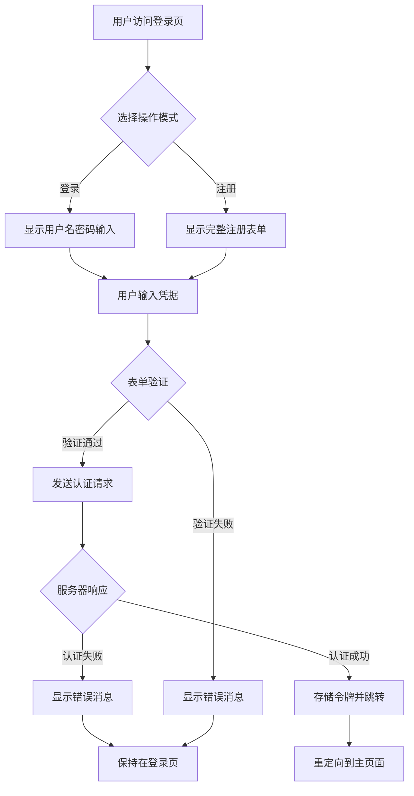
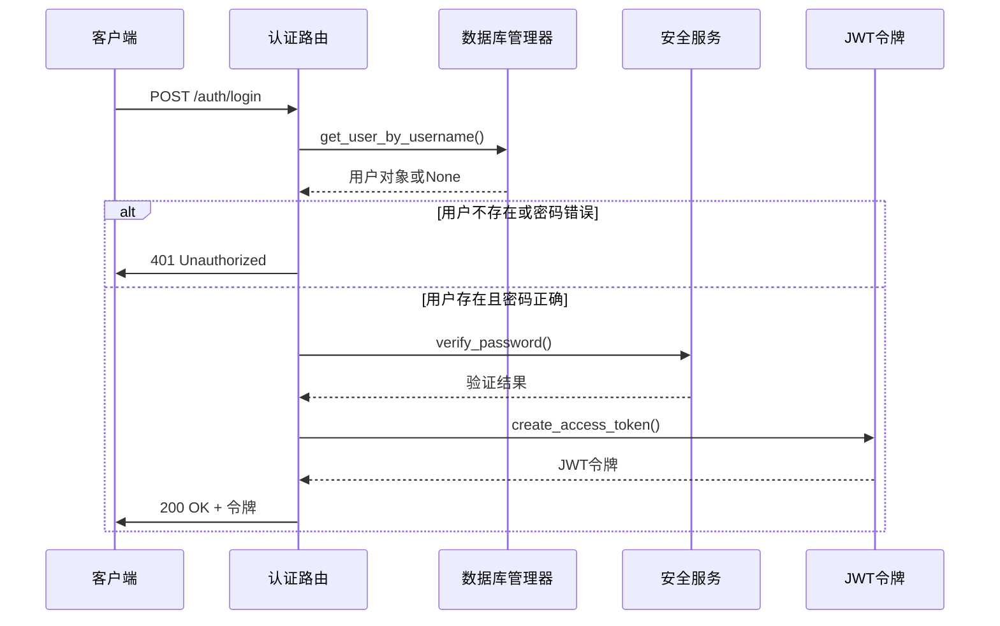
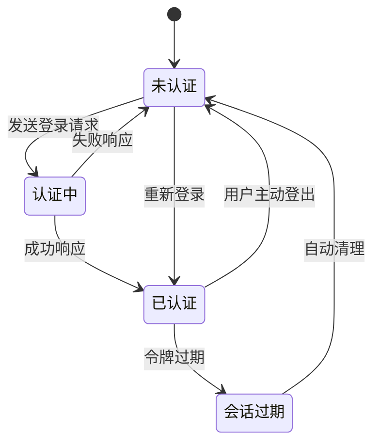
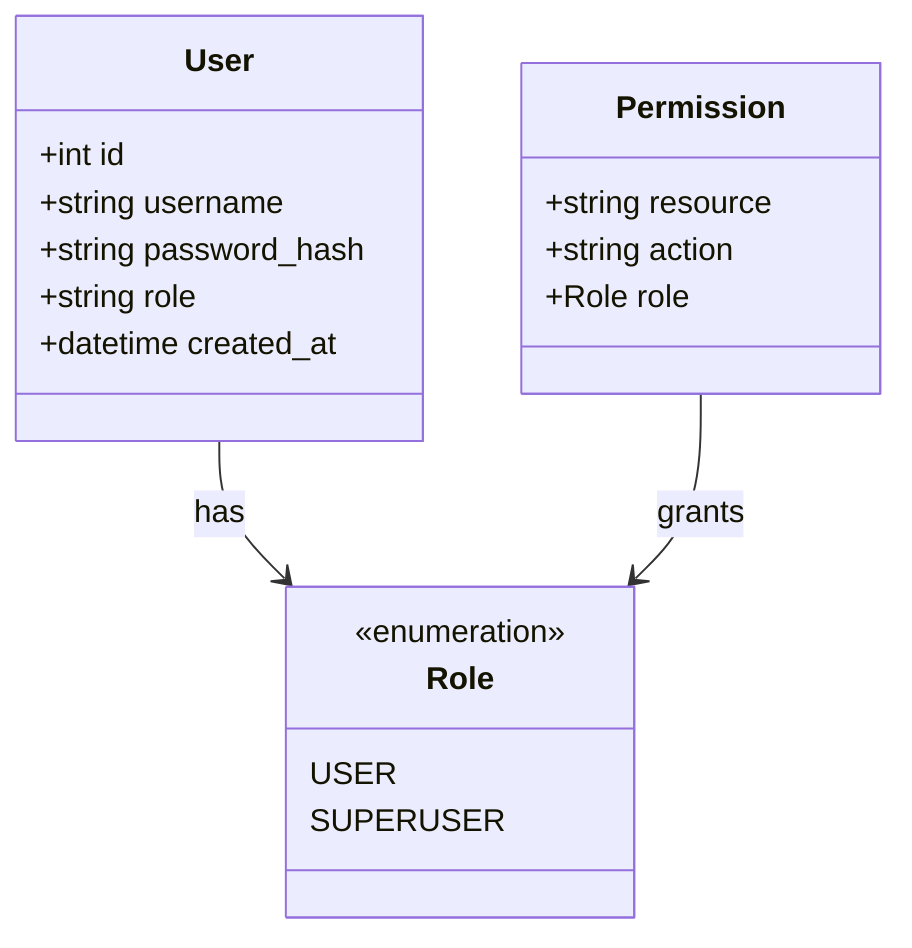
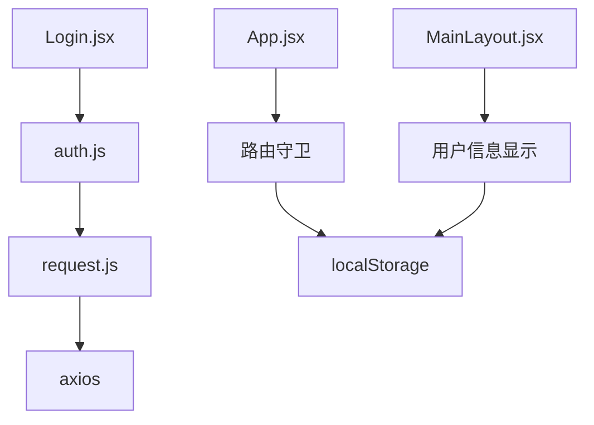
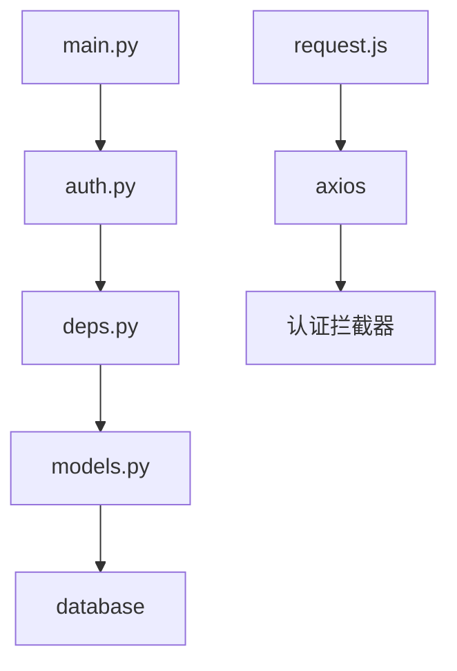

# 登录认证界面

<cite>
**本文档引用的文件**
- [Login.jsx](file://backpack_quant_trading/frontend/src/views/Login.jsx)
- [Login.css](file://backpack_quant_trading/frontend/src/views/Login.css)
- [auth.js](file://backpack_quant_trading/frontend/src/api/auth.js)
- [request.js](file://backpack_quant_trading/frontend/src/api/request.js)
- [App.jsx](file://backpack_quant_trading/frontend/src/App.jsx)
- [MainLayout.jsx](file://backpack_quant_trading/frontend/src/layouts/MainLayout.jsx)
- [auth.py](file://backpack_quant_trading/api/routers/auth.py)
- [deps.py](file://backpack_quant_trading/api/deps.py)
- [models.py](file://backpack_quant_trading/database/models.py)
- [main.py](file://backpack_quant_trading/api/main.py)
</cite>

## 目录
1. [简介](#简介)
2. [项目结构](#项目结构)
3. [核心组件](#核心组件)
4. [架构概览](#架构概览)
5. [详细组件分析](#详细组件分析)
6. [依赖关系分析](#依赖关系分析)
7. [性能考虑](#性能考虑)
8. [故障排除指南](#故障排除指南)
9. [结论](#结论)

## 简介

登录认证界面是量化交易平台的核心入口，负责用户身份验证、会话管理和权限控制。该界面采用现代化的React设计，提供了直观的登录和注册体验，同时集成了完整的后端认证机制和安全防护措施。

## 项目结构

登录认证功能分布在前后端两个主要部分：

**图表来源**
- [Login.jsx:1-253](file://backpack_quant_trading/frontend/src/views/Login.jsx#L1-L253)
- [auth.py:1-79](file://backpack_quant_trading/api/routers/auth.py#L1-L79)
- [models.py:228-237](file://backpack_quant_trading/database/models.py#L228-L237)

**章节来源**
- [Login.jsx:1-253](file://backpack_quant_trading/frontend/src/views/Login.jsx#L1-L253)
- [auth.py:1-79](file://backpack_quant_trading/api/routers/auth.py#L1-L79)

## 核心组件

### 前端登录组件

登录界面采用双标签页设计，支持登录和注册两种模式：

- **登录标签页**：用户名密码登录，支持"记住我"选项
- **注册标签页**：用户名、邮箱、密码注册，包含服务条款同意
- **响应式设计**：适配不同屏幕尺寸的现代化界面

### 后端认证服务

认证服务基于JWT令牌机制，提供完整的用户生命周期管理：

- **JWT令牌生成**：7天有效期的安全令牌
- **密码哈希**：使用Werkzeug的SHA256哈希算法
- **用户角色管理**：普通用户和超级用户权限区分

**章节来源**
- [Login.jsx:6-253](file://backpack_quant_trading/frontend/src/views/Login.jsx#L6-L253)
- [auth.py:17-79](file://backpack_quant_trading/api/routers/auth.py#L17-L79)

## 架构概览

登录认证系统采用前后端分离架构，通过RESTful API进行通信：

**图表来源**
- [Login.jsx:25-46](file://backpack_quant_trading/frontend/src/views/Login.jsx#L25-L46)
- [auth.py:33-44](file://backpack_quant_trading/api/routers/auth.py#L33-L44)
- [request.js:9-18](file://backpack_quant_trading/frontend/src/api/request.js#L9-L18)

## 详细组件分析

### 登录界面组件

#### 视觉设计元素

登录界面采用现代化的设计语言：

- **渐变背景**：使用蓝色和绿色渐变营造科技感
- **卡片布局**：半透明背景和毛玻璃效果
- **品牌标识**：简洁的SVG图标和品牌名称
- **输入控件**：圆角边框和焦点状态高亮

#### 交互行为

**图表来源**
- [Login.jsx:25-69](file://backpack_quant_trading/frontend/src/views/Login.jsx#L25-L69)

#### 表单验证机制

表单验证采用多层次设计：

1. **前端即时验证**：输入时实时检查必填字段
2. **用户体验反馈**：通过颜色和状态指示器提供视觉反馈
3. **错误消息本地化**：清晰的错误提示信息

**章节来源**
- [Login.jsx:20-69](file://backpack_quant_trading/frontend/src/views/Login.jsx#L20-L69)
- [Login.css:146-161](file://backpack_quant_trading/frontend/src/views/Login.css#L146-L161)

### 认证API组件

#### 后端认证流程

**图表来源**
- [auth.py:33-44](file://backpack_quant_trading/api/routers/auth.py#L33-L44)
- [deps.py:20-33](file://backpack_quant_trading/api/deps.py#L20-L33)

#### 密码安全机制

系统采用多层安全防护：

- **密码哈希**：使用Werkzeug的SHA256算法
- **盐值随机化**：每次哈希都使用随机盐值
- **令牌过期管理**：7天自动过期机制
- **防暴力破解**：后端提供错误响应但不暴露具体原因

**章节来源**
- [deps.py:20-25](file://backpack_quant_trading/api/deps.py#L20-L25)
- [auth.py:37-38](file://backpack_quant_trading/api/routers/auth.py#L37-L38)

### 会话管理组件

#### 前端会话处理

**图表来源**
- [App.jsx:18-32](file://backpack_quant_trading/frontend/src/App.jsx#L18-L32)
- [request.js:20-29](file://backpack_quant_trading/frontend/src/api/request.js#L20-L29)

#### 后端会话验证

后端提供双重认证机制：

- **Bearer Token**：标准的Authorization头认证
- **Cookie认证**：支持access_token Cookie
- **用户上下文**：通过Depends依赖注入获取当前用户

**章节来源**
- [deps.py:44-66](file://backpack_quant_trading/api/deps.py#L44-L66)
- [App.jsx:18-32](file://backpack_quant_trading/frontend/src/App.jsx#L18-L32)

### 权限控制系统

#### 用户角色管理

系统支持两种用户角色：

- **普通用户**：基础功能访问权限
- **超级用户**：系统管理功能和特殊权限

**图表来源**
- [models.py:228-237](file://backpack_quant_trading/database/models.py#L228-L237)

#### 访问控制列表

权限控制通过装饰器实现：

- **require_user**：强制用户认证
- **路由级权限**：不同页面的访问限制
- **动态权限检查**：运行时权限验证

**章节来源**
- [deps.py:69-73](file://backpack_quant_trading/api/deps.py#L69-L73)
- [MainLayout.jsx:18-32](file://backpack_quant_trading/frontend/src/layouts/MainLayout.jsx#L18-L32)

## 依赖关系分析

### 前端依赖关系

**图表来源**
- [Login.jsx:1-4](file://backpack_quant_trading/frontend/src/views/Login.jsx#L1-L4)
- [App.jsx:1-76](file://backpack_quant_trading/frontend/src/App.jsx#L1-L76)

### 后端依赖关系

**图表来源**
- [auth.py:1-14](file://backpack_quant_trading/api/routers/auth.py#L1-L14)
- [deps.py:1-17](file://backpack_quant_trading/api/deps.py#L1-L17)

**章节来源**
- [auth.js:1-7](file://backpack_quant_trading/frontend/src/api/auth.js#L1-L7)
- [request.js:1-33](file://backpack_quant_trading/frontend/src/api/request.js#L1-L33)

## 性能考虑

### 前端性能优化

- **懒加载**：路由级别的代码分割
- **缓存策略**：本地存储令牌减少网络请求
- **渲染优化**：条件渲染避免不必要的DOM更新
- **内存管理**：及时清理事件监听器和定时器

### 后端性能优化

- **数据库连接池**：配置合理的连接池大小
- **令牌缓存**：JWT解码结果的短期缓存
- **并发处理**：异步认证流程避免阻塞
- **资源清理**：及时关闭数据库会话

## 故障排除指南

### 常见问题诊断

#### 登录失败问题

1. **用户名密码错误**
   - 检查用户名是否存在
   - 验证密码哈希匹配
   - 确认用户账户状态

2. **网络连接问题**
   - 检查API端点可达性
   - 验证CORS配置
   - 确认防火墙设置

3. **令牌过期问题**
   - 检查JWT过期时间
   - 验证服务器时间同步
   - 确认客户端存储机制

#### 前端认证问题

1. **路由守卫失效**
   - 检查localStorage访问权限
   - 验证令牌格式正确性
   - 确认路由配置完整性

2. **会话状态异常**
   - 清理浏览器缓存
   - 检查Cookie设置
   - 验证跨域配置

**章节来源**
- [request.js:20-29](file://backpack_quant_trading/frontend/src/api/request.js#L20-L29)
- [App.jsx:18-32](file://backpack_quant_trading/frontend/src/App.jsx#L18-L32)

### 错误处理机制

系统提供多层次的错误处理：

- **前端错误捕获**：统一的Promise错误处理
- **后端异常响应**：标准化的HTTP状态码
- **用户友好提示**：清晰的错误消息显示
- **日志记录**：详细的错误日志便于调试

## 结论

登录认证界面设计体现了现代Web应用的最佳实践，通过前后端分离架构实现了安全、可靠的用户认证系统。系统不仅提供了直观的用户界面，还内置了完善的权限管理和安全防护机制。

### 设计亮点

1. **用户体验优化**：简洁直观的界面设计和流畅的交互流程
2. **安全性保障**：多层安全防护和标准化的认证协议
3. **可扩展性**：模块化的架构设计便于功能扩展
4. **维护性**：清晰的代码结构和完善的文档说明

### 改进建议

1. **验证码集成**：添加图形验证码防止自动化攻击
2. **多因素认证**：支持短信或邮箱验证增强安全性
3. **审计日志**：记录用户登录和认证活动
4. **会话监控**：实时监控活跃会话和异常行为

该认证系统为整个量化交易平台奠定了坚实的安全基础，确保了用户数据和交易操作的安全性。