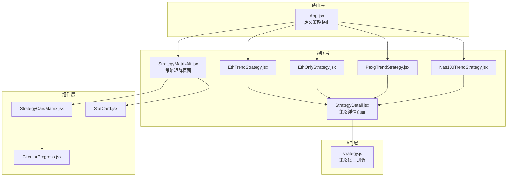
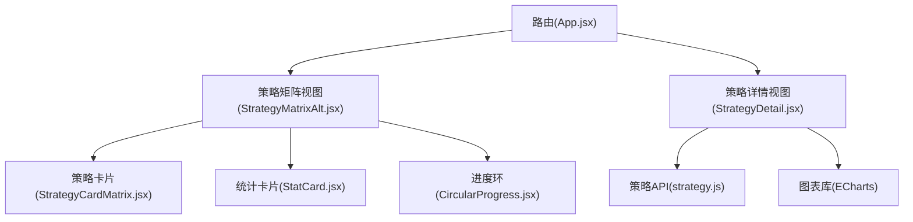
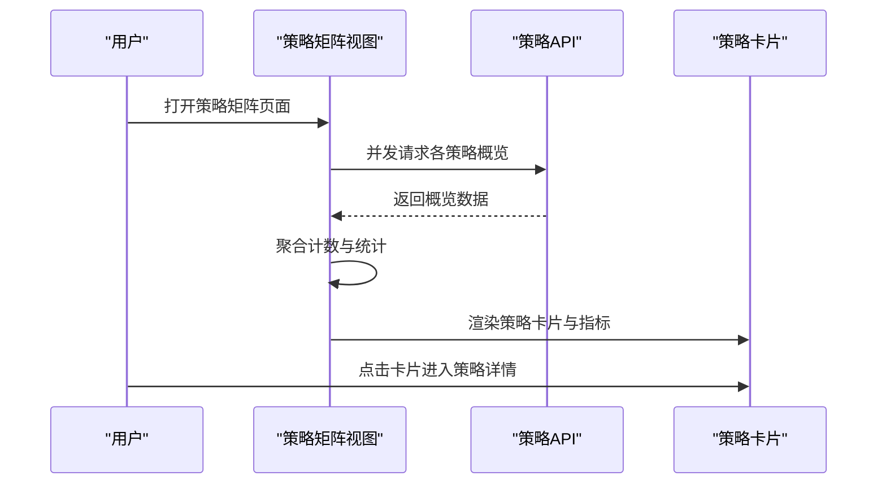
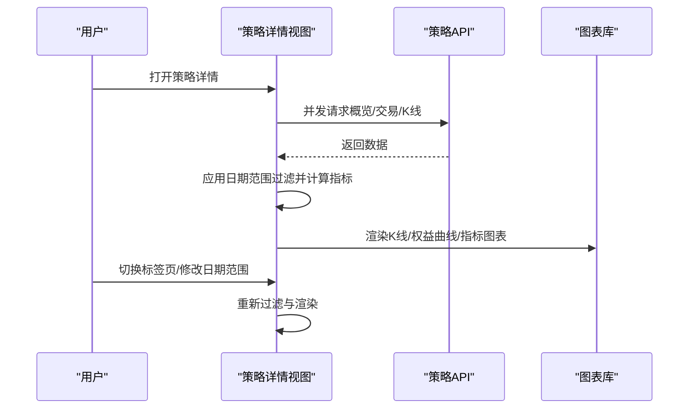
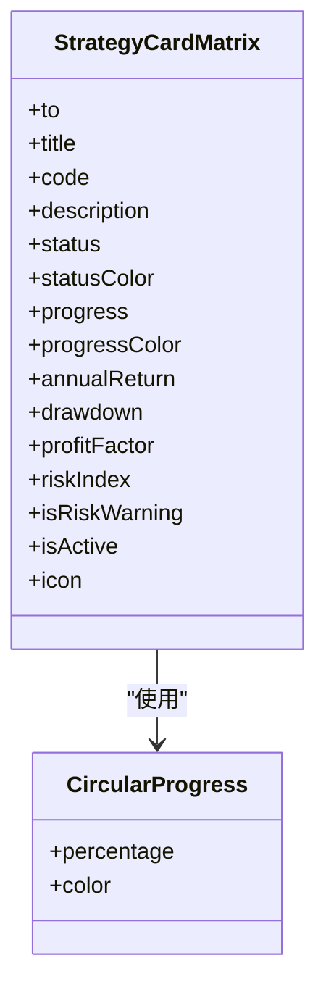
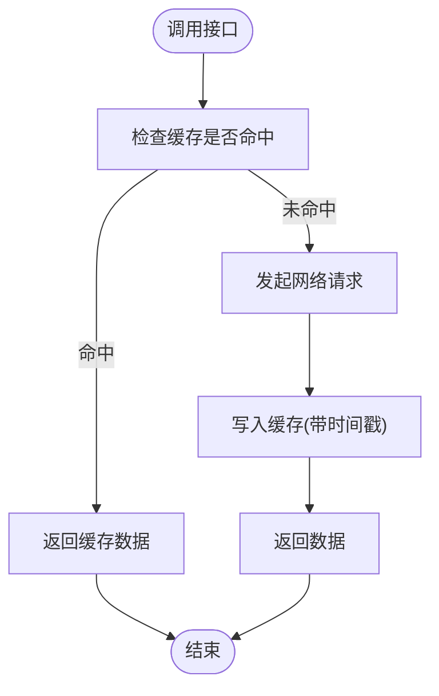
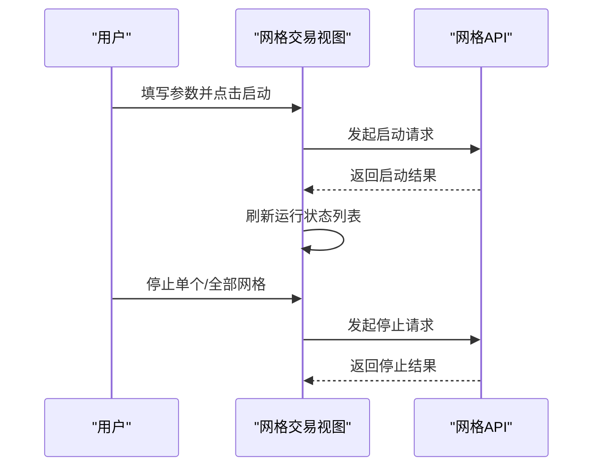
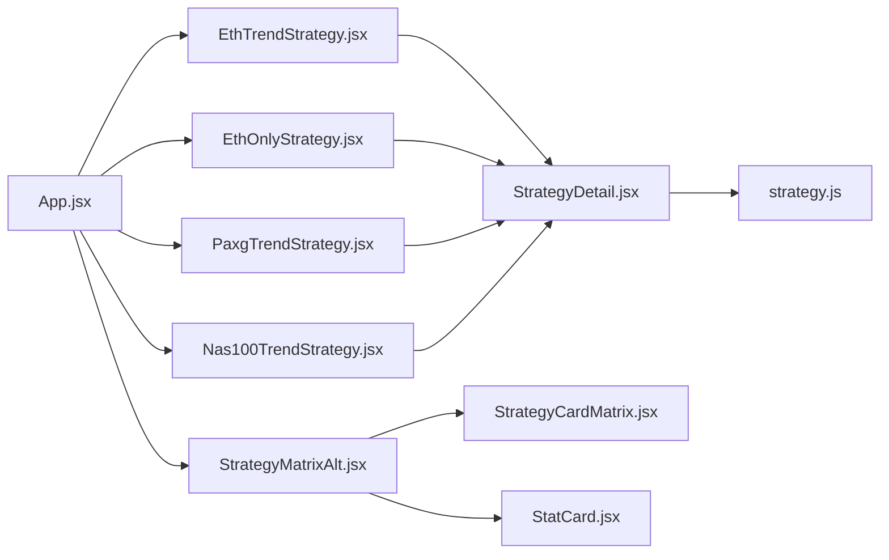

# 策略管理界面

<cite>
**本文引用的文件**
- [StrategyDetail.jsx](file://backpack_quant_trading/frontend/src/views/StrategyDetail.jsx)
- [StrategyMatrixAlt.jsx](file://backpack_quant_trading/frontend/src/views/StrategyMatrixAlt.jsx)
- [StrategyCardMatrix.jsx](file://backpack_quant_trading/frontend/src/components/StrategyCardMatrix.jsx)
- [strategy.js](file://backpack_quant_trading/frontend/src/api/strategy.js)
- [App.jsx](file://backpack_quant_trading/frontend/src/App.jsx)
- [StrategyDetail.css](file://backpack_quant_trading/frontend/src/views/StrategyDetail.css)
- [EthTrendStrategy.jsx](file://backpack_quant_trading/frontend/src/views/EthTrendStrategy.jsx)
- [EthOnlyStrategy.jsx](file://backpack_quant_trading/frontend/src/views/EthOnlyStrategy.jsx)
- [PaxgTrendStrategy.jsx](file://backpack_quant_trading/frontend/src/views/PaxgTrendStrategy.jsx)
- [Nas100TrendStrategy.jsx](file://backpack_quant_trading/frontend/src/views/Nas100TrendStrategy.jsx)
- [CircularProgress.jsx](file://backpack_quant_trading/frontend/src/components/CircularProgress.jsx)
- [StatCard.jsx](file://backpack_quant_trading/frontend/src/components/StatCard.jsx)
- [GridTrading.jsx](file://backpack_quant_trading/frontend/src/views/GridTrading.jsx)
</cite>

## 目录
1. [简介](#简介)
2. [项目结构](#项目结构)
3. [核心组件](#核心组件)
4. [架构总览](#架构总览)
5. [详细组件分析](#详细组件分析)
6. [依赖关系分析](#依赖关系分析)
7. [性能考量](#性能考量)
8. [故障排查指南](#故障排查指南)
9. [结论](#结论)
10. [附录](#附录)

## 简介
本文件面向策略管理界面，系统性阐述策略详情页面与策略矩阵页面的设计布局、策略配置管理与性能监控的视觉外观与交互模式。重点覆盖以下方面：
- 策略参数设置界面、回测结果展示与实时表现监控的组件设计
- 策略选择器、参数调整器与性能图表的交互逻辑
- 策略回测功能、历史表现对比与收益分析的可视化呈现
- 策略启用/禁用控制、参数验证与配置保存的用户界面设计
- 策略数据的实时更新机制、图表渲染与状态同步的实现细节

## 项目结构
策略管理界面由多个视图与组件构成，采用模块化组织方式：
- 路由层：在应用入口定义策略相关路由，挂载策略矩阵与各策略详情视图
- 视图层：策略矩阵页面与多个策略详情页面（以不同资产类别/标的为主）
- 组件层：通用卡片组件、进度环组件、统计卡片组件等
- API 层：封装策略相关数据接口，提供缓存与请求方法

**图表来源**
- [App.jsx:34-72](file://backpack_quant_trading/frontend/src/App.jsx#L34-L72)
- [StrategyMatrixAlt.jsx:89-267](file://backpack_quant_trading/frontend/src/views/StrategyMatrixAlt.jsx#L89-L267)
- [StrategyDetail.jsx:87-1273](file://backpack_quant_trading/frontend/src/views/StrategyDetail.jsx#L87-L1273)
- [strategy.js:1-101](file://backpack_quant_trading/frontend/src/api/strategy.js#L1-L101)
- [StrategyCardMatrix.jsx:1-126](file://backpack_quant_trading/frontend/src/components/StrategyCardMatrix.jsx#L1-L126)
- [CircularProgress.jsx:1-34](file://backpack_quant_trading/frontend/src/components/CircularProgress.jsx#L1-L34)
- [StatCard.jsx:1-32](file://backpack_quant_trading/frontend/src/components/StatCard.jsx#L1-L32)

**章节来源**
- [App.jsx:34-72](file://backpack_quant_trading/frontend/src/App.jsx#L34-L72)
- [StrategyMatrixAlt.jsx:89-267](file://backpack_quant_trading/frontend/src/views/StrategyMatrixAlt.jsx#L89-L267)
- [StrategyDetail.jsx:87-1273](file://backpack_quant_trading/frontend/src/views/StrategyDetail.jsx#L87-L1273)
- [strategy.js:1-101](file://backpack_quant_trading/frontend/src/api/strategy.js#L1-L101)

## 核心组件
- 策略矩阵页面：提供策略概览、搜索/筛选、视图切换与新建策略入口，并通过卡片组件展示各策略的关键指标（年化收益、最大回撤、盈亏比、风险指数等）
- 策略详情页面：提供日期范围筛选、快捷时间窗口、K线与权益曲线展示、指标与交易明细双标签页、收益分布与胜率结构等图表
- 通用组件：进度环组件用于展示运行进度，统计卡片组件用于聚合关键指标，策略卡片组件用于矩阵视图的统一展示
- API 封装：提供各策略的概览、K线、交易数据接口，并内置缓存机制

**章节来源**
- [StrategyMatrixAlt.jsx:89-267](file://backpack_quant_trading/frontend/src/views/StrategyMatrixAlt.jsx#L89-L267)
- [StrategyDetail.jsx:87-1273](file://backpack_quant_trading/frontend/src/views/StrategyDetail.jsx#L87-L1273)
- [StrategyCardMatrix.jsx:25-126](file://backpack_quant_trading/frontend/src/components/StrategyCardMatrix.jsx#L25-L126)
- [CircularProgress.jsx:3-34](file://backpack_quant_trading/frontend/src/components/CircularProgress.jsx#L3-L34)
- [StatCard.jsx:4-32](file://backpack_quant_trading/frontend/src/components/StatCard.jsx#L4-L32)
- [strategy.js:1-101](file://backpack_quant_trading/frontend/src/api/strategy.js#L1-L101)

## 架构总览
策略管理界面采用“路由 → 视图 → 组件 → API”的分层架构：
- 路由层负责页面跳转与权限控制
- 视图层承载业务页面，组合通用组件与图表库
- 组件层提供可复用的 UI 片段
- API 层封装数据访问与缓存策略

**图表来源**
- [App.jsx:34-72](file://backpack_quant_trading/frontend/src/App.jsx#L34-L72)
- [StrategyMatrixAlt.jsx:89-267](file://backpack_quant_trading/frontend/src/views/StrategyMatrixAlt.jsx#L89-L267)
- [StrategyDetail.jsx:87-1273](file://backpack_quant_trading/frontend/src/views/StrategyDetail.jsx#L87-L1273)
- [StrategyCardMatrix.jsx:1-126](file://backpack_quant_trading/frontend/src/components/StrategyCardMatrix.jsx#L1-L126)
- [StatCard.jsx:1-32](file://backpack_quant_trading/frontend/src/components/StatCard.jsx#L1-L32)
- [CircularProgress.jsx:1-34](file://backpack_quant_trading/frontend/src/components/CircularProgress.jsx#L1-L34)
- [strategy.js:1-101](file://backpack_quant_trading/frontend/src/api/strategy.js#L1-L101)

## 详细组件分析

### 策略矩阵页面（StrategyMatrixAlt）
- 设计布局
  - 顶部统计卡片网格：展示策略总数、运行中策略数量、平均胜率、累计收益
  - 搜索与筛选栏：支持关键词搜索、状态筛选、视图切换（网格/列表）、新建策略按钮
  - 策略卡片网格：每张卡片包含图标、标题、代码、描述、状态徽章、进度环、指标卡片（年化收益、最大回撤、盈亏比、风险指数）
- 交互逻辑
  - 加载各策略概览数据并聚合统计
  - 支持根据路径高亮当前激活卡片
  - 提供视图切换与新建策略入口
- 数据来源
  - 通过 API 层的概览接口批量获取并缓存
  - 动态计算平均胜率与累计收益

**图表来源**
- [StrategyMatrixAlt.jsx:89-267](file://backpack_quant_trading/frontend/src/views/StrategyMatrixAlt.jsx#L89-L267)
- [strategy.js:27-100](file://backpack_quant_trading/frontend/src/api/strategy.js#L27-L100)
- [StrategyCardMatrix.jsx:25-126](file://backpack_quant_trading/frontend/src/components/StrategyCardMatrix.jsx#L25-L126)

**章节来源**
- [StrategyMatrixAlt.jsx:89-267](file://backpack_quant_trading/frontend/src/views/StrategyMatrixAlt.jsx#L89-L267)
- [strategy.js:1-101](file://backpack_quant_trading/frontend/src/api/strategy.js#L1-L101)
- [StrategyCardMatrix.jsx:25-126](file://backpack_quant_trading/frontend/src/components/StrategyCardMatrix.jsx#L25-L126)
- [StatCard.jsx:4-32](file://backpack_quant_trading/frontend/src/components/StatCard.jsx#L4-L32)
- [CircularProgress.jsx:3-34](file://backpack_quant_trading/frontend/src/components/CircularProgress.jsx#L3-L34)

### 策略详情页面（StrategyDetail）
- 设计布局
  - 页面标题与返回按钮、副标题说明
  - 日期范围筛选与快捷时间窗口（本月/近3个月/本年/全部）
  - K线图（带入场/出场标记）与权益曲线
  - 概览指标卡片（总盈亏、总交易次数、盈利交易占比、盈亏比）
  - 指标/交易明细双标签页
  - 指标表格与详细信息表格
  - 收益分布直方图、胜率结构饼图、利润结构柱状图、基准对比散点图
- 交互逻辑
  - 加载概览、交易与K线数据，按日期范围过滤并重新计算指标
  - 支持分页查看交易明细，按交易编号分组并排序
  - 图表随窗口尺寸变化自适应重绘
- 数据处理
  - 计算总收益、最大回撤、胜率、盈亏比、期望收益等指标
  - 对出场/止损交易进行去重，避免重复计算
  - 支持固定盈亏比覆盖与本地兜底计算

**图表来源**
- [StrategyDetail.jsx:412-439](file://backpack_quant_trading/frontend/src/views/StrategyDetail.jsx#L412-L439)
- [strategy.js:1-101](file://backpack_quant_trading/frontend/src/api/strategy.js#L1-L101)

**章节来源**
- [StrategyDetail.jsx:87-1273](file://backpack_quant_trading/frontend/src/views/StrategyDetail.jsx#L87-L1273)
- [StrategyDetail.css:1-347](file://backpack_quant_trading/frontend/src/views/StrategyDetail.css#L1-L347)

### 策略卡片组件（StrategyCardMatrix）
- 设计要点
  - 状态徽章与进度环颜色根据状态自动切换
  - 指标卡片包含图标、标签、数值与正负颜色
  - 支持激活态高亮与悬停效果
- 交互要点
  - 可作为链接跳转到对应策略详情页
  - 通过属性传递指标数据与状态信息

**图表来源**
- [StrategyCardMatrix.jsx:25-126](file://backpack_quant_trading/frontend/src/components/StrategyCardMatrix.jsx#L25-L126)
- [CircularProgress.jsx:3-34](file://backpack_quant_trading/frontend/src/components/CircularProgress.jsx#L3-L34)

**章节来源**
- [StrategyCardMatrix.jsx:1-126](file://backpack_quant_trading/frontend/src/components/StrategyCardMatrix.jsx#L1-L126)
- [CircularProgress.jsx:1-34](file://backpack_quant_trading/frontend/src/components/CircularProgress.jsx#L1-L34)

### API 封装（strategy.js）
- 缓存机制
  - 24 小时 TTL 缓存，支持按需清除缓存
- 接口方法
  - ETH/ETH 独立/HYPE 黄金/纳指趋势策略的概览、K线、交易数据接口
- 使用场景
  - 矩阵页面并发拉取概览数据
  - 详情页面按需加载概览、交易与 K 线

**图表来源**
- [strategy.js:6-24](file://backpack_quant_trading/frontend/src/api/strategy.js#L6-L24)

**章节来源**
- [strategy.js:1-101](file://backpack_quant_trading/frontend/src/api/strategy.js#L1-L101)

### 策略参数设置与回测（GridTrading.jsx）
- 参数设置界面
  - 交易所、交易对、价格上下限、网格数量、单格投资、杠杆倍数、网格类型、API 密钥等
  - 参数预览：网格间距、总投资、实际持仓价值、单网格收益率、建议网格数、预估强平价
- 回测与运行
  - 启动/停止单个网格与全部网格
  - 定时刷新运行中的网格状态
- 用户交互
  - 表单字段联动计算预览值
  - 参数校验与错误提示

**图表来源**
- [GridTrading.jsx:24-134](file://backpack_quant_trading/frontend/src/views/GridTrading.jsx#L24-L134)

**章节来源**
- [GridTrading.jsx:1-335](file://backpack_quant_trading/frontend/src/views/GridTrading.jsx#L1-L335)

## 依赖关系分析
- 路由依赖：App.jsx 定义策略相关路由，挂载矩阵与各策略详情视图
- 视图依赖：各策略详情视图依赖 StrategyDetail 通用组件与 API 封装
- 组件依赖：策略矩阵视图依赖策略卡片与统计卡片组件
- API 依赖：视图层通过 API 封装访问后端数据，内部实现缓存

**图表来源**
- [App.jsx:34-72](file://backpack_quant_trading/frontend/src/App.jsx#L34-L72)
- [StrategyMatrixAlt.jsx:89-267](file://backpack_quant_trading/frontend/src/views/StrategyMatrixAlt.jsx#L89-L267)
- [EthTrendStrategy.jsx:1-24](file://backpack_quant_trading/frontend/src/views/EthTrendStrategy.jsx#L1-L24)
- [EthOnlyStrategy.jsx:1-24](file://backpack_quant_trading/frontend/src/views/EthOnlyStrategy.jsx#L1-L24)
- [PaxgTrendStrategy.jsx:1-24](file://backpack_quant_trading/frontend/src/views/PaxgTrendStrategy.jsx#L1-L24)
- [Nas100TrendStrategy.jsx:1-23](file://backpack_quant_trading/frontend/src/views/Nas100TrendStrategy.jsx#L1-L23)
- [StrategyDetail.jsx:87-1273](file://backpack_quant_trading/frontend/src/views/StrategyDetail.jsx#L87-L1273)
- [StrategyCardMatrix.jsx:1-126](file://backpack_quant_trading/frontend/src/components/StrategyCardMatrix.jsx#L1-L126)
- [StatCard.jsx:1-32](file://backpack_quant_trading/frontend/src/components/StatCard.jsx#L1-L32)
- [strategy.js:1-101](file://backpack_quant_trading/frontend/src/api/strategy.js#L1-L101)

**章节来源**
- [App.jsx:34-72](file://backpack_quant_trading/frontend/src/App.jsx#L34-L72)
- [StrategyDetail.jsx:87-1273](file://backpack_quant_trading/frontend/src/views/StrategyDetail.jsx#L87-L1273)
- [strategy.js:1-101](file://backpack_quant_trading/frontend/src/api/strategy.js#L1-L101)

## 性能考量
- 图表渲染
  - 使用 ECharts 渲染多类图表，按需初始化与销毁实例，减少内存占用
  - 窗口尺寸变化时统一触发 resize，保证图表自适应
- 数据加载
  - 并发请求概览、交易与 K 线数据，缩短首屏等待时间
  - 24 小时缓存策略概览数据，降低重复请求压力
- 交易明细分页
  - 按交易编号分组并分页展示，避免一次性渲染大量行
- 预览计算
  - 参数预览采用本地计算，减少额外请求

**章节来源**
- [StrategyDetail.jsx:909-930](file://backpack_quant_trading/frontend/src/views/StrategyDetail.jsx#L909-L930)
- [strategy.js:6-24](file://backpack_quant_trading/frontend/src/api/strategy.js#L6-L24)
- [GridTrading.jsx:73-84](file://backpack_quant_trading/frontend/src/views/GridTrading.jsx#L73-L84)

## 故障排查指南
- 图表不显示或空白
  - 检查数据是否为空或格式异常
  - 确认容器尺寸与 ECharts 实例初始化顺序
- 日期筛选无效
  - 确认日期范围输入合法且顺序正确
  - 检查过滤函数是否正确匹配出场/止损交易
- 指标计算异常
  - 核对出场/止损交易去重逻辑
  - 确认固定盈亏比覆盖与本地兜底计算的优先级
- 网格参数校验失败
  - 确认价格下限小于价格上限、网格数量≥2、单格投资>0、杠杆≥1
  - 检查 API 密钥与交易对必填项

**章节来源**
- [StrategyDetail.jsx:370-410](file://backpack_quant_trading/frontend/src/views/StrategyDetail.jsx#L370-L410)
- [GridTrading.jsx:41-48](file://backpack_quant_trading/frontend/src/views/GridTrading.jsx#L41-L48)

## 结论
策略管理界面通过清晰的分层架构与可复用组件，实现了策略矩阵与策略详情的统一设计与高效交互。矩阵页面提供概览与快速导航，详情页面提供深度分析与可视化展示。配合 API 层的缓存与并发加载策略，整体具备良好的性能与可维护性。

## 附录
- 策略详情页面支持的图表类型
  - K 线图（含入场/出场标记）
  - 权益曲线（百分比）
  - 利润结构柱状图
  - 基准对比散点图
  - 收益分布直方图（含平均值参考线）
  - 胜率结构饼图
- 策略矩阵页面支持的功能
  - 搜索与筛选
  - 视图切换（网格/列表）
  - 新建策略入口
  - 关键指标卡片（年化收益、最大回撤、盈亏比、风险指数）