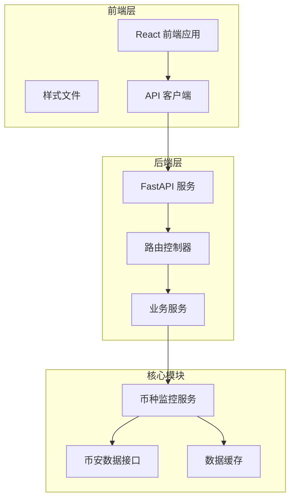
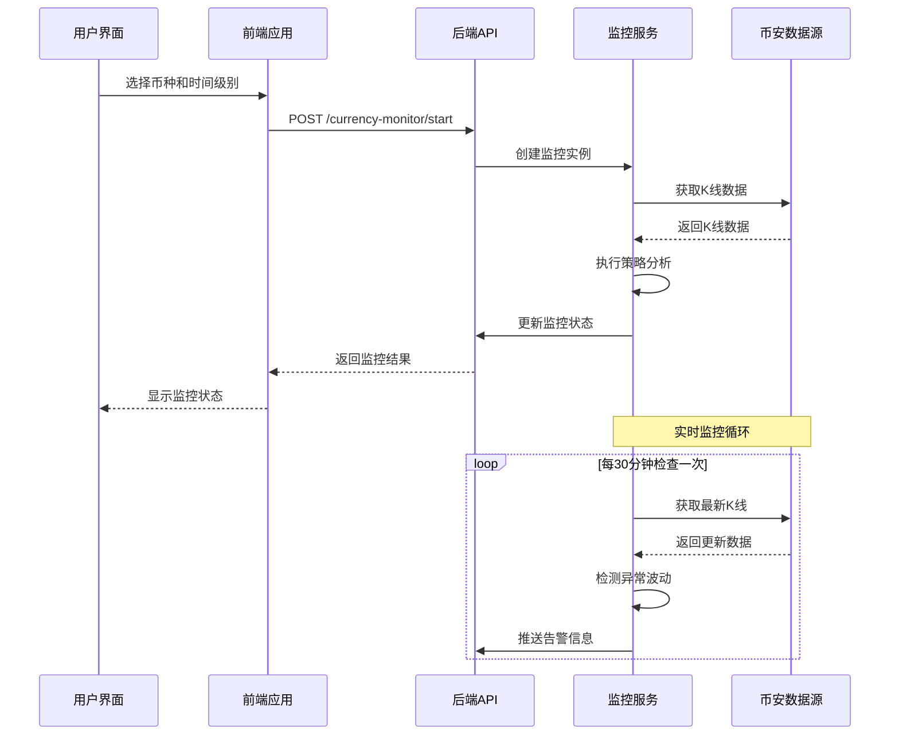
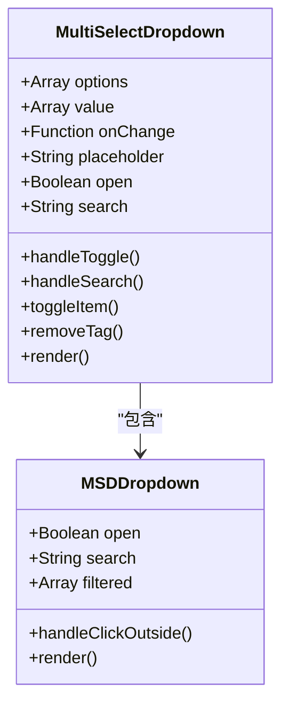
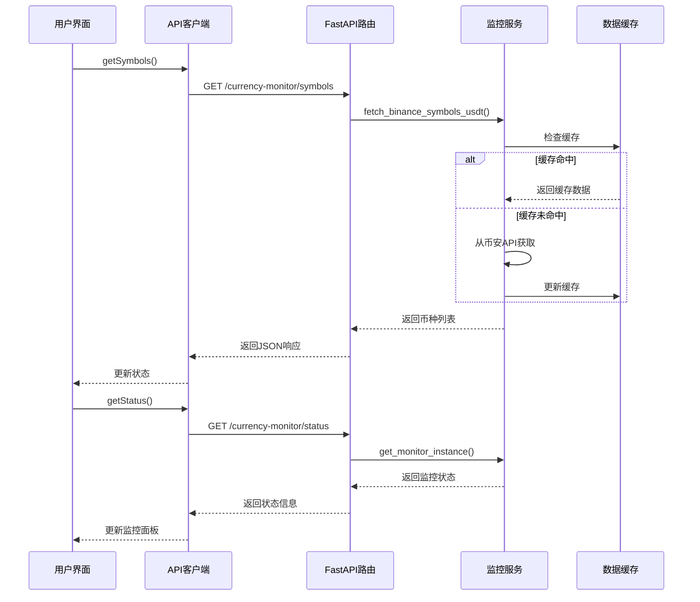
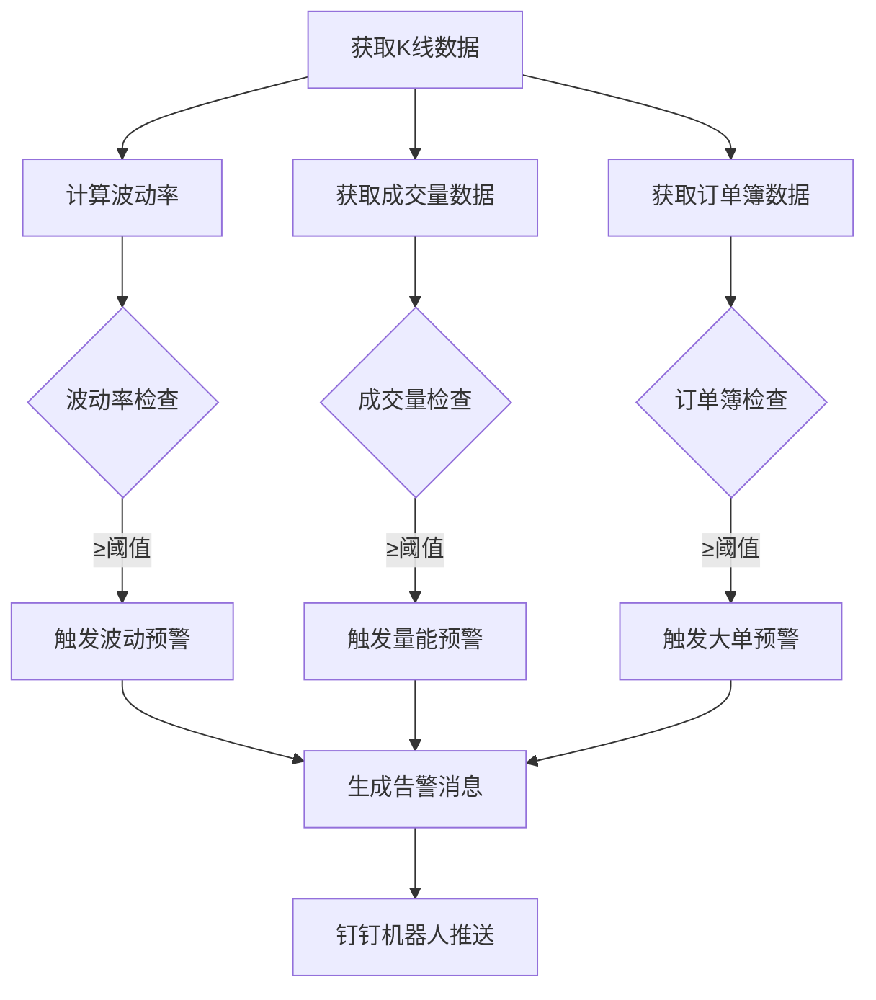
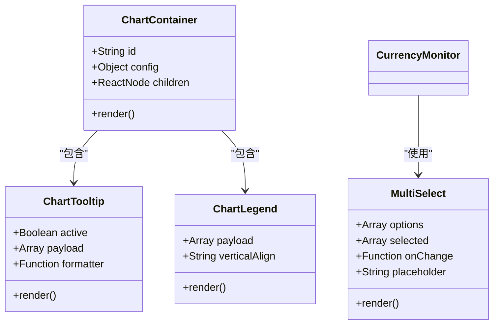
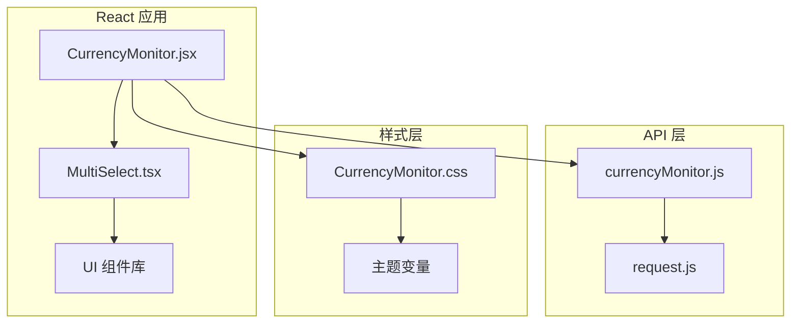
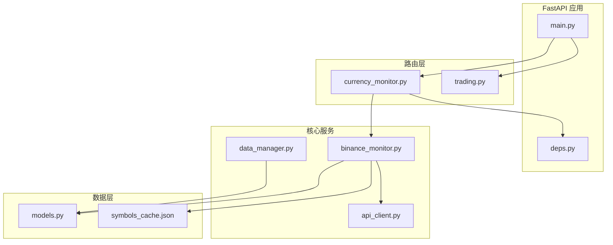

# 货币监控界面

<cite>
**本文档引用的文件**
- [CurrencyMonitor.jsx](file://backpack_quant_trading/frontend/src/views/CurrencyMonitor.jsx)
- [CurrencyMonitor.css](file://backpack_quant_trading/frontend/src/views/CurrencyMonitor.css)
- [currencyMonitor.js](file://backpack_quant_trading/frontend/src/api/currencyMonitor.js)
- [currency_monitor.py](file://backpack_quant_trading/api/routers/currency_monitor.py)
- [binance_monitor.py](file://backpack_quant_trading/core/binance_monitor.py)
- [CurrencyMonitorPage.tsx](file://backpack_quant_trading/frontend/src_a/app/components/CurrencyMonitorPage.tsx)
- [multi-select.tsx](file://backpack_quant_trading/frontend/src_a/app/components/ui/multi-select.tsx)
- [chart.tsx](file://backpack_quant_trading/frontend/src_a/app/components/ui/chart.tsx)
- [CurrencyMonitorPage.tsx](file://backpack_quant_trading/frontend/src_mon/app/components/CurrencyMonitorPage.tsx)
</cite>

## 目录
1. [简介](#简介)
2. [项目结构](#项目结构)
3. [核心组件](#核心组件)
4. [架构概览](#架构概览)
5. [详细组件分析](#详细组件分析)
6. [依赖关系分析](#依赖关系分析)
7. [性能考虑](#性能考虑)
8. [故障排除指南](#故障排除指南)
9. [结论](#结论)

## 简介

货币监控界面是一个综合性的金融数据监控平台，专为加密货币市场设计。该系统提供了实时汇率展示、价格波动监控和市场分析功能，支持多维度的市场监控和异动实时预警。

系统采用前后端分离架构，前端使用React构建用户界面，后端基于FastAPI提供RESTful API服务。核心功能包括：

- **实时货币监控**：支持多个币种和时间级别的同时监控
- **分钟预警系统**：基于波动率、成交量和订单簿的大额挂单检测
- **可视化图表**：提供直观的价格走势和波动分析界面
- **智能筛选**：支持按币种、时间级别和状态的多维筛选
- **通知机制**：集成钉钉机器人进行实时告警推送

## 项目结构

货币监控界面的项目结构采用模块化设计，主要分为以下几个层次：



**图表来源**
- [CurrencyMonitor.jsx:1-466](file://backpack_quant_trading/frontend/src/views/CurrencyMonitor.jsx#L1-L466)
- [currency_monitor.py:1-243](file://backpack_quant_trading/api/routers/currency_monitor.py#L1-L243)

**章节来源**
- [CurrencyMonitor.jsx:1-466](file://backpack_quant_trading/frontend/src/views/CurrencyMonitor.jsx#L1-L466)
- [currency_monitor.py:1-243](file://backpack_quant_trading/api/routers/currency_monitor.py#L1-L243)

## 核心组件

### 前端组件架构

货币监控界面由三个主要的前端组件构成：

#### 1. 货币监控主界面
- **MultiSelectDropdown**：自定义多选下拉组件，支持搜索和标签显示
- **状态管理**：实时监控状态、预警状态和用户配置
- **交互控制**：启动/停止监控、移除监控对、参数调整

#### 2. 监控配置面板
- **币种选择器**：支持多币种选择和搜索过滤
- **时间级别选择**：1小时、2小时、4小时、天、周等多级别支持
- **参数配置**：监控参数的动态调整界面

#### 3. 预警管理系统
- **分钟预警配置**：波动阈值、量能倍数、订单簿大单检测
- **实时状态显示**：监控中的币种列表和预警状态
- **通知机制**：集成钉钉机器人的实时告警推送

**章节来源**
- [CurrencyMonitor.jsx:14-87](file://backpack_quant_trading/frontend/src/views/CurrencyMonitor.jsx#L14-L87)
- [CurrencyMonitor.jsx:99-180](file://backpack_quant_trading/frontend/src/views/CurrencyMonitor.jsx#L99-L180)

### 后端服务架构

#### 1. API 路由层
- **符号列表接口**：获取币安USDT交易对列表
- **监控状态接口**：查询当前监控状态和配置
- **监控控制接口**：启动、停止和移除监控对
- **预警管理接口**：分钟预警的启动、停止和状态查询

#### 2. 业务服务层
- **BinanceMonitorService**：币种监控服务，处理K线数据和策略执行
- **BinanceMinuteAlertService**：分钟预警服务，检测异常波动和大额挂单
- **数据缓存管理**：币种列表缓存和配置持久化

**章节来源**
- [currency_monitor.py:24-86](file://backpack_quant_trading/api/routers/currency_monitor.py#L24-L86)
- [currency_monitor.py:157-242](file://backpack_quant_trading/api/routers/currency_monitor.py#L157-L242)

## 架构概览

货币监控界面采用分层架构设计，确保了系统的可扩展性和维护性：



**图表来源**
- [currency_monitor.py:89-125](file://backpack_quant_trading/api/routers/currency_monitor.py#L89-L125)
- [binance_monitor.py:713-747](file://backpack_quant_trading/core/binance_monitor.py#L713-L747)

### 数据流架构

```mermaid
flowchart TD
A[用户界面) --> B[前端状态管理]
B --> C[API 请求]
C --> D[FastAPI 路由]
D --> E[监控服务]
E --> F[币安数据接口]
F --> G[K线数据缓存]
E --> H[策略引擎]
H --> I[预警检测]
I --> J[钉钉告警]
E --> K[状态存储]
K --> L[数据库持久化]
L --> M[配置恢复]
```

**图表来源**
- [binance_monitor.py:658-792](file://backpack_quant_trading/core/binance_monitor.py#L658-L792)
- [currency_monitor.py:56-86](file://backpack_quant_trading/api/routers/currency_monitor.py#L56-L86)

## 详细组件分析

### 货币监控主界面组件

#### MultiSelectDropdown 组件
这是一个高度定制化的多选下拉组件，具有以下特性：



**图表来源**
- [CurrencyMonitor.jsx:15-87](file://backpack_quant_trading/frontend/src/views/CurrencyMonitor.jsx#L15-L87)

组件功能特点：
- **搜索过滤**：支持实时搜索和过滤币种列表
- **标签显示**：显示已选择的币种，超过5个时显示"更多"标签
- **多选支持**：支持同时选择多个币种
- **键盘导航**：支持键盘操作和无障碍访问

#### 监控状态管理
系统采用React Hooks进行状态管理，主要包括：

| 状态类型 | 数据结构 | 功能描述 |
|---------|----------|----------|
| symbolList | Array[string] | 币种列表数据源 |
| selectedSymbols | Array[string] | 用户选择的币种 |
| selectedTimeframes | Array[string] | 选择的时间级别 |
| status | Object | 监控器运行状态 |
| minuteStatus | Object | 分钟预警运行状态 |
| alertedPairs | Set | 触发预警的币种集合 |

**章节来源**
- [CurrencyMonitor.jsx:99-122](file://backpack_quant_trading/frontend/src/views/CurrencyMonitor.jsx#L99-L122)

### API 交互流程

#### 实时数据获取流程


**图表来源**
- [currencyMonitor.js:3-4](file://backpack_quant_trading/frontend/src/api/currencyMonitor.js#L3-L4)
- [currency_monitor.py:24-31](file://backpack_quant_trading/api/routers/currency_monitor.py#L24-L31)

**章节来源**
- [currencyMonitor.js:1-13](file://backpack_quant_trading/frontend/src/api/currencyMonitor.js#L1-L13)
- [currency_monitor.py:56-86](file://backpack_quant_trading/api/routers/currency_monitor.py#L56-L86)

### 预警检测算法

#### 分钟预警检测机制
系统实现了三种核心的预警检测机制：



**图表来源**
- [binance_monitor.py:231-315](file://backpack_quant_trading/core/binance_monitor.py#L231-L315)

预警检测参数配置：

| 参数名称 | 默认值 | 单位 | 描述 |
|---------|--------|------|------|
| vol_pct_threshold | 5.0 | % | 波动率阈值 |
| volume_mult_threshold | 20.0 | x | 成交量倍数阈值 |
| ob_notional_threshold | 200000.0 | USDT | 订单簿大单阈值 |
| ob_distance_pct | 0.003 | | 订单簿距离阈值 |
| depth_levels | 50 | 档 | 订单簿扫描深度 |
| cooldown_sec | 300 | 秒 | 冷却时间 |

**章节来源**
- [binance_monitor.py:231-315](file://backpack_quant_trading/core/binance_monitor.py#L231-L315)
- [currency_monitor.py:45-53](file://backpack_quant_trading/api/routers/currency_monitor.py#L45-L53)

### 数据可视化组件

#### 前端图表组件
系统集成了基于Recharts的图表组件，提供丰富的数据可视化功能：



**图表来源**
- [chart.tsx:37-70](file://backpack_quant_trading/frontend/src_a/app/components/ui/chart.tsx#L37-L70)
- [multi-select.tsx:19-45](file://backpack_quant_trading/frontend/src_a/app/components/ui/multi-select.tsx#L19-L45)

**章节来源**
- [chart.tsx:1-354](file://backpack_quant_trading/frontend/src_a/app/components/ui/chart.tsx#L1-L354)
- [multi-select.tsx:1-124](file://backpack_quant_trading/frontend/src_a/app/components/ui/multi-select.tsx#L1-L124)

## 依赖关系分析

### 前端依赖关系



**图表来源**
- [CurrencyMonitor.jsx:1-12](file://backpack_quant_trading/frontend/src/views/CurrencyMonitor.jsx#L1-L12)
- [currencyMonitor.js:1-1](file://backpack_quant_trading/frontend/src/api/currencyMonitor.js#L1-L1)

### 后端依赖关系



**图表来源**
- [currency_monitor.py:1-21](file://backpack_quant_trading/api/routers/currency_monitor.py#L1-L21)
- [binance_monitor.py:1-25](file://backpack_quant_trading/core/binance_monitor.py#L1-L25)

**章节来源**
- [CurrencyMonitor.jsx:1-12](file://backpack_quant_trading/frontend/src/views/CurrencyMonitor.jsx#L1-L12)
- [currency_monitor.py:1-21](file://backpack_quant_trading/api/routers/currency_monitor.py#L1-L21)

## 性能考虑

### 前端性能优化

#### 1. 状态管理优化
- **状态分片**：将大型状态分解为独立的状态片段，减少不必要的重渲染
- **useMemo/useCallback**：对昂贵的计算和回调函数进行缓存
- **虚拟滚动**：对于大量数据的列表使用虚拟滚动技术

#### 2. 图表性能优化
- **数据采样**：对大量数据进行采样，避免过度渲染
- **懒加载**：图表组件按需加载，减少初始加载时间
- **Canvas 渲染**：对于大数据集使用Canvas进行高性能渲染

#### 3. 缓存策略
- **本地缓存**：使用localStorage缓存用户配置和偏好设置
- **会话缓存**：缓存短期数据，如最近的监控状态
- **CDN 加速**：静态资源通过CDN加速加载

### 后端性能优化

#### 1. 数据缓存
- **币种列表缓存**：币安交易对列表缓存24小时，减少API调用
- **配置持久化**：监控配置存储在数据库中，支持服务重启后的恢复
- **内存缓存**：热点数据存储在内存中，提高访问速度

#### 2. 并发处理
- **线程池**：使用线程池处理并发的API请求
- **异步I/O**：采用异步编程模型处理高并发场景
- **连接池**：数据库和外部API连接池管理

#### 3. 网络优化
- **请求合并**：将多个小请求合并为批量请求
- **压缩传输**：启用Gzip压缩减少网络传输量
- **超时控制**：合理的超时设置避免请求阻塞

**章节来源**
- [binance_monitor.py:442-513](file://backpack_quant_trading/core/binance_monitor.py#L442-L513)
- [currency_monitor.py:128-137](file://backpack_quant_trading/api/routers/currency_monitor.py#L128-L137)

## 故障排除指南

### 常见问题及解决方案

#### 1. 监控数据延迟
**症状**：监控数据显示延迟或不准确
**可能原因**：
- 币安API限流
- 网络连接不稳定
- 服务器时钟不同步

**解决步骤**：
1. 检查币安API状态和限流情况
2. 验证网络连接质量
3. 同步系统时钟
4. 调整轮询间隔参数

#### 2. 预警通知失败
**症状**：钉钉告警无法正常接收
**可能原因**：
- 钉钉机器人配置错误
- 网络连接问题
- API调用频率限制

**解决步骤**：
1. 验证钉钉机器人的Webhook地址
2. 检查网络防火墙设置
3. 查看API调用日志
4. 调整告警推送频率

#### 3. 前端界面卡顿
**症状**：页面响应缓慢或界面冻结
**可能原因**：
- 大量数据渲染
- 内存泄漏
- 事件监听器过多

**解决步骤**：
1. 使用浏览器开发者工具分析性能
2. 实施虚拟滚动技术
3. 优化组件渲染逻辑
4. 清理未使用的事件监听器

### 调试工具和方法

#### 1. 前端调试
- **React DevTools**：分析组件树和状态变化
- **Network面板**：监控API请求和响应
- **Performance面板**：分析JavaScript执行性能

#### 2. 后端调试
- **日志分析**：查看详细的执行日志
- **性能监控**：监控CPU和内存使用情况
- **数据库查询**：分析慢查询和索引使用

**章节来源**
- [binance_monitor.py:605-655](file://backpack_quant_trading/core/binance_monitor.py#L605-L655)
- [currency_monitor.py:157-242](file://backpack_quant_trading/api/routers/currency_monitor.py#L157-L242)

## 结论

货币监控界面是一个功能完整、架构清晰的金融数据监控平台。系统通过前后端分离的设计，实现了高效的实时数据处理和用户交互体验。

### 主要优势

1. **实时性强**：采用轮询机制和事件驱动相结合的方式，确保数据的及时性
2. **可扩展性好**：模块化设计便于功能扩展和维护
3. **用户体验佳**：直观的界面设计和流畅的交互体验
4. **稳定性高**：完善的错误处理和性能优化机制

### 技术特色

- **多维度监控**：支持多种时间级别和币种的组合监控
- **智能预警**：基于多种指标的综合预警机制
- **可视化展示**：丰富的图表和数据展示功能
- **通知机制**：集成多种通知渠道的告警系统

### 发展建议

1. **增强移动端适配**：优化移动设备上的用户体验
2. **增加更多数据源**：支持其他交易所和数据提供商
3. **机器学习集成**：引入AI算法进行更精准的预测分析
4. **高级图表功能**：提供更丰富的技术分析工具

该系统为金融数据监控领域提供了一个优秀的参考实现，具有良好的扩展性和实用性。