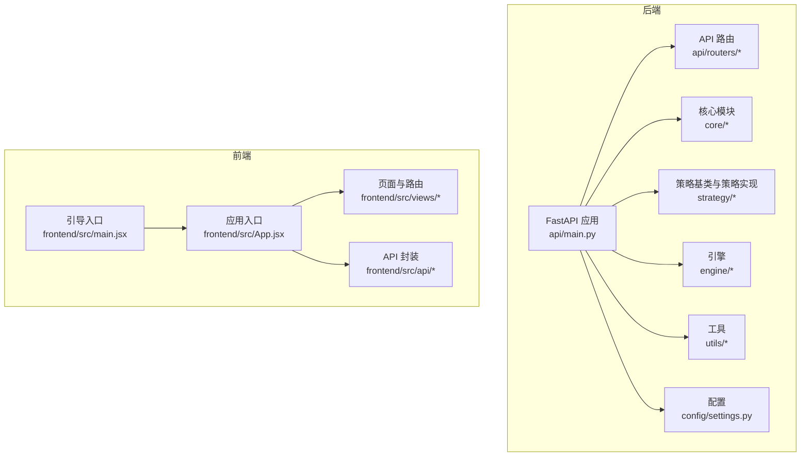
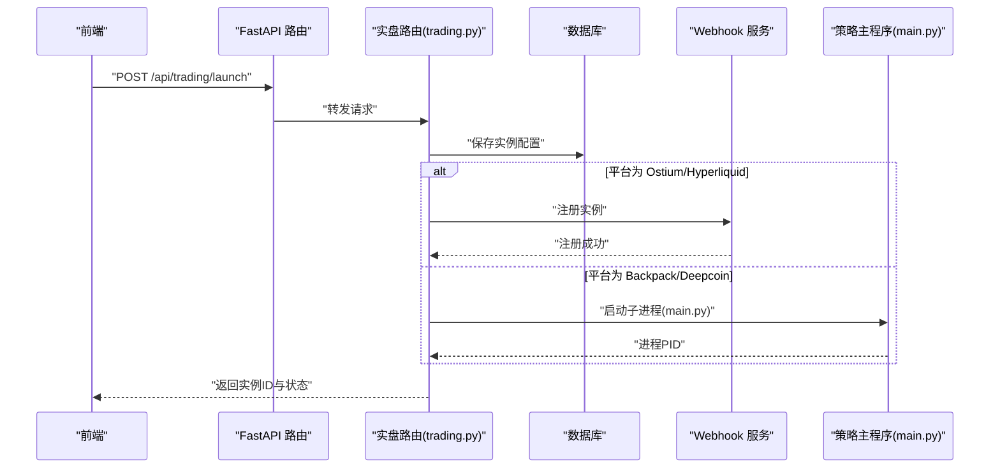
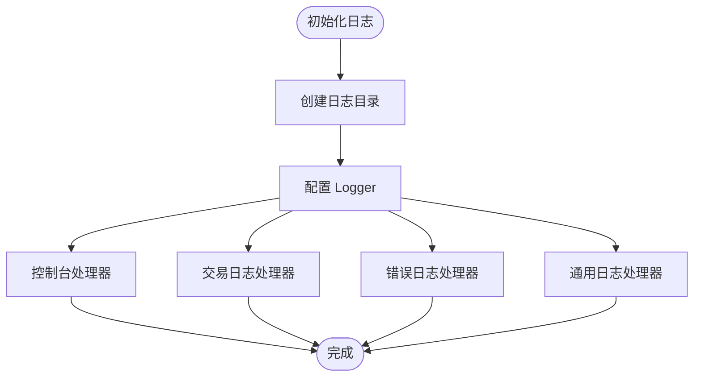
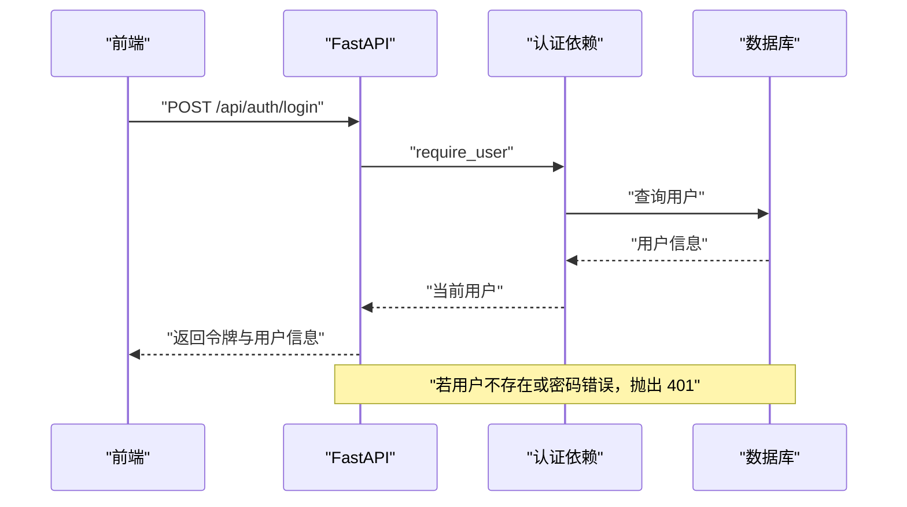
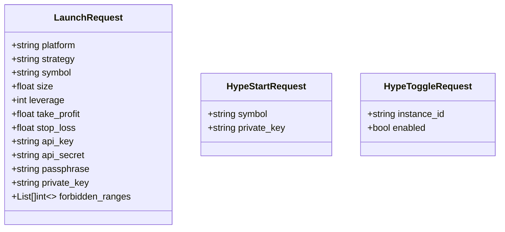
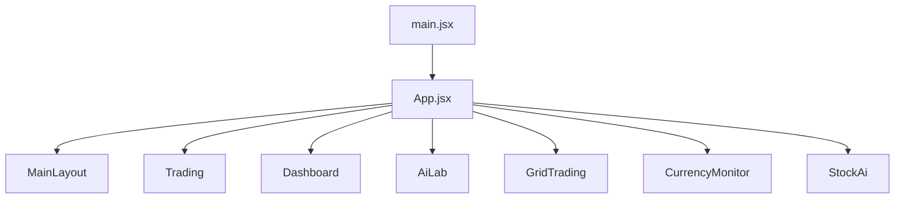
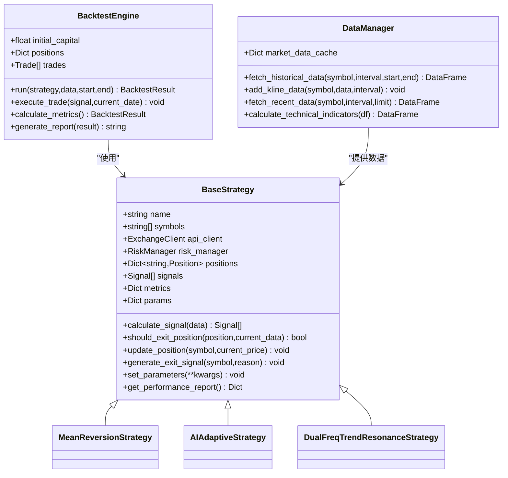
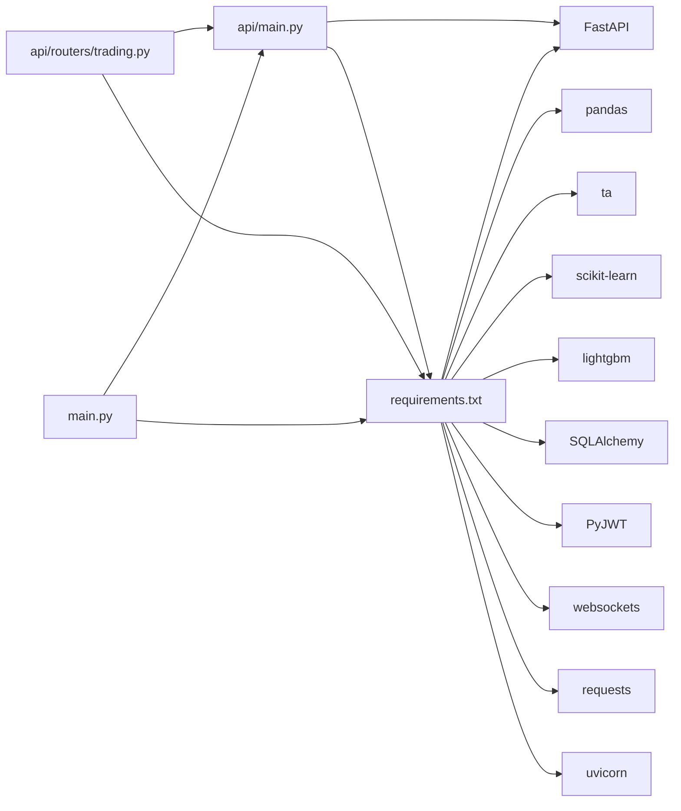

# 代码规范

<cite>
**本文引用的文件**   
- [main.py](file://backpack_quant_trading/main.py)
- [run_api.py](file://backpack_quant_trading/run_api.py)
- [settings.py](file://backpack_quant_trading/config/settings.py)
- [logger.py](file://backpack_quant_trading/utils/logger.py)
- [requirements.txt](file://backpack_quant_trading/requirements.txt)
- [main.py](file://backpack_quant_trading/api/main.py)
- [base.py](file://backpack_quant_trading/strategy/base.py)
- [backtest.py](file://backpack_quant_trading/engine/backtest.py)
- [data_manager.py](file://backpack_quant_trading/core/data_manager.py)
- [trading.py](file://backpack_quant_trading/api/routers/trading.py)
- [auth.py](file://backpack_quant_trading/api/routers/auth.py)
- [deps.py](file://backpack_quant_trading/api/deps.py)
- [App.jsx](file://backpack_quant_trading/frontend/src/App.jsx)
- [main.jsx](file://backpack_quant_trading/frontend/src/main.jsx)
- [Frontend_readme.md](file://backpack_quant_trading/Frontend_readme.md)
</cite>

## 目录
1. [简介](#简介)
2. [项目结构](#项目结构)
3. [核心组件](#核心组件)
4. [架构总览](#架构总览)
5. [详细组件分析](#详细组件分析)
6. [依赖分析](#依赖分析)
7. [性能考虑](#性能考虑)
8. [故障排查指南](#故障排查指南)
9. [结论](#结论)
10. [附录](#附录)

## 简介
本文件为量化交易系统“Backpack 量化交易系统”的代码规范文档，面向后端 Python 与前端 React/Vue 技术栈，覆盖以下主题：
- Python 代码风格与命名约定
- 函数与类的组织结构
- 日志记录规范与错误处理模式
- API 接口设计规范与前端组件命名、状态管理约定
- 代码审查检查清单、单元测试编写标准与文档注释要求
- 通过编码约定保障代码质量与可维护性的实践建议

## 项目结构
项目采用“后端 FastAPI + 前端 React/Vue3 + 多策略引擎 + 风控与数据层”的分层架构。后端负责策略调度、实盘交易、Webhook 管理、日志与配置；前端负责页面路由、状态管理与交互。

图示来源
- [main.py](file://backpack_quant_trading/api/main.py)
- [trading.py](file://backpack_quant_trading/api/routers/trading.py)
- [base.py](file://backpack_quant_trading/strategy/base.py)
- [backtest.py](file://backpack_quant_trading/engine/backtest.py)
- [data_manager.py](file://backpack_quant_trading/core/data_manager.py)
- [logger.py](file://backpack_quant_trading/utils/logger.py)
- [settings.py](file://backpack_quant_trading/config/settings.py)
- [App.jsx](file://backpack_quant_trading/frontend/src/App.jsx)
- [main.jsx](file://backpack_quant_trading/frontend/src/main.jsx)

章节来源
- [Frontend_readme.md](file://backpack_quant_trading/Frontend_readme.md)
- [main.py](file://backpack_quant_trading/api/main.py)
- [App.jsx](file://backpack_quant_trading/frontend/src/App.jsx)

## 核心组件
- 配置中心：集中管理各交易所与交易参数，统一项目根目录、日志与数据目录。
- 日志系统：提供控制台与多文件轮转日志，支持交易专用日志器。
- 数据管理层：负责历史与实时数据获取、清洗、缓存与技术指标计算。
- 策略基类：定义信号、仓位、风控与性能指标接口，约束策略实现。
- 回测引擎：基于 OHLCV 与策略信号执行交易，计算收益、夏普、最大回撤等指标。
- 实盘引擎与 Webhook：支持多交易所与多策略实例管理，提供启动、停止、状态查询与日志聚合。
- API 层：提供认证、实盘实例管理、HYPE 策略管理、日志查询等接口。
- 前端：路由与页面组件，状态管理与 API 调用封装。

章节来源
- [settings.py](file://backpack_quant_trading/config/settings.py)
- [logger.py](file://backpack_quant_trading/utils/logger.py)
- [data_manager.py](file://backpack_quant_trading/core/data_manager.py)
- [base.py](file://backpack_quant_trading/strategy/base.py)
- [backtest.py](file://backpack_quant_trading/engine/backtest.py)
- [trading.py](file://backpack_quant_trading/api/routers/trading.py)
- [auth.py](file://backpack_quant_trading/api/routers/auth.py)
- [deps.py](file://backpack_quant_trading/api/deps.py)

## 架构总览
系统通过 FastAPI 提供统一 API，后端策略与引擎模块负责业务逻辑，前端通过路由与组件展示数据与交互。日志与配置贯穿全链路，保证可观测性与一致性。

图示来源
- [trading.py](file://backpack_quant_trading/api/routers/trading.py)
- [main.py](file://backpack_quant_trading/main.py)

## 详细组件分析

### Python 代码风格与命名约定
- 模块与包
  - 模块名使用小写与下划线，避免缩写；路由模块置于 routers 包内。
  - 示例：api/routers/trading.py、core/data_manager.py、strategy/base.py。
- 类与接口
  - 类名使用 PascalCase；抽象基类以 Base 前缀命名，如 BaseStrategy。
  - 字段与属性使用 snake_case；常量使用 UPPER_CASE。
- 函数与方法
  - 函数名使用 snake_case；私有方法以下划线开头；异步函数以 async/await 明确标注。
  - 方法参数顺序：必填参数在前，可选参数在后；默认值为 None 或明确类型。
- 常量与配置
  - 配置项使用 UPPER_CASE；敏感信息通过环境变量注入。
- 导入与依赖
  - 标准库优先；第三方库次之；项目内相对导入清晰明确。
- 注释与文档
  - 模块顶部提供简要说明；复杂函数/类提供 docstring；必要处补充行内注释。

章节来源
- [base.py](file://backpack_quant_trading/strategy/base.py)
- [backtest.py](file://backpack_quant_trading/engine/backtest.py)
- [data_manager.py](file://backpack_quant_trading/core/data_manager.py)
- [settings.py](file://backpack_quant_trading/config/settings.py)

### 日志记录规范
- 日志器初始化
  - 根据名称配置 logger，支持控制台与文件处理器；文件按大小轮转，避免 Windows 权限问题。
  - 交易专用日志器提供订单、成交、信号、错误与风险事件记录方法。
- 日志级别与内容
  - INFO：关键流程与状态；DEBUG：细节与调试；WARNING：潜在问题；ERROR：异常与错误。
  - 日志格式包含时间、级别、模块名与行号，便于定位。
- 日志文件
  - trades.log：交易明细；errors.log：错误；app_YYYYMMDD.log：通用应用日志。
  - 交易日志器输出结构化消息，便于解析与检索。

图示来源
- [logger.py](file://backpack_quant_trading/utils/logger.py)

章节来源
- [logger.py](file://backpack_quant_trading/utils/logger.py)

### 错误处理与异常管理
- 统一异常处理
  - API 层使用 HTTPException 返回错误码与消息；捕获异常后记录日志并返回友好提示。
  - 后端主流程对键盘中断与异常进行捕获，确保资源释放与优雅退出。
- 策略与引擎
  - 回测引擎在执行交易与计算指标时进行边界检查与异常捕获，避免 NaN 传播。
  - 数据管理层对时间戳、价格与成交量进行安全转换与清洗，过滤无效数据。
- 前端
  - 前端路由守卫在未登录时重定向至登录页；API 调用失败时提示用户。

图示来源
- [auth.py](file://backpack_quant_trading/api/routers/auth.py)
- [deps.py](file://backpack_quant_trading/api/deps.py)

章节来源
- [trading.py](file://backpack_quant_trading/api/routers/trading.py)
- [main.py](file://backpack_quant_trading/main.py)
- [backtest.py](file://backpack_quant_trading/engine/backtest.py)
- [data_manager.py](file://backpack_quant_trading/core/data_manager.py)
- [auth.py](file://backpack_quant_trading/api/routers/auth.py)
- [deps.py](file://backpack_quant_trading/api/deps.py)

### API 接口设计规范
- 路由组织
  - 按功能划分路由模块，统一前缀与标签；如 /api/trading、/api/auth、/api/strategy 等。
- 请求与响应
  - 使用 Pydantic BaseModel 定义请求体；响应统一为 JSON 对象，包含状态与数据。
  - 认证：支持 Bearer Token 与 Cookie；未登录返回 401。
- 实盘实例管理
  - 支持启动、停止、状态查询与日志聚合；区分 Webhook 与子进程两种运行模式。
- HYPE 自适应做空策略
  - 专用端点启动/停止/切换；使用线程+事件循环运行，独立于 Webhook。

图示来源
- [trading.py](file://backpack_quant_trading/api/routers/trading.py)

章节来源
- [main.py](file://backpack_quant_trading/api/main.py)
- [trading.py](file://backpack_quant_trading/api/routers/trading.py)
- [auth.py](file://backpack_quant_trading/api/routers/auth.py)
- [deps.py](file://backpack_quant_trading/api/deps.py)

### 前端组件命名与状态管理约定
- 组件命名
  - 页面组件使用名词短语，如 Trading、Dashboard、AiLab；视图组件以视图名命名。
  - 布局组件以 Layout 结尾，如 MainLayout。
- 路由与导航
  - 使用 React Router v6；路由守卫 RequireAuth/GuestOnly 控制访问。
  - 根路径重定向至 trading；子路径对应各功能页面。
- 状态管理
  - 采用 React 状态与本地存储；组件内部状态为主，全局状态通过 props 与上下文传递。
  - API 封装统一在 frontend/src/api 下，按模块拆分，便于维护与测试。
- 启动与开发
  - Vite 代理 /api 到后端；开发模式下前后端分离，生产模式后端挂载前端静态资源。

图示来源
- [main.jsx](file://backpack_quant_trading/frontend/src/main.jsx)
- [App.jsx](file://backpack_quant_trading/frontend/src/App.jsx)

章节来源
- [Frontend_readme.md](file://backpack_quant_trading/Frontend_readme.md)
- [main.jsx](file://backpack_quant_trading/frontend/src/main.jsx)
- [App.jsx](file://backpack_quant_trading/frontend/src/App.jsx)

### 策略与引擎组织
- 策略基类
  - 定义 Position、Signal 数据类与抽象方法 calculate_signal、should_exit_position。
  - 提供参数设置、性能指标计算与仓位更新逻辑。
- 回测引擎
  - 支持多空双向持仓、滑点与手续费模拟；计算总收益、年化收益、夏普比率、最大回撤、胜率与盈利因子。
  - 预热期跳过前 N 根 K 线，避免指标漂移影响。
- 数据管理层
  - 提供历史数据获取、实时数据追加、缓存与技术指标计算；清洗无效数据并处理时间戳与时区。

图示来源
- [base.py](file://backpack_quant_trading/strategy/base.py)
- [backtest.py](file://backpack_quant_trading/engine/backtest.py)
- [data_manager.py](file://backpack_quant_trading/core/data_manager.py)

章节来源
- [base.py](file://backpack_quant_trading/strategy/base.py)
- [backtest.py](file://backpack_quant_trading/engine/backtest.py)
- [data_manager.py](file://backpack_quant_trading/core/data_manager.py)

### 配置与运行
- 配置中心
  - 使用 dataclass 组织各模块配置；统一项目根目录、数据与日志目录；数据库 URL 动态拼接。
- 运行入口
  - 后端开发模式启动脚本；主程序支持回测与实盘模式，参数驱动策略与交易所选择。
- 依赖管理
  - requirements.txt 明确列出核心库与功能模块依赖，便于安装与升级。

章节来源
- [settings.py](file://backpack_quant_trading/config/settings.py)
- [run_api.py](file://backpack_quant_trading/run_api.py)
- [main.py](file://backpack_quant_trading/main.py)
- [requirements.txt](file://backpack_quant_trading/requirements.txt)

## 依赖分析
- 外部依赖
  - 异步网络：aiohttp、websockets、requests
  - Web 框架：fastapi、uvicorn
  - 数据处理：pandas、numpy、scipy、ta
  - 数据库：SQLAlchemy、pymysql
  - 安全与加密：cryptography、PyJWT、passlib
  - 可视化：matplotlib、plotly、dash
  - 机器学习：lightgbm、scikit-learn
  - Web3：web3、eth-account
- 内部依赖
  - API 路由依赖策略注册表与数据库模型；策略依赖数据管理与风控模块；引擎依赖策略与数据。

图示来源
- [requirements.txt](file://backpack_quant_trading/requirements.txt)
- [main.py](file://backpack_quant_trading/api/main.py)
- [trading.py](file://backpack_quant_trading/api/routers/trading.py)

章节来源
- [requirements.txt](file://backpack_quant_trading/requirements.txt)
- [main.py](file://backpack_quant_trading/api/main.py)
- [trading.py](file://backpack_quant_trading/api/routers/trading.py)

## 性能考虑
- 数据缓存与清洗
  - 使用类级缓存与 TTL 控制，避免重复拉取；对时间戳与时区进行统一转换，减少解析成本。
- 回测指标计算
  - 使用向量化计算与滚动窗口，避免逐行遍历；预热期跳过指标不稳定期。
- 异步与并发
  - 异步接口与事件循环结合，避免阻塞；Webhook 与子进程模式分离，降低耦合。
- I/O 与日志
  - 文件轮转与行缓冲，提升日志写入效率；交易日志器输出结构化消息，便于后续分析。

## 故障排查指南
- 启动与端口
  - 后端启动失败：检查端口占用与环境变量；确认 PYTHONPATH 与工作目录正确。
- 认证与权限
  - 401 未登录：确认令牌有效与未过期；检查 Cookie 与 Bearer Token。
- 实盘实例
  - Webhook 未运行：检查端口占用与进程状态；确认注册请求可达。
  - 子进程未停止：检查 PID 文件与进程树清理。
- 日志定位
  - 查看 trades.log、errors.log 与 app_YYYYMMDD.log；结合前端“获取实时日志”接口定位问题。
- 数据异常
  - 无效 K 线：检查时间戳格式与时区；确认价格与成交量非零与合理范围。

章节来源
- [run_api.py](file://backpack_quant_trading/run_api.py)
- [trading.py](file://backpack_quant_trading/api/routers/trading.py)
- [logger.py](file://backpack_quant_trading/utils/logger.py)

## 结论
本规范通过统一的代码风格、日志与错误处理、API 设计与前端约定，确保系统在高并发与复杂策略场景下的稳定性与可维护性。建议在持续集成中加入静态检查与单元测试，进一步提升质量与交付效率。

## 附录

### 代码审查检查清单
- 命名与结构
  - 模块、类、函数命名是否符合约定；类层次是否清晰；依赖是否单一职责。
- 日志与错误
  - 是否使用统一日志器；错误是否被捕获并记录；异常信息是否可读。
- API 设计
  - 路由是否按功能划分；请求/响应是否使用 BaseModel；认证是否完善。
- 性能与健壮性
  - 是否避免重复计算与 I/O；边界条件与异常路径是否覆盖；缓存与超时是否合理。
- 前端规范
  - 组件命名与路由是否一致；状态管理是否简洁；API 封装是否模块化。

### 单元测试编写标准
- 测试粒度
  - 函数级：覆盖正常与异常分支；类级：构造、方法与边界条件。
- 断言与期望
  - 使用明确断言，关注输入输出与副作用；对异步函数使用事件循环。
- Mock 与隔离
  - 对外部依赖进行 Mock；保持测试独立，避免共享状态。
- 覆盖率与回归
  - 关键路径覆盖率不低于阈值；回归测试随变更同步更新。

### 文档注释要求
- 模块注释
  - 模块顶部提供目的、功能与使用说明。
- 函数/方法注释
  - 参数类型与含义、返回值、异常与注意事项；复杂算法提供步骤说明。
- 类注释
  - 类职责、关键属性与公共方法；继承关系与使用示例。
- API 注释
  - 请求体与响应体结构；状态码与错误说明；示例与注意事项。