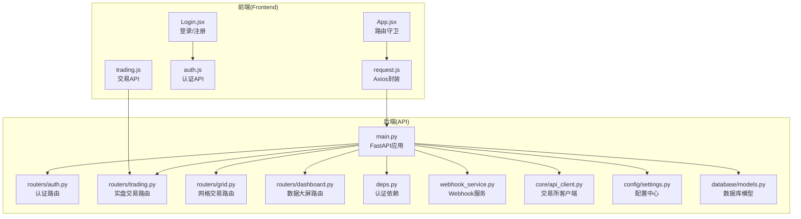
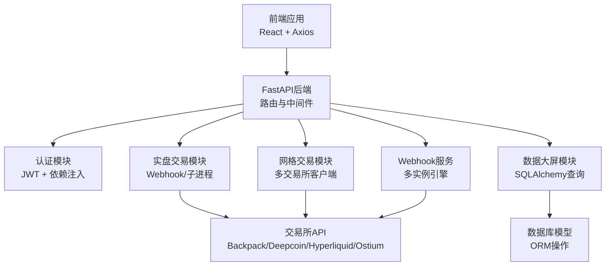
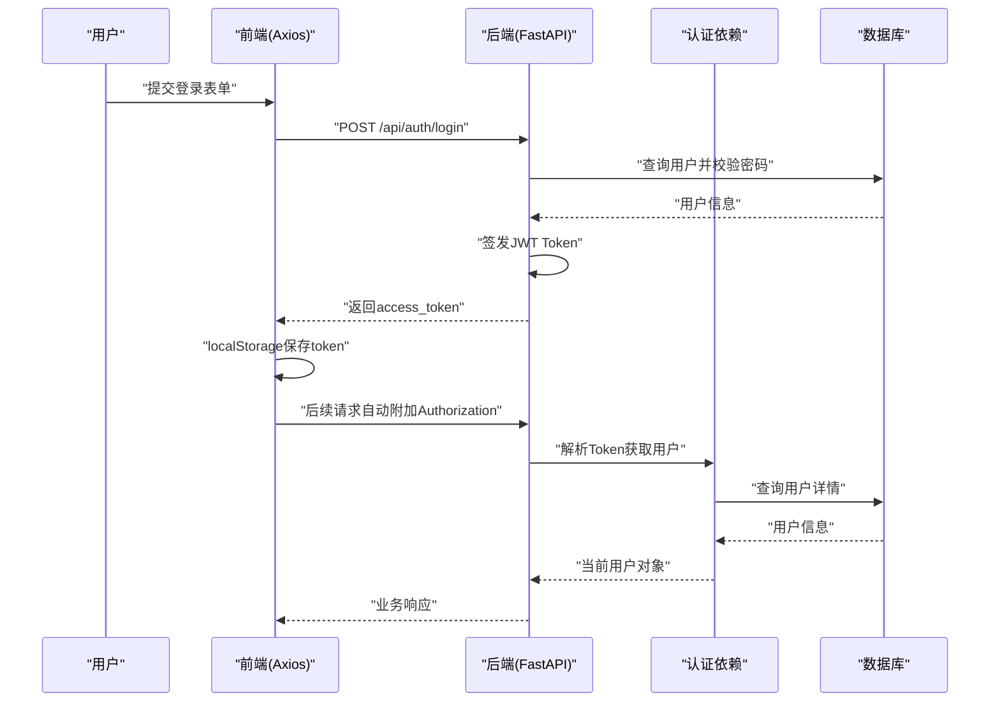
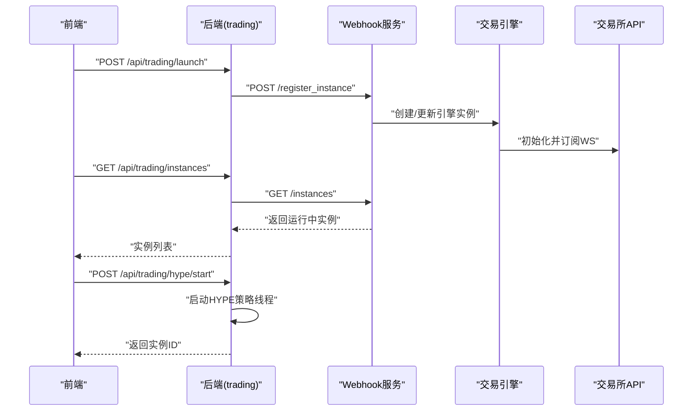
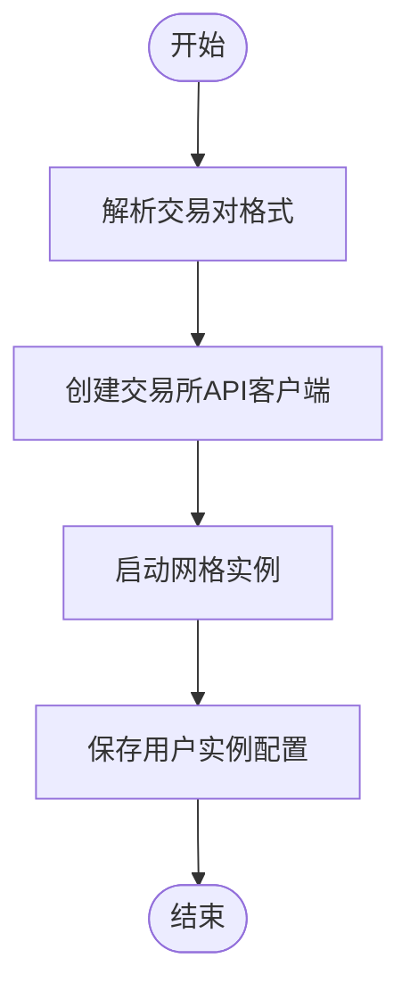
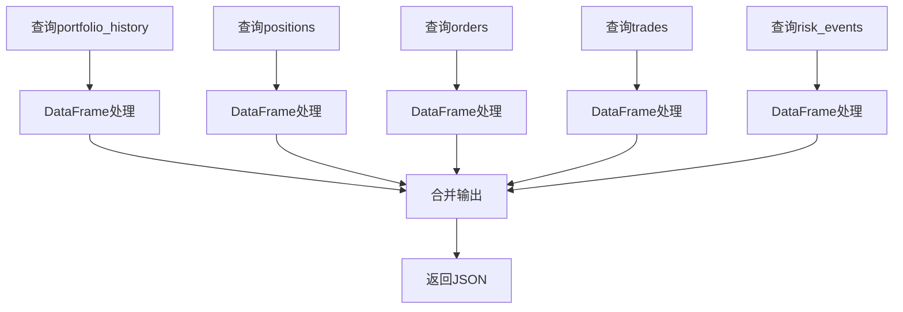
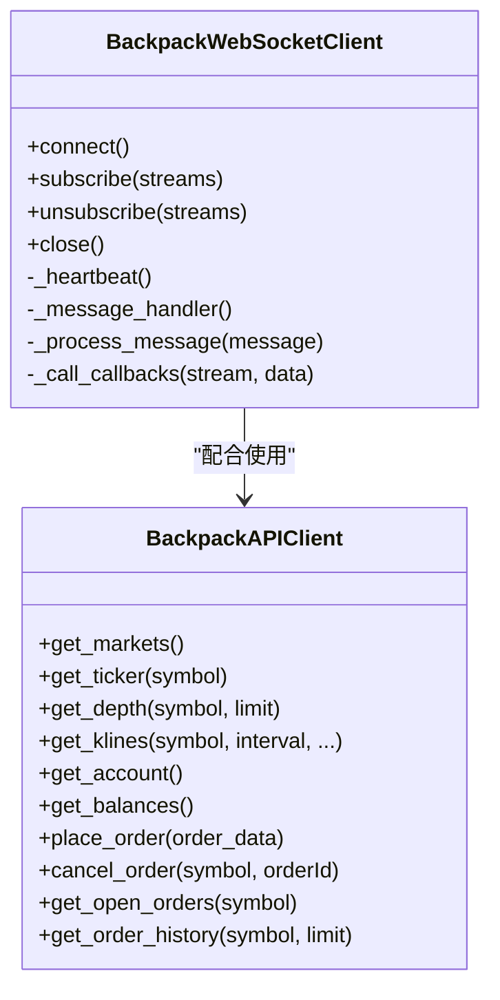
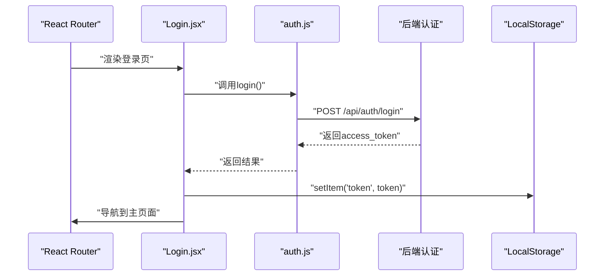
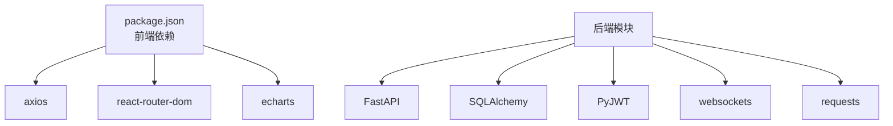

# API集成模式

<cite>
**本文档引用的文件**
- [api/main.py](file://backpack_quant_trading/api/main.py)
- [api/deps.py](file://backpack_quant_trading/api/deps.py)
- [api/routers/auth.py](file://backpack_quant_trading/api/routers/auth.py)
- [api/routers/trading.py](file://backpack_quant_trading/api/routers/trading.py)
- [api/routers/grid.py](file://backpack_quant_trading/api/routers/grid.py)
- [api/routers/dashboard.py](file://backpack_quant_trading/api/routers/dashboard.py)
- [frontend/src/api/request.js](file://backpack_quant_trading/frontend/src/api/request.js)
- [frontend/src/api/auth.js](file://backpack_quant_trading/frontend/src/api/auth.js)
- [frontend/src/api/trading.js](file://backpack_quant_trading/frontend/src/api/trading.js)
- [frontend/src/views/Login.jsx](file://backpack_quant_trading/frontend/src/views/Login.jsx)
- [frontend/src/App.jsx](file://backpack_quant_trading/frontend/src/App.jsx)
- [config/settings.py](file://backpack_quant_trading/config/settings.py)
- [core/api_client.py](file://backpack_quant_trading/core/api_client.py)
- [database/models.py](file://backpack_quant_trading/database/models.py)
- [webhook_service.py](file://backpack_quant_trading/webhook_service.py)
- [frontend/package.json](file://backpack_quant_trading/frontend/package.json)
</cite>

## 目录
1. [简介](#简介)
2. [项目结构](#项目结构)
3. [核心组件](#核心组件)
4. [架构总览](#架构总览)
5. [详细组件分析](#详细组件分析)
6. [依赖关系分析](#依赖关系分析)
7. [性能考虑](#性能考虑)
8. [故障排除指南](#故障排除指南)
9. [结论](#结论)
10. [附录](#附录)

## 简介
本指南面向API集成模式，系统阐述前端与后端之间的通信机制，涵盖请求封装、响应处理、错误管理、认证流程、Token管理、权限控制、RESTful调用模式、数据格式转换、状态同步、WebSocket连接处理、实时数据更新、消息队列管理、API版本控制、缓存策略以及离线处理方案。文档基于实际代码库进行深入分析，提供可视化图示与实践建议，帮助开发者快速理解并高效集成。

## 项目结构
该项目采用前后端分离架构：后端使用FastAPI提供REST API与WebSocket服务，前端使用React+Vite构建SPA并通过Axios封装HTTP请求。核心模块包括认证、实盘交易、网格交易、数据大屏、配置管理、数据库模型以及Webhook服务。

**图表来源**
- [api/main.py:1-98](file://backpack_quant_trading/api/main.py#L1-L98)
- [frontend/src/App.jsx:1-76](file://backpack_quant_trading/frontend/src/App.jsx#L1-L76)
- [frontend/src/api/request.js:1-33](file://backpack_quant_trading/frontend/src/api/request.js#L1-L33)
- [api/routers/auth.py:1-79](file://backpack_quant_trading/api/routers/auth.py#L1-L79)
- [api/routers/trading.py:1-561](file://backpack_quant_trading/api/routers/trading.py#L1-L561)
- [api/routers/grid.py:1-162](file://backpack_quant_trading/api/routers/grid.py#L1-L162)
- [api/routers/dashboard.py:1-131](file://backpack_quant_trading/api/routers/dashboard.py#L1-L131)
- [api/deps.py:1-73](file://backpack_quant_trading/api/deps.py#L1-L73)
- [webhook_service.py:1-598](file://backpack_quant_trading/webhook_service.py#L1-L598)
- [core/api_client.py:1-800](file://backpack_quant_trading/core/api_client.py#L1-L800)
- [config/settings.py:1-137](file://backpack_quant_trading/config/settings.py#L1-L137)
- [database/models.py:1-721](file://backpack_quant_trading/database/models.py#L1-L721)

**章节来源**
- [api/main.py:1-98](file://backpack_quant_trading/api/main.py#L1-L98)
- [frontend/src/App.jsx:1-76](file://backpack_quant_trading/frontend/src/App.jsx#L1-L76)

## 核心组件
- 前端Axios封装：统一设置baseURL、超时、携带凭证，拦截请求添加Authorization头，拦截响应处理401并跳转登录。
- 后端FastAPI应用：注册CORS、挂载路由、静态文件托管、健康检查。
- 认证与权限：JWT签发与校验、Bearer Token与Cookie双通道、依赖注入获取当前用户、require_user强制登录。
- 交易与网格：实盘交易路由支持多交易所、Webhook模式与子进程模式；网格交易路由支持多交易所API客户端。
- 数据大屏：基于SQLAlchemy读取数据库，聚合概览、净值曲线、持仓、订单、成交、风险事件。
- 配置中心：集中管理各交易所API地址、WS地址、密钥、数据库连接、交易参数等。
- 数据库模型：定义订单、仓位、成交、账户余额、风险事件、组合净值等表结构与ORM操作。
- Webhook服务：多实例引擎管理、签名验证、广播与单实例路由、动态配置更新、余额查询。

**章节来源**
- [frontend/src/api/request.js:1-33](file://backpack_quant_trading/frontend/src/api/request.js#L1-L33)
- [api/main.py:14-98](file://backpack_quant_trading/api/main.py#L14-L98)
- [api/deps.py:28-73](file://backpack_quant_trading/api/deps.py#L28-L73)
- [api/routers/trading.py:334-561](file://backpack_quant_trading/api/routers/trading.py#L334-L561)
- [api/routers/grid.py:101-162](file://backpack_quant_trading/api/routers/grid.py#L101-L162)
- [api/routers/dashboard.py:26-131](file://backpack_quant_trading/api/routers/dashboard.py#L26-L131)
- [config/settings.py:104-137](file://backpack_quant_trading/config/settings.py#L104-L137)
- [database/models.py:267-721](file://backpack_quant_trading/database/models.py#L267-L721)
- [webhook_service.py:83-598](file://backpack_quant_trading/webhook_service.py#L83-L598)

## 架构总览
下图展示从前端到后端、再到交易所API与数据库的整体交互流程，包括认证、交易、网格、数据大屏与Webhook服务的关键节点。

**图表来源**
- [api/main.py:36-48](file://backpack_quant_trading/api/main.py#L36-L48)
- [api/deps.py:44-73](file://backpack_quant_trading/api/deps.py#L44-L73)
- [api/routers/trading.py:334-462](file://backpack_quant_trading/api/routers/trading.py#L334-L462)
- [api/routers/grid.py:101-139](file://backpack_quant_trading/api/routers/grid.py#L101-L139)
- [api/routers/dashboard.py:26-131](file://backpack_quant_trading/api/routers/dashboard.py#L26-L131)
- [webhook_service.py:83-244](file://backpack_quant_trading/webhook_service.py#L83-L244)
- [core/api_client.py:87-546](file://backpack_quant_trading/core/api_client.py#L87-L546)
- [database/models.py:267-721](file://backpack_quant_trading/database/models.py#L267-L721)

## 详细组件分析

### 认证与权限控制
- 前端：登录成功后将access_token写入localStorage，并在请求拦截器中自动附加Authorization头；响应拦截器处理401并清除本地存储并跳转登录页。
- 后端：支持Bearer Token与Cookie两种认证方式，通过依赖注入获取当前用户；require_user装饰器强制登录，未登录返回401。
- JWT配置：密钥、算法、过期时间可配置；支持从环境变量读取。

**图表来源**
- [frontend/src/api/request.js:9-30](file://backpack_quant_trading/frontend/src/api/request.js#L9-L30)
- [frontend/src/views/Login.jsx:25-69](file://backpack_quant_trading/frontend/src/views/Login.jsx#L25-L69)
- [api/routers/auth.py:33-78](file://backpack_quant_trading/api/routers/auth.py#L33-L78)
- [api/deps.py:44-73](file://backpack_quant_trading/api/deps.py#L44-L73)
- [database/models.py:500-538](file://backpack_quant_trading/database/models.py#L500-L538)

**章节来源**
- [frontend/src/api/request.js:1-33](file://backpack_quant_trading/frontend/src/api/request.js#L1-L33)
- [frontend/src/views/Login.jsx:1-253](file://backpack_quant_trading/frontend/src/views/Login.jsx#L1-L253)
- [api/routers/auth.py:1-79](file://backpack_quant_trading/api/routers/auth.py#L1-L79)
- [api/deps.py:1-73](file://backpack_quant_trading/api/deps.py#L1-L73)
- [database/models.py:228-251](file://backpack_quant_trading/database/models.py#L228-L251)

### 实盘交易API与Webhook集成
- 支持多交易所：Backpack、Deepcoin、Ostium、Hyperliquid；HYPE自适应做空策略独立线程模式。
- Webhook模式：启动Webhook服务，注册实例，动态配置更新，广播与单实例路由，余额查询。
- 子进程模式：通过命令行参数传递策略、交易对、杠杆、止盈止损等，写入PID文件便于停止。
- 日志采集：聚合Webhook与实盘日志，支持前端查看。

**图表来源**
- [api/routers/trading.py:334-462](file://backpack_quant_trading/api/routers/trading.py#L334-L462)
- [webhook_service.py:83-244](file://backpack_quant_trading/webhook_service.py#L83-L244)
- [webhook_service.py:275-318](file://backpack_quant_trading/webhook_service.py#L275-L318)
- [core/api_client.py:599-792](file://backpack_quant_trading/core/api_client.py#L599-L792)

**章节来源**
- [api/routers/trading.py:1-561](file://backpack_quant_trading/api/routers/trading.py#L1-L561)
- [webhook_service.py:1-598](file://backpack_quant_trading/webhook_service.py#L1-L598)
- [core/api_client.py:1-800](file://backpack_quant_trading/core/api_client.py#L1-L800)

### 网格交易API
- 交易对解析：支持简写到完整格式的映射（如ETH->ETH_USDC_PERP）。
- 多交易所客户端：Backpack、Deepcoin、Hyperliquid等，按需传入API Key/私钥/口令。
- 实例管理：启动、停止、批量停止，持久化用户实例配置。

**图表来源**
- [api/routers/grid.py:53-86](file://backpack_quant_trading/api/routers/grid.py#L53-L86)
- [api/routers/grid.py:101-139](file://backpack_quant_trading/api/routers/grid.py#L101-L139)

**章节来源**
- [api/routers/grid.py:1-162](file://backpack_quant_trading/api/routers/grid.py#L1-L162)
- [config/settings.py:104-137](file://backpack_quant_trading/config/settings.py#L104-L137)

### 数据大屏API
- 数据源：基于SQLAlchemy查询portfolio_history、positions、orders、trades、risk_events。
- 数据清洗：安全转换数值类型，处理NaN与时间字段。
- 输出结构：概览指标、净值曲线、持仓列表、订单列表、成交列表、风险事件列表。

**图表来源**
- [api/routers/dashboard.py:31-68](file://backpack_quant_trading/api/routers/dashboard.py#L31-L68)
- [api/routers/dashboard.py:70-130](file://backpack_quant_trading/api/routers/dashboard.py#L70-L130)

**章节来源**
- [api/routers/dashboard.py:1-131](file://backpack_quant_trading/api/routers/dashboard.py#L1-L131)
- [database/models.py:210-226](file://backpack_quant_trading/database/models.py#L210-L226)

### WebSocket连接与实时数据
- Backpack WebSocket客户端：支持订阅、心跳、重连、消息回调、队列处理。
- 交易所适配：Backpack、Hyperliquid等，支持ED25519签名与Cookie认证。
- 代理支持：可配置HTTPS/HTTP代理，提升网络稳定性。

**图表来源**
- [core/api_client.py:599-792](file://backpack_quant_trading/core/api_client.py#L599-L792)
- [core/api_client.py:87-546](file://backpack_quant_trading/core/api_client.py#L87-L546)

**章节来源**
- [core/api_client.py:1-800](file://backpack_quant_trading/core/api_client.py#L1-L800)

### 前端路由守卫与状态同步
- 路由守卫：RequireAuth检查localStorage中的token，未登录跳转登录页。
- 登录流程：调用后端认证API，成功后写入token与用户信息，跳转首页。
- 状态同步：前端通过API获取实例列表、日志、网格状态等，保持UI与后端状态一致。

**图表来源**
- [frontend/src/App.jsx:18-32](file://backpack_quant_trading/frontend/src/App.jsx#L18-L32)
- [frontend/src/views/Login.jsx:25-69](file://backpack_quant_trading/frontend/src/views/Login.jsx#L25-L69)
- [frontend/src/api/auth.js:1-7](file://backpack_quant_trading/frontend/src/api/auth.js#L1-L7)

**章节来源**
- [frontend/src/App.jsx:1-76](file://backpack_quant_trading/frontend/src/App.jsx#L1-L76)
- [frontend/src/views/Login.jsx:1-253](file://backpack_quant_trading/frontend/src/views/Login.jsx#L1-L253)
- [frontend/src/api/auth.js:1-7](file://backpack_quant_trading/frontend/src/api/auth.js#L1-L7)

## 依赖关系分析
- 前端依赖：axios、react、react-router-dom、echarts等，通过package.json管理。
- 后端依赖：FastAPI、CORS、SQLAlchemy、PyJWT、Werkzeug、websockets、requests等。
- 配置依赖：config/settings.py集中管理各模块配置，避免硬编码。
- 数据库依赖：database/models.py定义表结构，提供ORM操作方法。

**图表来源**
- [frontend/package.json:11-27](file://backpack_quant_trading/frontend/package.json#L11-L27)
- [api/main.py:10-12](file://backpack_quant_trading/api/main.py#L10-L12)
- [config/settings.py:104-137](file://backpack_quant_trading/config/settings.py#L104-L137)
- [database/models.py:267-287](file://backpack_quant_trading/database/models.py#L267-L287)

**章节来源**
- [frontend/package.json:1-27](file://backpack_quant_trading/frontend/package.json#L1-L27)
- [api/main.py:1-98](file://backpack_quant_trading/api/main.py#L1-L98)
- [config/settings.py:1-137](file://backpack_quant_trading/config/settings.py#L1-L137)
- [database/models.py:1-721](file://backpack_quant_trading/database/models.py#L1-L721)

## 性能考虑
- 请求超时与重试：前端Axios设置合理超时；后端API请求可结合指数退避策略。
- 缓存策略：交易所市场数据可缓存（如BackpackAPIClient的markets缓存），降低API调用频率。
- 并发控制：Webhook服务使用异步任务与锁，避免并发冲突；WebSocket消息队列限制大小。
- 数据库连接池：配置合理的pool_size与max_overflow，避免连接耗尽。
- 日志与监控：统一日志格式与级别，关键路径埋点，便于性能分析与问题定位。

## 故障排除指南
- 401未授权：前端拦截器会清除token并跳转登录；检查后端JWT密钥与过期时间配置。
- 签名错误：Backpack API签名涉及时间戳、窗口、参数排序与ED25519签名，需确保系统时间准确。
- WebSocket断连：检查心跳间隔、代理配置与网络状况；客户端具备自动重连机制。
- Webhook广播失败：确认签名验证、实例ID存在性与策略/交易对筛选条件。
- 数据库异常：检查连接URL、表结构与事务回滚逻辑。

**章节来源**
- [frontend/src/api/request.js:20-30](file://backpack_quant_trading/frontend/src/api/request.js#L20-L30)
- [core/api_client.py:158-268](file://backpack_quant_trading/core/api_client.py#L158-L268)
- [webhook_service.py:34-45](file://backpack_quant_trading/webhook_service.py#L34-L45)
- [database/models.py:316-348](file://backpack_quant_trading/database/models.py#L316-L348)

## 结论
本项目提供了完整的API集成模式实践：从前端Axios封装、后端FastAPI路由与中间件，到认证与权限、多交易所API接入、WebSocket实时数据、Webhook多实例引擎、数据库模型与配置中心，形成了一套可扩展、可维护、可观测的量化交易API体系。通过本文档的指导，开发者可以快速理解并高效集成各类API，实现稳定可靠的交易与监控功能。

## 附录
- API版本控制：后端FastAPI应用声明版本号，前端通过baseURL指向/api，便于未来升级。
- 离线处理：前端可缓存登录状态与常用配置；后端提供健康检查与静态文件托管，保障SPA在无网络时的基本可用性。

**章节来源**
- [api/main.py:14-18](file://backpack_quant_trading/api/main.py#L14-L18)
- [frontend/src/api/request.js:3-7](file://backpack_quant_trading/frontend/src/api/request.js#L3-L7)