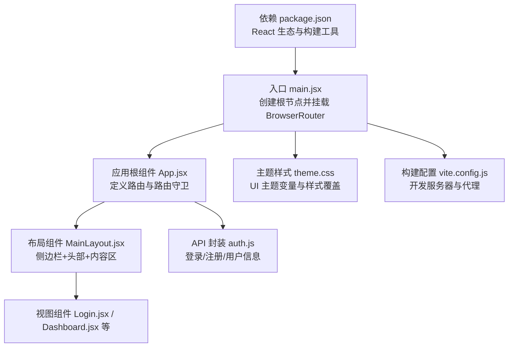
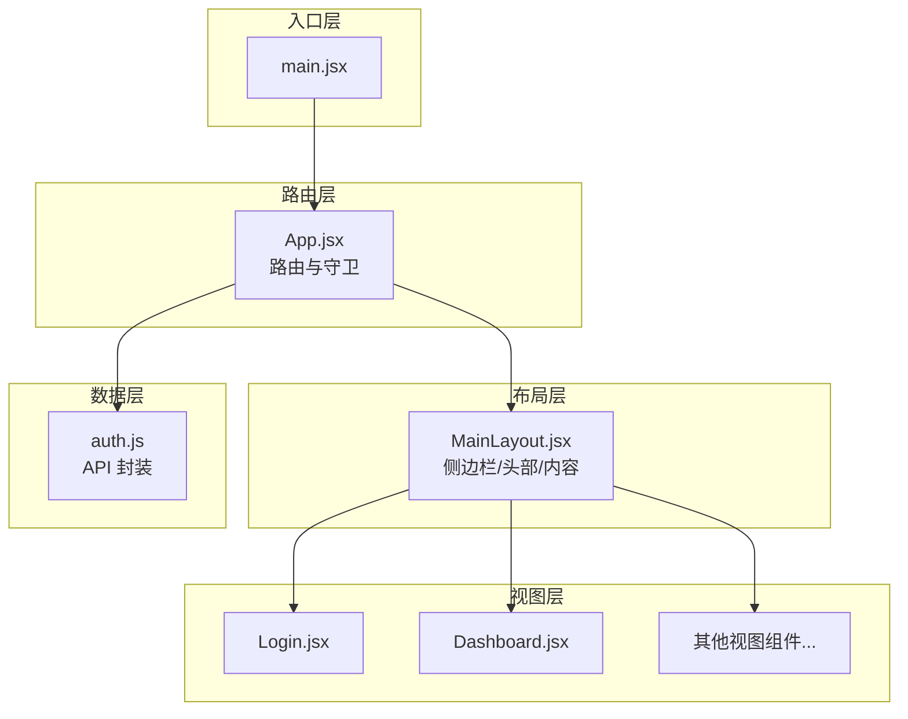
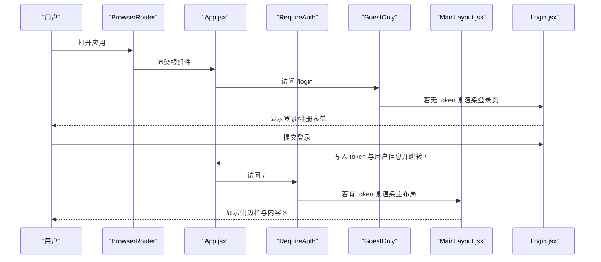
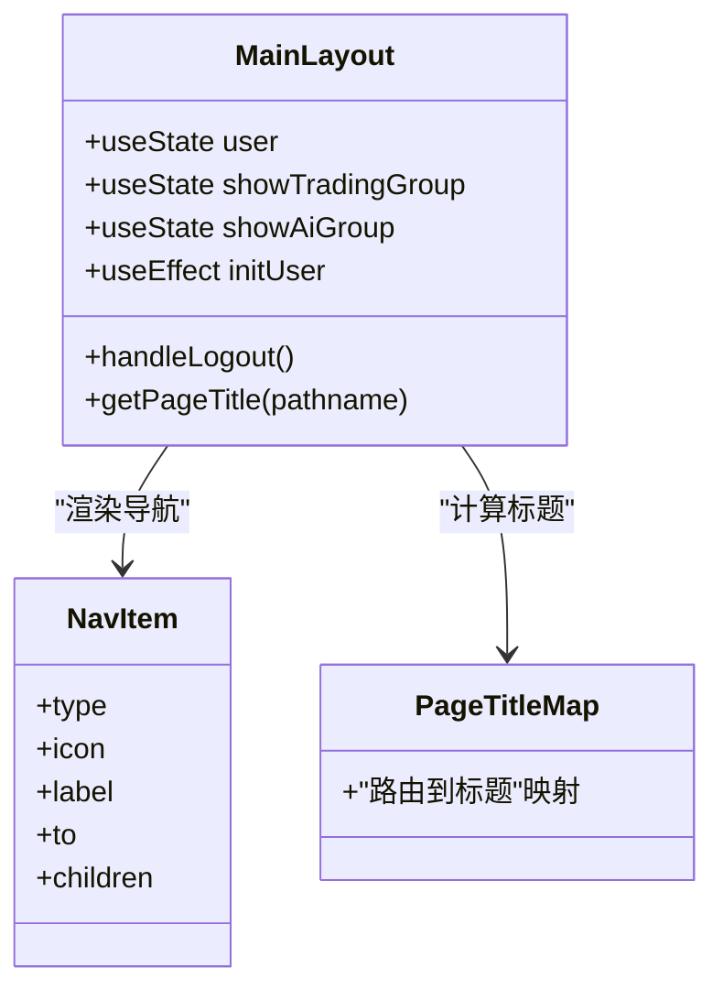
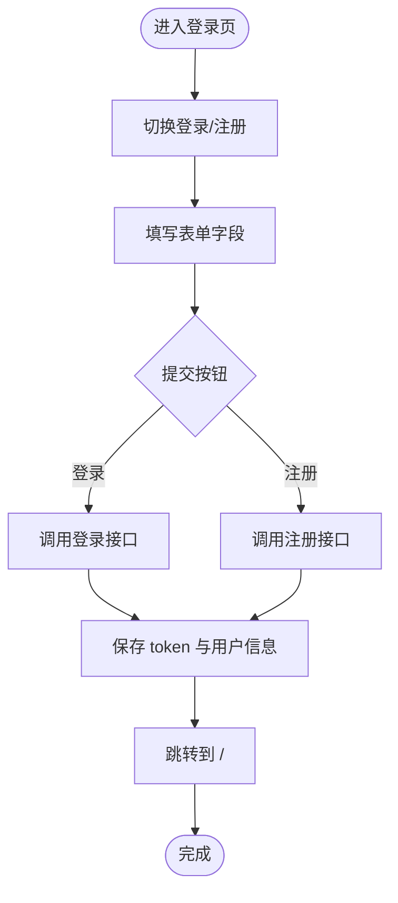
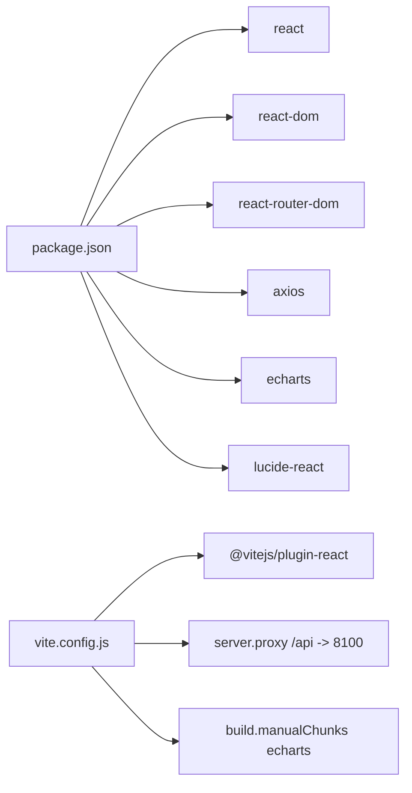

# React应用结构

<cite>
**本文档引用的文件**
- [main.jsx](file://backpack_quant_trading/frontend/src/main.jsx)
- [App.jsx](file://backpack_quant_trading/frontend/src/App.jsx)
- [MainLayout.jsx](file://backpack_quant_trading/frontend/src/layouts/MainLayout.jsx)
- [MainLayout.css](file://backpack_quant_trading/frontend/src/layouts/MainLayout.css)
- [Login.jsx](file://backpack_quant_trading/frontend/src/views/Login.jsx)
- [Dashboard.jsx](file://backpack_quant_trading/frontend/src/views/Dashboard.jsx)
- [auth.js](file://backpack_quant_trading/frontend/src/api/auth.js)
- [theme.css](file://backpack_quant_trading/frontend/src/assets/theme.css)
- [package.json](file://backpack_quant_trading/frontend/package.json)
- [vite.config.js](file://backpack_quant_trading/frontend/vite.config.js)
</cite>

## 目录
1. [简介](#简介)
2. [项目结构](#项目结构)
3. [核心组件](#核心组件)
4. [架构总览](#架构总览)
5. [详细组件分析](#详细组件分析)
6. [依赖关系分析](#依赖关系分析)
7. [性能考虑](#性能考虑)
8. [故障排除指南](#故障排除指南)
9. [结论](#结论)
10. [附录](#附录)

## 简介
本项目是一个基于 React 的量化交易管理前端应用，采用 React Router 进行路由管理，使用 Vite 作为构建工具，集成了图表展示、实时数据监控与用户认证流程。应用通过 MainLayout 统一布局，提供侧边导航、头部信息与内容区域，并通过路由守卫实现访问控制。

## 项目结构
前端代码位于 backpack_quant_trading/frontend/src 目录，主要分为以下层次：
- 入口与应用根组件：main.jsx、App.jsx
- 布局层：layouts/MainLayout.jsx 及其样式 MainLayout.css
- 视图层：views 下的各页面组件（如 Login、Dashboard 等）
- API 层：api 目录封装请求方法（如 auth.js）
- 资源与主题：assets/theme.css 等样式资源
- 构建与依赖：package.json、vite.config.js

**图表来源**
- [main.jsx:1-17](file://backpack_quant_trading/frontend/src/main.jsx#L1-L17)
- [App.jsx:1-76](file://backpack_quant_trading/frontend/src/App.jsx#L1-L76)
- [MainLayout.jsx:1-222](file://backpack_quant_trading/frontend/src/layouts/MainLayout.jsx#L1-L222)
- [Login.jsx:1-253](file://backpack_quant_trading/frontend/src/views/Login.jsx#L1-L253)
- [Dashboard.jsx:1-311](file://backpack_quant_trading/frontend/src/views/Dashboard.jsx#L1-L311)
- [auth.js:1-7](file://backpack_quant_trading/frontend/src/api/auth.js#L1-L7)
- [theme.css:1-112](file://backpack_quant_trading/frontend/src/assets/theme.css#L1-L112)
- [vite.config.js:1-30](file://backpack_quant_trading/frontend/vite.config.js#L1-L30)
- [package.json:1-27](file://backpack_quant_trading/frontend/package.json#L1-L27)

**章节来源**
- [main.jsx:1-17](file://backpack_quant_trading/frontend/src/main.jsx#L1-L17)
- [App.jsx:1-76](file://backpack_quant_trading/frontend/src/App.jsx#L1-L76)
- [package.json:1-27](file://backpack_quant_trading/frontend/package.json#L1-L27)
- [vite.config.js:1-30](file://backpack_quant_trading/frontend/vite.config.js#L1-L30)

## 核心组件
- 应用入口 main.jsx：创建根节点，包裹 BrowserRouter 并渲染 App。
- 应用根组件 App.jsx：集中定义路由规则与路由守卫，包含登录页与受保护的主布局。
- 布局组件 MainLayout.jsx：提供统一的侧边导航、头部信息与内容出口（Outlet），支持多级菜单与页面标题动态计算。
- 视图组件 Login.jsx：实现登录/注册表单与本地存储令牌与用户信息。
- API 封装 auth.js：封装登录、注册、获取用户信息等接口请求。
- 主题样式 theme.css：定义 Element Plus 主题变量与常用组件样式覆盖。

**章节来源**
- [main.jsx:1-17](file://backpack_quant_trading/frontend/src/main.jsx#L1-L17)
- [App.jsx:1-76](file://backpack_quant_trading/frontend/src/App.jsx#L1-L76)
- [MainLayout.jsx:1-222](file://backpack_quant_trading/frontend/src/layouts/MainLayout.jsx#L1-L222)
- [Login.jsx:1-253](file://backpack_quant_trading/frontend/src/views/Login.jsx#L1-L253)
- [auth.js:1-7](file://backpack_quant_trading/frontend/src/api/auth.js#L1-L7)
- [theme.css:1-112](file://backpack_quant_trading/frontend/src/assets/theme.css#L1-L112)

## 架构总览
应用采用“入口 -> 根组件 -> 布局 -> 视图”的分层架构，路由守卫在根组件中统一处理访问权限，布局组件负责 UI 结构与交互状态，视图组件承载具体业务逻辑。

**图表来源**
- [main.jsx:1-17](file://backpack_quant_trading/frontend/src/main.jsx#L1-L17)
- [App.jsx:1-76](file://backpack_quant_trading/frontend/src/App.jsx#L1-L76)
- [MainLayout.jsx:1-222](file://backpack_quant_trading/frontend/src/layouts/MainLayout.jsx#L1-L222)
- [Login.jsx:1-253](file://backpack_quant_trading/frontend/src/views/Login.jsx#L1-L253)
- [Dashboard.jsx:1-311](file://backpack_quant_trading/frontend/src/views/Dashboard.jsx#L1-L311)
- [auth.js:1-7](file://backpack_quant_trading/frontend/src/api/auth.js#L1-L7)

## 详细组件分析

### 路由与路由守卫
- 路由守卫 RequireAuth：检查本地存储中的 token，若不存在则重定向至登录页。
- 路由守卫 GuestOnly：检查是否存在 token，若存在则重定向至首页。
- 根路由配置：登录页使用 GuestOnly 包裹；主布局路由使用 RequireAuth 包裹，并在主布局内嵌套多个子路由。

**图表来源**
- [App.jsx:18-32](file://backpack_quant_trading/frontend/src/App.jsx#L18-L32)
- [App.jsx:34-72](file://backpack_quant_trading/frontend/src/App.jsx#L34-L72)
- [Login.jsx:25-69](file://backpack_quant_trading/frontend/src/views/Login.jsx#L25-L69)

**章节来源**
- [App.jsx:18-32](file://backpack_quant_trading/frontend/src/App.jsx#L18-L32)
- [App.jsx:34-72](file://backpack_quant_trading/frontend/src/App.jsx#L34-L72)
- [Login.jsx:25-69](file://backpack_quant_trading/frontend/src/views/Login.jsx#L25-L69)

### MainLayout 组件
- 作用：提供统一的侧边导航、顶部信息栏与内容出口，承载所有受保护页面。
- 功能要点：
  - 导航配置：支持父菜单与子菜单，点击父菜单展开/收起子项。
  - 页面标题：根据当前路径动态计算标题，统一策略相关页面的父标题。
  - 用户信息：从本地存储读取用户信息，提供退出登录功能。
  - 响应式布局：侧边栏宽度固定，内容区域自适应。

**图表来源**
- [MainLayout.jsx:18-63](file://backpack_quant_trading/frontend/src/layouts/MainLayout.jsx#L18-L63)
- [MainLayout.jsx:65-219](file://backpack_quant_trading/frontend/src/layouts/MainLayout.jsx#L65-L219)

**章节来源**
- [MainLayout.jsx:18-63](file://backpack_quant_trading/frontend/src/layouts/MainLayout.jsx#L18-L63)
- [MainLayout.jsx:65-219](file://backpack_quant_trading/frontend/src/layouts/MainLayout.jsx#L65-L219)
- [MainLayout.css:1-301](file://backpack_quant_trading/frontend/src/layouts/MainLayout.css#L1-L301)

### 登录视图组件
- 功能：支持登录/注册切换、表单校验、异步提交、消息提示与本地存储。
- 关键流程：提交后写入 token 与用户信息，跳转至首页。

**图表来源**
- [Login.jsx:25-69](file://backpack_quant_trading/frontend/src/views/Login.jsx#L25-L69)

**章节来源**
- [Login.jsx:1-253](file://backpack_quant_trading/frontend/src/views/Login.jsx#L1-L253)

### 数据面板视图
- 功能：集成 ECharts 图表展示、定时刷新数据、表格化展示持仓、订单与成交历史。
- 关键点：初始化时获取实例列表以确定交易所，随后周期性刷新数据，同时维护时间显示。

**章节来源**
- [Dashboard.jsx:1-311](file://backpack_quant_trading/frontend/src/views/Dashboard.jsx#L1-L311)

### API 封装
- auth.js：封装登录、注册、获取用户信息与登出接口，统一通过 request 发起 HTTP 请求。

**章节来源**
- [auth.js:1-7](file://backpack_quant_trading/frontend/src/api/auth.js#L1-L7)

## 依赖关系分析
- 依赖管理：package.json 中声明 React、React DOM、React Router、Axios、ECharts、Lucide React 等依赖。
- 构建配置：vite.config.js 使用 @vitejs/plugin-react，配置代理指向后端 API（/api -> http://127.0.0.1:8100），并按需拆分 echarts 为独立 chunk。
- 开发与预览：脚本 dev/build/preview 分别对应开发、构建与预览命令。

**图表来源**
- [package.json:11-25](file://backpack_quant_trading/frontend/package.json#L11-L25)
- [vite.config.js:1-30](file://backpack_quant_trading/frontend/vite.config.js#L1-L30)

**章节来源**
- [package.json:1-27](file://backpack_quant_trading/frontend/package.json#L1-L27)
- [vite.config.js:1-30](file://backpack_quant_trading/frontend/vite.config.js#L1-L30)

## 性能考虑
- 代码分割：通过 Vite 的 manualChunks 将 ECharts 单独打包，减少主包体积，提升首屏加载速度。
- 依赖预优化：optimizeDeps.include 预构建 axios 与 echarts，缩短冷启动时间。
- 图表渲染：Dashboard 中仅在数据变化时重新渲染图表，避免不必要的重绘。
- 路由守卫：轻量的本地存储检查，不引入额外网络请求。

**章节来源**
- [vite.config.js:6-19](file://backpack_quant_trading/frontend/vite.config.js#L6-L19)
- [Dashboard.jsx:42-62](file://backpack_quant_trading/frontend/src/views/Dashboard.jsx#L42-L62)

## 故障排除指南
- 登录后无法进入首页：
  - 检查本地存储是否正确写入 token 与用户信息。
  - 确认路由守卫 RequireAuth 是否生效。
- 图表不显示或空白：
  - 确认 ECharts 初始化时机与容器尺寸。
  - 检查数据格式是否符合预期。
- 接口 404 或跨域问题：
  - 检查 Vite 代理配置是否正确指向后端地址。
  - 确认后端服务已启动且端口一致。

**章节来源**
- [Login.jsx:34-39](file://backpack_quant_trading/frontend/src/views/Login.jsx#L34-L39)
- [Dashboard.jsx:42-62](file://backpack_quant_trading/frontend/src/views/Dashboard.jsx#L42-L62)
- [vite.config.js:23-28](file://backpack_quant_trading/frontend/vite.config.js#L23-L28)

## 结论
该 React 应用采用清晰的分层架构与路由守卫机制，结合统一布局与主题样式，提供了良好的用户体验与可维护性。通过合理的依赖管理与构建配置，兼顾了性能与开发效率。后续扩展新页面时，建议遵循现有命名与组织规范，确保一致性与可扩展性。

## 附录

### 添加新页面与路由配置步骤
- 在 views 目录新增页面组件（例如 MyNewPage.jsx）。
- 在 App.jsx 的路由配置中添加对应路由条目，并根据需要选择是否使用 RequireAuth 或 GuestOnly 包裹。
- 如需在侧边栏显示，请在 MainLayout 的导航配置中添加相应条目。
- 如涉及 API 调用，在 api 目录新增对应的封装方法并在组件中使用。
- 如需样式，可在同名 CSS 文件中编写样式，并在组件中引入。

**章节来源**
- [App.jsx:34-72](file://backpack_quant_trading/frontend/src/App.jsx#L34-L72)
- [MainLayout.jsx:18-43](file://backpack_quant_trading/frontend/src/layouts/MainLayout.jsx#L18-L43)