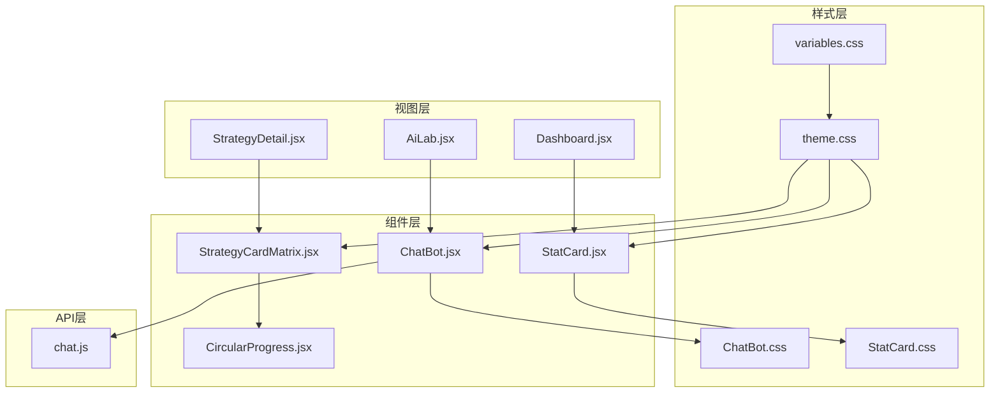
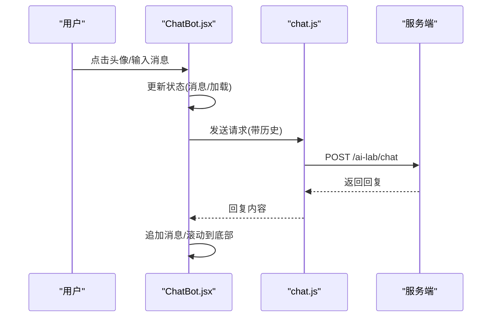
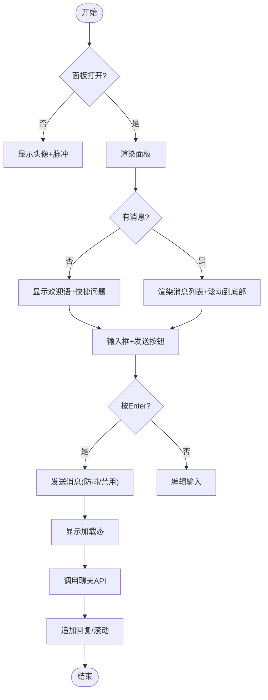
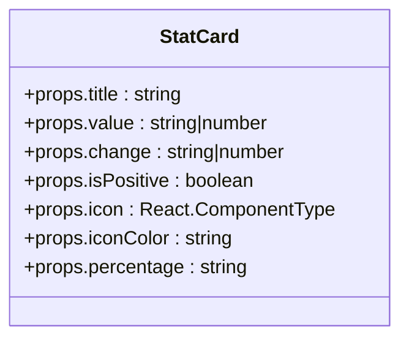
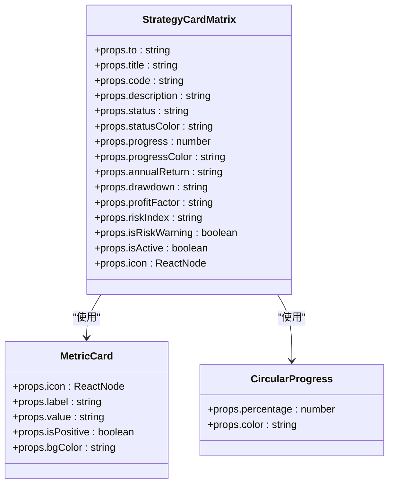
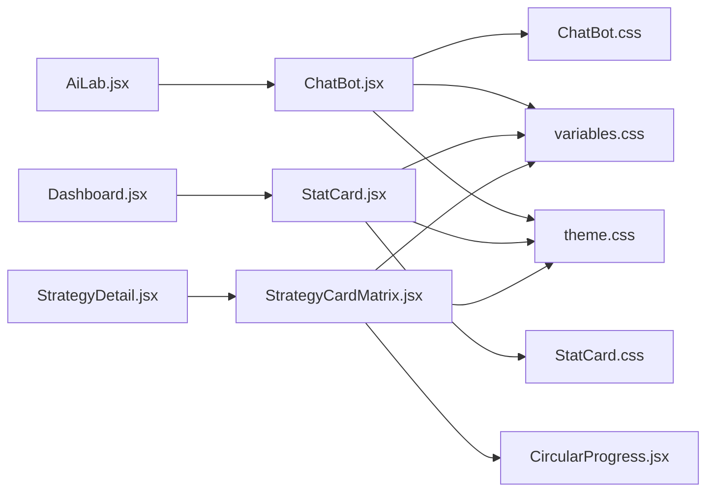

# UI组件开发

<cite>
**本文引用的文件**
- [ChatBot.jsx](file://backpack_quant_trading/frontend/src/components/ChatBot.jsx)
- [ChatBot.css](file://backpack_quant_trading/frontend/src/components/ChatBot.css)
- [StatCard.jsx](file://backpack_quant_trading/frontend/src/components/StatCard.jsx)
- [StatCard.css](file://backpack_quant_trading/frontend/src/components/StatCard.css)
- [StrategyCardMatrix.jsx](file://backpack_quant_trading/frontend/src/components/StrategyCardMatrix.jsx)
- [CircularProgress.jsx](file://backpack_quant_trading/frontend/src/components/CircularProgress.jsx)
- [chat.js](file://backpack_quant_trading/frontend/src/api/chat.js)
- [theme.css](file://backpack_quant_trading/frontend/src/assets/theme.css)
- [variables.css](file://backpack_quant_trading/frontend/src/assets/variables.css)
- [AiLab.jsx](file://backpack_quant_trading/frontend/src/views/AiLab.jsx)
- [Dashboard.jsx](file://backpack_quant_trading/frontend/src/views/Dashboard.jsx)
- [StrategyDetail.jsx](file://backpack_quant_trading/frontend/src/views/StrategyDetail.jsx)
</cite>

## 目录
1. [简介](#简介)
2. [项目结构](#项目结构)
3. [核心组件](#核心组件)
4. [架构概览](#架构概览)
5. [详细组件分析](#详细组件分析)
6. [依赖关系分析](#依赖关系分析)
7. [性能考量](#性能考量)
8. [故障排查指南](#故障排查指南)
9. [结论](#结论)
10. [附录](#附录)

## 简介
本指南面向量化交易前端的UI组件开发，聚焦三个核心组件的设计与实现：ChatBot聊天机器人、StatCard统计卡片、StrategyCardMatrix策略矩阵卡片。文档从组件的props接口、状态管理、事件处理、样式主题与响应式设计、复用模式、性能优化与可访问性、到测试与调试方法，提供系统化的实践建议与参考路径。

## 项目结构
前端采用React + ECharts的组合，组件位于src/components，样式位于src/assets，视图页面位于src/views，API封装在src/api。组件之间通过props传递数据，通过事件回调交互，样式通过CSS变量与主题文件统一管理。

**图表来源**
- [ChatBot.jsx:1-250](file://backpack_quant_trading/frontend/src/components/ChatBot.jsx#L1-L250)
- [StatCard.jsx:1-32](file://backpack_quant_trading/frontend/src/components/StatCard.jsx#L1-L32)
- [StrategyCardMatrix.jsx:1-126](file://backpack_quant_trading/frontend/src/components/StrategyCardMatrix.jsx#L1-L126)
- [CircularProgress.jsx:1-34](file://backpack_quant_trading/frontend/src/components/CircularProgress.jsx#L1-L34)
- [chat.js:1-5](file://backpack_quant_trading/frontend/src/api/chat.js#L1-L5)
- [AiLab.jsx:1-299](file://backpack_quant_trading/frontend/src/views/AiLab.jsx#L1-L299)
- [Dashboard.jsx:1-311](file://backpack_quant_trading/frontend/src/views/Dashboard.jsx#L1-L311)
- [StrategyDetail.jsx:1-800](file://backpack_quant_trading/frontend/src/views/StrategyDetail.jsx#L1-L800)
- [variables.css:1-27](file://backpack_quant_trading/frontend/src/assets/variables.css#L1-L27)
- [theme.css:1-112](file://backpack_quant_trading/frontend/src/assets/theme.css#L1-L112)

**章节来源**
- [ChatBot.jsx:1-250](file://backpack_quant_trading/frontend/src/components/ChatBot.jsx#L1-L250)
- [StatCard.jsx:1-32](file://backpack_quant_trading/frontend/src/components/StatCard.jsx#L1-L32)
- [StrategyCardMatrix.jsx:1-126](file://backpack_quant_trading/frontend/src/components/StrategyCardMatrix.jsx#L1-L126)
- [CircularProgress.jsx:1-34](file://backpack_quant_trading/frontend/src/components/CircularProgress.jsx#L1-L34)
- [chat.js:1-5](file://backpack_quant_trading/frontend/src/api/chat.js#L1-L5)
- [AiLab.jsx:1-299](file://backpack_quant_trading/frontend/src/views/AiLab.jsx#L1-L299)
- [Dashboard.jsx:1-311](file://backpack_quant_trading/frontend/src/views/Dashboard.jsx#L1-L311)
- [StrategyDetail.jsx:1-800](file://backpack_quant_trading/frontend/src/views/StrategyDetail.jsx#L1-L800)
- [variables.css:1-27](file://backpack_quant_trading/frontend/src/assets/variables.css#L1-L27)
- [theme.css:1-112](file://backpack_quant_trading/frontend/src/assets/theme.css#L1-L112)

## 核心组件
- ChatBot：浮动聊天面板，支持拖拽定位、消息历史、发送与加载态、常见问题快捷入口。
- StatCard：通用统计卡片，展示标题、数值、百分比变化与图标，支持正负向标识。
- StrategyCardMatrix：策略卡片矩阵，包含状态标签、进度环、指标卡、描述与链接跳转。

**章节来源**
- [ChatBot.jsx:20-246](file://backpack_quant_trading/frontend/src/components/ChatBot.jsx#L20-L246)
- [StatCard.jsx:4-31](file://backpack_quant_trading/frontend/src/components/StatCard.jsx#L4-L31)
- [StrategyCardMatrix.jsx:25-125](file://backpack_quant_trading/frontend/src/components/StrategyCardMatrix.jsx#L25-L125)

## 架构概览
组件间协作以“数据驱动 + 事件回调”为主，ChatBot通过API模块与后端交互；StatCard与StrategyCardMatrix作为纯展示组件，由上层视图传入数据；CircularProgress作为子组件被策略卡片复用。

**图表来源**
- [ChatBot.jsx:114-142](file://backpack_quant_trading/frontend/src/components/ChatBot.jsx#L114-L142)
- [chat.js:4-4](file://backpack_quant_trading/frontend/src/api/chat.js#L4-L4)

**章节来源**
- [ChatBot.jsx:114-142](file://backpack_quant_trading/frontend/src/components/ChatBot.jsx#L114-L142)
- [chat.js:1-5](file://backpack_quant_trading/frontend/src/api/chat.js#L1-L5)

## 详细组件分析

### ChatBot 聊天机器人组件
- 设计目标
  - 提供AI辅助问答，支持拖拽移动面板，自动滚动至最新消息，输入快捷问题。
- Props接口
  - 无外部props，内部通过状态管理面板开合、消息列表、输入文本、加载状态等。
- 状态管理
  - 面板开关、输入文本、消息数组、加载标志、拖拽位置与状态、是否发生拖拽。
  - 使用useMemo计算面板位置与左右布局，useEffect在打开时滚动到底部。
- 事件处理
  - 头像按下触发拖拽，点击去抖防止拖拽误触；文本区支持Enter换行与发送。
  - 发送流程：校验输入与加载状态，构造历史消息，调用API，异常时追加错误消息。
- 样式与主题
  - 使用CSS变量控制颜色、阴影、圆角；支持左/右侧布局切换；脉冲动画与打字机效果。
- 可访问性
  - 关闭按钮提供aria-label；头像title提示操作；键盘支持Enter发送。
- 性能优化
  - 消息区域滚动使用ref；拖拽限制在可视区域内；避免不必要重渲染（useMemo/useCallback）。
- 复用模式
  - 将消息格式化、滚动逻辑抽取为独立函数；面板位置与布局逻辑可复用到其他悬浮面板。

**图表来源**
- [ChatBot.jsx:114-142](file://backpack_quant_trading/frontend/src/components/ChatBot.jsx#L114-L142)
- [ChatBot.css:1-300](file://backpack_quant_trading/frontend/src/components/ChatBot.css#L1-L300)

**章节来源**
- [ChatBot.jsx:20-246](file://backpack_quant_trading/frontend/src/components/ChatBot.jsx#L20-L246)
- [ChatBot.css:1-300](file://backpack_quant_trading/frontend/src/components/ChatBot.css#L1-L300)
- [chat.js:1-5](file://backpack_quant_trading/frontend/src/api/chat.js#L1-L5)

### StatCard 统计卡片组件
- 设计目标
  - 展示关键指标，支持百分比变化与正负向标识，配合图标增强可读性。
- Props接口
  - title: 标题文本
  - value: 数值
  - change: 变化量/变化幅度
  - isPositive: 是否为正值
  - icon: 图标组件
  - iconColor: 图标背景类名
  - percentage: 百分比后缀
- 状态管理
  - 无内部状态，完全受控于父组件传入的数据。
- 事件处理
  - 无交互事件，保持纯展示。
- 样式与主题
  - 使用CSS变量控制边框、背景、文字颜色；进度条宽度可扩展为动态值。
- 可访问性
  - 文本语义清晰，图标通过类名提供视觉信息，建议在需要时补充aria-label。
- 性能优化
  - 无状态组件，渲染成本低；可结合memo化在父组件批量更新时减少重渲染。
- 复用模式
  - 通过props扩展支持更多指标类型（如金额、时间）；图标与颜色策略可抽象为配置。

**图表来源**
- [StatCard.jsx:4-31](file://backpack_quant_trading/frontend/src/components/StatCard.jsx#L4-L31)
- [StatCard.css:1-103](file://backpack_quant_trading/frontend/src/components/StatCard.css#L1-L103)

**章节来源**
- [StatCard.jsx:1-32](file://backpack_quant_trading/frontend/src/components/StatCard.jsx#L1-L32)
- [StatCard.css:1-103](file://backpack_quant_trading/frontend/src/components/StatCard.css#L1-L103)

### StrategyCardMatrix 策略矩阵组件
- 设计目标
  - 展示策略摘要、状态、进度与关键指标，支持链接跳转到详情页。
- Props接口
  - to: 跳转路由
  - title/code/description: 策略基础信息
  - status/statusColor: 状态标签与颜色
  - progress/progressColor: 进度百分比与颜色
  - annualReturn/drawdown/profitFactor/riskIndex: 指标卡
  - isRiskWarning: 风险警示
  - isActive: 激活态样式
  - icon: 自定义图标
- 状态管理
  - 无内部状态，根据props派生状态颜色与进度颜色。
- 事件处理
  - 无交互事件，保持纯展示。
- 子组件
  - MetricCard：指标卡片，支持正负向颜色与背景色。
  - CircularProgress：进度环，支持颜色与百分比。
- 样式与主题
  - 使用CSS变量与渐变色；根据状态动态切换标签与进度颜色；激活态强调边框与阴影。
- 可访问性
  - 链接组件提供语义导航；图标使用SVG，建议补充title或aria-label。
- 性能优化
  - 指标卡片与进度环均为轻量组件；可结合memo化在列表渲染时提升性能。
- 复用模式
  - 将MetricCard抽象为通用指标块；支持不同图标库与颜色方案。

**图表来源**
- [StrategyCardMatrix.jsx:25-125](file://backpack_quant_trading/frontend/src/components/StrategyCardMatrix.jsx#L25-L125)
- [CircularProgress.jsx:3-33](file://backpack_quant_trading/frontend/src/components/CircularProgress.jsx#L3-L33)

**章节来源**
- [StrategyCardMatrix.jsx:1-126](file://backpack_quant_trading/frontend/src/components/StrategyCardMatrix.jsx#L1-L126)
- [CircularProgress.jsx:1-34](file://backpack_quant_trading/frontend/src/components/CircularProgress.jsx#L1-L34)

## 依赖关系分析
- 组件依赖
  - ChatBot依赖API模块与自身样式；StatCard依赖样式；StrategyCardMatrix依赖CircularProgress与图标库。
- 视图层集成
  - AiLab页面使用ChatBot进行AI分析；Dashboard页面使用StatCard展示汇总指标；StrategyDetail页面使用StrategyCardMatrix展示策略矩阵。
- 样式体系
  - variables.css提供全局CSS变量；theme.css覆盖Element Plus样式，统一主色调与阴影。

**图表来源**
- [AiLab.jsx:1-299](file://backpack_quant_trading/frontend/src/views/AiLab.jsx#L1-L299)
- [Dashboard.jsx:1-311](file://backpack_quant_trading/frontend/src/views/Dashboard.jsx#L1-L311)
- [StrategyDetail.jsx:1-800](file://backpack_quant_trading/frontend/src/views/StrategyDetail.jsx#L1-L800)
- [ChatBot.jsx:1-250](file://backpack_quant_trading/frontend/src/components/ChatBot.jsx#L1-L250)
- [StatCard.jsx:1-32](file://backpack_quant_trading/frontend/src/components/StatCard.jsx#L1-L32)
- [StrategyCardMatrix.jsx:1-126](file://backpack_quant_trading/frontend/src/components/StrategyCardMatrix.jsx#L1-L126)
- [CircularProgress.jsx:1-34](file://backpack_quant_trading/frontend/src/components/CircularProgress.jsx#L1-L34)
- [variables.css:1-27](file://backpack_quant_trading/frontend/src/assets/variables.css#L1-L27)
- [theme.css:1-112](file://backpack_quant_trading/frontend/src/assets/theme.css#L1-L112)

**章节来源**
- [AiLab.jsx:1-299](file://backpack_quant_trading/frontend/src/views/AiLab.jsx#L1-L299)
- [Dashboard.jsx:1-311](file://backpack_quant_trading/frontend/src/views/Dashboard.jsx#L1-L311)
- [StrategyDetail.jsx:1-800](file://backpack_quant_trading/frontend/src/views/StrategyDetail.jsx#L1-L800)
- [variables.css:1-27](file://backpack_quant_trading/frontend/src/assets/variables.css#L1-L27)
- [theme.css:1-112](file://backpack_quant_trading/frontend/src/assets/theme.css#L1-L112)

## 性能考量
- 渲染优化
  - ChatBot的消息列表使用ref滚动，避免强制重排；StatCard与StrategyCardMatrix为纯展示组件，尽量减少不必要的重渲染。
- 事件与副作用
  - ChatBot的拖拽与滚动使用useCallback与useEffect约束，确保只在依赖变化时执行。
- 资源与网络
  - ChatBot发送请求时设置较长超时，避免长时间阻塞UI；合理使用loading状态。
- 图表与大数据
  - StrategyDetail中的ECharts图表按需初始化，避免重复实例化；数据切片与缩放提升长序列性能。

[本节为通用指导，无需特定文件引用]

## 故障排查指南
- ChatBot无法发送消息
  - 检查输入为空或正在加载时的防抖逻辑；确认API返回结构与错误分支。
- 拖拽无效或越界
  - 确认ensurePosition获取到元素位置；拖拽边界计算与事件移除逻辑。
- 样式异常
  - 检查CSS变量是否正确注入；主题覆盖是否生效；组件样式优先级。
- 图表不显示
  - 确认容器ref存在且非空；数据格式符合ECharts要求；初始化时机正确。

**章节来源**
- [ChatBot.jsx:45-102](file://backpack_quant_trading/frontend/src/components/ChatBot.jsx#L45-L102)
- [chat.js:4-4](file://backpack_quant_trading/frontend/src/api/chat.js#L4-L4)
- [StrategyDetail.jsx:441-490](file://backpack_quant_trading/frontend/src/views/StrategyDetail.jsx#L441-L490)

## 结论
上述组件遵循“数据驱动 + 纯展示 + 子组件复用”的设计原则，结合CSS变量与主题体系实现一致的视觉语言。通过合理的状态管理、事件处理与性能优化，可在复杂业务场景中稳定复用。建议在后续迭代中进一步抽象公共逻辑、完善可访问性与测试覆盖。

[本节为总结，无需特定文件引用]

## 附录
- 组件使用示例路径
  - ChatBot：在AiLab页面中直接引入并使用。
  - StatCard：在Dashboard页面中用于展示资产与收益等关键指标。
  - StrategyCardMatrix：在StrategyDetail页面中用于展示策略矩阵与指标。
- 样式定制要点
  - 通过variables.css统一颜色与阴影；通过theme.css覆盖第三方组件样式。
- 响应式设计原则
  - 使用相对单位与flex布局；在面板与卡片中预留足够的内边距与间距；在移动端关注触摸目标尺寸与点击区域。

**章节来源**
- [AiLab.jsx:210-295](file://backpack_quant_trading/frontend/src/views/AiLab.jsx#L210-L295)
- [Dashboard.jsx:83-307](file://backpack_quant_trading/frontend/src/views/Dashboard.jsx#L83-L307)
- [StrategyDetail.jsx:87-125](file://backpack_quant_trading/frontend/src/views/StrategyDetail.jsx#L87-L125)
- [variables.css:1-27](file://backpack_quant_trading/frontend/src/assets/variables.css#L1-L27)
- [theme.css:1-112](file://backpack_quant_trading/frontend/src/assets/theme.css#L1-L112)