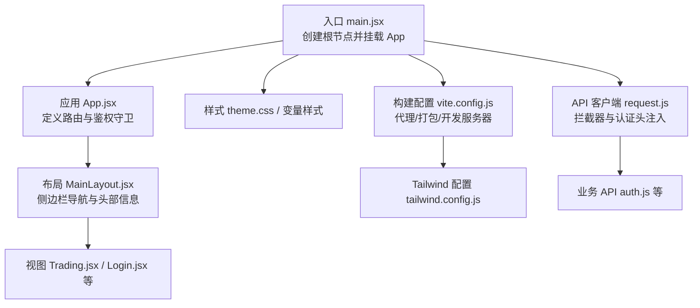
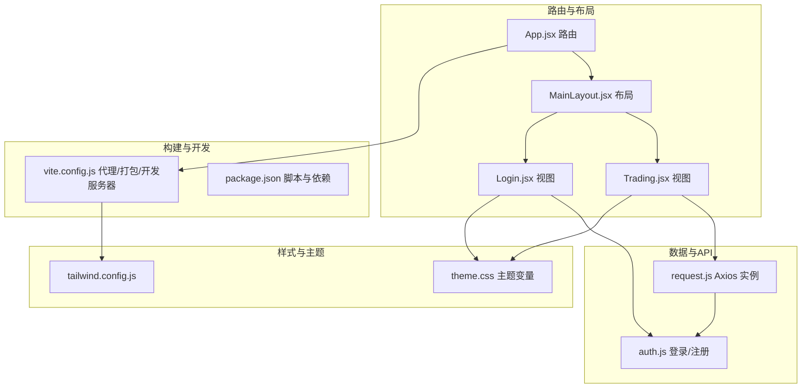
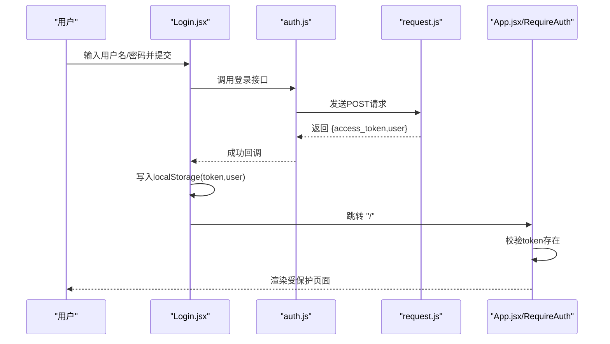
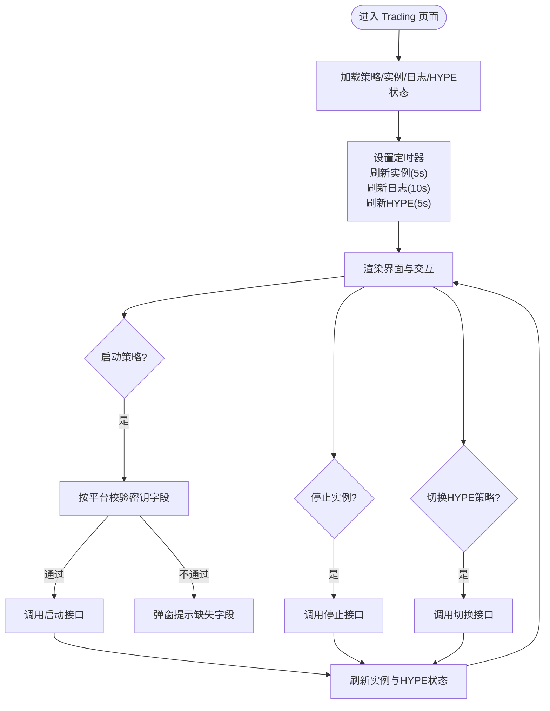
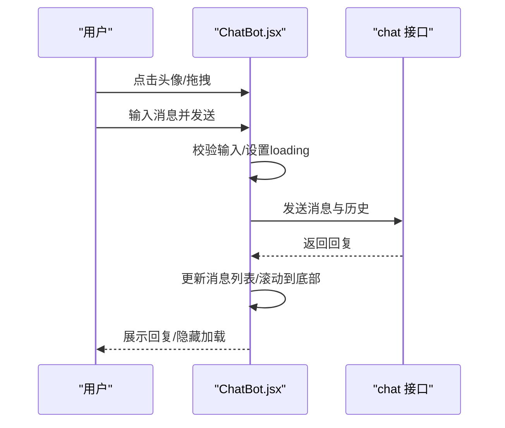
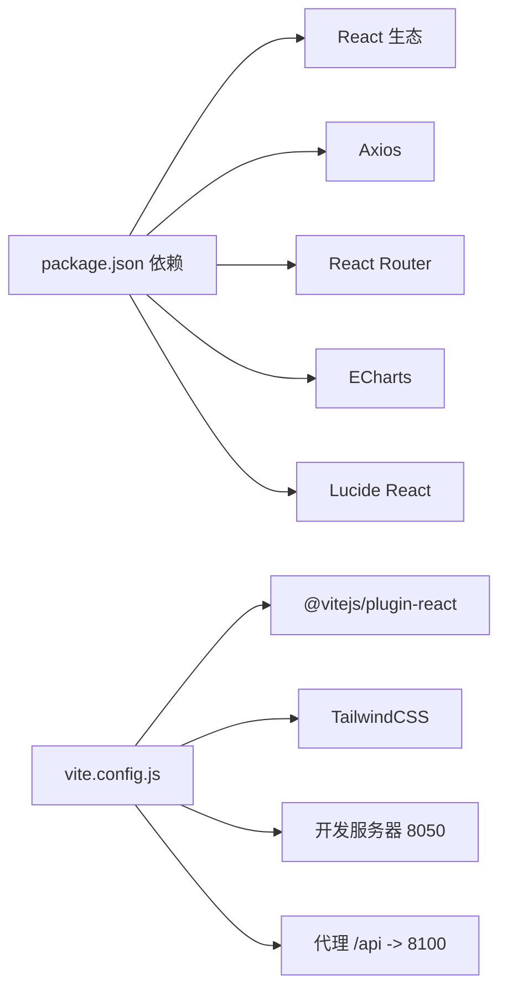

# 前端开发

<cite>
**本文引用的文件**
- [package.json](file://backpack_quant_trading/frontend/package.json)
- [vite.config.js](file://backpack_quant_trading/frontend/vite.config.js)
- [tailwind.config.js](file://backpack_quant_trading/frontend/tailwind.config.js)
- [main.jsx](file://backpack_quant_trading/frontend/src/main.jsx)
- [App.jsx](file://backpack_quant_trading/frontend/src/App.jsx)
- [MainLayout.jsx](file://backpack_quant_trading/frontend/src/layouts/MainLayout.jsx)
- [Login.jsx](file://backpack_quant_trading/frontend/src/views/Login.jsx)
- [Trading.jsx](file://backpack_quant_trading/frontend/src/views/Trading.jsx)
- [ChatBot.jsx](file://backpack_quant_trading/frontend/src/components/ChatBot.jsx)
- [StatCard.jsx](file://backpack_quant_trading/frontend/src/components/StatCard.jsx)
- [request.js](file://backpack_quant_trading/frontend/src/api/request.js)
- [auth.js](file://backpack_quant_trading/frontend/src/api/auth.js)
- [theme.css](file://backpack_quant_trading/frontend/src/assets/theme.css)
</cite>

## 目录
1. [简介](#简介)
2. [项目结构](#项目结构)
3. [核心组件](#核心组件)
4. [架构总览](#架构总览)
5. [详细组件分析](#详细组件分析)
6. [依赖关系分析](#依赖关系分析)
7. [性能考量](#性能考量)
8. [故障排查指南](#故障排查指南)
9. [结论](#结论)
10. [附录](#附录)

## 简介
本指南面向React前端应用的开发与维护，聚焦于项目结构、组件层次、路由配置、UI开发规范、状态管理与数据绑定模式、API调用与认证、WebSocket实时更新机制建议、构建与部署流程、样式与响应式设计原则，以及常见问题的解决方案与调试技巧。文档以仓库现有代码为依据，提供可操作的最佳实践与可视化图示。

## 项目结构
前端位于 backpack_quant_trading/frontend，采用 Vite + React + TailwindCSS 技术栈，目录组织遵循“按功能域分层”的思路：
- src/api：封装统一请求客户端与业务模块API导出
- src/views：页面级组件（视图）
- src/components：可复用UI组件
- src/layouts：布局组件
- src/assets：主题与变量样式
- public：静态资源（入口HTML）

图表来源
- [main.jsx:1-17](file://backpack_quant_trading/frontend/src/main.jsx#L1-L17)
- [App.jsx:1-76](file://backpack_quant_trading/frontend/src/App.jsx#L1-L76)
- [MainLayout.jsx:1-222](file://backpack_quant_trading/frontend/src/layouts/MainLayout.jsx#L1-L222)
- [Trading.jsx:1-499](file://backpack_quant_trading/frontend/src/views/Trading.jsx#L1-L499)
- [Login.jsx:1-253](file://backpack_quant_trading/frontend/src/views/Login.jsx#L1-L253)
- [request.js:1-33](file://backpack_quant_trading/frontend/src/api/request.js#L1-L33)
- [auth.js:1-7](file://backpack_quant_trading/frontend/src/api/auth.js#L1-L7)
- [vite.config.js:1-30](file://backpack_quant_trading/frontend/vite.config.js#L1-L30)
- [tailwind.config.js:1-9](file://backpack_quant_trading/frontend/tailwind.config.js#L1-L9)
- [theme.css:1-112](file://backpack_quant_trading/frontend/src/assets/theme.css#L1-L112)

章节来源
- [package.json:1-27](file://backpack_quant_trading/frontend/package.json#L1-L27)
- [vite.config.js:1-30](file://backpack_quant_trading/frontend/vite.config.js#L1-L30)
- [tailwind.config.js:1-9](file://backpack_quant_trading/frontend/tailwind.config.js#L1-L9)
- [main.jsx:1-17](file://backpack_quant_trading/frontend/src/main.jsx#L1-L17)
- [App.jsx:1-76](file://backpack_quant_trading/frontend/src/App.jsx#L1-L76)

## 核心组件
- 应用入口与路由
  - 入口：在 main.jsx 中创建根节点并包裹 BrowserRouter，渲染 App
  - 路由：App.jsx 定义登录页与受保护的主布局嵌套路由；通过本地存储令牌实现鉴权守卫
- 布局组件
  - MainLayout.jsx 提供侧边栏导航（含父子菜单）、头部信息、用户状态与聊天机器人
- 视图组件
  - Trading.jsx：策略实例管理、日志展示、定时轮询刷新、启动/停止策略
  - Login.jsx：登录/注册表单、消息提示、回车触发登录
- 组件库与样式
  - StatCard.jsx：通用统计卡片组件
  - theme.css：Element Plus 风格的主题变量与组件样式覆盖
- API与认证
  - request.js：Axios 实例封装，自动注入 Authorization 头，401 自动登出
  - auth.js：登录/注册/个人信息/登出接口导出

章节来源
- [main.jsx:1-17](file://backpack_quant_trading/frontend/src/main.jsx#L1-L17)
- [App.jsx:1-76](file://backpack_quant_trading/frontend/src/App.jsx#L1-L76)
- [MainLayout.jsx:1-222](file://backpack_quant_trading/frontend/src/layouts/MainLayout.jsx#L1-L222)
- [Trading.jsx:1-499](file://backpack_quant_trading/frontend/src/views/Trading.jsx#L1-L499)
- [Login.jsx:1-253](file://backpack_quant_trading/frontend/src/views/Login.jsx#L1-L253)
- [StatCard.jsx:1-32](file://backpack_quant_trading/frontend/src/components/StatCard.jsx#L1-L32)
- [theme.css:1-112](file://backpack_quant_trading/frontend/src/assets/theme.css#L1-L112)
- [request.js:1-33](file://backpack_quant_trading/frontend/src/api/request.js#L1-L33)
- [auth.js:1-7](file://backpack_quant_trading/frontend/src/api/auth.js#L1-L7)

## 架构总览
前端采用“路由驱动 + 组件化 + 请求拦截器”的架构模式：
- 路由层：App.jsx 定义顶层路由与守卫，MainLayout.jsx 承载页面内容
- 视图层：各页面组件负责数据获取与交互，内部使用定时器轮询后端接口
- 组件层：可复用UI组件（如 StatCard）提升一致性
- 数据层：request.js 统一处理认证与错误，auth.js 等导出具体业务API
- 样式层：Tailwind 与主题变量配合，实现一致的设计语言

图表来源
- [App.jsx:1-76](file://backpack_quant_trading/frontend/src/App.jsx#L1-L76)
- [MainLayout.jsx:1-222](file://backpack_quant_trading/frontend/src/layouts/MainLayout.jsx#L1-L222)
- [Trading.jsx:1-499](file://backpack_quant_trading/frontend/src/views/Trading.jsx#L1-L499)
- [Login.jsx:1-253](file://backpack_quant_trading/frontend/src/views/Login.jsx#L1-L253)
- [request.js:1-33](file://backpack_quant_trading/frontend/src/api/request.js#L1-L33)
- [auth.js:1-7](file://backpack_quant_trading/frontend/src/api/auth.js#L1-L7)
- [theme.css:1-112](file://backpack_quant_trading/frontend/src/assets/theme.css#L1-L112)
- [tailwind.config.js:1-9](file://backpack_quant_trading/frontend/tailwind.config.js#L1-L9)
- [vite.config.js:1-30](file://backpack_quant_trading/frontend/vite.config.js#L1-L30)
- [package.json:1-27](file://backpack_quant_trading/frontend/package.json#L1-L27)

## 详细组件分析

### 路由与鉴权流程
- 登录页仅访客可见，登录成功后写入 token 与用户信息并跳转首页
- 首页路由受 RequireAuth 保护，未登录自动跳转登录页
- 侧边栏导航根据当前路径高亮，支持父菜单展开/收起

图表来源
- [Login.jsx:25-69](file://backpack_quant_trading/frontend/src/views/Login.jsx#L25-L69)
- [auth.js:1-7](file://backpack_quant_trading/frontend/src/api/auth.js#L1-L7)
- [request.js:1-33](file://backpack_quant_trading/frontend/src/api/request.js#L1-L33)
- [App.jsx:18-32](file://backpack_quant_trading/frontend/src/App.jsx#L18-L32)

章节来源
- [App.jsx:18-32](file://backpack_quant_trading/frontend/src/App.jsx#L18-L32)
- [Login.jsx:25-69](file://backpack_quant_trading/frontend/src/views/Login.jsx#L25-L69)
- [auth.js:1-7](file://backpack_quant_trading/frontend/src/api/auth.js#L1-L7)
- [request.js:1-33](file://backpack_quant_trading/frontend/src/api/request.js#L1-L33)

### Trading 页面：策略实例管理与定时刷新
- 初始化加载策略列表、实例列表、日志与HYPE状态
- 使用定时器周期性刷新不同数据源，避免阻塞主线程
- 启动策略时按平台校验密钥字段，HYPE策略走独立端点
- 支持停止单个实例与切换HYPE策略开关

图表来源
- [Trading.jsx:60-101](file://backpack_quant_trading/frontend/src/views/Trading.jsx#L60-L101)
- [Trading.jsx:103-162](file://backpack_quant_trading/frontend/src/views/Trading.jsx#L103-L162)
- [Trading.jsx:164-190](file://backpack_quant_trading/frontend/src/views/Trading.jsx#L164-L190)

章节来源
- [Trading.jsx:1-499](file://backpack_quant_trading/frontend/src/views/Trading.jsx#L1-L499)

### ChatBot 组件：拖拽与消息流
- 支持拖拽移动、点击展开/收起
- 发送消息时携带历史记录，显示加载态与错误提示
- 支持快捷问题引导

图表来源
- [ChatBot.jsx:109-142](file://backpack_quant_trading/frontend/src/components/ChatBot.jsx#L109-L142)
- [ChatBot.jsx:144-149](file://backpack_quant_trading/frontend/src/components/ChatBot.jsx#L144-L149)

章节来源
- [ChatBot.jsx:1-250](file://backpack_quant_trading/frontend/src/components/ChatBot.jsx#L1-L250)

### 统计卡片组件：可复用UI
- StatCard.jsx 提供统一的标题、数值、变化与图标区域，便于在多处复用

章节来源
- [StatCard.jsx:1-32](file://backpack_quant_trading/frontend/src/components/StatCard.jsx#L1-L32)

### 主题与样式体系
- theme.css 定义 Element Plus 风格的主色调与组件样式覆盖
- tailwind.config.js 指定扫描范围，确保按需生成样式

章节来源
- [theme.css:1-112](file://backpack_quant_trading/frontend/src/assets/theme.css#L1-L112)
- [tailwind.config.js:1-9](file://backpack_quant_trading/frontend/tailwind.config.js#L1-L9)

## 依赖关系分析
- 运行时依赖：React、React DOM、React Router、Axios、ECharts、Lucide React
- 开发依赖：Vite、@vitejs/plugin-react、TailwindCSS、PostCSS
- 构建配置：vite.config.js 配置代理、打包分包与开发服务器端口

图表来源
- [package.json:11-25](file://backpack_quant_trading/frontend/package.json#L11-L25)
- [vite.config.js:4-29](file://backpack_quant_trading/frontend/vite.config.js#L4-L29)

章节来源
- [package.json:1-27](file://backpack_quant_trading/frontend/package.json#L1-L27)
- [vite.config.js:1-30](file://backpack_quant_trading/frontend/vite.config.js#L1-L30)

## 性能考量
- 代码分割：通过手动分块将 ECharts 单独拆分，减少首屏体积
- 依赖预构建：optimizeDeps 包含 axios 与 echarts，提升冷启动速度
- 轮询节流：Trading 页面对不同数据源设置不同刷新间隔，避免过度请求
- 图表性能：ECharts 在独立分包中按需加载，结合懒加载可进一步优化

章节来源
- [vite.config.js:6-19](file://backpack_quant_trading/frontend/vite.config.js#L6-L19)
- [Trading.jsx:91-93](file://backpack_quant_trading/frontend/src/views/Trading.jsx#L91-L93)

## 故障排查指南
- 登录失败/401未授权
  - 检查本地是否写入 token 与用户信息
  - request.js 的响应拦截器会在 401 时清除 token 并跳转登录页
- 跨域与接口不可达
  - 确认 vite 代理配置指向后端 8100 端口
  - 确认后端已启动且允许跨域
- 轮询异常
  - 检查 Trading 页面定时器是否正确清理
  - 确认接口返回格式与字段名一致
- 样式未生效
  - 确认 Tailwind 已扫描到对应文件
  - 检查 theme.css 是否被引入

章节来源
- [request.js:20-30](file://backpack_quant_trading/frontend/src/api/request.js#L20-L30)
- [vite.config.js:20-29](file://backpack_quant_trading/frontend/vite.config.js#L20-L29)
- [Trading.jsx:96-101](file://backpack_quant_trading/frontend/src/views/Trading.jsx#L96-L101)

## 结论
本项目前端采用清晰的路由与布局分离、统一的请求拦截与认证机制、可复用的UI组件与主题体系，结合定时轮询实现数据刷新。建议后续在以下方面持续优化：完善 WebSocket 实时推送机制、引入状态管理库（如 Zustand 或 Jotai）、增强表单校验与错误边界、细化组件测试与文档注释。

## 附录

### API 接口调用示例（路径指引）
- 登录/注册
  - [auth.js:3-6](file://backpack_quant_trading/frontend/src/api/auth.js#L3-L6)
- 交易相关
  - [Trading.jsx:3-11](file://backpack_quant_trading/frontend/src/views/Trading.jsx#L3-L11)
- 请求客户端
  - [request.js:1-33](file://backpack_quant_trading/frontend/src/api/request.js#L1-L33)

### WebSocket 连接与实时更新（建议实现）
- 建议在 Trading 页面初始化时建立 WebSocket 连接，订阅策略实例、日志与市场数据
- 使用 React Hook 管理连接生命周期，在组件卸载时断开连接
- 将实时数据合并到现有状态中，避免与轮询冲突

[本节为概念性建议，无需代码来源]

### 样式规范与响应式设计
- 使用 Tailwind 类进行响应式布局与间距控制
- 主题变量集中于 theme.css，统一主色调与组件风格
- 建议为移动端补充断点与触摸交互优化

章节来源
- [theme.css:1-112](file://backpack_quant_trading/frontend/src/assets/theme.css#L1-L112)
- [tailwind.config.js:1-9](file://backpack_quant_trading/frontend/tailwind.config.js#L1-L9)

### 构建与部署流程
- 开发：npm run dev（Vite 开发服务器，端口 8050，代理 /api 到 8100）
- 构建：npm run build（Rollup 打包，手动分块 ECharts）
- 预览：npm run preview

章节来源
- [package.json:6-10](file://backpack_quant_trading/frontend/package.json#L6-L10)
- [vite.config.js:10-19](file://backpack_quant_trading/frontend/vite.config.js#L10-L19)