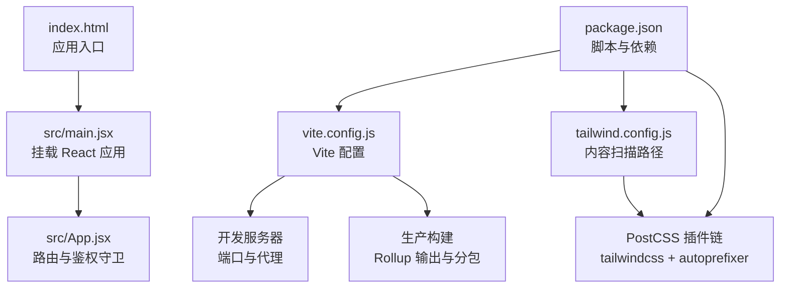
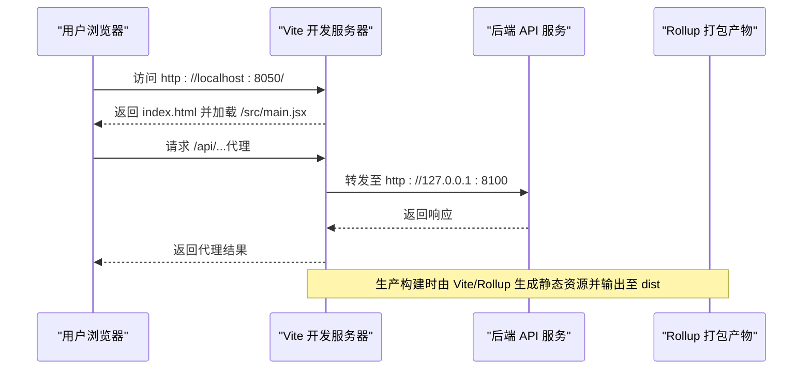
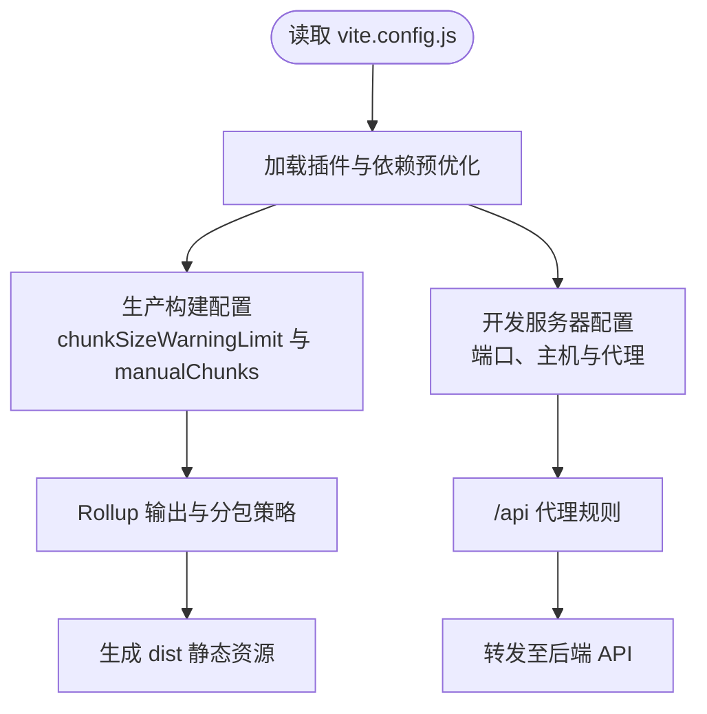
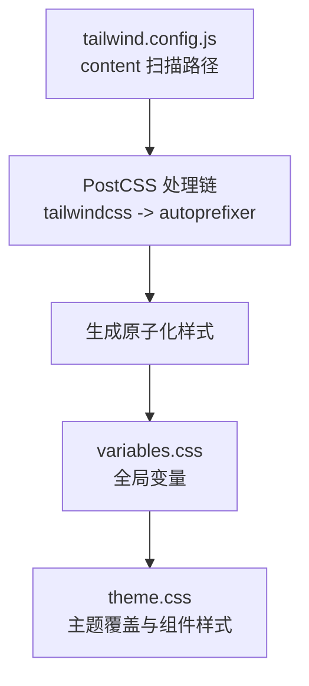
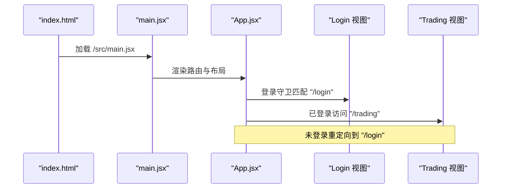
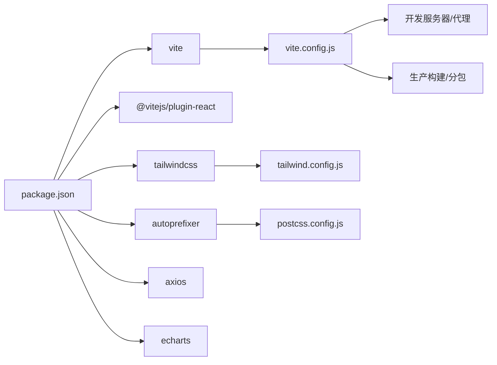

# 构建与部署

<cite>
**本文引用的文件**
- [vite.config.js](file://backpack_quant_trading/frontend/vite.config.js)
- [package.json](file://backpack_quant_trading/frontend/package.json)
- [tailwind.config.js](file://backpack_quant_trading/frontend/tailwind.config.js)
- [postcss.config.js](file://backpack_quant_trading/frontend/postcss.config.js)
- [index.html](file://backpack_quant_trading/frontend/index.html)
- [main.jsx](file://backpack_quant_trading/frontend/src/main.jsx)
- [App.jsx](file://backpack_quant_trading/frontend/src/App.jsx)
- [theme.css](file://backpack_quant_trading/frontend/src/assets/theme.css)
- [variables.css](file://backpack_quant_trading/frontend/src/assets/variables.css)
</cite>

## 目录
1. [简介](#简介)
2. [项目结构](#项目结构)
3. [核心组件](#核心组件)
4. [架构总览](#架构总览)
5. [详细组件分析](#详细组件分析)
6. [依赖关系分析](#依赖关系分析)
7. [性能考虑](#性能考虑)
8. [故障排查指南](#故障排查指南)
9. [结论](#结论)
10. [附录](#附录)

## 简介
本指南面向前端构建与部署，聚焦于 Vite 构建工具在本项目中的配置与使用，涵盖开发服务器设置、生产构建优化、资源打包、Tailwind CSS 与 PostCSS 的配置与定制、环境变量与代理配置、静态资源处理、部署策略与缓存优化、以及构建性能优化（含代码分割与懒加载建议）。内容基于仓库中实际存在的前端配置文件与源码进行整理与提炼，确保可操作性与可追溯性。

## 项目结构
前端位于 backpack_quant_trading/frontend 目录，采用 React + Vite 技术栈，配合 Tailwind CSS 与 PostCSS 进行样式体系构建。关键文件包括：
- 构建与开发：vite.config.js、package.json
- 样式体系：tailwind.config.js、postcss.config.js、src/assets/*.css
- 应用入口：index.html、src/main.jsx、src/App.jsx
- 资源与路由：各页面视图与布局组件（按功能模块划分）

图表来源
- [index.html:1-16](file://backpack_quant_trading/frontend/index.html#L1-L16)
- [main.jsx:1-17](file://backpack_quant_trading/frontend/src/main.jsx#L1-L17)
- [App.jsx:1-76](file://backpack_quant_trading/frontend/src/App.jsx#L1-L76)
- [vite.config.js:1-30](file://backpack_quant_trading/frontend/vite.config.js#L1-L30)
- [tailwind.config.js:1-9](file://backpack_quant_trading/frontend/tailwind.config.js#L1-L9)
- [postcss.config.js:1-7](file://backpack_quant_trading/frontend/postcss.config.js#L1-L7)
- [package.json:1-27](file://backpack_quant_trading/frontend/package.json#L1-L27)

章节来源
- [index.html:1-16](file://backpack_quant_trading/frontend/index.html#L1-L16)
- [main.jsx:1-17](file://backpack_quant_trading/frontend/src/main.jsx#L1-L17)
- [App.jsx:1-76](file://backpack_quant_trading/frontend/src/App.jsx#L1-L76)
- [vite.config.js:1-30](file://backpack_quant_trading/frontend/vite.config.js#L1-L30)
- [tailwind.config.js:1-9](file://backpack_quant_trading/frontend/tailwind.config.js#L1-L9)
- [postcss.config.js:1-7](file://backpack_quant_trading/frontend/postcss.config.js#L1-L7)
- [package.json:1-27](file://backpack_quant_trading/frontend/package.json#L1-L27)

## 核心组件
- Vite 开发服务器与代理
  - 开发端口与主机绑定、本地代理到后端 API（/api 前缀）。
- 生产构建与 Rollup 输出
  - 自定义 chunk 分离策略，将大型库（如图表库）独立分包，降低首屏体积。
- 样式体系
  - Tailwind CSS 内容扫描路径覆盖 src 下所有 JS/TS/JSX/TSX 文件；PostCSS 顺序启用 tailwindcss 与 autoprefixer。
- 应用入口与路由
  - React + React Router DOM；鉴权守卫控制登录/登出访问流。
- 设计变量与主题
  - CSS 变量集中管理颜色、阴影、圆角与字体族；主题覆盖用于强化品牌色系。

章节来源
- [vite.config.js:10-29](file://backpack_quant_trading/frontend/vite.config.js#L10-L29)
- [tailwind.config.js:3-3](file://backpack_quant_trading/frontend/tailwind.config.js#L3-L3)
- [postcss.config.js:1-7](file://backpack_quant_trading/frontend/postcss.config.js#L1-L7)
- [main.jsx:1-17](file://backpack_quant_trading/frontend/src/main.jsx#L1-L17)
- [App.jsx:18-32](file://backpack_quant_trading/frontend/src/App.jsx#L18-L32)
- [variables.css:1-27](file://backpack_quant_trading/frontend/src/assets/variables.css#L1-L27)
- [theme.css:1-112](file://backpack_quant_trading/frontend/src/assets/theme.css#L1-L112)

## 架构总览
下图展示从浏览器请求到后端 API 的典型流程，以及构建产物的生成与加载路径：

图表来源
- [vite.config.js:20-29](file://backpack_quant_trading/frontend/vite.config.js#L20-L29)
- [index.html:14-14](file://backpack_quant_trading/frontend/index.html#L14-L14)

## 详细组件分析

### Vite 配置与使用
- 插件与依赖预优化
  - 使用 React 插件；optimizeDeps.include 指定需要预打包的依赖（如图表库），提升冷启动速度。
- 生产构建优化
  - chunkSizeWarningLimit 提升警告阈值，避免大包误报。
  - manualChunks 将图表库等大型依赖单独拆分为独立 chunk，便于缓存与并行加载。
- 开发服务器
  - 绑定端口与主机，开启 /api 前缀代理，目标地址与后端运行端口保持一致。
- 脚本命令
  - dev/build/preview 三个常用脚本，分别对应开发、构建与本地预览。

图表来源
- [vite.config.js:4-29](file://backpack_quant_trading/frontend/vite.config.js#L4-L29)
- [package.json:6-10](file://backpack_quant_trading/frontend/package.json#L6-L10)

章节来源
- [vite.config.js:1-30](file://backpack_quant_trading/frontend/vite.config.js#L1-L30)
- [package.json:1-27](file://backpack_quant_trading/frontend/package.json#L1-L27)

### Tailwind CSS 与 PostCSS 配置
- Tailwind 内容扫描
  - content 指向 index.html 与 src 下所有支持的文件类型，确保仅生成使用到的样式类，减小体积。
- PostCSS 插件链
  - 先 tailwindcss 后 autoprefixer，保证自动前缀与工具类生成顺序正确。
- 样式组织
  - variables.css 定义全局 CSS 变量（颜色、阴影、圆角、字体），theme.css 基于变量进行主题覆盖与组件样式增强。

图表来源
- [tailwind.config.js:3-3](file://backpack_quant_trading/frontend/tailwind.config.js#L3-L3)
- [postcss.config.js:1-7](file://backpack_quant_trading/frontend/postcss.config.js#L1-L7)
- [variables.css:1-27](file://backpack_quant_trading/frontend/src/assets/variables.css#L1-L27)
- [theme.css:1-112](file://backpack_quant_trading/frontend/src/assets/theme.css#L1-L112)

章节来源
- [tailwind.config.js:1-9](file://backpack_quant_trading/frontend/tailwind.config.js#L1-L9)
- [postcss.config.js:1-7](file://backpack_quant_trading/frontend/postcss.config.js#L1-L7)
- [variables.css:1-27](file://backpack_quant_trading/frontend/src/assets/variables.css#L1-L27)
- [theme.css:1-112](file://backpack_quant_trading/frontend/src/assets/theme.css#L1-L112)

### 应用入口与路由
- 入口文件
  - index.html 中通过 script 加载 /src/main.jsx；main.jsx 渲染 React 应用并引入全局样式。
- 路由与鉴权
  - App.jsx 定义多页面路由与嵌套路由；通过 RequireAuth/GuestOnly 守卫控制访问权限，未登录跳转至登录页，已登录禁止重复访问登录页。

图表来源
- [index.html:14-14](file://backpack_quant_trading/frontend/index.html#L14-L14)
- [main.jsx:1-17](file://backpack_quant_trading/frontend/src/main.jsx#L1-L17)
- [App.jsx:18-32](file://backpack_quant_trading/frontend/src/App.jsx#L18-L32)

章节来源
- [index.html:1-16](file://backpack_quant_trading/frontend/index.html#L1-L16)
- [main.jsx:1-17](file://backpack_quant_trading/frontend/src/main.jsx#L1-L17)
- [App.jsx:1-76](file://backpack_quant_trading/frontend/src/App.jsx#L1-L76)

### 静态资源与字体
- 字体预连接
  - index.html 对 Google Fonts 进行 preconnect，减少字体加载阻塞。
- 图标与媒体
  - favicon 指向 vite.svg；应用内图标使用 lucide-react，无需额外静态资源。

章节来源
- [index.html:7-10](file://backpack_quant_trading/frontend/index.html#L7-L10)

## 依赖关系分析
- 构建与运行
  - package.json 定义 dev/build/preview 脚本，依赖 vite、@vitejs/plugin-react、tailwindcss、autoprefixer、postcss。
- 样式依赖
  - tailwind.config.js 与 postcss.config.js 彼此协作，确保工具链正确执行。
- 运行时依赖
  - React 生态（react、react-dom、react-router-dom）与业务依赖（axios、echarts）在 main.jsx 中统一引入。

图表来源
- [package.json:1-27](file://backpack_quant_trading/frontend/package.json#L1-L27)
- [vite.config.js:1-30](file://backpack_quant_trading/frontend/vite.config.js#L1-L30)
- [tailwind.config.js:1-9](file://backpack_quant_trading/frontend/tailwind.config.js#L1-L9)
- [postcss.config.js:1-7](file://backpack_quant_trading/frontend/postcss.config.js#L1-L7)

章节来源
- [package.json:1-27](file://backpack_quant_trading/frontend/package.json#L1-L27)
- [vite.config.js:1-30](file://backpack_quant_trading/frontend/vite.config.js#L1-L30)
- [tailwind.config.js:1-9](file://backpack_quant_trading/frontend/tailwind.config.js#L1-L9)
- [postcss.config.js:1-7](file://backpack_quant_trading/frontend/postcss.config.js#L1-L7)

## 性能考虑
- 代码分割与懒加载（建议）
  - 将大型页面或组件按路由进行动态导入，结合 React.lazy 与 Suspense 实现按需加载，进一步降低首屏体积。
  - 对第三方库（如图表库）继续沿用 manualChunks 策略，确保稳定缓存命中。
- 缓存与压缩
  - 生产构建默认启用压缩；建议在反向代理或 CDN 层设置合理的缓存头（如静态资源强缓存、HTML 不缓存）。
- 资源体积监控
  - 结合 chunkSizeWarningLimit 与可视化分析工具（如 rollup-plugin-visualizer）持续监控体积变化。
- 依赖预优化
  - optimizeDeps.include 已针对 axios、echarts 等进行预打包，可按需扩展以覆盖更多常用依赖。

章节来源
- [vite.config.js:6-19](file://backpack_quant_trading/frontend/vite.config.js#L6-L19)

## 故障排查指南
- 开发代理无效
  - 确认 /api 代理目标地址与后端运行端口一致；检查代理 changeOrigin 是否启用。
- 端口占用
  - 修改 vite.config.js 中的开发端口；或关闭占用端口的进程。
- 样式未生效
  - 确保 tailwind.config.js 的 content 路径包含当前使用的组件文件；确认 PostCSS 插件链顺序正确。
- 路由跳转异常
  - 检查 RequireAuth/GuestOnly 守卫逻辑与 localStorage 中 token 的存在性；确认路由层级与嵌套是否正确。
- 构建体积过大
  - 检查 manualChunks 配置与第三方库是否被正确拆分；对非必要的依赖进行按需引入或替换。

章节来源
- [vite.config.js:20-29](file://backpack_quant_trading/frontend/vite.config.js#L20-L29)
- [tailwind.config.js:3-3](file://backpack_quant_trading/frontend/tailwind.config.js#L3-L3)
- [App.jsx:18-32](file://backpack_quant_trading/frontend/src/App.jsx#L18-L32)

## 结论
本项目前端以 Vite 为核心，结合 Tailwind CSS 与 PostCSS 构建现代化样式体系，配合路由鉴权与代理机制满足量化交易场景的开发与部署需求。通过合理的代码分割、依赖预优化与缓存策略，可在保证开发体验的同时获得良好的生产性能。后续可进一步引入动态导入与可视化分析工具，持续优化构建体积与用户体验。

## 附录
- 常用命令
  - 开发：npm run dev
  - 构建：npm run build
  - 预览：npm run preview
- 关键配置定位
  - Vite：vite.config.js
  - Tailwind：tailwind.config.js
  - PostCSS：postcss.config.js
  - 入口：index.html、src/main.jsx、src/App.jsx
  - 样式：src/assets/variables.css、src/assets/theme.css