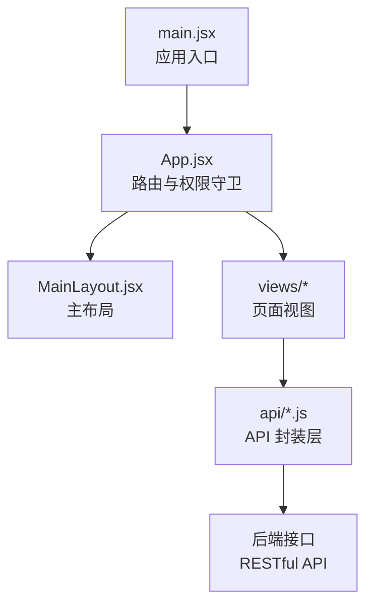
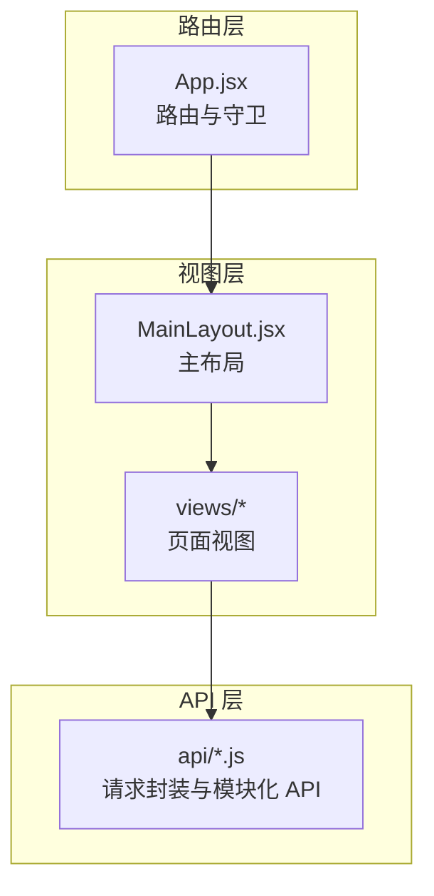
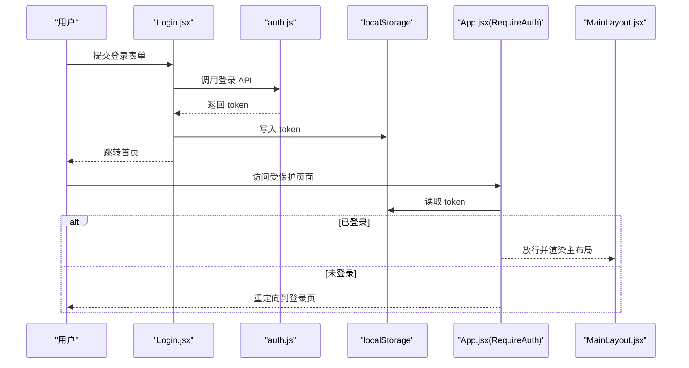
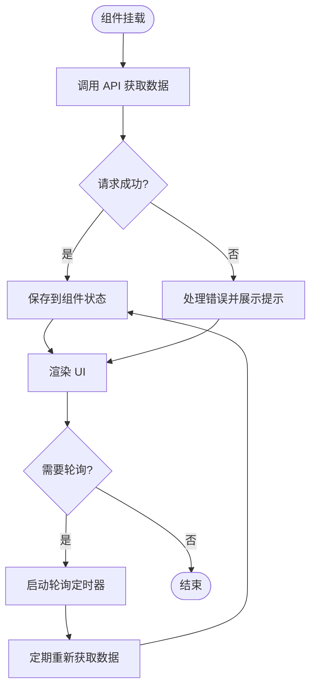
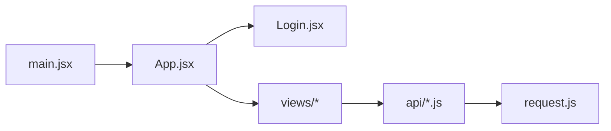

# 状态管理

<cite>
**本文引用的文件**
- [main.jsx](file://backpack_quant_trading/frontend/src/main.jsx)
- [App.jsx](file://backpack_quant_trading/frontend/src/App.jsx)
- [Login.jsx](file://backpack_quant_trading/frontend/src/views/Login.jsx)
- [MainLayout.jsx](file://backpack_quant_trading/frontend/src/layouts/MainLayout.jsx)
- [auth.js](file://backpack_quant_trading/frontend/src/api/auth.js)
- [request.js](file://backpack_quant_trading/frontend/src/api/request.js)
- [dashboard.js](file://backpack_quant_trading/frontend/src/api/dashboard.js)
- [trading.js](file://backpack_quant_trading/frontend/src/api/trading.js)
- [strategy.js](file://backpack_quant_trading/frontend/src/api/strategy.js)
- [grid.js](file://backpack_quant_trading/frontend/src/api/grid.js)
- [currencyMonitor.js](file://backpack_quant_trading/frontend/src/api/currencyMonitor.js)
- [stockAi.js](file://backpack_quant_trading/frontend/src/api/stockAi.js)
- [aiLab.js](file://backpack_quant_trading/frontend/src/api/aiLab.js)
- [okxConsole.js](file://backpack_quant_trading/frontend/src/api/okxConsole.js)
</cite>

## 目录
1. [简介](#简介)
2. [项目结构](#项目结构)
3. [核心组件](#核心组件)
4. [架构总览](#架构总览)
5. [详细组件分析](#详细组件分析)
6. [依赖关系分析](#依赖关系分析)
7. [性能考虑](#性能考虑)
8. [故障排查指南](#故障排查指南)
9. [结论](#结论)
10. [附录](#附录)

## 简介
本文件系统性梳理该量化交易前端应用的状态管理模式与实现方式。根据现有代码分析，前端采用“轻量级状态 + 外部数据源”的模式：  
- 全局状态管理：通过路由守卫与本地存储（localStorage）实现登录态与页面访问控制；组件内部使用 React 的 useState/useEffect 管理局部状态。  
- 组件状态：各视图组件在渲染时从 API 层获取数据并缓存到组件内部，以减少重复请求。  
- 本地存储：登录令牌与用户偏好等信息保存在浏览器 localStorage 中，用于跨页面会话保持与权限控制。  
- 数据流：自上而下的 props 传递为主，少量通过回调向上游回传；API 层负责与后端交互并返回标准化数据。  
- 副作用处理：主要集中在组件生命周期钩子中进行数据拉取、轮询与清理；未见集中式的副作用管理库。  
- 持久化与同步：登录态持久化于 localStorage；组件内状态在页面切换或卸载时丢失，不跨会话持久化。  
- 调试与监控：未发现专门的状态调试工具或性能监控中间件；可通过浏览器开发者工具与网络面板辅助定位问题。  
- 最佳实践与问题：建议引入集中式状态库（如 Zustand 或 Redux Toolkit）以提升可维护性，并完善错误边界与加载状态管理。

## 项目结构
前端入口通过 Vite 构建，应用根节点挂载在 DOM 容器上，使用 React Router 进行页面路由与权限控制。主要目录与职责如下：  
- src/main.jsx：应用入口，创建根节点并包裹路由上下文。  
- src/App.jsx：路由配置与权限守卫（RequireAuth/GuestOnly），定义页面路径与布局。  
- src/views/*：页面视图组件，负责渲染 UI 并调用 API 获取数据。  
- src/layouts/MainLayout.jsx：主布局组件，承载导航与内容区域。  
- src/api/*：统一的 API 请求封装，负责与后端交互与数据格式化。  

**图表来源**
- [main.jsx:1-17](file://backpack_quant_trading/frontend/src/main.jsx#L1-L17)
- [App.jsx:34-72](file://backpack_quant_trading/frontend/src/App.jsx#L34-L72)
- [MainLayout.jsx](file://backpack_quant_trading/frontend/src/layouts/MainLayout.jsx)

**章节来源**
- [main.jsx:1-17](file://backpack_quant_trading/frontend/src/main.jsx#L1-L17)
- [App.jsx:34-72](file://backpack_quant_trading/frontend/src/App.jsx#L34-L72)

## 核心组件
- 应用入口与路由上下文：在入口文件中创建根节点并包裹路由上下文，确保所有页面共享路由能力。  
- 权限守卫：RequireAuth 与 GuestOnly 通过读取 localStorage 中的 token 实现登录态校验与页面跳转。  
- 主布局：MainLayout 承载导航菜单与内容区，作为页面容器。  
- 页面视图：各页面组件负责渲染 UI、发起 API 请求与处理用户交互。  
- API 层：统一的请求封装与模块化 API 文件，按功能域拆分，便于维护与复用。  

**章节来源**
- [main.jsx:9-15](file://backpack_quant_trading/frontend/src/main.jsx#L9-L15)
- [App.jsx:18-32](file://backpack_quant_trading/frontend/src/App.jsx#L18-L32)
- [App.jsx:34-72](file://backpack_quant_trading/frontend/src/App.jsx#L34-L72)
- [MainLayout.jsx](file://backpack_quant_trading/frontend/src/layouts/MainLayout.jsx)

## 架构总览
前端整体采用“路由 + 视图 + API”三层结构：  
- 路由层：负责页面导航与权限控制。  
- 视图层：负责 UI 渲染与用户交互，内部管理组件状态。  
- API 层：负责与后端通信、数据格式化与错误处理。  

**图表来源**
- [App.jsx:34-72](file://backpack_quant_trading/frontend/src/App.jsx#L34-L72)
- [MainLayout.jsx](file://backpack_quant_trading/frontend/src/layouts/MainLayout.jsx)
- [auth.js](file://backpack_quant_trading/frontend/src/api/auth.js)
- [request.js](file://backpack_quant_trading/frontend/src/api/request.js)

## 详细组件分析

### 登录与权限控制流程
登录态通过 localStorage 中的 token 判断，未登录用户被重定向至登录页，已登录用户可访问受保护页面。  
- 登录页：用户提交凭据后调用认证 API，成功后写入 token 并跳转首页。  
- 页面跳转：路由守卫在每次导航时检查 token，决定是否放行或重定向。  

**图表来源**
- [Login.jsx](file://backpack_quant_trading/frontend/src/views/Login.jsx)
- [auth.js](file://backpack_quant_trading/frontend/src/api/auth.js)
- [App.jsx:18-32](file://backpack_quant_trading/frontend/src/App.jsx#L18-L32)

**章节来源**
- [App.jsx:18-32](file://backpack_quant_trading/frontend/src/App.jsx#L18-L32)
- [Login.jsx](file://backpack_quant_trading/frontend/src/views/Login.jsx)

### 数据获取与组件状态管理
- 页面组件在挂载时发起 API 请求，将返回的数据保存在组件内部状态中，用于渲染 UI。  
- 部分页面支持轮询或事件驱动的刷新逻辑，组件内部负责启动/停止轮询与资源清理。  
- 由于未发现集中式状态库，组件间共享状态主要通过 props 向下传递或回调向上游回传。  

**图表来源**
- [dashboard.js](file://backpack_quant_trading/frontend/src/api/dashboard.js)
- [trading.js](file://backpack_quant_trading/frontend/src/api/trading.js)
- [strategy.js](file://backpack_quant_trading/frontend/src/api/strategy.js)
- [grid.js](file://backpack_quant_trading/frontend/src/api/grid.js)
- [currencyMonitor.js](file://backpack_quant_trading/frontend/src/api/currencyMonitor.js)
- [stockAi.js](file://backpack_quant_trading/frontend/src/api/stockAi.js)
- [aiLab.js](file://backpack_quant_trading/frontend/src/api/aiLab.js)
- [okxConsole.js](file://backpack_quant_trading/frontend/src/api/okxConsole.js)

**章节来源**
- [dashboard.js](file://backpack_quant_trading/frontend/src/api/dashboard.js)
- [trading.js](file://backpack_quant_trading/frontend/src/api/trading.js)
- [strategy.js](file://backpack_quant_trading/frontend/src/api/strategy.js)
- [grid.js](file://backpack_quant_trading/frontend/src/api/grid.js)
- [currencyMonitor.js](file://backpack_quant_trading/frontend/src/api/currencyMonitor.js)
- [stockAi.js](file://backpack_quant_trading/frontend/src/api/stockAi.js)
- [aiLab.js](file://backpack_quant_trading/frontend/src/api/aiLab.js)
- [okxConsole.js](file://backpack_quant_trading/frontend/src/api/okxConsole.js)

### 本地存储与会话持久化
- 登录令牌：通过 localStorage 存储 token，实现跨页面会话保持。  
- 用户偏好：可扩展地将用户设置（如主题、语言、图表参数）保存在 localStorage 中。  
- 注意事项：localStorage 不具备过期控制，需在业务层自行处理 token 刷新与失效逻辑。  

**章节来源**
- [App.jsx:18-32](file://backpack_quant_trading/frontend/src/App.jsx#L18-L32)
- [auth.js](file://backpack_quant_trading/frontend/src/api/auth.js)

### 跨组件通信与状态同步
- 自上而下：父组件通过 props 向子组件传递数据与回调。  
- 自下而上：子组件通过回调将变更通知父组件，父组件更新自身状态并向下传递。  
- 页面间通信：通过路由参数与查询字符串传递简单状态；复杂状态建议引入集中式状态库。  

**章节来源**
- [MainLayout.jsx](file://backpack_quant_trading/frontend/src/layouts/MainLayout.jsx)

### 副作用处理与资源清理
- 定时器：部分页面使用定时器周期性拉取数据，需在组件卸载时清理定时器，避免内存泄漏。  
- 网络请求：在组件卸载前取消未完成的请求，防止更新已卸载组件的状态。  
- 事件监听：添加事件监听后应在清理函数中移除，确保生命周期安全。  

**章节来源**
- [trading.js](file://backpack_quant_trading/frontend/src/api/trading.js)
- [dashboard.js](file://backpack_quant_trading/frontend/src/api/dashboard.js)

## 依赖关系分析
- 入口依赖：main.jsx 依赖 React、ReactDOM 与 React Router。  
- 路由依赖：App.jsx 依赖路由组件与权限守卫，依赖各页面视图组件。  
- 视图依赖：页面视图依赖布局组件与 API 层。  
- API 依赖：API 文件依赖通用请求封装与后端接口。  

**图表来源**
- [main.jsx:1-17](file://backpack_quant_trading/frontend/src/main.jsx#L1-L17)
- [App.jsx:34-72](file://backpack_quant_trading/frontend/src/App.jsx#L34-L72)
- [Login.jsx](file://backpack_quant_trading/frontend/src/views/Login.jsx)
- [request.js](file://backpack_quant_trading/frontend/src/api/request.js)

**章节来源**
- [main.jsx:1-17](file://backpack_quant_trading/frontend/src/main.jsx#L1-L17)
- [App.jsx:34-72](file://backpack_quant_trading/frontend/src/App.jsx#L34-L72)
- [request.js](file://backpack_quant_trading/frontend/src/api/request.js)

## 性能考虑
- 减少不必要的重渲染：使用 React.memo、useMemo、useCallback 优化组件与回调。  
- 请求去抖与节流：对高频轮询或用户输入触发的请求进行去抖/节流处理。  
- 分页与懒加载：对大数据集采用分页或虚拟滚动，降低一次性渲染压力。  
- 缓存策略：在组件内缓存短期数据，避免重复请求；对长时效数据使用更合理的缓存策略。  
- 资源清理：及时清理定时器、订阅与事件监听，防止内存泄漏。  

## 故障排查指南
- 登录失败或页面无法跳转：检查 localStorage 中 token 是否存在与有效；确认路由守卫逻辑与后端认证接口一致。  
- 数据不更新：检查组件内的轮询逻辑与定时器是否正确启动与清理；确认请求是否被取消或中断。  
- 内存泄漏：排查是否存在未清理的定时器、事件监听或未取消的请求；确保在组件卸载时执行清理。  
- 网络错误：通过浏览器网络面板查看请求状态码与响应体，结合 API 层错误处理逻辑定位问题。  
- 调试工具：可借助 React DevTools 查看组件树与状态变化；必要时在关键位置添加日志输出。  

**章节来源**
- [App.jsx:18-32](file://backpack_quant_trading/frontend/src/App.jsx#L18-L32)
- [trading.js](file://backpack_quant_trading/frontend/src/api/trading.js)

## 结论
当前前端采用轻量级状态管理模式，通过路由守卫与 localStorage 实现登录态与页面访问控制，组件内部使用 React 状态管理局部数据。该模式简单直观，适合中小型项目；但随着业务复杂度上升，建议引入集中式状态库以提升可维护性与可观测性，并完善错误处理、性能监控与调试工具链。

## 附录
- 推荐引入的状态库：Zustand（轻量）、Redux Toolkit（功能全面）。  
- 调试与监控：React DevTools、Redux DevTools（如使用 Redux）、性能面板与网络面板。  
- 最佳实践清单：  
  - 使用集中式状态库统一管理全局状态。  
  - 为每个页面建立独立的 store 或 slice，按功能域拆分。  
  - 在 store 中加入状态快照与时间旅行调试能力。  
  - 对高频操作增加防抖/节流与批量更新。  
  - 为异步操作添加 loading、error、success 三态管理。  
  - 在组件卸载时清理所有副作用，防止内存泄漏。  
  - 对关键状态添加持久化策略（如 localStorage 或 IndexedDB）。  
  - 建立统一的错误边界与全局错误提示机制。