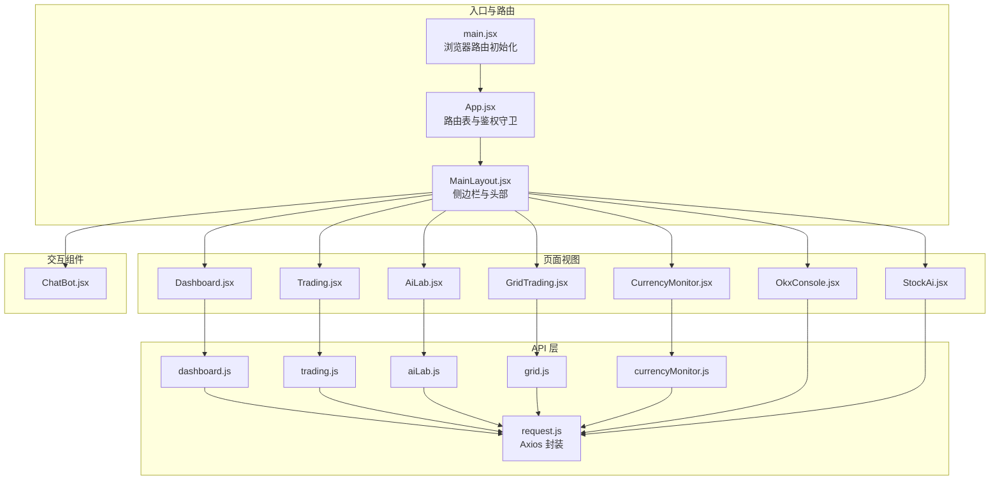
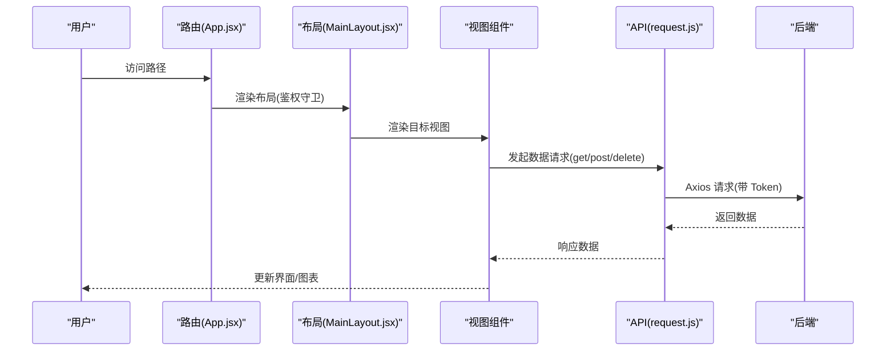
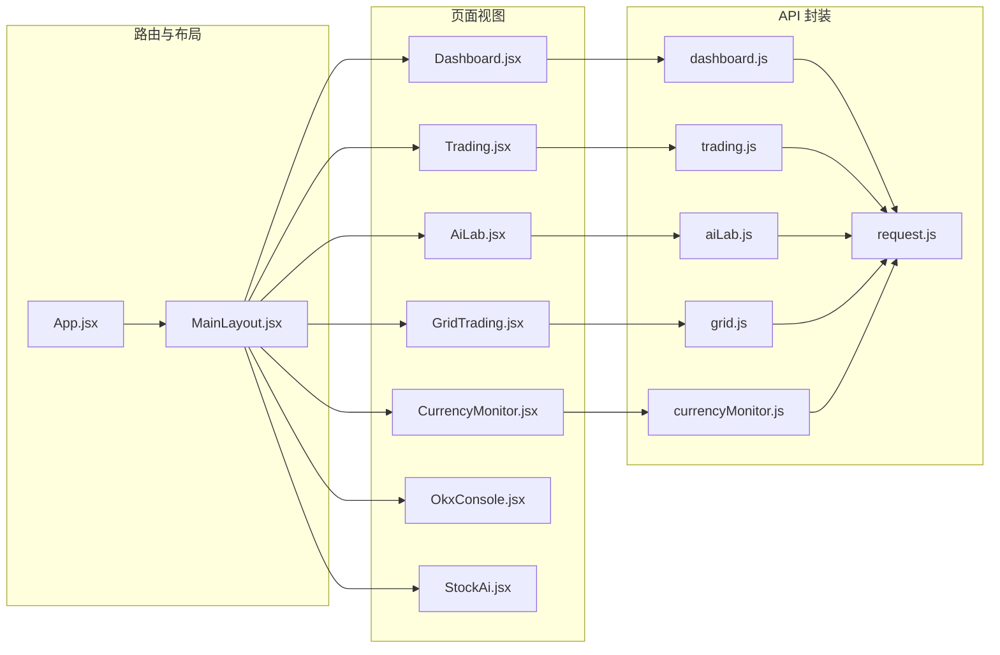

# 页面视图集成

<cite>
**本文引用的文件**
- [App.jsx](file://backpack_quant_trading/frontend/src/App.jsx)
- [MainLayout.jsx](file://backpack_quant_trading/frontend/src/layouts/MainLayout.jsx)
- [main.jsx](file://backpack_quant_trading/frontend/src/main.jsx)
- [Dashboard.jsx](file://backpack_quant_trading/frontend/src/views/Dashboard.jsx)
- [Trading.jsx](file://backpack_quant_trading/frontend/src/views/Trading.jsx)
- [AiLab.jsx](file://backpack_quant_trading/frontend/src/views/AiLab.jsx)
- [GridTrading.jsx](file://backpack_quant_trading/frontend/src/views/GridTrading.jsx)
- [CurrencyMonitor.jsx](file://backpack_quant_trading/frontend/src/views/CurrencyMonitor.jsx)
- [OkxConsole.jsx](file://backpack_quant_trading/frontend/src/views/OkxConsole.jsx)
- [StockAi.jsx](file://backpack_quant_trading/frontend/src/views/StockAi.jsx)
- [dashboard.js](file://backpack_quant_trading/frontend/src/api/dashboard.js)
- [trading.js](file://backpack_quant_trading/frontend/src/api/trading.js)
- [aiLab.js](file://backpack_quant_trading/frontend/src/api/aiLab.js)
- [grid.js](file://backpack_quant_trading/frontend/src/api/grid.js)
- [currencyMonitor.js](file://backpack_quant_trading/frontend/src/api/currencyMonitor.js)
- [request.js](file://backpack_quant_trading/frontend/src/api/request.js)
- [ChatBot.jsx](file://backpack_quant_trading/frontend/src/components/ChatBot.jsx)
</cite>

## 目录
1. [简介](#简介)
2. [项目结构](#项目结构)
3. [核心组件](#核心组件)
4. [架构总览](#架构总览)
5. [详细组件分析](#详细组件分析)
6. [依赖关系分析](#依赖关系分析)
7. [性能考虑](#性能考虑)
8. [故障排查指南](#故障排查指南)
9. [结论](#结论)
10. [附录](#附录)

## 简介
本文件面向“页面视图集成”，系统性梳理前端页面视图在本项目中的功能定位、实现方式、数据流与状态共享、导航机制、生命周期管理、实时更新策略、性能优化、错误处理与用户体验优化方案。重点覆盖以下页面视图：Dashboard 仪表板、Trading 交易页面、AiLab 人工智能实验室、GridTrading 网格交易、CurrencyMonitor 货币监控，并补充与之相关的策略矩阵、A股 AI 选股、OKX 控制台等页面。

## 项目结构
前端采用 React + react-router-dom 构建，通过主应用入口注册路由与布局，页面视图位于 views 目录，API 封装位于 api 目录，UI 交互组件位于 components 目录，样式位于 assets 与各页面 CSS 文件中。

图表来源
- [main.jsx:1-17](file://backpack_quant_trading/frontend/src/main.jsx#L1-L17)
- [App.jsx:1-76](file://backpack_quant_trading/frontend/src/App.jsx#L1-L76)
- [MainLayout.jsx:1-222](file://backpack_quant_trading/frontend/src/layouts/MainLayout.jsx#L1-L222)
- [Dashboard.jsx:1-311](file://backpack_quant_trading/frontend/src/views/Dashboard.jsx#L1-L311)
- [Trading.jsx:1-499](file://backpack_quant_trading/frontend/src/views/Trading.jsx#L1-L499)
- [AiLab.jsx:1-299](file://backpack_quant_trading/frontend/src/views/AiLab.jsx#L1-L299)
- [GridTrading.jsx:1-335](file://backpack_quant_trading/frontend/src/views/GridTrading.jsx#L1-L335)
- [CurrencyMonitor.jsx:1-466](file://backpack_quant_trading/frontend/src/views/CurrencyMonitor.jsx#L1-L466)
- [OkxConsole.jsx:1-191](file://backpack_quant_trading/frontend/src/views/OkxConsole.jsx#L1-L191)
- [StockAi.jsx:1-585](file://backpack_quant_trading/frontend/src/views/StockAi.jsx#L1-L585)
- [request.js:1-33](file://backpack_quant_trading/frontend/src/api/request.js#L1-L33)
- [dashboard.js:1-5](file://backpack_quant_trading/frontend/src/api/dashboard.js#L1-L5)
- [trading.js:1-14](file://backpack_quant_trading/frontend/src/api/trading.js#L1-L14)
- [aiLab.js:1-7](file://backpack_quant_trading/frontend/src/api/aiLab.js#L1-L7)
- [grid.js:1-8](file://backpack_quant_trading/frontend/src/api/grid.js#L1-L8)
- [currencyMonitor.js:1-13](file://backpack_quant_trading/frontend/src/api/currencyMonitor.js#L1-L13)

章节来源
- [main.jsx:1-17](file://backpack_quant_trading/frontend/src/main.jsx#L1-L17)
- [App.jsx:1-76](file://backpack_quant_trading/frontend/src/App.jsx#L1-L76)
- [MainLayout.jsx:1-222](file://backpack_quant_trading/frontend/src/layouts/MainLayout.jsx#L1-L222)

## 核心组件
- 主应用与路由：负责全局路由注册、登录态校验与页面嵌套渲染。
- 主布局：提供侧边栏导航、头部信息、用户状态与聊天机器人。
- 页面视图：每个页面封装自身数据获取、状态管理、图表渲染与交互。
- API 层：统一请求封装与拦截器，集中处理鉴权与错误响应。
- 交互组件：聊天机器人提供浮动交互面板，增强用户体验。

章节来源
- [App.jsx:18-72](file://backpack_quant_trading/frontend/src/App.jsx#L18-L72)
- [MainLayout.jsx:65-222](file://backpack_quant_trading/frontend/src/layouts/MainLayout.jsx#L65-L222)
- [request.js:9-30](file://backpack_quant_trading/frontend/src/api/request.js#L9-L30)

## 架构总览
页面视图通过路由与布局组织，API 层统一处理请求与响应拦截，页面内部通过 useEffect 生命周期发起定时轮询与一次性加载，状态通过 React hooks 管理并在组件卸载时清理定时器，确保资源释放与内存安全。

图表来源
- [App.jsx:34-72](file://backpack_quant_trading/frontend/src/App.jsx#L34-L72)
- [MainLayout.jsx:65-222](file://backpack_quant_trading/frontend/src/layouts/MainLayout.jsx#L65-L222)
- [request.js:9-30](file://backpack_quant_trading/frontend/src/api/request.js#L9-L30)

## 详细组件分析

### Dashboard 仪表板
- 功能要点
  - 资产概览卡片：总资产、可用现金、当日盈亏、当日收益率。
  - 净值曲线折线图：基于 ECharts 渲染，自动刷新。
  - 实时数据表格：当前活动仓位、活动订单、成交历史、风险事件。
  - 平台选择与时间同步：动态获取实例平台、本地时间显示。
- 数据与状态
  - 通过 getDashboard 获取汇总与明细数据，setSummary/setChartData 等状态驱动渲染。
  - 使用 ECharts 初始化与 setOption 更新图表。
- 生命周期与实时更新
  - 首次加载获取实例平台与初始数据，随后每 10 秒刷新一次。
  - 本地时间每秒更新，保证界面实时性。
  - 卸载时清理定时器，避免内存泄漏。
- 错误处理
  - 所有异步请求包裹 try/catch，静默失败避免中断流程。
- 用户体验
  - 数值格式化、正负颜色区分、空态提示。

章节来源
- [Dashboard.jsx:14-311](file://backpack_quant_trading/frontend/src/views/Dashboard.jsx#L14-L311)
- [dashboard.js:1-5](file://backpack_quant_trading/frontend/src/api/dashboard.js#L1-L5)

### Trading 交易页面
- 功能要点
  - 策略实例管理：运行中实例卡片展示、停止实例、HYPE 策略开关。
  - 系统日志：实时滚动日志窗口。
  - 启动新策略：弹窗配置平台、策略、API/私钥、交易参数，支持不同平台差异化校验。
  - HYPE 自适应做空策略：独立启动端点与参数校验。
- 数据与状态
  - getStrategies/getInstances/getLogs/getHypeStatus 获取策略列表、实例、日志与 HYPE 状态。
  - 表单状态 form 与切换状态 launching/togglingHype。
- 生命周期与实时更新
  - 策略实例与日志分别以 5s/10s 轮询刷新，HYPE 状态 5s 刷新。
  - 卸载清理定时器。
- 错误处理
  - 启动/停止/切换均捕获异常并弹窗提示，401 自动登出。
- 用户体验
  - 折叠面板、占位提示、禁用态、加载态反馈。

章节来源
- [Trading.jsx:21-499](file://backpack_quant_trading/frontend/src/views/Trading.jsx#L21-L499)
- [trading.js:1-14](file://backpack_quant_trading/frontend/src/api/trading.js#L1-L14)

### AiLab 人工智能实验室
- 功能要点
  - K 线数据抓取：支持从外部源抓取指定币种与周期的 K 线。
  - 图表可视化：ECharts K 线蜡烛图，支持标记买卖点。
  - AI 综合分析：上传截图或粘贴原始 JSON，触发分析并展示报告。
  - 币种与周期选择：下拉选择与过滤。
- 数据与状态
  - fetchKline/runAnalyze 通过 API 获取数据与分析结果。
  - klineJson/suggestedBuy/suggestedSell 控制图表渲染与标记。
- 生命周期与实时更新
  - 图表在 klineJson 或建议买卖点变化时重新渲染。
- 错误处理
  - 抓取/分析失败弹窗提示，解析 JSON 失败保护。
- 用户体验
  - 加载态、预览图、分步引导、交互式缩放。

章节来源
- [AiLab.jsx:17-299](file://backpack_quant_trading/frontend/src/views/AiLab.jsx#L17-L299)
- [aiLab.js:1-7](file://backpack_quant_trading/frontend/src/api/aiLab.js#L1-L7)

### GridTrading 网格交易
- 功能要点
  - 参数配置：交易所、交易对、价格区间、网格数量、单格投资、杠杆、模式（做多/做空/双向）、API 密钥。
  - 参数预览：计算网格间距、总投入、持仓价值、单网格收益、强平价等。
  - 实例管理：运行中网格列表、停止单个/全部网格。
- 数据与状态
  - getGridStatus/startGrid/stopGrid/stopAllGrids 管理网格状态与启停。
  - 表单状态 form 与预览 gridPreview。
- 生命周期与实时更新
  - 每 3s 轮询网格状态，保持界面与后端一致。
- 错误处理
  - 启停失败弹窗提示，必填项校验。
- 用户体验
  - 参数联动、预览卡片、禁用态、空态提示。

章节来源
- [GridTrading.jsx:24-335](file://backpack_quant_trading/frontend/src/views/GridTrading.jsx#L24-L335)
- [grid.js:1-8](file://backpack_quant_trading/frontend/src/api/grid.js#L1-L8)

### CurrencyMonitor 货币监控
- 功能要点
  - 币种监视：选择币种与 K 线级别，启动/停止监视，移除单项。
  - 分钟预警：波动/量能/订单簿阈值配置，启动/停止预警。
  - 实时展示：监视/预警中的币种列表，高亮告警项。
- 数据与状态
  - getSymbols/getStatus/startMonitor/stopMonitor/removePair 管理币种列表与状态。
  - getMinuteAlertStatus/startMinuteAlert/stopMinuteAlert 管理分钟预警。
  - selectedSymbols/selectedTimeframes/status/alertedPairs 等状态。
- 生命周期与实时更新
  - 监视与分钟预警分别 5s 轮询刷新。
- 错误处理
  - 启停失败弹窗提示，移除单项异常处理。
- 用户体验
  - 多选下拉、搜索过滤、标签化展示、告警高亮。

章节来源
- [CurrencyMonitor.jsx:99-466](file://backpack_quant_trading/frontend/src/views/CurrencyMonitor.jsx#L99-L466)
- [currencyMonitor.js:1-13](file://backpack_quant_trading/frontend/src/api/currencyMonitor.js#L1-L13)

### OKX 控制台
- 功能要点
  - 聊天式操作：输入自然语言指令，AI Agent 解析并执行或确认执行。
  - 会话管理：消息列表、滚动到底部、发送中状态。
  - 配置选项：profile、demo 模式。
- 数据与状态
  - runAgent 发送文本与配置，维护 messages 数组。
- 生命周期与实时更新
  - 无后台轮询，按需请求。
- 错误处理
  - 401 登录态失效提示，异常消息兜底。
- 用户体验
  - 输入框回车发送、确认按钮、打字动画。

章节来源
- [OkxConsole.jsx:8-191](file://backpack_quant_trading/frontend/src/views/OkxConsole.jsx#L8-L191)

### A股 AI 选股
- 功能要点
  - 板块/行业多选、返回数量、最低得分、回溯天数等筛选条件。
  - 刷新 K 线缓存、模型训练、每日预测、选股与 AI 解读。
  - 单股分析：输入代码获取分析结果。
- 数据与状态
  - 多个 API：板块/行业选项、选股、AI 解读、单股分析、每日预测、训练、缓存刷新。
  - 多处 loading/analyzing/loading 状态控制。
- 生命周期与实时更新
  - 无后台轮询，按需请求。
- 错误处理
  - 401 登录提示，异常消息兜底。
- 用户体验
  - 多卡片布局、空态提示、表格分页、颜色分级。

章节来源
- [StockAi.jsx:125-585](file://backpack_quant_trading/frontend/src/views/StockAi.jsx#L125-L585)

### 主布局与导航
- 功能要点
  - 侧边栏导航：实盘交易、AI 实验室、币种监视、AI 策略矩阵等。
  - 头部信息：页面标题、状态徽章、用户信息、退出登录。
  - 聊天机器人：浮动面板，拖拽、收起、发送消息。
- 数据与状态
  - 通过 useLocation/useNavigate 管理激活状态与跳转。
  - 用户信息从 localStorage 读取。
- 生命周期与实时更新
  - 无后台轮询，按需渲染。
- 错误处理
  - 无特殊错误处理逻辑。
- 用户体验
  - 父子菜单折叠、图标与高亮、悬浮提示。

章节来源
- [MainLayout.jsx:18-222](file://backpack_quant_trading/frontend/src/layouts/MainLayout.jsx#L18-L222)
- [ChatBot.jsx:20-250](file://backpack_quant_trading/frontend/src/components/ChatBot.jsx#L20-L250)

## 依赖关系分析

图表来源
- [App.jsx:34-72](file://backpack_quant_trading/frontend/src/App.jsx#L34-L72)
- [MainLayout.jsx:65-222](file://backpack_quant_trading/frontend/src/layouts/MainLayout.jsx#L65-L222)
- [request.js:1-33](file://backpack_quant_trading/frontend/src/api/request.js#L1-L33)
- [dashboard.js:1-5](file://backpack_quant_trading/frontend/src/api/dashboard.js#L1-L5)
- [trading.js:1-14](file://backpack_quant_trading/frontend/src/api/trading.js#L1-L14)
- [aiLab.js:1-7](file://backpack_quant_trading/frontend/src/api/aiLab.js#L1-L7)
- [grid.js:1-8](file://backpack_quant_trading/frontend/src/api/grid.js#L1-L8)
- [currencyMonitor.js:1-13](file://backpack_quant_trading/frontend/src/api/currencyMonitor.js#L1-L13)

## 性能考虑
- 请求与超时
  - Axios 默认超时 30s，AI 分析接口延长至 3 分钟，避免长时间阻塞。
- 定时轮询
  - Dashboard/Trading/GridTrading/Monitor 页面按需设置轮询间隔，避免过于频繁导致资源浪费。
- 图表渲染
  - ECharts 在数据变化时才重新 setOption，避免重复初始化。
- 状态与内存
  - 组件卸载时清理定时器，防止内存泄漏。
- UI 交互
  - 多选下拉限制展示条目，搜索过滤减少 DOM 渲染压力。
- 缓存与预览
  - GridTrading 的参数预览在表单变化时即时计算，避免不必要的网络请求。

章节来源
- [request.js:3-7](file://backpack_quant_trading/frontend/src/api/request.js#L3-L7)
- [aiLab.js](file://backpack_quant_trading/frontend/src/api/aiLab.js#L6)
- [Dashboard.jsx:60-81](file://backpack_quant_trading/frontend/src/views/Dashboard.jsx#L60-L81)
- [Trading.jsx:81-101](file://backpack_quant_trading/frontend/src/views/Trading.jsx#L81-L101)
- [GridTrading.jsx:73-84](file://backpack_quant_trading/frontend/src/views/GridTrading.jsx#L73-L84)
- [CurrencyMonitor.jsx:132-180](file://backpack_quant_trading/frontend/src/views/CurrencyMonitor.jsx#L132-L180)

## 故障排查指南
- 登录态失效
  - 401 响应时自动清除本地 token 与用户信息并跳转登录页。
- 启动/停止失败
  - 弹窗显示后端 detail 或默认错误信息；检查必填字段与平台密钥。
- 图表不渲染
  - 确认数据非空且格式正确；检查 ECharts 初始化与 setOption 调用时机。
- 轮询无更新
  - 检查定时器是否被清理；确认后端接口可用与网络连通。
- 聊天机器人
  - 拖拽位置持久化，面板展开/收起与加载态正常；网络异常时显示兜底消息。

章节来源
- [request.js:20-30](file://backpack_quant_trading/frontend/src/api/request.js#L20-L30)
- [Trading.jsx:103-162](file://backpack_quant_trading/frontend/src/views/Trading.jsx#L103-L162)
- [GridTrading.jsx:88-134](file://backpack_quant_trading/frontend/src/views/GridTrading.jsx#L88-L134)
- [AiLab.jsx:68-120](file://backpack_quant_trading/frontend/src/views/AiLab.jsx#L68-L120)
- [ChatBot.jsx:114-142](file://backpack_quant_trading/frontend/src/components/ChatBot.jsx#L114-L142)

## 结论
本项目通过清晰的路由与布局组织，将多个页面视图解耦为独立模块，配合统一的 API 封装与拦截器，实现了稳定的鉴权与错误处理。页面内部采用生命周期钩子与定时轮询保障数据实时性，结合 ECharts 等可视化库提升用户体验。建议后续在跨页面状态共享与缓存策略方面进一步优化，以降低重复请求与提升复杂场景下的交互流畅度。

## 附录
- 页面间导航机制
  - 通过 react-router-dom 的路由表与 MainLayout 嵌套路由实现，侧边栏点击跳转，支持父子菜单统一标题与激活态。
- 数据传递与状态共享
  - 页面内通过 hooks 管理状态；跨页面共享依赖 localStorage（token/user）与后端接口；组件间通过 props 传递简单数据。
- 生命周期管理
  - 首次加载 + 定时轮询 + 卸载清理，确保资源释放与数据一致性。
- 实时更新处理
  - 不同页面设置不同轮询间隔，AI 分析接口单独延长超时，兼顾性能与体验。
- 错误边界与用户体验
  - 统一 401 自动登出；弹窗提示错误；加载态与空态提示；聊天机器人与多选下拉优化交互。