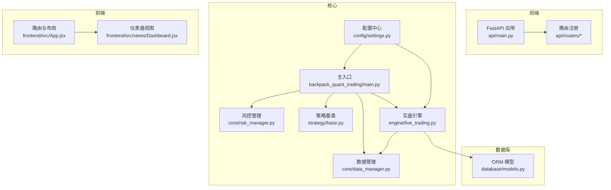
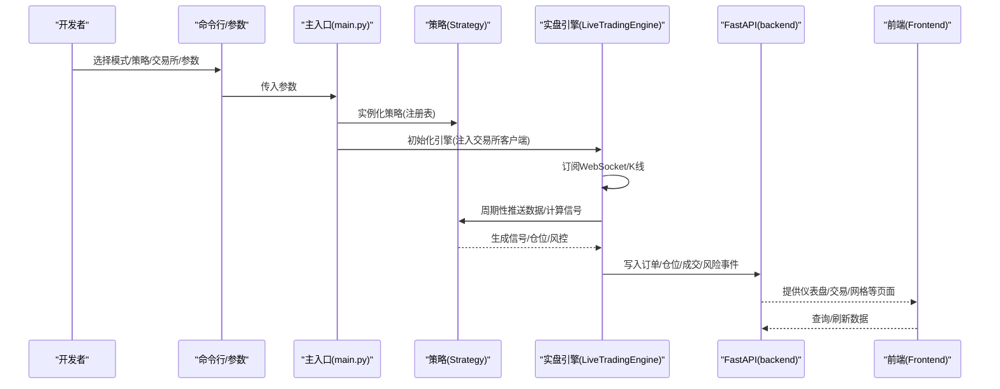
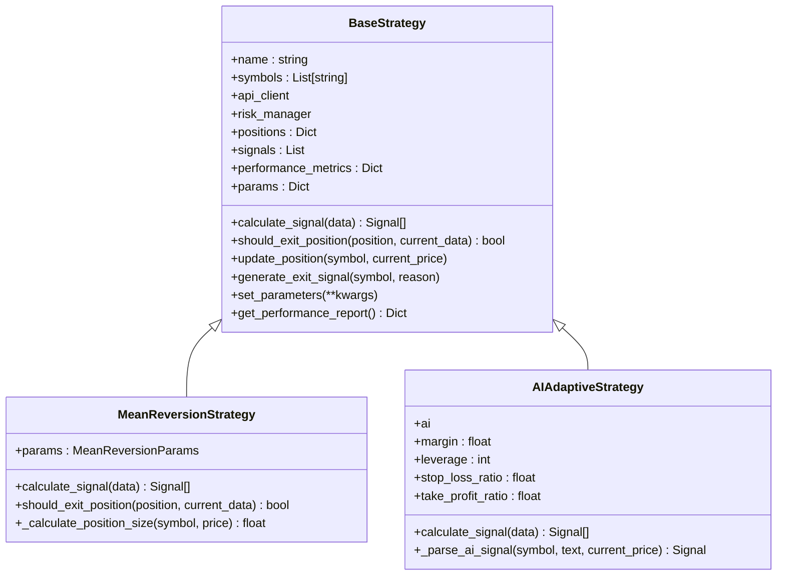
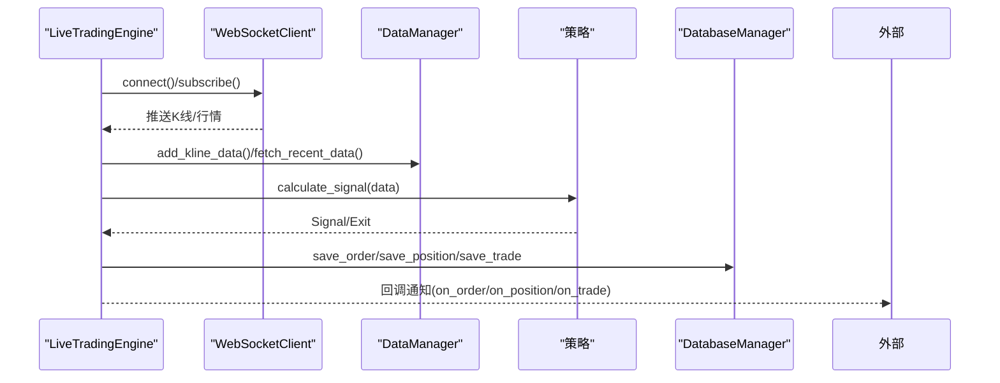
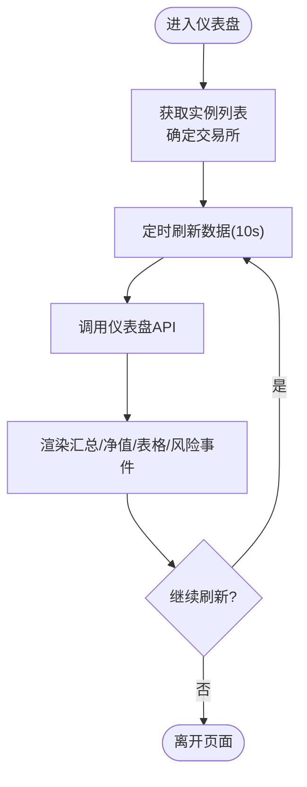
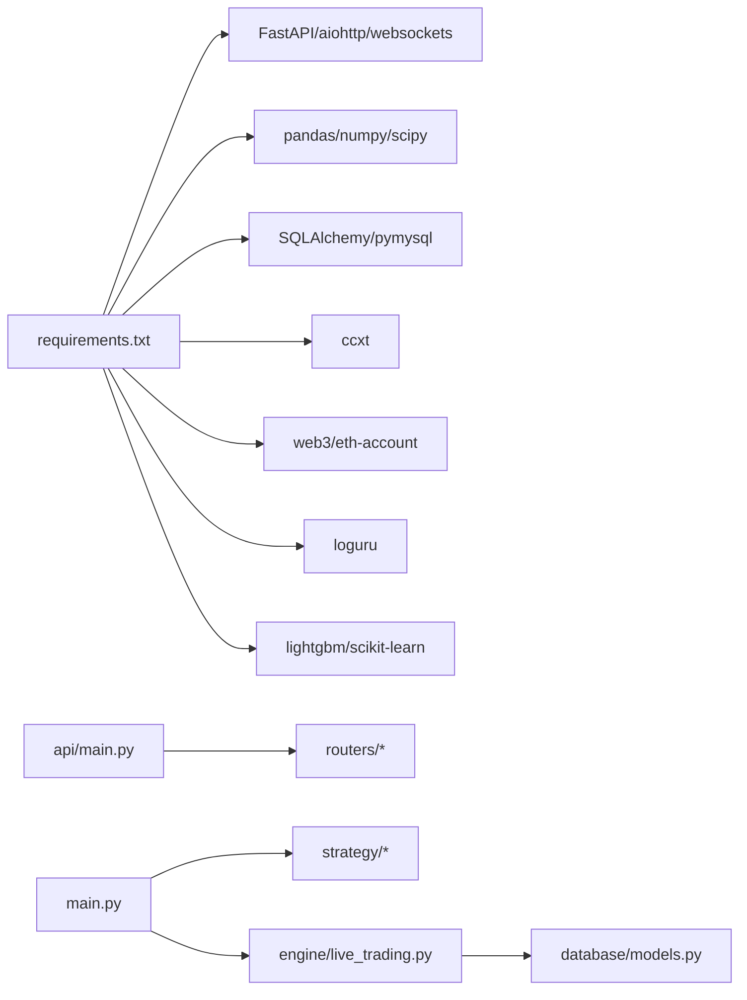

# 开发指南

<cite>
**本文档引用的文件**
- [main.py](file://backpack_quant_trading/main.py)
- [requirements.txt](file://backpack_quant_trading/requirements.txt)
- [Frontend_README.md](file://backpack_quant_trading/Frontend_README.md)
- [settings.py](file://backpack_quant_trading/config/settings.py)
- [main.py](file://backpack_quant_trading/api/main.py)
- [base.py](file://backpack_quant_trading/strategy/base.py)
- [live_trading.py](file://backpack_quant_trading/engine/live_trading.py)
- [data_manager.py](file://backpack_quant_trading/core/data_manager.py)
- [logger.py](file://backpack_quant_trading/utils/logger.py)
- [models.py](file://backpack_quant_trading/database/models.py)
- [mean_reversion.py](file://backpack_quant_trading/strategy/mean_reversion.py)
- [ai_adaptive.py](file://backpack_quant_trading/strategy/ai_adaptive.py)
- [Dashboard.jsx](file://backpack_quant_trading/frontend/src/views/Dashboard.jsx)
- [App.jsx](file://backpack_quant_trading/frontend/src/App.jsx)
- [run_api.py](file://backpack_quant_trading/run_api.py)
</cite>

## 目录
1. [简介](#简介)
2. [项目结构](#项目结构)
3. [核心组件](#核心组件)
4. [架构总览](#架构总览)
5. [详细组件分析](#详细组件分析)
6. [依赖关系分析](#依赖关系分析)
7. [性能考虑](#性能考虑)
8. [故障排查指南](#故障排查指南)
9. [结论](#结论)
10. [附录](#附录)

## 简介
本开发指南面向量化交易系统的开发者，系统性阐述代码规范、新策略开发流程、前端开发规范与测试策略，涵盖项目结构、模块依赖关系、开发环境搭建、调试与性能分析、问题排查以及扩展点与插件化架构理念。读者可据此快速上手开发、集成与维护本项目。

## 项目结构
项目采用“后端（FastAPI）+ 前端（React/Vue混合）+ 策略引擎 + 数据与风控”的分层架构，核心模块包括：
- 后端入口与路由：FastAPI 应用与路由注册
- 配置中心：集中管理各交易所与运行参数
- 策略层：策略基类与多种策略实现
- 引擎层：回测与实盘交易引擎
- 数据层：数据管理、缓存与技术指标计算
- 前端：仪表盘、交易、网格、AI 实验室等页面
- 工具与日志：统一日志与工具函数
- 数据库：ORM 模型与持久化

**图表来源**
- [main.py:1-344](file://backpack_quant_trading/main.py#L1-L344)
- [settings.py:1-137](file://backpack_quant_trading/config/settings.py#L1-L137)
- [main.py:1-98](file://backpack_quant_trading/api/main.py#L1-L98)
- [base.py:1-212](file://backpack_quant_trading/strategy/base.py#L1-L212)
- [live_trading.py:1-800](file://backpack_quant_trading/engine/live_trading.py#L1-L800)
- [data_manager.py:1-518](file://backpack_quant_trading/core/data_manager.py#L1-L518)
- [models.py:1-721](file://backpack_quant_trading/database/models.py#L1-L721)
- [App.jsx:1-76](file://backpack_quant_trading/frontend/src/App.jsx#L1-L76)
- [Dashboard.jsx:1-311](file://backpack_quant_trading/frontend/src/views/Dashboard.jsx#L1-L311)

**章节来源**
- [main.py:1-344](file://backpack_quant_trading/main.py#L1-L344)
- [Frontend_README.md:1-78](file://backpack_quant_trading/Frontend_README.md#L1-L78)

## 核心组件
- 主入口与运行模式：支持回测与实盘，策略注册表与交易所注册表，命令行参数驱动
- 配置中心：集中管理各交易所 API 地址、密钥、数据库连接、交易风控参数
- 策略基类：定义信号、仓位、参数与抽象方法，统一策略行为
- 实盘引擎：WebSocket 订阅、订单/仓位/余额管理、回调通知、风控与缓存
- 数据管理：K线缓存、技术指标计算、模拟数据生成、文件落盘
- 前端应用：路由守卫、仪表盘 ECharts 图表、实时数据刷新
- 数据库模型：订单、仓位、成交、账户、风险事件、组合净值等

**章节来源**
- [main.py:58-149](file://backpack_quant_trading/main.py#L58-L149)
- [settings.py:104-137](file://backpack_quant_trading/config/settings.py#L104-L137)
- [base.py:41-212](file://backpack_quant_trading/strategy/base.py#L41-L212)
- [live_trading.py:347-800](file://backpack_quant_trading/engine/live_trading.py#L347-L800)
- [data_manager.py:18-518](file://backpack_quant_trading/core/data_manager.py#L18-L518)
- [Dashboard.jsx:14-81](file://backpack_quant_trading/frontend/src/views/Dashboard.jsx#L14-L81)
- [models.py:267-721](file://backpack_quant_trading/database/models.py#L267-L721)

## 架构总览
系统通过主入口统一调度策略与引擎，后端提供 REST API 与静态资源挂载，前端通过路由与 API 交互，数据库持久化交易与风控数据。

**图表来源**
- [main.py:197-286](file://backpack_quant_trading/main.py#L197-L286)
- [live_trading.py:536-567](file://backpack_quant_trading/engine/live_trading.py#L536-L567)
- [main.py:36-98](file://backpack_quant_trading/api/main.py#L36-L98)
- [Dashboard.jsx:30-81](file://backpack_quant_trading/frontend/src/views/Dashboard.jsx#L30-L81)

## 详细组件分析

### 策略基类与策略实现
策略基类定义了信号、仓位、参数与抽象方法，子类需实现信号计算与平仓判断。内置均值回归策略与 AI 自适应策略，分别体现传统技术分析与 LLM 辅助决策。

**图表来源**
- [base.py:41-212](file://backpack_quant_trading/strategy/base.py#L41-L212)
- [mean_reversion.py:23-263](file://backpack_quant_trading/strategy/mean_reversion.py#L23-L263)
- [ai_adaptive.py:12-800](file://backpack_quant_trading/strategy/ai_adaptive.py#L12-L800)

**章节来源**
- [base.py:41-212](file://backpack_quant_trading/strategy/base.py#L41-L212)
- [mean_reversion.py:23-263](file://backpack_quant_trading/strategy/mean_reversion.py#L23-L263)
- [ai_adaptive.py:12-800](file://backpack_quant_trading/strategy/ai_adaptive.py#L12-L800)

### 实盘引擎与数据流
实盘引擎负责 WebSocket 订阅、K线缓存、订单/仓位/余额管理、回调通知与风控缓存，支持多交易所抽象与符号映射。

**图表来源**
- [live_trading.py:347-800](file://backpack_quant_trading/engine/live_trading.py#L347-L800)
- [data_manager.py:169-325](file://backpack_quant_trading/core/data_manager.py#L169-L325)
- [models.py:267-721](file://backpack_quant_trading/database/models.py#L267-L721)

**章节来源**
- [live_trading.py:347-800](file://backpack_quant_trading/engine/live_trading.py#L347-L800)
- [data_manager.py:169-325](file://backpack_quant_trading/core/data_manager.py#L169-L325)
- [models.py:267-721](file://backpack_quant_trading/database/models.py#L267-L721)

### 前端页面与路由
前端采用 React + 路由守卫，仪表盘页面通过 API 获取汇总、净值曲线、持仓、订单、成交与风险事件，并定时刷新。

**图表来源**
- [Dashboard.jsx:30-81](file://backpack_quant_trading/frontend/src/views/Dashboard.jsx#L30-L81)
- [App.jsx:34-72](file://backpack_quant_trading/frontend/src/App.jsx#L34-L72)

**章节来源**
- [Dashboard.jsx:14-311](file://backpack_quant_trading/frontend/src/views/Dashboard.jsx#L14-L311)
- [App.jsx:18-76](file://backpack_quant_trading/frontend/src/App.jsx#L18-L76)

## 依赖关系分析
- 后端依赖：FastAPI、uvicorn、aiohttp/websockets、pandas/numpy/scipy、SQLAlchemy、ccxt、web3、loguru 等
- 前端依赖：React、ECharts、路由与状态管理（根据前端目录结构推断）
- 配置与数据库：dotenv、MySQL 连接池
- 交易所集成：Backpack、Deepcoin、Hyperliquid、Webhook

**图表来源**
- [requirements.txt:1-61](file://backpack_quant_trading/requirements.txt#L1-L61)
- [main.py:10-49](file://backpack_quant_trading/api/main.py#L10-L49)
- [main.py:11-24](file://backpack_quant_trading/main.py#L11-L24)

**章节来源**
- [requirements.txt:1-61](file://backpack_quant_trading/requirements.txt#L1-L61)
- [main.py:10-49](file://backpack_quant_trading/api/main.py#L10-L49)

## 性能考虑
- 数据缓存与降噪
  - DataManager 使用类级缓存与 TTL，限制最大缓存条数，避免重复拉取
  - 实盘引擎对余额与 K线缓存进行 TTL 控制，减少 API 调用
- 指标计算优化
  - 策略侧采用向量化与滚动窗口，避免逐行循环
  - AI 自适应策略引入本地指标预筛选，显著降低 LLM 调用次数
- I/O 与并发
  - 引擎使用 asyncio 与并发任务，提高吞吐
  - WebSocket 连接具备指数退避与自动重连机制
- 存储与序列化
  - 数据库使用 Decimal 与索引，避免精度丢失与查询瓶颈
  - CSV 文件落盘用于多进程共享，注意文件锁与轮转

**章节来源**
- [data_manager.py:23-30](file://backpack_quant_trading/core/data_manager.py#L23-L30)
- [live_trading.py:391-442](file://backpack_quant_trading/engine/live_trading.py#L391-L442)
- [ai_adaptive.py:166-218](file://backpack_quant_trading/strategy/ai_adaptive.py#L166-L218)
- [models.py:267-721](file://backpack_quant_trading/database/models.py#L267-L721)

## 故障排查指南
- 启动与环境
  - 后端开发模式：使用 run_api.py 启动，监听 8100 端口，支持热重载
  - 前端开发模式：前后端分离，Vite 代理到后端 8000 端口
- WebSocket 连接
  - 若代理不被库支持，会记录警告并忽略代理；请升级 websockets 或移除代理
  - 连接超时与关闭会触发指数退避与重连
- 日志与审计
  - 使用统一日志器与安全文件处理器，便于 tail 实时查看
  - 交易日志包含订单、成交、信号与风险事件
- 数据一致性
  - 订单/成交/仓位写入数据库前进行去重与截断，避免异常导致失败
- 常见问题定位
  - 仪表盘数据不刷新：检查定时刷新与 API 响应
  - 实盘下单失败：检查交易所密钥、账户余额与风控参数
  - 策略无信号：检查数据缓存、指标计算与参数设置

**章节来源**
- [run_api.py:1-32](file://backpack_quant_trading/run_api.py#L1-L32)
- [Frontend_README.md:26-78](file://backpack_quant_trading/Frontend_README.md#L26-L78)
- [live_trading.py:153-235](file://backpack_quant_trading/engine/live_trading.py#L153-L235)
- [logger.py:9-180](file://backpack_quant_trading/utils/logger.py#L9-L180)
- [models.py:316-387](file://backpack_quant_trading/database/models.py#L316-L387)
- [Dashboard.jsx:64-81](file://backpack_quant_trading/frontend/src/views/Dashboard.jsx#L64-L81)

## 结论
本项目提供了清晰的策略插件化架构、稳健的实盘引擎与完善的前端可视化，适合在多交易所场景下进行策略迭代与扩展。遵循本文档的开发规范与流程，可高效完成新策略开发、质量保障与运维支持。

## 附录

### 开发环境搭建
- 安装后端依赖：pip install -r requirements.txt
- 安装前端依赖：cd frontend && npm install
- 启动后端：python run_api.py（或 uvicorn backpack_quant_trading.api.main:app --reload --port 8000）
- 启动前端：cd frontend && npm run dev
- 访问：前端 http://localhost:5173，后端文档 http://localhost:8000/docs

**章节来源**
- [Frontend_README.md:26-78](file://backpack_quant_trading/Frontend_README.md#L26-L78)
- [requirements.txt:1-61](file://backpack_quant_trading/requirements.txt#L1-L61)
- [run_api.py:22-31](file://backpack_quant_trading/run_api.py#L22-L31)

### 新策略开发流程
- 在 strategy 目录新增策略文件，继承 BaseStrategy
- 实现 calculate_signal 与 should_exit_position
- 在 main.py 的 STRATEGY_REGISTRY 注册策略名称与类
- 在前端路由与页面中接入策略参数与展示
- 使用 DataManager 与技术指标辅助信号生成
- 通过 LiveTradingEngine 注册策略并接入回调

**章节来源**
- [base.py:41-112](file://backpack_quant_trading/strategy/base.py#L41-L112)
- [main.py:31-38](file://backpack_quant_trading/main.py#L31-L38)
- [mean_reversion.py:31-117](file://backpack_quant_trading/strategy/mean_reversion.py#L31-L117)
- [ai_adaptive.py:266-670](file://backpack_quant_trading/strategy/ai_adaptive.py#L266-L670)

### 前端开发规范
- 路由守卫：RequireAuth/GuestOnly 控制登录态
- 页面组件：ECharts 图表、表格与状态管理
- API 调用：统一封装在 frontend/src/api 下
- 样式：主题与变量文件集中管理

**章节来源**
- [App.jsx:18-72](file://backpack_quant_trading/frontend/src/App.jsx#L18-L72)
- [Dashboard.jsx:1-311](file://backpack_quant_trading/frontend/src/views/Dashboard.jsx#L1-L311)

### 测试策略
- 回测：使用 TradingBot.run_backtest 与策略参数微调
- 实盘：通过命令行参数选择策略/交易所/杠杆/止盈止损
- 前端：仪表盘定时刷新与数据校验
- 数据库：订单/成交/仓位写入幂等与去重

**章节来源**
- [main.py:72-114](file://backpack_quant_trading/main.py#L72-L114)
- [main.py:197-286](file://backpack_quant_trading/main.py#L197-L286)
- [models.py:316-387](file://backpack_quant_trading/database/models.py#L316-L387)

### 代码审查标准
- 策略实现：信号生成逻辑清晰、风控参数可配置、异常处理完备
- 引擎与数据：缓存策略合理、并发安全、日志可观测
- 前端：路由守卫正确、图表渲染健壮、状态管理清晰
- 配置与部署：环境变量与 .env 管理、端口与代理配置明确

**章节来源**
- [settings.py:104-137](file://backpack_quant_trading/config/settings.py#L104-L137)
- [logger.py:57-125](file://backpack_quant_trading/utils/logger.py#L57-L125)

### 调试技巧
- 后端：开启 uvicorn reload，使用 /docs 查看接口
- 前端：浏览器开发者工具检查网络与控制台
- 引擎：关注 WebSocket 订阅与重连日志
- 数据：检查 CSV 落盘与缓存命中率

**章节来源**
- [run_api.py:22-31](file://backpack_quant_trading/run_api.py#L22-L31)
- [live_trading.py:153-235](file://backpack_quant_trading/engine/live_trading.py#L153-L235)
- [data_manager.py:284-300](file://backpack_quant_trading/core/data_manager.py#L284-L300)

### 扩展点与插件化架构
- 策略插件：通过 STRATEGY_REGISTRY 注册，支持多策略并行
- 交易所插件：通过 EXCHANGE_REGISTRY 注入，统一抽象接口
- 数据插件：通过 DataManager 扩展指标与缓存策略
- 前端插件：通过路由与页面组件扩展新功能页

**章节来源**
- [main.py:31-55](file://backpack_quant_trading/main.py#L31-L55)
- [live_trading.py:353-361](file://backpack_quant_trading/engine/live_trading.py#L353-L361)
- [data_manager.py:405-446](file://backpack_quant_trading/core/data_manager.py#L405-L446)